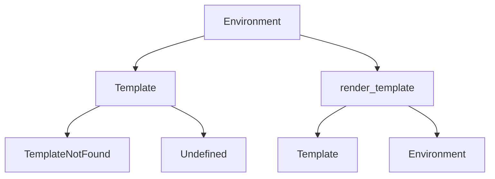

# `src`

## Tree:
    src/
    └── jinja2/

## Role:
    Provides Jinja2 template rendering and processing capabilities for dynamic content generation

## Description:
    The jinja2 module serves as the core templating engine for the application, handling template parsing, rendering, and management. It provides the interface between template definitions and data binding for generating dynamic content. This module is used throughout the application wherever templated content needs to be generated, such as HTML pages, configuration files, or any structured output requiring variable substitution.

    The module is grouped separately to encapsulate all templating-related functionality, creating a clean boundary between presentation logic and business logic. This separation allows for easier maintenance, testing, and potential replacement of the templating engine without affecting other parts of the system.

## Components:
    - Environment: Main class for configuring and managing template environments
    - Template: Class representing individual templates  
    - render_template: Function for rendering templates with provided context
    - TemplateNotFound: Exception raised when a template cannot be located
    - Undefined: Base class for undefined variable handling

## Public API:
    - Environment(config: dict = None): Initializes a Jinja2 environment with optional configuration
    - Template(source: str, environment: Environment): Creates a template from source string with given environment  
    - render_template(template_name: str, context: dict): Renders a named template with provided context data
    - TemplateNotFound: Exception class for missing template files
    - Undefined: Base class for handling undefined variables in templates

## Dependencies:
    - Internal: None
    - External: jinja2 library (for actual templating functionality)

## Constraints:
    - Templates must be properly formatted Jinja2 syntax
    - Context dictionaries must contain all required variables for template rendering
    - Environment configuration must be set before template operations
    - Thread-safe for concurrent template rendering operations

