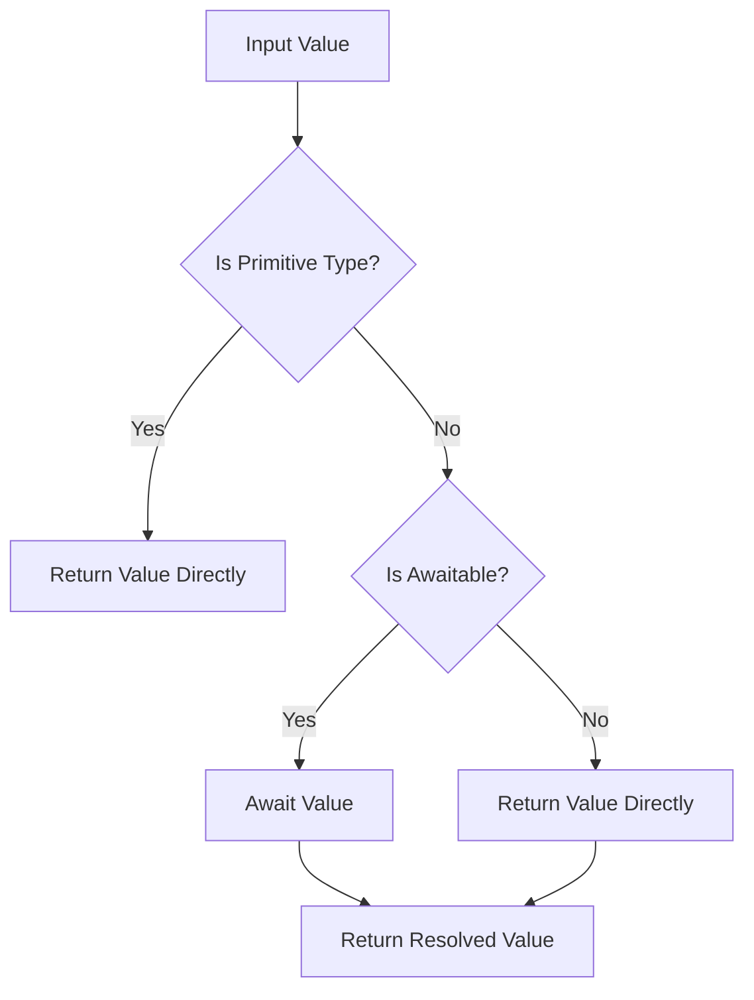
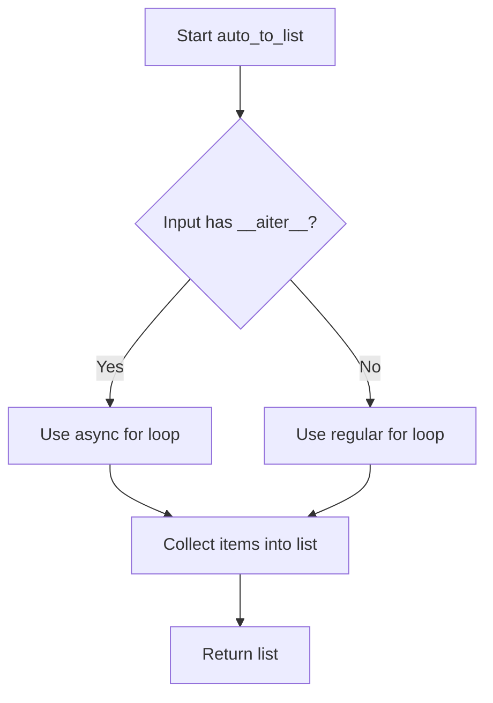

# `async_utils.py`

## `src.jinja2.async_utils.async_variant` · *function*

## Summary:
Creates a hybrid synchronous/asynchronous function variant that automatically selects the appropriate implementation based on the execution context.

## Description:
This decorator factory enables defining both synchronous and asynchronous versions of a function, with automatic selection based on whether the calling context is synchronous or asynchronous. It's commonly used in Jinja2 template rendering where functions need to work in both sync and async environments.

The decorator works by creating a wrapper function that inspects the first argument to determine if the execution context is asynchronous, then delegates to either the synchronous or asynchronous implementation accordingly. When the synchronous function requires an evaluation context (indicated by `jinja_pass_arg` being None), the wrapper handles argument shifting appropriately.

## Args:
    normal_func (callable): The synchronous version of the function to be wrapped

## Returns:
    callable: A decorator function that accepts an asynchronous version and returns a hybrid wrapper

## Raises:
    None explicitly raised - behavior depends on underlying functions

## Constraints:
    Preconditions:
    - The first argument to the wrapper function must be an object with either an `is_async` attribute or an `environment` attribute containing an `is_async` attribute
    - The normal_func and async_func must have compatible signatures (except for async/sync differences)
    - The normal_func should either have a `jinja_pass_arg` attribute or not (when `pass_arg is None`)
    
    Postconditions:
    - The returned wrapper function will execute either the normal or async version based on context
    - The wrapper function will have the same signature as the normal function (with potential argument shifting)
    - The wrapper function will have `jinja_async_variant = True` attribute set

## Side Effects:
    None - This is a pure function transformation that doesn't modify external state

## Control Flow:
```mermaid
flowchart TD
    A[Wrapper called with args] --> B{pass_arg is None?}
    B -- Yes --> C[Skip first arg: args = args[1:]]
    B -- No --> D[Use all args as-is]
    C --> E{First arg has is_async?}
    D --> E
    E --> F{is_async == True?}
    F -- Yes --> G[Call async_func with args]
    F -- No --> H[Call normal_func with args]
    G --> I[Return async result]
    H --> I
    I --> J[Return result]
```

## Examples:
```python
# Define synchronous version
@async_variant
def my_function(value):
    return f"sync: {value}"

# Define asynchronous version  
async def my_function_async(value):
    return f"async: {value}"

# The wrapper will automatically choose the right version
# based on the execution context
result = my_function("test")  # Will call sync version

# When used in async context, it would call the async version
# This is determined by checking args[0].is_async or args[0].environment.is_async
```

## `src.jinja2.async_utils.auto_await` · *function*

## Summary:
Asynchronously resolves awaitable values while passing through non-awaitable values unchanged.

## Description:
This utility function transparently handles both synchronous and asynchronous values by automatically awaiting any awaitable objects while returning non-awaitable values directly. It serves as a bridge between synchronous and asynchronous code contexts, ensuring consistent handling of mixed-value types in async environments.

The function is extracted into its own utility to provide a clean abstraction for managing the uncertainty of whether a value is already resolved or still needs to be awaited, preventing the need to manually check and await values throughout the codebase.

## Args:
    value (Union[Awaitable[V], V]): A value that may be either an awaitable object or a regular value of type V. The type V represents the expected return type after resolution.

## Returns:
    V: The resolved value, either directly returned if not awaitable, or awaited and returned if it was an awaitable. The return type matches the resolved type of the input.

## Raises:
    None explicitly raised - the function delegates await exceptions to the caller when awaiting awaitables

## Constraints:
    Preconditions:
    - The input value must be either a regular value or an awaitable object
    - The type parameter V should be consistent across the call chain
    
    Postconditions:
    - Returns a value of the same type as the input's resolved form
    - If input was awaitable, the result represents the awaited value
    - If input was not awaitable, the result equals the input value

## Side Effects:
    None - This function is pure and doesn't modify external state

## Control Flow:


## Examples:
```python
# Usage with awaitable
async def fetch_data():
    return "result"

result = await auto_await(fetch_data())  # Returns "result" after awaiting

# Usage with regular value
value = "hello"
result = await auto_await(value)  # Returns "hello" directly

# Usage in async context with mixed values
async def process_values(values):
    results = []
    for val in values:
        processed = await auto_await(val)  # Handles both sync and async values
        results.append(processed)
    return results
```

## `src.jinja2.async_utils.auto_aiter` · *function*

*No documentation generated.*

## `src.jinja2.async_utils.auto_to_list` · *function*

## Summary:
Converts an async or synchronous iterable into a list by asynchronously iterating over its elements.

## Description:
This function provides a unified interface for converting both synchronous and asynchronous iterables into lists. It leverages the `auto_aiter` utility to handle both types of iterables seamlessly, making it useful in contexts where the input type may vary between sync and async.

## Args:
    value: An iterable that can be either synchronous or asynchronous. Must implement either `__aiter__` method for async iterables or standard iteration protocol for sync iterables.

## Returns:
    A list containing all elements from the input iterable, retrieved asynchronously.

## Raises:
    None explicitly raised - relies on underlying iteration mechanisms which may raise exceptions during iteration.

## Constraints:
    Precondition: The input must be an iterable that implements either the async iteration protocol (`__aiter__`) or standard iteration protocol.
    Postcondition: The returned value is always a list containing all elements from the input iterable.

## Side Effects:
    None - this function is pure and doesn't cause any I/O operations or external state mutations.

## Control Flow:


## Examples:
```python
# With a synchronous list
sync_list = [1, 2, 3]
result = await auto_to_list(sync_list)  # Returns [1, 2, 3]

# With an async generator
async def async_gen():
    for i in range(3):
        yield i

result = await auto_to_list(async_gen())  # Returns [0, 1, 2]
```

