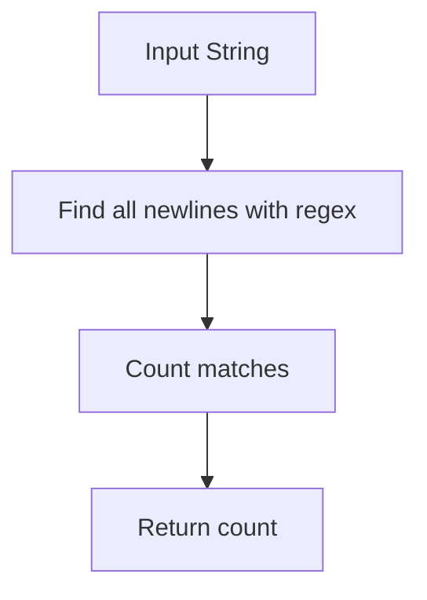
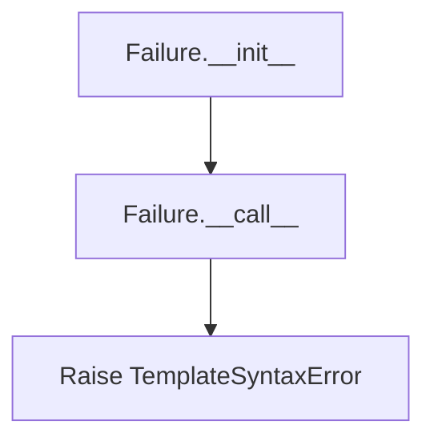
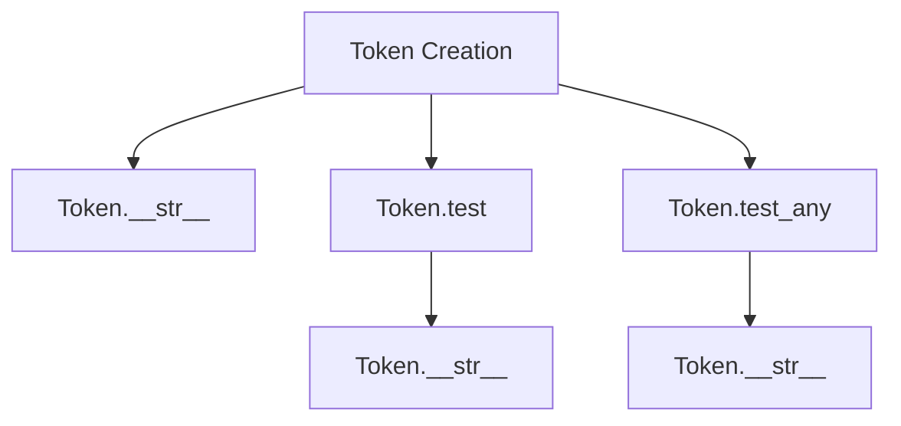
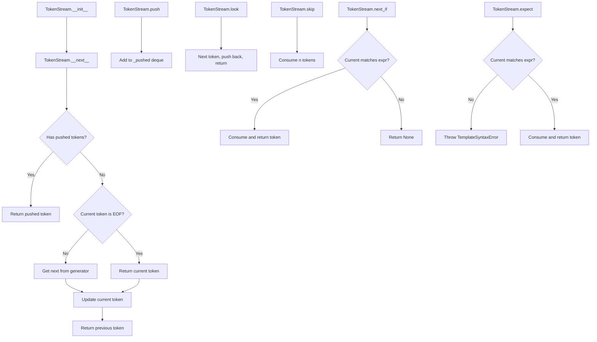
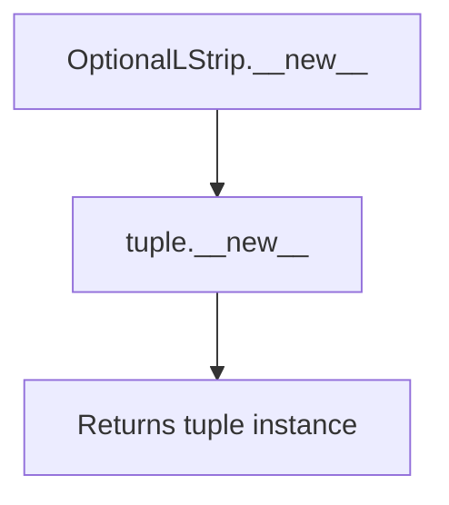
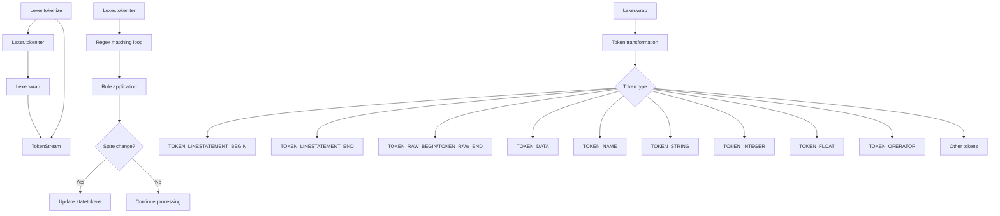

# `lexer.py`

## `src.jinja2.lexer._describe_token_type` · *function*

## Summary:
Converts internal token type identifiers into human-readable descriptive strings for debugging and error reporting.

## Description:
This utility function transforms internal token type names (such as 'TOKEN_COMMENT_BEGIN') into user-friendly descriptions that help identify the purpose of different token types in Jinja2 template parsing. It serves as a bridge between internal representation and human-readable explanations, primarily used for debugging and error message generation.

The function handles two categories of mappings:
1. Special operator tokens that are reversed (using a global `reverse_operators` dictionary)
2. Standard token types with predefined descriptive strings

This logic is extracted into its own function to centralize token type description logic and avoid duplication throughout the lexer codebase.

## Args:
    token_type (str): The internal token type identifier to convert to a descriptive string

## Returns:
    str: A human-readable description of the token type, or the original token_type if no mapping exists

## Raises:
    None explicitly raised

## Constraints:
    Preconditions:
    - The input token_type must be a string
    - The token_type should correspond to valid token types used in Jinja2's lexer
    
    Postconditions:
    - Always returns a string (either a description or the original token_type)
    - Never modifies the input parameter

## Side Effects:
    None

## Control Flow:
```mermaid
flowchart TD
    A[Start _describe_token_type] --> B{token_type in reverse_operators?}
    B -- Yes --> C[Return reverse_operators[token_type]]
    B -- No --> D[Lookup in token type dictionary]
    D --> E{Token found?}
    E -- Yes --> F[Return description]
    E -- No --> G[Return token_type]
```

## Examples:
    >>> _describe_token_type("TOKEN_COMMENT_BEGIN")
    "begin of comment"
    
    >>> _describe_token_type("TOKEN_EOF")
    "end of template"
    
    >>> _describe_token_type("UNKNOWN_TOKEN")
    "UNKNOWN_TOKEN"
```

## `src.jinja2.lexer.describe_token` · *function*

## Summary:
Returns a human-readable string representation of a token, showing either its value (for name tokens) or its descriptive type (for all other token types).

## Description:
Provides a string representation of a Token object that is useful for debugging and error reporting. For tokens of type TOKEN_NAME, this function returns the token's value directly (e.g., variable names like "user" or "items"). For all other token types, it returns a descriptive string representation by delegating to the internal `_describe_token_type` function.

This function is primarily used by the `Token.__str__` method to enable meaningful string representations of tokens during debugging sessions or error message generation.

## Args:
    token (Token): A token object containing line number, type, and value attributes

## Returns:
    str: For TOKEN_NAME tokens, returns the token's value; for all other tokens, returns a descriptive string representation of the token type

## Raises:
    None explicitly raised

## Constraints:
    Preconditions:
    - The token parameter must be a valid Token instance with properly initialized attributes
    - The token.type must be a string representing a valid token type
    
    Postconditions:
    - Always returns a string representation of the token
    - Never modifies the input token object

## Side Effects:
    None

## Control Flow:
```mermaid
flowchart TD
    A[describe_token called] --> B{token.type == TOKEN_NAME?}
    B -- Yes --> C[Return token.value]
    B -- No --> D[Return _describe_token_type(token.type)]
```

## Examples:
    >>> token = Token(1, "TOKEN_NAME", "username")
    >>> describe_token(token)
    "username"
    
    >>> token = Token(1, "TOKEN_OPERATOR", "+")
    >>> describe_token(token)
    "operator '+'"
    
    >>> token = Token(1, "TOKEN_EOF", "")
    >>> describe_token(token)
    "end of template"
```

## `src.jinja2.lexer.describe_token_expr` · *function*

## Summary:
Transforms token expression strings into human-readable descriptions by parsing type-value pairs or delegating to standard token type descriptions.

## Description:
Processes token expressions that may be in either "type:value" format or simple "type" format, returning appropriate descriptive strings for debugging and error reporting purposes. This function serves as a utility for converting internal token representations into user-friendly descriptions.

The function handles two distinct cases:
1. When the expression contains a colon separator, it splits into type and value components
2. When the type matches a special token name identifier, it returns the value portion directly
3. Otherwise, it delegates to the internal `_describe_token_type` function for standard token type descriptions

This logic is extracted into its own function to centralize token expression parsing and avoid duplication throughout the lexer codebase.

## Args:
    expr (str): A token expression string that may be in "type:value" format or simple "type" format

## Returns:
    str: Human-readable description of the token type, or the original value if it's a token name

## Raises:
    None explicitly raised by this function

## Constraints:
    Preconditions:
    - Input must be a string
    - If input contains ":", it must be properly formatted as "type:value"
    
    Postconditions:
    - Always returns a string describing the token type or value

## Side Effects:
    None

## Control Flow:
```mermaid
flowchart TD
    A[Start describe_token_expr] --> B{expr contains ":"}
    B -- Yes --> C[Split expr by ":"]
    C --> D{type equals TOKEN_NAME}
    D -- Yes --> E[Return value]
    D -- No --> F[Call _describe_token_type(type)]
    B -- No --> G[Set type = expr]
    G --> H[Call _describe_token_type(type)]
    E --> I[End]
    F --> I
    H --> I
```

## Examples:
    # Simple token type description
    describe_token_expr("TOKEN_COMMENT_BEGIN")  # Returns descriptive string from _describe_token_type
    
    # Token name case
    describe_token_expr("TOKEN_NAME:some_identifier")  # Returns "some_identifier"
    
    # Colon-separated expression
    describe_token_expr("TOKEN_OPERATOR:==")  # Returns descriptive string from _describe_token_type
```

## `src.jinja2.lexer.count_newlines` · *function*

## Summary:
Counts the number of newline characters in a given string.

## Description:
This function counts newline characters within a string using a regular expression pattern. It is used in the Jinja2 template lexer to track line numbers and position information during template parsing. The function finds all occurrences of newline sequences and returns their total count.

## Args:
    value (str): The input string to analyze for newline characters.

## Returns:
    int: The total count of newline characters found in the input string.

## Raises:
    None explicitly raised by this function.

## Constraints:
    Preconditions:
    - The input `value` must be a string type.
    
    Postconditions:
    - The return value is always a non-negative integer.
    - The function does not modify the input string.

## Side Effects:
    None.

## Control Flow:


## Examples:
    >>> count_newlines("hello\\nworld")
    1
    >>> count_newlines("line1\\nline2\\nline3")
    2
    >>> count_newlines("no newlines here")
    0
    >>> count_newlines("")
    0
```

## `src.jinja2.lexer.compile_rules` · *function*

*No documentation generated.*

## `src.jinja2.lexer.Failure` · *class*

## Summary:
A callable error factory that raises template syntax errors with line number and filename context.

## Description:
The `Failure` class serves as a utility for creating error-raising callables that produce `TemplateSyntaxError` exceptions with proper line number and filename information. It is typically used in Jinja2's lexer to handle syntax errors during template parsing by providing a consistent interface for raising errors with contextual information.

## State:
- `message` (str): The error message to be included in the raised exception
- `error_class` (Type[TemplateSyntaxError]): The exception class to raise, defaults to `TemplateSyntaxError`

## Lifecycle:
- Creation: Instantiate with an error message and optionally an error class
- Usage: Call the instance with `lineno` and `filename` parameters to raise the exception
- Destruction: No explicit cleanup required as it raises exceptions rather than maintaining state

## Method Map:


## Raises:
- TemplateSyntaxError (or subclass): Raised when the instance is called with lineno and filename parameters

## Example:
```python
# Create a failure handler
failure_handler = Failure("Unexpected end of template")

# Later in lexer code, raise error with context
failure_handler(15, "template.html")
# Raises: TemplateSyntaxError("Unexpected end of template", 15, "template.html")
```

### `src.jinja2.lexer.Failure.__init__` · *method*

## Summary:
Initializes a Failure handler with an error message and error class for later exception raising.

## Description:
Configures a Failure instance with the specified error message and exception class to be used when the instance is called as a function. This pattern allows for deferred exception creation with proper line number and filename context.

## Args:
    message (str): The error message to be included in the raised exception.
    cls (Type[TemplateSyntaxError], optional): The exception class to raise. Defaults to TemplateSyntaxError.

## Returns:
    None: This method does not return a value.

## Raises:
    None: This method does not raise exceptions directly.

## State Changes:
    Attributes READ: None
    Attributes WRITTEN: 
    - self.message: Stores the error message for later use
    - self.error_class: Stores the exception class for later use

## Constraints:
    Preconditions: 
    - message must be a string
    - cls must be a subclass of TemplateSyntaxError or compatible exception class
    Postconditions: 
    - self.message will contain the provided message string
    - self.error_class will contain the provided exception class

## Side Effects:
    None: This method performs no I/O operations or external service calls.

### `src.jinja2.lexer.Failure.__call__` · *method*

## Summary:
Raises a template syntax error with the stored message at the specified line number and file location.

## Description:
This method serves as a callable interface for raising template syntax errors. It is designed to be used as an error handler within the Jinja2 lexer's rule matching system. When a lexical pattern fails to match and a Failure object is encountered, this method is invoked to raise the appropriate exception with contextual information.

## Args:
    lineno (int): The line number in the template where the error occurred.
    filename (str): The name of the template file where the error occurred.

## Returns:
    None: This method never returns as it raises an exception.

## Raises:
    TemplateSyntaxError: Raised with the stored error message, line number, and filename.

## State Changes:
    Attributes READ: self.message, self.error_class
    Attributes WRITTEN: None

## Constraints:
    Preconditions: The Failure instance must have been properly initialized with a message and error class.
    Postconditions: This method always raises an exception and never returns normally.

## Side Effects:
    None: This method does not perform any I/O or mutate external state beyond raising an exception.

## `src.jinja2.lexer.Token` · *class*

## Summary:
Represents a lexical token produced by the Jinja2 template lexer, containing line number, token type, and token value information.

## Description:
The Token class serves as a fundamental data structure in Jinja2's template parsing process. It encapsulates the essential information about a parsed token: its line number in the template source, its type (such as NAME, OPERATOR, or STRING), and its actual value (like variable names or literal strings). This immutable data structure enables the parser to track and process template elements systematically.

Tokens are typically created by the Jinja2 lexer during the tokenization phase of template processing, where raw template text is converted into structured token sequences that can be parsed and compiled into executable code.

## State:
- lineno: int
  - Type: integer representing the line number in the source template where this token appears
  - Valid range: positive integers (1-based indexing)
  - Invariant: Must be a positive integer indicating a valid line position in the template source

- type: str  
  - Type: string identifying the category/type of the token
  - Valid values: Various predefined token types such as "TOKEN_NAME", "TOKEN_OPERATOR", "TOKEN_STRING", etc.
  - Invariant: Must be a valid token type identifier recognized by the Jinja2 parser

- value: str
  - Type: string containing the actual textual value of the token
  - Valid range: Any string representing the literal content captured by this token
  - Invariant: Must accurately represent the source text that was matched for this token

## Lifecycle:
- Creation: Tokens are instantiated by the Jinja2 lexer during template parsing, typically through direct construction like `Token(lineno, type, value)`
- Usage: Once created, tokens are immutable and used throughout the parsing and compilation phases for semantic analysis and code generation
- Destruction: No explicit cleanup required as tokens are simple immutable data structures

## Method Map:


## Raises:
- No exceptions are raised by the Token constructor as it's a simple NamedTuple
- All methods operate on the immutable token data and do not raise exceptions

## Example:
```python
# Creating a token for a variable name
token = Token(1, "TOKEN_NAME", "username")

# Using token methods for pattern matching
is_name = token.test("TOKEN_NAME")  # Returns True
is_operator = token.test("TOKEN_OPERATOR")  # Returns False

# Testing against multiple patterns
is_literal = token.test_any("TOKEN_STRING", "TOKEN_NUMBER", "TOKEN_NAME")  # Returns True

# String representation for debugging
print(str(token))  # Shows human-readable representation via describe_token
```

### `src.jinja2.lexer.Token.__str__` · *method*

## Summary:
Returns a human-readable string representation of the token for debugging and error reporting purposes.

## Description:
Provides a string representation of the Token object that displays either its value (for name tokens) or a descriptive type (for all other token types). This method is primarily used during debugging sessions or when generating error messages to make token identification easier.

The implementation delegates to the `describe_token` function, which handles the actual formatting logic based on the token type.

## Args:
    None

## Returns:
    str: For TOKEN_NAME tokens, returns the token's value; for all other tokens, returns a descriptive string representation of the token type

## Raises:
    None

## State Changes:
    Attributes READ: self.lineno, self.type, self.value
    Attributes WRITTEN: None

## Constraints:
    Preconditions:
    - The Token instance must be properly initialized with valid lineno, type, and value attributes
    - The token.type must represent a valid token type
    
    Postconditions:
    - Always returns a string representation of the token
    - Never modifies the Token instance

## Side Effects:
    None

### `src.jinja2.lexer.Token.test` · *method*

*No documentation generated.*

### `src.jinja2.lexer.Token.test_any` · *method*

## Summary:
Tests if the token matches any of the provided expression patterns.

## Description:
Determines whether the current token matches any of the given expression patterns by delegating to the token's `test` method for each pattern. This method enables efficient checking of multiple possible token types or type-value combinations in a single call.

## Args:
    *iterable (str): Variable-length argument list of expression patterns to test against the token. Each pattern can be either:
        - A token type string (e.g., "name", "number")
        - A type-value pair in the format "type:value" (e.g., "name:foo")

## Returns:
    bool: True if the token matches any of the provided expressions, False otherwise.

## Raises:
    None explicitly raised.

## State Changes:
    Attributes READ: self.type, self.value
    Attributes WRITTEN: None

## Constraints:
    Preconditions: The token must have valid type and value attributes.
    Postconditions: Returns a boolean indicating match status without modifying the token.

## Side Effects:
    None.

## `src.jinja2.lexer.TokenStreamIterator` · *class*

## Summary:
An iterator that traverses a token stream, yielding tokens one by one until reaching the end-of-file marker.

## Description:
The TokenStreamIterator provides an iterable interface for processing tokens from a Jinja2 template's lexical analysis phase. It allows sequential access to tokens while automatically handling stream management and EOF conditions. This class is typically created by the TokenStream class itself and should not be instantiated directly by users of the Jinja2 templating system.

## State:
- stream: TokenStream instance containing the tokens to iterate over
  - Type: TokenStream
  - Valid range: Must be a valid TokenStream object with tokens
  - Invariant: The stream must remain valid throughout iteration

## Lifecycle:
- Creation: Instantiated by TokenStream.__iter__() method, not directly by user code
- Usage: Called via standard Python iteration protocols (for loop, iter(), next())
- Destruction: Automatically cleaned up when StopIteration is raised or when the underlying stream is closed

## Method Map:
```mermaid
graph TD
    A[TokenStreamIterator.__iter__] --> B[Returns self]
    B --> C[TokenStreamIterator.__next__]
    C --> D{token.type is TOKEN_EOF?}
    D -- Yes --> E[stream.close()]
    D -- No --> F[next(stream)]
    F --> G[return token]
    E --> H[raise StopIteration]
```

## Raises:
- StopIteration: Raised when the end-of-file token is encountered, signaling the end of iteration

## Example:
```python
# Typical usage in Jinja2 internals
for token in token_stream:
    print(token.type, token.value)
# Automatically closes stream when EOF is reached
```

### `src.jinja2.lexer.TokenStreamIterator.__next__` · *method*

*No documentation generated.*

## `src.jinja2.lexer.TokenStream` · *class*

## Summary:
Manages a stream of lexical tokens for Jinja2 template processing, providing iteration and manipulation capabilities for token consumption.

## Description:
The TokenStream class serves as the primary interface for consuming tokens during Jinja2 template parsing. It wraps an iterable of tokens and provides methods for sequential consumption, lookahead, and token manipulation. The stream maintains internal state to support features like token pushing (backtracking) and efficient token consumption patterns typical in template parsers.

This class is typically created by the Jinja2 lexer during the tokenization phase and is consumed by the parser to build abstract syntax trees. It manages the flow of tokens from the lexer to the parser, supporting operations like peeking ahead, skipping tokens, and expecting specific token types.

## State:
- _iter: Iterator over the underlying token generator
  - Type: Iterator[Token]
  - Valid range: Any iterator that yields Token objects
  - Invariant: Must be a valid iterator that produces tokens

- _pushed: Deque storing temporarily pushed-back tokens
  - Type: Deque[Token]
  - Valid range: Empty or containing Token objects
  - Invariant: Contains only Token objects that were previously pushed back

- name: Optional identifier for the template source
  - Type: Optional[str]
  - Valid range: String or None
  - Invariant: Should be set once during initialization

- filename: Optional filename for the template source
  - Type: Optional[str]
  - Valid range: String or None
  - Invariant: Should be set once during initialization

- closed: Boolean flag indicating if the stream has been closed
  - Type: bool
  - Valid range: True or False
  - Invariant: Once True, remains True

- current: Current token being processed
  - Type: Token
  - Valid range: Any Token object, including special EOF tokens
  - Invariant: Must be a valid Token object representing the current position

## Lifecycle:
- Creation: Instantiate with a token generator and optional metadata (name, filename)
- Usage: Iterate through tokens using standard Python iteration or call methods like next(), push(), look(), skip(), expect()
- Destruction: Automatically handled by garbage collection; can be explicitly closed via close() method

## Method Map:


## Raises:
- TemplateSyntaxError: Raised by expect() method when the current token doesn't match the expected expression, with detailed error messages including line number, template name, and filename

## Example:
```python
# Create a token stream from a generator
token_stream = TokenStream(token_generator, "template_name", "template_file.html")

# Iterate through tokens
for token in token_stream:
    print(f"Token: {token.type} = {token.value}")

# Or consume tokens manually
token = next(token_stream)  # Get first token
if token.test("TOKEN_NAME"):
    print(f"Found variable: {token.value}")

# Look ahead at next token without consuming it
next_token = token_stream.look()

# Push a token back for reprocessing
token_stream.push(some_token)

# Expect a specific token type
expected_token = token_stream.expect("TOKEN_OPERATOR")
```

### `src.jinja2.lexer.TokenStream.__init__` · *method*

## Summary:
Initializes a TokenStream object with a token generator and metadata, preparing it for token iteration by setting up the initial state and consuming the first token.

## Description:
The TokenStream.__init__ method constructs a token stream from an iterable of tokens, establishing the foundational state needed for token consumption. It sets up internal tracking mechanisms including a deque for pushed tokens, stores metadata about the source template, and initializes the current token to a special initial state. The method concludes by advancing the stream to consume the first actual token from the generator.

This method is called during the creation of TokenStream instances, typically when a template is being lexed and tokenized. It's separated from inline initialization to ensure proper setup of the stream's internal state and to handle the initial token consumption in a controlled manner.

## Args:
    generator (t.Iterable[Token]): An iterable that yields Token objects representing the lexical tokens of a template
    name (t.Optional[str]): Optional name identifying the template source, used for error reporting
    filename (t.Optional[str]): Optional filename identifying the template source, used for error reporting

## Returns:
    None: This method initializes the object in-place and does not return a value

## Raises:
    None: This method does not explicitly raise exceptions, though underlying operations may raise exceptions from the generator or token creation

## State Changes:
    Attributes READ: None
    Attributes WRITTEN: 
    - self._iter: Set to iter(generator) to create an iterator from the token generator
    - self._pushed: Initialized as an empty deque for storing temporarily pushed tokens
    - self.name: Set to the provided name parameter
    - self.filename: Set to the provided filename parameter
    - self.closed: Set to False to indicate the stream is initially open
    - self.current: Set to Token(1, TOKEN_INITIAL, "") to establish the initial token state

## Constraints:
    Preconditions:
    - The generator parameter must be iterable and yield Token objects
    - The TOKEN_INITIAL constant must be defined in the module scope
    - The Token class must be properly defined with appropriate constructor signature
    
    Postconditions:
    - The TokenStream instance is ready for token consumption
    - self.closed is False
    - self.current contains the first token from the generator (after initial TOKEN_INITIAL setup)
    - The stream's internal state is properly initialized for subsequent token operations

## Side Effects:
    None: This method doesn't perform I/O operations or mutate external objects. However, calling next() on the generator may cause side effects if the generator itself has side effects.

### `src.jinja2.lexer.TokenStream.__iter__` · *method*

## Summary:
Returns an iterator that allows sequential traversal of tokens in the token stream.

## Description:
The `__iter__` method makes the `TokenStream` class iterable by returning a `TokenStreamIterator` instance. This enables standard Python iteration protocols such as `for` loops and `iter()` function calls to consume tokens from the stream sequentially. The method creates and returns a new iterator that maintains its own state for tracking iteration progress without affecting the parent `TokenStream`.

This design follows Python's iterator protocol and allows the `TokenStream` to be used seamlessly in iteration contexts while preserving the ability to access tokens through other methods like `next()`, `look()`, and `expect()`.

## Args:
    None

## Returns:
    TokenStreamIterator: An iterator object that yields tokens from this token stream one by one until reaching the end-of-file marker.

## Raises:
    None

## State Changes:
    Attributes READ: 
    - None (method doesn't read any instance attributes)

    Attributes WRITTEN: 
    - None (method doesn't modify any instance attributes)

## Constraints:
    Preconditions:
    - The `TokenStream` instance must be properly initialized
    - The underlying token generator must be valid and capable of producing tokens
    
    Postconditions:
    - The returned `TokenStreamIterator` is ready to yield tokens from the beginning of the stream
    - The original `TokenStream` remains unchanged and usable for other operations

## Side Effects:
    None

### `src.jinja2.lexer.TokenStream.__bool__` · *method*

## Summary:
Returns whether the token stream has more tokens available for consumption.

## Description:
This method implements the boolean conversion protocol (`__bool__`) for the TokenStream class. It determines if the token stream is "truthy" by checking if there are unparsed tokens remaining in the stream. This allows the token stream to be used in boolean contexts such as `if stream:` or `while stream:` loops.

The method returns True when either:
1. There are pushed tokens that haven't been consumed yet (via the push() mechanism)
2. The current token is not the end-of-file marker (TOKEN_EOF)

This design enables efficient token stream iteration and peeking operations while maintaining proper end-of-stream detection.

## Args:
    None

## Returns:
    bool: True if the token stream has more tokens available, False otherwise.

## Raises:
    None

## State Changes:
    Attributes READ: 
    - self._pushed: deque of pushed tokens that haven't been consumed yet
    - self.current: the current token being processed
    - self.current.type: type of the current token

    Attributes WRITTEN: None

## Constraints:
    Preconditions:
    - The TokenStream instance must be properly initialized
    - self.current must be a valid Token object with a .type attribute
    
    Postconditions:
    - The method does not modify the token stream state
    - The returned value accurately reflects whether more tokens are available

## Side Effects:
    None

### `src.jinja2.lexer.TokenStream.eos` · *method*

## Summary:
Returns whether the token stream has reached end-of-stream.

## Description:
Determines if the current token stream position is at the end of the token sequence. This property is commonly used in parsing loops to detect when all tokens have been consumed.

## Args:
    None

## Returns:
    bool: True if the token stream is at end-of-stream (no more tokens available), False otherwise.

## Raises:
    None

## State Changes:
    Attributes READ: None (reads no instance attributes directly)
    Attributes WRITTEN: None (modifies no instance attributes)

## Constraints:
    Preconditions: None
    Postconditions: Returns a boolean indicating stream status

## Side Effects:
    None

### `src.jinja2.lexer.TokenStream.push` · *method*

## Summary:
Appends a token to the internal deque of pushed-back tokens, making it available for subsequent retrieval from the token stream.

## Description:
The `push` method adds a token to the front of the `_pushed` deque, effectively placing it back into the token stream for future consumption. This mechanism enables parsers to implement lookahead operations and recover from parsing decisions by temporarily returning tokens to the stream. The method is a fundamental building block for token management in Jinja2's template parsing system.

This logic is implemented as a separate method rather than being inlined because it provides a clean abstraction for token manipulation and allows other methods in the TokenStream class (like `look`) to reuse this functionality consistently. It also makes the token stream's behavior predictable and testable.

## Args:
    token (Token): The token to be pushed back onto the stream. Must be a valid Token instance with lineno, type, and value attributes.

## Returns:
    None: This method does not return any value.

## Raises:
    None: This method does not explicitly raise any exceptions.

## State Changes:
    Attributes READ: 
    - None: This method only accesses self._pushed for appending
    
    Attributes WRITTEN:
    - self._pushed: Appended with the provided token, increasing the deque size by one

## Constraints:
    Preconditions:
    - The TokenStream instance must be in a valid state (not closed)
    - The token parameter must be a valid Token instance
    - The token must have appropriate lineno, type, and value attributes
    
    Postconditions:
    - The provided token is added to the beginning of the _pushed deque
    - The token stream's logical position is unaffected
    - The token will be returned by the next call to next() if no other tokens are available in _pushed

## Side Effects:
    None: This method performs no I/O operations or external service calls. It only modifies the internal state of the TokenStream instance.

### `src.jinja2.lexer.TokenStream.look` · *method*

## Summary:
Peeks at the next token in the stream without consuming it, enabling lookahead for parsing decisions.

## Description:
The `look` method implements a peek operation that temporarily advances the token stream to examine the next token without permanently consuming it. This is essential for predictive parsing where grammar rules require looking ahead to make parsing decisions. The method saves the current token, advances to the next token, pushes the saved token back onto the stream, restores the original token as current, and returns the token that was advanced to.

This method is typically used during template parsing when the parser needs to inspect upcoming tokens without advancing the parse position. It's particularly useful for implementing grammar rules that depend on subsequent tokens, such as determining whether a token is followed by an operator or another construct.

## Args:
    None

## Returns:
    Token: The next token in the stream, which becomes the current token after the operation completes

## Raises:
    TemplateSyntaxError: When attempting to look past the end of the token stream, though this is typically handled internally by the underlying stream mechanics

## State Changes:
    Attributes READ: 
    - self.current: The current token in the stream
    - self._pushed: The deque of pushed-back tokens
    
    Attributes WRITTEN:
    - self.current: Updated to the token that was previously next in the stream
    - self._pushed: Modified by pushing the current token back onto the queue

## Constraints:
    Preconditions:
    - The TokenStream must be in a valid state (not closed)
    - There must be at least one more token available in the stream
    
    Postconditions:
    - The returned token is the same as what would be returned by calling `next()` 
    - The current token is restored to its original value
    - The token stream maintains its logical position

## Side Effects:
    None

### `src.jinja2.lexer.TokenStream.skip` · *method*

## Summary:
Advances the token stream by skipping a specified number of tokens, updating the current token position to the token that follows the skipped ones.

## Description:
The skip method advances the internal token stream cursor by consuming and discarding a specified number of tokens. This is useful during template parsing when certain tokens need to be consumed without further processing, allowing the parser to efficiently move past them while maintaining proper stream synchronization.

This method is typically invoked during parsing phases when the parser needs to consume tokens that are not of immediate interest but must be processed to maintain proper token stream positioning.

## Args:
    n (int): Number of tokens to skip forward. Defaults to 1. Must be a non-negative integer.

## Returns:
    None: This method does not return any value.

## Raises:
    StopIteration: May be raised when attempting to skip beyond the end of the token stream, though this is typically handled internally by the underlying token stream mechanism.

## State Changes:
    Attributes READ: 
        - self.current: The current token being examined
        - self._pushed: Queue of pushed-back tokens (if any)
        - self._iter: Iterator over the original token source
    
    Attributes WRITTEN:
        - self.current: Updated to point to the new current token after skipping
        - The method may modify self._pushed when tokens are consumed from it

## Constraints:
    Preconditions:
        - The TokenStream must not be closed (self.closed should be False)
        - The token stream must contain at least n tokens remaining
        - n must be a non-negative integer
    
    Postconditions:
        - The internal cursor (self.current) will be advanced by exactly n positions
        - The method will not modify any external state beyond the token stream itself
        - After execution, self.current will reference the token that was n positions ahead of the original position

## Side Effects:
    None: This method does not perform any I/O operations or mutate external objects. It only modifies the internal state of the TokenStream instance.

### `src.jinja2.lexer.TokenStream.next_if` · *method*

## Summary:
Advances the token stream and returns the next token if it matches the specified expression pattern, otherwise returns None.

## Description:
The `next_if` method provides a conditional token advancement mechanism for the Jinja2 template lexer. It tests whether the current token matches a given expression pattern and, if so, consumes and returns the next token in the stream. This method is commonly used in parsing contexts where certain tokens are expected but optional, allowing parsers to gracefully handle missing tokens without throwing exceptions.

This method is particularly useful in grammar rules where a token may or may not be present, enabling clean parsing without requiring explicit lookahead mechanisms. It's part of the TokenStream class and integrates with the existing token consumption infrastructure.

## Args:
    expr (str): A token expression pattern to test against the current token. This can be a token type (like "TOKEN_NAME") or a type-value pair (like "TOKEN_OPERATOR:+").

## Returns:
    Token or None: Returns the next token in the stream if the current token matches the expression pattern, otherwise returns None.

## Raises:
    None explicitly raised by this method, though underlying operations may raise exceptions from the token stream iteration.

## State Changes:
    Attributes READ: self.current
    Attributes WRITTEN: self.current (when advancing to next token)

## Constraints:
    Preconditions:
    - The TokenStream must be in a valid state (not closed)
    - The current token must be properly initialized
    - The expr parameter must be a valid token expression string
    
    Postconditions:
    - If the current token matches the expression, self.current is advanced to the next token
    - If the current token doesn't match, self.current remains unchanged
    - The method returns either the next token or None

## Side Effects:
    None

### `src.jinja2.lexer.TokenStream.skip_if` · *method*

## Summary:
Skips the current token if it matches the specified expression pattern, returning whether a match occurred.

## Description:
The `skip_if` method provides a convenient way to conditionally consume tokens from a Jinja2 template lexer's token stream. It tests whether the current token matches a given expression pattern and, if so, advances the stream to the next token and returns True. If the current token doesn't match the pattern, it leaves the stream unchanged and returns False.

This method is commonly used in parsing contexts where certain tokens are optional, allowing parsers to gracefully advance through the token stream without requiring explicit error handling for missing tokens. It's particularly useful in grammar rules where tokens may or may not be present.

## Args:
    expr (str): A token expression pattern to test against the current token. This can be a token type (like "TOKEN_NAME") or a type-value pair (like "TOKEN_OPERATOR:+").

## Returns:
    bool: True if the current token matched the expression pattern and was consumed, False otherwise.

## Raises:
    None explicitly raised by this method, though underlying operations may raise exceptions from the token stream iteration.

## State Changes:
    Attributes READ: self.current
    Attributes WRITTEN: self.current (when advancing to next token)

## Constraints:
    Preconditions:
    - The TokenStream must be in a valid state (not closed)
    - The current token must be properly initialized
    - The expr parameter must be a valid token expression string
    
    Postconditions:
    - If the current token matches the expression, self.current is advanced to the next token
    - If the current token doesn't match, self.current remains unchanged
    - The method returns True if a token was consumed, False otherwise

## Side Effects:
    None

### `src.jinja2.lexer.TokenStream.__next__` · *method*

## Summary:
Returns the current token from the token stream and advances the internal pointer to the next token, supporting token pushing functionality.

## Description:
This method implements the iterator protocol's `__next__` method for the TokenStream class. It returns the current token and advances the stream position to the next token. When tokens have been pushed back onto the stream via the `push()` method, those tokens are returned before consuming from the underlying iterator. This allows for lookahead and backtracking capabilities in template parsing.

## Args:
    None

## Returns:
    Token: The token that was current before advancing the stream pointer.

## Raises:
    None explicitly raised, but may raise StopIteration indirectly through the underlying iterator when the stream is exhausted.

## State Changes:
    Attributes READ: self.current, self._pushed, self._iter
    Attributes WRITTEN: self.current

## Constraints:
    Preconditions: The TokenStream must be initialized and not closed.
    Postconditions: After calling, self.current will reference the next token in the stream, or TOKEN_EOF if the stream is exhausted.

## Side Effects:
    None

### `src.jinja2.lexer.TokenStream.close` · *method*

## Summary:
Marks the token stream as closed and terminates further token iteration.

## Description:
The close method signals that token processing has completed or encountered an error, transitioning the token stream into a terminal state. This method is typically invoked when the lexer has exhausted all tokens or when an error condition occurs during parsing.

## Args:
    None

## Returns:
    None

## Raises:
    None

## State Changes:
    Attributes READ: self.current, self._iter, self.closed
    Attributes WRITTEN: self.current, self._iter, self.closed

## Constraints:
    Preconditions: The TokenStream instance must be in a valid state
    Postconditions: The stream is marked as closed, current token becomes EOF, and iteration is terminated

## Side Effects:
    None

### `src.jinja2.lexer.TokenStream.expect` · *method*

## Summary:
Validates that the current token matches an expected expression, advancing the stream to the next token if successful or raising a syntax error if not.

## Description:
The `expect` method serves as a critical validation mechanism in Jinja2's template parsing process. It ensures that the current token in the token stream conforms to an expected pattern or type before proceeding with parsing. When the current token doesn't match the expected expression, it provides detailed error messages indicating what was expected versus what was actually encountered.

This method is commonly used in parser rules where specific token sequences are required for proper template syntax interpretation. It's designed to be called during template parsing to enforce grammar rules and provide clear feedback when templates contain syntax errors.

## Args:
    expr (str): A token expression string that specifies the expected token type or pattern. This can be a simple token type (like "TOKEN_NAME") or a colon-separated format (like "TOKEN_OPERATOR:+").

## Returns:
    Token: The next token in the stream, which matches the expected expression, after advancing the stream pointer.

## Raises:
    TemplateSyntaxError: Raised when the current token does not match the expected expression. Two variants exist:
        1. When encountering end-of-file unexpectedly: "unexpected end of template, expected {expr!r}."
        2. When encountering an unexpected token: "expected token {expr!r}, got {describe_token(current)!r}"

## State Changes:
    Attributes READ: 
    - self.current: The current token being validated
    - self.name: Template name for error reporting
    - self.filename: Template filename for error reporting
    - self.current.type: Token type for comparison
    - self.current.lineno: Line number for error reporting
    - self.current.value: Token value for comparison (when expr contains ":")
    
    Attributes WRITTEN:
    - self.current: Updated to point to the next token in the stream (via next(self))

## Constraints:
    Preconditions:
    - The TokenStream must not be closed
    - The current token must be valid (not None)
    - The expr parameter must be a valid token expression string
    
    Postconditions:
    - If successful, the stream advances to the next token
    - If unsuccessful, a TemplateSyntaxError is raised with detailed context
    - The returned token is guaranteed to match the expected expression

## Side Effects:
    None beyond advancing the token stream iterator and potentially raising exceptions.

## `src.jinja2.lexer.get_lexer` · *function*

*No documentation generated.*

## `src.jinja2.lexer.OptionalLStrip` · *class*

## Summary:
A specialized tuple subclass used to represent optional left strip markers in Jinja2 template parsing.

## Description:
The OptionalLStrip class is a tuple-based container designed to hold marker values that indicate optional left whitespace stripping behavior in Jinja2 template processing. It serves as a lightweight wrapper around tuple data that can be used to track or represent lstrip options during template tokenization and parsing.

This class is likely used internally by Jinja2's lexer to manage state information related to template syntax elements that may or may not require left whitespace stripping, such as template tags or expressions.

## State:
- Inherits all state from tuple parent class
- Stores member elements passed during instantiation
- No additional instance attributes due to `__slots__ = ()`

## Lifecycle:
- Creation: Instantiate with zero or more arguments that become tuple elements
- Usage: Used as immutable container for lstrip-related data in template parsing
- Destruction: Managed automatically by Python's garbage collector

## Method Map:


## Raises:
- No explicit exceptions raised by __new__
- Inherited tuple construction behavior applies (e.g., TypeError for invalid arguments)

## Example:
```python
# Create an OptionalLStrip with no elements
lstrip_marker = OptionalLStrip()

# Create an OptionalLStrip with elements
lstrip_marker = OptionalLStrip('lstrip', 'optional')

# Use as tuple
print(len(lstrip_marker))  # 2
print(lstrip_marker[0])    # 'lstrip'
```

### `src.jinja2.lexer.OptionalLStrip.__new__` · *method*

*No documentation generated.*

## `src.jinja2.lexer._Rule` · *class*

*No documentation generated.*

## `src.jinja2.lexer.Lexer` · *class*

## Summary:
The Lexer class is responsible for converting Jinja2 template source text into a stream of structured tokens that can be parsed and compiled into executable code.

## Description:
The Lexer class implements the lexical analysis phase of Jinja2 template processing. It takes raw template source code and breaks it down into meaningful tokens such as variables, operators, literals, and structural elements. The lexer handles various template constructs including variables (`{{ }}`), control blocks (``), comments (`{# #}`), and raw content blocks.

This class is typically instantiated by the Jinja2 environment and used internally during template compilation. It's designed to work with configurable template syntax through the Environment object, allowing customization of delimiters and other parsing behaviors.

## State:
- environment: Environment
  - Type: Environment object
  - Valid range: Any valid Jinja2 Environment instance
  - Invariant: Must be set during initialization and remain constant

- lstrip_blocks: bool
  - Type: boolean
  - Valid range: True or False
  - Invariant: Set from environment.lstrip_blocks during initialization

- newline_sequence: str
  - Type: string
  - Valid range: Typically '\n', '\r\n', or '\r'
  - Invariant: Set from environment.newline_sequence during initialization

- keep_trailing_newline: bool
  - Type: boolean
  - Valid range: True or False
  - Invariant: Set from environment.keep_trailing_newline during initialization

- rules: dict[str, list[_Rule]]
  - Type: Dictionary mapping state names to lists of _Rule objects
  - Valid range: Keys are state identifiers, values are lists of tokenization rules
  - Invariant: Populated during initialization based on environment configuration

## Lifecycle:
- Creation: Instantiate with an Environment object to configure parsing behavior
- Usage: Call tokenize() method to convert source text into a TokenStream
- Destruction: Managed automatically by Python's garbage collector

## Method Map:


## Raises:
- TemplateSyntaxError: Raised during tokenization when encountering malformed syntax, unmatched delimiters, or invalid identifiers
- RuntimeError: Raised when regex patterns yield empty matches without stack changes

## Example:
```python
from jinja2 import Environment
from jinja2.lexer import Lexer

# Create environment with default settings
env = Environment()

# Create lexer instance
lexer = Lexer(env)

# Tokenize a simple template
source = "{{ name }} is {{ age }} years old."
token_stream = lexer.tokenize(source, "example_template")

# Iterate through tokens
for token in token_stream:
    print(f"Line {token.lineno}: {token.type} = {repr(token.value)}")
```

### `src.jinja2.lexer.Lexer.__init__` · *method*

## Summary:
Initializes a Jinja2 template lexer with environment-specific configuration and tokenization rules.

## Description:
Configures the lexer instance by setting up regular expression patterns and parsing rules based on the provided environment's template syntax settings. This method establishes the core tokenization framework that enables the lexer to properly parse Jinja2 template syntax including blocks, variables, comments, and raw sections.

## Args:
    environment (Environment): The Jinja2 environment containing template syntax configuration such as block delimiters, comment delimiters, and variable delimiters.

## Returns:
    None: This method initializes instance attributes and does not return a value.

## Raises:
    None explicitly raised, though regex compilation could raise re.error if patterns are malformed.

## State Changes:
    Attributes READ: environment.block_start_string, environment.block_end_string, environment.comment_end_string, environment.variable_end_string, environment.trim_blocks, environment.lstrip_blocks, environment.newline_sequence, environment.keep_trailing_newline, environment.line_statement_prefix, environment.line_comment_prefix, environment.comment_start_string, environment.variable_start_string
    Attributes WRITTEN: self.lstrip_blocks, self.newline_sequence, self.keep_trailing_newline, self.rules

## Constraints:
    Preconditions: The environment parameter must be a valid Environment instance with properly configured template syntax properties.
    Postconditions: The lexer instance will have self.rules populated with tokenization rules for all supported template constructs, and environment-related attributes will be copied to the lexer instance.

## Side Effects:
    None: This method only initializes internal state and does not perform I/O operations or mutate external objects.

### `src.jinja2.lexer.Lexer.tokenize` · *method*

*No documentation generated.*

### `src.jinja2.lexer.Lexer.wrap` · *method*

## Summary:
Processes and transforms raw token streams into standardized Token objects with type normalization and value conversion.

## Description:
The wrap method serves as a post-processing step in Jinja2's template tokenization pipeline. It takes raw token tuples from the lexer's token iteration process and converts them into Token objects while applying necessary transformations such as type normalization, value decoding, and syntax validation. This method ensures that tokens are in the correct format for subsequent template parsing stages.

This method is called during the tokenization process by the `tokenize` method, which calls `self.wrap(stream, name, filename)` after obtaining tokens from `self.tokeniter()`.

## Args:
    stream (Iterable[Tuple[int, str, str]]): An iterable of token tuples containing (line_number, token_type, value_string)
    name (Optional[str]): Name of the template being processed, used for error reporting
    filename (Optional[str]): Filename of the template being processed, used for error reporting

## Returns:
    Iterator[Token]: An iterator of Token objects with transformed values according to token type

## Raises:
    TemplateSyntaxError: When encountering invalid identifiers or parsing errors in string literals

## State Changes:
    Attributes READ: 
        - self._normalize_newlines (method)
    Attributes WRITTEN: None

## Constraints:
    Preconditions:
        - The stream parameter must be an iterable of tuples with three elements (line number, token type, value string)
        - Token types in the stream should be valid Jinja2 token identifiers
        - The name and filename parameters are optional but useful for error reporting
    Postconditions:
        - All returned tokens are Token objects with appropriate type and value transformations applied
        - Invalid identifiers will cause TemplateSyntaxError to be raised
        - String values are properly decoded with unicode escape sequences
        - Numeric values are converted to appropriate Python types (int, float)

## Side Effects:
    None - This method is pure and doesn't perform I/O or mutate external state beyond yielding Token objects.

### `src.jinja2.lexer.Lexer.tokeniter` · *method*

## Summary:
Converts Jinja2 template source code into an iterator of token tuples containing line numbers, token types, and token data.

## Description:
The `tokeniter` method processes template source code by applying regular expression patterns defined in the lexer's rule sets to identify and extract tokens. It implements a state-machine approach to handle different contexts like variables, blocks, comments, and raw sections. The method handles complex parsing scenarios including bracket/parenthesis balancing, whitespace stripping, and dynamic state transitions based on matched patterns.

This method is designed as a separate component because it encapsulates the entire tokenization logic with proper state management, error handling, and complex parsing rules that would be difficult to inline or integrate elsewhere in the lexer architecture.

## Args:
    source (str): The Jinja2 template source code to tokenize
    name (Optional[str]): Name of the template for error reporting
    filename (Optional[str]): Filename for error reporting
    state (Optional[str]): Initial parsing state ('variable', 'block', or None for root)

## Returns:
    Iterator[Tuple[int, str, str]]: An iterator yielding tuples of (line_number, token_type, token_data)

## Raises:
    TemplateSyntaxError: When encountering unexpected characters or unbalanced brackets/parentheses
    RuntimeError: When regex patterns yield empty strings without stack changes or fail to match dynamically

## State Changes:
    Attributes READ: 
        - self.rules: Dictionary mapping states to tokenization rules
        - self.keep_trailing_newline: Controls trailing newline handling
        - self.lstrip_blocks: Controls automatic whitespace stripping
    Attributes WRITTEN: 
        - None (method is stateless with respect to Lexer instance)

## Constraints:
    Preconditions:
        - source must be a valid string
        - state, if provided, must be 'variable', 'block', or None
        - All required constants (TOKEN_*) must be defined in the module scope
    Postconditions:
        - Method returns an iterator that yields valid token tuples
        - All bracket/parenthesis pairs are properly balanced
        - Whitespace stripping rules are consistently applied

## Side Effects:
    None (pure function with respect to external state)

