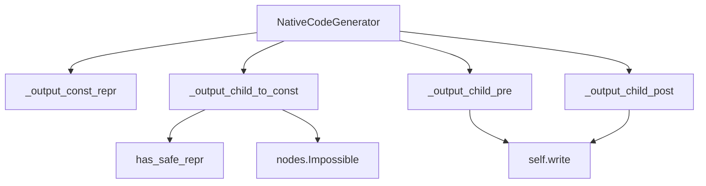
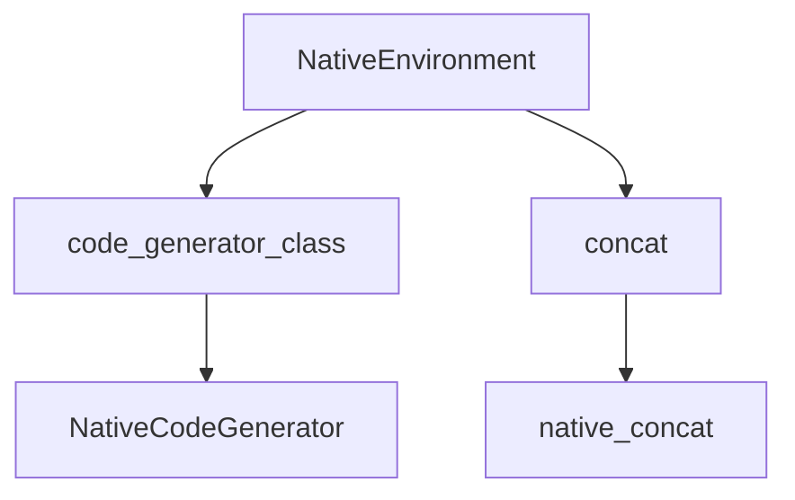

# `nativetypes.py`

## `src.jinja2.nativetypes.native_concat` · *function*

## Summary:
Concatenates iterable values and attempts to evaluate them as Python literals, returning the parsed result or the raw string if parsing fails.

## Description:
This function processes an iterable of values by first extracting the first two elements. If only one element exists and it's not a string, it returns that element directly. For multiple elements, it joins them as strings and attempts to parse the result as a Python literal expression using ast.literal_eval. If parsing fails due to syntax errors, value errors, or memory issues, it returns the raw concatenated string instead.

The function is designed to handle generators by properly chaining the initial elements with the remaining values, ensuring all elements are processed.

## Args:
    values (Iterable[Any]): An iterable of values to concatenate and potentially evaluate as Python literals

## Returns:
    Optional[Any]: The parsed Python literal if successful, otherwise the raw concatenated string, or None if the iterable is empty

## Raises:
    None explicitly raised - handles ValueError, SyntaxError, and MemoryError internally

## Constraints:
    Preconditions:
    - Input must be an iterable of any type
    - Values should be convertible to strings for concatenation
    
    Postconditions:
    - Returns either a parsed Python literal, the raw string, or None
    - If input is empty, returns None
    - If single non-string value, returns that value directly
    - If multiple values, returns either parsed result or raw string

## Side Effects:
    None

## Control Flow:
```mermaid
flowchart TD
    A[Start native_concat] --> B{values empty?}
    B -- Yes --> C[Return None]
    B -- No --> D{len(head) == 1?}
    D -- Yes --> E{isinstance(raw, str)?}
    E -- Yes --> F[Return raw]
    E -- No --> G[Return raw]
    D -- No --> H{isinstance(values, GeneratorType)?}
    H -- Yes --> I[chain(head, values)]
    H -- No --> J[Use values directly]
    J --> K[Join all values as strings]
    K --> L[Try literal_eval(parse(raw, mode="eval"))]
    L --> M{Parse succeeds?}
    M -- Yes --> N[Return parsed result]
    M -- No --> O[Return raw string]
```

## Examples:
    # Single non-string value
    native_concat([42])  # Returns 42
    
    # Single string value  
    native_concat(["hello"])  # Returns "hello"
    
    # Multiple values that form a valid literal
    native_concat([1, 2, 3])  # Returns "123" (as string) or parsed result if valid literal
    
    # Empty iterable
    native_concat([])  # Returns None
    
    # Generator input
    def gen(): yield 1; yield 2
    native_concat(gen())  # Returns "12" or parsed result if valid literal
```

## `src.jinja2.nativetypes.NativeCodeGenerator` · *class*

## Summary:
A specialized code generator for native Python types in Jinja2 template compilation.

## Description:
The NativeCodeGenerator class extends CodeGenerator to handle the compilation of Jinja2 template expressions that involve native Python types. It provides specialized implementations for generating Python code from template AST nodes that represent constant values, expressions, and native type operations.

This class is used internally by Jinja2's template compilation system when processing templates that contain native Python expressions, ensuring proper code generation for values that can be represented as Python literals or native types.

## State:
- Inherits all state from CodeGenerator parent class
- No additional instance attributes defined in this class
- Maintains standard CodeGenerator state for tracking compilation context, variables, and generated code

## Lifecycle:
- Creation: Instantiated automatically by Jinja2's template compilation system when compiling templates with native type expressions
- Usage: Called internally during template compilation when processing specific node types
- Destruction: Managed automatically by Python's garbage collection when template compilation completes

## Method Map:


## Raises:
- nodes.Impossible: Raised when attempting to generate code for values that don't have safe string representations via has_safe_repr()
- Inherited exceptions from CodeGenerator parent class

## Example:
```python
# This class is used internally by Jinja2 during template compilation
# When a template contains expressions like {{ "hello" }}, {{ 42 }}, etc.
# NativeCodeGenerator handles the compilation of these native type expressions

# Typical internal usage pattern:
# During template compilation:
# 1. Template AST is parsed
# 2. NativeCodeGenerator is selected for native type handling
# 3. Methods like _output_child_to_const are called to generate appropriate Python code
# 4. Final compiled template code is produced
```

### `src.jinja2.nativetypes.NativeCodeGenerator._default_finalize` · *method*

## Summary:
Returns the input value unchanged, serving as a default finalization handler.

## Description:
This static method acts as a default implementation for value finalization in Jinja2's native code generation process. It serves as a fallback mechanism when no specific finalization logic is required or when a simple passthrough behavior is desired. The method is typically used in template compilation contexts where values need to be processed through a finalization step, but no transformation is needed.

## Args:
    value (Any): The input value to be returned unchanged.

## Returns:
    Any: The same value that was passed as input.

## Raises:
    None: This method does not raise any exceptions.

## State Changes:
    Attributes READ: None
    Attributes WRITTEN: None

## Constraints:
    Preconditions: None
    Postconditions: The returned value is identical to the input value.

## Side Effects:
    None: This method has no side effects and is pure.

### `src.jinja2.nativetypes.NativeCodeGenerator._output_const_repr` · *method*

## Summary:
Creates a quoted string representation of a sequence of values by joining them and applying Python's repr() function.

## Description:
Converts an iterable of values into a quoted string representation by first converting each element to a string, joining them together, and then applying Python's built-in `repr()` function. This method is used during Jinja2 template compilation to generate constant string representations for template expressions, particularly when handling template data that needs to be represented as Python string literals.

This logic is separated into its own method rather than being inlined because it provides a reusable utility for creating consistent string representations of constant values in template code generation, and it ensures proper handling of various data types when they need to be converted to string constants in generated Python code.

## Args:
    group (Iterable[Any]): An iterable collection of values to be converted to strings and joined together

## Returns:
    str: A string representation of the joined values, wrapped with quotes (using repr())

## Raises:
    None explicitly raised: The method does not raise exceptions directly, though underlying operations like str() or join() may raise exceptions if elements in the group are not properly convertible

## State Changes:
    Attributes READ: None
    Attributes WRITTEN: None

## Constraints:
    Preconditions:
    - The group parameter must be iterable
    - Each element in the group must be convertible to a string via str()
    
    Postconditions:
    - Returns a string that represents the joined values with proper Python quoting
    - The result is equivalent to repr("".join([str(v) for v in group]))

## Side Effects:
    None: This method is pure and does not perform any I/O or mutate external state

### `src.jinja2.nativetypes.NativeCodeGenerator._output_child_to_const` · *method*

## Summary:
Converts a template expression node to a constant value with proper validation and finalization.

## Description:
Processes a Jinja2 template expression node to extract its constant value, ensuring the value has a safe string representation. This method handles special cases for TemplateData nodes while applying standard finalization to other constant expressions.

## Args:
    node (nodes.Expr): The template expression node to convert to a constant
    frame (Frame): The evaluation frame containing context information
    finalize (CodeGenerator._FinalizeInfo): Finalization information for processing the constant value

## Returns:
    Any: The processed constant value, either returned directly for TemplateData nodes or after finalization

## Raises:
    nodes.Impossible: When the constant value cannot be safely represented as a string

## State Changes:
    Attributes READ: None
    Attributes WRITTEN: None

## Constraints:
    Preconditions: 
    - The node must support conversion to a constant via `as_const()` method
    - The frame must contain valid evaluation context
    - The finalize parameter must be properly initialized
    
    Postconditions:
    - If node is TemplateData, returns the raw constant value
    - Otherwise, returns the finalized constant value
    - Always raises Impossible if constant has unsafe representation

## Side Effects:
    None

### `src.jinja2.nativetypes.NativeCodeGenerator._output_child_pre` · *method*

## Summary:
Writes a source string to the generated code when finalization requires it.

## Description:
This method serves as a pre-processing step in the code generation pipeline for Jinja2 templates. It is called before processing child nodes in expressions to handle proper syntax generation, specifically writing source code fragments when needed for finalization purposes.

The method is part of the NativeCodeGenerator class and works alongside `_output_child_post` to manage balanced syntax elements in generated code. It is typically invoked during template compilation when generating Python code from Jinja2 templates.

This logic is separated into its own method rather than being inlined because it handles a specific code generation pattern that may be reused across different node types, and it allows for consistent handling of syntax elements that need to be written before child processing begins.

## Args:
    node (nodes.Expr): The expression node being processed
    frame (Frame): The compilation frame containing execution context
    finalize (CodeGenerator._FinalizeInfo): Finalization information that may contain source formatting instructions

## Returns:
    None: This method performs I/O operations and does not return a value

## Raises:
    None explicitly raised: The method only performs conditional writing operations

## State Changes:
    Attributes READ: 
        - self (the generator instance)
        - finalize.src (accessed for conditional check)
    
    Attributes WRITTEN:
        - self (through the write() method which modifies the generated code buffer)

## Constraints:
    Preconditions:
        - The method assumes that `finalize` parameter contains valid _FinalizeInfo data
        - The `node` parameter must be a valid expression node
        - The `frame` parameter must contain valid compilation context
    
    Postconditions:
        - If `finalize.src` is not None, the source string is written to the output
        - No state changes occur beyond the potential write operation

## Side Effects:
    I/O: Writes to the generated code buffer via the self.write() method
    External service calls: None
    Mutations to objects outside self: None (only writes to internal buffer)

### `src.jinja2.nativetypes.NativeCodeGenerator._output_child_post` · *method*

## Summary:
Writes a closing parenthesis to the generated code when finalization requires it.

## Description:
This method serves as a post-processing step in the code generation pipeline for Jinja2 templates. It is called after processing child nodes in expressions to handle proper syntax balancing, specifically writing closing parentheses when needed for function calls or similar constructs.

The method is part of the NativeCodeGenerator class and is typically invoked as part of the template compilation process during code generation. It complements the `_output_child_pre` method which writes opening syntax elements.

## Args:
    node (nodes.Expr): The expression node being processed
    frame (Frame): The compilation frame containing execution context
    finalize (CodeGenerator._FinalizeInfo): Finalization information containing source formatting instructions

## Returns:
    None: This method performs I/O operations and does not return a value

## Raises:
    None explicitly raised: The method only performs conditional writing operations

## State Changes:
    Attributes READ: 
        - self (the generator instance)
        - finalize.src (accessed for conditional check)
    
    Attributes WRITTEN:
        - self (through the write() method which modifies the generated code buffer)

## Constraints:
    Preconditions:
        - The method assumes that `finalize` parameter contains valid _FinalizeInfo data
        - The `node` parameter must be a valid expression node
        - The `frame` parameter must contain valid compilation context
    
    Postconditions:
        - If `finalize.src` is not None, a closing parenthesis is written to the output
        - No state changes occur beyond the potential write operation

## Side Effects:
    I/O: Writes to the generated code buffer via the self.write() method
    External service calls: None
    Mutations to objects outside self: None (only writes to internal buffer)

## `src.jinja2.nativetypes.NativeEnvironment` · *class*

## Summary:
A Jinja2 environment subclass that configures native Python type handling for template compilation.

## Description:
The NativeEnvironment class extends Jinja2's base Environment class to provide specialized configuration for handling native Python types during template compilation. It customizes two key aspects of template processing: the code generator used for compilation and the concatenation method for combining template values.

This environment is intended for use cases where native Python type handling is preferred or required during template processing.

## State:
- Inherits all instance and class attributes from the parent Environment class
- `code_generator_class`: Class attribute set to NativeCodeGenerator, specifying which code generator class to use during template compilation
- `concat`: Class attribute set to staticmethod(native_concat), specifying the function to use for concatenating template values

## Lifecycle:
- Creation: Instantiated like any Jinja2 Environment subclass, typically through direct construction or via environment factories
- Usage: Automatically utilized by Jinja2's template compilation system when templates containing native type expressions are processed
- Destruction: Managed by Python's garbage collection when the environment instance is no longer referenced

## Method Map:


## Raises:
- No explicit exceptions defined in __init__ as it inherits from Environment
- Exceptions may occur during template compilation or rendering if underlying components raise them

## Example:
```python
from jinja2.nativetypes import NativeEnvironment

# Create a native environment instance
env = NativeEnvironment()

# This environment will use NativeCodeGenerator for compilation
# and native_concat for value concatenation
```

## `src.jinja2.nativetypes.NativeTemplate` · *class*

*No documentation generated.*

### `src.jinja2.nativetypes.NativeTemplate.render_async` · *method*

## Summary:
Asynchronously renders a template by processing its root render function with provided context and returning the concatenated result.

## Description:
This method executes the template rendering process in asynchronous mode, creating a context from provided arguments and yielding the rendered content through an async iteration over the root render function. The method ensures the environment is configured for async operation and properly handles exceptions by delegating to the environment's exception handling mechanism.

## Args:
    *args (t.Any): Positional arguments to be merged into the rendering context
    **kwargs (t.Any): Keyword arguments to be merged into the rendering context

## Returns:
    t.Any: The concatenated result of the asynchronous template rendering process

## Raises:
    RuntimeError: When the environment was not created with async mode enabled

## State Changes:
    Attributes READ: 
    - self.environment.is_async
    - self.environment_class
    - self.root_render_func
    - self.new_context
    - self.environment.handle_exception
    
    Attributes WRITTEN: None

## Constraints:
    Preconditions:
    - The environment must be initialized with async mode enabled (self.environment.is_async must be True)
    - The root_render_func must be callable and return an async iterable
    
    Postconditions:
    - Returns the concatenated string representation of the rendered template content
    - If an exception occurs during rendering, returns the result of environment.handle_exception()

## Side Effects:
    - May perform I/O operations during template rendering
    - Calls external methods from the environment and template system
    - May trigger exception handling mechanisms in the environment

