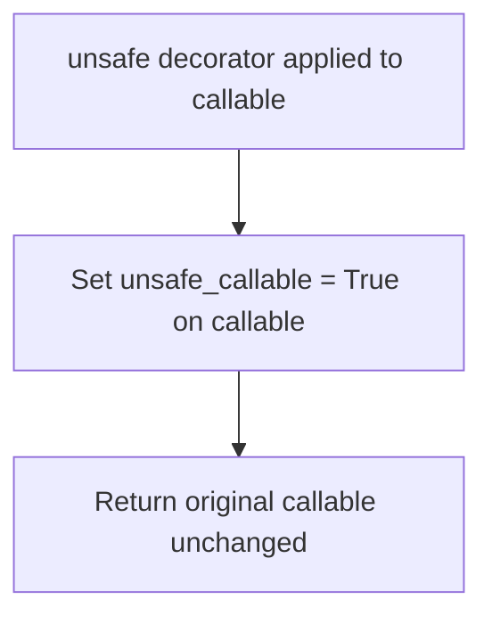
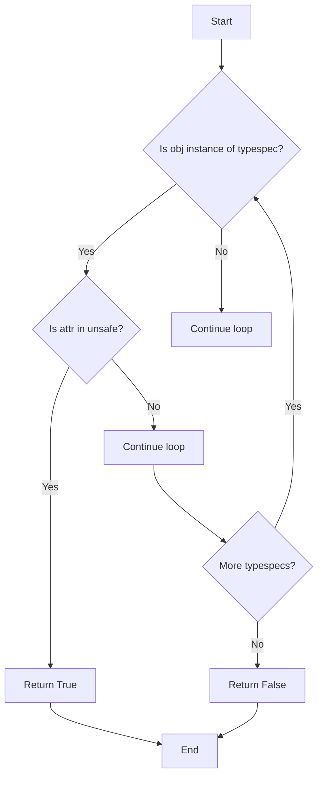
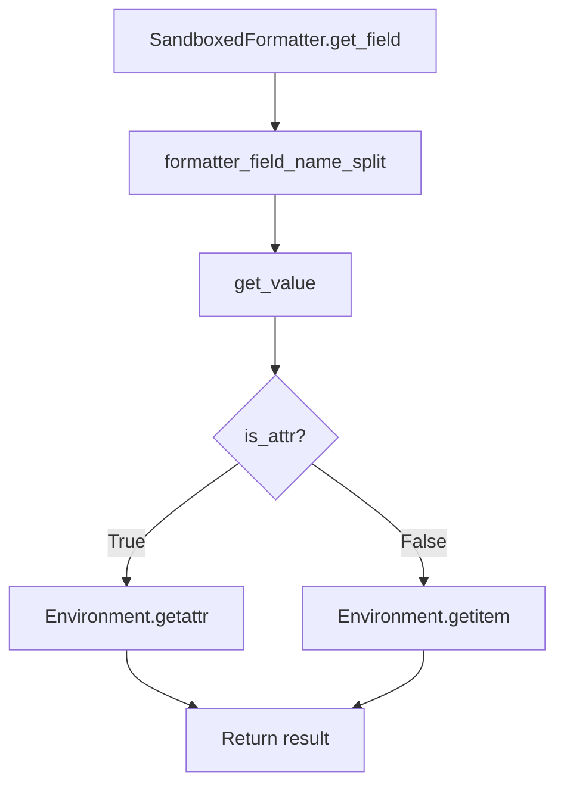

# `sandbox.py`

## `src.jinja2.sandbox.inspect_format_method` · *function*

## Summary:
Extracts the string object from format or format_map methods for security inspection.

## Description:
This function examines a callable to determine if it is a format or format_map method bound to a string object. It serves as a security mechanism to identify potentially dangerous string formatting operations that could lead to template injection vulnerabilities.

## Args:
    callable (typing.Callable): A callable object to inspect for being a format or format_map method.

## Returns:
    str or None: The string object that the format/format_map method is bound to if the callable is a valid format method; otherwise None.

## Raises:
    None explicitly raised.

## Constraints:
    Preconditions:
    - The callable must be either a MethodType or BuiltinMethodType
    - The callable's __name__ must be either "format" or "format_map"
    
    Postconditions:
    - If the callable is a valid format method, the returned value is the string object it was bound to
    - If the callable is not a valid format method, None is returned

## Side Effects:
    None.

## Control Flow:
```mermaid
flowchart TD
    A[Start inspect_format_method] --> B{Is callable MethodType or BuiltinMethodType?}
    B -- No --> C[Return None]
    B -- Yes --> D{Is callable.__name__ in ["format", "format_map"]?}
    D -- No --> C
    D -- Yes --> E[Get callable.__self__]
    E --> F{Is __self__ instance of str?}
    F -- No --> C
    F -- Yes --> G[Return __self__]
```

## Examples:
    # Example 1: Valid format method
    s = "Hello {name}"
    result = inspect_format_method(s.format)
    # Returns: "Hello {name}"
    
    # Example 2: Invalid callable
    result = inspect_format_method(len)
    # Returns: None
    
    # Example 3: Format method on non-string
    lst = [1, 2, 3]
    result = inspect_format_method(lst.format)
    # Returns: None

## `src.jinja2.sandbox.safe_range` · *function*

## Summary:
Creates a range object with size validation to prevent excessive memory allocation in sandboxed environments.

## Description:
Wraps Python's built-in range() function with a security check that prevents creation of ranges larger than a predefined maximum size (MAX_RANGE). This protects against potential denial-of-service attacks through memory exhaustion caused by extremely large ranges.

## Args:
    *args (int): Variable arguments passed directly to the built-in range() constructor. Can be 1, 2, or 3 integers representing stop, start, and step values respectively.

## Returns:
    range: A range object with the specified parameters, provided its length doesn't exceed MAX_RANGE.

## Raises:
    OverflowError: When the length of the created range exceeds the MAX_RANGE limit, indicating the range would consume excessive memory.

## Constraints:
    Preconditions:
    - All arguments must be integers compatible with the built-in range() function
    - The resulting range length must not exceed MAX_RANGE (security limit)
    
    Postconditions:
    - Returns a valid range object with the same parameters as provided
    - The returned range object has length <= MAX_RANGE

## Side Effects:
    None: This function has no side effects beyond creating and returning a range object.

## Control Flow:
```mermaid
flowchart TD
    A[Call safe_range with args] --> B{len(range(*args)) > MAX_RANGE?}
    B -- Yes --> C[Raise OverflowError]
    B -- No --> D[Return range(*args)]
```

## Examples:
```python
# Valid usage - creates a small range
small_range = safe_range(10)  # Returns range(0, 10)

# Valid usage - creates a range with start and stop
medium_range = safe_range(5, 15)  # Returns range(5, 15)

# Invalid usage - would raise OverflowError if range length exceeds MAX_RANGE
# large_range = safe_range(1000000)  # Would raise OverflowError if 1000000 > MAX_RANGE
```

## `src.jinja2.sandbox.unsafe` · *function*

## Summary:
Decorator that marks a callable as unsafe for sandbox security restrictions.

## Description:
The `unsafe` decorator is a utility function used in Jinja2's sandbox security system to mark callables that should be exempt from normal security restrictions. When applied to a function or callable object, it sets the `unsafe_callable` attribute to `True`, indicating to the Jinja2 sandbox runtime that this callable should not be subject to the usual security constraints that would normally prevent potentially dangerous operations.

This decorator is typically used to explicitly allow certain functions to execute in template contexts where they would otherwise be blocked due to sandbox restrictions.

## Args:
    f (F): A callable object (function, method, lambda, or other callable) to be marked as unsafe. The type `F` represents a generic callable type.

## Returns:
    F: The same callable object that was passed as input, with the `unsafe_callable` attribute set to `True`.

## Raises:
    None: This function does not raise any exceptions under normal operation.

## Constraints:
    Preconditions:
    - The input `f` must be a callable object that supports attribute assignment
    - The input `f` must be a valid callable that can be returned unchanged
    
    Postconditions:
    - The returned object is identical to the input `f`
    - The returned object has an `unsafe_callable` attribute set to `True`

## Side Effects:
    None: This function performs no I/O operations or external state mutations. It only modifies the input callable by adding an attribute.

## Control Flow:


## Examples:
```python
# Basic usage - marking a function as unsafe
@unsafe
def my_unsafe_function():
    return "Can bypass sandbox restrictions"

# Marking a lambda expression
unsafe_lambda = unsafe(lambda x: x * 2)

# The decorated callable can now be used in template contexts
# where it would normally be restricted by sandbox security
```

## `src.jinja2.sandbox.is_internal_attribute` · *function*

## Summary:
Determines whether an attribute of a given object should be treated as internal or unsafe for access in a sandboxed environment.

## Description:
This function implements a security mechanism to identify attributes that should not be accessible in a sandboxed Jinja2 environment. It checks various Python object types and their associated unsafe attribute lists to prevent access to internal implementation details that could pose security risks. The function is used to enforce security boundaries around object attribute access.

## Args:
    obj (Any): The object whose attribute is being checked
    attr (str): The name of the attribute to check

## Returns:
    bool: True if the attribute is considered internal/unsafe, False otherwise

## Raises:
    None explicitly raised

## Constraints:
    Preconditions:
    - obj can be any Python object
    - attr must be a string representing an attribute name
    
    Postconditions:
    - Returns a boolean value indicating whether the attribute should be restricted
    - The function handles all standard Python types appropriately

## Side Effects:
    None

## Control Flow:
```mermaid
flowchart TD
    A[is_internal_attribute] --> B{obj is FunctionType?}
    B -- Yes --> C{attr in UNSAFE_FUNCTION_ATTRIBUTES?}
    C -- Yes --> D[return True]
    C -- No --> E[continue]
    B -- No --> F{obj is MethodType?}
    F -- Yes --> G{attr in UNSAFE_FUNCTION_ATTRIBUTES OR UNSAFE_METHOD_ATTRIBUTES?}
    G -- Yes --> D
    G -- No --> E
    F -- No --> H{obj is type?}
    H -- Yes --> I{attr == "mro"?}
    I -- Yes --> D
    I -- No --> E
    H -- No --> J{obj is CodeType/TracebackType/FrameType?}
    J -- Yes --> D
    J -- No --> K{obj is GeneratorType?}
    K -- Yes --> L{attr in UNSAFE_GENERATOR_ATTRIBUTES?}
    L -- Yes --> D
    L -- No --> E
    K -- No --> M{hasattr(types, "CoroutineType") AND obj is CoroutineType?}
    M -- Yes --> N{attr in UNSAFE_COROUTINE_ATTRIBUTES?}
    N -- Yes --> D
    N -- No --> E
    M -- No --> O{hasattr(types, "AsyncGeneratorType") AND obj is AsyncGeneratorType?}
    O -- Yes --> P{attr in UNSAFE_ASYNC_GENERATOR_ATTRIBUTES?}
    P -- Yes --> D
    P -- No --> E
    O -- No --> Q[attr.startswith("__")] 
    Q -- Yes --> D
    Q -- No --> R[return False]
```

## Examples:
    # Checking a function's attribute
    >>> is_internal_attribute(some_function, '__code__')
    True
    
    # Checking a method's attribute  
    >>> is_internal_attribute(some_method, '__func__')
    True
    
    # Checking a class's attribute
    >>> is_internal_attribute(SomeClass, 'mro')
    True
    
    # Checking a regular attribute
    >>> is_internal_attribute(obj, 'public_attr')
    False

## `src.jinja2.sandbox.modifies_known_mutable` · *function*

## Summary:
Checks if a specific attribute access on a mutable object would modify that object's state.

## Description:
This function determines whether accessing a particular attribute on a mutable object is considered potentially modifying or unsafe within Jinja2's sandbox security model. It's used to enforce restrictions on mutable object operations during template rendering to prevent unauthorized modifications.

## Args:
    obj (Any): The object being checked for mutability
    attr (str): The attribute name being accessed

## Returns:
    bool: True if the attribute access would modify the object's state, False otherwise

## Raises:
    None explicitly raised

## Constraints:
    Preconditions:
    - obj parameter can be any Python object
    - attr parameter must be a string representing an attribute name
    
    Postconditions:
    - Returns a boolean value indicating whether the operation would modify object state
    - The result is determined by checking against predefined mutable object specifications

## Side Effects:
    None

## Control Flow:


## Examples:
    # Check if accessing 'append' on a list would modify it
    modifies_known_mutable([1, 2, 3], 'append')  # Returns True
    
    # Check if accessing 'upper' on a string would modify it  
    modifies_known_mutable("hello", 'upper')  # Returns False

## `src.jinja2.sandbox.SandboxedEnvironment` · *class*

*No documentation generated.*

### `src.jinja2.sandbox.SandboxedEnvironment.__init__` · *method*

## Summary:
Initializes a SandboxedEnvironment instance with security restrictions and safe operation tables.

## Description:
Configures a Jinja2 environment with sandboxed security features by initializing the parent Environment class and setting up restricted operation tables. This method ensures that template execution operates within safe boundaries by replacing potentially dangerous operations with secure alternatives.

## Args:
    *args (Any): Positional arguments passed to the parent Environment.__init__ method
    **kwargs (Any): Keyword arguments passed to the parent Environment.__init__ method

## Returns:
    None: This method initializes the object in-place and does not return a value

## Raises:
    None: This method does not explicitly raise exceptions, though parent class initialization may raise exceptions

## State Changes:
    Attributes READ: 
    - self.default_binop_table
    - self.default_unop_table
    
    Attributes WRITTEN:
    - self.globals["range"]
    - self.binop_table
    - self.unop_table

## Constraints:
    Preconditions:
    - Parent Environment class must be properly initialized
    - Arguments passed to parent constructor must be valid for Environment.__init__
    
    Postconditions:
    - The environment has a secure range function in globals
    - Binary and unary operation tables are initialized with safe copies
    - The environment is configured for sandboxed template execution

## Side Effects:
    None: This method only modifies internal object state and does not perform I/O or external service calls

### `src.jinja2.sandbox.SandboxedEnvironment.is_safe_attribute` · *method*

## Summary:
Determines whether an attribute access is permitted in a sandboxed environment by checking for private attributes and internal implementation details.

## Description:
This method implements security checks to determine if accessing a given attribute on an object is safe within a sandboxed Jinja2 environment. It prevents access to private attributes (those starting with "_") and internal implementation details that could pose security risks. The method is called during attribute access operations in both `getitem` and `getattr` methods of the SandboxedEnvironment class to enforce security boundaries.

## Args:
    obj (Any): The object whose attribute is being checked
    attr (str): The name of the attribute to check
    value (Any): The value of the attribute being accessed (unused in current implementation)

## Returns:
    bool: True if the attribute is considered safe for access, False if it should be restricted

## Raises:
    None explicitly raised

## State Changes:
    Attributes READ: None
    Attributes WRITTEN: None

## Constraints:
    Preconditions:
    - obj must be a valid Python object
    - attr must be a string representing an attribute name
    - value can be any Python object (though currently unused in implementation)
    
    Postconditions:
    - Returns a boolean indicating whether the attribute access should be permitted
    - The method does not modify any object state

## Side Effects:
    None

### `src.jinja2.sandbox.SandboxedEnvironment.is_safe_callable` · *method*

## Summary:
Determines whether a callable object is safe to execute within a sandboxed environment by checking for unsafe attributes.

## Description:
Checks if a callable object has attributes that indicate it should be restricted in a sandboxed environment. This method is used by the SandboxedEnvironment's call mechanism to enforce security policies before executing callables. An object is considered unsafe if it has either the "unsafe_callable" attribute set to True or the "alters_data" attribute set to True.

## Args:
    obj (Any): The callable object to check for safety

## Returns:
    bool: True if the callable is safe to execute, False otherwise

## Raises:
    None

## State Changes:
    Attributes READ: None
    Attributes WRITTEN: None

## Constraints:
    Preconditions:
    - The obj parameter can be any object, though typically it will be a callable
    - The method uses getattr with default values, so it won't raise AttributeError even if attributes don't exist
    
    Postconditions:
    - Returns True only if neither "unsafe_callable" nor "alters_data" attributes are truthy
    - Returns False if either attribute is truthy (including when the attribute doesn't exist, due to default False values)

## Side Effects:
    None

### `src.jinja2.sandbox.SandboxedEnvironment.call_binop` · *method*

*No documentation generated.*

### `src.jinja2.sandbox.SandboxedEnvironment.call_unop` · *method*

## Summary:
Executes a unary operator on an argument within a sandboxed environment context.

## Description:
This method serves as a secure interface for executing unary operators (like positive/negative) in a sandboxed Jinja2 environment. It retrieves the appropriate operator function from the environment's unop_table and applies it to the provided argument. This method is part of the sandboxing mechanism that prevents execution of potentially dangerous operations while allowing safe unary operations.

## Args:
    context (Context): The Jinja2 rendering context containing template state and variables
    operator (str): The unary operator to execute (e.g., "+" or "-")
    arg (Any): The argument to apply the unary operator to

## Returns:
    Any: The result of applying the unary operator to the argument

## Raises:
    KeyError: When the specified operator is not found in self.unop_table
    TypeError: When the operator function cannot be called with the provided argument
    SecurityError: Indirectly raised if the operator function itself performs unsafe operations

## State Changes:
    Attributes READ: self.unop_table
    Attributes WRITTEN: None

## Constraints:
    Preconditions: 
    - The operator must exist in self.unop_table
    - The argument must be compatible with the operator function
    - The context parameter must be a valid Jinja2 Context object
    
    Postconditions:
    - Returns the result of applying the unary operator to the argument
    - Does not modify the environment's state

## Side Effects:
    None - This method does not perform I/O, make external calls, or mutate objects outside the scope of the operation

### `src.jinja2.sandbox.SandboxedEnvironment.getitem` · *method*

## Summary:
Retrieves an item or attribute from an object with security checks, returning an undefined value when access fails or is restricted.

## Description:
This method implements secure item and attribute access for the Jinja2 sandboxed environment. It first attempts to access an object using bracket notation (`obj[argument]`). If this fails with TypeError or LookupError, it falls back to attribute access when the argument is a string. For attribute access, it performs security checks to ensure that only safe attributes (those not starting with underscore or marked as internal) are accessible. When access is denied due to security restrictions, it returns an unsafe undefined object instead of raising an exception.

The method is called during template rendering when evaluating expressions like `obj[key]` or `obj.attribute`. It's designed to prevent unauthorized access to sensitive object attributes while maintaining compatibility with normal Python object access patterns.

## Args:
    obj (Any): The object from which to retrieve the item or attribute
    argument (Union[str, Any]): The key or attribute name to access, can be any type that supports indexing or attribute access

## Returns:
    Union[Any, Undefined]: The retrieved value if successful, or an Undefined object if access fails or is restricted:
    - Returns `obj[argument]` when item access succeeds
    - Returns `getattr(obj, argument)` when attribute access succeeds and `self.is_safe_attribute(obj, argument, value)` returns True
    - Returns `self.unsafe_undefined(obj, argument)` when attribute access succeeds but `self.is_safe_attribute(obj, argument, value)` returns False
    - Returns `self.undefined(obj=obj, name=argument)` when all access attempts fail

## Raises:
    None explicitly raised - exceptions are caught and handled internally

## State Changes:
    Attributes READ: 
    - self.is_safe_attribute (method call)
    - self.unsafe_undefined (method call)
    - self.undefined (method call)
    
    Attributes WRITTEN: 
    - None (this method is read-only)

## Constraints:
    Preconditions:
    - obj parameter can be any Python object
    - argument parameter can be any type that supports indexing or attribute access
    - The method assumes proper initialization of the SandboxedEnvironment instance
    
    Postconditions:
    - Always returns either a valid value or an Undefined object
    - Security checks are consistently applied when accessing attributes
    - The returned Undefined object contains appropriate error information when access is denied

## Side Effects:
    None (pure function with no external I/O or state mutation)

### `src.jinja2.sandbox.SandboxedEnvironment.getattr` · *method*

## Summary:
Retrieves an attribute from an object while enforcing security restrictions in a sandboxed environment.

## Description:
This method provides a secure way to access object attributes by attempting to get the attribute via standard Python getattr(), then falling back to item access if that fails. It enforces security by checking if the attribute access is safe before returning the value, raising appropriate undefined exceptions for unsafe accesses.

The method is called during template rendering when evaluating attribute access expressions like `obj.attribute` or `obj['attribute']`. It serves as a central security point for attribute access in sandboxed templates, ensuring that potentially dangerous attribute access patterns are properly handled.

## Args:
    obj (Any): The object from which to retrieve the attribute
    attribute (str): The name of the attribute to retrieve

## Returns:
    Any or Undefined: The attribute value if it's safe to access, otherwise an Undefined instance representing the failed access

## Raises:
    None explicitly raised - exceptions are handled internally and converted to Undefined instances

## State Changes:
    Attributes READ: 
    - self.is_safe_attribute (method call)
    - self.unsafe_undefined (method call)
    - self.undefined (method call)

    Attributes WRITTEN: 
    - None (this method is read-only)

## Constraints:
    Preconditions:
    - obj parameter can be any Python object
    - attribute parameter must be a string representing an attribute name
    
    Postconditions:
    - Always returns either a valid attribute value or an Undefined instance
    - Security checks are performed before returning any value
    - The returned Undefined instance properly represents the failed access attempt

## Side Effects:
    None (pure function with no external I/O or state mutation)

### `src.jinja2.sandbox.SandboxedEnvironment.unsafe_undefined` · *method*

## Summary:
Creates and returns an Undefined object representing an unsafe attribute access attempt on a given object.

## Description:
This method is invoked when template rendering attempts to access an attribute on an object that would be considered unsafe according to the sandboxing rules. It generates a descriptive error message indicating the specific attribute access that triggered the security violation, and returns an Undefined instance configured to raise a SecurityError when accessed.

## Args:
    obj (Any): The object on which attribute access was attempted
    attribute (str): The name of the attribute being accessed

## Returns:
    Undefined: An Undefined instance configured to raise SecurityError when evaluated

## Raises:
    None explicitly raised - the SecurityError is deferred until the returned Undefined object is accessed

## State Changes:
    Attributes READ: self.undefined (method/property)
    Attributes WRITTEN: None

## Constraints:
    Preconditions: 
    - The method assumes that `self` has a `undefined` property/method that can construct Undefined instances
    - The `obj` parameter should be a valid Python object
    - The `attribute` parameter should be a string representing a valid attribute name
    
    Postconditions:
    - Returns an Undefined instance that will raise SecurityError when accessed
    - The returned Undefined contains metadata about the failed attribute access

## Side Effects:
    None - this method is pure and doesn't cause any I/O or external service calls

### `src.jinja2.sandbox.SandboxedEnvironment.format_string` · *method*

## Summary:
Formats a string using a sandboxed formatter while preserving the input string's type and handling special format_map cases securely.

## Description:
This method provides secure string formatting within a sandboxed environment by creating an appropriate formatter instance based on the input string type. It handles both regular strings and Markup objects, ensuring that attribute and item access during formatting follows Jinja2's security model. The method specifically manages the format_map function case to ensure proper argument handling.

The method is typically called internally by Jinja2 during template processing when formatted strings need to be evaluated safely. It serves as a bridge between Jinja2's sandboxed environment and Python's string formatting capabilities, ensuring that all field access respects the security policies defined in the Environment.

## Args:
    s (str): The format string to be processed, which can be a regular string or a Markup object.
    args (tuple): Positional arguments to be passed to the formatter.
    kwargs (dict): Keyword arguments to be passed to the formatter.
    format_func (callable, optional): A callable representing the formatting function being used. Defaults to None.

## Returns:
    str: The formatted string with the same type as the input string `s`. If `s` is a Markup object, the result will also be a Markup object with the same escaping behavior.

## Raises:
    TypeError: When format_map() is called with incorrect number of arguments (must be exactly one argument).

## State Changes:
    Attributes READ: None
    Attributes WRITTEN: None

## Constraints:
    Preconditions:
    - The `self` object must be a SandboxedEnvironment instance
    - If `format_func` is provided, it must be callable
    - The `s` parameter must be a string-like object (str or Markup)
    
    Postconditions:
    - The returned value will have the same type as the input string `s`
    - All attribute and item access during formatting will be sandboxed through the Environment

## Side Effects:
    None

### `src.jinja2.sandbox.SandboxedEnvironment.call` · *method*

## Summary:
Calls a callable object with provided arguments while enforcing security restrictions and handling string formatting methods specially.

## Description:
This method provides a secure way to invoke callable objects within a sandboxed environment. It first checks if the callable is a string formatting method (format or format_map) and handles those specially through the format_string method. For other callables, it verifies they are safe to execute before delegating to the context's call mechanism. This ensures that potentially dangerous operations are properly restricted while allowing legitimate functionality.

## Args:
    __self: The SandboxedEnvironment instance (bound method)
    __context (Context): The execution context for the call
    __obj (Any): The callable object to invoke
    *args (Any): Positional arguments to pass to the callable
    **kwargs (Any): Keyword arguments to pass to the callable

## Returns:
    Any: The result of calling the provided callable with the given arguments

## Raises:
    SecurityError: When __obj is not safely callable (fails the is_safe_callable check)

## State Changes:
    Attributes READ: None
    Attributes WRITTEN: None

## Constraints:
    Preconditions:
    - __context must be a valid Context instance
    - __obj must be a callable object
    - __self must be a SandboxedEnvironment instance
    
    Postconditions:
    - If __obj is a format/format_map method, the result comes from format_string processing
    - If __obj is not a format method, it must pass the is_safe_callable test
    - The result is the return value of calling __obj with the provided arguments

## Side Effects:
    - May perform string formatting operations when handling format methods
    - May raise SecurityError if the callable is deemed unsafe
    - Delegates to context.call() which may have its own side effects

## `src.jinja2.sandbox.ImmutableSandboxedEnvironment` · *class*

*No documentation generated.*

### `src.jinja2.sandbox.ImmutableSandboxedEnvironment.is_safe_attribute` · *method*

## Summary:
Determines whether accessing a specific attribute on an object is safe within the immutable sandbox security model.

## Description:
This method extends the standard attribute safety check by adding an additional constraint that prevents modification of known mutable objects. It first delegates to the parent class's safety check, then applies an extra validation to ensure that accessing the attribute won't modify mutable object state.

The method is called during template rendering when evaluating attribute access expressions to enforce security policies that prevent unauthorized modifications to mutable objects.

## Args:
    obj (Any): The object whose attribute is being accessed
    attr (str): The name of the attribute being accessed
    value (Any): The value of the attribute being accessed

## Returns:
    bool: True if the attribute access is considered safe and won't modify mutable object state, False otherwise

## Raises:
    None explicitly raised

## State Changes:
    Attributes READ: 
    - None (this method only reads parameters and calls other functions)
    
    Attributes WRITTEN: 
    - None (this method is read-only)

## Constraints:
    Preconditions:
    - obj parameter can be any Python object
    - attr parameter must be a string representing an attribute name
    - value parameter represents the value of the attribute being accessed
    
    Postconditions:
    - Returns a boolean indicating whether the attribute access is safe
    - The result respects both the parent class's security checks and the immutable sandbox's additional constraints

## Side Effects:
    None (pure function with no external I/O or state mutation)

## `src.jinja2.sandbox.SandboxedFormatter` · *class*

## Summary:
A secure string formatter that provides controlled attribute and item access through a Jinja2 environment for safe template formatting.

## Description:
The SandboxedFormatter class extends Python's built-in Formatter to provide secure field access during string formatting operations. It implements Jinja2's sandboxing mechanism by using the Environment's getattr() and getitem() methods instead of direct Python attribute access, preventing potentially dangerous operations such as accessing private methods or attributes.

This formatter is typically instantiated internally by Jinja2 when processing formatted strings in templates, particularly when security-sensitive formatting is required. It ensures that all attribute and item access follows Jinja2's security model.

## State:
- `_env`: Environment instance used for secure attribute and item access. Type: Environment. Must not be None. This is set during initialization and is required for the class to function properly. The environment provides safe access methods (getattr, getitem) that enforce Jinja2's security policies.

## Lifecycle:
- Creation: Instantiate with an Environment object. The Environment parameter is required and cannot be None. The formatter is typically created by Jinja2 internals during template processing.
- Usage: Called internally by Jinja2 during template rendering when processing format strings. The get_field method is invoked during formatting operations to resolve field names to actual values.
- Destruction: No special cleanup required; relies on Python's garbage collection.

## Method Map:


## Raises:
- TypeError: If the Environment parameter is not provided or is None during initialization.
- AttributeError: If the environment's getattr or getitem methods raise AttributeError when accessing fields.
- SecurityError: If the environment's getattr or getitem methods raise SecurityError due to sandbox restrictions.

## Example:
```python
from jinja2 import Environment
from jinja2.sandbox import SandboxedFormatter

# Create environment
env = Environment()

# Create sandboxed formatter
formatter = SandboxedFormatter(env)

# Use in formatting (typically done internally by Jinja2)
result = formatter.format("Hello {name}!", name="World")

# Example with nested access
data = {"user": {"name": "Alice"}}
result = formatter.format("User: {user.name}", **data)
```

### `src.jinja2.sandbox.SandboxedFormatter.__init__` · *method*

## Summary:
Initializes a SandboxedFormatter instance with a Jinja2 environment and optional configuration parameters.

## Description:
Configures the formatter with a secure Jinja2 environment for controlled attribute and item access during string formatting operations. This method sets up the internal environment reference and initializes the parent Formatter class with any additional configuration options.

The SandboxedFormatter is designed to be instantiated internally by Jinja2 during template processing, particularly when security-sensitive formatting is required. It ensures that all attribute and item access follows Jinja2's security model by using the Environment's getattr() and getitem() methods instead of direct Python attribute access.

## Args:
    env (Environment): Jinja2 Environment instance used for secure attribute and item access. This parameter is required and must be a valid Environment instance.
    **kwargs (Any): Additional keyword arguments passed to the parent Formatter class constructor for configuration.

## Returns:
    None: This method initializes the instance and does not return a value.

## Raises:
    None explicitly raised by this method. However, invalid arguments may cause exceptions in the parent class initialization.

## State Changes:
    Attributes READ: None
    Attributes WRITTEN: 
    - self._env: Set to the provided Environment instance
    - All attributes inherited from the parent Formatter class via super().__init__()

## Constraints:
    Preconditions:
    - The env parameter must be a valid Environment instance
    - The env parameter cannot be None
    - All kwargs must be valid arguments for the parent Formatter.__init__ method
    
    Postconditions:
    - self._env is initialized with the provided Environment instance
    - The parent Formatter class is properly initialized with provided kwargs

## Side Effects:
    None: This method performs no I/O operations or external service calls. It only initializes internal state and calls the parent constructor.

### `src.jinja2.sandbox.SandboxedFormatter.get_field` · *method*

## Summary:
Parses a field name and securely retrieves a value from arguments or keyword arguments, supporting nested attribute and item access within a sandboxed environment.

## Description:
This method implements field name parsing for Jinja2's sandboxed formatter, enabling access to nested attributes and items (e.g., "obj.attr[0]") while maintaining security restrictions. It leverages Python's standard formatter_field_name_split to decompose complex field names into a first component and subsequent navigation steps. The method retrieves the initial value using get_value, then safely navigates any remaining nested access paths through the environment's getattr/getitem methods, ensuring all access remains within sandbox boundaries.

## Args:
    field_name (str): The field name to parse, potentially containing attribute access (.) and item access ([]). Examples: "name", "obj.attr", "list[0]", "obj.attr[0]".
    args (Sequence[Any]): Positional arguments passed to the formatter for value lookup.
    kwargs (Mapping[str, Any]): Keyword arguments passed to the formatter for value lookup.

## Returns:
    Tuple[Any, str]: A tuple containing (resolved_value, first_component), where resolved_value is the result of accessing the field and first_component is the first part of the parsed field name.

## Raises:
    None explicitly documented - raises exceptions based on underlying implementations of get_value, getattr, and getitem.

## State Changes:
    Attributes READ: self._env, self.get_value
    Attributes WRITTEN: None

## Constraints:
    Preconditions:
    - field_name must be a valid string compatible with formatter_field_name_split
    - args must be a sequence-like object
    - kwargs must be a mapping-like object  
    - self._env must be initialized with valid getattr and getitem methods
    - The field_name structure must be compatible with the sandboxed environment's access rules
    
    Postconditions:
    - Returns a tuple with the resolved value and first field component
    - The resolution process respects sandbox security boundaries
    - The method handles both attribute access (.attr) and item access ([key]) safely

## Side Effects:
    None directly documented - depends on underlying implementations of get_value, getattr, and getitem which may perform I/O, lookups, or other operations.

## `src.jinja2.sandbox.SandboxedEscapeFormatter` · *class*

*No documentation generated.*

