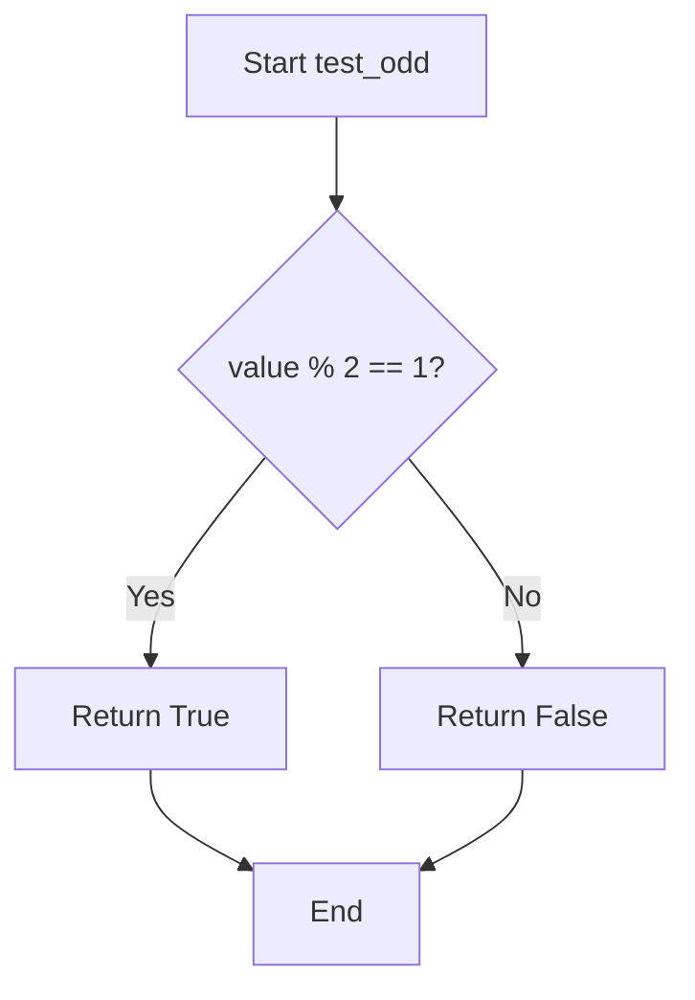
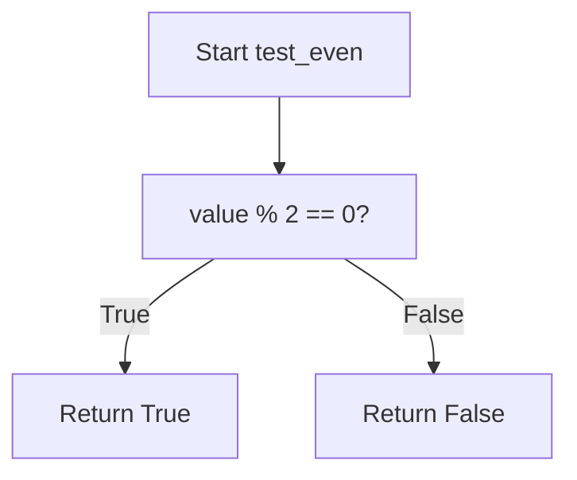
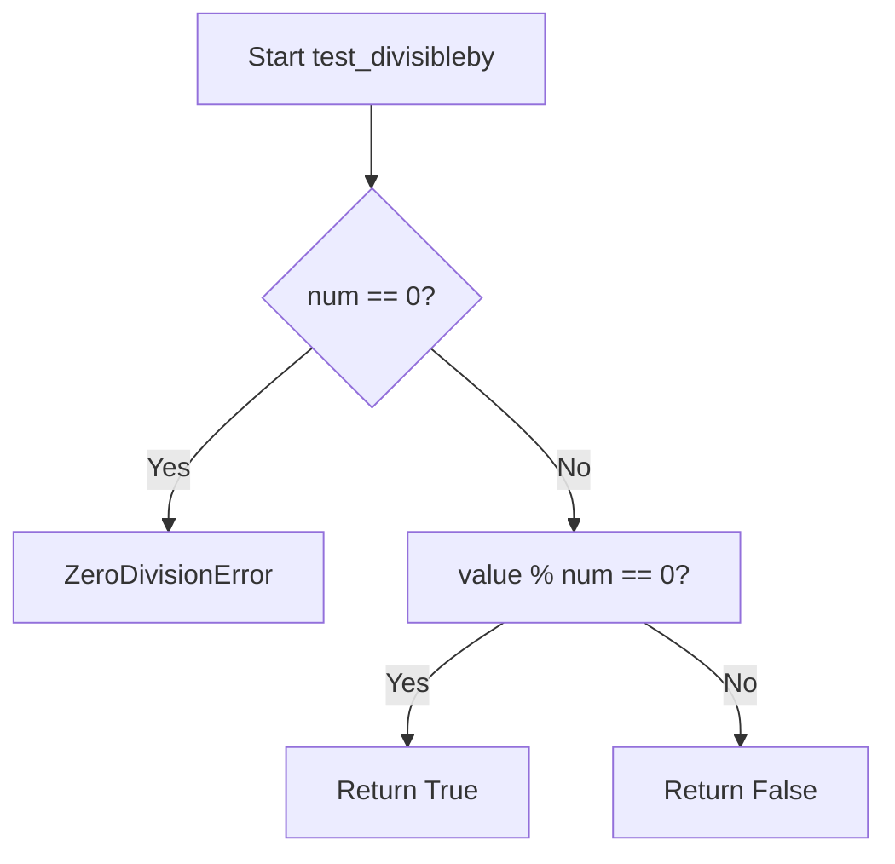
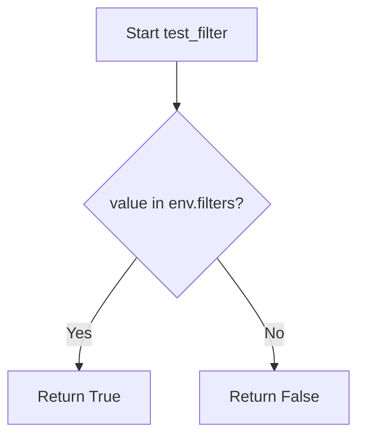
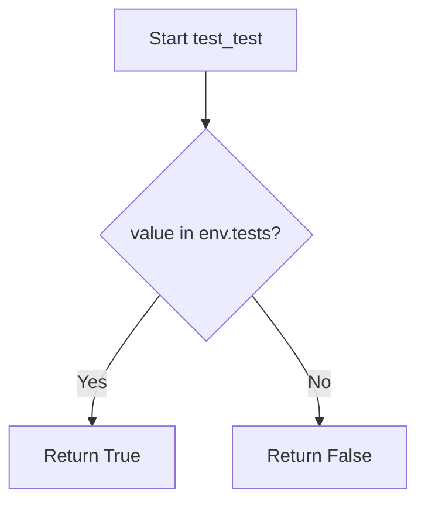
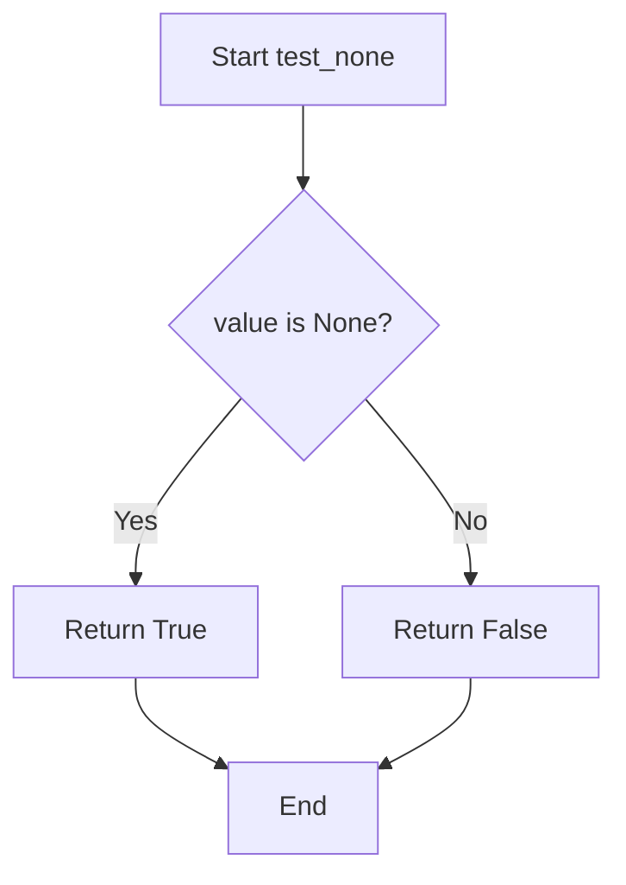
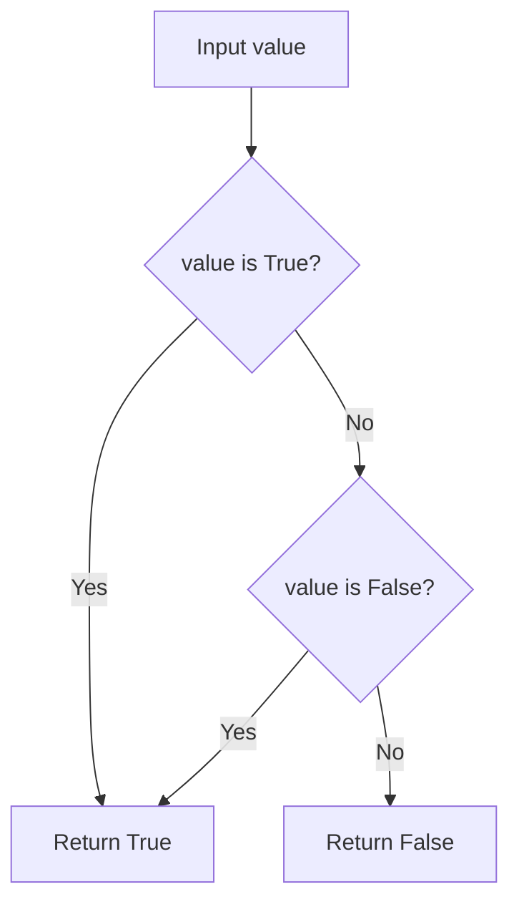
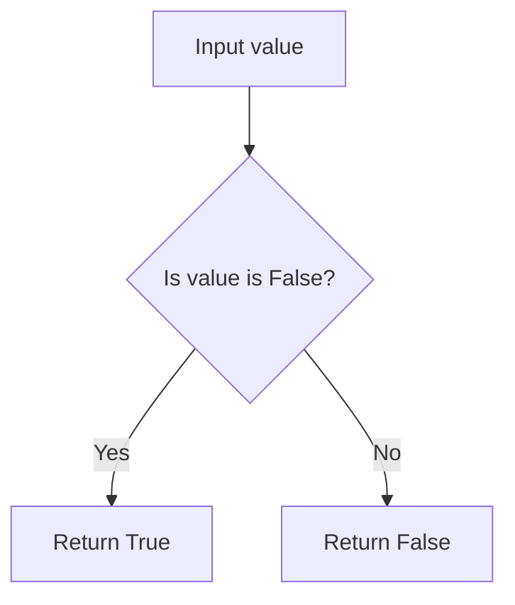
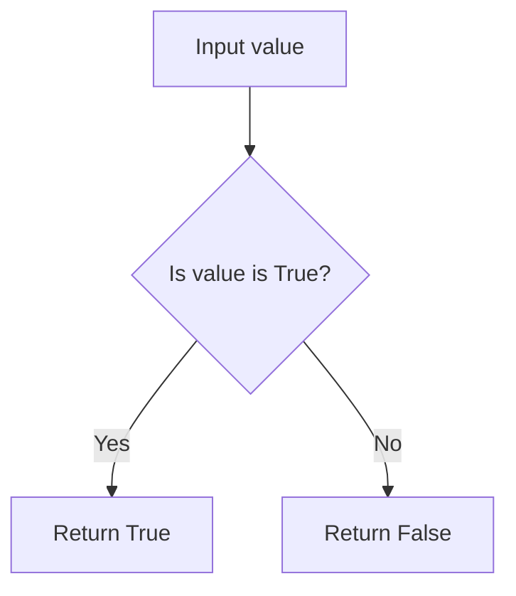
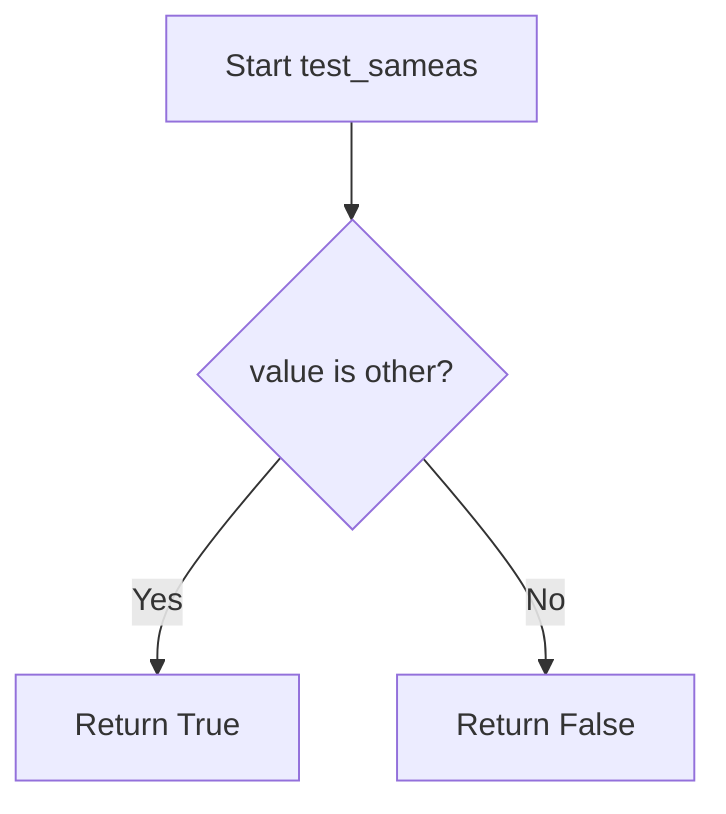

# `tests.py`

## `src.jinja2.tests.test_odd` · *function*

## Summary:
Determines whether a given integer is odd by checking if it has a remainder of 1 when divided by 2.

## Description:
This function evaluates whether an integer is odd by performing a modulo operation with 2 and comparing the result to 1. It's commonly used in template testing scenarios where conditional logic needs to distinguish between odd and even numbers.

## Args:
    value (int): The integer to test for oddness. Must be a whole number.

## Returns:
    bool: True if the value is odd (remainder 1 when divided by 2), False if the value is even (remainder 0 when divided by 2).

## Raises:
    No exceptions are raised by this function under normal circumstances.

## Constraints:
    Preconditions:
    - The input value must be an integer type
    - The function assumes the input is a whole number
    
    Postconditions:
    - The return value is always a boolean (True or False)
    - The function behaves consistently for all integer inputs

## Side Effects:
    None - this function has no side effects and is purely computational.

## Control Flow:


## Examples:
    >>> test_odd(3)
    True
    >>> test_odd(4)
    False
    >>> test_odd(-1)
    True
    >>> test_odd(0)
    False
```

## `src.jinja2.tests.test_even` · *function*

## Summary:
Checks whether an integer value is divisible by two without remainder.

## Description:
Determines if a given integer is an even number by evaluating whether it is evenly divisible by 2. This function serves as a utility for testing and validation purposes within Jinja2 template processing.

## Args:
    value (int): An integer to test for evenness. Must be a whole number.

## Returns:
    bool: True if the value is divisible by 2 with no remainder, False otherwise.

## Raises:
    None: This function does not explicitly raise exceptions in the provided implementation.

## Constraints:
    Preconditions: The input value must be of type int.
    Postconditions: The return value is always a boolean indicating evenness status.

## Side Effects:
    None: This function has no side effects and is purely computational.

## Control Flow:


## Examples:
    >>> test_even(4)
    True
    >>> test_even(7)
    False
    >>> test_even(0)
    True
    >>> test_even(-2)
    True
    >>> test_even(-3)
    False
```

## `src.jinja2.tests.test_divisibleby` · *function*

## Summary:
Checks whether one integer is evenly divisible by another integer.

## Description:
This function determines if the dividend value is perfectly divisible by the divisor number, returning a boolean result indicating the divisibility relationship. It's commonly used in template testing to validate numerical conditions.

## Args:
    value (int): The dividend to be tested for divisibility.
    num (int): The divisor against which to test divisibility.

## Returns:
    bool: True if value is evenly divisible by num (i.e., value % num == 0), False otherwise.

## Raises:
    ZeroDivisionError: When num is zero, as division by zero is undefined in mathematics and raises a ZeroDivisionError in Python.

## Constraints:
    Preconditions:
        - Both value and num must be integers
        - num must not be zero (division by zero is undefined)
    Postconditions:
        - Returns a boolean value (True or False)
        - The mathematical relationship value = num * quotient + remainder holds where remainder is 0

## Side Effects:
    None

## Control Flow:


## Examples:
    # Check if 10 is divisible by 2
    result = test_divisibleby(10, 2)  # Returns True
    
    # Check if 10 is divisible by 3
    result = test_divisibleby(10, 3)  # Returns False
    
    # Check if 15 is divisible by 5
    result = test_divisibleby(15, 5)  # Returns True
    
    # This would raise ZeroDivisionError:
    # result = test_divisibleby(10, 0)
```

## `src.jinja2.tests.test_defined` · *function*

## Summary:
Tests whether a value is defined in a Jinja2 template context, returning False for undefined values.

## Description:
This function serves as a test predicate in Jinja2's template testing framework. It determines whether a given value represents a defined variable in a template context, returning False for values that are instances of the Undefined class, which represents undefined template variables.

## Args:
    value (Any): The value to test for definition status. Can be any Python object including Undefined instances.

## Returns:
    bool: True if the value is not an instance of Undefined, False otherwise. This indicates whether the value is considered "defined" in Jinja2 template context.

## Raises:
    None: This function does not raise any exceptions.

## Constraints:
    Preconditions: The function accepts any Python object as input.
    Postconditions: Always returns a boolean value indicating definition status.

## Side Effects:
    None: This function has no side effects and is purely a predicate test.

## Control Flow:
```mermaid
flowchart TD
    A[Input value] --> B{isinstance(value, Undefined)?}
    B -- Yes --> C[Return False]
    B -- No --> D[Return True]
```

## Examples:
    # Testing defined values
    test_defined("hello")  # Returns True
    test_defined(42)       # Returns True
    test_defined([1,2,3])  # Returns True
    
    # Testing undefined values  
    test_defined(Undefined())  # Returns False
```

## `src.jinja2.tests.test_undefined` · *function*

## Summary:
Checks whether a given value is an instance of the Undefined class used in Jinja2 templates.

## Description:
This utility function determines if a provided value represents an undefined template variable in Jinja2. It's primarily used in testing scenarios to validate that template variables have not been assigned values.

## Args:
    value (Any): The value to check for undefined status. Can be any Python object.

## Returns:
    bool: True if the value is an instance of Undefined class, False otherwise.

## Raises:
    None: This function does not raise any exceptions.

## Constraints:
    Preconditions: The function accepts any Python object as input.
    Postconditions: The function always returns a boolean value indicating the undefined status.

## Side Effects:
    None: This function has no side effects and does not perform any I/O operations.

## Control Flow:
```mermaid
flowchart TD
    A[Start test_undefined] --> B{isinstance(value, Undefined)?}
    B -- Yes --> C[Return True]
    B -- No --> D[Return False]
```

## Examples:
```python
# Check if a variable is undefined
result = test_undefined(undefined_variable)  # Returns True
result = test_undefined("defined_value")     # Returns False
result = test_undefined(42)                  # Returns False
```

## `src.jinja2.tests.test_filter` · *function*

## Summary:
Tests whether a filter name exists in the Jinja2 environment's filter registry.

## Description:
Checks if a specified filter name is registered in the environment's filters collection. This function serves as a utility for validating filter names before applying them in template processing.

## Args:
    env (Environment): The Jinja2 environment instance containing registered filters
    value (str): The name of the filter to test for existence

## Returns:
    bool: True if the filter name exists in env.filters, False otherwise

## Raises:
    None explicitly raised

## Constraints:
    Preconditions:
        - env must be a valid Environment instance
        - env.filters must be a collection supporting the 'in' operator (e.g., dict, set, list)
        - value must be a string

    Postconditions:
        - Returns a boolean value indicating membership status
        - Does not modify the environment or its filters

## Side Effects:
    None

## Control Flow:


## Examples:
    # Check if 'upper' filter exists
    result = test_filter(environment, 'upper')  # Returns True if 'upper' is registered
    
    # Check if custom filter exists
    result = test_filter(environment, 'custom_filter')  # Returns False if not registered

## `src.jinja2.tests.test_test` · *function*

## Summary:
Checks whether a given test name exists in the environment's test registry.

## Description:
This function determines if a specific test identifier is registered within the Jinja2 environment's test collection. It serves as a utility for validating test names before attempting to use them in template processing or for test discovery mechanisms.

## Args:
    env (Environment): The Jinja2 environment instance containing registered tests
    value (str): The test name to check for existence in the environment's test registry

## Returns:
    bool: True if the test name exists in env.tests, False otherwise

## Raises:
    None explicitly raised

## Constraints:
    Preconditions:
    - The env parameter must be a valid Environment instance
    - The value parameter must be a string
    - The env.tests attribute must support the 'in' operator for membership testing
    
    Postconditions:
    - Returns a boolean value indicating test existence
    - Does not modify the environment or test registry

## Side Effects:
    None

## Control Flow:


## Examples:
    # Check if 'equalto' test exists
    result = test_test(environment, 'equalto')  # Returns True if registered
    
    # Check if non-existent test exists
    result = test_test(environment, 'nonexistent')  # Returns False
```

## `src.jinja2.tests.test_none` · *function*

## Summary:
Checks whether a given value is explicitly None.

## Description:
This function performs an identity check to determine if the provided value is the None singleton object. It's commonly used in Jinja2 template expressions to test for null values.

## Args:
    value (Any): The value to test for None equality. Can be any Python object including None itself.

## Returns:
    bool: True if the value is None, False otherwise.

## Raises:
    No exceptions are raised by this function.

## Constraints:
    Preconditions: None - any value can be passed to this function
    Postconditions: Always returns a boolean value (True or False)

## Side Effects:
    None - this function has no side effects

## Control Flow:


## Examples:
```python
# Basic usage
result = test_none(None)        # Returns True
result = test_none("hello")     # Returns False
result = test_none(0)           # Returns False
result = test_none([])          # Returns False
```

## `src.jinja2.tests.test_boolean` · *function*

## Summary:
Determines whether a value is exactly the boolean True or False object.

## Description:
This function performs strict identity checking to determine if the provided value is exactly the Python boolean True or False object. Unlike equality comparison (==), this function uses the 'is' operator to ensure the value is the actual boolean singleton objects.

## Args:
    value (Any): The value to test for boolean identity. Can be any Python object.

## Returns:
    bool: True if the value is exactly the boolean True or False object; False otherwise.

## Raises:
    None: This function does not raise any exceptions.

## Constraints:
    Preconditions: The function accepts any Python object as input.
    Postconditions: The return value is always a boolean (True or False).

## Side Effects:
    None: This function has no side effects.

## Control Flow:


## Examples:
    >>> test_boolean(True)
    True
    >>> test_boolean(False)
    True
    >>> test_boolean(1)
    False
    >>> test_boolean(0)
    False
    >>> test_boolean("True")
    False
```

## `src.jinja2.tests.test_false` · *function*

## Summary:
Tests whether a value is exactly the boolean False object using identity comparison.

## Description:
This function performs an identity check (using 'is' operator) to determine if the provided value is exactly the Python boolean False object. Unlike truthiness checks, this function only returns True for the literal False value and False for all other values including 0, empty strings, None, etc.

## Args:
    value (typing.Any): Any Python value to test for being exactly False

## Returns:
    bool: True if value is exactly False (the singleton boolean object), False otherwise

## Raises:
    None

## Constraints:
    Preconditions: None
    Postconditions: Always returns a boolean value

## Side Effects:
    None

## Control Flow:


## Examples:
    # In a Jinja2 template context:
    # 
    #     This will execute if my_variable is exactly False
    # 
    
    # Direct usage:
    test_false(False)    # Returns True
    test_false(0)        # Returns False (0 is falsy but not False)
    test_false("")       # Returns False (empty string is falsy but not False)
    test_false(None)     # Returns False (None is falsy but not False)
    test_false(True)     # Returns False (True is truthy but not False)
```

## `src.jinja2.tests.test_true` · *function*

## Summary:
Checks if a value is exactly the boolean True using identity comparison.

## Description:
This function performs an identity check to determine if the provided value is exactly the Python boolean `True` object. Unlike truthiness evaluation, this function distinguishes between `True` and other truthy values such as integers, strings, or lists that evaluate to True in boolean contexts.

## Args:
    value (Any): The value to test for being exactly True. Can be any Python object.

## Returns:
    bool: True if the value is exactly the boolean True object, False otherwise.

## Raises:
    None: This function does not raise any exceptions.

## Constraints:
    Preconditions: The function accepts any Python object as input.
    Postconditions: The return value is always a boolean (True or False).

## Side Effects:
    None: This function has no side effects.

## Control Flow:


## Examples:
    >>> test_true(True)
    True
    >>> test_true(1)
    False
    >>> test_true("hello")
    False
    >>> test_true([])
    False
```

## `src.jinja2.tests.test_integer` · *function*

## Summary:
Tests whether a value is specifically an integer type, excluding boolean values.

## Description:
This function determines if a given value is an integer type while excluding boolean values, since in Python, bool is a subclass of int. This distinction is important in template processing contexts where integers and booleans need to be treated differently.

## Args:
    value (Any): The value to test for integer type membership

## Returns:
    bool: True if the value is an instance of int and is neither True nor False; False otherwise

## Raises:
    None: This function does not raise any exceptions

## Constraints:
    Preconditions: The input value can be of any type
    Postconditions: The return value is always a boolean indicating the specific integer type test result

## Side Effects:
    None: This function has no side effects

## Control Flow:
```mermaid
flowchart TD
    A[Start test_integer] --> B{isinstance(value, int)?}
    B -- No --> C[Return False]
    B -- Yes --> D{value is True?}
    D -- Yes --> E[Return False]
    D -- No --> F{value is False?}
    F -- Yes --> G[Return False]
    F -- No --> H[Return True]
```

## Examples:
```python
# Valid integer values
test_integer(42)        # Returns True
test_integer(-10)       # Returns True
test_integer(0)         # Returns True

# Boolean values (excluded)
test_integer(True)      # Returns False
test_integer(False)     # Returns False

# Other types
test_integer("42")      # Returns False
test_integer(42.0)      # Returns False
```

## `src.jinja2.tests.test_float` · *function*

## Summary:
Checks whether a given value is of type float.

## Description:
This function determines if the provided value is an instance of Python's float type. It is designed to be used as a template test within Jinja2 templates to validate numeric types. The function serves as a utility for type checking in template expressions.

## Args:
    value (Any): The value to be tested for float type. Can be any Python object.

## Returns:
    bool: True if the value is an instance of float, False otherwise.

## Raises:
    None: This function does not raise any exceptions.

## Constraints:
    Preconditions: The function accepts any Python object as input.
    Postconditions: The return value is always a boolean indicating type membership.

## Side Effects:
    None: This function has no side effects and does not modify any external state.

## Control Flow:
```mermaid
flowchart TD
    A[Start test_float] --> B{isinstance(value, float)?}
    B -->|Yes| C[Return True]
    B -->|No| D[Return False]
```

## Examples:
```python
# Usage in template context
# 
#     Value is a float
# 
#     Value is not a float
# 

# Direct function calls
result = test_float(3.14)      # Returns True
result = test_float(42)        # Returns False
result = test_float("hello")   # Returns False
```

## `src.jinja2.tests.test_lower` · *function*

## Summary:
Checks if a string value is entirely lowercase.

## Description:
This function converts the input value to a string and determines whether all characters in the string are lowercase letters. It's commonly used in Jinja2 template tests to validate string formatting requirements.

## Args:
    value: The input value to test for lowercase characters. This can be any object that can be converted to a string.

## Returns:
    bool: True if the string representation of the value contains only lowercase characters, False otherwise. Empty strings return True.

## Raises:
    None

## Constraints:
    Preconditions: The input value must be convertible to a string using str().
    Postconditions: The return value is always a boolean indicating the lowercase status of the string representation.

## Side Effects:
    None

## Control Flow:
```mermaid
flowchart TD
    A[Input value] --> B{Convert to str}
    B --> C{Check islower()}
    C --> D[Return result]
```

## Examples:
    >>> test_lower("hello")
    True
    >>> test_lower("Hello")
    False
    >>> test_lower("HELLO")
    False
    >>> test_lower("")
    True
    >>> test_lower(123)
    False
```

## `src.jinja2.tests.test_upper` · *function*

## Summary:
Checks if a string value is entirely uppercase.

## Description:
This function determines whether the string representation of a given value consists entirely of uppercase characters. It is designed as a test utility to validate string formatting requirements in template rendering.

## Args:
    value (str): The input value to check. While type hinted as str, the function will convert any input to string before checking.

## Returns:
    bool: True if the string representation of value contains only uppercase letters, False otherwise. Empty strings return False.

## Raises:
    None: This function does not raise any exceptions.

## Constraints:
    Preconditions: The function accepts any input type due to the str() conversion, but the result depends on the string representation of the input.
    Postconditions: The return value is always a boolean indicating the uppercase status of the string representation.

## Side Effects:
    None: This function has no side effects and is pure.

## Control Flow:
```mermaid
flowchart TD
    A[Input value] --> B{Convert to str}
    B --> C[Call isupper()]
    C --> D[Return boolean result]
```

## Examples:
    >>> test_upper("HELLO")
    True
    >>> test_upper("Hello")
    False
    >>> test_upper("hello")
    False
    >>> test_upper("")
    False
    >>> test_upper(123)
    False
```

## `src.jinja2.tests.test_string` · *function*

## Summary:
Checks whether the provided value is a string instance.

## Description:
Determines if the input value is an instance of Python's built-in string type. This utility function is commonly used in template rendering and expression evaluation to validate string inputs.

## Args:
    value (Any): The value to be tested for string type. Can be any Python object.

## Returns:
    bool: True if the value is an instance of str, False otherwise.

## Raises:
    None: This function does not raise any exceptions.

## Constraints:
    Preconditions: The function accepts any Python object as input.
    Postconditions: The return value is always a boolean (True or False).

## Side Effects:
    None: This function has no side effects and is purely a type checking operation.

## Control Flow:
```mermaid
flowchart TD
    A[Start test_string] --> B{isinstance(value, str)?}
    B -->|Yes| C[Return True]
    B -->|No| D[Return False]
    C --> E[End]
    D --> E
```

## Examples:
    >>> test_string("hello")
    True
    >>> test_string(123)
    False
    >>> test_string(None)
    False
    >>> test_string([])
    False
```

## `src.jinja2.tests.test_mapping` · *function*

## Summary:
Determines whether a given value is a mapping type (such as dict or OrderedDict).

## Description:
This utility function performs a type check to identify if the provided value implements the collections.abc.Mapping interface. It's commonly used in Jinja2 template processing to distinguish between mapping types and other data structures.

## Args:
    value (Any): The value to test for mapping type compatibility.

## Returns:
    bool: True if the value is an instance of collections.abc.Mapping, False otherwise.

## Raises:
    None: This function does not raise any exceptions.

## Constraints:
    Preconditions: The function accepts any Python object as input.
    Postconditions: The return value is always a boolean indicating mapping type compatibility.

## Side Effects:
    None: This function has no side effects and is purely a type checking utility.

## Control Flow:
```mermaid
flowchart TD
    A[Start test_mapping] --> B{isinstance(value, abc.Mapping)?}
    B -- Yes --> C[Return True]
    B -- No --> D[Return False]
```

## Examples:
    >>> test_mapping({'a': 1, 'b': 2})
    True
    >>> test_mapping([1, 2, 3])
    False
    >>> test_mapping("hello")
    False
    >>> test_mapping(OrderedDict([('a', 1)]))
    True
```

## `src.jinja2.tests.test_number` · *function*

## Summary:
Tests whether a given value is an instance of Python's numeric type hierarchy.

## Description:
This function determines if a provided value belongs to Python's numeric type system by checking if it is an instance of the `numbers.Number` abstract base class. It serves as a utility for identifying numeric values in template processing contexts.

The function is extracted into its own component to provide a clean, reusable interface for numeric type checking that can be used throughout the Jinja2 templating system without duplicating the isinstance check logic.

## Args:
    value (Any): The value to test for numeric type compatibility. Can be any Python object.

## Returns:
    bool: True if the value is an instance of numbers.Number (including int, float, complex, Decimal, Fraction, etc.), False otherwise.

## Raises:
    None: This function does not raise any exceptions under normal circumstances.

## Constraints:
    Preconditions: The function accepts any Python object as input.
    Postconditions: The return value is always a boolean indicating numeric type membership.

## Side Effects:
    None: This function has no side effects and is pure.

## Control Flow:
```mermaid
flowchart TD
    A[Start test_number] --> B{isinstance(value, Number)?}
    B -->|Yes| C[Return True]
    B -->|No| D[Return False]
```

## Examples:
    >>> test_number(42)
    True
    >>> test_number(3.14)
    True
    >>> test_number("42")
    False
    >>> test_number([1, 2, 3])
    False
```

## `src.jinja2.tests.test_sequence` · *function*

## Summary:
Tests whether a value exhibits sequence-like behavior by verifying it supports length and indexing operations.

## Description:
Determines if a given value can be treated as a sequence by attempting to invoke the built-in `len()` function and accessing the `__getitem__` attribute. This function is used internally by Jinja2 to identify sequence-like objects such as lists, tuples, strings, and other indexable collections.

## Args:
    value (Any): The object to test for sequence-like behavior. Can be any Python object.

## Returns:
    bool: True if the value supports both `len()` and `__getitem__` operations, False otherwise.

## Raises:
    None: This function does not raise exceptions directly, though underlying operations may raise exceptions that are caught and handled.

## Constraints:
    Preconditions: The value parameter can be any Python object.
    Postconditions: Returns a boolean value indicating sequence-like behavior.

## Side Effects:
    None: This function performs no I/O operations or external state mutations.

## Control Flow:
```mermaid
flowchart TD
    A[Start test_sequence] --> B{Can call len(value)?}
    B -- No --> C[Return False]
    B -- Yes --> D{Can access value.__getitem__?}
    D -- No --> E[Return False]
    D -- Yes --> F[Return True]
```

## Examples:
    >>> test_sequence([1, 2, 3])
    True
    >>> test_sequence("hello")
    True
    >>> test_sequence(42)
    False
    >>> test_sequence({"a": 1})
    False
```

## `src.jinja2.tests.test_sameas` · *function*

## Summary:
Tests whether two values refer to the same object in memory.

## Description:
This function performs an identity comparison between two values using Python's `is` operator. It returns True only when both parameters reference the exact same object in memory, not just objects with equal values.

## Args:
    value (Any): The first value to compare
    other (Any): The second value to compare

## Returns:
    bool: True if value and other are the same object in memory, False otherwise

## Raises:
    None

## Constraints:
    Preconditions: Both arguments can be any Python objects
    Postconditions: Always returns a boolean value

## Side Effects:
    None

## Control Flow:


## Examples:
    # Identity comparison
    test_sameas([1, 2, 3], [1, 2, 3])  # Returns False (different list objects)
    test_sameas([1, 2, 3], [1, 2, 3])  # Returns False (different list objects)
    a = [1, 2, 3]
    test_sameas(a, a)  # Returns True (same object reference)
    test_sameas(1, 1)  # Returns True (small integers cached)
    test_sameas(None, None)  # Returns True (None singleton)
```

## `src.jinja2.tests.test_iterable` · *function*

## Summary:
Determines whether a given value is iterable by attempting to create an iterator from it.

## Description:
Checks if a value supports iteration by calling the built-in `iter()` function. This function is commonly used in Jinja2 templates to test if a variable can be looped over. The function handles the case where `iter()` raises a TypeError for non-iterable objects by catching the exception and returning False.

## Args:
    value (Any): The value to test for iterability. Can be any Python object.

## Returns:
    bool: True if the value is iterable (i.e., `iter(value)` succeeds), False otherwise.

## Raises:
    None: This function catches and handles TypeError internally.

## Constraints:
    Preconditions: The function accepts any Python object as input.
    Postconditions: Always returns a boolean value (True or False).

## Side Effects:
    None: This function performs no I/O operations or external state mutations.

## Control Flow:
```mermaid
flowchart TD
    A[Start test_iterable] --> B{Can iter() be called?}
    B -- Yes --> C[Return True]
    B -- No --> D[Catch TypeError]
    D --> E[Return False]
```

## Examples:
    >>> test_iterable([1, 2, 3])
    True
    >>> test_iterable("hello")
    True
    >>> test_iterable(42)
    False
    >>> test_iterable(None)
    False
```

## `src.jinja2.tests.test_escaped` · *function*

## Summary:
Tests whether a value has an HTML escape marker method, indicating it contains pre-escaped HTML content.

## Description:
This function determines if a given value has an `__html__` method, which is used in Jinja2 templating to identify values that are already HTML-escaped and should not be escaped again during template rendering. Values with this method are typically considered safe for direct HTML insertion.

## Args:
    value (Any): The value to test for HTML escaping status. Can be any Python object.

## Returns:
    bool: True if the value has an `__html__` attribute/method, False otherwise.

## Raises:
    None: This function does not raise any exceptions.

## Constraints:
    Preconditions: The function accepts any Python object as input.
    Postconditions: Always returns a boolean value (True or False).

## Side Effects:
    None: This function performs no I/O operations or external state mutations.

## Control Flow:
```mermaid
flowchart TD
    A[Input value] --> B{Has __html__ attribute?}
    B -->|Yes| C[Return True]
    B -->|No| D[Return False]
```

## Examples:
    >>> test_escaped("hello")
    False
    
    >>> class SafeHTML:
    ...     def __html__(self):
    ...         return "<p>Hello</p>"
    ...
    >>> test_escaped(SafeHTML())
    True

## `src.jinja2.tests.test_in` · *function*

## Summary:
Checks if a value exists within a container or sequence.

## Description:
This function implements the `in` operator for Jinja2 template testing, determining whether a given value is present in a container such as a list, tuple, string, or dictionary. It serves as a fundamental building block for conditional template logic and assertion testing.

## Args:
    value (Any): The item to search for within the sequence
    seq (Container): The container to search within, supporting the `in` operator

## Returns:
    bool: True if value is found in seq, False otherwise

## Raises:
    None: This function does not raise any exceptions

## Constraints:
    Preconditions: Both arguments must be valid Python objects that support the `in` operator
    Postconditions: Always returns a boolean value (True or False)

## Side Effects:
    None: This function has no side effects beyond evaluating the membership operation

## Control Flow:
```mermaid
flowchart TD
    A[Start test_in] --> B{value in seq?}
    B -->|Yes| C[Return True]
    B -->|No| D[Return False]
```

## Examples:
    # Basic usage with lists
    result = test_in(2, [1, 2, 3])  # Returns True
    
    # Usage with strings
    result = test_in('a', 'hello')  # Returns False
    
    # Usage with dictionaries (checks keys)
    result = test_in('key', {'key': 'value'})  # Returns True
```

