# `utils.py`

## `src.jinja2.utils.pass_context` · *function*

## Summary:
A decorator that marks a callable to receive the template context as its first argument when invoked in a Jinja2 template.

## Description:
This decorator is used to indicate that a function or method should receive the template context object as its first argument when executed within a Jinja2 template. It sets the `jinja_pass_arg` attribute on the decorated function to `_PassArg.context`, which informs Jinja2's execution engine about the expected argument passing mechanism.

The function is typically applied to custom template filters or functions that need access to the template context to perform operations that depend on template variables, global variables, or other context-specific information.

## Args:
    f (F): The callable object (function, method, or other callable) to be decorated.

## Returns:
    F: The same callable object with the `jinja_pass_arg` attribute set to `_PassArg.context`.

## Raises:
    None: This function does not raise any exceptions.

## Constraints:
    Preconditions:
    - The input `f` must be a callable object (function, method, or other callable)
    - The function must be compatible with receiving a context object as its first argument
    
    Postconditions:
    - The returned callable retains all original functionality
    - The `jinja_pass_arg` attribute is set to `_PassArg.context`
    - The function signature remains unchanged except for the added attribute

## Side Effects:
    None: This function does not perform any I/O operations or mutate external state. It only modifies the metadata of the input callable.

## Control Flow:
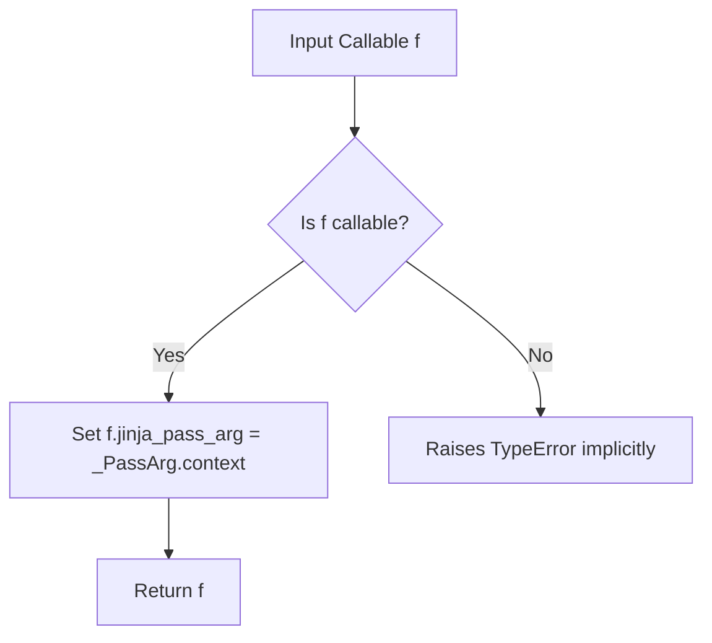

## Examples:
```python
# Define a filter that needs access to template context
@pass_context
def my_filter(value, context):
    # Access template variables through context
    return f"{value}: {context.get('template_name', 'unknown')}"

# When used in a template, this filter receives the context as first argument
# {{ my_value|my_filter }}
```

## `src.jinja2.utils.pass_eval_context` · *function*

## Summary:
A decorator that marks a callable to receive the evaluation context as its first argument when invoked in a Jinja2 template.

## Description:
This decorator is used to indicate that a function should receive the evaluation context object as its first argument when executed within a Jinja2 template. It sets the `jinja_pass_arg` attribute on the decorated function to `_PassArg.eval_context`, which informs Jinja2's execution engine about the expected argument passing mechanism.

The function is typically applied to custom template filters or functions that need access to evaluation-specific information during template rendering, such as the current evaluation state or evaluation-time variables.

## Args:
    f (F): The callable object (function, method, or other callable) to be decorated.

## Returns:
    F: The same callable object with the `jinja_pass_arg` attribute set to `_PassArg.eval_context`.

## Raises:
    None: This function does not raise any exceptions.

## Constraints:
    Preconditions:
    - The input `f` must be a callable object (function, method, or other callable)
    - The function must be compatible with receiving an evaluation context object as its first argument
    
    Postconditions:
    - The returned callable retains all original functionality
    - The `jinja_pass_arg` attribute is set to `_PassArg.eval_context`
    - The function signature remains unchanged except for the added attribute

## Side Effects:
    None: This function does not perform any I/O operations or mutate external state. It only modifies the metadata of the input callable.

## Control Flow:
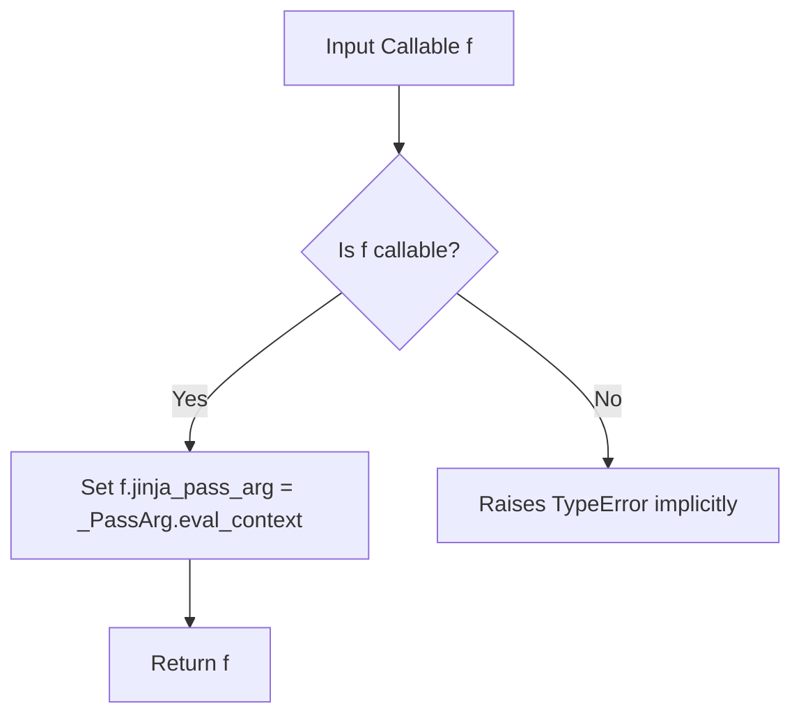

## Examples:
```python
# Define a filter that needs access to evaluation context
@pass_eval_context
def my_filter(value, eval_context):
    # Access evaluation-specific information through eval_context
    return f"{value}: {eval_context.get('evaluation_time', 'unknown')}"

# When used in a template, this filter receives the evaluation context as first argument
# {{ my_value|my_filter }}
```

## `src.jinja2.utils.pass_environment` · *function*

## Summary:
Decorator that marks a function to receive the Jinja2 environment as its first argument.

## Description:
This decorator is used to indicate that a function should be called with the Jinja2 environment object as its first argument. It sets an internal attribute (`jinja_pass_arg`) on the decorated function to signal to the Jinja2 runtime that environment injection is required. The `_PassArg.environment` value indicates that the environment should be passed as the first argument to the decorated function.

## Args:
    f (F): The function to be decorated, where F is a callable type that will receive the environment argument.

## Returns:
    F: The same function object, with the `jinja_pass_arg` attribute set to indicate environment passing is required.

## Raises:
    None explicitly raised by this function.

## Constraints:
    Preconditions:
    - The function `f` must be callable
    - The `_PassArg.environment` constant must be available in the scope
    
    Postconditions:
    - The returned function has a `jinja_pass_arg` attribute set to `_PassArg.environment`
    - The original function object is returned unchanged

## Side Effects:
    None - this function only modifies the metadata of the input function.

## Control Flow:
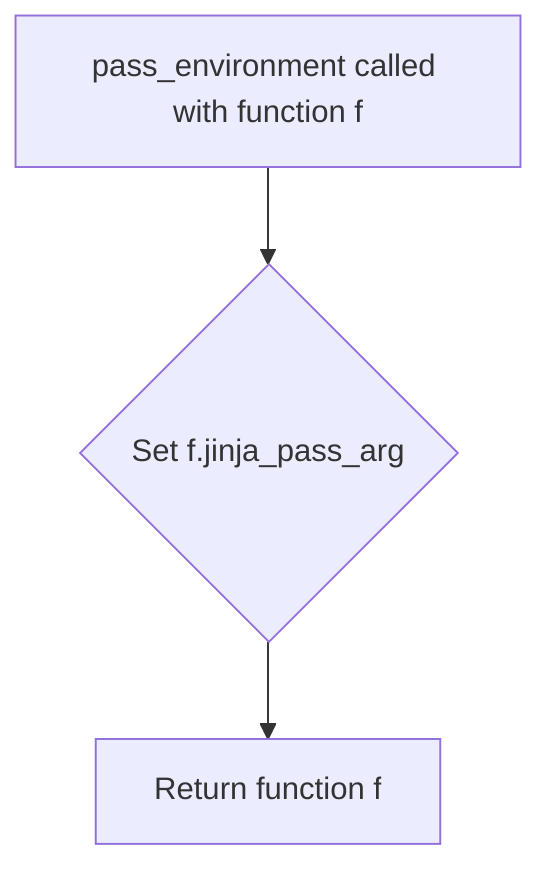

## Examples:
```python
@pass_environment
def my_filter(value, environment):
    # This function will receive the Jinja2 environment as the second argument
    return value.upper()

# Usage in Jinja2 template context
# The environment will be automatically passed when this filter is invoked
```

## `src.jinja2.utils._PassArg` · *class*

## Summary:
An enumeration defining the contexts in which template arguments should be passed to callable objects in Jinja2.

## Description:
The `_PassArg` enum represents different contexts that determine how arguments are passed to template functions and filters. This is used internally by Jinja2 to control the argument passing mechanism when executing template expressions. Objects can declare their preferred argument passing context by setting a `jinja_pass_arg` attribute.

## State:
- `context` (enum auto): Represents the template context
- `eval_context` (enum auto): Represents the evaluation context  
- `environment` (enum auto): Represents the Jinja2 environment

## Lifecycle:
- Creation: Enum values are automatically created via `enum.auto()`
- Usage: Typically accessed through the `from_obj` classmethod to extract context preferences from callable objects
- Destruction: No explicit cleanup required as this is a static enum

## Method Map:
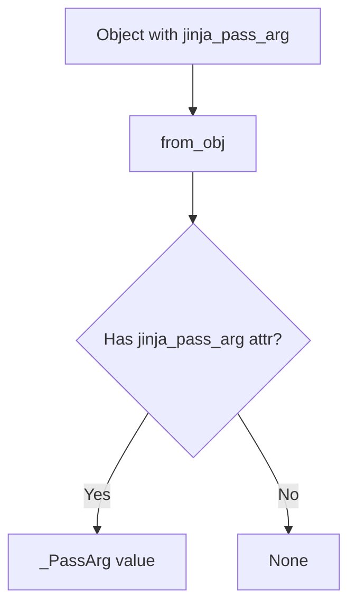

## Raises:
- No exceptions are raised by this class directly

## Example:
```python
# Define a callable with explicit context preference
def my_filter(value):
    return value.upper()

my_filter.jinja_pass_arg = _PassArg.context

# Extract the context preference
pass_arg = _PassArg.from_obj(my_filter)  # Returns _PassArg.context
```

### `src.jinja2.utils._PassArg.from_obj` · *method*

## Summary:
Retrieves a Jinja2 pass argument enumeration from an object if it has the appropriate attribute.

## Description:
This class method examines an object for the presence of a `jinja_pass_arg` attribute and returns its value if found. It serves as a lookup mechanism to extract pass argument information from objects that support Jinja2's pass argument functionality.

## Args:
    cls: The _PassArg class (unused in implementation)
    obj: An arbitrary object that may have a jinja_pass_arg attribute

## Returns:
    _PassArg or None: The jinja_pass_arg attribute value if present, otherwise None

## Raises:
    None explicitly raised

## State Changes:
    Attributes READ: None - this method only reads the object's attributes
    Attributes WRITTEN: None - this method does not modify any attributes

## Constraints:
    Preconditions: The object parameter can be any Python object
    Postconditions: Returns either a _PassArg enum value or None

## Side Effects:
    None - this method performs only attribute checking and returns a value

## `src.jinja2.utils.internalcode` · *function*

## Summary:
Decorator that marks functions as internal by tracking their code objects in a global registry.

## Description:
This function serves as a decorator that identifies and registers functions as "internal" within the Jinja2 framework. When applied to a function, it adds the function's code object to a global set called `internal_code`. This mechanism allows the Jinja2 system to distinguish between internal implementation details and public APIs, potentially for debugging, filtering, or optimization purposes.

## Args:
    f (F): A callable object (function) to be marked as internal. The type F represents a generic function type.

## Returns:
    F: The same function object that was passed in, unchanged. This enables the decorator to be used in a chain or without affecting the decorated function's behavior.

## Raises:
    None explicitly raised by this function.

## Constraints:
    Preconditions:
    - The input `f` must be a callable object (function, method, or other callable)
    - The global variable `internal_code` must be initialized as a set-like object
    
    Postconditions:
    - The function's code object is added to the `internal_code` set
    - The returned function is identical to the input function

## Side Effects:
    - Mutates the global `internal_code` set by adding the function's code object
    - No other side effects; does not modify global state beyond the `internal_code` set

## Control Flow:
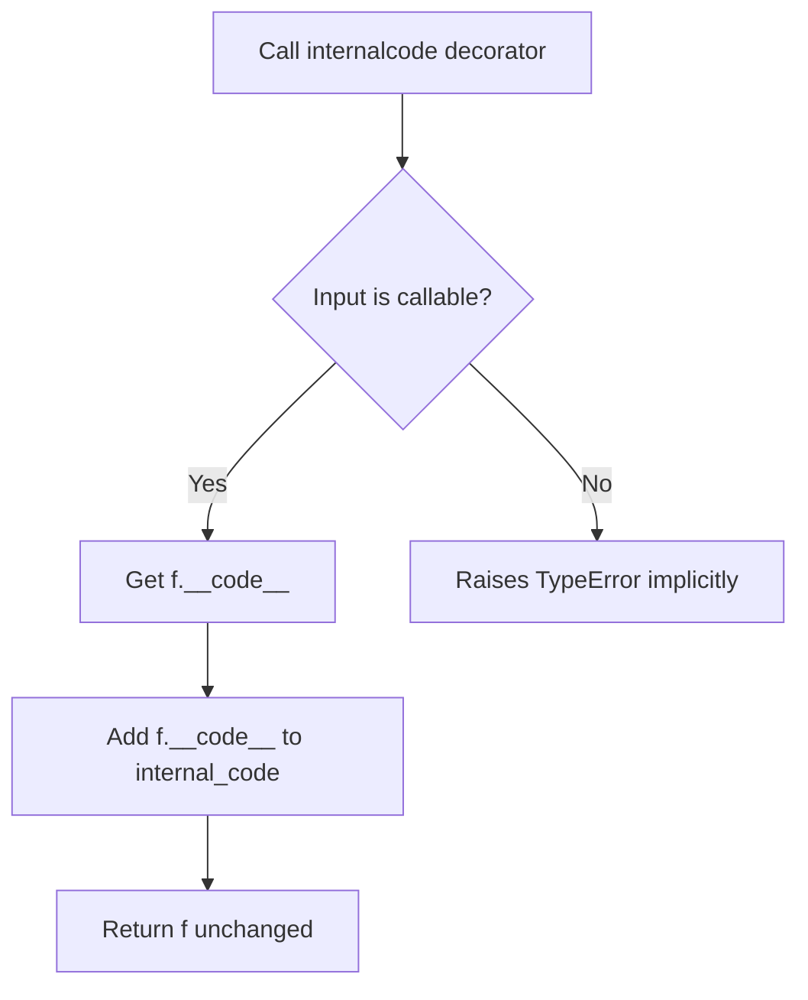

## Examples:
```python
# Basic usage
@internalcode
def my_internal_function():
    return "internal"

# The function remains unchanged but is now tracked as internal
result = my_internal_function()  # Returns "internal"
```

## `src.jinja2.utils.is_undefined` · *function*

## Summary:
Checks whether an object is an instance of the Undefined class used in Jinja2 templating.

## Description:
This utility function determines if a given object represents an undefined value in Jinja2 templates. It performs a type check against the Undefined class from the runtime module to identify objects that have not been assigned a value in the template context.

## Args:
    obj (Any): The object to test for being undefined.

## Returns:
    bool: True if the object is an instance of Undefined, False otherwise.

## Raises:
    None

## Constraints:
    Preconditions:
        - The function accepts any Python object as input
        - No specific validation is performed on the input object
    
    Postconditions:
        - Always returns a boolean value (True or False)
        - The returned value accurately reflects whether the object is an Undefined instance

## Side Effects:
    None

## Control Flow:
```mermaid
flowchart TD
    A[is_undefined called with obj] --> B{isinstance(obj, Undefined)?}
    B -- Yes --> C[Return True]
    B -- No --> D[Return False]
```

## Examples:
```python
# Check if a variable is undefined
from jinja2.runtime import Undefined
from jinja2.utils import is_undefined

# Example 1: Undefined object
undefined_var = Undefined()
result = is_undefined(undefined_var)  # Returns True

# Example 2: Defined object
defined_var = "hello"
result = is_undefined(defined_var)  # Returns False

# Example 3: None value
result = is_undefined(None)  # Returns False
```

## `src.jinja2.utils.clear_caches` · *function*

## Summary:
Clears internal caching mechanisms used by the Jinja2 templating engine to reset cached environment and lexer states.

## Description:
This utility function resets two key caching mechanisms within the Jinja2 system: the spontaneous environment cache and the lexer cache. It is typically invoked when cache invalidation is required to ensure subsequent template processing operates with fresh cached data.

The function extracts cache clearing logic into a dedicated utility to provide a centralized mechanism for cache invalidation throughout the application, rather than scattering cache-clearing calls throughout the codebase.

## Args:
    None

## Returns:
    None

## Raises:
    None

## Constraints:
    Preconditions:
    - The function assumes that `get_spontaneous_environment` is a cached function with a `cache_clear()` method
    - The function assumes that `_lexer_cache` is a mutable cache object with a `clear()` method
    
    Postconditions:
    - Both caches are emptied
    - Subsequent calls to cached functions will recompute their results
    - Template parsing and environment creation will operate with clean state

## Side Effects:
    None

## Control Flow:
```mermaid
flowchart TD
    A[clear_caches() called] --> B{Imports cached objects}
    B --> C[get_spontaneous_environment.cache_clear()]
    C --> D[_lexer_cache.clear()]
    D --> E[Function returns]
```

## Examples:
```python
# Clear all caches before running a test
clear_caches()

# Clear caches when environment configuration changes
clear_caches()
```

## `src.jinja2.utils.import_string` · *function*

## Summary:
Dynamically imports a Python object from a string representation, supporting module names, dotted paths, and colon-separated module-object pairs.

## Description:
This function provides a flexible way to import Python objects dynamically using string representations. It handles three different formats:
1. Module-only imports (e.g., "os")
2. Dotted attribute access (e.g., "collections.defaultdict")
3. Colon-separated module-object pairs (e.g., "myapp.views:home")

The function is designed to be robust and safe, with an option to silently handle import failures.

## Args:
    import_name (str): String representation of the import target, which can be:
        - A simple module name (e.g., "json")
        - A dotted path to an attribute (e.g., "collections.OrderedDict")
        - A colon-separated module-object pair (e.g., "django.http:HttpResponse")
    silent (bool): If True, suppresses ImportErrors and AttributeErrors. If False (default), these exceptions are re-raised.

## Returns:
    Any: The imported Python object. For module imports, returns the module itself. For attribute imports, returns the specific attribute.

## Raises:
    ImportError: When a module cannot be found or imported, unless silent=True.
    AttributeError: When an attribute cannot be found on a module, unless silent=True.

## Constraints:
    Preconditions:
        - import_name must be a valid string
        - For dotted or colon-separated imports, the module path must be importable
        - For dotted or colon-separated imports, the target attribute must exist on the module
    Postconditions:
        - Returns the imported object or raises appropriate exceptions
        - If silent=True and import fails, function returns None (implicitly)

## Side Effects:
    None: This function performs no I/O operations or external state mutations.

## Control Flow:
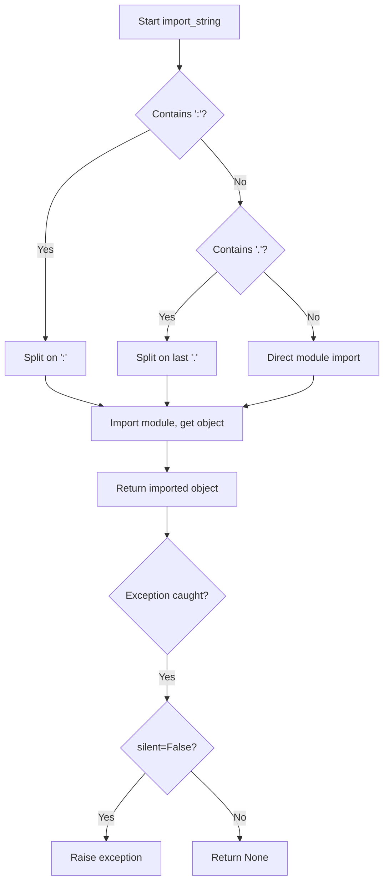

## Examples:
    # Import a module
    json_module = import_string("json")
    
    # Import an attribute from a module
    defaultdict_class = import_string("collections.defaultdict")
    
    # Import an object from a module using colon syntax
    http_response = import_string("django.http:HttpResponse")
    
    # Silent import (no exception raised)
    result = import_string("nonexistent.module", silent=True)
```

## `src.jinja2.utils.open_if_exists` · *function*

## Summary:
Attempts to open a file only if it exists, returning None if the file is not found.

## Description:
Provides a safe mechanism to open files without raising exceptions when the file does not exist. This function first verifies the existence of the specified file using `os.path.isfile()` before attempting to open it. This approach prevents unnecessary exception handling in scenarios where file existence is uncertain.

## Args:
    filename (str): Path to the file to be opened
    mode (str): File opening mode, defaults to "rb" (read binary)

## Returns:
    IO or None: Returns a file handle if the file exists and can be opened, otherwise returns None

## Raises:
    None: This function does not raise exceptions directly, though underlying file operations may raise IOError or OSError

## Constraints:
    Preconditions:
        - filename parameter must be a valid string path
        - mode parameter must be a valid file mode string
    Postconditions:
        - If file exists: returns an open file handle with the specified mode
        - If file does not exist: returns None

## Side Effects:
    - File system I/O operations when file exists and is opened
    - No external state mutations

## Control Flow:
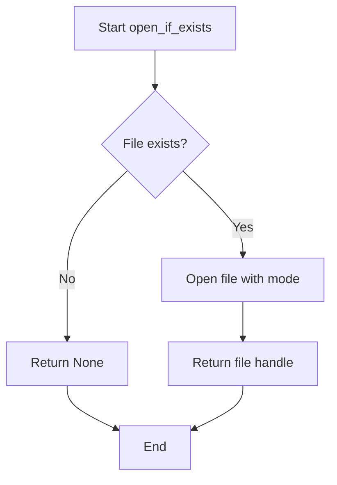

## Examples:
```python
# Safe file opening without exception handling
file_handle = open_if_exists("config.json")
if file_handle:
    data = json.load(file_handle)
    file_handle.close()
else:
    # Handle missing file case
    print("Config file not found")

# Opening in text mode
text_file = open_if_exists("README.md", "r")
if text_file:
    content = text_file.read()
    text_file.close()
```

## `src.jinja2.utils.object_type_repr` · *function*

## Summary:
Returns a human-readable string representation of an object's type, distinguishing between built-in types and custom types.

## Description:
This utility function converts an object into a descriptive string that indicates its type. It provides special handling for None and Ellipsis objects, while for regular objects it distinguishes between built-in types (which are displayed simply as "TypeName object") and types from other modules (which are displayed as "module.NameType object").

## Args:
    obj (Any): The object whose type representation is to be generated

## Returns:
    str: A string describing the object's type. Possible return values include:
        - "None" for None objects
        - "Ellipsis" for Ellipsis objects  
        - "{type_name} object" for built-in types (e.g., "int object", "str object")
        - "{module}.{type_name} object" for non-built-in types (e.g., "my_module.MyClass object")

## Raises:
    No exceptions are raised by this function

## Constraints:
    Preconditions:
        - The function accepts any Python object as input
        - No specific validation is performed on the input
    
    Postconditions:
        - Always returns a string value
        - The returned string follows a consistent format pattern

## Side Effects:
    None - This function has no side effects

## Control Flow:
```mermaid
flowchart TD
    A[Start: object_type_repr(obj)] --> B{obj is None?}
    B -- Yes --> C[Return "None"]
    B -- No --> D{obj is Ellipsis?}
    D -- Yes --> E[Return "Ellipsis"]
    D -- No --> F[Get type of obj]
    F --> G{type.__module__ == "builtins"?}
    G -- Yes --> H[Return "{type.__name__} object"]
    G -- No --> I[Return "{type.__module__}.{type.__name__} object"]
```

## Examples:
    >>> object_type_repr(None)
    'None'
    
    >>> object_type_repr(...)
    'Ellipsis'
    
    >>> object_type_repr(42)
    'int object'
    
    >>> object_type_repr("hello")
    'str object'
    
    >>> object_type_repr([1, 2, 3])
    'list object'

## `src.jinja2.utils.pformat` · *function*

## Summary:
Formats any Python object into a human-readable string representation.

## Description:
This function provides a convenient way to create formatted string representations of Python objects using the standard library's pprint module. It serves as a thin wrapper around `pprint.pformat()` to ensure consistent formatting behavior throughout the Jinja2 codebase.

## Args:
    obj (Any): Any Python object that can be formatted by pprint. This includes basic data types, containers, custom objects, and complex nested structures.

## Returns:
    str: A formatted string representation of the input object, suitable for debugging and logging purposes.

## Raises:
    None: This function does not raise any exceptions directly. Any exceptions would come from the underlying `pprint.pformat()` implementation.

## Constraints:
    - Preconditions: The input object must be serializable by the pprint module
    - Postconditions: The returned string will be a valid formatted representation of the input object

## Side Effects:
    - None: This function has no side effects beyond returning a formatted string

## Control Flow:
```mermaid
flowchart TD
    A[Call pformat(obj)] --> B{Input validation}
    B --> C[Import pprint.pformat]
    C --> D[Call pformat(obj)]
    D --> E[Return formatted string]
```

## Examples:
```python
# Basic usage
result = pformat({'key': 'value'})
print(result)  # {'key': 'value'}

# Complex nested structure
data = {'users': [{'name': 'Alice', 'age': 30}]}
formatted = pformat(data)
print(formatted)  # {'users': [{'name': 'Alice', 'age': 30}]}
```

## `src.jinja2.utils.generate_lorem_ipsum` · *function*

## Summary:
Generates randomized lorem ipsum text with proper punctuation and capitalization for specified number of paragraphs.

## Description:
Creates realistic-looking placeholder text by randomly selecting words from a predefined set and applying grammatical formatting rules. This function is designed to produce text suitable for layout previews and testing user interfaces.

## Args:
    n (int): Number of paragraphs to generate. Defaults to 5.
    html (bool): Whether to return HTML markup with paragraph tags. Defaults to True.
    min (int): Minimum number of words per paragraph (inclusive). Defaults to 20.
    max (int): Maximum number of words per paragraph (exclusive). Defaults to 100.

## Returns:
    str: Generated lorem ipsum text. If html=True, returns markupsafe.Markup object with HTML paragraph tags. If html=False, returns plain text separated by double newlines.

## Raises:
    None explicitly raised.

## Constraints:
    Preconditions:
    - n must be non-negative integer
    - min and max must be positive integers with min < max
    - LOREM_IPSUM_WORDS constant must be properly defined and contain space-separated words
    
    Postconditions:
    - Returned text will contain exactly n paragraphs when html=True
    - Returned text will contain exactly n paragraphs when html=False
    - Each paragraph will have between min (inclusive) and max (exclusive) words
    - Paragraphs will end with periods or commas appropriately

## Side Effects:
    None.

## Control Flow:
```mermaid
flowchart TD
    A[Start generate_lorem_ipsum] --> B{html flag}
    B -- True --> C[Create HTML markup]
    B -- False --> D[Join with double newlines]
    C --> E[Process each paragraph]
    D --> E
    E --> F[Generate n paragraphs]
    F --> G{Loop over n}
    G --> H[Initialize paragraph state]
    H --> I[Generate random word count (randrange(min, max))]
    I --> J[Generate words with constraints]
    J --> K{Word selection loop}
    K --> L[Select random word]
    L --> M{Word != last word?}
    M -- Yes --> N[Update last word]
    M -- No --> O[Continue selecting]
    N --> P[Apply capitalization if needed]
    P --> Q[Add punctuation if needed]
    Q --> R[Append to paragraph]
    R --> S{End of paragraph?}
    S -- Yes --> T[Finalize paragraph]
    T --> U[Add to result]
    U --> V{More paragraphs?}
    V --> W[Return result]
```

## Examples:
    # Generate 3 paragraphs with default settings
    text = generate_lorem_ipsum(3)
    # Returns HTML formatted text with 3 paragraphs
    
    # Generate 2 paragraphs as plain text
    text = generate_lorem_ipsum(2, html=False)
    # Returns plain text with double newlines between paragraphs
    
    # Generate paragraphs with custom word counts
    text = generate_lorem_ipsum(1, min=10, max=30)
    # Returns 1 paragraph with 10-29 words (max is exclusive)

## `src.jinja2.utils.url_quote` · *function*

## Summary:
URL-encodes an object for use in URLs or query strings, handling various input types and special query string formatting.

## Description:
Converts an input object (string, bytes, or other types) into a URL-encoded string. The function properly handles different input types by converting them to bytes using the specified character encoding, then applies URL encoding with appropriate safe characters based on whether the result is intended for use in query strings.

This function is extracted to provide a consistent, reusable approach to URL encoding throughout the Jinja2 template system, separating the concerns of type conversion and URL encoding logic from the template rendering process.

## Args:
    obj (Any): The object to URL-encode. Can be a string, bytes, or any object that can be converted to string.
    charset (str): Character encoding to use when converting non-byte/string objects to bytes. Defaults to "utf-8".
    for_qs (bool): If True, format the result for use in query strings (replaces %20 with +). Defaults to False.

## Returns:
    str: URL-encoded representation of the input object.

## Raises:
    UnicodeEncodeError: When the object cannot be encoded using the specified charset.

## Constraints:
    Preconditions:
    - The charset parameter must be a valid character encoding recognized by Python's encode() method
    - The obj parameter must be convertible to string or bytes
    
    Postconditions:
    - Returns a valid URL-encoded string
    - When for_qs=True, spaces are represented as '+' instead of '%20'

## Side Effects:
    None

## Control Flow:
```mermaid
flowchart TD
    A[Start url_quote] --> B{isinstance(obj, bytes)?}
    B -- Yes --> C[Set safe=b""]
    B -- No --> D{isinstance(obj, str)?}
    D -- No --> E[obj = str(obj)]
    E --> F[obj = obj.encode(charset)]
    D -- Yes --> G[obj = obj.encode(charset)]
    C --> H[Set safe=b"/"]
    H --> I[quote_from_bytes(obj, safe)]
    I --> J{for_qs?}
    J -- Yes --> K[rv = rv.replace("%20", "+")]
    J -- No --> L[Return rv]
    K --> L
```

## Examples:
    >>> url_quote("hello world")
    'hello%20world'
    
    >>> url_quote("hello world", for_qs=True)
    'hello+world'
    
    >>> url_quote(123)
    '123'
    
    >>> url_quote(b"hello world")
    'hello%20world'
```

## `src.jinja2.utils.LRUCache` · *class*

## Summary:
LRUCache implements a thread-safe, fixed-capacity cache with Least Recently Used eviction policy.

## Description:
This class provides a cache data structure that maintains a fixed number of items and automatically evicts the least recently used item when the capacity is exceeded. It is designed for use in Jinja2 templating engine where caching frequently accessed data improves performance. The cache is thread-safe and supports standard dictionary-like operations.

## State:
- capacity: int, the maximum number of items the cache can hold
- _mapping: dict, maps cache keys to values for O(1) lookup
- _queue: deque, maintains insertion order to track usage for LRU eviction
- _popleft: deque.popleft bound method, for removing oldest items
- _pop: deque.pop bound method, for removing newest items  
- _remove: deque.remove bound method, for removing specific items
- _wlock: Lock, for thread synchronization
- _append: deque.append bound method, for adding items to queue

## Lifecycle:
Creation: Instantiate with a positive integer capacity parameter
Usage: Access items via [] operators, get(), setdefault(), or other dict-like methods
Destruction: Automatic cleanup when object is garbage collected

## Method Map:
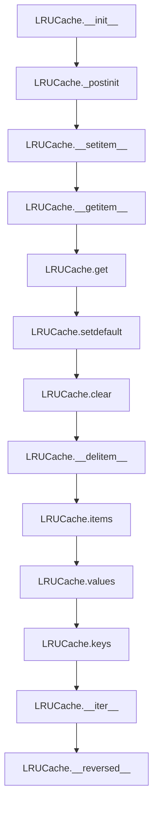

## Raises:
- None explicitly raised by __init__
- KeyError raised by __getitem__, get(), setdefault() when key is not found

## Example:
```python
# Create cache with capacity 3
cache = LRUCache(3)

# Add items
cache['a'] = 1
cache['b'] = 2
cache['c'] = 3

# Access items (updates LRU order)
value = cache['a']

# Add item that exceeds capacity (evicts least recently used)
cache['d'] = 4  # This evicts 'b' since it was least recently used

# Check contents
print(list(cache))  # ['c', 'a', 'd']
print(len(cache))   # 3
```

### `src.jinja2.utils.LRUCache.__init__` · *method*

## Summary:
Initializes an LRU cache with the specified maximum capacity and sets up internal data structures for caching operations.

## Description:
This method constructs a new LRUCache instance with the given capacity limit. It initializes the internal mapping dictionary for O(1) key-value lookups and deque for tracking usage order to support LRU eviction policy. The method also calls _postinit() to set up optimized method references and thread synchronization primitives.

## Args:
    capacity (int): The maximum number of items the cache can hold. Must be a positive integer.

## Returns:
    None: This method does not return a value.

## Raises:
    None: This method does not explicitly raise exceptions.

## State Changes:
    Attributes READ: None
    Attributes WRITTEN: self.capacity, self._mapping, self._queue

## Constraints:
    Preconditions: The capacity argument must be a positive integer
    Postconditions: The LRUCache instance is initialized with capacity, mapping, and queue attributes set up

## Side Effects:
    None: This method does not perform I/O operations or mutate external objects.

### `src.jinja2.utils.LRUCache._postinit` · *method*

## Summary:
Initializes internal method references and synchronization primitives for the LRU cache queue operations.

## Description:
This method sets up optimized method references from the internal deque and creates a thread lock for safe concurrent access. It is called during object initialization and deserialization to ensure proper setup of internal state without duplicating code.

## Args:
    None: This method takes no parameters.

## Returns:
    None: This method does not return a value.

## Raises:
    None: This method does not explicitly raise exceptions.

## State Changes:
    Attributes READ: self._queue
    Attributes WRITTEN: self._popleft, self._pop, self._remove, self._wlock, self._append

## Constraints:
    Preconditions: The calling object must have a self._queue attribute that is a deque-like object
    Postconditions: The LRUCache instance will have optimized method references and a thread lock ready for concurrent operations

## Side Effects:
    None: This method does not perform I/O operations or mutate external objects.

### `src.jinja2.utils.LRUCache.__getstate__` · *method*

## Summary:
Returns the serialized state of the LRU cache for pickling operations.

## Description:
Implements Python's pickle protocol by returning a dictionary containing the essential state information needed to reconstruct the LRUCache instance during deserialization. This method is automatically invoked by the pickle module during serialization and works in conjunction with `__setstate__` and `__getnewargs__` to provide complete pickle support for the LRUCache class.

## Args:
    None

## Returns:
    dict: A mapping containing the cache's state with keys:
        - "capacity" (int): Maximum number of items the cache can hold
        - "_mapping" (dict): Internal dictionary mapping cache keys to values
        - "_queue" (collections.deque): Ordered collection tracking item access order

## Raises:
    None

## State Changes:
    Attributes READ: self.capacity, self._mapping, self._queue
    Attributes WRITTEN: None

## Constraints:
    Preconditions: The LRUCache instance must be properly initialized with valid attributes.
    Postconditions: The returned dictionary contains exactly the three state attributes needed for reconstruction.

## Side Effects:
    None

### `src.jinja2.utils.LRUCache.__setstate__` · *method*

## Summary:
Restores the cached object's state during unpickling and initializes internal attributes.

## Description:
This method is part of Python's pickle protocol and is called during object deserialization to restore the LRUCache's state from a pickled representation. It updates the instance's dictionary with the provided state data and performs necessary post-initialization setup.

## Args:
    d (Mapping[str, Any]): A mapping containing the serialized state data to restore

## Returns:
    None: This method does not return a value

## Raises:
    None: This method does not explicitly raise exceptions

## State Changes:
    Attributes READ: None
    Attributes WRITTEN: All attributes from the input mapping `d`, plus internal attributes initialized by `_postinit()`

## Constraints:
    Preconditions: The input mapping `d` must contain valid state data compatible with LRUCache's structure
    Postconditions: The LRUCache instance will have restored state and properly initialized internal attributes

## Side Effects:
    None: This method does not perform I/O operations or mutate external objects

### `src.jinja2.utils.LRUCache.__getnewargs__` · *method*

## Summary:
Returns the arguments needed to reconstruct the LRUCache instance during unpickling.

## Description:
This method implements Python's pickle protocol by providing the constructor arguments required to recreate the LRUCache instance. It is automatically called by the pickle module during serialization and is paired with `__setstate__` for complete pickle support. The method returns a tuple containing only the cache capacity, which is sufficient to reconstruct the object since all other state is managed by `__getstate__` and `__setstate__`.

## Args:
    None

## Returns:
    tuple: A single-element tuple containing the cache capacity (int) used to reconstruct the LRUCache instance.

## Raises:
    None

## State Changes:
    Attributes READ: self.capacity
    Attributes WRITTEN: None

## Constraints:
    Preconditions: The LRUCache instance must be properly initialized with a valid capacity.
    Postconditions: The returned tuple contains exactly one element representing the capacity value.

## Side Effects:
    None

### `src.jinja2.utils.LRUCache.copy` · *method*

## Summary:
Creates a shallow copy of the LRU cache instance with identical capacity and contents.

## Description:
This method generates a new LRUCache instance with the same capacity as the caller, and copies all key-value mappings and access order tracking from the original cache. This allows for creating independent cache instances that share the same configuration but can be modified separately.

## Args:
    None

## Returns:
    LRUCache: A new instance of the same class with identical capacity, mapping, and queue contents.

## Raises:
    None explicitly raised

## State Changes:
    Attributes READ: self.capacity, self._mapping, self._queue
    Attributes WRITTEN: None (the returned instance has its own state)

## Constraints:
    Preconditions: The instance must have capacity, _mapping, and _queue attributes properly initialized
    Postconditions: The returned instance will have identical capacity, mapping, and queue contents to the original

## Side Effects:
    None

### `src.jinja2.utils.LRUCache.setdefault` · *method*

## Summary:
Retrieves a value from the cache by key or sets and returns a default value if the key is not present.

## Description:
This method attempts to retrieve a value associated with the given key from the LRU cache. If the key exists, it returns the cached value. If the key does not exist, it adds the key with the specified default value to the cache and returns that default value. This operation maintains the LRU ordering by updating the usage position of the accessed key.

## Args:
    key (Any): The key to look up in the cache
    default (Any, optional): The default value to set and return if the key is not found. Defaults to None

## Returns:
    Any: The cached value if the key exists, otherwise the default value that was set

## Raises:
    None explicitly raised

## State Changes:
    Attributes READ: self._mapping, self._queue, self._wlock
    Attributes WRITTEN: self._mapping, self._queue

## Constraints:
    Preconditions: The LRUCache instance must be properly initialized with a positive capacity
    Postconditions: If the key exists, it becomes the most recently used item. If the key doesn't exist, it's added to the cache with the default value and becomes the most recently used item.

## Side Effects:
    Mutates the cache state by potentially adding a new key-value pair and updating the usage queue
    Acquires and releases a lock (self._wlock) during cache operations

### `src.jinja2.utils.LRUCache.clear` · *method*

*No documentation generated.*

### `src.jinja2.utils.LRUCache.__contains__` · *method*

## Summary:
Checks if a key exists in the LRU cache mapping.

## Description:
Implements the `__contains__` special method to enable the `in` operator for LRUCache instances. This method provides O(1) lookup time by delegating to the underlying dictionary mapping.

## Args:
    key (Any): The key to search for in the cache.

## Returns:
    bool: True if the key exists in the cache, False otherwise.

## State Changes:
    Attributes READ: self._mapping

## Constraints:
    Preconditions: The method assumes `self._mapping` is a valid dictionary-like object.
    Postconditions: The method returns a boolean indicating key existence without modifying cache state.

## Side Effects:
    None: This method performs no I/O operations or external service calls. It only accesses internal state.

### `src.jinja2.utils.LRUCache.__len__` · *method*

## Summary:
Returns the number of key-value pairs currently stored in the LRU cache.

## Description:
Implements the special `__len__` method to enable the built-in `len()` function to work with LRUCache instances. This method provides constant-time O(1) access to the cache size by delegating to the underlying dictionary's length operation.

## Args:
    None: This method takes no arguments beyond the implicit `self` parameter.

## Returns:
    int: The number of key-value pairs currently stored in the cache, ranging from 0 to the cache capacity.

## Raises:
    None: This method does not raise any exceptions under normal circumstances.

## State Changes:
    Attributes READ: self._mapping
    Attributes WRITTEN: None

## Constraints:
    Preconditions: The LRUCache instance must be properly initialized with a valid `_mapping` attribute that behaves like a dictionary.
    Postconditions: The method returns the current count of items in the cache without modifying the cache state.

## Side Effects:
    None: This method performs no I/O operations or external service calls. It only accesses internal state.

### `src.jinja2.utils.LRUCache.__repr__` · *method*

## Summary:
Returns a string representation of the LRUCache instance showing its type and internal mapping state.

## Description:
This method provides a standardized string representation for LRUCache objects, displaying the class name and the internal `_mapping` attribute. It is automatically called by Python's built-in functions like `repr()` and `print()` when dealing with LRUCache instances.

## Args:
    None

## Returns:
    str: A string in the format "<ClassName mapping_content>" where mapping_content is the repr() of the internal _mapping attribute.

## Raises:
    None

## State Changes:
    Attributes READ: self._mapping
    Attributes WRITTEN: None

## Constraints:
    Preconditions: The LRUCache instance must have a `_mapping` attribute that can be represented by `!r` formatting.
    Postconditions: The returned string accurately represents the object's type and internal state.

## Side Effects:
    None

### `src.jinja2.utils.LRUCache.__getitem__` · *method*

## Summary:
Retrieves a value from the LRU cache and updates its position in the access queue to mark it as recently used.

## Description:
Implements the dictionary-style item retrieval for the LRUCache, returning the value associated with the given key while maintaining LRU (Least Recently Used) ordering. This method ensures thread safety by acquiring a write lock before accessing internal state and updates the internal queue to reflect the most recent access pattern.

## Args:
    key (Any): The key to retrieve from the cache. May be of any hashable type.

## Returns:
    Any: The value associated with the specified key in the cache.

## Raises:
    KeyError: When the specified key does not exist in the cache.

## State Changes:
    Attributes READ: 
        - self._wlock: Thread synchronization lock
        - self._mapping: Dictionary storing key-value pairs
        - self._queue: Deque maintaining access order
    
    Attributes WRITTEN:
        - self._queue: Updates the position of the accessed key to the end (most recently used position)

## Constraints:
    Preconditions:
        - The key must exist in the cache (in self._mapping)
        - The cache instance must be properly initialized
    
    Postconditions:
        - The key-value pair remains in the cache
        - The accessed key is moved to the end of the internal queue (most recently used position)
        - Thread safety is maintained via self._wlock

## Side Effects:
    None: This method only modifies internal state and does not perform I/O or external operations.

### `src.jinja2.utils.LRUCache.__setitem__` · *method*

## Summary:
Sets a key-value pair in the LRU cache, updating the cache's usage order and potentially evicting the least recently used item when capacity is exceeded.

## Description:
This method implements the core functionality for adding or updating items in the LRU (Least Recently Used) cache. When setting a key-value pair, it ensures the key is marked as most recently used and maintains the cache size within its configured capacity by removing the least recently used item when necessary.

## Args:
    key (Any): The key to set in the cache
    value (Any): The value to associate with the key

## Returns:
    None: This method does not return a value

## Raises:
    None explicitly raised: The method handles potential ValueError exceptions internally when removing items from the queue

## State Changes:
    Attributes READ: self._wlock, self._mapping, self.capacity, self._queue
    Attributes WRITTEN: self._mapping, self._queue

## Constraints:
    Preconditions: 
    - The cache instance must be properly initialized with a positive capacity
    - The key and value arguments can be any hashable type
    - Thread safety is maintained via self._wlock
    
    Postconditions:
    - The key-value pair is stored in self._mapping
    - The key is positioned as most recently used in self._queue
    - If capacity was exceeded, the least recently used item is removed
    - Cache size never exceeds self.capacity

## Side Effects:
    - Modifies internal state of self._mapping and self._queue
    - May remove items from the cache when capacity is exceeded
    - Acquires and releases a threading lock (self._wlock)

### `src.jinja2.utils.LRUCache.__delitem__` · *method*

## Summary:
Removes a key-value pair from the LRU cache and updates the internal tracking structures.

## Description:
Implements the `del` operator for the LRUCache, removing a key from both the internal mapping dictionary and the ordering queue. This method ensures thread-safe removal by acquiring the write lock before modifying internal state. The method assumes the key exists in the cache, as attempting to delete a non-existent key would raise a KeyError.

## Args:
    key (Any): The key to remove from the cache. Must exist in the cache.

## Returns:
    None: This method does not return a value.

## Raises:
    KeyError: When attempting to delete a key that does not exist in the cache.
    ValueError: When the key exists in the mapping but not in the internal queue (defensive handling).

## State Changes:
    Attributes READ: 
        - self._wlock: Thread synchronization lock
        - self._mapping: Dictionary storing key-value pairs
        - self._remove: Method reference to deque.remove()
    
    Attributes WRITTEN:
        - self._mapping: Removes the key-value pair
        - self._queue: Removes the key from the ordering structure

## Constraints:
    Preconditions:
        - The key must exist in the cache (in self._mapping)
        - The cache instance must be properly initialized
    
    Postconditions:
        - The key-value pair is completely removed from the cache
        - The internal queue is updated to reflect the removal
        - Thread safety is maintained via self._wlock

## Side Effects:
    None: This method only modifies internal state and does not perform I/O or external operations.

### `src.jinja2.utils.LRUCache.items` · *method*

## Summary:
Returns key-value pairs from the cache in least recently used order.

## Description:
Retrieves all key-value pairs stored in the LRU cache, ordered from least recently used to most recently used. This method provides a way to iterate over the entire cache contents while respecting the LRU eviction policy.

## Args:
    None

## Returns:
    Iterable[Tuple[Any, Any]]: An iterable of (key, value) tuples ordered by LRU policy, with the least recently used items first.

## Raises:
    None

## State Changes:
    Attributes READ: self._mapping, self._queue
    Attributes WRITTEN: None

## Constraints:
    Preconditions: The LRUCache instance must be properly initialized with valid _mapping and _queue attributes.
    Postconditions: The returned iterable contains all key-value pairs currently in the cache, in LRU order.

## Side Effects:
    None

### `src.jinja2.utils.LRUCache.values` · *method*

## Summary:
Returns an iterable of all cached values in least-recently-used order.

## Description:
This method provides access to all values stored in the LRU cache, maintaining the order of most recent access. Values are returned in reverse order of insertion (most recent first), matching the internal queue ordering.

## Args:
    None

## Returns:
    t.Iterable[t.Any]: An iterable containing all cached values in LRU order (most recent first).

## Raises:
    None

## State Changes:
    Attributes READ: self._queue, self._mapping
    Attributes WRITTEN: None

## Constraints:
    Preconditions: None
    Postconditions: The returned iterable contains all values currently in the cache, ordered by access frequency and recency.

## Side Effects:
    None

### `src.jinja2.utils.LRUCache.keys` · *method*

## Summary:
Returns a list of all keys currently stored in the LRU cache.

## Description:
This method returns a list containing all keys currently in the cache by converting the LRUCache instance to a list. The iteration order of keys follows the underlying implementation of the cache's `__iter__` method.

## Args:
    self: The LRUCache instance from which to extract keys.

## Returns:
    list[Any]: A list containing all keys currently in the cache, with the iteration order determined by the cache's internal structure.

## Raises:
    None explicitly raised.

## State Changes:
    Attributes READ: None
    Attributes WRITTEN: None

## Constraints:
    Preconditions: The LRUCache instance must be properly initialized.
    Postconditions: The returned list contains all keys currently in the cache without modifying the cache state.

## Side Effects:
    None.

### `src.jinja2.utils.LRUCache.__iter__` · *method*

## Summary:
Returns an iterator over the cache keys in most-recently-used order.

## Description:
This method implements the standard Python iterator protocol for the LRUCache class, providing access to cache keys in order from most recently used to least recently used. It is called implicitly when iterating over an LRUCache instance using a for-loop or when converting the cache to a list.

## Args:
    None

## Returns:
    Iterator[Any]: An iterator that yields cache keys in most-recently-used order (most recent first).

## Raises:
    None

## State Changes:
    Attributes READ: self._queue
    Attributes WRITTEN: None

## Constraints:
    Preconditions: The LRUCache instance must be properly initialized with a valid capacity and queue.
    Postconditions: The returned iterator is a view of the current state of the cache's internal queue.

## Side Effects:
    None

### `src.jinja2.utils.LRUCache.__reversed__` · *method*

## Summary:
Returns an iterator over cache keys in least-recently-used order.

## Description:
Implements the Python special method `__reversed__` to provide iteration over cache keys in reverse order, from least recently used to most recently used. This method complements the `__iter__` method which provides the opposite ordering (most recently used first). When called, it creates an iterator from the internal queue of keys, allowing users to traverse the cache contents in least-recently-used order.

## Args:
    None

## Returns:
    Iterator[Any]: An iterator that yields cache keys in least-recently-used order (least recent first).

## Raises:
    None

## State Changes:
    Attributes READ: self._queue
    Attributes WRITTEN: None

## Constraints:
    Preconditions: The LRUCache instance must be properly initialized with a valid capacity and queue.
    Postconditions: The returned iterator reflects the current state of the cache's internal queue.

## Side Effects:
    None

## `src.jinja2.utils.select_autoescape` · *function*

## Summary:
Creates a function that determines whether autoescaping should be enabled for Jinja2 templates based on file extensions.

## Description:
This function generates a predicate function that evaluates whether autoescaping should be enabled for a given template name. It's designed to be used as an autoescape selection callback in Jinja2 environments. The logic is based on matching template file extensions against configured enabled/disabled lists.

## Args:
    enabled_extensions (Collection[str]): File extensions that should enable autoescaping. Defaults to ("html", "htm", "xml"). Extensions can include or exclude the leading dot.
    disabled_extensions (Collection[str]): File extensions that should disable autoescaping. Defaults to (). Extensions can include or exclude the leading dot.
    default_for_string (bool): Whether to enable autoescaping when template name is None. Defaults to True. This is used when processing strings rather than file paths.
    default (bool): Default autoescape setting when extension doesn't match any patterns. Defaults to False.

## Returns:
    Callable[[Optional[str]], bool]: A function that takes a template name (or None) and returns a boolean indicating whether autoescaping should be enabled.

## Raises:
    No explicit exceptions are raised by this function.

## Constraints:
    Preconditions:
    - enabled_extensions and disabled_extensions should contain valid file extensions as strings
    - All extensions should be comparable via string operations
    
    Postconditions:
    - The returned function will always return a boolean value
    - Template names are compared in lowercase for case-insensitive matching
    - Extension matching uses suffix comparison (endswith)

## Side Effects:
    None - This function is pure and has no side effects.

## Control Flow:
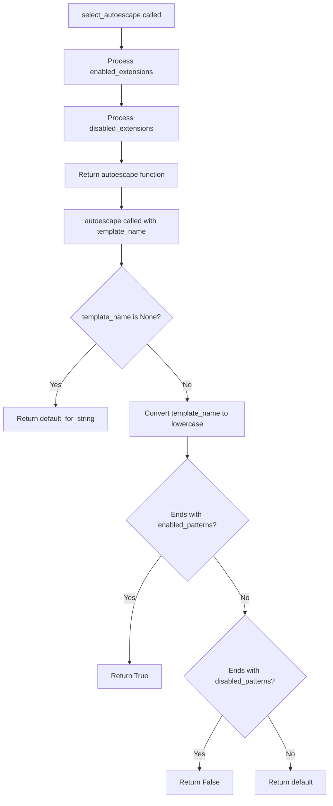

## Examples:
```python
# Basic usage with defaults
autoescape_func = select_autoescape()
# Enables autoescaping for .html, .htm, .xml files
result = autoescape_func("page.html")  # Returns True
result = autoescape_func("script.js")  # Returns False (uses default)

# Custom configuration
autoescape_func = select_autoescape(
    enabled_extensions=("html", "htm", "xml", "json"),
    disabled_extensions=("txt",),
    default=False
)
result = autoescape_func("data.json")  # Returns True
result = autoescape_func("readme.txt")  # Returns False

# Using with None (string processing)
result = autoescape_func(None)  # Returns True (default_for_string)
```

## `src.jinja2.utils.htmlsafe_json_dumps` · *function*

## Summary:
Creates HTML-safe JSON string representation of an object by escaping special HTML characters.

## Description:
Serializes an object to JSON format and escapes HTML characters (<, >, &, ') to prevent XSS vulnerabilities when embedding JSON data in HTML templates. This function is particularly useful in web applications where JSON data needs to be safely rendered within HTML contexts.

## Args:
    obj (Any): The Python object to serialize to JSON format.
    dumps (Optional[Callable[..., str]]): Optional custom JSON serialization function. Defaults to json.dumps if not provided.
    **kwargs (Any): Additional keyword arguments passed to the dumps function.

## Returns:
    markupsafe.Markup: An HTML-safe JSON string wrapped in a Markup object that indicates it should not be escaped again.

## Raises:
    Any exceptions raised by the underlying json.dumps() or provided dumps function.

## Constraints:
    Preconditions:
        - The obj parameter must be serializable to JSON
        - The dumps parameter, if provided, must be callable and accept the same arguments as json.dumps
    
    Postconditions:
        - The returned value is always a markupsafe.Markup instance
        - All HTML special characters (<, >, &, ') in the JSON string are escaped using Unicode escape sequences

## Side Effects:
    None

## Control Flow:
```mermaid
flowchart TD
    A[Call htmlsafe_json_dumps] --> B{dumps is None?}
    B -- Yes --> C[Set dumps = json.dumps]
    B -- No --> C
    C --> D[Serialize obj to JSON using dumps()]
    D --> E[Escape '<' to '\\u003c']
    E --> F[Escape '>' to '\\u003e']
    F --> G[Escape '&' to '\\u0026']
    G --> H[Escape ''' to '\\u0027']
    H --> I[Wrap result in markupsafe.Markup]
    I --> J[Return result]
```

## Examples:
```python
# Basic usage
data = {"name": "John", "age": 30}
json_str = htmlsafe_json_dumps(data)
# Returns: markupsafe.Markup('{"name": "John", "age": 30}')

# With HTML characters in data
data_with_html = {"message": "<script>alert('xss')</script>"}
safe_json = htmlsafe_json_dumps(data_with_html)
# Returns: markupsafe.Markup('{\\"message\\": \\"\\\\u003cscript\\\\u003ealert(\\\\u0027xss\\\\u0027)\\\\u003c/script\\\\u003e\\"}')

# With custom dumps function
import ujson
safe_json = htmlsafe_json_dumps(data, dumps=ujson.dumps)
```

## `src.jinja2.utils.Cycler` · *class*

## Summary:
A circular iterator that cycles through a fixed set of items, maintaining internal state to track the current position.

## Description:
The Cycler class provides a mechanism to iterate through a collection of items in a circular fashion. It maintains an internal position counter that advances through the items, wrapping around to the beginning when reaching the end. This class is useful for scenarios where you need to repeatedly cycle through a predefined set of values, such as color schemes, template variables, or any situation requiring rotational iteration.

The class is designed to be instantiated with at least one item, making it suitable for creating rotating sequences where the number of items is known at construction time.

## State:
- items: tuple of t.Any, containing the collection of items to cycle through
- pos: int, representing the current position in the items sequence (0-based index) used by the current property

Class invariants:
- The items tuple is immutable once set during initialization
- The pos attribute is always within the valid range [0, len(items))
- When pos reaches len(items), it wraps back to 0 due to modulo arithmetic

## Lifecycle:
Creation: Instantiate with one or more items using Cycler(*items). At least one item is required.
Usage: Call next() or use as an iterator to advance through items. Use reset() to restart from the beginning.
Destruction: No special cleanup required; standard Python garbage collection handles destruction.

## Method Map:
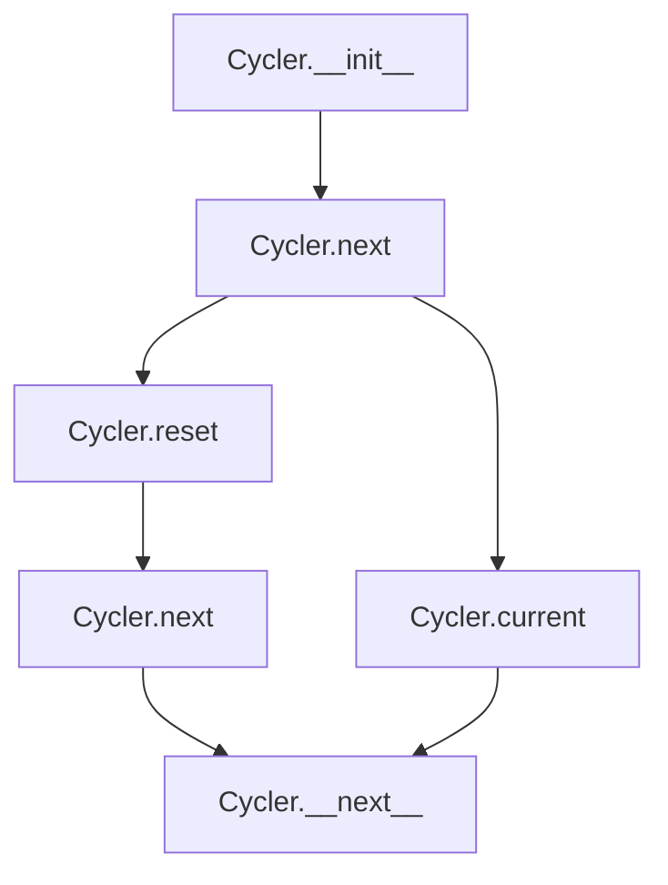

## Raises:
- RuntimeError: Raised during initialization when no items are provided to the constructor

## Example:
```python
# Create a cycler with color names
colors = Cycler('red', 'green', 'blue')
print(colors.current)  # 'red'
print(next(colors))    # 'red'
print(next(colors))    # 'green'
print(next(colors))    # 'blue'
print(next(colors))    # 'red' (wraps around)
colors.reset()
print(colors.current)  # 'red' (back to start)
```

### `src.jinja2.utils.Cycler.__init__` · *method*

## Summary:
Initializes a Cycler instance with a sequence of items to cycle through.

## Description:
Constructs a Cycler object that maintains a sequence of items and tracks the current position for cycling through them. This method validates that at least one item is provided and initializes the internal state for iteration.

## Args:
    *items (t.Any): Variable length argument list of items to cycle through. Must contain at least one item.

## Returns:
    None: This method does not return a value.

## Raises:
    RuntimeError: Raised when no items are provided to the constructor.

## State Changes:
    Attributes READ: None
    Attributes WRITTEN: 
        - self.items: Set to the tuple of provided items
        - self.pos: Initialized to 0

## Constraints:
    Preconditions:
        - At least one item must be provided in the *items argument
    Postconditions:
        - self.items contains all provided items as a tuple
        - self.pos is initialized to 0

## Side Effects:
    None: This method performs no I/O operations or external service calls.

### `src.jinja2.utils.Cycler.reset` · *method*

## Summary:
Resets the cycler's position indicator back to the beginning of the item sequence.

## Description:
This method resets the internal position counter of the Cycler instance to zero, effectively making the next call to `next()` or access to `current` return the first item in the sequence. This is useful when you want to restart iteration from the beginning of a cyclic sequence without modifying the underlying items.

## Args:
    None

## Returns:
    None

## Raises:
    None

## State Changes:
    Attributes READ: None
    Attributes WRITTEN: self.pos

## Constraints:
    Preconditions: The Cycler instance must be properly initialized with items
    Postconditions: The self.pos attribute is set to 0

## Side Effects:
    None

### `src.jinja2.utils.Cycler.current` · *method*

## Summary:
Returns the current item in the cycling sequence without advancing the position.

## Description:
Provides access to the item at the current position in the Cycler's sequence. This property allows reading the current item without modifying the internal position counter, making it useful for inspecting the current state without affecting the cycling behavior.

## Args:
    None

## Returns:
    Any: The item at the current position in the items sequence. The type matches the type of items stored in the Cycler.

## Raises:
    None

## State Changes:
    Attributes READ: self.items, self.pos
    Attributes WRITTEN: None

## Constraints:
    Preconditions: The Cycler instance must be properly initialized with at least one item.
    Postconditions: The method does not modify the internal position counter or any other state.

## Side Effects:
    None

### `src.jinja2.utils.Cycler.next` · *method*

## Summary:
Returns the current item in the cycling sequence and advances the internal position to the next item in the cycle.

## Description:
The next method implements the core cycling behavior of the Cycler class. It retrieves the item at the current position, advances the internal position counter to the next item (wrapping around to the beginning when reaching the end), and returns the previously current item. This method is typically used in iterative contexts where sequential access to a fixed set of items is required.

## Args:
    None

## Returns:
    Any: The item that was at the current position before advancing. The return type matches the type of items stored in the Cycler.

## Raises:
    None

## State Changes:
    Attributes READ: self.current, self.items, self.pos
    Attributes WRITTEN: self.pos

## Constraints:
    Preconditions: The Cycler instance must be properly initialized with at least one item.
    Postconditions: The internal position counter is advanced to the next position in the cycle, wrapping around to position 0 when reaching the end.

## Side Effects:
    None

## `src.jinja2.utils.Joiner` · *class*

## Summary:
A callable separator generator that returns an empty string on first use and the configured separator on subsequent uses.

## Description:
The Joiner class provides a mechanism for joining elements where the first element should not have a preceding separator. This is commonly used in templating systems to generate comma-separated lists or similar constructs without requiring special handling for the first item.

## State:
- sep: str - The separator string to be returned on subsequent calls. Default is ", ".
- used: bool - Tracks whether the Joiner has been invoked. Initially set to False.

## Lifecycle:
- Creation: Instantiate with an optional separator string (defaults to ", ")
- Usage: Call the instance repeatedly to get appropriate separator strings for joining elements
- Destruction: No explicit cleanup required as it's a simple stateful callable

## Method Map:
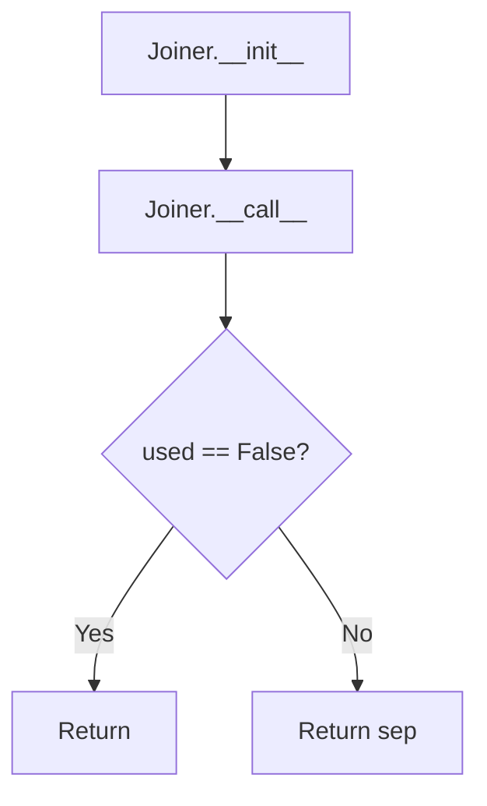

## Raises:
- No exceptions are raised by this class

## Example:
```python
# Create a joiner with default separator
joiner = Joiner()
result1 = joiner()  # Returns ""
result2 = joiner()  # Returns ", "

# Create a joiner with custom separator
custom_joiner = Joiner(" | ")
result1 = custom_joiner()  # Returns ""
result2 = custom_joiner()  # Returns " | "
```

### `src.jinja2.utils.Joiner.__init__` · *method*

## Summary:
Initializes a Joiner instance with a separator and unused flag.

## Description:
Constructs a Joiner object that maintains a separator string and tracks whether it has been used. This method is called during object instantiation to set up the initial state of the joiner.

## Args:
    sep (str): Separator string to use when joining elements. Defaults to ", ".

## Returns:
    None: This method does not return a value.

## Raises:
    None: This method does not raise any exceptions.

## State Changes:
    Attributes READ: None
    Attributes WRITTEN: 
        - self.sep: Set to the provided separator value
        - self.used: Initialized to False

## Constraints:
    Preconditions: None
    Postconditions: 
        - self.sep is set to the provided separator value
        - self.used is initialized to False

## Side Effects:
    None: This method performs no I/O operations or external service calls.

### `src.jinja2.utils.Joiner.__call__` · *method*

## Summary:
Returns the join separator string, with special handling for the first invocation to avoid leading separators.

## Description:
This method implements the callable interface of the Joiner class. When first invoked, it returns an empty string to prevent leading separators in joined output. Subsequent invocations return the configured separator string. This pattern is commonly used when building comma-separated or similar lists where a leading separator would be undesirable.

## Args:
    None

## Returns:
    str: An empty string on first call, or the configured separator string on subsequent calls.

## Raises:
    None

## State Changes:
    Attributes READ: self.sep, self.used
    Attributes WRITTEN: self.used

## Constraints:
    Preconditions: The Joiner instance must be properly initialized with a separator string.
    Postconditions: The `used` flag is set to True after the first call.

## Side Effects:
    None

## `src.jinja2.utils.Namespace` · *class*

## Summary:
A namespace container that stores key-value pairs and provides attribute-style access to them.

## Description:
The Namespace class serves as a container for storing arbitrary key-value pairs with attribute-style access. It's commonly used in Jinja2 templates to hold contextual data and variables. The class allows accessing stored values via dot notation (e.g., `namespace.key`) while also supporting dictionary-style assignment via bracket notation (`namespace['key'] = value`).

This abstraction provides a clean interface for managing template context data, making it easier to work with nested data structures and configuration settings in templating environments.

## State:
- `__attrs`: dict - stores all key-value pairs in a private dictionary
  - Valid range: Any key-value pairs that can be stored in a Python dict
  - Invariant: Always contains the key-value mappings set via constructor, `__setitem__`, or direct assignment

## Lifecycle:
- Creation: Instantiate with optional initial key-value pairs via constructor
- Usage: Access values using dot notation (`obj.attr`) or bracket notation (`obj['attr']`) for setting values
- Destruction: No special cleanup required; standard Python garbage collection handles memory management

## Method Map:
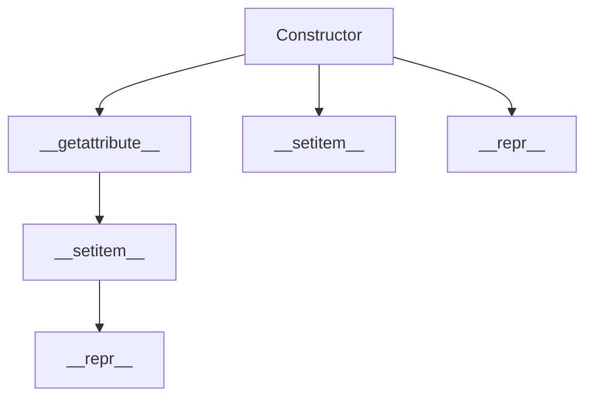

## Raises:
- AttributeError: Raised when accessing a non-existent attribute via dot notation
- TypeError: May be raised during initialization if arguments are incompatible with dict() constructor

## Example:
```python
# Create namespace with initial values
ns = Namespace({'key1': 'value1', 'key2': 'value2'})
# Access via dot notation
print(ns.key1)  # 'value1'
# Set new values via bracket notation
ns['new_key'] = 'new_value'
# String representation
print(repr(ns))  # "<Namespace {'key1': 'value1', 'key2': 'value2', 'new_key': 'new_value'}>"
```

### `src.jinja2.utils.Namespace.__init__` · *method*

## Summary:
Initializes a Namespace instance with optional key-value pairs for attribute storage.

## Description:
The Namespace.__init__ method serves as the constructor for creating Namespace instances. It accepts any number of positional and keyword arguments and constructs a dictionary from them to store as the internal attribute mapping. This enables the Namespace to hold arbitrary key-value pairs that can be accessed via attribute-style notation.

The method is typically called during object instantiation when creating a new Namespace with initial data, such as when building template contexts or configuration containers.

## Args:
    *args (t.Any): Variable length argument list that can contain:
        - A single dictionary-like object containing key-value pairs
        - An iterable of key-value pairs (tuples)
        - Other iterables that can be processed by dict()
    **kwargs (t.Any): Arbitrary keyword arguments that become key-value pairs in the namespace

## Returns:
    None: This method does not return a value.

## Raises:
    TypeError: May be raised if the arguments provided are incompatible with the dict() constructor, such as when passing non-iterable arguments.

## State Changes:
    Attributes READ: None
    Attributes WRITTEN: self.__attrs - stores the constructed dictionary of key-value pairs

## Constraints:
    Preconditions:
    - The Namespace instance must be properly allocated in memory before this method is called
    - Arguments must be compatible with the dict() constructor to avoid TypeError
    - The method assumes self has been properly initialized with a __attrs attribute placeholder
    
    Postconditions:
    - self.__attrs will contain a dictionary built from the provided arguments
    - The dictionary will be accessible through the Namespace's attribute-style access mechanism

## Side Effects:
    None: This method performs no I/O operations or external service calls. It only initializes the internal state of the object.

### `src.jinja2.utils.Namespace.__getattribute__` · *method*

*No documentation generated.*

### `src.jinja2.utils.Namespace.__setitem__` · *method*

## Summary:
Sets a key-value pair in the namespace's private attribute storage using dictionary-style assignment.

## Description:
Implements the `[]=` operator for the Namespace class, enabling dictionary-like assignment of values to keys in the internal attribute storage. This method allows users to set attributes using bracket notation (e.g., `namespace['key'] = value`). The underlying storage uses a private `__attrs` dictionary.

## Args:
    name (str): The key to set in the namespace storage.
    value (Any): The value to associate with the key. Can be any Python object.

## Returns:
    None: This method does not return a value.

## Raises:
    None: This method does not explicitly raise exceptions.

## State Changes:
    Attributes READ: None
    Attributes WRITTEN: self.__attrs

## Constraints:
    Preconditions: The Namespace instance must be initialized with `__attrs` attribute.
    Postconditions: The specified key-value pair will be stored in `self.__attrs`.

## Side Effects:
    None: This method only modifies the internal state of the object.

### `src.jinja2.utils.Namespace.__repr__` · *method*

## Summary:
Returns a string representation of the Namespace object showing its internal attributes dictionary.

## Description:
This method provides a standardized string representation for Namespace instances, displaying the object type and its internal `__attrs` dictionary. It is automatically invoked when the built-in `repr()` function is called on a Namespace instance or when the object is printed in interactive environments.

## Args:
    self (Namespace): The Namespace instance being represented.

## Returns:
    str: A string in the format "<Namespace {self.__attrs!r}>" where __attrs is the internal dictionary of attributes.

## Raises:
    None: This method does not raise any exceptions under normal circumstances.

## State Changes:
    Attributes READ: self.__attrs
    Attributes WRITTEN: None

## Constraints:
    Preconditions: The Namespace instance must have been initialized with valid arguments and must have an `__attrs` attribute.
    Postconditions: The returned string accurately represents the internal state of the Namespace's `__attrs` dictionary.

## Side Effects:
    None: This method performs no I/O operations or external service calls. It only accesses the object's internal state.

