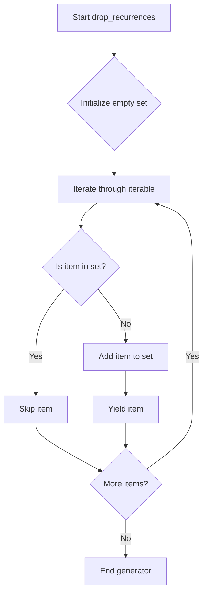

# `generate_authors.py`

## `misc.generate_authors.drop_recurrences` · *function*

## Summary:
Removes duplicate elements from an iterable while preserving the order of first occurrences.

## Description:
A generator function that iterates through an iterable and yields unique elements in the order of their first appearance. This function is useful for removing duplicates from sequences while maintaining the original ordering.

## Args:
    iterable: An iterable object containing elements to deduplicate.

## Returns:
    A generator that yields unique elements from the input iterable in order of their first occurrence.

## Raises:
    None explicitly raised.

## Constraints:
    Preconditions:
    - The input iterable must be iterable (support __iter__ protocol)
    - Elements in the iterable must be hashable (since they're stored in a set)
    
    Postconditions:
    - The returned generator yields elements in the same order as their first appearance
    - Duplicate elements are removed from the sequence
    - Memory usage is proportional to the number of unique elements

## Side Effects:
    None.

## Control Flow:


## Examples:
    # Remove duplicates from a list
    >>> list(drop_recurrences([1, 2, 2, 3, 1, 4]))
    [1, 2, 3, 4]
    
    # Remove duplicates from a string
    >>> list(drop_recurrences("hello"))
    ['h', 'e', 'l', 'o']
    
    # Works with any iterable
    >>> list(drop_recurrences(range(5)) + [0, 1, 2])
    [0, 1, 2, 3, 4]
```

## `misc.generate_authors.iterate_authors_by_chronological_order` · *function*

*No documentation generated.*

## `misc.generate_authors.print_authors` · *function*

## Summary:
Prints unique authors from a Git repository branch in chronological order to standard output.

## Description:
This function retrieves unique authors from a Git repository branch in chronological order and outputs them to standard output, one author per line. It leverages Git's log command to extract author information and filters out duplicate entries to ensure each author appears only once.

## Args:
    branch (str): The Git branch name or reference to analyze for author information.

## Returns:
    None: This function does not return any value.

## Raises:
    subprocess.CalledProcessError: If the underlying Git command fails during execution, such as when the branch doesn't exist or Git is not available.

## Constraints:
    Preconditions:
        - The branch parameter must refer to a valid Git branch or commit reference
        - Git must be installed and accessible in the system PATH
        - The current working directory must be a Git repository
        
    Postconditions:
        - Authors are written to standard output in chronological order
        - Duplicate authors are filtered out
        - Each author is written with a trailing newline character

## Side Effects:
    - Writes to standard output (stdout) using binary encoding
    - Executes external Git subprocess commands
    - May cause performance impact for large repositories due to Git operations

## Control Flow:
```mermaid
flowchart TD
    A[Start print_authors] --> B[Call iterate_authors_by_chronological_order(branch)]
    B --> C{Git log command executes successfully?}
    C -->|Yes| D[Iterate through unique authors]
    D --> E[Write author to stdout with newline]
    E --> F{More authors?}
    F -->|Yes| D
    F -->|No| G[End]
    C -->|No| H[Propagate CalledProcessError]
```

## Examples:
    >>> print_authors("main")
    John Doe
    Jane Smith
    Bob Johnson
    
    >>> print_authors("develop")
    Alice Brown
    Charlie Wilson
    David Lee
```

