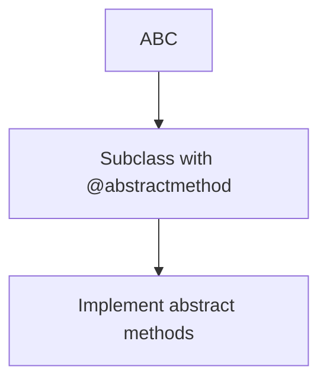
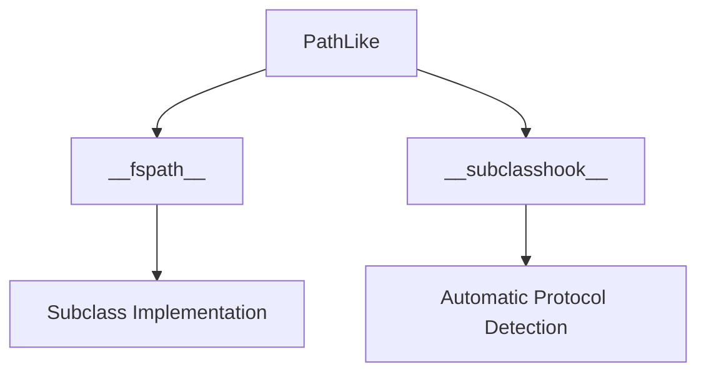
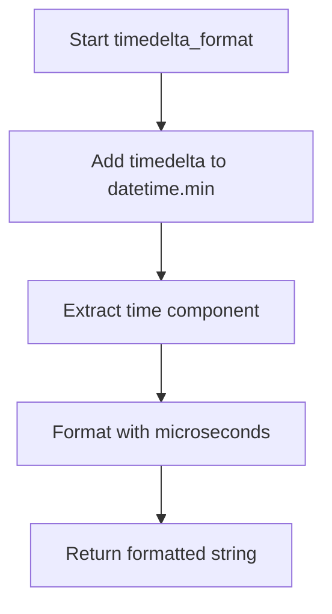
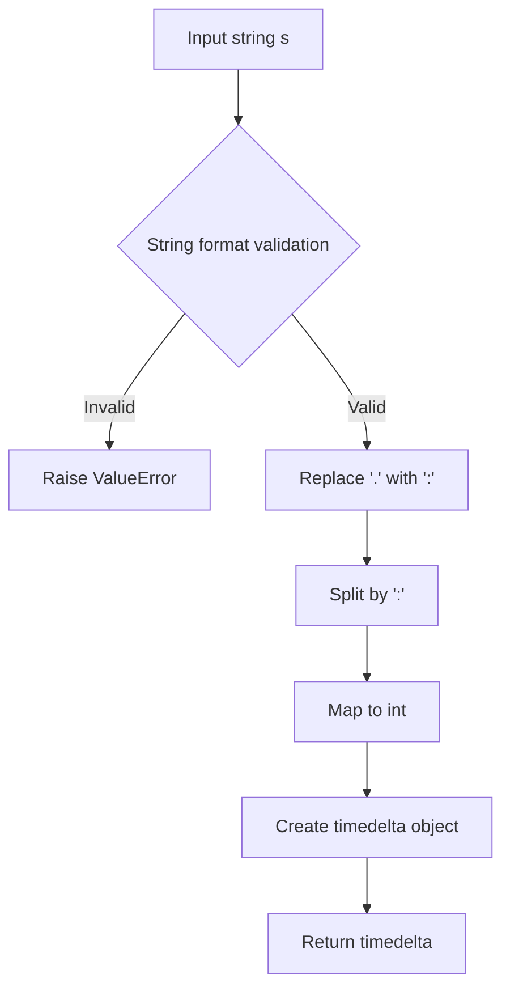

# `pycompat.py`

## `pysnooper.pycompat.ABC` · *class*

## Summary:
Abstract base class compatibility wrapper for Python version compatibility.

## Description:
This class serves as a compatibility layer for Python's abstract base class functionality. It provides a consistent interface for creating abstract base classes across different Python versions by using `abc.ABCMeta` as its metaclass. This class is intended to be inherited by other classes that need to define abstract methods or enforce interface contracts.

## State:
- No instance attributes: This is a base class with no instance variables
- Class-level metaclass: Uses `abc.ABCMeta` to enable abstract method functionality
- No constructor parameters: The `__slots__ = ()` indicates no instance attributes are defined

## Lifecycle:
- Creation: Instantiate by inheriting from this class in other classes
- Usage: Define abstract methods using `@abstractmethod` decorator in subclasses
- Destruction: No special cleanup required as it's a base class

## Method Map:


## Raises:
- No exceptions raised by `__init__` as this is a base class with no constructor
- Abstract method implementation errors occur at subclass instantiation time

## Example:
```python
from pysnooper.pycompat import ABC

class MyInterface(ABC):
    @abstractmethod
    def my_method(self):
        pass

# This will raise TypeError if my_method is not implemented
# obj = MyInterface()  # TypeError: Can't instantiate abstract class
```

## `pysnooper.pycompat.PathLike` · *class*

## Summary:
Abstract base class defining the filesystem path protocol for Python objects.

## Description:
PathLike serves as an abstract base class that establishes the interface for objects that can be converted to filesystem paths. It implements the protocol defined in PEP 519, allowing objects to be used wherever filesystem paths are expected. This class is designed to be subclassed by concrete implementations that provide actual path functionality.

## State:
- Inherits from abc.ABC (Abstract Base Class)
- Defines abstract method `__fspath__()` that must be implemented by subclasses
- Implements `__subclasshook__` classmethod for automatic subclass detection

## Lifecycle:
- Creation: Instantiate subclasses that implement `__fspath__()`
- Usage: Objects can be passed to functions expecting path-like arguments
- Destruction: No special cleanup required; follows standard Python object lifecycle

## Method Map:


## Raises:
- NotImplementedError: When `__fspath__()` is called on the abstract base class directly

## Example:
```python
from pysnooper.pycompat import PathLike

class MyPath(PathLike):
    def __init__(self, path):
        self.path = path
    
    def __fspath__(self):
        return self.path

# Usage
mypath = MyPath("/tmp/example.txt")
# Can be passed to functions expecting path-like arguments
```

### `pysnooper.pycompat.PathLike.__fspath__` · *method*

## Summary:
Returns a string representation of the object's filesystem path.

## Description:
This method implements the os.PathLike protocol by providing a string representation of the object's filesystem path. It is an abstract method that must be implemented by subclasses to provide concrete path functionality. The method is called by Python's built-in functions when an object needs to be treated as a path.

## Args:
    None

## Returns:
    str: A string representation of the filesystem path.

## Raises:
    NotImplementedError: Always raised by this base implementation, indicating that subclasses must override this method.

## State Changes:
    Attributes READ: None
    Attributes WRITTEN: None

## Constraints:
    Preconditions: This method should only be called on instances of subclasses that properly implement the __fspath__ method.
    Postconditions: The returned value must be a string representing a valid filesystem path.

## Side Effects:
    None

### `pysnooper.pycompat.PathLike.__subclasshook__` · *method*

## Summary:
Determines if a class is considered a subclass of PathLike based on protocol compliance.

## Description:
This special method is invoked by Python's ABC machinery to check if a given class should be considered a subclass of PathLike. It implements a protocol-based subclass detection that accepts classes conforming to either the os.PathLike protocol (via __fspath__ method) or classes with 'path' in their name that have an 'open' method.

## Args:
    cls (type): The PathLike class itself (passed automatically by Python's ABC mechanism)
    subclass (type): The class being tested for subclass relationship with PathLike

## Returns:
    bool: True if subclass is considered a PathLike subclass, False otherwise

## Raises:
    None: This method does not raise exceptions

## State Changes:
    Attributes READ: None - this method only uses class attributes and parameters
    Attributes WRITTEN: None - this method is read-only

## Constraints:
    Preconditions: 
    - cls must be the PathLike class (or its subclass)
    - subclass must be a class object being tested
    - Both arguments must be valid Python types
    
    Postconditions:
    - Returns a boolean value indicating subclass relationship
    - Does not modify any state

## Side Effects:
    None: This method performs only attribute checks and string operations with no I/O or external service calls

## `pysnooper.pycompat.timedelta_format` · *function*

## Summary:
Formats a timedelta object as a time string with microsecond precision.

## Description:
Converts a timedelta object into a time string representation by performing arithmetic with datetime.min and extracting the resulting time component.

## Args:
    timedelta: A timedelta object to be formatted.

## Returns:
    str: A formatted time string with microsecond precision.

## Raises:
    Exception: May raise exceptions related to datetime operations if inputs are invalid.

## Constraints:
    Preconditions:
        - Input must be compatible with datetime arithmetic operations
        
    Postconditions:
        - Output is a string representation of a time value

## Side Effects:
    None

## Control Flow:


## `pysnooper.pycompat.timedelta_parse` · *function*

## Summary:
Parses a time duration string into a datetime.timedelta object.

## Description:
Converts a string representation of time duration (in HH:MM:SS.mmm format) into a datetime.timedelta object. This function is used to parse time interval strings for logging and timing operations. The function handles both dot and colon separators in the input string.

## Args:
    s (str): Time duration string in format "HH:MM:SS.mmm" or "HH.MM.SS.mmm" where:
        - Hours (HH) is a numeric value representing hours
        - Minutes (MM) is a numeric value representing minutes  
        - Seconds (SS) is a numeric value representing seconds
        - Microseconds (mmm) is a numeric value representing microseconds
        The string may use either '.' or ':' as separators between components.

## Returns:
    datetime.timedelta: A timedelta object representing the parsed time duration.

## Raises:
    ValueError: When the input string cannot be parsed due to invalid format or non-numeric values.
    TypeError: When the input string contains non-numeric components that cannot be converted to integers.

## Constraints:
    Precondition: Input string must be in valid time format with exactly 4 numeric components separated by colons or dots.
    Postcondition: Returns a valid datetime.timedelta object with the specified time components.

## Side Effects:
    None

## Control Flow:


## Examples:
    >>> timedelta_parse("01:30:45.123")
    datetime.timedelta(hours=1, minutes=30, seconds=45, microseconds=123000)
    
    >>> timedelta_parse("00:05:30.000")
    datetime.timedelta(minutes=5, seconds=30)
```

