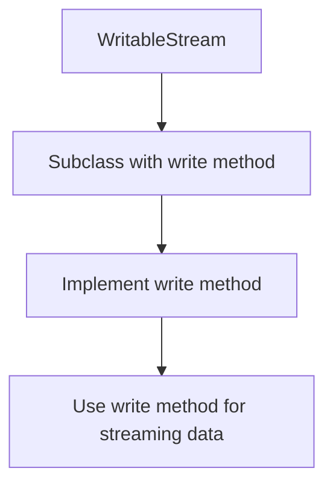

# `utils.py`

## `pysnooper.utils._check_methods` · *function*

## Summary:
Checks whether a class implements all specified methods, returning True if all methods are implemented, NotImplemented if any method is missing or explicitly set to None.

## Description:
This utility function validates that a given class implements all required methods by traversing its Method Resolution Order (MRO) to check for method existence. It's commonly used for interface compliance checking or abstract base class validation.

## Args:
    C (type): The class to check for method implementations
    *methods (str): Variable-length argument list of method names to validate

## Returns:
    bool or NotImplemented: Returns True if all methods are implemented and not None, NotImplemented if any method is missing or explicitly set to None

## Raises:
    None explicitly raised

## Constraints:
    Preconditions:
    - C must be a valid class/type object
    - methods must be strings representing valid method names
    
    Postconditions:
    - Function returns either True (all methods implemented) or NotImplemented (missing/None methods)

## Side Effects:
    None

## Control Flow:
```mermaid
flowchart TD
    A[Start _check_methods] --> B{Class C has MRO?}
    B -->|Yes| C[Get MRO of C]
    C --> D[For each method in methods]
    D --> E{Method in B.__dict__ for any B in MRO?}
    E -->|No| F[Return NotImplemented]
    E -->|Yes| G{B.__dict__[method] is None?}
    G -->|Yes| H[Return NotImplemented]
    G -->|No| I[Continue to next method]
    F --> J[End]
    H --> J
    I --> K{All methods checked?}
    K -->|No| D
    K -->|Yes| L[Return True]
    L --> J
```

## Examples:
    # Check if a class implements required methods
    class MyInterface:
        def required_method(self): pass
    
    class Implementation(MyInterface):
        def required_method(self): return "implemented"
    
    result = _check_methods(Implementation, 'required_method')  # Returns True
    
    # Check with missing method
    class Incomplete:
        pass
    
    result = _check_methods(Incomplete, 'required_method')  # Returns NotImplemented
```

## `pysnooper.utils.WritableStream` · *class*

## Summary:
An abstract base class defining a writable stream interface that enforces implementation of a write method.

## Description:
The WritableStream class serves as an abstract base class (ABC) that defines the contract for writable streams in the pysnooper package. It establishes a standard interface for objects that can accept written data, ensuring consistent behavior across different stream implementations. This abstraction allows the package to work with various output destinations (files, buffers, consoles, etc.) through a common interface.

The class uses Python's abstract base class mechanism with the `@abc.abstractmethod` decorator to enforce that subclasses must implement the `write` method. The `__subclasshook__` class method enables proper isinstance checks without requiring explicit inheritance.

## State:
- No instance attributes: This is an abstract base class with no instance variables
- Class-level metaclass: Inherits from `ABC` which uses `abc.ABCMeta` as its metaclass
- No constructor parameters: The class is designed to be subclassed, not instantiated directly
- Class invariants: All subclasses must implement the `write` method to be considered valid implementations

## Lifecycle:
- Creation: Instantiate by inheriting from WritableStream in concrete classes
- Usage: Subclasses must implement the `write` method to provide actual writing functionality
- Destruction: No special cleanup required as this is an abstract base class

## Method Map:


## Raises:
- TypeError: When attempting to instantiate the abstract base class directly
- NotImplementedError: When subclasses don't implement the required `write` method (inherited from ABC mechanism)

## Example:
```python
from pysnooper.utils import WritableStream

class CustomWriter(WritableStream):
    def write(self, s):
        print(f"Writing: {s}")

# This works because CustomWriter implements write method
writer = CustomWriter()

# This would fail because WritableStream itself is abstract
# stream = WritableStream()  # TypeError
```

### `pysnooper.utils.WritableStream.write` · *method*

*No documentation generated.*

### `pysnooper.utils.WritableStream.__subclasshook__` · *method*

## Summary:
Determines if a class implements the WritableStream interface by checking for a write method.

## Description:
This special method is part of Python's Abstract Base Class mechanism and is invoked during subclass checking operations. When `issubclass(C, WritableStream)` is called, Python invokes this method to determine if class `C` should be considered a subclass of `WritableStream`. The method specifically checks if the candidate class implements the required `write` method using the `_check_methods` utility function.

## Args:
    cls (type): The WritableStream class (always WritableStream itself)
    C (type): The candidate class being checked for subclass relationship

## Returns:
    bool or NotImplemented: Returns True if class C implements the write method, NotImplemented otherwise

## Raises:
    None explicitly raised

## State Changes:
    Attributes READ: None
    Attributes WRITTEN: None

## Constraints:
    Preconditions:
    - cls must be the WritableStream class itself
    - C must be a valid class/type object
    
    Postconditions:
    - Returns either True (indicating interface compliance) or NotImplemented (allowing normal inheritance checking)

## Side Effects:
    None

## `pysnooper.utils.shitcode` · *function*

## Summary:
Filters a string to retain only ASCII characters in the range 1-255, replacing invalid characters with '?'.

## Description:
This function processes a string and removes or replaces non-ASCII characters that fall outside the printable ASCII range (1-255). It's designed to sanitize strings for environments that require strict ASCII compatibility while preserving valid ASCII characters.

## Args:
    s (str): Input string to be filtered for ASCII compatibility

## Returns:
    str: A new string containing only characters with ordinal values between 1 and 255 (inclusive), with invalid characters replaced by '?'

## Raises:
    None explicitly raised

## Constraints:
    Preconditions:
    - Input must be a string type
    
    Postconditions:
    - Output string contains only characters with ordinals in range [1, 255]
    - All characters outside this range are replaced with '?'
    - Empty strings are handled correctly

## Side Effects:
    None

## Control Flow:
```mermaid
flowchart TD
    A[Input string s] --> B{Character ordinal<br/>0 < ord(c) < 256?}
    B -- Yes --> C[Keep character c]
    B -- No --> D[Replace with '?']
    C --> E[Join all characters]
    D --> E
    E --> F[Return filtered string]
```

## Examples:
    >>> shitcode("Hello, World!")
    'Hello, World!'
    
    >>> shitcode("café")
    'caf?'
    
    >>> shitcode("test\x00invalid")
    'test?invalid'
    
    >>> shitcode("")
    ''
```

## `pysnooper.utils.get_repr_function` · *function*

## Summary:
Selects an appropriate representation function for an object based on custom conditions and fallbacks to the standard repr function.

## Description:
This utility function evaluates a list of condition-action pairs to determine the most suitable representation function for a given item. It supports both type-based conditions and arbitrary predicate functions, making it flexible for custom representation logic. When no custom condition matches, it defaults to using Python's built-in repr function.

## Args:
    item (Any): The object for which to select a representation function
    custom_repr (list[tuple]): A list of (condition, action) pairs where:
        - condition: Either a type (for isinstance checks) or a callable predicate function
        - action: A callable that accepts the item and returns its string representation

## Returns:
    callable: A representation function that can be applied to the item. This will either be:
        - An action function from custom_repr that matches the item's condition
        - The built-in repr function if no custom condition matches

## Raises:
    None explicitly raised

## Constraints:
    - Precondition: custom_repr must be iterable containing (condition, action) pairs
    - Precondition: condition elements in custom_repr can be either types or callable predicates
    - Postcondition: The returned function will accept the item as its argument

## Side Effects:
    None

## Control Flow:
```mermaid
flowchart TD
    A[Start get_repr_function] --> B{custom_repr empty?}
    B -- Yes --> C[Return repr]
    B -- No --> D[Iterate through custom_repr]
    D --> E{condition is type?}
    E -- Yes --> F[Convert to isinstance lambda]
    E -- No --> G[Use condition as-is]
    G --> H{condition(item)?}
    H -- Yes --> I[Return action]
    H -- No --> J[Continue loop]
    J --> K{End of custom_repr?}
    K -- Yes --> L[Return repr]
    K -- No --> D
```

## Examples:
    # Basic usage with type-based conditions
    custom_repr = [
        (str, lambda x: f"'{x}'"),
        (int, lambda x: f"Integer: {x}"),
    ]
    func = get_repr_function("hello", custom_repr)
    result = func("hello")  # Returns "'hello'"
    
    # Usage with mixed conditions
    def is_even(x):
        return isinstance(x, int) and x % 2 == 0
    
    custom_repr = [
        (is_even, lambda x: f"Even number: {x}"),
        (float, lambda x: f"Float: {x:.2f}"),
    ]
    func = get_repr_function(4, custom_repr)
    result = func(4)  # Returns "Even number: 4"

## `pysnooper.utils.normalize_repr` · *function*

## Summary:
Applies regex substitution to normalize representation strings by removing patterns defined by DEFAULT_REPR_RE.

## Description:
This function normalizes representation strings by applying a predefined regular expression pattern (DEFAULT_REPR_RE) to remove unwanted patterns from the input string. It serves as a utility for cleaning up representation strings in debugging contexts.

The function operates by performing a regex substitution on the input representation string, removing all matches of the DEFAULT_REPR_RE pattern. This is typically used in debugging tools to produce cleaner output by eliminating noise from object representations.

## Args:
    item_repr (str): The representation string to normalize. This is typically the result of calling repr() on an object or a custom __repr__ implementation.

## Returns:
    str: A normalized version of the input representation string with patterns matching DEFAULT_REPR_RE removed. The exact content of the returned string depends on the specific pattern defined in DEFAULT_REPR_RE.

## Raises:
    TypeError: If item_repr is not a string type, or if DEFAULT_REPR_RE is not a valid compiled regex pattern.

## Constraints:
    Preconditions:
    - item_repr must be a string type
    - DEFAULT_REPR_RE must be a valid compiled regular expression pattern defined in the module scope
    
    Postconditions:
    - The returned string will be a sanitized version of the input
    - No side effects occur during execution

## Side Effects:
    None. This function is pure and has no observable side effects.

## Control Flow:
```mermaid
flowchart TD
    A[Input item_repr] --> B{Type validation}
    B -->|Invalid type| C[Raise TypeError]
    B -->|Valid type| D[Apply DEFAULT_REPR_RE.sub('', item_repr)]
    D --> E[Return normalized string]
```

## Examples:
    # Basic usage with a representation string
    result = normalize_repr("<MyClass object at 0x7f8b8c0d5e80>")
    # Returns: string with memory address pattern removed (exact result depends on DEFAULT_REPR_RE)
    
    # Usage with various representation formats
    result = normalize_repr("SomeObject(123, 'test')")
    # Returns: string with patterns matching DEFAULT_REPR_RE removed
```

## `pysnooper.utils.get_shortish_repr` · *function*

## Summary:
Creates a formatted string representation of an object with optional truncation and normalization.

## Description:
Generates a string representation of an item by selecting an appropriate representation function, processing the result through various formatting operations, and returning a clean, optionally truncated representation. This function is primarily used in debugging contexts to produce readable object representations while handling edge cases like failed representations gracefully.

The function orchestrates several processing steps:
1. Selects an appropriate representation function based on custom conditions
2. Attempts to generate the representation with error handling
3. Cleans up newlines and carriage returns from the representation
4. Applies normalization to remove unwanted patterns (when requested)
5. Truncates the result to a maximum length (when requested)

This utility function encapsulates the common pattern of generating and post-processing object representations, providing a centralized place for representation formatting logic that can be reused throughout the debugging system.

## Args:
    item (Any): The object to represent as a string
    custom_repr (tuple[tuple], optional): A tuple of (condition, action) pairs for custom representation logic. Defaults to empty tuple.
    max_length (int, optional): Maximum allowed length for the output string. If None, no truncation occurs. Defaults to None.
    normalize (bool): Whether to apply normalization to remove unwanted patterns from the representation. Defaults to False.

## Returns:
    str: A formatted string representation of the item. Returns 'REPR FAILED' if representation generation raises an exception.

## Raises:
    None explicitly raised

## Constraints:
    - Precondition: item must be a valid object that can be processed by the representation functions
    - Precondition: custom_repr must be iterable containing (condition, action) pairs
    - Precondition: if max_length is specified, it must be a non-negative integer or None
    - Postcondition: The returned string will be a cleaned and optionally truncated representation of the item

## Side Effects:
    None

## Control Flow:
```mermaid
flowchart TD
    A[Start get_shortish_repr] --> B[Get repr function]
    B --> C[Try repr_function(item)]
    C --> D{Exception raised?}
    D -- Yes --> E[Set r = 'REPR FAILED']
    D -- No --> F[Set r = repr_function(item)]
    F --> G[r.replace('\r', '').replace('\n', '')]
    G --> H{normalize?}
    H -- Yes --> I[normalize_repr(r)]
    H -- No --> J[r unchanged]
    J --> K{max_length specified?}
    K -- Yes --> L[truncate(r, max_length)]
    K -- No --> M[r unchanged]
    M --> N[Return r]
```

## Examples:
    # Basic usage
    result = get_shortish_repr("hello world")
    # Returns: "hello world"
    
    # With custom representation
    custom_repr = [(str, lambda x: f"'{x}'")]
    result = get_shortish_repr("hello", custom_repr=custom_repr)
    # Returns: "'hello'"
    
    # With truncation
    result = get_shortish_repr("very long string indeed", max_length=10)
    # Returns: "very...dine"
    
    # With normalization
    result = get_shortish_repr(object(), normalize=True)
    # Returns: normalized representation without memory addresses

## `pysnooper.utils.truncate` · *function*

## Summary:
Truncates a string to a specified maximum length, inserting an ellipsis in the middle when necessary.

## Description:
This utility function reduces the length of a string to a maximum allowed length by removing characters from the center and inserting an ellipsis (...) to indicate that truncation occurred. This is particularly useful for displaying long strings in limited-width contexts such as logs or debug output.

## Args:
    string (str): The input string to be truncated
    max_length (int or None): Maximum allowed length for the output string. If None, no truncation occurs.

## Returns:
    str: The truncated string with ellipsis inserted in the middle if truncation was necessary, otherwise the original string unchanged.

## Raises:
    None

## Constraints:
    Preconditions:
        - The string parameter must be a valid string type
        - The max_length parameter must be either None or a non-negative integer
    
    Postconditions:
        - The returned string will have length less than or equal to max_length
        - If truncation occurs, the returned string will end with "..."

## Side Effects:
    None

## Control Flow:
```mermaid
flowchart TD
    A[Start truncate] --> B{max_length is None OR len(string) ≤ max_length?}
    B -- Yes --> C[Return original string]
    B -- No --> D[Calculate left portion length]
    D --> E[Calculate right portion length]
    E --> F[Return string[:left] + "..."+ string[-right:]]
```

## Examples:
    >>> truncate("This is a very long string", 10)
    'This...ring'
    
    >>> truncate("Short", 10)
    'Short'
    
    >>> truncate("Very long string indeed", None)
    'Very long string indeed'
    
    >>> truncate("Hello World", 5)
    'He...d'
```

## `pysnooper.utils.ensure_tuple` · *function*

## Summary:
Converts an input value to a tuple, preserving iterable types while wrapping non-iterable values.

## Description:
The `ensure_tuple` function normalizes input values by ensuring they are returned as tuples. It treats strings as atomic values (not iterables) and converts all other iterable types to tuples, while wrapping non-iterable values in a single-element tuple.

## Args:
    x (Any): Input value to be converted to a tuple. Can be any type including iterables, strings, or scalar values.

## Returns:
    tuple: A tuple containing the input value(s). If x was iterable (but not string), returns tuple(x). Otherwise returns (x,).

## Raises:
    None explicitly raised by this function.

## Constraints:
    Preconditions:
    - Input can be any Python object
    - The function relies on `collections_abc.Iterable` and `string_types` from pycompat module
    
    Postconditions:
    - Return value is always a tuple
    - String inputs are wrapped as single-element tuples
    - Iterable inputs (excluding strings) are converted to tuples

## Side Effects:
    None.

## Control Flow:
```mermaid
flowchart TD
    A[Input x] --> B{isinstance(x, Iterable)?}
    B -- Yes --> C{isinstance(x, string_types)?}
    C -- Yes --> D[Return (x,)]
    C -- No --> E[Return tuple(x)]
    B -- No --> D
```

## Examples:
    >>> ensure_tuple([1, 2, 3])
    (1, 2, 3)
    
    >>> ensure_tuple("hello")
    ('hello',)
    
    >>> ensure_tuple(42)
    (42,)
    
    >>> ensure_tuple((1, 2))
    (1, 2)
```

