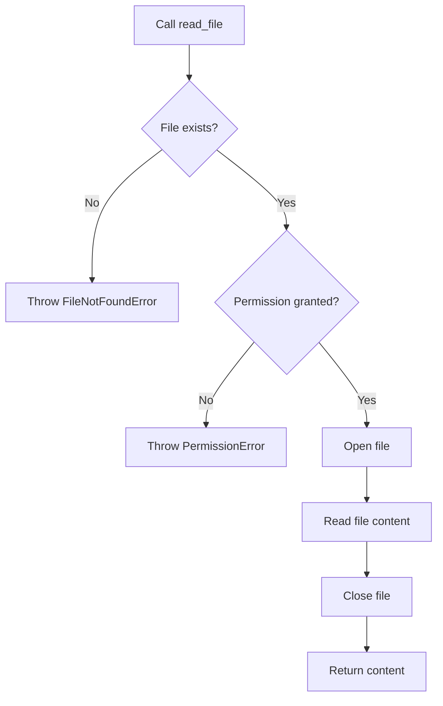

# `setup.py`

## `read_file` · *function*

## Summary:
Reads and returns the complete contents of a text file as a string.

## Description:
Opens a file in read mode and returns its entire content as a string. This utility function is commonly used in Python package setup scripts to read README files, license files, or other text assets for inclusion in package metadata.

## Args:
    filename (str): The path to the file to be read. This can be an absolute or relative path.

## Returns:
    str: The complete contents of the file as a string. Returns an empty string if the file is empty.

## Raises:
    FileNotFoundError: If the specified file does not exist at the given path.
    PermissionError: If the process does not have permission to read the specified file.

## Constraints:
    Preconditions:
        - The filename parameter must be a valid string representing a file path
        - The file must exist and be readable
    Postconditions:
        - The file is properly closed after reading
        - The entire file content is returned as a single string

## Side Effects:
    - Reads from the filesystem
    - May raise I/O exceptions if file access fails

## Control Flow:


## Examples:
    # Reading a README file for package description
    try:
        long_description = read_file('README.md')
        setup(
            name='my-package',
            description='A sample package',
            long_description=long_description,
            long_description_content_type='text/markdown'
        )
    except FileNotFoundError:
        print("README.md not found")
        
    # Reading a license file
    try:
        license_text = read_file('LICENSE')
        print(f"License: {license_text[:100]}...")
    except (FileNotFoundError, PermissionError) as e:
        print(f"Could not read license: {e}")
```

