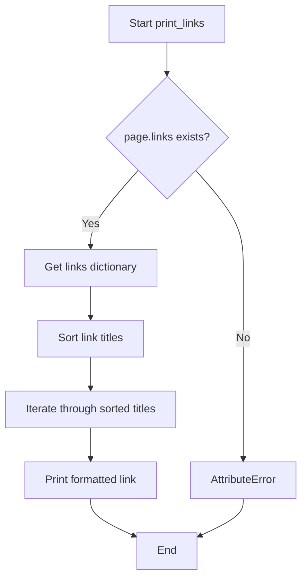

# `example.py`

## `print_sections` · *function*

## Summary:
Prints hierarchical section data with indentation and text truncation.

## Description:
Recursively prints section titles and truncated text with increasing indentation levels. This function extracts formatting logic for displaying hierarchical content structures, separating presentation concerns from business logic.

## Args:
    sections: An iterable of section objects containing title, text, and sections attributes
    level: Integer representing current nesting level for indentation (default: 0)

## Returns:
    None: This function performs I/O operations and does not return a value

## Raises:
    AttributeError: If sections contain objects lacking title, text, or sections attributes
    TypeError: If sections is not iterable or level is not an integer

## Constraints:
    Preconditions:
    - sections must be iterable
    - Each section object must have title, text, and sections attributes
    - level must be a non-negative integer
    
    Postconditions:
    - All sections and subsections are printed to stdout with proper indentation
    - Text is truncated to first 40 characters

## Side Effects:
    - Prints formatted output to standard output (stdout)
    - No external state mutations

## Control Flow:
```mermaid
flowchart TD
    A[Start print_sections] --> B{sections empty?}
    B -- Yes --> C[Return]
    B -- No --> D[Print current section]
    D --> E[Increment level]
    E --> F[Recursive call print_sections(s.sections, level+1)]
    F --> G[Loop to next section]
    G --> B
```

## Examples:
```python
# Basic usage with mock section objects
class Section:
    def __init__(self, title, text, sections=None):
        self.title = title
        self.text = text
        self.sections = sections or []

# Create sample hierarchy
section1 = Section("Introduction", "This is the introduction text...", [])
section2 = Section("Main Content", "This is main content...", [section1])
root_section = Section("Root", "Root content...", [section2])

print_sections([root_section])
# Output:
# *: Root - Root content...
# **: Main Content - This is main content...
# ***: Introduction - This is the introduc...
```

## `print_langlinks` · *function*

## Summary:
Prints language links for a Wikipedia page in a formatted manner, showing the language code, target language, page title, and full URL for each link.

## Description:
This function extracts and displays language links from a Wikipedia page object. It organizes the language links alphabetically by language code and presents them in a standardized format showing the source language code, target language, page title, and full URL. This function is designed to provide a clean, readable output of multilingual links associated with a Wikipedia article.

The function is extracted from inline code to provide a reusable component for displaying language link information, separating the presentation logic from the data retrieval logic.

## Args:
    page: A Wikipedia page object containing a langlinks attribute. The page object is expected to have a langlinks property that returns a dictionary-like structure where keys are language codes and values are language link objects with language, title, and fullurl attributes.

## Returns:
    None: This function does not return any value. It performs I/O operations by printing to standard output.

## Raises:
    AttributeError: If the page parameter does not have a langlinks attribute, or if langlinks elements do not have language, title, or fullurl attributes.

## Constraints:
    Preconditions:
    - The page parameter must be a valid Wikipedia page object with a langlinks attribute
    - The langlinks attribute must be iterable and contain elements with language, title, and fullurl attributes
    
    Postconditions:
    - All language links from the page are printed to stdout in alphabetical order by language code
    - No return value is produced

## Side Effects:
    - Prints formatted text to standard output (stdout)
    - No external state mutations or I/O operations beyond console output

## Control Flow:
```mermaid
flowchart TD
    A[Start print_langlinks] --> B[Get page.langlinks]
    B --> C[Sort langlinks keys]
    C --> D{Has langlinks?}
    D -->|Yes| E[Iterate through sorted keys]
    E --> F[Get langlinks[key]]
    F --> G[Print formatted string]
    G --> H[Next key]
    H --> D
    D -->|No| I[End]
```

## Examples:
```python
# Assuming we have a Wikipedia page object
page = wiki_page("Example_Page")
print_langlinks(page)
# Output would be something like:
# de: German - Beispielseite: https://de.wikipedia.org/wiki/Beispielseite
# es: Spanish - Página de ejemplo: https://es.wikipedia.org/wiki/Página_de_ejemplo
```

## `print_links` · *function*

## Summary:
Prints all links from a Wikipedia page in alphabetical order with their associated details.

## Description:
This function extracts and displays all hyperlinks found on a given Wikipedia page in a sorted, formatted manner. It's designed to provide a clean view of all internal Wikipedia links from a specific page.

## Args:
    page: A Wikipedia page object containing a links attribute. Expected to have a .links property that behaves like a dictionary with string keys and link information as values.

## Returns:
    None: This function does not return any value.

## Raises:
    AttributeError: If the provided page object does not have a .links attribute.

## Constraints:
    Preconditions:
    - The page parameter must be a valid Wikipedia page object from the wikipediaapi library
    - The page.links attribute must be accessible and behave like a dictionary-like structure
    
    Postconditions:
    - All links from the page are printed to standard output in alphabetical order
    - No return value is produced

## Side Effects:
    - Prints formatted output to standard output (stdout)
    - No external state mutations or I/O operations beyond printing

## Control Flow:


## Examples:
```python
# Assuming wiki_wiki is a Wikipedia instance
page = wiki_wiki.page("Python (programming language)")
print_links(page)
# Output would be sorted links like:
# Algorithms: <link details>
# Array: <link details>
# ...
```

## `print_categories` · *function*

## Summary:
Prints the categories of a Wikipedia page in alphabetical order with their associated metadata.

## Description:
This function extracts the categories from a Wikipedia page object and displays them in a formatted manner. It sorts the categories alphabetically by title before printing them, making the output easier to read and navigate. The function is designed to provide a clean display of category information for Wikipedia pages.

## Args:
    page: A Wikipedia page object from the wikipediaapi library. This object must have a `categories` attribute that is a dictionary-like structure where keys are category titles and values contain associated metadata about each category.

## Returns:
    None: This function does not return any value. It performs I/O operations by printing to standard output.

## Raises:
    AttributeError: If the provided page object does not have a `categories` attribute, or if the categories attribute is not accessible in the expected dictionary-like format.

## Constraints:
    Preconditions:
    - The `page` parameter must be a valid Wikipedia page object from the wikipediaapi library
    - The page object must have a `categories` attribute that is iterable and contains key-value pairs
    - Category titles must be sortable (strings or comparable types)
    
    Postconditions:
    - All categories from the page are printed to stdout in alphabetical order
    - No modifications are made to the input page object

## Side Effects:
    - Prints formatted output to standard output (stdout)
    - No external state mutations or I/O operations beyond printing

## Control Flow:
```mermaid
flowchart TD
    A[Start print_categories] --> B{page.categories exists?}
    B -- Yes --> C[Get categories dict]
    C --> D[Sort category keys]
    D --> E{Categories exist?}
    E -- Yes --> F[Iterate through sorted keys]
    F --> G[Print title: categories[title]]
    G --> H[Next category]
    H --> F
    E -- No --> I[End]
    B -- No --> J[AttributeError]
    J --> K[Exit]
```

## Examples:
```python
# Basic usage with a Wikipedia page object
wiki = wikipediaapi.Wikipedia('MyApp')
page = wiki.page('Python (programming language)')
print_categories(page)
# Output:
# Computer programming: Page in category:Computer programming
# Programming languages: Page in category:Programming languages
# ...
```

## `print_categorymembers` · *function*

## Summary:
Recursively prints Wikipedia category members with hierarchical indentation based on nesting level.

## Description:
This function traverses and displays a hierarchy of Wikipedia category members, showing their titles with increasing indentation levels. It processes category members in a depth-first manner, recursively descending into subcategories up to a specified maximum depth. The function is designed to visualize the hierarchical structure of Wikipedia categories.

## Args:
    categorymembers (dict-like): Dictionary containing Wikipedia page objects with title and namespace attributes. Expected to support .values() method to iterate over page objects.
    level (int): Current nesting level for indentation formatting. Defaults to 0.
    max_level (int): Maximum recursion depth allowed. Defaults to 2.

## Returns:
    None: This function does not return any value.

## Raises:
    AttributeError: If categorymembers does not support .values() method or if page objects lack .title or .ns attributes.
    RecursionError: If the recursion depth exceeds Python's limit due to deeply nested categories.

## Constraints:
    Preconditions:
    - categorymembers must be iterable with .values() method
    - Page objects in categorymembers must have .title and .ns attributes
    - level and max_level must be integers
    
    Postconditions:
    - All category members up to max_level depth will be printed to stdout
    - Function terminates when recursion limit is reached or all members are processed

## Side Effects:
    - Prints formatted output to standard output (stdout)
    - May cause RecursionError for very deep category hierarchies

## Control Flow:
```mermaid
flowchart TD
    A[Start print_categorymembers] --> B{categorymembers.values()}
    B --> C[For each category member c]
    C --> D[Print formatted entry]
    D --> E{c.ns == CATEGORY AND level < max_level}
    E -->|True| F[Recursive call print_categorymembers]
    E -->|False| G[Continue loop]
    F --> H[Return from recursion]
    G --> I[Loop continues]
    I --> J{End of iteration?}
    J -->|No| C
    J -->|Yes| K[End]
```

## Examples:
    # Basic usage with a category
    print_categorymembers(my_category_members)
    
    # With custom depth limit
    print_categorymembers(my_category_members, max_level=3)
    
    # With custom starting level
    print_categorymembers(my_category_members, level=1, max_level=4)

