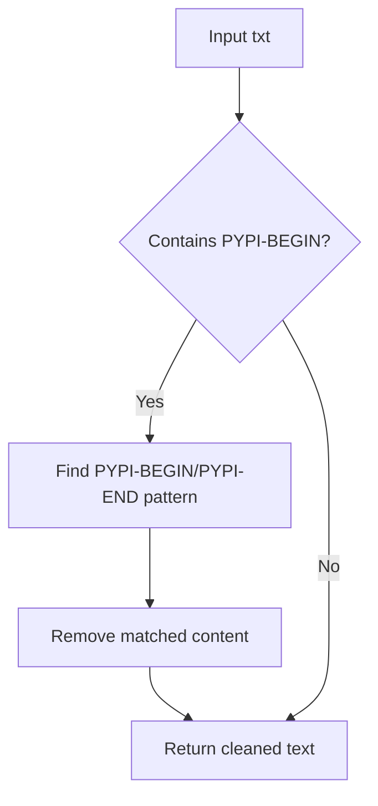

# `setup.py`

## `fix_doc` · *function*

## Summary:
Removes content between PYPI-BEGIN and PYPI-END markers from documentation text.

## Description:
Processes documentation text by stripping out sections enclosed between ".. PYPI-BEGIN" and "PYPI-END" markers. This utility function is typically used to conditionally exclude content from package distribution documentation while preserving it in local development documentation.

## Args:
    txt (str): The documentation text to process, potentially containing PYPI-BEGIN/PYPI-END markers.

## Returns:
    str: The processed text with all content between PYPI-BEGIN and PYPI-END markers removed.

## Raises:
    None: This function does not raise any exceptions.

## Constraints:
    Preconditions: The input text should be a valid string.
    Postconditions: The returned text will have all PYPI-BEGIN/PYPI-END marked sections removed.

## Side Effects:
    None: This function performs no I/O operations or external state mutations.

## Control Flow:


## Examples:
    >>> fix_doc("Some text .. PYPI-BEGIN important info PYPI-END more text")
    'Some text  more text'
    
    >>> fix_doc("No markers here")
    'No markers here'
    
    >>> fix_doc(".. PYPI-BEGIN start of section PYPI-END")
    ''
```

