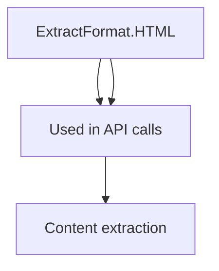
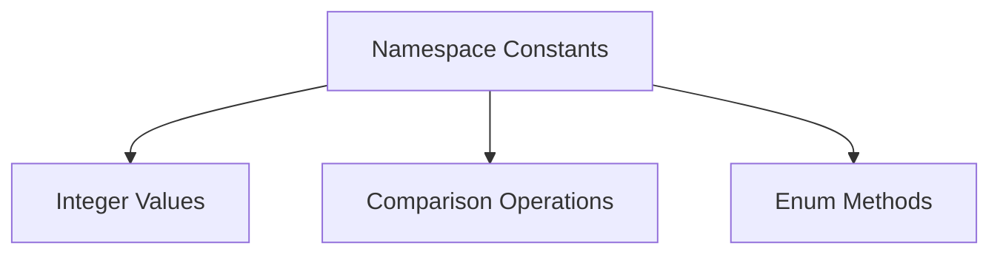
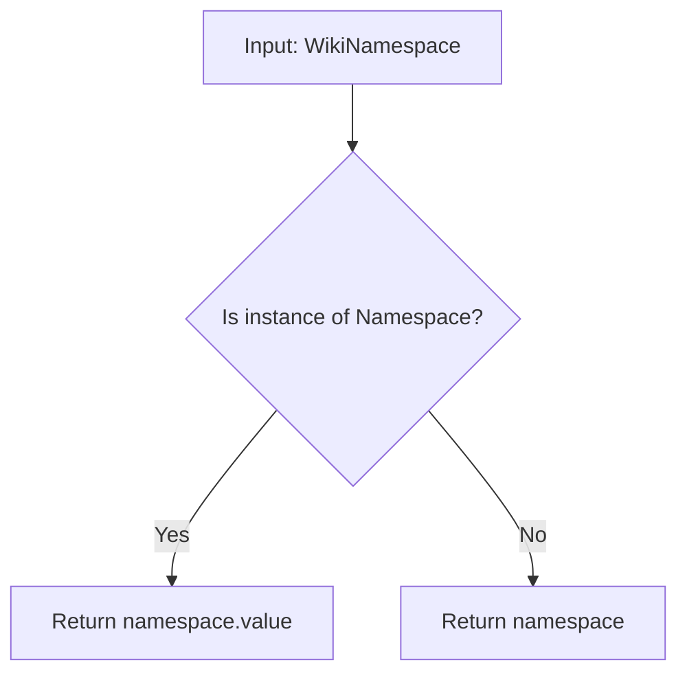
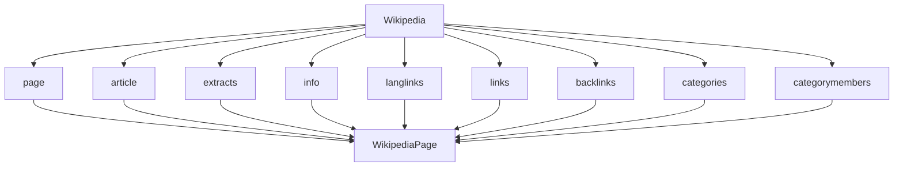
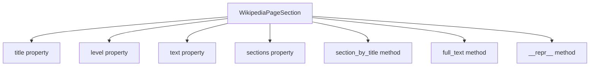
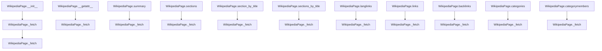

# `__init__.py`

## `wikipediaapi.__init__.ExtractFormat` · *class*

## Summary:
Represents the format used for extracting content from Wikipedia API responses.

## Description:
This enumeration defines the supported extraction formats for Wikipedia content processing. It provides two options: WIKI format which allows recognizing subsections, and HTML format which enables retrieval of HTML tags. The class is used to specify how content should be extracted and processed when interacting with the Wikipedia API.

## State:
- WIKI: Integer value 1 representing wiki markup format that supports subsection recognition
- HTML: Integer value 2 representing HTML format that allows HTML tag retrieval

## Lifecycle:
- Creation: Instances are created automatically when accessing enum members
- Usage: Used as a parameter in Wikipedia API operations to specify extraction format
- Destruction: Managed automatically by Python's garbage collection

## Method Map:


## Raises:
No exceptions are raised during initialization as this is a standard IntEnum.

## Example:
```python
from wikipediaapi import ExtractFormat

# Specify extraction format for Wikipedia API calls
format_wiki = ExtractFormat.WIKI
format_html = ExtractFormat.HTML

# Use in API operations
# api.get_page(title, extract_format=format_wiki)
```

## `wikipediaapi.__init__.Namespace` · *class*

## Summary:
Represents Wikipedia namespace identifiers as integer enumeration values.

## Description:
The Namespace class provides a standardized way to reference Wikipedia namespaces using named constants. It extends IntEnum to allow both integer comparisons and meaningful symbolic names for namespace identifiers. This abstraction enables clean, readable code when working with Wikipedia's namespace system.

This class is used throughout the wikipediaapi library to identify article types, talk pages, media files, and other content categories within Wikipedia's hierarchical namespace structure.

## State:
- Inherits all standard IntEnum behavior with integer values
- Each namespace constant maps to a specific integer identifier according to Wikipedia's namespace numbering scheme
- Values range from 0 to 2303, representing different namespace types
- Class invariants: All namespace values are unique integers; each constant maintains its assigned integer value

## Lifecycle:
- Creation: Instantiated automatically when referenced (no explicit constructor needed)
- Usage: Access namespace constants directly (e.g., Namespace.MAIN, Namespace.USER)
- Destruction: Managed automatically by Python's garbage collection

## Method Map:


## Raises:
- No exceptions raised during initialization as this is a static enum definition
- Runtime exceptions may occur when using enum methods if invalid operations are attempted

## Example:
```python
from wikipediaapi import Namespace

# Access namespace constants
main_namespace = Namespace.MAIN          # Value: 0
user_namespace = Namespace.USER          # Value: 2
talk_namespace = Namespace.TALK          # Value: 1

# Compare namespaces
if main_namespace == 0:
    print("This is the main namespace")

# Iterate through namespaces
for ns in Namespace:
    print(f"{ns.name}: {ns.value}")
```

## `wikipediaapi.__init__.namespace2int` · *function*

## Summary:
Converts a Wikipedia namespace identifier into its corresponding integer value, handling both Namespace enum objects and raw integer inputs.

## Description:
This utility function normalizes namespace inputs by converting Namespace enum objects to their integer values while passing through raw integers unchanged. It provides a consistent interface for working with Wikipedia namespace identifiers regardless of their input type.

The function is designed to handle mixed-type inputs where namespaces can be provided either as Namespace enum instances (e.g., `Namespace.MAIN`) or as raw integer values (e.g., `0`). This abstraction simplifies downstream processing that requires integer namespace identifiers.

## Args:
    namespace (WikiNamespace): A Wikipedia namespace identifier that can be either a Namespace enum object or an integer value representing a namespace ID.

## Returns:
    int: The integer representation of the namespace identifier. If the input is a Namespace enum object, returns its `.value` attribute; otherwise returns the input unchanged.

## Raises:
    None explicitly raised by this function, though invalid inputs may cause runtime errors in downstream operations.

## Constraints:
    Preconditions:
    - Input must be either a Namespace enum instance or an integer
    - When input is a Namespace enum, it must be a valid enum member
    
    Postconditions:
    - Return value is always an integer
    - Integer values are preserved as-is
    - Enum values are converted to their underlying integer representation

## Side Effects:
    None - This function performs no I/O operations or external state mutations.

## Control Flow:


## Examples:
```python
from wikipediaapi import Namespace, namespace2int

# Using Namespace enum (recommended approach)
main_ns = namespace2int(Namespace.MAIN)  # Returns 0
user_ns = namespace2int(Namespace.USER)  # Returns 2

# Using raw integer (direct approach)
raw_ns = namespace2int(100)  # Returns 100
```

## `wikipediaapi.__init__.Wikipedia` · *class*

## Summary:
Wikipedia is a wrapper class for accessing Wikipedia API endpoints to extract structured information from Wikipedia pages.

## Description:
The Wikipedia class serves as the primary entry point for interacting with Wikipedia's API. It manages HTTP sessions, validates user agents according to Wikimedia policies, and provides methods to fetch various types of information from Wikipedia pages such as extracts (summaries), page metadata, links, categories, and more.

This class should be instantiated once per application or session and reused for multiple page queries. It follows the factory pattern for creating WikipediaPage objects, which represent individual Wikipedia articles.

## State:
- language: str - The language code for Wikipedia (e.g., "en", "fr"). Must be non-empty after stripping whitespace and converting to lowercase.
- extract_format: ExtractFormat - Controls how text extracts are formatted (HTML or Wiki markup). Integer values: 1 for WIKI format, 2 for HTML format.
- _session: requests.Session - HTTP session used for making API requests with configured headers.
- _request_kwargs: dict - Additional keyword arguments passed to requests.Session.get() calls.

__init__ parameters:
- user_agent: str (required) - HTTP User-Agent header value. Must be > 5 characters long to comply with Wikimedia policy.
- language: str - Language code for Wikipedia. Defaults to "en".
- extract_format: ExtractFormat - Format for text extraction. Defaults to ExtractFormat.WIKI (integer value 1).
- headers: dict - Additional HTTP headers to send with requests. Defaults to None.
- kwargs: dict - Additional arguments passed to requests.Session.get().

Class invariants:
- language must be a non-empty string after processing
- user_agent must be provided and > 5 characters long
- _session must be a valid requests.Session instance
- _request_kwargs must be a dictionary

## Lifecycle:
Creation: Instantiate with user_agent and optional language/format parameters. Required parameters include user_agent which must comply with Wikimedia User-Agent policy.

Usage: Call methods like page(), extracts(), info(), links(), etc. on the Wikipedia instance to retrieve information about specific pages. These methods make API calls to Wikimedia services and process the responses to populate WikipediaPage objects.

Destruction: Automatically closes the HTTP session via __del__ when the object is garbage collected, though explicit cleanup is recommended in long-running applications.

## Method Map:


## Raises:
- AssertionError: Raised during __init__ when user_agent is missing or too short (< 5 characters), or when language is empty/invalid.

## Example:
```python
import wikipediaapi

# Create Wikipedia instance
wiki = wikipediaapi.Wikipedia('MyApp/1.0', language='en')

# Get a page
page = wiki.page('Python_(programming_language)')

# Extract summary
summary = wiki.extracts(page, exsentences=2)

# Get page info
wiki.info(page)

# Get links
links = wiki.links(page)

# Cleanup
del wiki
```

### `wikipediaapi.__init__.Wikipedia.__init__` · *method*

## Summary:
Initializes a Wikipedia client object with configuration for API requests and content extraction.

## Description:
Constructs a Wikipedia client instance that handles communication with Wikipedia's API and content extraction. This method sets up the HTTP session, validates required parameters, and configures request headers according to Wikimedia's User-Agent policy.

## Args:
    user_agent (str): HTTP User-Agent string required by Wikimedia policy for API requests. Must be longer than 5 characters.
    language (str, optional): Language code for the Wikipedia instance (e.g., 'en', 'fr'). Defaults to 'en'.
    extract_format (ExtractFormat, optional): Format specification for content extraction. Defaults to ExtractFormat.WIKI.
    headers (Dict[str, Any], optional): Additional HTTP headers to include in requests. Defaults to None.
    **kwargs: Additional keyword arguments passed to the underlying requests library for request configuration.

## Returns:
    None: This method initializes instance attributes and does not return a value.

## Raises:
    AssertionError: When user_agent is not provided or shorter than 6 characters, or when language is empty/invalid.

## State Changes:
    Attributes READ: None
    Attributes WRITTEN: 
        - self.language: Set to stripped and lowercased language parameter
        - self.extract_format: Set to the provided extract_format parameter
        - self._session: Initialized requests.Session() with configured headers
        - self._request_kwargs: Set to merged kwargs including default timeout

## Constraints:
    Preconditions:
        - user_agent must be a non-empty string with length > 5 characters
        - language must be a non-empty string
    Postconditions:
        - self.language is stored as a lowercase, stripped string
        - self._session is initialized with proper headers
        - self._request_kwargs contains all provided kwargs plus default timeout

## Side Effects:
    - Creates a new requests.Session() instance
    - Logs initialization information at INFO level
    - Sets default timeout of 10.0 seconds in request kwargs

### `wikipediaapi.__init__.Wikipedia.__del__` · *method*

## Summary:
Closes the session resource when the Wikipedia object is being destroyed.

## Description:
This destructor method ensures proper cleanup of HTTP session resources by closing the underlying session connection. It is automatically invoked by Python's garbage collector when the Wikipedia object instance is about to be destroyed.

## Args:
    None

## Returns:
    None

## Raises:
    None

## State Changes:
    Attributes READ: _session
    Attributes WRITTEN: None

## Constraints:
    Preconditions: The object must have a _session attribute that is truthy
    Postconditions: The session resource is closed and released

## Side Effects:
    I/O operation: Closes the underlying HTTP session connection

### `wikipediaapi.__init__.Wikipedia.page` · *method*

## Summary:
Creates and returns a WikipediaPage object for the specified page title within the given namespace.

## Description:
This method serves as the primary entry point for accessing Wikipedia page data. It constructs a WikipediaPage object that represents a specific Wikipedia page identified by its title and namespace. The returned object enables access to various page properties such as content, sections, links, categories, and more through lazy-loading mechanisms.

The method handles URL decoding when the unquote parameter is True, allowing callers to pass URL-encoded titles directly. This is particularly useful when working with non-ASCII titles or titles containing special characters that are URL-encoded in Wikipedia URLs.

This method is designed as a factory method to instantiate WikipediaPage objects, ensuring proper initialization with the correct Wikipedia client reference, title, namespace, and language settings.

## Args:
    title (str): The title of the Wikipedia page as it appears in the Wikipedia URL
    ns (WikiNamespace, optional): The namespace identifier for the page. Defaults to Namespace.MAIN
    unquote (bool, optional): If True, applies URL decoding to the title parameter. Defaults to False

## Returns:
    WikipediaPage: An object representing the requested Wikipedia page with lazy-loaded properties

## Raises:
    None explicitly raised by this method - any exceptions would come from the WikipediaPage constructor or subsequent property accesses

## State Changes:
    Attributes READ: 
    - self.language: Used to pass language information to the WikipediaPage constructor
    
    Attributes WRITTEN: None

## Constraints:
    Preconditions:
    - The Wikipedia client instance must be properly initialized with a valid user agent and language
    - The title parameter should represent a valid Wikipedia page title (though validation happens during page access)
    
    Postconditions:
    - Returns a properly initialized WikipediaPage object with the specified title, namespace, and language
    - The returned object maintains a reference to the calling Wikipedia client instance

## Side Effects:
    None - This method performs no I/O operations or external service calls. It only constructs and returns a WikipediaPage object. The actual Wikipedia API calls happen when accessing properties of the returned WikipediaPage object.

### `wikipediaapi.__init__.Wikipedia.article` · *method*

## Summary:
Constructs a Wikipedia page object with the specified title, namespace, and unquoting behavior.

## Description:
Creates and returns a WikipediaPage object representing a Wikipedia article. This method serves as an alias for the `page` method, providing an alternative naming convention for constructing page objects. The returned WikipediaPage object can be used to access various metadata and content properties through lazy loading.

This method is typically called during the initial setup phase when creating a WikipediaPage instance to begin extracting information from Wikipedia. It's commonly used in pipelines where a specific Wikipedia page needs to be accessed for further processing.

## Args:
    title (str): The page title as used in Wikipedia URLs
    ns (WikiNamespace): The Wikipedia namespace identifier, defaults to Namespace.MAIN
    unquote (bool): If True, the title will be URL-unquoted before processing, defaults to False

## Returns:
    WikipediaPage: An object representing the requested Wikipedia page with lazy-loaded properties

## Raises:
    None explicitly raised by this method - any exceptions would come from the underlying `page` method or `WikipediaPage` constructor

## State Changes:
    Attributes READ: None
    Attributes WRITTEN: None

## Constraints:
    Preconditions: 
    - The `title` parameter must be a valid string
    - The `ns` parameter must be a valid WikiNamespace enum value
    - The `unquote` parameter must be a boolean value
    
    Postconditions:
    - Returns a properly initialized WikipediaPage object
    - The returned object will have the specified title, namespace, and language set

## Side Effects:
    None - This method only constructs and returns a WikipediaPage object. The actual Wikipedia API calls happen lazily when properties of the returned WikipediaPage object are accessed.

### `wikipediaapi.__init__.Wikipedia.extracts` · *method*

## Summary:
Returns a formatted summary of a Wikipedia page based on extraction parameters and the configured extract format.

## Description:
Retrieves and processes page content from the Wikipedia API to return a structured summary. This method handles different extraction formats (HTML vs wiki markup) and processes the content into a hierarchical section structure. It's designed to be called by users who want to extract summarized content from Wikipedia pages with customizable parameters.

The method is called during the page extraction process and integrates with the Wikipedia API's query system. It's separated from inline logic to allow for clean parameter handling and consistent processing regardless of the extraction format.

Known callers:
- Direct user API calls: When developers call `wiki.extracts(page, **kwargs)` to retrieve page summaries
- Internal API pipeline: Called by the Wikipedia class's public methods when processing page content

## Args:
    page (WikipediaPage): The Wikipedia page object to extract content from
    **kwargs: Additional API parameters to customize the extraction (e.g., exsentences, exintro, etc.)

## Returns:
    str: The summary text of the page, which may be the entire extract if no sections exist, or an empty string if the page doesn't exist (when pageid is -1)

## Raises:
    None explicitly raised by this method - relies on underlying API calls and processing

## State Changes:
    Attributes READ:
        - self.extract_format: Determines how content is processed and formatted
        - page.title: Used to identify the page in API queries
    Attributes WRITTEN:
        - page._attributes: Populated with common page metadata from API response
        - page._summary: Set to the extracted summary text
        - page._section_mapping: Populated with section hierarchy information
        - page._attributes["pageid"]: Set to -1 when page doesn't exist (key "-1")

## Constraints:
    Preconditions:
        - The Wikipedia instance must be properly initialized with a valid session
        - The page parameter must be a valid WikipediaPage object with a title
        - The extract_format must be a valid ExtractFormat enum value
    Postconditions:
        - The page object will have its _attributes populated with API metadata
        - The page object will have its _summary set to the extracted content
        - The page object will have its _section_mapping populated with section hierarchy
        - Returns either the summary text or empty string for non-existent pages (when pageid is -1)

## Side Effects:
    - Makes HTTP GET requests to Wikimedia API endpoints
    - Logs API request URLs at INFO level for debugging
    - Modifies the page object's internal state (attributes, summary, section mapping)
    - May cause network I/O delays depending on API response times

### `wikipediaapi.__init__.Wikipedia.info` · *method*

## Summary:
Retrieves comprehensive metadata for a Wikipedia page from the MediaWiki API and updates the page object with the retrieved information.

## Description:
This method fetches detailed metadata about a Wikipedia page using the MediaWiki API's info module. It specifically retrieves properties such as protection status, talk page identifiers, watch status, viewer statistics, URLs, readability flags, and display titles. The method follows the established pattern used by other API methods in the Wikipedia class, making an API request, processing the response, and updating the page's attributes accordingly.

The method is implemented as a separate utility rather than being inlined because it encapsulates the specific logic for fetching and processing info API responses, maintains consistency with other API methods in the class, and provides a clean interface for retrieving comprehensive page metadata. It is typically called during the initialization or lazy-loading phase of a WikipediaPage object when detailed metadata is required.

## Args:
    page (WikipediaPage): The WikipediaPage object to fetch information for. This object must contain a valid title attribute and language information needed for constructing the API request.

## Returns:
    WikipediaPage: The same WikipediaPage object that was passed in, now updated with metadata from the API response. This enables method chaining and ensures the page object reflects the latest information from Wikipedia.

## Raises:
    None explicitly raised by this method - however, underlying API calls may raise exceptions from the requests library or JSON parsing errors when making HTTP requests to the MediaWiki API.

## State Changes:
    Attributes READ: 
    - page.title (used to construct API request)
    - page.language (used to construct API URL)
    
    Attributes WRITTEN:
    - page._attributes (populated with API response data including pageid, title, ns, redirects, protection, talkid, watched, watchers, visitingwatchers, notificationtimestamp, subjectid, url, readable, preload, displaytitle)
    - page._attributes["pageid"] (set to -1 if page doesn't exist, indicating the page was not found)

## Constraints:
    Preconditions:
    - The WikipediaPage object must have a valid title attribute
    - The Wikipedia object must be properly initialized with a valid user agent and language
    - The page language must be supported by the MediaWiki API
    - The page title must be properly encoded for URL construction
    
    Postconditions:
    - The page object's _attributes dictionary will contain the metadata returned by the API
    - If the page doesn't exist (indicated by pageid=-1), page._attributes["pageid"] will be set to -1
    - The page object will be returned unchanged except for updated attributes
    - All specified info properties (protection, talkid, watchers, etc.) will be populated in the page's attributes

## Side Effects:
    - Makes an HTTP GET request to the MediaWiki API endpoint (https://{language}.wikipedia.org/w/api.php)
    - Logs the request URL for debugging purposes using the logger
    - Performs network I/O operations to retrieve page metadata
    - Uses the Wikipedia class's session for making requests, maintaining connection pooling

### `wikipediaapi.__init__.Wikipedia.langlinks` · *method*

## Summary:
Retrieves language links for a Wikipedia page, returning pages in other languages that represent the same content.

## Description:
This method fetches language links from the Wikipedia API for a given page, constructing WikipediaPage objects for each linked page in another language. It implements the core functionality for accessing multilingual content representations of Wikipedia articles. The method follows the same lazy-loading pattern as other page properties and makes a single API call to retrieve language link data.

The method is typically called internally by the `WikipediaPage.langlinks` property when accessing language links for the first time. It uses the MediaWiki API's langlinks module to fetch the data and processes it through helper methods to create proper WikipediaPage objects for each language variant.

## Args:
    page (WikipediaPage): The Wikipedia page object for which to retrieve language links
    **kwargs: Additional API parameters to customize the language link query (e.g., lllimit, llprop)

## Returns:
    PagesDict: A dictionary mapping language codes to WikipediaPage objects representing the same page in different languages. Returns an empty dictionary if the page doesn't exist or has no language links.

## Raises:
    None explicitly raised - relies on underlying _query method which may raise requests.RequestException

## State Changes:
    Attributes READ: 
        - page.title: Used to construct the API query
        - page.language: Used to construct the API endpoint URL
    Attributes WRITTEN:
        - page._attributes: Updated with common page attributes via _common_attributes
        - page._langlinks: Populated with language link WikipediaPage objects

## Constraints:
    Preconditions:
        - The page parameter must be a valid WikipediaPage instance with a title attribute
        - The Wikipedia client must be properly initialized
        - The page's language attribute must be set appropriately for API queries
        
    Postconditions:
        - The page._langlinks attribute is populated with language link WikipediaPage objects
        - Common page attributes are updated in page._attributes
        - The returned PagesDict contains all language links from the API response

## Side Effects:
    - Makes an HTTP GET request to the Wikimedia API endpoint
    - Logs the API request URL at INFO level for debugging
    - Modifies the page object's internal state by updating _langlinks and _attributes caches

### `wikipediaapi.__init__.Wikipedia.links` · *method*

## Summary:
Retrieves all linked pages from a Wikipedia page using the MediaWiki API, handling pagination and building link objects.

## Description:
Fetches all links from a specified Wikipedia page by making API calls to the MediaWiki endpoint. This method implements pagination handling for cases where the number of links exceeds the API limit of 500 links per request. It processes the API response to build WikipediaPage objects for each linked page and stores them in the page's internal cache.

The method is typically called during lazy loading when accessing the `links` property of a WikipediaPage object. It uses the `_query` method to make HTTP requests to the Wikimedia API and `_build_links` to process the response data into proper WikipediaPage objects.

## Args:
    page (WikipediaPage): The Wikipedia page object from which to retrieve links
    **kwargs: Additional API parameters to customize the link query (e.g., plnamespace, plfilterredir)

## Returns:
    PagesDict: Dictionary mapping link titles to WikipediaPage objects representing the linked pages. Returns an empty dictionary if:
    - The page doesn't exist (indicated by pageid = -1 in API response)
    - There are no links on the page
    - The API request fails to return valid link data

## Raises:
    None explicitly documented, but may raise exceptions from underlying API calls such as requests.RequestException or KeyError from malformed API responses.

## State Changes:
    Attributes READ: 
        - self._query: Called to make API requests
        - self._common_attributes: Called to update page attributes
        - self._build_links: Called to process link data
    Attributes WRITTEN: 
        - page._attributes: Updated with common page attributes (including pageid when page doesn't exist)
        - page._links: Populated with link WikipediaPage objects

## Constraints:
    Preconditions:
        - The Wikipedia client must be properly initialized
        - The page parameter must be a valid WikipediaPage object with a valid title
    Postconditions:
        - The page's _links attribute will be populated with link data (or remain empty)
        - The page's _attributes will contain common page metadata including pageid
        - The returned PagesDict will contain WikipediaPage objects for each link, or an empty dictionary

## Side Effects:
    - Makes HTTP GET requests to Wikimedia API endpoints
    - Performs network I/O operations
    - Updates internal caches (page._links and page._attributes)
    - May modify page._attributes["pageid"] when page doesn't exist

### `wikipediaapi.__init__.Wikipedia.backlinks` · *method*

*No documentation generated.*

### `wikipediaapi.__init__.Wikipedia.categories` · *method*

## Summary:
Retrieves and returns the categories associated with a Wikipedia page, building category page objects for each category found.

## Description:
This method fetches category information for a given Wikipedia page by making a MediaWiki API query with the 'categories' property. It processes the API response to construct WikipediaPage objects for each category and caches them on the page's categories attribute. The method handles special cases like non-existent pages and ensures proper attribute population.

## Args:
    page (WikipediaPage): The Wikipedia page object for which to retrieve categories
    **kwargs: Additional API parameters to customize the category query (e.g., clshow, cllimit)

## Returns:
    PagesDict: A dictionary mapping category titles to WikipediaPage objects representing the categories this page belongs to. Returns an empty dictionary if the page doesn't exist or has no categories.

## Raises:
    None explicitly raised - relies on underlying _query method which may raise requests.RequestException

## State Changes:
    Attributes READ: 
        - page.title: Used to construct the API query
    Attributes WRITTEN:
        - page._categories: Populated with category WikipediaPage objects
        - page._attributes: Updated with common page attributes via _common_attributes

## Constraints:
    Preconditions:
        - The page parameter must be a valid WikipediaPage instance with a title attribute
        - The Wikipedia client must be properly initialized
        - The page's language attribute must be set appropriately for API queries
        
    Postconditions:
        - The page._categories attribute is populated with category WikipediaPage objects
        - Common page attributes are updated in page._attributes
        - The returned PagesDict contains all categories from the API response

## Side Effects:
    - Makes an HTTP GET request to the Wikimedia API endpoint
    - Logs the API request URL at INFO level for debugging
    - Modifies the page object's internal state by updating _categories and _attributes caches

### `wikipediaapi.__init__.Wikipedia.categorymembers` · *method*

*No documentation generated.*

### `wikipediaapi.__init__.Wikipedia._query` · *method*

## Summary:
Queries the Wikimedia API to fetch content for a specific Wikipedia page with given parameters.

## Description:
This private method serves as the core HTTP request mechanism for all Wikipedia API interactions. It constructs the appropriate API endpoint URL using the page's language, logs the request URL for debugging purposes, sets standard API parameters (format=json and redirects=1), and executes the HTTP GET request using the session configured in the Wikipedia client.

The method is called internally by all public API methods (extracts, info, langlinks, links, backlinks, categories, categorymembers) to perform the actual network communication with the Wikimedia API.

## Args:
    page (WikipediaPage): The Wikipedia page object containing language and title information used to construct the API endpoint URL
    params (Dict[str, Any]): Dictionary of API parameters to be sent with the request

## Returns:
    dict: JSON response from the Wikimedia API parsed as a Python dictionary

## Raises:
    requests.RequestException: If the HTTP request fails due to network issues, timeouts, or invalid responses
    KeyError: If the JSON response doesn't contain expected keys (though this would be rare with proper API usage)

## State Changes:
    Attributes READ: 
        - self._session: Used to execute the HTTP GET request
        - self._request_kwargs: Additional keyword arguments passed to the HTTP request
        - page.language: Used to construct the base URL
    Attributes WRITTEN: None

## Constraints:
    Preconditions:
        - The Wikipedia client must be properly initialized with a valid session
        - The page parameter must be a valid WikipediaPage object with a valid language attribute
        - The params dictionary should contain valid Wikimedia API parameters
    Postconditions:
        - The returned dictionary contains the parsed JSON response from the Wikimedia API
        - The API request includes format=json and redirects=1 parameters automatically

## Side Effects:
    - Makes an HTTP GET request to Wikimedia API endpoints
    - Logs the constructed request URL at INFO level for debugging purposes
    - May cause network I/O delays depending on API response times

### `wikipediaapi.__init__.Wikipedia._build_extracts` · *method*

## Summary:
Constructs a hierarchical summary and section structure from a Wikipedia page extract.

## Description:
Processes a Wikipedia page extract to build both a summary text and a hierarchical section structure. This method parses section markers in the extract text and builds a tree-like structure of sections, where each section contains its content and nested subsections. The method handles both pages with and without sections, ensuring that all content is properly categorized.

This method is called during the extraction process when fetching page summaries from the Wikipedia API. It's separated from inline logic to handle the complex parsing and structure building required for proper section hierarchy management.

## Args:
    self: Wikipedia instance
    extract (dict): Raw extract data from Wikipedia API containing 'extract' key with page content
    page (WikipediaPage): Page object to populate with summary and section data

## Returns:
    str: The summary text of the page, which may be the entire extract if no sections exist

## Raises:
    None explicitly raised - relies on underlying regex matching and section creation

## State Changes:
    Attributes READ:
        - page._section_mapping (accessed to check length)
        - extract["extract"] (accessed for text processing)
        - self.extract_format (accessed to select regex pattern)
        
    Attributes WRITTEN:
        - page._summary (set to initial content or full extract)
        - page._section_mapping (populated with section titles and references)
        - section._text (set for each processed section)
        - section_stack (manipulated during section hierarchy construction)

## Constraints:
    Preconditions:
        - extract must contain an "extract" key with string content
        - page must be a valid WikipediaPage instance
        - self.extract_format must be a valid ExtractFormat enum value
        
    Postconditions:
        - page._summary will contain the page summary text
        - page._section_mapping will contain mapping of section titles to section objects
        - All sections will have their _text attribute populated appropriately
        - The returned string will be the page summary

## Side Effects:
    - Modifies page object's internal state (_summary, _section_mapping, section texts)
    - Uses regular expression matching on extract text
    - Calls other methods (_common_attributes, _create_section)

### `wikipediaapi.__init__.Wikipedia._create_section` · *method*

## Summary:
Creates a WikipediaPageSection object from a regex match result, handling both wiki markup and HTML format section markers.

## Description:
This method processes a regex match object containing section header information and constructs a WikipediaPageSection instance. It adapts its behavior based on the extract format (wiki vs HTML) to correctly parse section titles and levels from different markup formats. The method is called internally by `_build_extracts` during page content processing to construct the hierarchical section structure.

The method is separated from inline logic to handle the complexity of different markup formats and ensure proper section level calculation. It's designed to work with the regex patterns defined in `RE_SECTION` dictionary that maps extract formats to appropriate section matching patterns.

## Args:
    self: Wikipedia instance containing the extract_format attribute
    match: Regex match object containing section header information from content parsing

## Returns:
    WikipediaPageSection: A newly created section object with appropriate title and level

## Raises:
    None explicitly raised - relies on underlying regex group access and section creation

## State Changes:
    Attributes READ:
        - self.extract_format (determines parsing approach)
        
    Attributes WRITTEN:
        - None directly modified (creates new section object)

## Constraints:
    Preconditions:
        - self.extract_format must be either ExtractFormat.WIKI or ExtractFormat.HTML
        - match must be a valid regex match object with appropriate groups for the format
        - For WIKI format: match.group(1) contains level indicator, match.group(2) contains title
        - For HTML format: match.group(1) contains level number, match.group(5) contains title
        
    Postconditions:
        - Returns a properly initialized WikipediaPageSection object
        - Section title is stripped of whitespace
        - Section level is calculated correctly (adjusted by 1 to convert from markdown-style to 0-based indexing)

## Side Effects:
    None - purely functional method that creates and returns a new object

### `wikipediaapi.__init__.Wikipedia._build_info` · *method*

## Summary:
Populates a WikipediaPage object with data from an API response extract.

## Description:
This method processes API response data to build a WikipediaPage object by first applying common attribute handling and then copying all key-value pairs from the extract dictionary to the page's attributes. It serves as a factory method for constructing page objects from raw API data within the Wikipedia API client. This method is typically called during the parsing of API responses to construct page objects from raw extract data.

## Args:
    extract (dict): Raw API response data containing page attributes
    page (WikipediaPage): The WikipediaPage instance to populate with data

## Returns:
    WikipediaPage: The populated WikipediaPage instance

## Raises:
    None explicitly documented

## State Changes:
    Attributes READ: 
    - self._common_attributes method call (likely reads from self or extract)
    Attributes WRITTEN: 
    - page._attributes: All key-value pairs from extract are copied to this dictionary

## Constraints:
    Preconditions:
    - extract must be a dictionary-like object
    - page must be a valid WikipediaPage instance
    - page._attributes must be a dictionary that supports item assignment
    
    Postconditions:
    - All keys from extract will be present in page._attributes
    - The page object will be fully populated with the API response data

## Side Effects:
    None

### `wikipediaapi.__init__.Wikipedia._build_langlinks` · *method*

## Summary:
Builds language link mappings for a Wikipedia page from API response data.

## Description:
Constructs language links for a Wikipedia page by processing the API response's langlinks data. This method creates WikipediaPage objects for each language link and stores them in a dictionary keyed by language code. It's used internally by the Wikipedia API client to populate the `_langlinks` attribute of WikipediaPage instances.

The method is called during lazy-loading of language links for a Wikipedia page, specifically when the `langlinks` property is accessed on a WikipediaPage instance. It follows the same pattern as other build methods like `_build_links`, `_build_categories`, etc.

## Args:
    self: Wikipedia instance - the Wikipedia API client
    extract: dict - API response data containing langlinks information
    page: WikipediaPage - the page instance being populated with language links

## Returns:
    Dict[str, WikipediaPage]: Dictionary mapping language codes to WikipediaPage objects representing the same page in different languages

## Raises:
    None explicitly raised - any exceptions would come from underlying API calls or data processing

## State Changes:
    Attributes READ: 
    - extract.get("langlinks", [])
    - self._common_attributes()
    
    Attributes WRITTEN:
    - page._langlinks: Set to empty dict, then populated with language link pages
    - page._attributes: Updated with common attributes via _common_attributes call

## Constraints:
    Preconditions:
    - extract parameter must be a dictionary containing API response data
    - page parameter must be a valid WikipediaPage instance
    - extract must contain a "langlinks" key or be an empty list
    
    Postconditions:
    - page._langlinks is populated with WikipediaPage objects for each language link
    - Common attributes are set on the page via _common_attributes call
    - The returned dictionary contains all language links mapped by language code

## Side Effects:
    - Creates new WikipediaPage instances for each language link
    - Makes no external I/O calls beyond what's already done in _common_attributes
    - Modifies the page's _langlinks attribute in-place

### `wikipediaapi.__init__.Wikipedia._build_links` · *method*

## Summary:
Constructs and populates the links dictionary for a Wikipedia page using API extract data.

## Description:
Processes link information from API response extracts and creates WikipediaPage objects for each linked page. This method is responsible for building the internal representation of links associated with a Wikipedia page. It also calls `_common_attributes` to set shared attributes across all pages.

## Args:
    extract (dict): API response extract containing link information under the "links" key
    page (WikipediaPage): The target page object whose _links attribute will be populated

## Returns:
    PagesDict: Dictionary mapping link titles to WikipediaPage objects

## Raises:
    None explicitly documented

## State Changes:
    Attributes READ: None
    Attributes WRITTEN: page._links

## Constraints:
    Preconditions: 
    - extract must be a dictionary that contains a "links" key (can be empty list)
    - page must be a valid WikipediaPage instance
    - extract["links"] must contain dictionaries with "title" and "ns" keys
    Postconditions:
    - page._links will be populated with link data
    - The returned dictionary will contain WikipediaPage objects for each link
    - Common attributes will be set via _common_attributes call

## Side Effects:
    Calls self._common_attributes(extract, page) to set shared page attributes
    Modifies page._links attribute

### `wikipediaapi.__init__.Wikipedia._build_backlinks` · *method*

*No documentation generated.*

### `wikipediaapi.__init__.Wikipedia._build_categories` · *method*

## Summary:
Initializes and populates the categories attribute of a Wikipedia page with category information from an API response.

## Description:
This method processes category data returned from the Wikipedia API and constructs WikipediaPage objects for each category. It is part of the internal data processing pipeline that transforms raw API responses into structured page data. The method is called by the `categories()` method when retrieving category information for a Wikipedia page.

## Args:
    extract (dict): Raw API response data containing category information under the "categories" key
    page (WikipediaPage): The WikipediaPage object whose categories are being built

## Returns:
    PagesDict: A dictionary mapping category titles to WikipediaPage objects representing those categories

## Raises:
    None explicitly raised - relies on underlying methods and data access patterns

## State Changes:
    Attributes READ: 
        - extract.get("categories", []) - accesses category data from API response
        - extract (for common attributes)
        - page.language - uses language from parent page
    
    Attributes WRITTEN:
        - page._categories - populates the categories cache on the WikipediaPage object

## Constraints:
    Preconditions:
        - The `extract` parameter must be a dictionary that may contain a "categories" key
        - The `page` parameter must be a valid WikipediaPage instance
        - The page's language attribute must be properly initialized
        
    Postconditions:
        - The page._categories attribute is populated with category WikipediaPage objects
        - Common attributes (title, pageid, ns, redirects) are set on the page via _common_attributes
        - The returned dictionary contains all categories from the API response

## Side Effects:
    None - This method only manipulates internal state and returns data without making external calls or performing I/O operations

### `wikipediaapi.__init__.Wikipedia._build_categorymembers` · *method*

## Summary:
Populates a Wikipedia page's category members from API extract data and returns the populated dictionary.

## Description:
Processes the API response extract data containing category members and constructs WikipediaPage objects for each member. This method is responsible for building the internal `_categorymembers` cache of a Wikipedia page by creating individual WikipediaPage instances for each member in the category.

This method is called internally by the `categorymembers()` method when processing API responses containing category membership data. It follows the same pattern as other build methods in the Wikipedia class (`_build_langlinks`, `_build_links`, etc.) for consistency.

## Args:
    extract (dict): Raw API response extract data containing category members information
    page (WikipediaPage): The WikipediaPage object whose `_categorymembers` attribute will be populated

## Returns:
    PagesDict: Dictionary mapping member page titles to their respective WikipediaPage objects

## Raises:
    KeyError: When required keys ('title', 'ns', 'pageid') are missing from member data in extract
    TypeError: When the extract data structure is invalid or incompatible

## State Changes:
    Attributes READ: 
        - self._common_attributes
        - extract.get("categorymembers", [])
    Attributes WRITTEN:
        - page._categorymembers

## Constraints:
    Preconditions:
        - The `extract` parameter must contain valid API response data with category members
        - The `page` parameter must be a valid WikipediaPage instance
        - Each member in extract["categorymembers"] must have 'title', 'ns', and 'pageid' keys
    Postconditions:
        - The `page._categorymembers` attribute is populated with a dictionary of WikipediaPage objects
        - All common attributes from the extract are set on the page via `_common_attributes`

## Side Effects:
    None - This method only manipulates internal object state and returns a dictionary reference

### `wikipediaapi.__init__.Wikipedia._common_attributes` · *method*

## Summary:
Populates common Wikipedia page attributes from API response data into the page's attribute cache.

## Description:
This method extracts standard Wikipedia page metadata (title, page ID, namespace, and redirects) from an API response dictionary and stores them in the page's internal attribute cache. It serves as a utility function to reduce code duplication across various Wikipedia API response processing methods.

## Args:
    extract (dict): Dictionary containing API response data with potential common attributes
    page (WikipediaPage): The WikipediaPage instance whose attributes will be populated

## Returns:
    None: This method modifies the page object in-place and returns nothing

## Raises:
    None: This method does not explicitly raise exceptions

## State Changes:
    Attributes READ: None (reads from extract parameter)
    Attributes WRITTEN: 
    - page._attributes[attr] for each common attribute that exists in extract

## Constraints:
    Preconditions:
    - The `extract` parameter must be a dictionary-like object that supports the `in` operator
    - The `page` parameter must be a valid WikipediaPage instance
    - The `page` instance must have a `_attributes` dictionary attribute
    
    Postconditions:
    - Any common attributes present in the `extract` dictionary will be copied to `page._attributes`
    - The method does not modify any other attributes of the page object

## Side Effects:
    None: This method only modifies the internal state of the WikipediaPage object passed as parameter

## `wikipediaapi.__init__.WikipediaPageSection` · *class*

## Summary:
WikipediaPageSection represents a section in a Wikipedia page, including its title, content, indentation level, and nested subsections.

## Description:
This class serves as a structured representation of a section within a Wikipedia page. It encapsulates the hierarchical nature of Wikipedia articles by maintaining parent-child relationships through subsections. The class is typically instantiated by the Wikipedia API processing logic when parsing page content, particularly during extraction operations.

The motivation for this abstraction is to provide a clean, hierarchical data structure that mirrors the organizational structure of Wikipedia articles, making it easier to navigate and process article content programmatically.

## State:
- wiki: Wikipedia instance that owns this section
- _title: str - Title of the section
- _level: int - Indentation level of the section (0-based)
- _text: str - Text content of the section
- _section: List[WikipediaPageSection] - List of subsections contained within this section

## Lifecycle:
- Creation: Constructed with a Wikipedia instance, title, optional level (default 0), and optional text (default empty string)
- Usage: Typically accessed through WikipediaPage objects, with methods for retrieving subsections and generating formatted text
- Destruction: Managed by Python's garbage collection

## Method Map:


## Raises:
- NotImplementedError: When full_text is called with an unknown ExtractFormat type

## Example:
```python
# Create a section
wiki = Wikipedia('my-user-agent')
section = WikipediaPageSection(wiki, "Introduction", level=0, text="This is the intro.")

# Add subsections
subsection = WikipediaPageSection(wiki, "History", level=1, text="Historical background...")
section.sections.append(subsection)

# Retrieve subsection by title
found_section = section.section_by_title("History")

# Generate formatted text
formatted_text = section.full_text()
```

### `wikipediaapi.__init__.WikipediaPageSection.__init__` · *method*

## Summary:
Initializes a WikipediaPageSection object with a Wikipedia instance, title, indentation level, and content text.

## Description:
Constructs a WikipediaPageSection instance that represents a hierarchical section within a Wikipedia page. This constructor sets up the fundamental attributes needed to represent a section, including its title, content, nesting level, and parent Wikipedia instance. The method is typically called internally by Wikipedia API processing logic when parsing page content into structured sections.

This method exists as a dedicated constructor to provide a clean interface for creating section objects with proper initialization of all required attributes, ensuring consistency in section representation throughout the Wikipedia API client.

## Args:
- wiki (Wikipedia): The Wikipedia instance that owns this section
- title (str): The title of the section
- level (int): The indentation level of the section (0-based hierarchy level), defaults to 0
- text (str): The text content of the section, defaults to empty string

## Returns:
- None: This method initializes the object's attributes and does not return a value

## Raises:
- No explicit exceptions are raised by this constructor

## State Changes:
- Attributes READ: None
- Attributes WRITTEN: 
  - self.wiki: Assigned the wiki parameter value
  - self._title: Assigned the title parameter value
  - self._level: Assigned the level parameter value
  - self._text: Assigned the text parameter value
  - self._section: Initialized as an empty list to store subsections

## Constraints:
- Preconditions: The wiki parameter must be a valid Wikipedia instance
- Postconditions: The WikipediaPageSection object will have all attributes properly initialized with the provided values

## Side Effects:
- No I/O operations, external service calls, or mutations to objects outside self

### `wikipediaapi.__init__.WikipediaPageSection.title` · *method*

## Summary:
Returns the title of the current Wikipedia page section.

## Description:
Provides access to the title of a Wikipedia page section, which represents the heading text of that section. This property serves as a read-only interface to the internal `_title` attribute, allowing external code to retrieve section metadata without modifying the underlying data structure.

The title property is commonly used when iterating through section hierarchies, filtering sections by name, or displaying section information to users. It's particularly useful in conjunction with other section properties like `level` and `text` to build comprehensive section representations.

## Args:
    None

## Returns:
    str: The title string of the current section, which corresponds to the section heading text from the Wikipedia page.

## Raises:
    None

## State Changes:
    Attributes READ: self._title
    Attributes WRITTEN: None

## Constraints:
    Preconditions: The WikipediaPageSection object must be properly initialized with a valid `_title` attribute.
    Postconditions: The returned string is immutable and reflects the section's title at the time of access.

## Side Effects:
    None

### `wikipediaapi.__init__.WikipediaPageSection.level` · *method*

## Summary:
Returns the indentation level of the current section, representing its hierarchical position in the Wikipedia page structure.

## Description:
This property provides access to the section's nesting level within the document hierarchy. In Wikipedia terms, this corresponds to the heading level (h1, h2, h3, etc.) where h1 represents the main title and deeper levels represent subsections.

## Args:
    None

## Returns:
    int: The indentation level of the current section, where 0 typically represents the main page title and higher values represent nested subsections.

## Raises:
    None

## State Changes:
    Attributes READ: self._level
    Attributes WRITTEN: None

## Constraints:
    Preconditions: The WikipediaPageSection object must be properly initialized with a valid level value.
    Postconditions: The returned value is always an integer representing the section's hierarchical depth.

## Side Effects:
    None

### `wikipediaapi.__init__.WikipediaPageSection.text` · *method*

## Summary:
Returns the text content of the current Wikipedia page section.

## Description:
Provides access to the textual content stored within the current section of a Wikipedia page. This property serves as a simple getter for the internal `_text` attribute that was populated during the parsing of Wikipedia page content. The returned text represents the main content of the section, excluding any formatting or structural elements that might be present in the original Wikipedia markup.

## Args:
    None

## Returns:
    str: The text content of the current section as a string. Returns an empty string if no text content was parsed for this section.

## Raises:
    None

## State Changes:
    Attributes READ: 
    - self._text

    Attributes WRITTEN: None

## Constraints:
    Preconditions:
    - The WikipediaPageSection object must be properly initialized
    - The `_text` attribute should contain valid text content (though it may be empty)
    
    Postconditions:
    - The returned string is immutable and does not affect the internal state of the section object
    - The returned text preserves the original content as parsed from Wikipedia

## Side Effects:
    None

### `wikipediaapi.__init__.WikipediaPageSection.sections` · *method*

## Summary:
Returns the list of subsections contained within the current Wikipedia page section.

## Description:
Provides access to all subsections of the current section. This property enables traversal of the hierarchical structure of Wikipedia page sections, allowing developers to navigate through nested section content. The returned list contains WikipediaPageSection objects that represent the immediate child sections of the current section.

This method exists as a dedicated property rather than being inlined because it provides a clean abstraction layer for accessing the internal subsection collection, making the code more readable and maintainable while preserving encapsulation of the internal data structure.

## Args:
    None

## Returns:
    List[WikipediaPageSection]: A list of subsection objects belonging to the current section. Returns an empty list if no subsections exist.

## Raises:
    None

## State Changes:
    Attributes READ: self._section
    Attributes WRITTEN: None

## Constraints:
    Preconditions: The WikipediaPageSection object must be properly initialized with a valid _section attribute
    Postconditions: The returned list reference points to the internal subsection collection, so modifications to the returned list affect the internal state

## Side Effects:
    None

### `wikipediaapi.__init__.WikipediaPageSection.section_by_title` · *method*

## Summary:
Returns the last subsection with the specified title from the current section's subsections.

## Description:
Provides convenient access to a specific subsection within the current Wikipedia page section by searching through all subsections for a match on title. This method is useful when navigating hierarchical Wikipedia content where subsections may share common titles but need to be accessed by their specific position in the hierarchy.

## Args:
    title (str): The exact title string to search for among subsections

## Returns:
    Optional[WikipediaPageSection]: The last subsection matching the given title, or None if no matching subsection exists

## Raises:
    None

## State Changes:
    Attributes READ: self._section, self._section.title
    Attributes WRITTEN: None

## Constraints:
    Preconditions: The WikipediaPageSection object must be properly initialized with a valid _section list
    Postconditions: The returned subsection maintains all its original properties and relationships

## Side Effects:
    None

### `wikipediaapi.__init__.WikipediaPageSection.full_text` · *method*

## Summary:
Returns the complete text content of the current section including all nested subsections, formatted according to the extract format setting.

## Description:
This method recursively constructs the full text representation of a Wikipedia page section and all its subsections. It formats the section title based on the configured extract format (WIKI or HTML) and appends the section's text content followed by all child sections' content. This method is designed to provide a complete hierarchical view of section content for processing or display purposes.

## Args:
    level (int): The indentation level used for HTML heading tags. Defaults to 1.

## Returns:
    str: A formatted string containing the section title, text content, and recursively all subsection content.

## Raises:
    NotImplementedError: When the wiki's extract_format is not one of the supported values (WIKI or HTML). This occurs when an unexpected extract format value is encountered during execution.

## State Changes:
    Attributes READ: 
    - self.wiki.extract_format
    - self.title
    - self._text
    - self.sections
    
    Attributes WRITTEN: None

## Constraints:
    Preconditions:
    - The WikipediaPageSection instance must have a valid wiki object with a defined extract_format
    - The wiki object's extract_format must be either ExtractFormat.WIKI or ExtractFormat.HTML
    
    Postconditions:
    - Returns a properly formatted string with section hierarchy
    - The returned string includes the section title, text, and all subsection content
    - Recursive calls process all nested subsections

## Side Effects:
    None

### `wikipediaapi.__init__.WikipediaPageSection.__repr__` · *method*

## Summary:
Returns a formatted string representation of a Wikipedia page section including its title, level, text content, and all nested subsections.

## Description:
This method provides a human-readable representation of a Wikipedia page section for debugging and logging purposes. It recursively includes all subsections in the output, making it easy to visualize the hierarchical structure of Wikipedia sections. The method is automatically called when using `repr()` on a WikipediaPageSection instance or when the object is printed in interactive environments.

## Args:
    None

## Returns:
    str: A formatted string containing the section title, level, text content, and recursively formatted subsections. The format follows: "Section: {title} ({level}):\n{text}\nSubsections ({count}):\n{subsection_reprs}"

## Raises:
    None

## State Changes:
    Attributes READ: 
    - self._title (str): Title of the current section
    - self._level (int): Indentation level of the current section  
    - self._text (str): Text content of the current section
    - self._section (list): List of subsections
    
    Attributes WRITTEN: None

## Constraints:
    Preconditions:
    - All attributes (self._title, self._level, self._text, self._section) must be properly initialized
    - The _section attribute should be a list of WikipediaPageSection objects or empty
    
    Postconditions:
    - Returns a string representation that accurately reflects the section's structure
    - The recursive call to repr() on subsections ensures complete hierarchical representation

## Side Effects:
    None

## `wikipediaapi.__init__.WikipediaPage` · *class*

## Summary:
Represents a Wikipedia page with lazy-loaded properties and metadata.

## Description:
The WikipediaPage class provides an interface to access Wikipedia page data with lazy loading. It represents a single Wikipedia page and allows access to various metadata and content properties that are fetched on-demand from the Wikipedia API. The class tracks which data has been fetched to avoid redundant API calls. Properties are accessed via lazy loading, where the first access triggers an API call to fetch the requested data.

## State:
*   `wiki` (Wikipedia): Reference to the Wikipedia API client instance
*   `_summary` (str): Cached summary text of the page
*   `_section` (List[WikipediaPageSection]): Cached list of page sections
*   `_section_mapping` (Dict[str, List[WikipediaPageSection]]): Mapping of section titles to their sections
*   `_langlinks` (PagesDict): Cached language links to other language pages
*   `_links` (PagesDict): Cached links to other Wikipedia pages
*   `_backlinks` (PagesDict): Cached backlinks to pages that link to this page
*   `_categories` (PagesDict): Cached categories this page belongs to
*   `_categorymembers` (PagesDict): Cached members of categories this page belongs to
*   `_called` (Dict[str, bool]): Tracks which API calls have been made for this page
*   `_attributes` (Dict[str, Any]): Cached attributes of the page (title, namespace, language, etc.)
*   `ATTRIBUTES_MAPPING` (Dict[str, List[str]]): Maps property names to required API calls

## Lifecycle:
Creation: Instantiate with a Wikipedia client, title, namespace, language, and optional URL.
Usage: Access properties such as summary, sections, text, langlinks, links, backlinks, categories, and categorymembers which trigger lazy loading of data on first access.
Destruction: No explicit cleanup required; relies on Python's garbage collection.

## Method Map:


## Raises:
*   AttributeError: When accessing non-existent attributes not defined in ATTRIBUTES_MAPPING
*   Various exceptions from underlying Wikipedia API calls (when _fetch is invoked)

## Example:
```python
# Create a WikipediaPage instance
page = WikipediaPage(wiki_client, "Python (programming language)")

# Access properties (lazy loading occurs on first access)
title = page.title
summary = page.summary
sections = page.sections

# Access other properties
lang_links = page.langlinks
links = page.links
categories = page.categories
```

### `wikipediaapi.__init__.WikipediaPage.__init__` · *method*

## Summary:
Initializes a WikipediaPage instance with basic metadata and prepares internal data structures for lazy loading.

## Description:
Constructs a WikipediaPage object with the specified Wikipedia client, title, namespace, language, and optional URL. This constructor initializes all internal data structures used for caching page content and tracking API calls, setting up the foundation for lazy loading of page properties.

The method creates references to the Wikipedia client and establishes internal state for storing page metadata, cached content sections, language links, links, backlinks, categories, and category members. It also initializes tracking dictionaries to monitor which API calls have been made for this page.

## Args:
    wiki (Wikipedia): Reference to the Wikipedia API client instance that created this page object
    title (str): The title of the Wikipedia page
    ns (WikiNamespace, optional): The namespace identifier for the page. Defaults to Namespace.MAIN
    language (str, optional): The language code for the Wikipedia instance. Defaults to "en"
    url (str, optional): The full URL to the Wikipedia page. Defaults to None

## Returns:
    None: This method initializes instance attributes and does not return a value

## Raises:
    None explicitly raised by this method

## State Changes:
    Attributes READ: None
    Attributes WRITTEN: 
    - self.wiki: Set to the provided Wikipedia client instance
    - self._summary: Initialized to empty string
    - self._section: Initialized to empty list
    - self._section_mapping: Initialized to empty dictionary
    - self._langlinks: Initialized to empty PagesDict
    - self._links: Initialized to empty PagesDict
    - self._backlinks: Initialized to empty PagesDict
    - self._categories: Initialized to empty PagesDict
    - self._categorymembers: Initialized to empty PagesDict
    - self._called: Initialized to dictionary tracking API call status
    - self._attributes: Initialized with title, namespace integer, and language

## Constraints:
    Preconditions:
    - wiki parameter must be a valid Wikipedia instance
    - title parameter must be a non-empty string
    - ns parameter must be a valid WikiNamespace or integer
    - language parameter must be a valid language code string
    
    Postconditions:
    - All internal data structures are initialized to their default empty states
    - self.wiki is set to the provided Wikipedia instance
    - self._attributes contains title, namespace integer, and language
    - self._called tracks all API call types as False initially

## Side Effects:
    None: This method performs only local initialization and does not make external calls or modify external state

### `wikipediaapi.__init__.WikipediaPage.__getattr__` · *method*

## Summary:
Implements lazy loading for Wikipedia page attributes by fetching data from the Wikipedia API on-demand.

## Description:
This special method is automatically invoked when accessing an attribute that doesn't exist in the standard object attributes. It provides lazy loading functionality for Wikipedia page properties by mapping attribute names to API calls defined in ATTRIBUTES_MAPPING. When an attribute is accessed for the first time, it triggers the necessary API call to fetch the data and caches it for future access.

## Args:
    name (str): The name of the attribute being accessed

## Returns:
    Any: The value of the requested attribute, fetched from the Wikipedia API on first access

## Raises:
    AttributeError: When the attribute name is not found in ATTRIBUTES_MAPPING and cannot be resolved through normal attribute lookup

## State Changes:
    Attributes READ: 
    - self.ATTRIBUTES_MAPPING
    - self._attributes
    - self._called
    
    Attributes WRITTEN:
    - self._attributes (when new attribute values are fetched and cached)
    - self._called (when API calls are marked as completed)

## Constraints:
    Preconditions:
    - The WikipediaPage instance must be properly initialized with a valid Wikipedia client
    - The ATTRIBUTES_MAPPING dictionary must contain the requested attribute name
    - The Wikipedia client must be able to make network requests to the Wikipedia API
    
    Postconditions:
    - If the attribute exists in self._attributes, it is returned immediately
    - If the attribute doesn't exist in self._attributes, the appropriate API call is made once
    - The fetched value is stored in self._attributes for subsequent access
    - The corresponding entry in self._called is set to True after successful API call

## Side Effects:
    - Makes HTTP requests to the Wikipedia API via the associated Wikipedia client
    - Modifies internal state by caching fetched attribute values in self._attributes
    - Updates the call tracking in self._called to prevent redundant API calls

### `wikipediaapi.__init__.WikipediaPage.language` · *method*

## Summary:
Returns the language code of the current Wikipedia page.

## Description:
Provides access to the language identifier for the Wikipedia page. This property is initialized during page creation and represents the language variant of the Wikipedia site from which the page originates (e.g., 'en' for English, 'fr' for French).

## Args:
    None

## Returns:
    str: The language code of the current page as a string (e.g., 'en', 'fr', 'de').

## Raises:
    None

## State Changes:
    Attributes READ: 
    - self._attributes
    
    Attributes WRITTEN:
    - None

## Constraints:
    Preconditions:
    - The WikipediaPage object must be properly initialized with a valid language value
    - The language attribute must exist in self._attributes dictionary
    
    Postconditions:
    - The method returns a string representation of the language code
    - The method does not modify any object state

## Side Effects:
    - None

### `wikipediaapi.__init__.WikipediaPage.title` · *method*

## Summary:
Returns the title of the current Wikipedia page as a string.

## Description:
Provides access to the title of the Wikipedia page represented by this object. This property is part of the lazy-loading architecture where page data is fetched from the Wikipedia API only when needed. The title is stored internally in the `_attributes` dictionary and is initialized during object construction.

Known callers include:
- `WikipediaPage.__repr__()` - Used to display page information in string representation
- `Wikipedia.info()` - Uses the title in API requests to fetch page information
- `Wikipedia.extracts()` - Uses the title in API requests to fetch page summaries
- `Wikipedia.langlinks()` - Uses the title in API requests to fetch language links
- `Wikipedia.links()` - Uses the title in API requests to fetch page links
- `Wikipedia.backlinks()` - Uses the title in API requests to fetch backlinks
- `Wikipedia.categories()` - Uses the title in API requests to fetch categories
- `Wikipedia.categorymembers()` - Uses the title in API requests to fetch category members

This property exists as a dedicated getter to provide clean encapsulation of the page title while maintaining consistency with the pattern used for other page attributes in the `WikipediaPage` class.

## Args:
    None

## Returns:
    str: The title of the current Wikipedia page, converted to a string if necessary.

## Raises:
    None

## State Changes:
    Attributes READ: self._attributes
    Attributes WRITTEN: None

## Constraints:
    Preconditions: The WikipediaPage instance must be properly initialized with a valid `_attributes` dictionary containing a "title" key.
    Postconditions: Always returns a string representation of the page title.

## Side Effects:
    None

### `wikipediaapi.__init__.WikipediaPage.namespace` · *method*

## Summary:
Returns the namespace identifier of the current Wikipedia page as an integer.

## Description:
This method provides access to the namespace of the Wikipedia page represented by this object. Namespaces in Wikipedia categorize pages into different types (e.g., main articles, talk pages, user pages, etc.). The namespace is stored internally as part of the page's attributes and is returned as an integer value.

## Args:
    None

## Returns:
    int: The namespace identifier of the current page. This is typically a positive integer where:
        - 0 represents the main namespace (articles)
        - 1 represents the talk namespace
        - 2 represents the user namespace
        - 3 represents the user talk namespace
        - And so on for other namespaces

## Raises:
    KeyError: If the "ns" key is not present in the internal `_attributes` dictionary
    ValueError: If the value stored under "ns" cannot be converted to an integer

## State Changes:
    Attributes READ: self._attributes
    Attributes WRITTEN: None

## Constraints:
    Preconditions: 
    - The WikipediaPage object must have been initialized properly
    - The internal `_attributes` dictionary must contain the "ns" key
    
    Postconditions:
    - The returned value is always an integer representing the namespace
    - The method does not modify any state of the object

## Side Effects:
    None

### `wikipediaapi.__init__.WikipediaPage.exists` · *method*

## Summary:
Checks whether the current Wikipedia page exists by verifying that its page ID is not equal to -1.

## Description:
This method determines page existence by examining the page ID attribute. When a Wikipedia page is successfully retrieved, it has a valid positive integer page ID. Non-existent pages typically return a page ID of -1 from the Wikipedia API. The method performs lazy loading of page data if the page ID hasn't been fetched yet.

## Args:
    None

## Returns:
    bool: True if the page exists (page ID is not -1), False otherwise

## Raises:
    None

## State Changes:
    Attributes READ: 
    - self.pageid (accessed via __getattr__ which may trigger API fetch)
    
    Attributes WRITTEN: 
    - None

## Constraints:
    Preconditions:
    - The WikipediaPage instance must be properly initialized
    - The page ID must eventually be populated (either from initialization or API fetch)
    
    Postconditions:
    - The method returns a boolean indicating page existence
    - If page ID hasn't been fetched yet, accessing it will trigger an API call

## Side Effects:
    - May trigger an HTTP request to the Wikipedia API if page ID hasn't been previously fetched
    - Lazy loading behavior: first access of pageid may result in network I/O

### `wikipediaapi.__init__.WikipediaPage.summary` · *method*

## Summary:
Returns the summary text of the current Wikipedia page, fetching it from the API if not already retrieved.

## Description:
This property provides lazy-loading access to the summary text of a Wikipedia page. When accessed for the first time, it triggers a fetch operation for the "extracts" data from the Wikipedia API if it hasn't been fetched yet. This approach optimizes performance by only retrieving data when actually needed.

## Args:
    None

## Returns:
    str: The summary text of the Wikipedia page. Returns an empty string if the page doesn't exist or if no summary is available.

## Raises:
    None explicitly raised

## State Changes:
    Attributes READ: 
    - self._called["extracts"]
    - self._summary
    
    Attributes WRITTEN:
    - None directly modified by this method

## Constraints:
    Preconditions:
    - The WikipediaPage instance must be properly initialized with a valid Wikipedia client
    - The WikipediaPage must have a valid title set
    - The Wikipedia client must be able to make network requests to the Wikipedia API
    
    Postconditions:
    - The summary text is available in self._summary
    - The "extracts" data is marked as fetched in self._called["extracts"]
    - Subsequent calls will return the cached summary without making additional API requests

## Side Effects:
    - Makes HTTP requests to the Wikipedia API via the associated Wikipedia client when first accessed
    - Updates internal call tracking state to prevent duplicate API calls

### `wikipediaapi.__init__.WikipediaPage.sections` · *method*

## Summary:
Returns all sections of the current Wikipedia page, fetching section data if not already retrieved.

## Description:
Provides access to all hierarchical sections of a Wikipedia page. This property implements lazy loading - if the page's section data has not been previously fetched from the Wikipedia API, it automatically retrieves the data before returning the sections. The returned sections maintain their hierarchical structure through nested subsections.

This method is typically called during page processing workflows when the full content structure needs to be examined or manipulated. It's commonly used in pipelines that parse, analyze, or transform Wikipedia article content.

## Args:
    None

## Returns:
    List[WikipediaPageSection]: A list of section objects representing the hierarchical structure of the Wikipedia page. Each section contains its title, content, indentation level, and nested subsections. The list is populated with sections that have been successfully parsed from the Wikipedia API response.

## Raises:
    None explicitly raised

## State Changes:
    Attributes READ: 
    - self._called["extracts"]
    - self._section
    
    Attributes WRITTEN:
    - None (this method is read-only)

## Constraints:
    Preconditions:
    - The WikipediaPage instance must be properly initialized with a valid Wikipedia client
    - The page must have a valid title and namespace
    - The Wikipedia client must be able to make network requests to the Wikipedia API
    
    Postconditions:
    - If called for the first time, the page's section data is fetched from the Wikipedia API
    - The method returns a list of WikipediaPageSection objects that represent the page's content structure
    - Section data is cached internally to prevent redundant API calls

## Side Effects:
    - Makes HTTP requests to the Wikipedia API if section data hasn't been previously fetched
    - Updates internal call tracking state to prevent duplicate API calls for the same data type

### `wikipediaapi.__init__.WikipediaPage.section_by_title` · *method*

## Summary:
Returns the most recent section with the specified title from the current Wikipedia page.

## Description:
This method retrieves the last section (by order of appearance) with the given title from the page's section mapping. It ensures that page extracts data is fetched before attempting to access sections, making it suitable for lazy-loading scenarios. The method is designed to return the most recently encountered section with the matching title, which is useful when a page contains multiple sections with identical titles (such as multiple "See also" sections).

## Args:
    title (str): The title of the section to search for

## Returns:
    Optional[WikipediaPageSection]: The last section with the specified title, or None if no such section exists

## Raises:
    None explicitly raised

## State Changes:
    Attributes READ: 
    - self._called["extracts"]
    - self._section_mapping
    
    Attributes WRITTEN:
    - self._called["extracts"] (potentially set to True if fetch occurs)

## Constraints:
    Preconditions:
    - The WikipediaPage instance must be properly initialized
    - The page's extracts data must be fetchable via the Wikipedia API
    
    Postconditions:
    - If the page's extracts data hasn't been fetched yet, it will be fetched before searching
    - The method returns either a WikipediaPageSection object or None
    - The returned section is the last one in the list of sections with the matching title

## Side Effects:
    - May make an HTTP request to the Wikipedia API if extracts data hasn't been fetched yet
    - Updates internal tracking state to mark extracts as fetched

### `wikipediaapi.__init__.WikipediaPage.sections_by_title` · *method*

## Summary:
Returns all sections of the current page that match the specified title, fetching section data if necessary.

## Description:
Retrieves all Wikipedia page sections with the given title from the internal section mapping. This method provides access to sections that may appear multiple times in a page (such as sections with identical titles like "See also" or "References"). The method automatically fetches section data from the Wikipedia API if it hasn't been previously retrieved, ensuring the section mapping is populated before searching.

This method is particularly useful when working with Wikipedia pages that contain multiple sections with the same title, allowing developers to access all instances rather than just the last one (which would be returned by `section_by_title`).

## Args:
    title (str): The exact title of sections to search for within the current page

## Returns:
    List[WikipediaPageSection]: A list of WikipediaPageSection objects representing sections with the specified title. Returns an empty list if no sections with the given title exist or if the title is not found in the section mapping.

## Raises:
    None explicitly raised

## State Changes:
    Attributes READ: 
    - self._called["extracts"]
    - self._section_mapping
    
    Attributes WRITTEN:
    - None (this method is read-only)

## Constraints:
    Preconditions:
    - The WikipediaPage instance must be properly initialized with a valid Wikipedia client
    - The page must have a valid title and namespace
    - The Wikipedia client must be able to make network requests to the Wikipedia API
    
    Postconditions:
    - If called for the first time, the page's section data is fetched from the Wikipedia API
    - The method returns a list of WikipediaPageSection objects that represent sections with the specified title
    - Section data is cached internally to prevent redundant API calls

## Side Effects:
    - Makes HTTP requests to the Wikipedia API if section data hasn't been previously fetched
    - Updates internal call tracking state to prevent duplicate API calls for the same data type

### `wikipediaapi.__init__.WikipediaPage.text` · *method*

## Summary:
Returns the complete textual content of the current Wikipedia page, combining the summary with all section content.

## Description:
Provides access to the full text content of a Wikipedia page by concatenating the page summary with all section content. This property serves as a convenient way to retrieve the complete textual representation of a Wikipedia article in a structured format.

The method first retrieves the page summary, adds a double newline separator if the summary exists, then iterates through all sections and appends their formatted content using the full_text method with level=2. This creates a unified text representation that preserves the hierarchical structure of the original page.

This logic is encapsulated in its own property rather than being inlined because it provides a standardized way to access complete page content while handling the complexity of combining different content sources (summary and sections) with proper formatting.

## Returns:
    str: A string containing the complete text of the current page, including summary and all sections formatted with appropriate spacing.

## State Changes:
    Attributes READ: 
    - self.summary
    - self.sections
    
    Attributes WRITTEN: None

## Constraints:
    Preconditions:
    - The WikipediaPage instance must be properly initialized with a valid Wikipedia client
    - The page content must have been fetched (summary and sections properties will trigger fetching if not already loaded)
    
    Postconditions:
    - Returns a complete text representation of the page
    - The returned text is stripped of trailing whitespace
    - If no summary exists, no extra newline is added

## Side Effects:
    - Triggers fetching of page content if not already loaded (via summary and sections properties)
    - Makes network calls to the Wikipedia API through the underlying Wikipedia client

### `wikipediaapi.__init__.WikipediaPage.langlinks` · *method*

## Summary:
Returns all language links to pages in other languages for this Wikipedia page.

## Description:
This property provides lazy-loaded access to language links from the Wikipedia API. It retrieves links to the same page in different languages. The method follows the standard pattern used by other properties in WikipediaPage (like links, categories, etc.) where data is only fetched when first accessed and cached for subsequent calls.

The Wikipedia API endpoint used is https://www.mediawiki.org/wiki/API:Langlinks, which returns links to the same page in different languages.

## Args:
    None

## Returns:
    Dict[str, WikipediaPage]: A dictionary mapping language codes (str) to WikipediaPage objects representing the same page in different languages. Each WikipediaPage object represents the page in the corresponding language.

## Raises:
    None explicitly raised, but underlying API calls may raise exceptions from requests library or JSON parsing.

## State Changes:
    Attributes READ: 
    - self._called["langlinks"]
    - self._langlinks
    
    Attributes WRITTEN:
    - self._called["langlinks"] (set to True after first fetch)

## Constraints:
    Preconditions:
    - The WikipediaPage instance must be properly initialized with a valid Wikipedia client
    - The page must have a valid title attribute
    - The Wikipedia client must be able to make network requests to the Wikipedia API
    
    Postconditions:
    - The language links data is fetched at most once per page instance
    - The returned dictionary contains WikipediaPage objects for each linked language
    - The _called["langlinks"] flag is set to True after first access

## Side Effects:
    - Makes HTTP requests to the Wikipedia API via the associated Wikipedia client
    - Updates internal call tracking state to prevent duplicate API calls
    - May trigger network I/O operations when first accessed

### `wikipediaapi.__init__.WikipediaPage.links` · *method*

## Summary:
Returns a dictionary mapping linked page titles to WikipediaPage objects for all pages linked from the current page.

## Description:
This property implements lazy loading of linked pages from the Wikipedia API. When accessed for the first time, it fetches the linked pages data using the Wikipedia API's Links module and caches the result internally. Subsequent accesses return the cached data without making additional API calls.

The method follows the same pattern as other similar properties (`langlinks`, `backlinks`, `categories`) in the WikipediaPage class, ensuring consistent API access behavior throughout the library.

## Args:
    None

## Returns:
    PagesDict: A dictionary-like object mapping linked page titles to WikipediaPage instances. The exact structure of PagesDict is implementation-specific but typically contains WikipediaPage objects indexed by their titles.

## Raises:
    None explicitly raised

## State Changes:
    Attributes READ: 
    - self._called["links"]
    - self._links
    
    Attributes WRITTEN:
    - self._called["links"] (set to True after initial fetch)

## Constraints:
    Preconditions:
    - The WikipediaPage instance must be properly initialized with a valid Wikipedia client
    - The page must have a valid title and namespace set
    
    Postconditions:
    - The first access triggers a single Wikipedia API call to fetch link data
    - Subsequent accesses return cached data without additional API calls
    - The returned PagesDict contains all linked pages from the current page

## Side Effects:
    - Makes HTTP requests to the Wikipedia API via the associated Wikipedia client when accessed for the first time
    - Updates internal call tracking state to prevent duplicate API calls

### `wikipediaapi.__init__.WikipediaPage.backlinks` · *method*

## Summary:
Returns all pages that link to the current Wikipedia page, implementing lazy loading for efficient API usage.

## Description:
This property provides access to backlinks (pages that link to the current page) by implementing a lazy-loading pattern. When first accessed, it fetches the backlink data from the Wikipedia API and caches it for subsequent accesses. This approach minimizes unnecessary API calls and improves performance when multiple page attributes are accessed.

The method follows the same pattern as other page properties like `links`, `langlinks`, and `categories` in the WikipediaPage class, ensuring consistency in how page data is accessed.

## Args:
    None

## Returns:
    PagesDict: A dictionary mapping page titles to WikipediaPage objects representing pages that link to the current page. Returns an empty dictionary if no backlinks exist.

## Raises:
    None explicitly raised, but underlying API calls may raise exceptions from the requests library or Wikipedia API.

## State Changes:
    Attributes READ: 
    - self._called["backlinks"]
    - self._backlinks
    
    Attributes WRITTEN:
    - self._called["backlinks"] (set to True after fetching)

## Constraints:
    Preconditions:
    - The WikipediaPage instance must be properly initialized with a valid Wikipedia client
    - The page must have a valid title attribute
    - The Wikipedia client must be able to make network requests to the Wikipedia API
    
    Postconditions:
    - The backlink data is fetched exactly once per page instance
    - The backlink data is cached in self._backlinks for future access
    - The call tracking in self._called["backlinks"] is updated to prevent future redundant calls

## Side Effects:
    - Makes HTTP requests to the Wikipedia API via the associated Wikipedia client
    - Updates internal call tracking state to prevent duplicate API calls
    - May perform network I/O operations when first accessed

### `wikipediaapi.__init__.WikipediaPage.categories` · *method*

## Summary:
Returns the categories associated with the current Wikipedia page, fetching them from the API if not already retrieved.

## Description:
This method provides lazy loading of category information for a Wikipedia page. It follows the same pattern as other property methods like `langlinks`, `links`, and `backlinks` in the WikipediaPage class. When first accessed, it checks if category data has been fetched previously using the `_called` tracking mechanism. If not, it calls the `_fetch` method to retrieve the category data from the Wikipedia API via the `categories` method in the Wikipedia class. The method then returns the cached `_categories` dictionary containing all categories associated with the page.

## Args:
    None

## Returns:
    PagesDict: A dictionary mapping category names (as strings) to WikipediaPage objects representing each category.

## Raises:
    None explicitly raised

## State Changes:
    Attributes READ: 
    - `self._called["categories"]` - checks if categories have been fetched
    - `self._categories` - returns the cached categories data
    
    Attributes WRITTEN:
    - `self._called["categories"]` - set to True after successful fetch

## Constraints:
    Preconditions:
    - The WikipediaPage instance must be properly initialized with a valid Wikipedia client
    - The page must have a valid title attribute
    - The Wikipedia client must be configured with appropriate credentials/user-agent
    
    Postconditions:
    - If categories were not previously fetched, they will be fetched and cached
    - The returned dictionary will contain all categories associated with the page
    - The `_called["categories"]` flag will be set to True after the first access

## Side Effects:
    - Makes an HTTP request to the Wikipedia API endpoint for retrieving categories
    - Uses the underlying requests session from the Wikipedia client
    - May trigger network I/O operations depending on cache state

### `wikipediaapi.__init__.WikipediaPage.categorymembers` · *method*

## Summary:
Returns all pages belonging to the current category by lazily fetching category member data from the Wikipedia API.

## Description:
This property provides access to all pages that belong to the current category page. It implements lazy loading behavior, only making an API request when the category members have not yet been fetched. The method acts as a wrapper around the MediaWiki API's categorymembers module (https://www.mediawiki.org/wiki/API:Categorymembers).

When accessed for the first time, this property will:
1. Check if category members have already been fetched (using internal tracking)
2. If not fetched, invoke the `_fetch("categorymembers")` method to retrieve data from Wikipedia
3. Return the cached category members stored in `self._categorymembers`

## Args:
    None

## Returns:
    PagesDict: A dictionary-like object mapping page titles to WikipediaPage objects representing the members of this category.

## Raises:
    None explicitly raised

## State Changes:
    Attributes READ: 
    - self._called["categorymembers"]
    
    Attributes WRITTEN:
    - self._categorymembers (populated with fetched data)
    - self._called["categorymembers"] (set to True after fetching)

## Constraints:
    Preconditions:
    - The WikipediaPage instance must represent a valid category page
    - The WikipediaPage instance must be properly initialized with a valid Wikipedia client
    - The Wikipedia client must be able to make network requests to the Wikipedia API
    
    Postconditions:
    - If called for the first time, the method will make exactly one API request to fetch category members
    - The returned PagesDict contains all pages in the category
    - Subsequent calls will return cached data without making additional API requests
    - The method ensures no duplicate API calls for the same category members data

## Side Effects:
    - Makes HTTP requests to the Wikipedia API when category members haven't been fetched yet
    - Updates internal state to track that category members have been fetched
    - May trigger network I/O operations and potential timeouts

### `wikipediaapi.__init__.WikipediaPage._fetch` · *method*

## Summary:
Fetches data from the Wikipedia API for a specific data type and marks it as retrieved.

## Description:
This private method serves as a helper for lazy-loading Wikipedia page data. It is invoked by `__getattr__` when accessing page attributes that haven't been previously fetched. The method executes the appropriate API call on the associated Wikipedia client and updates internal tracking to prevent redundant requests.

## Args:
    call (str): Name of the API call method to execute (e.g., "extracts", "info", "langlinks")

## Returns:
    WikipediaPage: Returns self to enable method chaining

## Raises:
    AttributeError: When the specified call method doesn't exist on the Wikipedia client

## State Changes:
    Attributes READ: 
    - self.wiki
    - self._called
    
    Attributes WRITTEN:
    - self._called[call] (set to True to mark the call as completed)

## Constraints:
    Preconditions:
    - The WikipediaPage instance must be properly initialized with a valid Wikipedia client
    - The call parameter must correspond to a valid API method name on the Wikipedia client
    - The Wikipedia client must be able to make network requests to the Wikipedia API
    
    Postconditions:
    - The specified API call is executed exactly once per page instance
    - The call tracking in self._called is updated to prevent future redundant calls
    - The method returns self for method chaining support

## Side Effects:
    - Makes HTTP requests to the Wikipedia API via the associated Wikipedia client
    - Updates internal call tracking state to prevent duplicate API calls

### `wikipediaapi.__init__.WikipediaPage.__repr__` · *method*

## Summary:
Returns a string representation of the Wikipedia page showing title, page ID, and namespace.

## Description:
Provides a human-readable representation of the WikipediaPage object that includes the page title and metadata. When page data has been fetched from the API, it displays the page ID and namespace; otherwise, it shows "??", indicating the ID is unknown due to lazy loading.

## Args:
    None

## Returns:
    str: Formatted string containing page title, page ID (or ?? if unknown), and namespace.

## Raises:
    None

## State Changes:
    Attributes READ: self.title, self.pageid, self.ns, self._called
    Attributes WRITTEN: None

## Constraints:
    Preconditions: The WikipediaPage instance must be properly initialized with required attributes.
    Postconditions: Returns a consistent string format regardless of whether page data has been loaded.

## Side Effects:
    None

