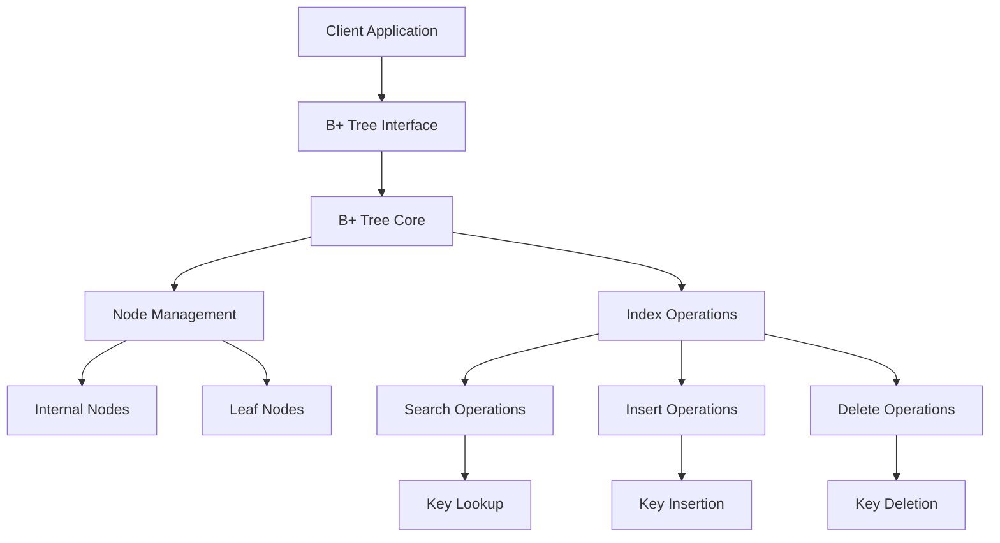

# `bplustree`

## Repository Structure

```
bplustree/
└── bplustree/
    ├── __init__.py
    ├── node.py
    ├── tree.py
    ├── iterator.py
    └── exceptions.py
```

### Directory Responsibilities

- **bplustree/**: Main package directory containing all B+ tree implementation components
  - `__init__.py`: Package initialization and public API exports
  - `node.py`: Implementation of B+ tree nodes (internal and leaf nodes)
  - `tree.py`: Main B+ tree class with insertion, deletion, and search operations
  - `iterator.py`: Iterator implementations for traversing the tree
  - `exceptions.py`: Custom exceptions for B+ tree operations

## Purpose

This repository implements a B+ tree data structure in Python, providing an efficient indexed storage mechanism suitable for database systems, file systems, and any application requiring fast key-based lookups with ordered traversal capabilities.

B+ trees are particularly valuable because they:
- Maintain sorted order of records
- Support efficient range queries
- Provide O(log n) time complexity for search, insert, and delete operations
- Minimize disk I/O for large datasets through optimized node structure
- Allow for efficient sequential access

## Target Users

- Database engine developers needing efficient indexing structures
- File system implementers requiring ordered data storage
- Application developers requiring fast key-value storage with range queries
- Systems engineers working with large datasets requiring ordered access patterns

## Position in Ecosystem

This is a standalone Python library that can be integrated into larger systems. It serves as a foundational data structure component that can be used independently or as part of larger database or storage systems. The implementation focuses on correctness and performance while maintaining clean, readable Python code.

## Architecture



The architecture follows a layered pattern:
1. **Interface Layer**: Public API exposed to clients
2. **Core Logic Layer**: Main B+ tree operations and management
3. **Node Management Layer**: Handling of internal and leaf nodes
4. **Operation Layer**: Search, insert, and delete implementations

## Entry Points

### Importable API
```python
from bplustree import BPlusTree
from bplustree.exceptions import TreeError, KeyError
```

**Exposed Components:**
- `BPlusTree`: Main class for creating and manipulating B+ trees
- `TreeError`: Base exception for tree-related errors
- `KeyError`: Exception raised for invalid key operations

### Usage Patterns
- Direct instantiation: `tree = BPlusTree(order=5)`
- Method chaining for operations: `tree.insert(key, value)`
- Range queries: `tree.range_search(start_key, end_key)`

## Core Features

1. **Ordered Storage**: Maintains keys in sorted order for efficient range queries
   - Implemented in: `tree.py`, `node.py`

2. **Efficient Search Operations**: O(log n) lookup time
   - Implemented in: `tree.py` (search methods)

3. **Dynamic Insertion**: Automatically balances tree structure during insertions
   - Implemented in: `tree.py` (insert methods)

4. **Dynamic Deletion**: Maintains tree properties during key removal
   - Implemented in: `tree.py` (delete methods)

5. **Range Queries**: Efficient retrieval of key ranges
   - Implemented in: `tree.py` (range_search methods)

6. **Iterator Support**: Sequential traversal of stored keys
   - Implemented in: `iterator.py`

7. **Customizable Order**: Adjustable branching factor for performance tuning
   - Implemented in: `tree.py` constructor

## Dependencies

This repository has no external dependencies beyond standard Python libraries. All implementation is contained within pure Python code.

## Configuration

No configuration files or environment variables are required. The tree behavior can be customized through constructor parameters:
- `order`: Controls the maximum number of children per node (default: 5)
- `key_type`: Specifies the data type for keys (default: comparable objects)

## Extension Points

1. **Custom Comparators**: Subclassing can allow custom key comparison logic
2. **Node Types**: Extending node implementations for specialized storage needs
3. **Storage Backends**: Integration with external storage mechanisms
4. **Memory Management**: Custom allocation strategies for node creation

