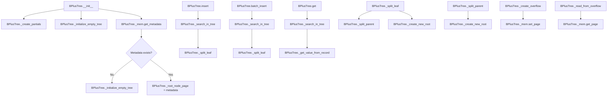

# `tree.py`

## `bplustree.tree.BPlusTree` · *class*

## Summary:
A B+ tree data structure for efficient key-value storage with file persistence and overflow handling for large values.

## Description:
The BPlusTree class implements a B+ tree data structure that stores key-value pairs in a persistent manner using file-based storage. It supports efficient insertion, retrieval, and iteration operations while automatically managing overflow pages for values that exceed the configured value size limit. The tree maintains balance through automatic splitting operations during insertions.

This class serves as the main interface for interacting with a B+ tree database, providing dictionary-like semantics with additional features like batch operations, slicing support, and transactional integrity. The batch_insert method is specifically designed for inserting multiple key-value pairs efficiently by reducing tree search overhead and managing node splits effectively.

## State:
- `_filename` (str): Path to the underlying file storage
- `_tree_conf` (TreeConf): Configuration object containing page size, order, key size, value size, and serializer
- `_mem` (FileMemory): Memory manager for file-based storage operations
- `_root_node_page` (int): Page number of the root node
- `_is_open` (bool): Flag indicating whether the tree is currently open for operations
- `LonelyRootNode`, `RootNode`, `InternalNode`, `LeafNode`, `Record`, `Reference`: Partially applied node and entry classes configured with tree configuration

## Lifecycle:
- Creation: Instantiate with filename and optional configuration parameters
- Usage: Call methods like insert(), get(), batch_insert(), etc. within context manager or with explicit open/close
- Destruction: Automatically closes when exiting context manager or calling close() method

## Method Map:


## Raises:
- ValueError: When attempting to insert non-bytes values, inserting duplicate keys without replacement, or when keys in batch_insert are not properly sorted
- ValueError: When iterating with custom step or backwards slice
- ValueError: When batch_insert receives keys that are not greater than the largest key currently in the tree

## Example:
```python
# Create a new B+ tree
tree = BPlusTree('my_tree.db', page_size=4096, order=100)

# Insert data
tree.insert(1, b'value1')
tree.insert(2, b'value2')

# Retrieve data
value = tree.get(1)  # Returns b'value1'
value = tree[2]      # Returns b'value2'

# Batch insert
tree.batch_insert([(3, b'value3'), (4, b'value4')])

# Iterate over keys
for key in tree:
    print(key)

# Check existence
if 1 in tree:
    print("Key exists")

# Close the tree
tree.close()
```

### `bplustree.tree.BPlusTree.__init__` · *method*

## Summary:
Initializes a B+ tree instance by setting up configuration, memory management, and loading or creating the tree structure from persistent storage.

## Description:
This constructor method initializes a B+ tree data structure by configuring its parameters, establishing memory management, and either loading an existing tree structure from disk or creating a new empty tree. The method handles the complete initialization lifecycle, ensuring the tree is ready for operations.

The initialization process involves:
1. Setting up tree configuration parameters
2. Creating partial functions for node and entry construction
3. Establishing memory management with file-backed storage
4. Loading existing metadata or initializing a new tree structure
5. Marking the tree as open for operations

This logic is separated into its own method to encapsulate the complex initialization process and ensure proper setup before the tree can be used for operations.

## Args:
    filename (str): Path to the file where the B+ tree data will be stored
    page_size (int): Size of each page in bytes, defaults to 4096
    order (int): Maximum number of children for internal nodes, defaults to 100
    key_size (int): Size of keys in bytes, defaults to 8
    value_size (int): Size of values in bytes, defaults to 32
    cache_size (int): Number of pages to cache in memory, defaults to 64
    serializer (Optional[Serializer]): Serializer for keys and values, defaults to IntSerializer()

## Returns:
    None

## Raises:
    ValueError: When metadata cannot be loaded from persistent storage during initialization

## State Changes:
    Attributes READ: None
    Attributes WRITTEN: 
        - self._filename: Stores the file path
        - self._tree_conf: Stores tree configuration parameters
        - self._mem: Stores memory management instance
        - self._root_node_page: Stores root node page reference
        - self._is_open: Sets tree state to open

## Constraints:
    Preconditions:
        - The filename parameter must be a valid path string
        - Page size, order, key_size, and value_size must be positive integers
        - Cache size must be a non-negative integer
    Postconditions:
        - The B+ tree instance is fully configured and ready for operations
        - Either an existing tree structure is loaded or a new empty tree is initialized
        - The tree is marked as open for read/write operations

## Side Effects:
    - Creates or opens a file for persistent storage
    - May allocate new pages in the memory system
    - Reads from or writes to persistent storage during metadata operations
    - Initializes memory caching subsystem

### `bplustree.tree.BPlusTree.close` · *method*

## Summary:
Closes the underlying memory connection and marks the tree as closed.

## Description:
This method safely closes the BPlusTree's memory connection by releasing resources and updating the internal state. It ensures that any pending writes are committed before closing and prevents further operations on the tree.

## Args:
    None

## Returns:
    None

## Raises:
    None explicitly raised

## State Changes:
    Attributes READ: self._mem, self._is_open
    Attributes WRITTEN: self._is_open

## Constraints:
    Preconditions: The method can be called regardless of the current open/closed state
    Postconditions: The tree's memory connection is closed and _is_open is set to False

## Side Effects:
    I/O operations: Closes the underlying file memory connection
    Resource cleanup: Releases file handles and other system resources

### `bplustree.tree.BPlusTree.__enter__` · *method*

## Summary:
Returns the BPlusTree instance to enable context manager usage with the 'with' statement.

## Description:
This method implements the context manager protocol, allowing the BPlusTree to be used in Python's 'with' statement. When entering the context, the method returns the BPlusTree instance itself, making it available for use within the 'with' block. This enables automatic resource management where the tree will be properly closed when exiting the context.

## Args:
    None

## Returns:
    BPlusTree: The BPlusTree instance itself, enabling 'with tree:' syntax.

## Raises:
    None

## State Changes:
    Attributes READ: None
    Attributes WRITTEN: None

## Constraints:
    Preconditions: The BPlusTree instance must be properly initialized.
    Postconditions: The returned instance is identical to the original self reference.

## Side Effects:
    None

### `bplustree.tree.BPlusTree.__exit__` · *method*

## Summary:
Closes the B+ tree database connection and releases associated resources when exiting a context manager.

## Description:
This method implements the context manager protocol's `__exit__` magic method, automatically closing the B+ tree database when exiting a `with` statement block. It ensures proper cleanup of file handles and memory resources by delegating to the `close()` method. The exception parameters are accepted as required by the context manager protocol but are not used in this implementation.

## Args:
    exc_type (type or None): Exception type if an exception was raised in the with block, otherwise None
    exc_val (Exception or None): Exception value if an exception was raised in the with block, otherwise None  
    exc_tb (traceback or None): Exception traceback if an exception was raised in the with block, otherwise None

## Returns:
    None: This method does not return any value

## Raises:
    None: This method does not explicitly raise exceptions, though underlying I/O operations may raise exceptions

## State Changes:
    Attributes READ: self._is_open, self._mem
    Attributes WRITTEN: self._is_open (set to False), self._mem (closed)

## Constraints:
    Preconditions: The B+ tree instance must be initialized and accessible
    Postconditions: The tree's memory connection is closed and the `_is_open` flag is set to False

## Side Effects:
    I/O operations: Closes the underlying file connection via `self._mem.close()`
    Resource cleanup: Releases file handles and memory resources associated with the tree

### `bplustree.tree.BPlusTree.checkpoint` · *method*

## Summary:
Executes a database checkpoint operation within a write transaction to ensure data consistency.

## Description:
This method performs a checkpoint operation by acquiring a write transaction and calling the underlying memory manager's checkpoint method with the reopen_wal parameter set to True. The checkpoint operation flushes dirty pages to persistent storage and updates the database's consistent state.

This method is separated from other operations to provide explicit control over database maintenance activities. It follows the same transaction pattern as other write operations in the B+ tree (like insert and close) but serves a distinct maintenance purpose.

Known callers:
- Database maintenance routines that require explicit checkpointing
- Application shutdown procedures that want to ensure data persistence
- Manual checkpoint operations initiated by users or system administrators

## Args:
    None: This method takes no arguments beyond the implicit self parameter.

## Returns:
    None: This method does not return a value.

## Raises:
    Exception: May raise exceptions propagated from the underlying FileMemory's perform_checkpoint method or write_transaction context manager.

## State Changes:
    Attributes READ: 
    - self._mem (FileMemory instance used for storage operations)

    Attributes WRITTEN:
    - self._mem (through perform_checkpoint operation which may modify storage state)

## Constraints:
    Preconditions:
    - The B+ tree must be in an open state
    - The underlying FileMemory must be properly initialized
    - The method should be called in a context where database consistency is desired

    Postconditions:
    - The checkpoint operation completes within the write transaction context
    - The underlying memory manager's checkpoint logic is executed with reopen_wal=True

## Side Effects:
    - Transaction management via self._mem.write_transaction context manager
    - Potential disk I/O operations through the FileMemory interface
    - Updates to persistent storage state through the checkpoint process

### `bplustree.tree.BPlusTree.insert` · *method*

## Summary:
Inserts a key-value pair into the B+ tree, creating a new record or replacing an existing one based on the replace flag.

## Description:
This method adds a key-value pair to the B+ tree structure. It first validates that the value is a bytes object, then searches for the appropriate leaf node where the key should be inserted. If the key already exists and replace=False, it raises a ValueError. If replace=True or the key doesn't exist, it creates a new record and inserts it into the leaf node. Large values that exceed the configured value size are stored across multiple overflow pages. When a leaf node becomes full, it automatically splits to maintain tree balance.

Known callers:
- `BPlusTree.__setitem__()` - Called when using bracket notation for assignment (e.g., tree[key] = value)
- `BPlusTree.batch_insert()` - Called during batch operations to insert individual records

This logic is separated into its own method to encapsulate the complete insertion workflow including validation, searching, record creation, overflow handling, and node splitting, making the calling methods cleaner and ensuring consistent insertion behavior.

## Args:
    key (any): The key to insert into the tree
    value (bytes): The value to associate with the key, must be a bytes object
    replace (bool): If True, replaces existing values for the same key; if False, raises ValueError for duplicates

## Returns:
    None: This method does not return a value.

## Raises:
    ValueError: When replace=False and the key already exists in the tree, or when value is not a bytes object

## State Changes:
    Attributes READ: 
    - self._mem (FileMemory instance for node access)
    - self._tree_conf (Tree configuration including value_size)
    - self._root_node (current root node of the tree)
    
    Attributes WRITTEN:
    - self._mem (through set_node calls to persist modified nodes)
    - self._root_node_page (potentially updated when creating new root)

## Constraints:
    Preconditions:
    - The value parameter must be a bytes object
    - The tree must be in an open state
    - The key must be comparable with existing keys in the tree
    
    Postconditions:
    - The key-value pair is stored in the tree structure
    - If replace=True, existing key-value pair is replaced
    - If value exceeds configured size, overflow pages are created and linked
    - Tree maintains structural integrity and balance through node splitting when needed

## Side Effects:
    - Disk/memory I/O through self._mem operations for node access and persistence
    - Potential creation of overflow pages for large values
    - Node splitting operations that may create new pages and update parent references
    - Memory allocation for new nodes when splitting occurs

### `bplustree.tree.BPlusTree.batch_insert` · *method*

## Summary:
Inserts multiple key-value pairs into the B+ tree in a single batch operation, optimizing for performance by reducing tree search overhead and managing node splits efficiently.

## Description:
This method performs batch insertion of key-value pairs into the B+ tree structure. It's designed to be more efficient than individual insertions by minimizing redundant tree searches and managing node splits strategically. The method processes key-value pairs sequentially, maintaining a reference to the current leaf node to avoid repeated searches for subsequent keys that belong to the same leaf. Keys must be provided in sorted order, and each key must be greater than any existing keys in the tree to maintain the tree's ordering invariant.

The method handles both small values that fit within the configured value size and large values that require overflow page chains. When a leaf node becomes full, it automatically splits the node and updates the tree structure accordingly.

Known callers:
- Direct API usage by client code that wants to insert many records efficiently
- Potentially used internally by higher-level batch operations or bulk import functions

This logic is separated into its own method rather than being inlined because it provides significant performance benefits through reduced tree traversal overhead and proper batch processing semantics. It also encapsulates the complex logic of maintaining node references, validating key ordering, and handling node splitting in a controlled transaction context.

## Args:
    iterable (Iterable): An iterable of (key, value) tuples where key is comparable and value is bytes

## Returns:
    None: This method does not return a value

## Raises:
    ValueError: When keys are not sorted in ascending order or when a key is less than or equal to the largest key currently in the tree

## State Changes:
    Attributes READ: 
    - self._mem (FileMemory instance for accessing nodes and metadata)
    - self._root_node (current root node of the tree)
    - self._tree_conf (configuration parameters including value_size)
    - node.biggest_entry (accessing the largest entry in a node)
    
    Attributes WRITTEN:
    - self._mem (through set_node calls to persist modified nodes)
    - self._root_node_page (potentially updated when creating new root during splits)

## Constraints:
    Preconditions:
    - The iterable must contain key-value pairs where keys are comparable and values are bytes
    - Keys in the iterable must be sorted in ascending order
    - Each key in the iterable must be greater than all existing keys in the tree
    - The tree must be in an open state
    - Values must be bytes type
    
    Postconditions:
    - All key-value pairs from the iterable are inserted into the tree
    - The tree maintains its structural invariants (ordering, capacity limits)
    - Node splits occur appropriately when leaf nodes become full
    - The tree's metadata remains consistent

## Side Effects:
    - Disk/memory I/O through self._mem operations (get_node, set_node, get_page, set_page)
    - Transaction management via self._mem.write_transaction context manager
    - Potential node splitting operations that modify tree structure
    - Memory page allocation for overflow pages when values exceed value_size limit
    - Updates to persistent storage state

### `bplustree.tree.BPlusTree.get` · *method*

## Summary:
Retrieves the byte value associated with a given key from the B+ tree, returning a default value if the key is not found.

## Description:
This method performs a key lookup operation in the B+ tree structure by traversing the tree to find the leaf node containing the specified key. It then extracts the associated value from the record found at that location. If the key does not exist in the tree, it returns the provided default value instead of raising an exception.

The method is called during key retrieval operations and is part of the standard dictionary-like interface for the B+ tree. It uses a read transaction to ensure consistency during the lookup process.

Known callers:
- `BPlusTree.__getitem__()` - Called when using bracket notation to retrieve values (e.g., tree[key])
- `BPlusTree.__contains__()` - Called during membership testing operations
- `BPlusTree.items()` - Called when iterating over key-value pairs
- `BPlusTree.values()` - Called when iterating over values only

This logic is separated into its own method to provide a clean, reusable interface for key lookups while maintaining proper transaction management and error handling.

## Args:
    key (any): The key to search for in the tree
    default (bytes, optional): The value to return if the key is not found. Defaults to None

## Returns:
    bytes: The byte value associated with the key if found, otherwise the default value. When the key is not found and default is None, this method returns None.

## Raises:
    None explicitly raised

## State Changes:
    Attributes READ: 
    - self._mem (FileMemory instance for accessing nodes)
    - self._root_node (property that accesses the root node)
    
    Attributes WRITTEN:
    - None

## Constraints:
    Preconditions:
    - The key must be comparable with existing keys in the tree
    - The tree must be open and accessible
    - The key must be of a type compatible with the tree's key ordering
    
    Postconditions:
    - Returns either the value bytes for the key or the default value
    - The method does not modify the tree structure
    - When a key is found, the returned value is always a bytes object
    - When a key is not found, the returned value is either the provided default or None

## Side Effects:
    - Reads from disk/memory through self._mem.read_transaction and self._mem.get_node() calls
    - May cause memory cache misses when loading nodes from storage
    - Uses read transaction to ensure consistency during lookup

### `bplustree.tree.BPlusTree.__contains__` · *method*

## Summary:
Checks whether a key exists in the BPlusTree structure.

## Description:
Implements the Python `__contains__` special method, enabling the use of the `in` operator to test key existence. This method performs a read-only lookup operation to determine if a given key is present in the tree without retrieving its associated value.

## Args:
    item: The key to search for in the tree. Type is dependent on the tree's configuration and serializer.

## Returns:
    bool: True if the key exists in the tree, False otherwise.

## Raises:
    None explicitly raised. May propagate exceptions from underlying storage operations.

## State Changes:
    Attributes READ: 
    - self._mem: Used for accessing the read transaction and storage operations
    - self._root_node: Accessed indirectly through the search mechanism

## Constraints:
    Preconditions:
    - The tree must be open (self._is_open must be True)
    - The key type must be compatible with the tree's configured serializer
    
    Postconditions:
    - The tree remains unchanged (read-only operation)
    - The method returns immediately without modifying any state

## Side Effects:
    - Acquires a read transaction from self._mem
    - Performs read operations on the underlying storage system
    - May trigger page loading from disk if pages are not cached

### `bplustree.tree.BPlusTree.__setitem__` · *method*

## Summary:
Sets a key-value pair in the B+ tree, replacing any existing value for the key.

## Description:
This method implements the Python magic method `__setitem__` to enable dictionary-style assignment syntax (`tree[key] = value`) for storing key-value pairs in the B+ tree. It delegates to the `insert` method with `replace=True`, ensuring that if a key already exists, its value will be updated rather than raising an error. This provides standard dictionary-like behavior for the B+ tree data structure.

## Args:
    key: The key to store in the tree
    value: The value to associate with the key (must be bytes)

## Returns:
    None

## Raises:
    ValueError: If the value parameter is not a bytes object (this occurs when the underlying insert method validates the value type)

## State Changes:
    Attributes READ: None
    Attributes WRITTEN: None

## Constraints:
    Preconditions: The tree must be open and accessible
    Postconditions: The key-value pair is stored in the tree, replacing any existing value for the key

## Side Effects:
    I/O operations: Writes to the underlying storage via the memory manager's write transaction
    Database mutation: Modifies the tree structure and data pages in persistent storage

### `bplustree.tree.BPlusTree.__getitem__` · *method*

## Summary:
Retrieves values from the B+ tree using dictionary-style key access or slice-based range queries.

## Description:
Enables dictionary-style access to the B+ tree with support for both single key lookup and range queries using slice notation. When a slice is provided, it returns a dictionary mapping keys to values within the specified range. When a single key is provided, it returns the associated value or raises KeyError if not found.

This method encapsulates the core retrieval logic for the B+ tree, providing a clean interface for accessing stored data while handling both simple and complex query patterns.

## Args:
    item (Union[bytes, slice]): Either a single key for lookup or a slice object defining a range of keys to retrieve.

## Returns:
    Union[bytes, dict[bytes, bytes]]: For single keys, returns the associated value as bytes. For slices, returns a dictionary mapping keys to values within the specified range.

## Raises:
    KeyError: When attempting to access a non-existent key with single-key access.
    ValueError: When a slice contains invalid parameters (step not None or backward iteration) - raised by internal _iter_slice method.

## State Changes:
    Attributes READ: 
        - self._mem (FileMemory instance)
        - self._root_node (property accessing root node)
    Attributes WRITTEN: None

## Constraints:
    Preconditions:
        - The tree must be open (self._is_open = True)
        - The key or slice parameters must be properly formatted for the tree's configuration
    Postconditions:
        - For single key access: returns bytes value or raises KeyError
        - For slice access: returns dict with all matching records

## Side Effects:
    - Acquires a read transaction from self._mem
    - Reads from disk via self._mem.get_node() and self._mem.get_page() operations
    - May trigger node traversal during key lookup via self._search_in_tree()

### `bplustree.tree.BPlusTree.__len__` · *method*

## Summary:
Returns the total number of record entries stored in the B+ tree by traversing all leaf nodes from the leftmost record node.

## Description:
This method provides an efficient way to determine the size of the B+ tree by counting all record entries across all leaf nodes. It starts from the leftmost record node (obtained via the `_left_record_node` property) and follows the `next_page` links through all leaf nodes in the tree, summing up the entry counts from each node.

The method is designed as a separate method rather than being inlined because:
1. It encapsulates the tree traversal logic for counting entries
2. It provides a standard interface that matches Python's `__len__` protocol
3. It ensures thread-safe access through the read transaction mechanism
4. It abstracts away the complexity of navigating the linked leaf node structure

## Args:
    None

## Returns:
    int: The total count of record entries across all leaf nodes in the tree

## Raises:
    None explicitly raised

## State Changes:
    Attributes READ: 
    - `self._mem.read_transaction`: Used for thread-safe access
    - `self._left_record_node`: Accessed to get starting node for traversal
    - `node.entries`: Accessed to get entry count from each node
    - `node.next_page`: Checked to determine if traversal should continue
    
    Attributes WRITTEN: None

## Constraints:
    Preconditions:
    - The tree must be open (`self._is_open` must be True)
    - All nodes referenced in the traversal must exist in memory
    - The tree structure must be valid (properly linked leaf nodes)
    
    Postconditions:
    - The method returns an integer representing the total number of entries
    - The tree state remains unchanged
    - No modifications are made to any nodes or metadata

## Side Effects:
    - Reads from disk/memory through the `FileMemory` abstraction
    - Uses read transaction for thread safety
    - May trigger disk I/O when retrieving nodes that aren't cached

### `bplustree.tree.BPlusTree.__length_hint__` · *method*

## Summary:
Returns an estimated length hint for the BPlusTree, providing an upper bound on the number of records in the tree.

## Description:
This method provides a hint about the expected number of elements in the tree, which is used by Python's iterator protocol and other functions that work with iterators. The estimation is based on memory page utilization and node characteristics rather than counting actual records.

The method handles two cases:
1. When the tree has a LonelyRootNode (empty or nearly empty tree), it returns half the maximum children capacity
2. For normal trees, it estimates based on memory page usage and average records per leaf node

This method is part of Python's iterator protocol and helps optimize operations that work with iterators over the tree.

## Args:
    None

## Returns:
    int: An estimated upper bound on the number of records in the tree

## Raises:
    None explicitly raised

## State Changes:
    Attributes READ: 
    - self._mem (for last_page property)
    - self._root_node (for type checking and accessing max_children/min_children)
    - self._mem.read_transaction (context manager usage)

## Constraints:
    Preconditions:
    - The tree must be open (self._is_open should be True)
    - The tree must have valid metadata and root node
    - Memory transaction must be available
    
    Postconditions:
    - The returned value is an upper bound estimate, not an exact count
    - The method does not modify any tree state

## Side Effects:
    - Acquires a read transaction from self._mem
    - Reads from memory pages via self._mem.get_node() and self._mem.last_page
    - No modifications to persistent storage

### `bplustree.tree.BPlusTree.__iter__` · *method*

## Summary:
Returns an iterator over the keys stored in the B+ tree in sorted order.

## Description:
This method provides iteration over all keys in the B+ tree, allowing clients to traverse the entire dataset in sorted order. When called with a slice parameter, it allows for partial iteration over a range of keys. The method operates within a read transaction to ensure consistency during iteration.

## Args:
    slice_ (Optional[slice]): A slice object defining the range of keys to iterate over. If None, iterates over all keys. Defaults to None.

## Returns:
    Iterator: An iterator yielding the keys stored in the B+ tree in sorted order.

## Raises:
    None explicitly raised by this method.

## State Changes:
    Attributes READ: 
        - self._mem: The memory manager used for database operations
        - self._iter_slice: The internal method used to perform the actual iteration logic
    
    Attributes WRITTEN: None

## Constraints:
    Preconditions:
        - The B+ tree must be properly initialized
        - The underlying memory manager (_mem) must be accessible
        - The tree must not be in an inconsistent state
    
    Postconditions:
        - The iteration maintains sorted order of keys
        - Each key is yielded exactly once during the iteration
        - The method does not modify the tree structure

## Side Effects:
    - Acquires a read transaction from the memory manager
    - May perform disk I/O operations when accessing nodes in the tree structure

### `bplustree.tree.BPlusTree.items` · *method*

## Summary:
Returns an iterator of key-value pairs from the B+ tree, optionally filtered by a key range slice.

## Description:
This method provides a way to iterate over all key-value pairs in the B+ tree or a subset defined by a slice range. It uses a read transaction to ensure consistency during iteration and leverages internal helper methods to traverse the tree structure efficiently.

The method is commonly called by higher-level interfaces such as `__getitem__` when processing slice-based lookups, and it's also used directly by users who want to iterate over tree contents. It's designed to be memory-efficient by yielding results one at a time rather than loading everything into memory.

## Args:
    slice_ (Optional[slice]): A slice object defining the key range to iterate over. If None, all key-value pairs in the tree are returned. The slice defines start (inclusive) and stop (exclusive) bounds for key filtering.

## Returns:
    Iterator[tuple]: An iterator yielding tuples of (key, value) pairs, where key is the record key and value is the associated byte data.

## Raises:
    ValueError: When the slice has a non-None step value (custom step not supported) or when start >= stop (backward iteration not supported).

## State Changes:
    Attributes READ: 
        - self._mem
        - self._iter_slice
        - self._get_value_from_record
    
    Attributes WRITTEN: None

## Constraints:
    Preconditions:
        - The B+ tree must be open (self._is_open = True)
        - The slice object must be valid (no custom step, start <= stop when both defined)
        - All internal node structures must be properly initialized
    
    Postconditions:
        - The method returns an iterator that yields key-value pairs in ascending key order
        - If no slice is provided, all records are returned
        - If a slice is provided, only records with keys in the range [slice_.start, slice_.stop) are returned

## Side Effects:
    - Reads from disk/memory through self._mem.read_transaction context manager
    - May trigger disk I/O when accessing pages not in memory cache
    - No external service calls or mutations to objects outside self

### `bplustree.tree.BPlusTree.__bool__` · *method*

## Summary:
Returns whether the B+ tree contains any elements, determining its truthiness.

## Description:
Implements the Python magic method `__bool__` to determine if the B+ tree is empty or not. When evaluated in a boolean context (like `if tree:`), this method returns True if the tree contains at least one element, and False if it is empty. The method uses a read transaction to safely check for the presence of elements without modifying the tree structure. It performs minimal iteration - stopping as soon as the first element is found - to efficiently determine truthiness.

## Args:
    None

## Returns:
    bool: True if the tree contains at least one element, False if the tree is empty.

## Raises:
    None explicitly raised

## State Changes:
    Attributes READ: 
    - self._mem: Used to access the read transaction
    - self: Used in iteration context (__iter__ method is called)

## Constraints:
    Preconditions:
    - The tree object must be properly initialized
    - The underlying memory system (`self._mem`) must be accessible
    
    Postconditions:
    - The method does not modify the tree's contents
    - The method maintains consistency with the tree's actual state
    - The method returns immediately upon finding the first element

## Side Effects:
    - Acquires a read transaction from the memory manager
    - Performs minimal iteration over the tree's elements
    - May perform I/O operations through the memory manager during iteration
    - Does not mutate any tree data

### `bplustree.tree.BPlusTree.__repr__` · *method*

## Summary:
Returns a string representation of the BPlusTree object showing its filename and configuration.

## Description:
This method provides a human-readable representation of the BPlusTree instance, displaying the associated filename and tree configuration. It is typically called by Python's built-in repr() function when inspecting the object or when printing it directly. The representation follows the format '<BPlusTree: {filename} {tree_conf}>' where filename is the path to the underlying storage file and tree_conf contains structural parameters of the tree such as page size, order, key size, and value size.

## Args:
    None

## Returns:
    str: A formatted string in the pattern '<BPlusTree: {filename} {tree_conf}>' where filename is the storage file path and tree_conf represents the tree configuration parameters.

## Raises:
    None

## State Changes:
    Attributes READ: self._filename, self._tree_conf
    Attributes WRITTEN: None

## Constraints:
    Preconditions: The BPlusTree instance must have been initialized with valid _filename and _tree_conf attributes
    Postconditions: The method returns a string representation without modifying the tree state

## Side Effects:
    None

### `bplustree.tree.BPlusTree._initialize_empty_tree` · *method*

## Summary:
Initializes an empty B+ tree by creating a lonely root node and setting up initial metadata.

## Description:
This private method initializes an empty B+ tree structure during the tree creation process. It is called when no existing metadata is found in storage, typically during the first initialization of a new B+ tree. The method allocates a new page for the root node, creates a lonely root node instance, and stores the initial metadata. In B+ tree terminology, a "lonely root" is a special node type that represents the root of an empty tree before any data insertion occurs.

## Args:
    None

## Returns:
    None

## Raises:
    None explicitly raised

## State Changes:
    Attributes READ: 
        - self._mem (FileMemory instance)
        - self._tree_conf (TreeConf instance)
    Attributes WRITTEN:
        - self._root_node_page (sets the page number for the root node)

## Constraints:
    Preconditions:
        - The B+ tree instance must be in an uninitialized state
        - The underlying memory system must be available and ready
        - No existing metadata should be present in the storage
    Postconditions:
        - A new root node page is allocated and assigned to self._root_node_page
        - A lonely root node is created and stored in memory
        - Initial metadata is written to persistent storage

## Side Effects:
    - Writes to persistent storage via self._mem.write_transaction
    - Allocates a new page in the memory system through self._mem.next_available_page
    - Modifies the underlying file storage through FileMemory operations

### `bplustree.tree.BPlusTree._create_partials` · *method*

## Summary:
Creates partial functions for node and entry classes pre-bound with the tree configuration, enabling clean instantiation throughout the BPlusTree lifecycle.

## Description:
This method initializes factory functions for node and entry classes by creating partial applications of their constructors with the tree configuration. It's called during BPlusTree initialization to set up reusable class factories that eliminate the need to repeatedly pass the tree configuration when creating nodes and entries.

The separation into its own method improves code organization by keeping initialization logic clean and making the dependency injection pattern explicit. These partial functions are used throughout the tree's operations for creating new nodes and entries with proper configuration.

## Args:
    None

## Returns:
    None

## Raises:
    None

## State Changes:
    Attributes READ: self._tree_conf
    Attributes WRITTEN: self.LonelyRootNode, self.RootNode, self.InternalNode, self.LeafNode, self.Record, self.Reference

## Constraints:
    Preconditions: The method assumes self._tree_conf is properly initialized before calling
    Postconditions: All six partial functions (LonelyRootNode, RootNode, InternalNode, LeafNode, Record, Reference) are created and bound to self._tree_conf

## Side Effects:
    None

### `bplustree.tree.BPlusTree._root_node` · *method*

## Summary:
Returns the root node of the B+ tree, retrieving it from memory using the stored root node page reference.

## Description:
This property provides access to the root node of the B+ tree structure. It retrieves the node from persistent storage via the memory manager using the stored page reference. The method ensures type safety by asserting that the returned node is either a `LonelyRootNode` or `RootNode`.

Known callers:
- `_search_in_tree`: Used to traverse the tree structure during search operations
- `_left_record_node`: Accesses the root node to find the leftmost leaf node
- `__length_hint__`: Uses the root node to estimate tree size
- `__iter__`: Accesses the root node to begin iteration
- `_iter_slice`: Uses the root node to iterate over a slice of records

This logic is encapsulated in its own property because:
1. It provides a clean abstraction for accessing the root node
2. It centralizes the logic for retrieving and validating the root node type
3. It allows for future modifications to root node retrieval without changing callers
4. It maintains consistency with the pattern of using properties for computed/accessed values

## Returns:
Union['LonelyRootNode', 'RootNode']: The root node of the B+ tree, which can be either a lonely root node (initial state) or a regular root node.

## State Changes:
Attributes READ: 
- self._mem: Memory manager for retrieving nodes from storage
- self._root_node_page: Page reference to the root node in storage

Attributes WRITTEN: None

## Constraints:
Preconditions:
- The B+ tree must be initialized and opened (self._is_open should be True)
- The root node page reference must be valid and point to an existing node
- The memory manager must be properly initialized

Postconditions:
- The returned node is guaranteed to be either a `LonelyRootNode` or `RootNode`
- The returned node is retrieved from persistent storage and cached appropriately by the memory manager

## Side Effects:
- I/O operations: Reads from persistent storage via the memory manager
- Memory management: May trigger caching or eviction policies in the memory manager

### `bplustree.tree.BPlusTree._left_record_node` · *method*

## Summary:
Returns the leftmost record node (either LeafNode or LonelyRootNode) in the B+ tree by traversing from the root node.

## Description:
This method performs a traversal down the leftmost path of the B+ tree structure, following the smallest entry's before reference until reaching a leaf node or lonely root node. This is useful for finding the first record in the tree for operations like iteration or finding minimum values.

## Args:
    None

## Returns:
    Union[LonelyRootNode, LeafNode]: The leftmost node containing records in the tree structure.

## Raises:
    None explicitly raised

## State Changes:
    Attributes READ: 
        - self._root_node
        - node.smallest_entry.before (accessed via property)
    Attributes WRITTEN: 
        - None

## Constraints:
    Preconditions:
        - self._root_node must be initialized
        - The tree structure must be valid (no cycles)
    Postconditions:
        - Returns either a LeafNode or LonelyRootNode instance
        - The returned node contains the leftmost record in the tree

## Side Effects:
    - Accesses memory through self._mem.get_node() to retrieve nodes
    - May cause disk I/O if nodes are loaded from storage

### `bplustree.tree.BPlusTree._iter_slice` · *method*

## Summary:
Iterates over records in the B+ tree within the specified key range defined by a slice object.

## Description:
This private method implements the core logic for iterating through records in a B+ tree according to a slice specification. It handles range-based queries by navigating through leaf nodes and yielding records whose keys fall within the slice bounds. The method is used internally by public methods like `__getitem__`, `__iter__`, `items`, and `values` when they receive slice arguments.

## Args:
    slice_ (slice): A slice object defining the key range to iterate over. The slice must have start and stop values that define the inclusive lower bound and exclusive upper bound of keys to include.

## Returns:
    Iterator[Record]: An iterator over Record objects whose keys fall within the specified slice range.

## Raises:
    ValueError: When the slice has a non-None step value (custom step not supported) or when start >= stop (backward iteration not supported).

## State Changes:
    Attributes READ: 
        - self._left_record_node
        - self._root_node
        - self._mem
    
    Attributes WRITTEN: None

## Constraints:
    Preconditions:
        - The B+ tree must be open (self._is_open = True)
        - The slice object must be valid (no custom step, start <= stop when both defined)
        - All internal node structures must be properly initialized
    
    Postconditions:
        - The method will yield records in ascending key order
        - Records yielded will have keys satisfying: start <= key < stop (when start and stop are not None)
        - The method will raise StopIteration when reaching the end of available records

## Side Effects:
    - Reads from disk/memory through self._mem.get_node() calls
    - May trigger disk I/O when accessing pages not in memory cache

### `bplustree.tree.BPlusTree._search_in_tree` · *method*

## Summary:
Recursively searches a B+ tree structure to locate the leaf node containing the specified key.

## Description:
This private method implements the core tree traversal logic for B+ tree operations. It recursively navigates through internal nodes to find the appropriate leaf node where a given key would be stored or where a search should terminate. The method handles special cases for boundary keys and uses pairwise comparison of entries to determine the correct child node path.

Known callers:
- `BPlusTree.insert()` - Called during insertion to find the leaf node where a new record should be added
- `BPlusTree.batch_insert()` - Called during batch insertion to find leaf nodes for records
- `BPlusTree.get()` - Called during key lookup to find the leaf node containing the requested key
- `BPlusTree._iter_slice()` - Called during range iteration to find starting leaf nodes

This logic is separated into its own method to encapsulate the complex tree traversal algorithm, making the calling methods cleaner and more readable while ensuring consistent navigation behavior throughout the tree operations.

## Args:
    key (any): The key value to search for in the tree
    node (Node): The current node being examined during traversal

## Returns:
    Node: Either a LeafNode or LonelyRootNode where the key would be located or inserted

## Raises:
    AssertionError: When no valid page reference is found during traversal, indicating a structural inconsistency in the tree

## State Changes:
    Attributes READ: 
    - self._mem (FileMemory instance for accessing nodes)
    - node.smallest_key
    - node.biggest_key
    - node.smallest_entry
    - node.biggest_entry
    - node.entries
    
    Attributes WRITTEN:
    - child_node.parent (sets parent relationship for child node)

## Constraints:
    Preconditions:
    - The node parameter must be a valid node in the tree structure
    - The tree must maintain valid structural invariants (key ordering, proper references)
    - The key parameter must be comparable with node key values
    
    Postconditions:
    - Returns either a LeafNode or LonelyRootNode (terminal nodes)
    - The returned node contains or would contain the specified key
    - Parent-child relationships are properly maintained in the tree structure

## Side Effects:
    - Reads from disk/memory through self._mem.get_node() calls
    - Modifies node parent references during traversal
    - May cause memory cache misses when loading child nodes from storage

### `bplustree.tree.BPlusTree._split_leaf` · *method*

## Summary:
Splits a leaf node when it becomes full, creating a new sibling leaf node and updating parent references accordingly.

## Description:
This method handles the splitting of leaf nodes in a B+ tree when they exceed their capacity. When a leaf node needs to accommodate more entries than allowed by its configuration, it splits into two nodes. The method creates a new leaf node containing half of the original node's entries, updates the parent node with appropriate references, and ensures proper linking between the split nodes. This method is called internally by the tree's insertion logic when a leaf node reaches capacity.

The method has special handling for LonelyRootNode instances, converting them to regular leaf nodes and creating a new root when necessary. For regular leaf nodes, it either inserts the new reference directly into the parent if space allows, or recursively splits the parent node if it's full.

## Args:
    old_node (Node): The leaf node that needs to be split. Must be a LeafNode or LonelyRootNode instance.

## Returns:
    None: This method does not return a value.

## Raises:
    None explicitly raised: Based on the implementation, no exceptions are explicitly caught or raised by this method.

## State Changes:
    Attributes READ: 
    - self._mem (FileMemory instance)
    - old_node.parent (parent node reference)
    - parent.can_add_entry (parent node capacity check)
    
    Attributes WRITTEN:
    - self._mem (updates both old_node and new_node in memory)
    - self._root_node_page (potentially updated when creating new root via _create_new_root)

## Constraints:
    Preconditions:
    - The old_node parameter must be a valid Node instance (LeafNode or LonelyRootNode)
    - The old_node must be full (at maximum capacity)
    - The tree's memory manager must have available pages
    - Parent node must exist and be properly linked
    
    Postconditions:
    - The old_node contains half of its original entries
    - A new leaf node is created with the remaining entries
    - Both nodes are persisted in memory
    - Parent node is updated with appropriate references
    - The old_node's next_page pointer is updated to point to the new node
    - If splitting a lonely root, a new root node is created and tree's root reference is updated

## Side Effects:
    - Memory allocation: Calls self._mem.next_available_page to get a new page for the new node
    - Memory persistence: Calls self._mem.set_node() twice to store both nodes
    - Potential root node creation: May call self._create_new_root() if splitting a lonely root
    - Recursive operation: May call self._split_parent() if parent node also needs splitting
    - Node conversion: May convert LonelyRootNode to LeafNode when splitting

### `bplustree.tree.BPlusTree._split_parent` · *method*

## Summary:
Splits a parent node when a child node exceeds capacity, redistributing entries and potentially creating a new root node.

## Description:
This method handles the propagation of node splitting upward in the B+ tree structure. When a leaf or internal node becomes full and needs to split, this method is called to manage the parent node's response. It creates a new sibling node with a portion of the entries, establishes proper reference links between the nodes, and either updates the parent directly or recursively splits the parent if it's also full.

The method is called during insertion operations when node capacity limits are exceeded, ensuring the tree maintains its balanced structure. It's designed as a recursive helper method to handle cascading splits up the tree hierarchy.

## Args:
    old_node (Node): The node that has become full and requires splitting. Must be a valid Node instance that supports split_entries() and pop_smallest() methods.

## Returns:
    None: This method does not return a value.

## Raises:
    None explicitly raised: Based on the implementation, no exceptions are explicitly caught or raised, though underlying memory operations or node operations might raise exceptions.

## State Changes:
    Attributes READ:
    - self._mem (FileMemory instance)
    - self.InternalNode (class constructor)
    - old_node.parent (parent node reference)
    - old_node.page (page number of the old node)
    - old_node.entries (entries in the old node)
    - parent.can_add_entry (boolean indicating if parent can accept more entries)
    
    Attributes WRITTEN:
    - self._mem (through set_node calls)
    - old_node.entries (modified during split_entries)
    - new_node.entries (set with split entries)
    - ref.before (set to old_node.page)
    - ref.after (set to new_node.page)
    - parent.entries (modified during insert_entry)

## Constraints:
    Preconditions:
    - The old_node must be a valid Node instance with entries that can be split
    - The old_node must have a parent node (except for root nodes)
    - The old_node must support split_entries() and pop_smallest() methods
    - The memory manager must have available pages
    
    Postconditions:
    - The old_node is modified to contain only a subset of its original entries
    - A new sibling node is created with the remaining entries
    - Proper reference links are established between the nodes
    - The parent node is updated with a reference to the new sibling
    - If the root node is split, a new root is created
    - All modified nodes are persisted to memory

## Side Effects:
    - Memory allocation: Calls self._mem.next_available_page to get a new page for the new node
    - Memory persistence: Calls self._mem.set_node() twice to persist both old and new nodes
    - Recursive calls: May call itself recursively if parent node also needs splitting
    - Tree structure modification: Changes the tree hierarchy by splitting nodes and updating references

### `bplustree.tree.BPlusTree._create_new_root` · *method*

## Summary:
Creates a new root node for the B+ tree by initializing it with a reference and updating the tree's root page reference.

## Description:
This method is invoked when the B+ tree needs to expand upward, typically during insertion operations when the current root node becomes full and requires splitting. It creates a new root node, inserts the provided reference into it, updates the tree's root page reference, and persists the new root node to memory. This method encapsulates the logic for root node creation and initialization, separating it from the main insertion logic for clarity and reusability.

## Args:
    reference (Reference): The reference to insert into the newly created root node.

## Returns:
    None: This method does not return a value.

## Raises:
    None explicitly raised: Based on the implementation, no exceptions are explicitly caught or raised.

## State Changes:
    Attributes READ: 
    - self._mem (FileMemory instance)
    - self._tree_conf (TreeConf instance)
    - self.RootNode (class constructor)
    
    Attributes WRITTEN:
    - self._root_node_page (updated to the new root node's page number)

## Constraints:
    Preconditions:
    - The method assumes that the tree currently has a root node that needs to be replaced
    - The provided reference must be a valid Reference object
    - The memory manager must have available pages
    
    Postconditions:
    - A new root node is created and stored in memory
    - The tree's root node page reference is updated
    - The new root node contains the provided reference
    - Metadata for the new root node is set in memory

## Side Effects:
    - Memory allocation: Calls self._mem.next_available_page to get a new page
    - Memory persistence: Calls self._mem.set_metadata() and self._mem.set_node() to store the new root
    - Updates internal state: Modifies self._root_node_page

### `bplustree.tree.BPlusTree._create_overflow` · *method*

## Summary:
Creates a chain of overflow pages to store a large bytes value that exceeds the standard page size limit.

## Description:
This internal helper method handles storage of large values by splitting them into chunks that fit within page boundaries and creating a linked chain of overflow pages. It is automatically invoked by the tree insertion logic when a value exceeds the configured maximum value size (`self._tree_conf.value_size`). Each overflow page contains a portion of the original value, with the last page marked by a zero reference to terminate the chain.

## Args:
    value (bytes): The large bytes value to be stored across multiple pages

## Returns:
    int: The page number of the first overflow page in the chain

## Raises:
    None explicitly raised - depends on underlying memory operations

## State Changes:
    Attributes READ: 
        - self._tree_conf (for page_size, etc.)
        - self._mem (for next_available_page)
    
    Attributes WRITTEN:
        - self._mem (through set_page calls to initialize overflow pages)

## Constraints:
    Preconditions:
        - The input value must be bytes type
        - The value must exceed the configured page size limits (typically > self._tree_conf.value_size)
        - The tree must be in an open state with available memory pages
    
    Postconditions:
        - All overflow pages are properly initialized with correct linkage
        - The returned page number points to the first page in the overflow chain
        - The overflow chain is properly terminated with a zero reference
        - Each page in the chain contains the appropriate payload and metadata

## Side Effects:
    - Writes to disk/memory pages through self._mem.set_page()
    - Consumes memory pages from the available page pool
    - Modifies the persistent storage state of the B+ tree

### `bplustree.tree.BPlusTree._read_from_overflow` · *method*

## Summary:
Reads and reconstructs a byte sequence that was split across multiple overflow pages in the B+ tree storage structure.

## Description:
This private method reconstructs a large byte value that was stored across multiple overflow pages when it exceeded the capacity of a single leaf node page. It follows the linked list chain of overflow pages starting from the first page reference, collecting payload data from each page until reaching the end marker (next page reference of 0).

The method is called by `_get_value_from_record` when a record contains an overflow page reference instead of inline data. This design allows storing arbitrarily large values while maintaining efficient indexing operations.

## Args:
    first_overflow_page (int): The page number of the first overflow page containing the beginning of the data sequence.

## Returns:
    bytes: The complete reconstructed byte sequence that was originally stored as overflow data.

## Raises:
    None explicitly raised, but may propagate exceptions from `self._mem.get_page()` if invalid page numbers are encountered.

## State Changes:
    Attributes READ: 
        - self._mem: Used to access the underlying memory manager for page retrieval
    
    Attributes WRITTEN: None

## Constraints:
    Preconditions:
        - The `first_overflow_page` must be a valid page number in the file system
        - All pages in the overflow chain must exist and be properly formatted according to the B+ tree overflow page structure
        - The overflow chain must be properly terminated with a next page reference of 0
        
    Postconditions:
        - Returns a complete byte sequence matching the original data that was split across overflow pages
        - The method does not modify any internal state of the B+ tree

## Side Effects:
    - Performs I/O operations through `self._mem.get_page()` to read multiple pages from disk
    - May cause page cache misses if pages are not already loaded into memory

### `bplustree.tree.BPlusTree._get_value_from_record` · *method*

## Summary:
Retrieves the complete byte value from a record, handling both inline values and overflow page storage.

## Description:
This method extracts the full value associated with a record, checking if the value is stored directly in the record or needs to be reconstructed from overflow pages. It serves as a utility for accessing record values consistently regardless of their storage mechanism.

The method is called during tree traversal operations when retrieving values for keys, particularly in the `get`, `__getitem__`, `items`, and `values` methods of the BPlusTree class. It ensures that large values stored across multiple overflow pages are properly reconstructed into a single byte string.

## Args:
    record (Record): A record object containing either a direct value or an overflow page reference

## Returns:
    bytes: The complete byte value associated with the record

## Raises:
    None explicitly raised

## State Changes:
    Attributes READ: record.value, record.overflow_page
    Attributes WRITTEN: None

## Constraints:
    Preconditions: 
    - The record parameter must be a valid Record instance
    - If record.value is None, then record.overflow_page must be a valid page reference
    - The overflow page data must be accessible through self._mem.get_page() if accessed
    
    Postconditions:
    - Returns a bytes object representing the complete value
    - If record.value is not None, returns record.value directly
    - If record.value is None, reconstructs and returns the full value from overflow pages

## Side Effects:
    I/O operations: Calls self._mem.get_page() to retrieve overflow page data
    External service calls: None
    Mutations to objects outside self: None

