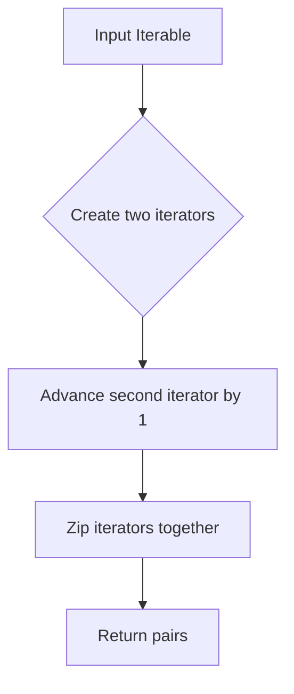

# `utils.py`

## `bplustree.utils.pairwise` · *function*

## Summary:
Returns consecutive pairs of elements from an iterable.

## Description:
Creates pairs of adjacent elements from the input iterable. This utility function is commonly used when processing sequences where you need to examine neighboring elements together, such as comparing adjacent items, calculating differences, or implementing sliding window operations.

## Args:
    iterable (Iterable): An iterable object containing elements to be paired consecutively.

## Returns:
    zip object: An iterator that yields tuples of consecutive pairs (element_i, element_{i+1}).

## Raises:
    None

## Constraints:
    Preconditions:
        - Input must be an iterable object
        - Empty iterables will produce empty results
        - Single-element iterables will produce empty results
    
    Postconditions:
        - Output contains pairs of consecutive elements
        - Number of pairs returned equals len(iterable) - 1
        - If iterable has fewer than 2 elements, no pairs are returned

## Side Effects:
    None

## Control Flow:


## Examples:
```python
# Basic usage
list(pairwise([1, 2, 3, 4]))  # [(1, 2), (2, 3), (3, 4)]

# Empty iterable
list(pairwise([]))  # []

# Single element
list(pairwise([1]))  # []

# String iteration
list(pairwise("abc"))  # [('a', 'b'), ('b', 'c')]
```

## `bplustree.utils.iter_slice` · *function*

## Summary:
Chunks a bytes iterable into fixed-size segments and indicates whether each segment is the final one.

## Description:
This function divides a bytes object into contiguous slices of specified size, yielding each slice along with a boolean flag indicating if it's the last chunk. It's designed for processing large binary data streams in fixed-size portions.

## Args:
    iterable (bytes): The bytes object to be chunked into segments.
    n (int): The size of each chunk in bytes. Should be positive, though behavior with zero/negative values is undefined.

## Returns:
    Generator[tuple[bytes, bool], None, None]: A generator that yields tuples of:
        - The chunk of bytes (slice of the original iterable)
        - Boolean flag indicating if this is the last chunk (True when start >= final_offset)

## Raises:
    None explicitly raised, but may raise IndexError if n <= 0 due to slicing behavior.

## Constraints:
    Preconditions:
        - iterable must be a bytes object
        - n should be a positive integer for predictable behavior
    Postconditions:
        - All chunks except possibly the last will have exactly n bytes
        - The last chunk may have fewer bytes if the total length isn't divisible by n
        - Each yielded chunk is a slice of the original iterable

## Side Effects:
    None

## Control Flow:
```mermaid
flowchart TD
    A[Start] --> B{start >= final_offset?}
    B -- Yes --> C[Break]
    B -- No --> D[rv = iterable[start:stop]]
    D --> E[start = stop]
    E --> F[stop = start + n]
    F --> G[Yield (rv, start >= final_offset)]
    G --> H[Loop back to B]
```

## Examples:
    >>> list(iter_slice(b'hello world', 3))
    [(b'hel', False), (b'lo ', False), (b'wor', False), (b'ld', True)]
    
    >>> list(iter_slice(b'abc', 2))
    [(b'ab', False), (b'c', True)]
    
    >>> list(iter_slice(b'', 5))
    []
    
    >>> # Processing large binary data in chunks
    ... data = b'x' * 1000
    ... for chunk, is_last in iter_slice(data, 256):
    ...     print(f"Processing {len(chunk)} bytes, is_last={is_last}")

