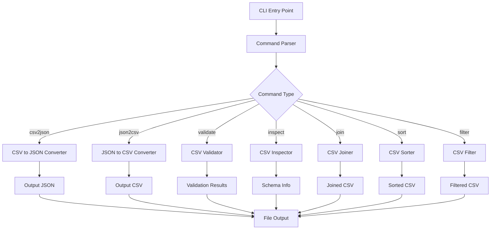

# `csvkit`

## Repository Overview

### Tree Structure
```
csvkit/
├── csvkit/
│   ├── __init__.py
│   ├── cli.py
│   ├── csv2json.py
│   ├── json2csv.py
│   ├── validate.py
│   ├── inspect.py
│   ├── join.py
│   ├── sort.py
│   ├── filter.py
│   └── utils.py
├── tests/
├── setup.py
├── README.md
└── requirements.txt
```

### Purpose
csvkit is a command-line toolkit for working with CSV (Comma-Separated Values) files. It provides utilities for converting, filtering, joining, and analyzing CSV data from the command line or programmatically. The tool addresses the need for efficient CSV manipulation without requiring full data science libraries or complex scripting.

Target users include data analysts, scientists, and developers who need to quickly process CSV files from the command line or integrate CSV processing into scripts. Common scenarios include data cleaning, format conversion, data validation, and basic data analysis tasks.

In the broader ecosystem, csvkit serves as a lightweight, standalone command-line tool that complements other data processing tools and can be integrated into data pipelines or shell workflows.

### Architecture


Key architectural patterns include:
- Command-line interface pattern with subcommands
- Pipeline processing for data transformation
- Plugin-like architecture for different CSV operations
- Modular design separating parsing, processing, and output logic

### Entry Points
1. **CLI Commands**: `csvcut`, `csvstat`, `csvjoin`, `csvsort`, `csvgrep`, `csv2json`, `json2csv`
   - Exposes CSV processing capabilities via command-line interface
   - Requires CSV file paths and optional parameters
   - Target audience: Command-line users, automation scripts

2. **Importable APIs**: Programmatic access to core CSV processing functions
   - Target audience: Developers integrating CSV processing into applications

### Core Features
1. **CSV to JSON Conversion**: Converts CSV files to JSON format
   - Implemented in `csv2json.py` module

2. **JSON to CSV Conversion**: Converts JSON files to CSV format  
   - Implemented in `json2csv.py` module

3. **CSV Validation**: Checks CSV file integrity and format compliance
   - Implemented in `validate.py` module

4. **CSV Inspection**: Analyzes CSV structure and content characteristics
   - Implemented in `inspect.py` module

5. **CSV Joining**: Combines multiple CSV files based on common columns
   - Implemented in `join.py` module

6. **CSV Sorting**: Sorts CSV data by specified columns
   - Implemented in `sort.py` module

7. **CSV Filtering**: Filters CSV rows based on conditions
   - Implemented in `filter.py` module

### Dependencies
- **Python 3.6+**: Required runtime environment
- **agate**: Data analysis library for advanced CSV operations
- **argparse**: Command-line argument parsing
- **six**: Python 2/3 compatibility library
- **openpyxl**: Excel file support (optional dependency)

### Extension Points
- **Custom Commands**: Implement new command classes inheriting from base command interface
- **Plugins**: Extend functionality through plugin architecture for additional CSV formats
- **Hooks**: Pre/post-processing hooks for custom data transformations
- **Subclassing**: Extend existing processors to add custom validation or formatting rules

