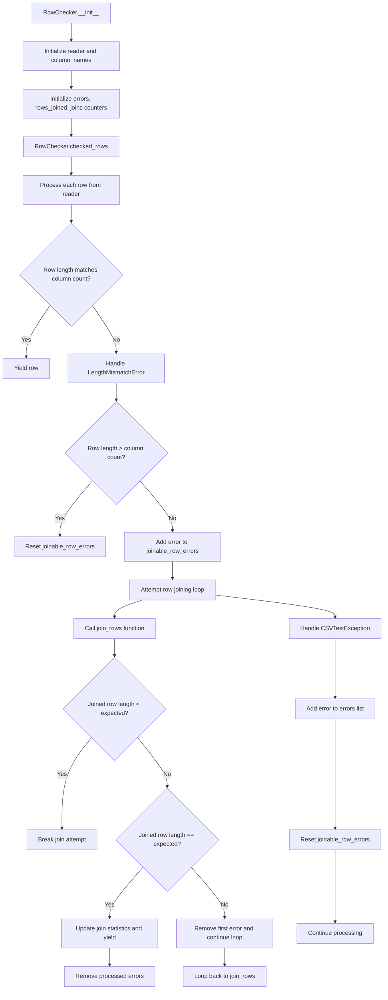

# `cleanup.py`

## `csvkit.cleanup.join_rows` · *function*

## Summary:
Combines multiple rows into a single row by appending subsequent rows' elements to the previous row's last element.

## Description:
Joins multiple CSV rows together by concatenating the first element of each subsequent row to the last element of the previous row, using a specified delimiter. This function is commonly used to handle multi-line CSV records that were split across multiple rows.

## Args:
    rows (iterable): An iterable of row data, where each row is a list-like object containing string elements.
    joiner (str): String used to join elements between rows. Defaults to a single space character (' ').

## Returns:
    list: A single combined row where elements from subsequent rows are appended to the previous row's last element, followed by the remaining elements from those rows.

## Raises:
    None explicitly raised in the function body.

## Constraints:
    Precondition: The input `rows` must be iterable and contain at least one row.
    Postcondition: The returned list will contain all elements from the input rows, with appropriate joining applied.

## Side Effects:
    None.

## Control Flow:
```mermaid
flowchart TD
    A[Start join_rows] --> B{rows is empty?}
    B -- Yes --> C[Return empty list]
    B -- No --> D[Convert rows to list]
    D --> E[Copy first row to fixed_row]
    E --> F[Iterate over rows[1:]]
    F --> G{Current row length == 0?}
    G -- Yes --> H[Set row = ['']]
    G -- No --> I[Continue processing]
    H --> I
    I --> J[Append joiner + row[0] to fixed_row[-1]]
    J --> K[Extend fixed_row with row[1:]]
    K --> L[Next row?]
    L -- Yes --> F
    L -- No --> M[Return fixed_row]
```

## Examples:
    >>> join_rows([['a', 'b'], ['c', 'd']])
    ['a b', 'c', 'd']
    
    >>> join_rows([['hello'], ['world']], joiner=' ')
    ['hello world']
    
    >>> join_rows([['a', 'b'], [], ['c', 'd']])
    ['a b', '', 'c', 'd']

## `csvkit.cleanup.RowChecker` · *class*

## Summary:
A CSV row validator and cleaner that checks for column count mismatches and attempts to join incomplete rows to form complete records.

## Description:
The RowChecker class is responsible for validating CSV rows against a header row's expected column count and attempting to repair rows that have fewer columns than expected by joining them with subsequent rows. It's particularly useful for handling CSV files where records may span multiple lines due to embedded newlines or other formatting issues.

This class is typically instantiated by CSV processing utilities that need to validate and clean CSV data before further processing. It serves as a bridge between raw CSV parsing and structured data consumption, ensuring data integrity while being tolerant of certain formatting irregularities.

## State:
- reader: A CSV reader object that provides access to the CSV data stream
- column_names: A list containing the header row values, or an empty list if the CSV is empty
- errors: A list of CSVTestException objects that accumulate validation errors encountered during processing
- rows_joined: An integer counting the total number of rows that were successfully joined to form complete records
- joins: An integer counting the total number of join operations performed

## Lifecycle:
- Creation: Instantiate with a CSV reader object that has already processed the header row
- Usage: Call the checked_rows() generator method to iterate over validated and potentially repaired rows
- Destruction: No explicit cleanup required; relies on Python's garbage collection

## Method Map:


## Raises:
- StopIteration: Raised internally by the reader when no more rows are available (handled in __init__)
- LengthMismatchError: Raised when a row has a different number of columns than expected
- CSVTestException: Raised for other CSV validation errors during processing

## Example:
```python
import csv
from csvkit.cleanup import RowChecker

# Create a CSV reader
with open('data.csv', 'r') as f:
    reader = csv.reader(f)
    
    # Initialize RowChecker with the reader
    checker = RowChecker(reader)
    
    # Process validated rows
    for row in checker.checked_rows():
        print(row)
    
    # Check for errors
    print(f"Errors found: {len(checker.errors)}")
    print(f"Rows joined: {checker.rows_joined}")
    print(f"Join operations: {checker.joins}")
```

### `csvkit.cleanup.RowChecker.__init__` · *method*

## Summary:
Initializes a RowChecker object with a CSV reader and sets up tracking attributes for CSV validation and row joining operations.

## Description:
The RowChecker.__init__ method prepares the object for processing CSV data by storing the reader, extracting column names from the first row, and initializing tracking variables for errors and row joining statistics. This method handles the case where the CSV reader might be empty by setting column_names to an empty list.

## Args:
    reader: A CSV reader object that provides access to CSV data rows

## Returns:
    None

## Raises:
    None explicitly raised

## State Changes:
    Attributes READ: None
    Attributes WRITTEN: 
    - self.reader: Assigned the input reader parameter
    - self.column_names: Set to the first row from reader or empty list if reader is empty
    - self.errors: Initialized as an empty list to track validation errors
    - self.rows_joined: Initialized to 0 to count successfully joined rows
    - self.joins: Initialized to 0 to count total join operations performed

## Constraints:
    Preconditions:
    - The reader parameter should be a valid CSV reader object that supports iteration
    - The reader should be positioned at the beginning of the CSV data
    
    Postconditions:
    - self.reader is assigned the input reader
    - self.column_names contains the first row of data or an empty list if reader is empty
    - All tracking attributes (errors, rows_joined, joins) are initialized to appropriate starting values

## Side Effects:
    None

### `csvkit.cleanup.RowChecker.checked_rows` · *method*

## Summary:
Generates validated CSV rows while attempting to fix length-mismatch errors by joining adjacent rows.

## Description:
Processes rows from a CSV reader, validating each row's column count against expected column names. When a row has too few columns, it accumulates the error and attempts to join it with subsequent rows to form a complete record. This method serves as a robust CSV row validator that handles multi-line records gracefully.

This method is designed as a separate generator to encapsulate the complex validation and row-joining logic, allowing consumers to iterate through clean, properly formatted rows without dealing with the intricacies of error recovery.

## Args:
    None

## Returns:
    Generator yielding list[str]: Validated CSV rows with proper column counts, potentially joined from multiple input rows.

## Raises:
    LengthMismatchError: When a row has a different number of columns than expected, with detailed context about the mismatch.
    CSVTestException: When other CSV validation errors occur during processing.

## State Changes:
    Attributes READ: self.column_names, self.reader, self.errors, self.rows_joined, self.joins
    Attributes WRITTEN: self.errors, self.rows_joined, self.joins

## Constraints:
    Preconditions: 
    - self.column_names must be initialized with column header data
    - self.reader must be a valid CSV reader iterator
    - self.errors, self.rows_joined, self.joins must be initialized as mutable objects
    
    Postconditions:
    - All yielded rows will have exactly len(self.column_names) columns
    - Error tracking is maintained in self.errors
    - Join statistics are updated in self.rows_joined and self.joins

## Side Effects:
    - Modifies self.errors by appending new error instances
    - Updates self.rows_joined and self.joins counters when row joining occurs
    - Reads from self.reader advancing its position
    - May perform string operations during row joining via join_rows function

