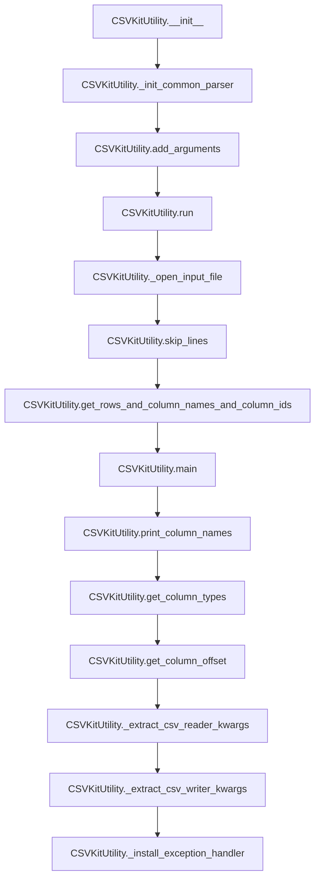

# `cli.py`

## `csvkit.cli.LazyFile` · *class*

## Summary:
A lazy file wrapper that delays file opening until the first operation is performed.

## Description:
The LazyFile class provides a lazy initialization pattern for file-like objects. Instead of opening the file immediately upon instantiation, it waits until the first method call to actually open the file. This is useful for avoiding unnecessary file operations when a file might not be accessed, or when dealing with potentially problematic files that shouldn't be opened until absolutely necessary.

This class is commonly used in command-line tools where file handling needs to be deferred until processing begins, particularly in CSV processing utilities where files might be large or could fail to open.

## State:
- init: callable, the function used to create the file object (e.g., built-in open() function)
- f: file-like object or None, the actual file handle once opened, initially None
- _is_lazy_opened: bool, tracks whether the file has been opened yet, starts as False
- _lazy_args: tuple, positional arguments to pass to init when opening the file
- _lazy_kwargs: dict, keyword arguments to pass to init when opening the file

## Lifecycle:
- Creation: Instantiate with a callable (like built-in open) and any arguments needed to create the file object
- Usage: Methods like read(), write(), readline(), etc. will automatically open the file on first call
- Destruction: Call close() method to explicitly close the file, or rely on garbage collection

## Method Map:
```mermaid
graph TD
    A[LazyFile.__init__] --> B{__getattr__ or __next__}
    B --> C[_open]
    C --> D[init(*_lazy_args, *_lazy_kwargs)]
    D --> E[f = file_object]
    E --> F{Method calls}
    F --> G[getattr(f, name)]
```

## Raises:
- None explicitly raised by __init__
- Exceptions may be raised by the underlying file operations when _open() is called

## Example:
```python
# Create a lazy file wrapper
lazy_file = LazyFile(open, 'data.csv', 'r')

# File is not opened yet
# Read first line (this triggers the lazy opening)
first_line = next(lazy_file)
# File is now opened and first line is read

# Continue reading
for line in lazy_file:
    process(line)

# Explicitly close when done
lazy_file.close()
```

### `csvkit.cli.LazyFile.__init__` · *method*

## Summary:
Initializes a LazyFile object with lazy file opening capabilities, storing initialization parameters for deferred execution.

## Description:
The `__init__` method sets up a LazyFile instance that defers actual file opening until the file is first accessed. This approach improves performance by avoiding unnecessary file operations when the file might not be used. The method stores the initialization function and its arguments for later execution when the file is actually needed.

## Args:
    init: A callable that creates or opens a file-like object
    *args: Positional arguments to pass to the init callable
    **kwargs: Keyword arguments to pass to the init callable

## Returns:
    None

## Raises:
    None explicitly raised

## State Changes:
    Attributes READ: None
    Attributes WRITTEN:
    - self.init: Stores the initialization callable
    - self.f: Initializes to None (file handle)
    - self._is_lazy_opened: Initializes to False (tracking open state)
    - self._lazy_args: Stores positional arguments for deferred initialization
    - self._lazy_kwargs: Stores keyword arguments for deferred initialization

## Constraints:
    Preconditions:
    - The init parameter should be a callable that returns a file-like object when invoked
    - The *args and **kwargs should be compatible with the init callable's signature
    
    Postconditions:
    - self.init contains the provided initialization callable
    - self.f is initialized to None
    - self._is_lazy_opened is initialized to False
    - self._lazy_args and self._lazy_kwargs store the provided arguments for later use

## Side Effects:
    None

### `csvkit.cli.LazyFile.__getattr__` · *method*

## Summary:
Delegates attribute access to an underlying file object after ensuring the file is opened lazily.

## Description:
This special method implements lazy file opening behavior. When an attribute is accessed on a LazyFile instance that doesn't exist directly on the wrapper, this method is invoked. It ensures the underlying file is opened via `_open()` and then delegates the attribute access to the actual file object (`self.f`).

## Args:
    name (str): The name of the attribute being accessed

## Returns:
    Any: The value of the requested attribute from the underlying file object

## Raises:
    AttributeError: When the requested attribute doesn't exist on the underlying file object

## State Changes:
    Attributes READ: self.f, self._open
    Attributes WRITTEN: None

## Constraints:
    Preconditions: The LazyFile instance must have a valid file path and `_open()` method implemented
    Postconditions: The underlying file object (`self.f`) will be initialized and accessible

## Side Effects:
    I/O: Triggers file opening operation when first accessed
    External service calls: None

### `csvkit.cli.LazyFile.__iter__` · *method*

*No documentation generated.*

### `csvkit.cli.LazyFile.close` · *method*

## Summary:
Closes a lazily opened file handle and resets the internal state to indicate the file is no longer open.

## Description:
This method safely closes the underlying file handle when a LazyFile instance has been lazily opened. It ensures proper resource cleanup by calling close() on the wrapped file object, setting the file handle to None, and marking the lazy open state as False. The method is idempotent and can be safely called even when the file has not yet been opened.

## Args:
    None

## Returns:
    None

## Raises:
    AttributeError: If the underlying file handle doesn't support close() method (though this would be unusual for file-like objects).

## State Changes:
    Attributes READ: self._is_lazy_opened, self.f
    Attributes WRITTEN: self.f, self._is_lazy_opened

## Constraints:
    Preconditions: None - the method can be called at any time
    Postconditions: If the file was open, it will be closed and self.f will be None, self._is_lazy_opened will be False

## Side Effects:
    I/O: Closes the underlying file handle, releasing system resources

### `csvkit.cli.LazyFile.__next__` · *method*

## Summary:
Returns the next line from a lazily-opened file handle after removing null characters.

## Description:
Implements the iterator protocol's `__next__` method for the LazyFile class. This method ensures that the underlying file is opened (if not already opened) and returns the next line from the file handle, with null characters stripped out. It's designed to work with the lazy file opening pattern where files are only opened when first accessed.

## Args:
    None

## Returns:
    str: The next line from the file with null characters ('\0') removed

## Raises:
    StopIteration: When the file iterator is exhausted
    Exception: Any exception that might occur during file reading or when accessing the underlying file object

## State Changes:
    Attributes READ: self._is_lazy_opened, self.f
    Attributes WRITTEN: self.f (when opened via _open), self._is_lazy_opened (when set to True)

## Constraints:
    Preconditions: The LazyFile instance must have been properly initialized with a valid file initialization function and arguments
    Postconditions: The underlying file handle (`self.f`) will be opened if not already opened, and the next line will be returned with null characters removed

## Side Effects:
    I/O: Triggers file opening operation if the file hasn't been opened yet
    External service calls: None

### `csvkit.cli.LazyFile._open` · *method*

## Summary:
Initializes and opens a lazy-loaded file handle using the stored initialization parameters.

## Description:
Implements lazy file opening behavior by creating the underlying file object only when first accessed. This method is automatically invoked by other methods like `__getattr__` and `__next__` when the file needs to be accessed but hasn't been opened yet. It ensures that the file is opened exactly once during the lifetime of the LazyFile instance.

## Args:
    None

## Returns:
    None

## Raises:
    Exception: Any exception that may occur during file initialization through the stored `init` function

## State Changes:
    Attributes READ: self._is_lazy_opened, self.init, self._lazy_args, self._lazy_kwargs
    Attributes WRITTEN: self.f, self._is_lazy_opened

## Constraints:
    Preconditions: The LazyFile instance must have been properly initialized with a valid `init` function and associated arguments
    Postconditions: The underlying file handle (`self.f`) will be created and assigned, and `_is_lazy_opened` will be set to True

## Side Effects:
    I/O: Triggers file opening operation when first called
    External service calls: None

## `csvkit.cli.CSVKitUtility` · *class*

## Summary:
Base class for CSVKit command-line utilities that provides common argument parsing, file handling, and CSV processing capabilities.

## Description:
CSVKitUtility serves as the foundation for all command-line utilities in the csvkit toolkit. It provides standardized argument parsing for common CSV processing options, automatic file handling for various compression formats, and helper methods for reading and processing CSV data. Subclasses must implement the `add_arguments()` and `main()` methods to define their specific functionality.

The class handles common CSV processing concerns such as:
- Argument parsing with standard CSV flags (delimiter, quoting, encoding, etc.)
- Automatic file opening and closing for compressed files (.gz, .bz2, .xz)
- CSV reader and writer configuration
- Column identifier parsing
- Exception handling and user-friendly error messages
- Default header generation for files without headers

## State:
- description (str): Description text for the argument parser
- epilog (str): Epilog text for the argument parser  
- override_flags (str): String of flag characters to exclude from argument parsing
- argparser (argparse.ArgumentParser): The argument parser instance
- args (argparse.Namespace): Parsed command-line arguments
- output_file (file-like object): Output destination (defaults to sys.stdout)
- reader_kwargs (dict): Configuration parameters for CSV readers
- writer_kwargs (dict): Configuration parameters for CSV writers
- input_file (file-like object): Input file handle (set during run())

## Lifecycle:
- Creation: Instantiate with optional args list and output_file parameter
- Usage: Call run() method which orchestrates the utility execution
- Destruction: Automatically closes input file when run() completes

## Method Map:


## Raises:
- NotImplementedError: Raised by add_arguments() and main() methods when not overridden by subclasses
- RequiredHeaderError: Raised by print_column_names() when --no-header-row is used with -n/--names
- ValueError: Raised by skip_lines() when skip_lines argument is not an integer

## Example:
```python
# Basic usage pattern for a subclass
class MyCSVTool(CSVKitUtility):
    def add_arguments(self):
        self.argparser.add_argument('--custom-flag', action='store_true', help='Custom option')
    
    def main(self):
        # Process CSV data using inherited methods
        rows, column_names, column_ids = self.get_rows_and_column_names_and_column_ids()
        # ... custom processing logic ...

# Usage from command line:
# python my_tool.py input.csv --custom-flag

# Programmatic usage:
tool = MyCSVTool(['input.csv', '--custom-flag'])
tool.run()
```

### `csvkit.cli.CSVKitUtility.__init__` · *method*

*No documentation generated.*

### `csvkit.cli.CSVKitUtility.add_arguments` · *method*

## Summary:
Adds custom command-line arguments to the argument parser for CSVKit utility subclasses.

## Description:
This method serves as a hook for subclasses to define their specific command-line arguments. It is called during the initialization of CSVKitUtility instances, after the common parser setup but before argument parsing occurs. Subclasses must implement this method to extend the argument parser with utility-specific options.

## Args:
    self: The CSVKitUtility instance whose argument parser will be modified.

## Returns:
    None

## Raises:
    NotImplementedError: Always raised by the base class implementation, indicating that subclasses must override this method.

## State Changes:
    Attributes READ: 
        - self.argparser: The argument parser instance being modified
    Attributes WRITTEN:
        - self.argparser: Modified to include utility-specific arguments

## Constraints:
    Preconditions:
        - The instance must have completed initialization of `self.argparser` (typically via `_init_common_parser()`)
        - The method should only be called during object initialization, not after argument parsing
    Postconditions:
        - The argument parser contains both common CSV arguments and utility-specific arguments

## Side Effects:
    None

### `csvkit.cli.CSVKitUtility.run` · *method*

## Summary:
Executes the CSV processing utility by managing input file handling, running the core logic, and ensuring proper cleanup.

## Description:
The `run` method serves as the primary execution entry point for CSVKit utilities. It manages the complete lifecycle of CSV processing operations, including input file setup, execution of the core logic (`self.main()`), and proper resource cleanup. The method handles conditional file opening based on override flags, manages warning suppression for specific agate warnings, and ensures that input files are properly closed regardless of whether execution succeeds or fails.

This method is designed to be called by the command-line interface framework and provides a standardized execution pattern for all CSVKit utilities. It separates concerns by delegating the actual CSV processing logic to the abstract `main()` method that must be implemented by subclasses.

## Args:
    self: Instance of CSVKitUtility or its subclasses

## Returns:
    None: This method does not return a value

## Raises:
    Any exceptions raised by:
    - self._open_input_file() when opening input files
    - self.main() when executing the core processing logic
    - self.input_file.close() when closing files

## State Changes:
    Attributes READ:
    - self.override_flags: Used to determine whether to open/close input file
    - self.args.input_path: Passed to _open_input_file when needed
    - self.args.no_header_row: Used to configure warning filters
    - self.args.encoding: Used by _open_input_file for file encoding

    Attributes WRITTEN:
    - self.input_file: Assigned the result of _open_input_file when needed

## Constraints:
    Preconditions:
    - self.override_flags must be properly initialized (typically set in subclass)
    - self.args must be parsed and available (typically handled by __init__)
    - If 'f' is not in override_flags, self.args.input_path must be valid or None/empty
    - self.main() must be implemented by subclasses

    Postconditions:
    - If input file was opened, it will be closed in all execution paths
    - The core processing logic defined in subclasses will be executed
    - Warning filters are appropriately applied during execution

## Side Effects:
    - Opens and potentially closes input files (sys.stdin or file handles)
    - May reconfigure sys.stdin encoding when reading from stdin
    - Calls self.main() which may perform various I/O operations
    - Applies warning filters to suppress specific agate warnings
    - May raise exceptions from underlying file operations or main logic

### `csvkit.cli.CSVKitUtility.main` · *method*

## Summary:
Abstract method that must be implemented by subclasses to define the core functionality of CSV processing utilities.

## Description:
This method serves as the entry point for implementing specific CSV processing behaviors in subclasses of CSVKitUtility. It is called by the parent class's `run()` method during the execution lifecycle. The method is intentionally left unimplemented in the base class to enforce that each utility subclass provides its own specific implementation.

## Args:
    self: Instance of a subclass of CSVKitUtility

## Returns:
    This method does not return a value as it raises NotImplementedError in the base class.

## Raises:
    NotImplementedError: Always raised by the base class implementation, indicating that subclasses must override this method with their specific functionality.

## State Changes:
    Attributes READ: None - This method does not read any instance attributes directly
    Attributes WRITTEN: None - This method does not modify any instance attributes

## Constraints:
    Preconditions: Must be called on an instance of a subclass that implements this method
    Postconditions: The method must be overridden by subclasses to provide actual functionality

## Side Effects:
    None - The base class implementation does not perform any I/O or external operations

### `csvkit.cli.CSVKitUtility._init_common_parser` · *method*

## Summary:
Initializes a common argument parser with standard CSV processing options for CSVKit utilities.

## Description:
This method constructs and configures a standard `argparse.ArgumentParser` instance with commonly used CSV processing command-line arguments. It conditionally adds arguments based on the `override_flags` attribute, allowing subclasses to customize which options are available. The parser is stored in `self.argparser` for later use in argument parsing.

## Args:
    None

## Returns:
    None

## Raises:
    None

## State Changes:
    Attributes READ: 
        - self.description: Used as the parser's description
        - self.epilog: Used as the parser's epilog  
        - self.override_flags: Used to determine which arguments to include
    Attributes WRITTEN:
        - self.argparser: Set to the newly created ArgumentParser instance

## Constraints:
    Preconditions:
        - The class instance must have `description` and `epilog` attributes defined
        - The class instance must have `override_flags` attribute defined (can be empty string)
    Postconditions:
        - `self.argparser` is set to a configured ArgumentParser instance
        - The parser contains standard CSV processing arguments based on override flags

## Side Effects:
    None

### `csvkit.cli.CSVKitUtility._open_input_file` · *method*

## Summary:
Opens and returns a file handle for CSV input, supporting stdin and compressed file formats with lazy initialization.

## Description:
This method provides a standardized way to open input files for CSV processing utilities. It handles special cases for stdin (when path is '-' or None) and supports multiple compressed file formats (.gz, .bz2, .xz) through appropriate opening functions. For regular files, it creates a LazyFile wrapper to defer actual file opening until first access.

The method is called during the setup phase of CSV processing utilities to prepare the input file handle before processing begins. It's part of the CSVKitUtility base class that provides common CLI argument handling and file management capabilities.

## Args:
    path (str, optional): Path to the input file. If None or '-', reads from stdin.
    opened (bool): Flag indicating if the file is already opened. Defaults to False.

## Returns:
    file-like object: A file handle that can be used for reading CSV data. For stdin, returns sys.stdin. For files, returns a LazyFile wrapper.

## Raises:
    None explicitly raised by this method. Exceptions may be raised by underlying file operations when LazyFile is eventually opened.

## State Changes:
    Attributes READ: self.args.encoding
    Attributes WRITTEN: None

## Constraints:
    Preconditions: 
    - self.args.encoding must be set to a valid encoding string
    - path parameter should be a string or None
    
    Postconditions:
    - Returns a valid file-like object that can be read from
    - For stdin, the encoding is reconfigured according to self.args.encoding
    - For files, returns a LazyFile wrapper that encapsulates file opening with correct parameters

## Side Effects:
    - May reconfigure sys.stdin encoding when reading from stdin
    - Creates LazyFile wrapper for non-stdin files, deferring actual file opening
    - No direct I/O operations occur until the returned file handle is actually used

### `csvkit.cli.CSVKitUtility._extract_csv_reader_kwargs` · *method*

## Summary:
Extracts CSV reader configuration parameters from command-line arguments for use with Python's csv module.

## Description:
This method processes the command-line arguments stored in `self.args` to construct a dictionary of keyword arguments suitable for configuring a CSV reader. It handles delimiter specification, quoting options, and other CSV parsing parameters. This method is called during class initialization to populate `self.reader_kwargs`.

## Args:
    None - This method operates on the instance's `self.args` attribute

## Returns:
    dict: A dictionary containing CSV reader configuration parameters including:
        - 'delimiter': Character used to separate fields (either tab or custom delimiter)
        - 'quotechar': Character used to quote fields
        - 'quoting': Quoting style constant
        - 'doublequote': Boolean indicating whether double quotes are escaped
        - 'escapechar': Character used to escape delimiters
        - 'field_size_limit': Maximum field size limit
        - 'skipinitialspace': Boolean indicating whether to ignore whitespace after delimiter
        - 'header': Boolean indicating whether the file has a header row

## Raises:
    None explicitly raised - All parameter extraction uses safe getattr operations

## State Changes:
    Attributes READ: 
        - self.args.tabs
        - self.args.delimiter
        - self.args.quotechar
        - self.args.quoting
        - self.args.doublequote
        - self.args.escapechar
        - self.args.field_size_limit
        - self.args.skipinitialspace
        - self.args.no_header_row

    Attributes WRITTEN: None

## Constraints:
    Preconditions:
        - `self.args` must be initialized (typically via argparse during class construction)
        - All referenced argument attributes must be accessible via getattr

    Postconditions:
        - Returns a dictionary with keys matching standard csv.reader constructor parameters
        - Delimiter is properly set based on either --tabs or --delimiter flags
        - Header parameter is inverted from no_header_row flag (since csv.reader expects header=True)

## Side Effects:
    None - This method performs no I/O operations or external service calls

### `csvkit.cli.CSVKitUtility._extract_csv_writer_kwargs` · *method*

## Summary:
Extracts CSV writer configuration parameters from command-line arguments for use with CSV writing utilities.

## Description:
This method processes the command-line arguments stored in `self.args` to construct a dictionary of keyword arguments suitable for configuring a CSV writer. It handles writer-specific options such as line number insertion. This method is called during class initialization to populate `self.writer_kwargs` and is part of the CSVKitUtility base class framework.

## Args:
    None - This method operates on the instance's `self.args` attribute

## Returns:
    dict: A dictionary containing CSV writer configuration parameters including:
        - 'line_numbers': Boolean flag indicating whether to insert line numbers at the beginning of each output row

## Raises:
    None explicitly raised - All parameter extraction uses safe getattr operations

## State Changes:
    Attributes READ: 
        - self.args.line_numbers

    Attributes WRITTEN: None

## Constraints:
    Preconditions:
        - `self.args` must be initialized (typically via argparse during class construction)
        - The 'line_numbers' attribute must be accessible via getattr

    Postconditions:
        - Returns a dictionary with keys matching standard CSV writer constructor parameters
        - Only includes 'line_numbers' key when the corresponding command-line flag is set

## Side Effects:
    None - This method performs no I/O operations or external service calls

### `csvkit.cli.CSVKitUtility._install_exception_handler` · *method*

## Summary:
Installs a custom exception handler that provides user-friendly error messages for common CSV processing issues.

## Description:
Configures the system's exception hook to display more informative error messages when unhandled exceptions occur during CSV processing. When verbose mode is disabled, it provides tailored feedback for encoding errors and generic exception information for other errors.

## Args:
    self: The CSVKitUtility instance containing command-line arguments

## Returns:
    None

## Raises:
    None explicitly raised

## State Changes:
    Attributes READ: self.args.encoding, self.args.verbose
    Attributes WRITTEN: sys.excepthook

## Constraints:
    Preconditions: The method assumes self.args exists and contains encoding and verbose attributes
    Postconditions: sys.excepthook is replaced with a custom handler function

## Side Effects:
    Modifies the global sys.excepthook, which affects error reporting for the entire application
    Writes to stderr for error messages

### `csvkit.cli.CSVKitUtility.get_column_types` · *method*

## Summary:
Constructs and returns an agate.TypeTester instance configured with appropriate data type inference rules based on command-line arguments.

## Description:
This method builds a type inference configuration for CSV column processing by creating various agate data type objects and organizing them into a TypeTester. The resulting tester can automatically infer column data types from CSV data based on the configured rules and command-line options.

The method considers several command-line flags such as --blanks, --null-value, --no-inference, --date-format, --datetime-format, and --locale to customize how data types are inferred and handled.

## Args:
    None - This is a method that operates on self and uses self.args attributes

## Returns:
    agate.TypeTester: An agate TypeTester instance configured with a list of data type candidates in priority order for automatic type inference

## Raises:
    None explicitly raised - The method itself doesn't raise exceptions, though underlying agate operations might

## State Changes:
    Attributes READ: 
    - self.args.blanks
    - self.args.null_values  
    - self.args.no_inference
    - self.args.locale
    - self.args.date_format
    - self.args.datetime_format

## Constraints:
    Preconditions:
    - self.args must be initialized (typically via argparse)
    - Command-line arguments must be parsed before calling this method
    
    Postconditions:
    - Returns a properly configured agate.TypeTester instance
    - The returned TypeTester can be used for automatic column type inference

## Side Effects:
    None - This method is pure and doesn't cause any I/O or external service calls

### `csvkit.cli.CSVKitUtility.get_column_offset` · *method*

## Summary:
Returns the appropriate column offset (0 or 1) based on the zero-based command-line flag setting.

## Description:
This method determines whether column indices should be treated as zero-based or one-based. It is used throughout the CSVKit utility classes to maintain consistent column referencing regardless of user preference. The method is called during column parsing operations to ensure proper indexing.

## Args:
    None

## Returns:
    int: 0 if zero-based column numbering is enabled, 1 otherwise

## Raises:
    None

## State Changes:
    Attributes READ: self.args.zero_based
    Attributes WRITTEN: None

## Constraints:
    Preconditions: The CSVKitUtility instance must have been initialized with arguments containing the 'zero_based' attribute
    Postconditions: Always returns either 0 or 1

## Side Effects:
    None

### `csvkit.cli.CSVKitUtility.skip_lines` · *method*

## Summary:
Skips a specified number of initial lines from the input file stream and returns the modified file handle.

## Description:
The `skip_lines` method advances the input file pointer by reading and discarding a specified number of lines from the beginning of the file. This functionality is primarily used to skip comment lines, copyright notices, or other non-data content that appears before the actual CSV data. The method is called internally by CSVKit utilities before processing the main CSV content.

This method is invoked by two primary consumers:
1. `get_rows_and_column_names_and_column_ids` - when preparing to read CSV rows and column names
2. `print_column_names` - when displaying column headers from the CSV file

The method is separated from inline logic to provide a reusable abstraction for file pointer manipulation and to ensure consistent handling of skipped lines across different CSV processing operations.

## Args:
    self: Instance of CSVKitUtility containing the input file and skip_lines configuration

## Returns:
    file-like object: The same input file handle with the file pointer advanced by the specified number of lines

## Raises:
    ValueError: When the skip_lines argument is not an integer type

## State Changes:
    Attributes READ:
    - self.args.skip_lines: Integer specifying number of lines to skip
    - self.input_file: File handle from which lines are read and discarded

    Attributes WRITTEN:
    - self.args.skip_lines: Decremented by 1 for each line skipped (modified in-place)

## Constraints:
    Preconditions:
    - self.args.skip_lines must be an integer value
    - self.input_file must be a file-like object with a readline() method
    - The file pointer must be seekable or readable from the current position

    Postconditions:
    - The file pointer in self.input_file will be advanced by exactly self.args.skip_lines lines
    - self.args.skip_lines will be decremented to 0 after execution
    - The returned file handle will be positioned at the start of the first data line

## Side Effects:
    - Reads from the input file stream, advancing the file pointer
    - Modifies the skip_lines attribute in-place
    - May trigger lazy file opening if the input file is a LazyFile instance

### `csvkit.cli.CSVKitUtility.get_rows_and_column_names_and_column_ids` · *method*

## Summary:
Extracts CSV rows, column names, and column IDs from input data while handling header rows, column selection, and line number processing.

## Description:
Processes CSV input data to prepare it for further analysis by extracting rows, column names, and column identifiers. This method handles various CSV configurations including files with and without header rows, column selection filters, and line number insertion. It serves as a foundational utility for CSV processing operations that need to parse and validate column references.

The method is designed to be reusable across different CSV processing utilities in the csvkit framework. It encapsulates the logic for:
1. Reading CSV data with proper line skipping
2. Handling header row detection and processing
3. Generating default column names when no headers are present
4. Parsing column identifier specifications into usable indices
5. Managing line number column insertion offsets

## Args:
    **kwargs: Additional keyword arguments passed to agate.csv.reader() for CSV parsing configuration

## Returns:
    tuple: A tuple containing:
        - rows (iterator): An iterator over CSV rows
        - column_names (list[str]): List of column names from the header row or generated defaults
        - column_ids (list[int]): List of 0-based column indices matching the requested column identifiers

## Raises:
    None explicitly raised - though underlying operations may raise exceptions from agate.csv.reader or parse_column_identifiers

## State Changes:
    Attributes READ: 
    - self.args.no_header_row
    - self.args.columns
    - self.args.not_columns
    - self.args.zero_based
    - self.args.skip_lines
    - self.input_file
    
    Attributes WRITTEN: 
    - self.args.skip_lines (decremented during skip_lines() call)

## Constraints:
    Preconditions:
    - self.args must contain required attributes: no_header_row, columns, not_columns, zero_based, skip_lines
    - self.input_file must be properly initialized and opened
    - self.args.skip_lines must be an integer
    
    Postconditions:
    - Returns valid column_ids that are within bounds of column_names
    - If input is empty, returns empty iterators/lists
    - Column names are properly generated or extracted from input

## Side Effects:
    - Reads from self.input_file (file I/O)
    - Modifies self.args.skip_lines during skip_lines() execution
    - May read from stdin if input is piped

### `csvkit.cli.CSVKitUtility.print_column_names` · *method*

## Summary:
Displays column names from a CSV file with numbered indices, respecting header row and zero-based indexing settings.

## Description:
This method extracts the first row of a CSV file as column names and writes them to the output file with sequential numbering. It enforces mutual exclusivity between the --no-header-row and -n/--names command-line options, and supports both 1-based (default) and 0-based numbering through the --zero flag.

## Args:
    None - operates on instance attributes

## Returns:
    None - writes formatted output directly to self.output_file

## Raises:
    RequiredHeaderError: When the --no-header-row command-line option is used in combination with -n or --names

## State Changes:
    Attributes READ: self.args (for no_header_row and zero_based flags), self.output_file, self.reader_kwargs
    Attributes WRITTEN: None

## Constraints:
    Preconditions: 
    - self.args must contain 'no_header_row' and 'zero_based' attributes
    - self.input_file must be initialized and readable
    - self.output_file must be writable
    - CSV file must contain at least one row (column headers)
    
    Postconditions:
    - Column names are written to self.output_file in format "XXX: column_name"
    - Method does not modify any instance state beyond output operations

## Side Effects:
    - Writes formatted text to self.output_file (typically stdout)
    - Reads from self.input_file (CSV file)
    - Calls self.skip_lines() to skip initial lines as configured
    - Uses agate.csv.reader to parse CSV data

### `csvkit.cli.CSVKitUtility.additional_input_expected` · *method*

## Summary:
Determines whether the utility should expect additional input from stdin based on terminal connection and input path specification.

## Description:
Checks if stdin is connected to a terminal device and no input file path was provided, indicating that the utility should wait for interactive input from the user. This method is used to control input behavior in command-line utilities that can accept either piped data, file input, or interactive terminal input.

## Args:
    self: The CSVKitUtility instance containing command-line arguments and state.

## Returns:
    bool: True if stdin is connected to a terminal (indicating interactive mode) and no input path was specified, False otherwise.

## Raises:
    None: This method does not raise exceptions directly.

## State Changes:
    Attributes READ: 
        - self.args.input_path: Command-line argument specifying input file path
    Attributes WRITTEN: None

## Constraints:
    Preconditions:
        - self.args must be properly initialized (after argument parsing)
        - sys.stdin must be available and accessible
    
    Postconditions:
        - Returns a boolean value indicating expected input source
        - Does not modify any instance state

## Side Effects:
    None: This method only reads from sys.stdin and self.args, performing no I/O operations or state modifications beyond reading these values.

## `csvkit.cli.isatty` · *function*

## Summary:
Determines whether a file-like object is connected to a terminal device, safely handling closed file scenarios.

## Description:
Provides a robust way to check if a file handle refers to a terminal (TTY) device. This function wraps the standard `isatty()` method with exception handling to gracefully manage cases where the file has been closed.

## Args:
    f (file-like object): A file-like object that supports the `isatty()` method.

## Returns:
    bool: True if the file is connected to a terminal device, False otherwise. Returns False when the file is closed or when an I/O error occurs.

## Raises:
    None: This function catches and handles ValueError exceptions internally.

## Constraints:
    Preconditions:
        - The input parameter `f` must be a file-like object that implements the `isatty()` method
        - The file object should be in a valid state (open or closed)
    
    Postconditions:
        - Always returns a boolean value
        - Never raises an exception to the caller

## Side Effects:
    None: This function performs no I/O operations or state modifications beyond calling methods on the input file object.

## Control Flow:
```mermaid
flowchart TD
    A[Call isatty(f)] --> B{f.isatty() callable?}
    B -- Yes --> C{f.isatty() returns?}
    C -- Yes --> D[Return True]
    C -- No --> E[Return False]
    B -- No --> F{ValueError caught?}
    F -- Yes --> G[Return False]
    F -- No --> H[Raise exception]
```

## Examples:
    # Check if stdout is connected to a terminal
    if isatty(sys.stdout):
        print("Outputting to terminal")
    else:
        print("Outputting to file or pipe")

    # Safe check on potentially closed file
    try:
        with open('test.txt', 'r') as f:
            is_terminal = isatty(f)
        # Even if f was closed, this won't raise an exception
    except Exception:
        pass
```

## `csvkit.cli.default_str_decimal` · *function*

## Summary:
Converts datetime and decimal objects to JSON-serializable string representations.

## Description:
A custom JSON serializer function that handles conversion of datetime and decimal objects to string formats suitable for JSON serialization. This function is designed to be used as the `default` parameter in JSON serialization methods like `json.dumps()`.

## Args:
    obj (object): The object to serialize. Expected to be either a datetime.date, datetime.datetime, or decimal.Decimal instance.

## Returns:
    str: ISO format string representation of datetime objects, or string representation of decimal objects.

## Raises:
    TypeError: When the input object is not a datetime.date, datetime.datetime, or decimal.Decimal instance.

## Constraints:
    Precondition: The input object must be one of the supported types (datetime.date, datetime.datetime, or decimal.Decimal).
    Postcondition: If successful, returns a string representation that can be serialized to JSON.

## Side Effects:
    None

## Control Flow:
```mermaid
flowchart TD
    A[Input object] --> B{Is datetime.date or datetime.datetime?}
    B -- Yes --> C[Return obj.isoformat()]
    B -- No --> D{Is decimal.Decimal?}
    D -- Yes --> E[Return str(obj)]
    D -- No --> F[Raise TypeError]
```

## Examples:
```python
import json
import datetime
import decimal

# Valid usage
dt = datetime.datetime(2023, 1, 1, 12, 0, 0)
result = default_str_decimal(dt)  # Returns "2023-01-01T12:00:00"

dec = decimal.Decimal('123.45')
result = default_str_decimal(dec)  # Returns "123.45"

# Error case
try:
    default_str_decimal([1, 2, 3])
except TypeError as e:
    print(e)  # Prints: '[1, 2, 3] is not JSON serializable'
```

## `csvkit.cli.default_float_decimal` · *function*

## Summary:
Converts decimal.Decimal objects to float while delegating other types to string serialization for JSON compatibility.

## Description:
A custom JSON serialization function that converts decimal.Decimal objects to float values for better numeric handling in JSON output, while preserving the behavior of default_str_decimal for other object types. This function serves as a bridge between decimal precision and JSON-compatible numeric types.

## Args:
    obj (object): The object to convert for JSON serialization. Can be any type, but specifically handles decimal.Decimal objects.

## Returns:
    float or str or other: Returns a float if the input is a decimal.Decimal, otherwise delegates to default_str_decimal for processing.

## Raises:
    TypeError: When the input object is not a datetime.date, datetime.datetime, or decimal.Decimal instance (when delegated to default_str_decimal).

## Constraints:
    Precondition: The input object can be any type, but the function expects default_str_decimal to handle unsupported types properly.
    Postcondition: If input is decimal.Decimal, returns a float representation; otherwise returns result from default_str_decimal.

## Side Effects:
    None

## Control Flow:
```mermaid
flowchart TD
    A[Input object] --> B{Is decimal.Decimal?}
    B -- Yes --> C[Return float(obj)]
    B -- No --> D[Return default_str_decimal(obj)]
```

## Examples:
```python
import json
import decimal

# Convert decimal to float
dec = decimal.Decimal('123.45')
result = default_float_decimal(dec)  # Returns 123.45 (float)

# Delegate to default_str_decimal for other types
import datetime
dt = datetime.datetime(2023, 1, 1, 12, 0, 0)
result = default_float_decimal(dt)  # Delegates to default_str_decimal, returns string
```

## `csvkit.cli.make_default_headers` · *function*

## Summary:
Generates a tuple of default column headers using letter naming convention for a specified number of columns.

## Description:
Creates a sequence of default column headers following an alphabetical naming scheme (A, B, C, ...) for the specified number of columns. This function is typically used when CSV files lack header rows and default column names are needed for data processing, particularly in command-line tools that process CSV data.

## Args:
    n (int): The number of default headers to generate. Must be a non-negative integer.

## Returns:
    tuple[str]: A tuple containing n default column headers, where each header follows the pattern returned by agate.utils.letter_name(i) for i in range(n).

## Raises:
    None explicitly raised.

## Constraints:
    Preconditions:
    - n must be a non-negative integer
    
    Postconditions:
    - Returns a tuple of length n (or empty tuple if n=0)
    - Each element in the returned tuple is a string

## Side Effects:
    None.

## Control Flow:
```mermaid
flowchart TD
    A[Start make_default_headers(n)] --> B{Is n >= 0?}
    B -- Yes --> C[For i in range(n)]
    C --> D[Call agate.utils.letter_name(i)]
    D --> E[Collect results in tuple]
    E --> F[Return tuple]
    B -- No --> G[Return empty tuple]
```

## Examples:
    >>> make_default_headers(3)
    ('A', 'B', 'C')
    
    >>> make_default_headers(0)
    ()
    
    >>> make_default_headers(5)
    ('A', 'B', 'C', 'D', 'E')

## `csvkit.cli.match_column_identifier` · *function*

## Summary:
Converts column identifiers (either column names or 1-based integer indices) into 0-based integer indices for column access.

## Description:
This function resolves column identifiers that can be either string column names or 1-based integer positions into 0-based integer indices suitable for array/list indexing. It's designed to handle flexible column specification in CSV processing tools, allowing users to reference columns by name or position.

## Args:
    column_names (list[str]): List of available column names in the dataset
    c (str or int): Column identifier, either a column name (string) or 1-based column position (integer)
    column_offset (int): Offset to apply when converting numeric identifiers. Defaults to 1, making it 1-based indexing.

## Returns:
    int: 0-based index of the column in the column_names list

## Raises:
    ColumnIdentifierError: When the column identifier is invalid (neither a valid column name nor a valid integer) or when the integer identifier is out of bounds

## Constraints:
    Preconditions:
    - column_names must be a non-empty list of strings
    - c must be either a string that exists in column_names or an integer that can be converted to a valid index
    - column_offset must be a positive integer
    
    Postconditions:
    - Returns a valid 0-based index that is >= 0 and < len(column_names)
    - The returned index corresponds to the position of the column in column_names

## Side Effects:
    None

## Control Flow:
```mermaid
flowchart TD
    A[Input c] --> B{Is c a string?}
    B -- Yes --> C{Is c not digit?}
    C -- Yes --> D{Is c in column_names?}
    D -- Yes --> E[Return column_names.index(c)]
    D -- No --> F[Convert c to int]
    C -- No --> F
    B -- No --> F
    F --> G{Can convert to int?}
    G -- No --> H[Raise ColumnIdentifierError]
    G -- Yes --> I{c < 0?}
    I -- Yes --> J[Raise ColumnIdentifierError]
    I -- No --> K{c >= len(column_names)?}
    K -- Yes --> L[Raise ColumnIdentifierError]
    K -- No --> M[Return c]
```

## Examples:
    # Using column name
    column_names = ['name', 'age', 'city']
    index = match_column_identifier(column_names, 'age')  # Returns 1
    
    # Using 1-based integer index
    index = match_column_identifier(column_names, 2)  # Returns 1 (second column)
    
    # With custom offset
    index = match_column_identifier(column_names, 2, column_offset=0)  # Returns 2 (zero-based)

## `csvkit.cli.parse_column_identifiers` · *function*

## Summary:
Converts column identifier strings into a list of 0-based column indices, supporting both individual column references and range specifications.

## Description:
Parses column identifiers from command-line arguments and converts them into zero-based integer indices for column access. This function handles various identifier formats including individual column names or numbers, and range specifications using dash (-) or colon (:) separators. It supports excluding specific columns from the resulting set.

## Args:
    ids (str, optional): Comma-separated string of column identifiers (names or 1-based numbers) to include. If None or empty, all columns are included.
    column_names (list[str]): List of available column names in the dataset.
    column_offset (int): Offset applied when interpreting numeric column identifiers. Defaults to 1, making identifiers 1-based.
    excluded_columns (str, optional): Comma-separated string of column identifiers to exclude from results. If None, no columns are excluded.

## Returns:
    list[int]: List of 0-based column indices that match the specified identifiers, with excluded columns filtered out.

## Raises:
    ColumnIdentifierError: When column identifiers are invalid (neither existing column names nor valid integers) or when range specifications are malformed.

## Constraints:
    Preconditions:
    - column_names must be a non-empty list of strings
    - ids and excluded_columns must be strings or None
    - column_offset must be a positive integer
    
    Postconditions:
    - Returns a list of valid 0-based indices that are >= 0 and < len(column_names)
    - All returned indices correspond to valid columns in column_names
    - Excluded columns are properly filtered from the result

## Side Effects:
    None

## Control Flow:
```mermaid
flowchart TD
    A[Start parse_column_identifiers] --> B{column_names empty?}
    B -- Yes --> C[Return empty list]
    B -- No --> D{ids empty AND excluded_columns empty?}
    D -- Yes --> E[Return range(len(column_names))]
    D -- No --> F{ids provided?}
    F -- Yes --> G[Process ids]
    F -- No --> H[Set columns = range(len(column_names))]
    G --> I{Each id valid?}
    I -- Yes --> J[Add to columns list]
    I -- No --> K{Contains : or -?}
    K -- Yes --> L[Parse range]
    L --> M[Add range to columns]
    K -- No --> N[Raise ColumnIdentifierError]
    H --> O[Process excluded_columns]
    O --> P{excluded_columns provided?}
    P -- Yes --> Q[Process exclusions]
    P -- No --> R[Skip exclusion processing]
    Q --> S{Each exclusion valid?}
    S -- Yes --> T[Add to excludes list]
    S -- No --> U{Contains : or -?}
    U -- Yes --> V[Parse exclusion range]
    V --> W[Add range to excludes]
    U -- No --> X[Raise ColumnIdentifierError]
    R --> Y[Filter excludes from columns]
    Y --> Z[Return filtered columns]
```

## Examples:
    # Basic usage with column names
    column_names = ['name', 'age', 'city', 'salary']
    indices = parse_column_identifiers('name,city', column_names)
    # Returns [0, 2] - first and third columns
    
    # Using numeric identifiers (1-based)
    indices = parse_column_identifiers('2-4', column_names)
    # Returns [1, 2, 3] - second through fourth columns
    
    # Including and excluding columns
    indices = parse_column_identifiers('1-3', column_names, excluded_columns='2')
    # Returns [0, 2] - first and third columns, excluding second
    
    # Range with colon separator
    indices = parse_column_identifiers('1:3', column_names)
    # Returns [0, 1, 2] - first through third columns
```

