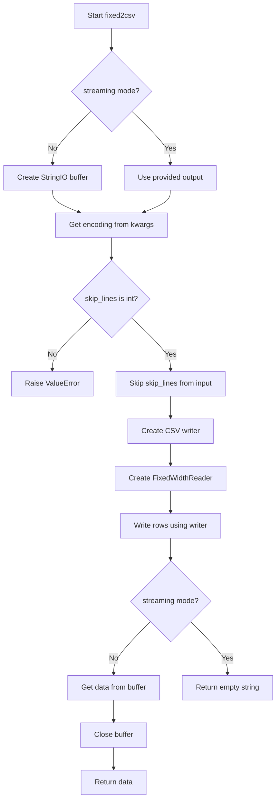
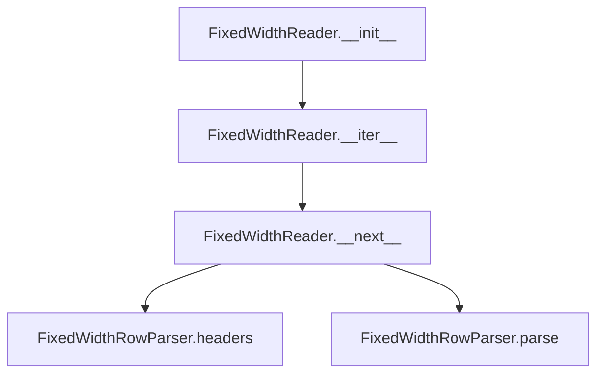
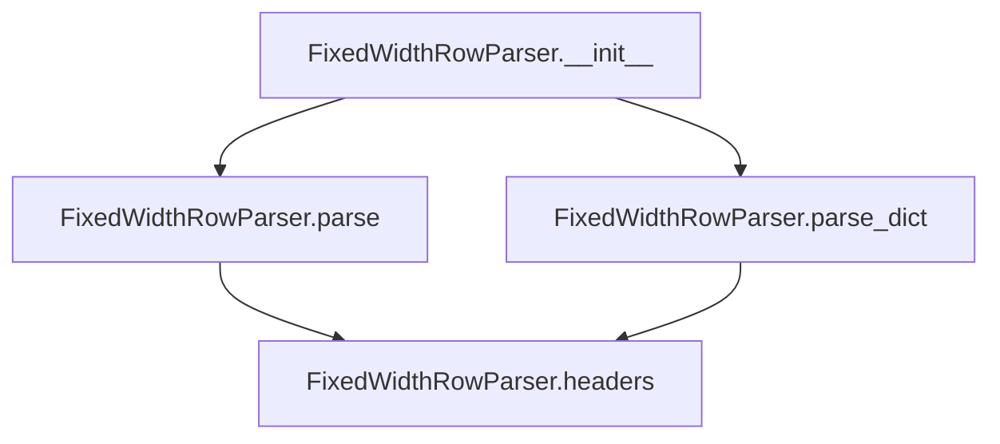
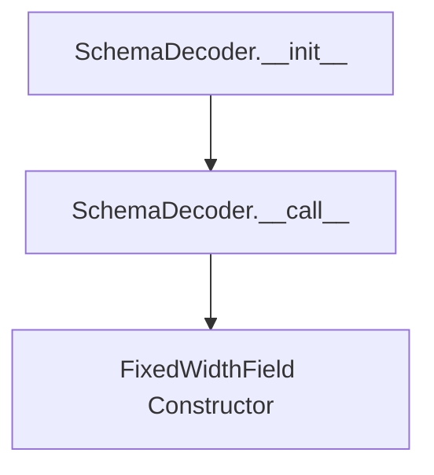

# `fixed.py`

## `csvkit.convert.fixed.fixed2csv` · *function*

## Summary:
Converts fixed-width formatted text data to CSV format, supporting optional input skipping and streaming output.

## Description:
The fixed2csv function transforms fixed-width formatted text data into CSV format by reading from an input file-like object using a schema definition, then writing the structured data as CSV. It supports skipping initial lines from the input and can operate in either streaming or buffered modes.

This function is extracted to provide a clean abstraction for fixed-width to CSV conversion, separating the concerns of data parsing (handled by FixedWidthReader) from the CSV writing logic (handled by agate.csv.writer). This modular approach allows for reuse of the underlying readers and writers while providing a standardized interface for the conversion process.

## Args:
- f (file-like object): Input stream containing fixed-width formatted text data
- schema (list): Schema definition specifying field positions and lengths for parsing
- output (file-like object, optional): Output stream for CSV data. If None, returns CSV as string
- skip_lines (int): Number of initial lines to skip from input before processing (default: 0)
- **kwargs: Additional keyword arguments passed to the underlying reader, such as encoding

## Returns:
- str: CSV-formatted data as a string when output parameter is None
- str: Empty string when output parameter is provided (streaming mode)

## Raises:
- ValueError: When skip_lines argument is not an integer

## Constraints:
- Preconditions: 
  - Input file-like object `f` must be readable
  - Schema must define valid field positions and lengths
  - skip_lines must be a non-negative integer
- Postconditions:
  - If output is None, the returned string contains properly formatted CSV data
  - If output is provided, the output stream is written to but not closed by this function

## Side Effects:
- Reads from the input file-like object `f`
- Writes to the output file-like object `output` when provided
- May read additional lines from input when skip_lines > 0
- Creates internal StringIO buffer when output is None

## Control Flow:


## Examples:
```python
# Basic usage with schema definition
schema = [
    ['name', 'start', 'length'],
    ['first_name', '0', '10'],
    ['last_name', '10', '15'],
    ['age', '25', '3']
]

# Convert to string
with open('data.txt', 'r') as f:
    csv_data = fixed2csv(f, schema)
    print(csv_data)

# Stream to output file
with open('data.txt', 'r') as f:
    with open('output.csv', 'w') as output:
        fixed2csv(f, schema, output=output)
```

## `csvkit.convert.fixed.FixedWidthReader` · *class*

## Summary:
A fixed-width file reader that parses text lines according to a schema definition, yielding structured data rows.

## Description:
The FixedWidthReader class provides an iterator interface for reading fixed-width formatted text files. It uses a schema to define field positions and lengths, then parses each line into structured data. This class is designed to work with fixed-width formatted data where fields are positioned at specific character offsets rather than separated by delimiters.

The reader handles optional encoding conversion and automatically skips header rows when present. It's typically used in data processing pipelines where fixed-width formatted files need to be converted to structured formats like lists or dictionaries.

## State:
- file: file-like object - The input stream containing fixed-width formatted text data
- parser: FixedWidthRowParser - Parser instance configured with schema for field extraction
- header: bool - Flag indicating whether the header row should be returned on next iteration

## Lifecycle:
- Creation: Instantiate with a file-like object, schema definition, and optional encoding
- Usage: Iterate over the reader object to get parsed rows one by one
- Destruction: Standard Python garbage collection applies; no explicit cleanup required

## Method Map:


## Raises:
- StopIteration: Raised by __next__ when end of file is reached

## Example:
```python
# Create a fixed-width reader with schema
schema = [
    ['name', 'start', 'length'],
    ['first_name', '0', '10'],
    ['last_name', '10', '15'],
    ['age', '25', '3']
]

# Assuming 'data.txt' contains fixed-width formatted data
with open('data.txt', 'r') as f:
    reader = FixedWidthReader(f, schema, encoding='utf-8')
    
    # Iterate through rows
    for row in reader:
        print(row)  # Prints parsed data rows
```

### `csvkit.convert.fixed.FixedWidthReader.__init__` · *method*

## Summary:
Initializes a fixed-width file reader with a file handle, parsing schema, and optional character encoding.

## Description:
Configures the reader to process fixed-width formatted data by setting up the input file handle, creating a row parser with the provided schema, and initializing the header flag. This method prepares the reader for subsequent data processing operations.

## Args:
    f (file-like object): Input file handle containing fixed-width formatted data
    schema (object): Schema definition used to parse fixed-width rows
    encoding (str, optional): Character encoding of the input file. Defaults to None

## Returns:
    None: This method initializes instance attributes and does not return a value

## Raises:
    None explicitly raised: This method does not contain explicit exception handling

## State Changes:
    Attributes READ: None
    Attributes WRITTEN: self.file, self.parser, self.header

## Constraints:
    Preconditions: 
    - The file handle `f` must be readable
    - The `schema` parameter must be compatible with FixedWidthRowParser constructor
    - If `encoding` is provided, it must be a valid character encoding string
    
    Postconditions:
    - self.file contains the input file handle
    - self.parser is initialized with the provided schema
    - self.header is set to True (indicating header row processing is enabled)

## Side Effects:
    None: This method performs no I/O operations or external service calls beyond basic attribute assignment

### `csvkit.convert.fixed.FixedWidthReader.__iter__` · *method*

## Summary:
Returns the iterator instance itself, enabling the FixedWidthReader to function as an iterator over fixed-width formatted data.

## Description:
This method makes the FixedWidthReader class iterable by returning itself when the built-in `iter()` function is called or when used in a for-loop. The reader is designed to iterate over fixed-width formatted text lines, parsing each line according to a defined schema.

The method is part of the standard Python iterator protocol implementation. When called, it allows the reader to be used in iteration contexts such as `for row in reader:` or `list(reader)`.

## Args:
    None

## Returns:
    FixedWidthReader: The instance itself, making it a proper iterator.

## Raises:
    None

## State Changes:
    Attributes READ: 
    - self.parser: Used to access headers and parse methods
    - self.file: Used in __next__ method to get next line
    - self.header: Used to determine if header row should be returned
    
    Attributes WRITTEN: 
    - None

## Constraints:
    Preconditions:
    - The FixedWidthReader must be properly initialized with a file handle and schema
    - The schema must define valid field positions and lengths
    - The underlying file handle must be readable
    
    Postconditions:
    - The method returns the same instance (self)
    - The instance is ready to be consumed via __next__ method

## Side Effects:
    None

### `csvkit.convert.fixed.FixedWidthReader.__next__` · *method*

## Summary:
Returns the next row from a fixed-width formatted data stream, handling header processing and data parsing.

## Description:
Implements the iterator protocol's `__next__` method for the FixedWidthReader class. This method manages the distinction between header rows and data rows, returning column headers on the first call and parsed data rows on subsequent calls. The method consumes one line from the input file stream and processes it according to the defined fixed-width schema.

## Args:
    None

## Returns:
    list: Either the column headers (list of strings) on the first call, or a parsed data row (list of values) on subsequent calls.

## Raises:
    StopIteration: When the input file stream is exhausted.

## State Changes:
    Attributes READ: self.header, self.parser, self.file
    Attributes WRITTEN: self.header (set to False after first call)

## Constraints:
    Preconditions: 
    - The FixedWidthReader instance must be initialized with a valid file stream and schema
    - The file stream must support iteration (have a `next()` method)
    - The parser must be properly configured with a schema
    
    Postconditions:
    - On first call: self.header is set to False
    - The returned value is either the headers list or a parsed row list
    - The file pointer advances by one line on each call (except first call which returns headers)

## Side Effects:
    I/O: Reads one line from the input file stream (self.file)
    Mutation: Modifies self.header state from True to False after first call

## `csvkit.convert.fixed.FixedWidthRowParser` · *class*

## Summary:
Parses fixed-width formatted text lines according to a schema definition, converting them into structured data formats.

## Description:
The FixedWidthRowParser class is responsible for interpreting fixed-width formatted text data based on a schema definition. It reads a schema file that defines the structure of fixed-width records, including field names, starting positions, and lengths. This parser enables conversion of raw text lines into structured data such as lists or dictionaries.

This class is typically instantiated by the fixed-width conversion system when processing fixed-width text files. It serves as the core component for transforming fixed-width formatted data into more usable data structures.

## State:
- fields: list[FixedWidthField] - A list of field definitions parsed from the schema, each containing name, start position, and length properties
- Each field in the list is expected to be a namedtuple or similar structure with:
  - name (str): The field identifier/name
  - start (int): The zero-based starting position of the field in the line
  - length (int): The character length of the field

## Lifecycle:
- Creation: Instantiate with a schema parameter (typically a file-like object or iterable of schema rows)
- Usage: Call parse() or parse_dict() methods with individual text lines to convert them
- Destruction: Standard Python garbage collection applies; no explicit cleanup required

## Method Map:


## Raises:
- ValueError: Raised when there's an error reading the schema at any line, typically due to malformed schema rows or missing required columns

## Example:
```python
# Create parser with schema
schema = [
    ['column', 'start', 'length'],
    ['name', '1', '20'],
    ['age', '21', '3'],
    ['city', '24', '30']
]

parser = FixedWidthRowParser(schema)

# Parse a fixed-width line
line = "John Doe              25New York City          "
values = parser.parse(line)  # ['John Doe', '25', 'New York City']

# Parse as dictionary
data_dict = parser.parse_dict(line)  # {'name': 'John Doe', 'age': '25', 'city': 'New York City'}
```

### `csvkit.convert.fixed.FixedWidthRowParser.parse` · *method*

## Summary:
Parses a fixed-width formatted line into a list of field values based on predefined field specifications.

## Description:
Extracts field values from a fixed-width formatted input line by slicing the line according to start positions and lengths defined in the parser's field configuration. This method is typically called as part of the data processing pipeline when converting fixed-width formatted text into structured data.

The method is separated from other parsing logic to provide a clean interface for extracting raw field values, while higher-level methods like `parse_dict` handle conversion to dictionary format using the extracted values and field headers.

## Args:
    line (str): A single line of text in fixed-width format containing all fields sequentially

## Returns:
    list[str]: A list of field values as strings, one for each field defined in the schema. Empty fields are represented as empty strings, and all values are stripped of leading/trailing whitespace.

## Raises:
    None

## State Changes:
    Attributes READ: self.fields
    Attributes WRITTEN: None

## Constraints:
    Preconditions:
    - The `line` argument must be a string containing sufficient characters to satisfy all field specifications
    - The `self.fields` attribute must be properly initialized with field objects having `start` and `length` attributes
    - Field start positions and lengths must be valid indices within the line string

    Postconditions:
    - Returns a list of strings with the same length as `self.fields`
    - Each returned string is stripped of leading and trailing whitespace
    - Field values are extracted using zero-based indexing from the input line

## Side Effects:
    None

### `csvkit.convert.fixed.FixedWidthRowParser.parse_dict` · *method*

## Summary:
Converts a fixed-width formatted line into a dictionary mapping field names to their corresponding values.

## Description:
Transforms a fixed-width formatted input line into a dictionary where keys are field names and values are the extracted field values. This method leverages the parser's existing field definitions and parsing logic to create a structured representation of the data.

The method is called during data conversion pipelines when structured dictionary representations are needed instead of raw field value lists. It serves as a convenient interface for accessing parsed data by field name rather than position.

## Args:
    line (str): A single line of text in fixed-width format containing all fields sequentially

## Returns:
    dict[str, str]: A dictionary mapping field names (from self.headers) to their corresponding string values extracted from the input line. Empty fields are represented as empty strings, and all values are stripped of leading/trailing whitespace.

## Raises:
    None

## State Changes:
    Attributes READ: self.headers, self.parse
    Attributes WRITTEN: None

## Constraints:
    Preconditions:
    - The `line` argument must be a string containing sufficient characters to satisfy all field specifications
    - The `self.fields` attribute must be properly initialized with field objects having `start` and `length` attributes
    - Field start positions and lengths must be valid indices within the line string

    Postconditions:
    - Returns a dictionary with keys matching the field names in `self.headers`
    - Values are the same as those returned by `self.parse(line)` but mapped to field names
    - Dictionary size equals the number of fields defined in the schema

## Side Effects:
    None

### `csvkit.convert.fixed.FixedWidthRowParser.headers` · *method*

## Summary:
Returns a list of field names from the fixed-width schema definition.

## Description:
This method extracts and returns the names of all fields defined in the fixed-width schema. It is used to obtain column headers that can be used for mapping parsed data to dictionaries or for identifying the structure of the fixed-width data format.

The method is called during the parsing process when converting fixed-width rows to dictionary format via the `parse_dict` method, and is also useful for applications that need to know the expected column structure of the fixed-width data.

## Args:
    None

## Returns:
    list[str]: A list of field names as strings, one for each field defined in the schema.

## Raises:
    None

## State Changes:
    Attributes READ: self.fields
    Attributes WRITTEN: None

## Constraints:
    Preconditions: 
    - The `self.fields` attribute must be initialized and contain field objects with a `name` attribute
    - Each field in `self.fields` must have a `name` attribute that is a string
    
    Postconditions:
    - Returns a list of strings representing field names
    - The order of field names matches the order of fields in `self.fields`

## Side Effects:
    None

## `csvkit.convert.fixed.SchemaDecoder` · *class*

## Summary:
A decoder class that processes schema rows to create fixed-width field definitions with proper index conversion.

## Description:
The SchemaDecoder class is responsible for parsing schema definition rows from a fixed-width file schema CSV and converting them into FixedWidthField objects. It handles the mapping of column names to their positions and manages the conversion between 1-based and 0-based indexing systems commonly used in fixed-width file specifications.

This class is typically instantiated by the fixed-width conversion system when processing schema files that define the structure of fixed-width text files. It serves as a factory for creating FixedWidthField objects that represent individual fields in the fixed-width format.

## State:
- start: int - Index position of the 'start' column in the header, defaults to None
- length: int - Index position of the 'length' column in the header, defaults to None  
- column: int - Index position of the 'column' column in the header, defaults to None
- one_based: bool - Flag indicating whether the schema uses 1-based indexing, defaults to None

The __init__ method sets these attributes based on the header row, requiring columns named 'column', 'start', and 'length' to exist.

## Lifecycle:
- Creation: Instantiate with a header row (list or iterable of column names)
- Usage: Call the instance with individual data rows to process them into FixedWidthField objects
- Destruction: No explicit cleanup required; standard Python garbage collection applies

## Method Map:


## Raises:
- ValueError: Raised when any of the required columns ('column', 'start', 'length') are not found in the header row

## Example:
```python
# Create decoder with header row
header = ['column', 'start', 'length']
decoder = SchemaDecoder(header)

# Process data row
row = ['field1', '1', '10']  # 1-based start position
field = decoder(row)  # Returns FixedWidthField object
```

### `csvkit.convert.fixed.SchemaDecoder.__init__` · *method*

## Summary:
Initializes the SchemaDecoder by mapping required column names to their positions in the header row and setting appropriate attribute values.

## Description:
The __init__ method processes the header row to locate required columns ('column', 'start', and 'length') and stores their positional indices as attributes on the instance. It handles both 0-based and 1-based indexing systems by checking if a value type conversion is needed. This method ensures that the decoder can properly parse subsequent data rows by having pre-computed column positions.

This logic is separated into its own method rather than being inlined because it performs essential setup work that needs to be done once during object initialization, and it provides clear error messages when required schema columns are missing.

## Args:
    header (list or iterable): A sequence of column names representing the header row of a schema file

## Returns:
    None: This method modifies the instance state directly and does not return a value

## Raises:
    ValueError: Raised when any of the required columns ('column', 'start', 'length') are not found in the header row

## State Changes:
    Attributes READ: None
    Attributes WRITTEN: 
    - start: int - Index position of the 'start' column in the header
    - length: int - Index position of the 'length' column in the header
    - column: int - Index position of the 'column' column in the header
    - one_based: bool - Flag indicating whether the schema uses 1-based indexing (set during __call__)

## Constraints:
    Preconditions:
    - The header parameter must be a sequence-like object containing column names
    - The header must contain at least the required columns ('column', 'start', 'length')
    
    Postconditions:
    - All required column attributes (start, length, column) are set to integer indices
    - The instance is ready to process data rows via the __call__ method

## Side Effects:
    None: This method performs no I/O operations or external service calls. It only manipulates instance attributes.

### `csvkit.convert.fixed.SchemaDecoder.__call__` · *method*

*No documentation generated.*

