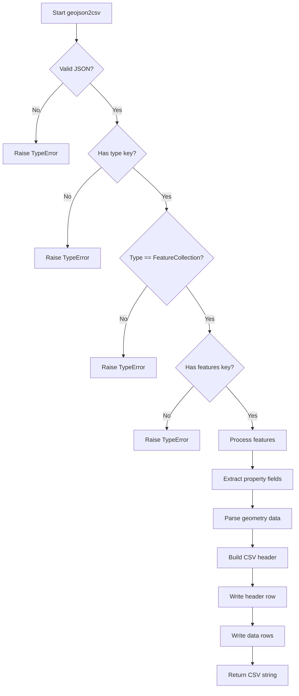

# `geojs.py`

## `csvkit.convert.geojs.geojson2csv` · *function*

## Summary:
Converts GeoJSON FeatureCollection data into CSV format with support for geometric coordinates.

## Description:
Transforms GeoJSON data containing features with properties and geometries into a CSV table format. The function extracts all unique property fields from features and includes them as columns, along with geometry data, geometry type, and extracted longitude/latitude coordinates for Point geometries.

## Args:
    f (file-like object): Input stream containing GeoJSON data in JSON format
    key (str, optional): Unused parameter in current implementation (default: None)
    **kwargs: Additional keyword arguments (currently unused)

## Returns:
    str: CSV-formatted string containing the converted data with columns: id, property fields, geojson, type, longitude, latitude

## Raises:
    TypeError: When the JSON document is not valid GeoJSON (root element not an object, missing type key, unsupported type, missing features key)

## Constraints:
    Preconditions:
        - Input file must contain valid JSON
        - JSON must represent a GeoJSON FeatureCollection
        - Each feature must have a geometry field
    Postconditions:
        - Output CSV string contains properly formatted data
        - All property fields from features are included as columns
        - Geometry data is serialized as JSON strings
        - Point geometries have longitude/latitude extracted

## Side Effects:
    - Reads from the input file-like object
    - Creates in-memory string buffer for CSV generation
    - No external I/O operations beyond reading input and returning output

## Control Flow:

## Examples:
    # Basic usage with file input
    with open('data.geojson', 'r') as f:
        csv_output = geojson2csv(f)
    
    # Processing GeoJSON from string
    import io
    geojson_str = '{"type": "FeatureCollection", "features": [{"type": "Feature", "properties": {"name": "Test"}, "geometry": {"type": "Point", "coordinates": [10, 20]}}]}'
    f = io.StringIO(geojson_str)
    csv_result = geojson2csv(f)
    # Result would be CSV with columns: id, name, geojson, type, longitude, latitude

