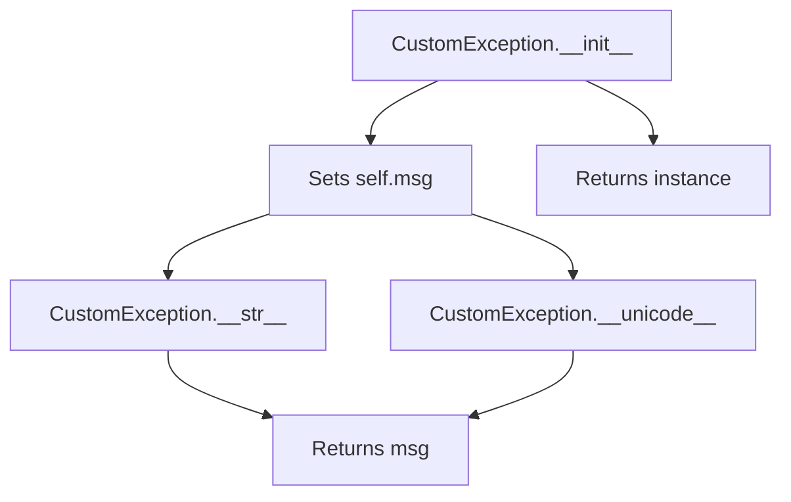
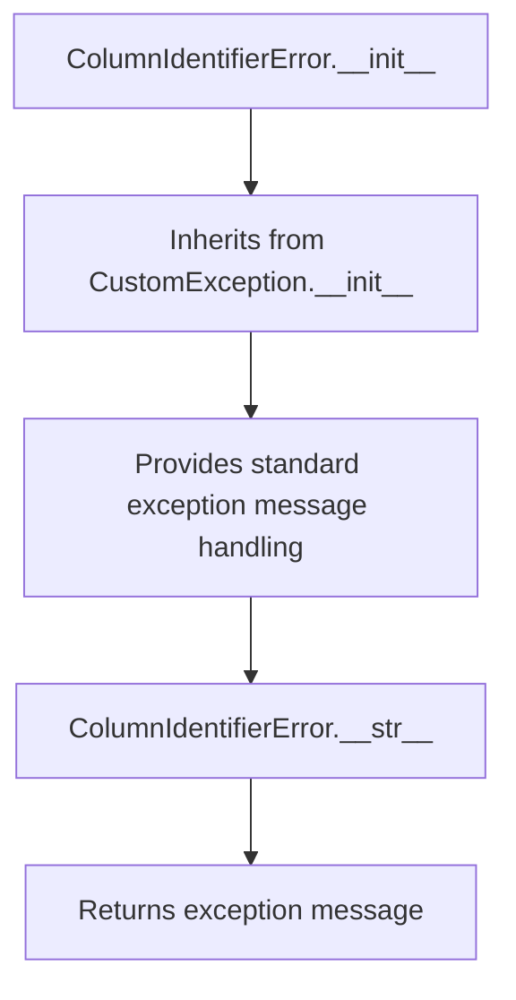
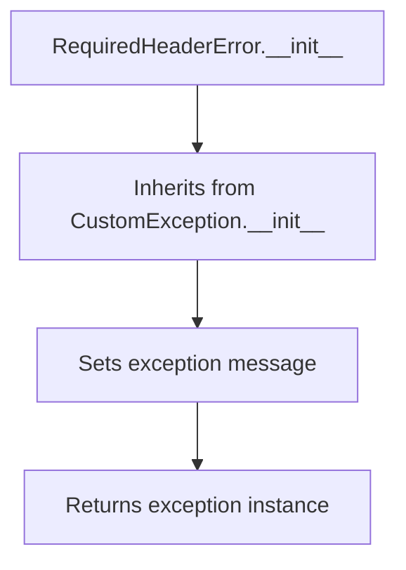

# `exceptions.py`

## `csvkit.exceptions.CustomException` · *class*

## Summary:
A custom exception class that provides a simple way to raise exceptions with a customizable message.

## Description:
This class extends Python's built-in Exception class to provide a basic custom exception implementation. It stores a message and provides string representations through __str__ and __unicode__ methods.

## State:
- msg: The message stored in the exception instance.

## Lifecycle:
- Creation: Instantiate with a message using CustomException(msg)
- Usage: Raise the exception using 'raise' keyword or let it propagate naturally
- Destruction: Handled automatically by Python's garbage collector

## Method Map:


## Raises:
- None explicitly raised by __init__

## Example:
```python
# Creating and raising the exception
try:
    raise CustomException("File not found")
except CustomException as e:
    print(str(e))  # Output: "File not found"
    print(unicode(e))  # Output: "File not found"
```

### `csvkit.exceptions.CustomException.__init__` · *method*

## Summary:
Initializes a CustomException instance with a descriptive error message.

## Description:
Sets the message attribute of the exception instance. This method is part of the CustomException class hierarchy and provides a standard way to create exception instances with custom error messages.

## Args:
    msg (str): The error message to associate with this exception instance.

## Returns:
    None: This method does not return a value.

## Raises:
    None: This method does not raise any exceptions.

## State Changes:
    Attributes READ: None
    Attributes WRITTEN: self.msg

## Constraints:
    Preconditions: The msg argument must be a string or an object that can be converted to a string.
    Postconditions: The exception instance will have its msg attribute set to the provided message.

## Side Effects:
    None: This method performs no I/O operations or external service calls. It only sets an instance attribute.

### `csvkit.exceptions.CustomException.__unicode__` · *method*

## Summary:
Returns the Unicode string representation of the custom exception by returning its stored message.

## Description:
This method provides the Unicode string representation of the CustomException instance. When the exception is raised and caught, or when it's printed or converted to a Unicode string, this method is automatically invoked to provide the human-readable error message. This implementation follows Python 2/3 compatibility conventions where `__unicode__` handles Unicode string conversion.

## Args:
    None

## Returns:
    str: The error message stored in the exception's msg attribute.

## Raises:
    None

## State Changes:
    Attributes READ: self.msg
    Attributes WRITTEN: None

## Constraints:
    Preconditions: The exception instance must have a msg attribute containing a string value.
    Postconditions: The returned value is identical to the message originally provided during exception construction.

## Side Effects:
    None

### `csvkit.exceptions.CustomException.__str__` · *method*

## Summary:
Returns the string representation of the custom exception by returning its stored message.

## Description:
This method provides the string representation of the CustomException instance. When the exception is raised and caught, or when it's printed or converted to a string, this method is automatically invoked to provide the human-readable error message. This implementation follows the standard Python convention for exception string representations.

## Args:
    None

## Returns:
    str: The error message stored in the exception's msg attribute.

## Raises:
    None

## State Changes:
    Attributes READ: self.msg
    Attributes WRITTEN: None

## Constraints:
    Preconditions: The exception instance must have a msg attribute containing a string value.
    Postconditions: The returned value is identical to the message originally provided during exception construction.

## Side Effects:
    None

## `csvkit.exceptions.ColumnIdentifierError` · *class*

## Summary:
Represents an error that occurs when a column identifier (such as a column name or index) is invalid or cannot be resolved in a CSV processing operation.

## Description:
This exception is raised when a CSV processing operation encounters an issue with column identification, such as when a requested column name doesn't exist in the CSV header, or when a column index is out of bounds. It serves as a specialized exception type to distinguish column identifier-related errors from other types of CSV processing errors.

## State:
- Inherits from CustomException, which provides standard exception functionality for storing error messages

## Lifecycle:
- Creation: Instantiate with an optional error message using ColumnIdentifierError(message)
- Usage: Raise the exception using 'raise' keyword when column identifier issues occur
- Destruction: Handled automatically by Python's garbage collector

## Method Map:


## Raises:
- None explicitly raised by __init__ (inherits behavior from CustomException)

## Example:
```python
# Raising the exception when a column is not found
try:
    column_index = get_column_index("nonexistent_column")
except ColumnIdentifierError:
    print("Column identifier not found in CSV")

# Creating with a custom message
raise ColumnIdentifierError("Column 'age' not found in header row")
```

## `csvkit.exceptions.CSVTestException` · *class*

## Summary:
A custom exception class for reporting CSV validation errors with contextual line and row information.

## Description:
CSVTestException is designed to provide detailed error reporting during CSV file validation or testing processes. When a CSV file fails validation at a specific line and row, this exception carries both the error message and the location information to help identify the problematic data.

This exception is typically raised when CSV parsing or validation logic detects malformed data, missing fields, or other inconsistencies in a CSV file. The inclusion of line_number and row information makes debugging easier by pinpointing exactly where issues occur in the file.

## State:
- line_number (int): The line number in the CSV file where the error occurred. Must be a positive integer representing a valid line in the file.
- row (list or dict): The row data that caused the validation failure. Can be either a list of field values or a dictionary mapping field names to values.
- msg (str): The descriptive error message explaining what went wrong.

## Lifecycle:
- Creation: Instantiate with line_number, row, and msg parameters
- Usage: Raise the exception using the 'raise' keyword when CSV validation fails
- Destruction: Automatically handled by Python's exception handling mechanism

## Method Map:
```mermaid
graph TD
    A[CSVTestException.__init__] --> B[Sets line_number]
    A --> C[Sets row]
    A --> D[Sets msg]
    A --> E[Calls super().__init__(msg)]
    E --> F[CustomException.__init__]
```

## Raises:
- None explicitly raised by __init__
- Inherits standard Exception behavior from CustomException parent class

## Example:
```python
# Example of raising CSVTestException during CSV validation
try:
    # Simulate finding invalid data at line 5, row with missing field
    invalid_row = ['field1', '', 'field3']  # Missing value in second field
    raise CSVTestException(
        line_number=5,
        row=invalid_row,
        msg="Missing required value in field2"
    )
except CSVTestException as e:
    print(f"Error at line {e.line_number}: {e.msg}")
    # Output: "Error at line 5: Missing required value in field2"
    print(f"Row data: {e.row}")
    # Output: "Row data: ['field1', '', 'field3']"
```

### `csvkit.exceptions.CSVTestException.__init__` · *method*

## Summary:
Initializes a CSV test exception with line number, row data, and error message.

## Description:
Constructs a CSVTestException instance that captures contextual information about CSV validation failures. This exception is typically raised during CSV testing or validation processes when a row fails a specific test condition.

## Args:
    line_number (int): The line number in the CSV file where the test failure occurred.
    row (list): The row data that caused the test failure.
    msg (str): A descriptive error message explaining the nature of the test failure.

## Returns:
    None: This method initializes the exception object and does not return a value.

## Raises:
    None: This method does not raise any exceptions itself.

## State Changes:
    Attributes READ: None
    Attributes WRITTEN: 
        - self.line_number: Set to the provided line_number parameter
        - self.row: Set to the provided row parameter

## Constraints:
    Preconditions: 
        - line_number should be a positive integer representing a valid line in the CSV file
        - row should be a list-like object containing the CSV row data
        - msg should be a string describing the test failure
    Postconditions: 
        - The exception object will have self.line_number set to the provided value
        - The exception object will have self.row set to the provided value
        - The exception object will inherit the msg attribute from the parent CustomException class

## Side Effects:
    None: This method performs no I/O operations or external service calls. It only initializes object attributes.

## `csvkit.exceptions.LengthMismatchError` · *class*

## Summary:
An exception raised when a CSV row contains a different number of columns than expected during validation.

## Description:
LengthMismatchError is specifically designed to report CSV validation failures where the actual number of columns in a row differs from the expected column count. This exception is typically raised during CSV parsing or validation when processing rows that don't conform to the expected schema.

The exception inherits from CSVTestException, which provides contextual information including line number and row data, making it easier to debug CSV parsing issues by pinpointing exactly which row failed validation and how many columns were found versus expected.

## State:
- line_number (int): The line number in the CSV file where the mismatch occurred. Must be a positive integer representing a valid line in the file.
- row (list or dict): The row data that caused the validation failure. Can be either a list of field values or a dictionary mapping field names to values.
- expected_length (int): The number of columns that were expected in the row. Must be a positive integer.
- msg (str): The descriptive error message explaining the column count mismatch.

## Lifecycle:
- Creation: Instantiate with line_number, row, and expected_length parameters
- Usage: Raise the exception when CSV validation detects a column count mismatch
- Destruction: Automatically handled by Python's exception handling mechanism

## Method Map:
```mermaid
graph TD
    A[LengthMismatchError.__init__] --> B[Creates error message]
    A --> C[Calls super().__init__]
    C --> D[CSVTestException.__init__]
    D --> E[Sets line_number, row, msg]
    F[LengthMismatchError.length] --> G[Returns len(self.row)]
```

## Raises:
- None explicitly raised by __init__
- Inherits standard Exception behavior from CSVTestException parent class

## Example:
```python
# Example of raising LengthMismatchError during CSV validation
try:
    # Simulate finding a row with 3 columns when 4 were expected
    row_data = ['field1', 'field2', 'field3']  # Only 3 columns
    raise LengthMismatchError(
        line_number=10,
        row=row_data,
        expected_length=4
    )
except LengthMismatchError as e:
    print(f"Error at line {e.line_number}: {e.args[-1]}")
    # Output: "Error at line 10: Expected 4 columns, found 3 columns"
    print(f"Actual column count: {e.length}")
    # Output: "Actual column count: 3"
```

### `csvkit.exceptions.LengthMismatchError.__init__` · *method*

## Summary:
Initializes a LengthMismatchError exception with line number, row data, and expected column count to report column count mismatches in CSV processing.

## Description:
This method constructs a LengthMismatchError exception that is used to indicate when a CSV row contains a different number of columns than expected. It formats a descriptive error message and properly initializes the exception hierarchy by calling the parent class constructor with the provided parameters.

## Args:
    line_number (int): The line number in the CSV file where the mismatch occurred
    row (list): The row data that caused the mismatch, typically containing column values
    expected_length (int): The expected number of columns for the row

## Returns:
    None: This method initializes the exception object and does not return a value

## Raises:
    None: This method does not explicitly raise exceptions, but may propagate exceptions from parent class initialization

## State Changes:
    Attributes READ: None
    Attributes WRITTEN: 
    - self.line_number: Set to the provided line_number parameter
    - self.row: Set to the provided row parameter
    - self.msg: Set via parent class initialization with formatted error message

## Constraints:
    Preconditions:
    - line_number should be a positive integer representing a valid line in the CSV file
    - row should be iterable (list, tuple, etc.) containing column data
    - expected_length should be a non-negative integer representing the expected column count
    
    Postconditions:
    - The exception object is properly initialized with line_number, row, and a descriptive message
    - The error message follows the format "Expected X columns, found Y columns"

## Side Effects:
    None: This method performs no I/O operations or external service calls. It only initializes object attributes and constructs an exception message.

### `csvkit.exceptions.LengthMismatchError.length` · *method*

*No documentation generated.*

## `csvkit.exceptions.InvalidValueForTypeException` · *class*

## Summary:
An exception raised when a value cannot be converted to a specified data type at a given index.

## Description:
This exception is thrown when csvkit encounters a value that cannot be converted to the expected data type during processing. It is typically raised when attempting to parse CSV data where a field contains invalid data for the target column type. The exception provides contextual information about which value failed conversion, what type was expected, and at which position in the data stream the error occurred.

## State:
- index: int, the position in the data stream where the conversion failed
- value: str, the actual value that could not be converted
- normal_type: str, the target data type that the value was expected to convert to

## Lifecycle:
- Creation: Instantiate with index (int), value (str), and normal_type (str) parameters
- Usage: Raise the exception using the 'raise' keyword when conversion fails
- Destruction: Automatically handled by Python's exception handling mechanism

## Method Map:
```mermaid
graph TD
    A[InvalidValueForTypeException.__init__] --> B[Sets self.index]
    A --> C[Sets self.value]
    A --> D[Sets self.normal_type]
    A --> E[Creates formatted message]
    A --> F[Calls super().__init__(msg)]
```

## Raises:
- None explicitly raised by __init__ method
- Inherits standard Exception behavior from CustomException parent class

## Example:
```python
# Example of creating and raising the exception
try:
    # Simulate a conversion failure
    raise InvalidValueForTypeException(5, "abc", "integer")
except InvalidValueForTypeException as e:
    print(str(e))  # Output: "Unable to convert "abc" to type integer (at index 5)"
```

### `csvkit.exceptions.InvalidValueForTypeException.__init__` · *method*

## Summary:
Initializes an InvalidValueForTypeException with conversion failure context including index, value, and expected type.

## Description:
Configures the exception instance with metadata about a failed type conversion operation. This method sets the instance attributes for index, value, and normal_type, then constructs a descriptive error message indicating which value failed to convert to which type at which position in the data stream.

## Args:
    index (int): The zero-based position in the data stream where the conversion failed.
    value (str): The actual string value that could not be converted to the expected type.
    normal_type (str): The target data type that the value was expected to convert to.

## Returns:
    None: This method initializes the exception instance and does not return a value.

## Raises:
    None: This method does not raise any exceptions itself.

## State Changes:
    Attributes READ: None
    Attributes WRITTEN: 
    - self.index: stores the position where conversion failed
    - self.value: stores the problematic value that couldn't be converted
    - self.normal_type: stores the expected target data type

## Constraints:
    Preconditions:
    - index must be a non-negative integer representing a valid position
    - value must be a string representation of the problematic data
    - normal_type must be a string describing the expected data type
    
    Postconditions:
    - self.index is set to the provided index value
    - self.value is set to the provided value string
    - self.normal_type is set to the provided normal_type string
    - The exception's message is set to a formatted string describing the conversion failure

## Side Effects:
    None: This method performs only local attribute assignments and message construction with no external I/O or side effects.

## `csvkit.exceptions.RequiredHeaderError` · *class*

## Summary:
A custom exception class indicating that a required header field is missing from a CSV file.

## Description:
The RequiredHeaderError exception is raised when a CSV processing operation encounters a situation where a required header field is absent from the input data. This exception extends CustomException and serves as a specialized error type to distinguish header validation failures from other types of processing errors. It is typically used in CSV parsing and validation operations where specific column names or headers are mandatory for successful processing.

## State:
- Inherits all state from CustomException parent class
- No additional attributes beyond those inherited from CustomException

## Lifecycle:
- Creation: Instantiated like any other exception, typically with a descriptive message
- Usage: Raised during CSV processing when header validation fails
- Destruction: Handled automatically by Python's exception handling mechanism

## Method Map:


## Raises:
- None explicitly raised by __init__ (inherits behavior from CustomException)

## Example:
```python
# Raising the exception when a required header is missing
try:
    if 'email' not in csv_headers:
        raise RequiredHeaderError("Required header 'email' is missing from CSV file")
except RequiredHeaderError as e:
    print(f"Header validation failed: {e}")
    # Handle the missing header case appropriately
```

