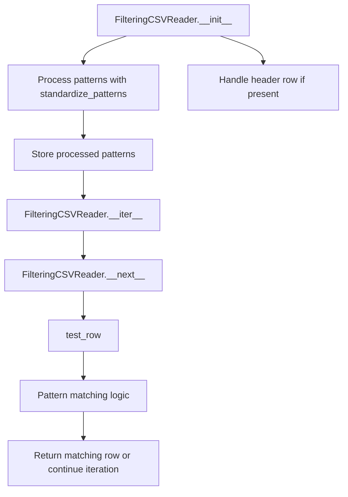

# `grep.py`

## `csvkit.grep.FilteringCSVReader` · *class*

## Summary:
A CSV reader wrapper that filters rows based on pattern matching criteria, supporting flexible column selection and various matching modes.

## Description:
The FilteringCSVReader class acts as a wrapper around an existing CSV reader to provide filtering capabilities. It processes rows through pattern matching against specified criteria, allowing users to extract only those rows that meet their filtering requirements. The class supports filtering by column names or indices, multiple matching modes (any match or all match), and inverse matching to exclude rather than include matching rows.

This class is typically used in CSV processing pipelines where selective row extraction is needed based on content patterns. It implements the iterator protocol, making it compatible with Python's iteration constructs.

## State:
- reader: The underlying CSV reader object being wrapped
- header: Boolean flag indicating whether the CSV has a header row
- column_names: List of column names from the header row, or None if no header
- returned_header: Boolean flag tracking whether the header has been returned
- any_match: Boolean flag controlling matching behavior (True = match any pattern, False = match all patterns)
- inverse: Boolean flag controlling inverse matching (True = exclude matches, False = include matches)
- patterns: Pattern specifications processed by standardize_patterns for filtering operations

## Lifecycle:
- Creation: Instantiate with a CSV reader, pattern specifications, and optional configuration flags
- Usage: Iterate over the instance to retrieve filtered rows
- Destruction: No explicit cleanup required; relies on Python's garbage collection

## Method Map:


## Raises:
- ColumnIdentifierError: Raised by standardize_patterns when column identifiers conflict or cannot be resolved
- StopIteration: Raised by __next__ when no more rows are available from the underlying reader

## Example:
```python
import csv
from csvkit.grep import FilteringCSVReader

# Create a basic CSV reader
csv_file = open('data.csv', 'r')
reader = csv.reader(csv_file)

# Create a filtering reader that keeps rows where 'name' contains 'John' OR 'age' > 25
filter_reader = FilteringCSVReader(
    reader, 
    patterns={'name': 'John', 'age': lambda x: int(x) > 25}, 
    header=True, 
    any_match=True
)

# Iterate through filtered results
for row in filter_reader:
    print(row)

# Close the file when done
csv_file.close()
```

### `csvkit.grep.FilteringCSVReader.__init__` · *method*

## Summary:
Initializes a FilteringCSVReader object that filters CSV rows based on specified patterns and matching criteria.

## Description:
Configures a CSV reader that applies pattern-based filtering to rows from an underlying CSV reader. This method sets up the filtering configuration including column patterns, matching logic, and inversion settings while optionally processing the header row.

## Args:
    reader: An iterator that yields CSV rows (typically a csv.reader object)
    patterns (dict or list/tuple): Pattern specifications for filtering columns. Keys can be column names (strings) or indices (integers), with values being pattern matching functions or values to match against.
    header (bool): Whether the first row contains column headers. Defaults to True.
    any_match (bool): If True, matches any pattern in a row to include it. If False, all patterns must match. Defaults to False.
    inverse (bool): If True, excludes rows that match the patterns instead of including them. Defaults to False.

## Returns:
    None: This is an initialization method that configures the object's state.

## Raises:
    ColumnIdentifierError: When a column name conflicts with an existing column index in the patterns dictionary during pattern standardization.

## State Changes:
    Attributes READ: None
    Attributes WRITTEN: 
        - self.reader: Stores the input CSV reader iterator
        - self.header: Stores the header flag
        - self.column_names: Stores column names from the header row (when header=True)
        - self.any_match: Stores the any_match flag
        - self.inverse: Stores the inverse flag
        - self.patterns: Stores standardized patterns processed by standardize_patterns

## Constraints:
    Preconditions:
        - The reader parameter must be an iterator that yields CSV rows
        - Patterns must be either a dictionary or iterable of patterns
        - If column_names is provided, it should contain valid column identifiers
    
    Postconditions:
        - The object is configured with all filtering parameters
        - self.column_names is populated if header=True and reader has data
        - self.patterns contains standardized pattern functions mapped to column indices

## Side Effects:
    None: This method performs no I/O operations or external service calls. It only configures internal state.

### `csvkit.grep.FilteringCSVReader.__iter__` · *method*

## Summary:
Makes the FilteringCSVReader instance iterable by returning itself as the iterator object.

## Description:
This method implements the Python iterator protocol by returning the instance itself, allowing the FilteringCSVReader to be used in for-loops and other iteration contexts. When called, it establishes this object as its own iterator, enabling sequential access to filtered CSV rows through the `__next__` method.

The method is called during iteration setup (e.g., when entering a for-loop) and is part of the standard Python iterator protocol implementation. It enables the class to work seamlessly with Python's iteration mechanisms.

## Args:
    None

## Returns:
    FilteringCSVReader: The instance itself, making it a valid iterator.

## Raises:
    None

## State Changes:
    Attributes READ: None
    Attributes WRITTEN: None

## Constraints:
    Preconditions:
        - The FilteringCSVReader instance must be properly initialized with a CSV reader and pattern specifications
        - The underlying CSV reader must be available for row iteration
    
    Postconditions:
        - The instance becomes a valid iterator that can be consumed via `next()` calls
        - The iterator maintains internal state for tracking header row and row filtering

## Side Effects:
    None

### `csvkit.grep.FilteringCSVReader.__next__` · *method*

## Summary:
Returns the next filtered row from the CSV reader, handling header row return and row filtering logic.

## Description:
Implements the iterator protocol's `__next__` method for `FilteringCSVReader`. This method manages the special case of returning column names as the first row (when `header=True` was specified during initialization), then iterates through remaining rows applying the configured filtering patterns. It continues fetching rows until one matches the filtering criteria or the underlying reader is exhausted.

The method is designed as a separate method because it encapsulates the complex logic of:
1. Header row handling (returning column names exactly once)
2. Row iteration with filtering
3. Proper StopIteration signaling when no more matching rows exist

## Args:
    None

## Returns:
    list[str]: A row from the CSV data that matches the configured filtering patterns, or the column names list if this is the first call and header handling is enabled.

## Raises:
    StopIteration: When no more rows are available from the underlying reader or when no matching rows remain after filtering.

## State Changes:
    Attributes READ: self.column_names, self.returned_header, self.reader, self.test_row
    Attributes WRITTEN: self.returned_header

## Constraints:
    Preconditions:
        - The underlying `self.reader` must be initialized and iterable
        - `self.column_names` must be set if header handling is enabled
        - `self.test_row` method must be properly implemented and accessible
        - `self.returned_header` must be a boolean attribute

    Postconditions:
        - If column names are being returned, `self.returned_header` is set to True
        - If a row is returned, it matches the configured filtering patterns
        - When StopIteration is raised, no further rows can be retrieved

## Side Effects:
    I/O: Reads from the underlying CSV reader (`self.reader`)
    Mutation: Modifies `self.returned_header` state flag

### `csvkit.grep.FilteringCSVReader.test_row` · *method*

## Summary:
Tests whether a CSV row matches the configured filtering patterns based on the any_match and inverse flags.

## Description:
Evaluates a CSV row against the stored patterns to determine if the row should be included in the filtered output. This method implements the core matching logic for the FilteringCSVReader class, supporting both inclusive and exclusive matching modes with flexible pattern specifications.

The method processes each pattern in self.patterns, applying the pattern function to the corresponding column value in the row. The matching behavior is controlled by two flags: any_match determines if any pattern must match (OR logic) or all patterns must match (AND logic), while inverse reverses the final decision.

This method is called during the iteration process in FilteringCSVReader.__next__() to filter rows according to the configured criteria.

## Args:
    row (list): A list of column values representing a single CSV row

## Returns:
    bool: True if the row should be included in the filtered output, False otherwise

## Raises:
    None explicitly raised

## State Changes:
    Attributes READ: self.patterns, self.any_match, self.inverse
    Attributes WRITTEN: None

## Constraints:
    Preconditions:
        - The row parameter must be a list-like object containing column values
        - self.patterns must be a dictionary mapping column indices to callable pattern functions
        - self.any_match and self.inverse must be boolean values
        - Each pattern function in self.patterns must accept a single string argument and return a boolean

    Postconditions:
        - Returns a boolean value indicating row inclusion/exclusion
        - Does not modify any instance state

## Side Effects:
    None

## `csvkit.grep.standardize_patterns` · *function*

## Summary:
Normalizes and standardizes pattern specifications for CSV filtering operations, converting column names to indices and ensuring consistent pattern function representation.

## Description:
Processes pattern specifications to convert them into a standardized format suitable for CSV filtering operations. This function handles both named column specifications (strings) and indexed column specifications (integers), converting column names to their corresponding zero-based indices while maintaining pattern function consistency through `pattern_as_function`.

The function is typically called during CSV grep operations when preparing pattern specifications for processing. It ensures that patterns can be consistently applied across both named and indexed column references, resolving potential conflicts between column names and indices.

## Args:
    column_names (list[str] or None): List of column names from the CSV header, or None if no header is available
    patterns (dict or list/tuple): Pattern specifications where keys can be either column names (strings) or column indices (integers). When patterns is a list/tuple, it's treated as positional patterns.

## Returns:
    dict: A standardized dictionary mapping column indices (integers) to pattern functions, with proper conversion of column names to indices. When patterns is a list/tuple, returns a dictionary with integer indices.

## Raises:
    ColumnIdentifierError: When a column name conflicts with an existing column index in the patterns dictionary

## Constraints:
    Preconditions:
        - Patterns must be either a dictionary or iterable of patterns
        - If column_names is provided, it should contain valid column identifiers
        - All pattern values must be convertible by `pattern_as_function` (callable, regex patterns, or simple values)
    
    Postconditions:
        - Return dictionary keys are integers representing column indices
        - All values are callable pattern functions
        - Column name conflicts with indices are properly detected and reported

## Side Effects:
    None

## Control Flow:
```mermaid
flowchart TD
    A[Start standardize_patterns] --> B{Try processing patterns as dict}
    B --> C{patterns.items() if patterns is dict}
    C -- Yes --> D[Apply pattern_as_function to all values]
    D --> E{column_names provided?}
    E -- No --> F[Return processed patterns]
    E -- Yes --> G[Initialize empty result dict]
    G --> H[Iterate over processed patterns keys]
    H --> I{Key in column_names?}
    I -- Yes --> J[Get index of key in column_names]
    J --> K{Index already in patterns?}
    K -- Yes --> L[raise ColumnIdentifierError]
    K -- No --> M[Map index to pattern function]
    I -- No --> N[Keep key as-is]
    M --> O[Add to result dict]
    N --> O
    O --> P[Return result dict]
    C -- No --> Q[Handle patterns as list/tuple]
    Q --> R[Enumerate patterns and apply pattern_as_function]
    R --> S[Return enumerated patterns]
    B --> T{AttributeError caught?}
    T -- Yes --> Q
    T -- No --> P
```

## Examples:
```python
# Basic usage with column names
column_names = ['name', 'age', 'city']
patterns = {'name': 'John', 'age': 25}
result = standardize_patterns(column_names, patterns)
# Returns: {0: <pattern_function_for_John>, 1: <pattern_function_for_25>}

# Usage without column names (direct indexing)
patterns = {'name': 'John', 'age': 25}
result = standardize_patterns(None, patterns)
# Returns: {'name': <pattern_function_for_John>, 'age': <pattern_function_for_25>}

# Usage with mixed patterns (some named, some indexed)
column_names = ['name', 'age', 'city']
patterns = {'name': 'John', 1: 25}  # 1 refers to 'age' column
result = standardize_patterns(column_names, patterns)
# Returns: {0: <pattern_function_for_John>, 1: <pattern_function_for_25>}

# Usage with list/tuple patterns
patterns = ['John', 25, 'NYC']
result = standardize_patterns(['name', 'age', 'city'], patterns)
# Returns: {0: <pattern_function_for_John>, 1: <pattern_function_for_25>, 2: <pattern_function_for_NYC>}
```

## `csvkit.grep.pattern_as_function` · *function*

## Summary:
Converts various pattern types into callable functions for consistent pattern matching operations.

## Description:
This function normalizes different input patterns into callable functions that can be used uniformly for pattern matching. It handles three distinct input types: already callable objects, regex pattern objects with a match method, and simple string/numeric values that are checked for substring inclusion.

## Args:
    obj: Any object that can represent a pattern for matching
        - Type: varies (can be callable, regex pattern, or simple value)
        - Purpose: Pattern specification for matching operations

## Returns:
    callable: A function that accepts a single argument and returns a boolean indicating match success
        - For callable inputs: returns the input unchanged
        - For regex pattern inputs: returns a regex_callable wrapper
        - For other values: returns a lambda checking substring inclusion

## Raises:
    None explicitly raised by this function

## Constraints:
    Preconditions:
        - Input object must be of a type that can be processed by this function
        - If input is a regex pattern, it must have a match method
        - If input is a callable, it must accept one argument
    
    Postconditions:
        - Returned function will accept exactly one argument
        - Returned function will return a truthy/falsy value when called
        - Function behavior is consistent regardless of input type

## Side Effects:
    None

## Control Flow:
```mermaid
flowchart TD
    A[Start pattern_as_function] --> B{Is obj callable?}
    B -- Yes --> C[Return obj]
    B -- No --> D{Has obj.match?}
    D -- Yes --> E[Return regex_callable(obj)]
    D -- No --> F[Return lambda x: obj in x]
```

## Examples:
```python
# Using a callable directly
def custom_match(text):
    return len(text) > 5
func = pattern_as_function(custom_match)  # Returns custom_match unchanged

# Using a regex pattern
import re
pattern = re.compile(r'^\d+$')
func = pattern_as_function(pattern)  # Returns regex_callable wrapper

# Using a simple value for substring matching
func = pattern_as_function("hello")  # Returns lambda x: "hello" in x
result = func("say hello world")  # True
```

## `csvkit.grep.regex_callable` · *class*

## Summary:
A callable wrapper class that applies a compiled regex pattern to search text.

## Description:
This class provides a convenient way to repeatedly apply the same compiled regular expression pattern to different text arguments. It implements the callable protocol, allowing instances to be invoked directly with text to search against. This is commonly used in CSV processing tools for filtering rows based on regex patterns.

## State:
- pattern: compiled regex pattern object (type: re.Pattern or similar)
  - Valid range: Any compiled regular expression pattern
  - Invariant: Must be a valid compiled regex pattern that supports the search() method

## Lifecycle:
- Creation: Instantiate with a compiled regex pattern object
- Usage: Call the instance with text strings to search against the pattern
- Destruction: No special cleanup required; relies on Python's garbage collection

## Method Map:
```mermaid
graph TD
    A[regex_callable.__init__] --> B[regex_callable.__call__]
    B --> C[Pattern.search()]
```

## Raises:
- None explicitly raised by __init__
- May raise exceptions from pattern.search() if the pattern is invalid or if the argument is incompatible

## Example:
```python
import re
from csvkit.grep import regex_callable

# Create a pattern to match email addresses
pattern = re.compile(r'\b[A-Za-z0-9._%+-]+@[A-Za-z0-9.-]+\.[A-Z|a-z]{2,}\b')

# Create callable instance
email_checker = regex_callable(pattern)

# Use the callable to test various strings
result1 = email_checker("Contact us at john@example.com")
result2 = email_checker("Invalid email: not-an-email")

print(result1)  # Match object or None
print(result2)  # None
```

### `csvkit.grep.regex_callable.__init__` · *method*

## Summary:
Initializes a regex callable object with a pattern for CSV filtering operations.

## Description:
This constructor method sets up a regular expression pattern that will be used for matching against CSV data during grep operations. It creates a callable object that can be used to filter rows based on regex pattern matching.

## Args:
    pattern (str): The regular expression pattern to be used for matching CSV data.

## Returns:
    None: This method initializes the object's state and does not return a value.

## Raises:
    None: This method does not explicitly raise exceptions.

## State Changes:
    Attributes READ: None
    Attributes WRITTEN: self.pattern

## Constraints:
    Preconditions: The pattern argument should be a valid regular expression string.
    Postconditions: The instance will have a self.pattern attribute containing the provided pattern.

## Side Effects:
    None: This method performs no I/O operations or external service calls.

### `csvkit.grep.regex_callable.__call__` · *method*

## Summary:
Performs a regular expression search on the provided argument using the stored pattern.

## Description:
This method implements the callable interface for the regex_callable class, allowing instances to be invoked like functions. It applies the compiled regular expression pattern stored in self.pattern to the input argument and returns the search result.

## Args:
    arg (str): The string to search within using the compiled regular expression pattern.

## Returns:
    MatchObject or None: The result of the regex search operation, or None if no match is found.

## Raises:
    AttributeError: If self.pattern is not properly initialized or does not have a search method.

## State Changes:
    Attributes READ: self.pattern
    Attributes WRITTEN: None

## Constraints:
    Preconditions: 
    - self.pattern must be a compiled regular expression object with a search method
    - arg must be a string or compatible type for regex matching
    
    Postconditions:
    - The method returns the result of self.pattern.search(arg) without modifying any instance state

## Side Effects:
    None

