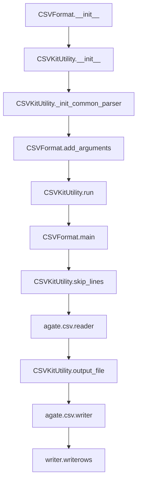

# `csvformat.py`

## `csvkit.utilities.csvformat.CSVFormat` · *class*

## Summary:
A CSV processing utility that converts CSV files to custom output formats with configurable delimiter, quoting, and line termination settings.

## Description:
The CSVFormat class is a command-line utility that reads CSV data from input and writes it to output with customizable formatting options. It extends CSVKitUtility to provide specialized CSV conversion capabilities, allowing users to change output delimiters, quoting styles, quote characters, and other CSV formatting parameters. This utility is particularly useful for transforming CSV data between different formats or applying specific output conventions.

The class is designed to be instantiated and run through the standard CSVKit utility lifecycle, where it processes command-line arguments, opens input files, and performs the CSV conversion according to specified formatting options. It supports advanced features like skipping header rows, handling default headers, and various CSV writer configuration parameters.

## State:
- description (str): Set to 'Convert a CSV file to a custom output format.' - describes the utility's purpose
- override_flags (list): Set to ['L', 'blanks', 'date-format', 'datetime-format'] - flags that are excluded from standard argument parsing
- reader_kwargs (dict): Configuration parameters for CSV reader creation, inherited from CSVKitUtility
- writer_kwargs (dict): Configuration parameters for CSV writer creation, populated by _extract_csv_writer_kwargs method
- args (argparse.Namespace): Parsed command-line arguments containing formatting options
- output_file (file-like object): Output destination for formatted CSV data
- input_file (file-like object): Input file handle for reading CSV data

## Lifecycle:
- Creation: Instantiated with standard CSVKitUtility initialization, typically via command-line interface
- Usage: Called through CSVKitUtility.run() method which orchestrates argument parsing, file handling, and main() execution
- Destruction: Managed automatically by CSVKitUtility parent class which handles file cleanup

## Method Map:


## Raises:
- NotImplementedError: Raised by the parent CSVKitUtility.base class methods that are not overridden
- ValueError: Potentially raised by CSVKitUtility.skip_lines() if skip_lines argument is invalid
- IOError: Raised by file operations during input/output processing
- csv.Error: Raised by agate.csv.reader/writer during CSV parsing/formatting

## Example:
```python
# Typical usage from command line:
# csvformat -D ';' input.csv > output.csv

# Programmatic usage:
from csvkit.utilities.csvformat import CSVFormat
import sys

# Create instance with command-line arguments
utility = CSVFormat(['input.csv', '-D', ';'])
# Run the utility (processes CSV and writes to stdout)
utility.run()

# With tab delimiter and custom quoting:
utility = CSVFormat(['input.csv', '-T', '-Q', '"', '-U', '1'])
utility.run()

# Skip header row in output:
utility = CSVFormat(['input.csv', '-E'])
utility.run()
```

### `csvkit.utilities.csvformat.CSVFormat.add_arguments` · *method*

## Summary:
Configures command-line argument parser with CSV formatting options for output file customization.

## Description:
Adds command-line arguments to the utility's argument parser that control various aspects of CSV output formatting. This method is called during the initialization phase of CSVKit utilities to extend the standard argument parser with formatting-specific options. It allows users to customize delimiter, quoting, line termination, and other CSV output characteristics through command-line flags.

The method is part of the CSVKitUtility base class and is intended to be overridden by subclasses to provide their specific argument configurations. It integrates seamlessly with the existing CSV processing framework by adding arguments to the shared `self.argparser` instance.

Known callers:
- CSVKitUtility._init_common_parser: Called during utility initialization to configure standard CSV processing arguments
- This method is part of the standard CSVKit utility lifecycle and is invoked as part of the argument parsing setup phase

This logic is separated into its own method to follow the standard CSVKit pattern where subclasses implement their specific argument configuration while inheriting common functionality from CSVKitUtility.

## Args:
    None

## Returns:
    None

## Raises:
    None

## State Changes:
    Attributes READ: 
        - self.argparser: The argument parser instance to which arguments are added
    Attributes WRITTEN:
        - self.argparser: Arguments are added to the parser instance

## Constraints:
    Preconditions:
        - The instance must have a properly initialized `argparser` attribute (typically set by parent class)
        - The method should only be called during object initialization or setup phase
    Postconditions:
        - The argument parser contains all CSV formatting-related command-line options
        - All arguments are properly configured with appropriate help text and validation

## Side Effects:
    None

## Detailed Argument Information:
This method adds the following command-line arguments:
- -E, --skip-header: Do not output a header row
- -D, --out-delimiter: Delimiting character of the output CSV file
- -T, --out-tabs: Specify that the output CSV file is delimited with tabs (overrides -D)
- -Q, --out-quotechar: Character used to quote strings in the output CSV file
- -U, --out-quoting: Quoting style used in the output CSV file (0 = Quote Minimal, 1 = Quote All, 2 = Quote Non-numeric, 3 = Quote None)
- -B, --out-no-doublequote: Whether or not double quotes are doubled in the output CSV file
- -P, --out-escapechar: Character used to escape the delimiter in the output CSV file
- -M, --out-lineterminator: Character used to terminate lines in the output CSV file

### `csvkit.utilities.csvformat.CSVFormat._extract_csv_writer_kwargs` · *method*

*No documentation generated.*

### `csvkit.utilities.csvformat.CSVFormat.main` · *method*

## Summary:
Processes and reformats CSV data with optional header handling and writes the result to output.

## Description:
Main execution method for the CSVFormat utility that reads CSV data from input, applies header processing logic based on command-line arguments, and writes the formatted output to the designated output file. This method orchestrates the core CSV processing workflow by managing input file handling, header row processing, and data output.

The method handles several special cases:
- When no input is provided, it warns the user that it's waiting for standard input
- When --no-header-row is specified, it generates default headers and preserves the first data row
- When --skip-header is specified, it skips the first header row from input

This logic is encapsulated in its own method rather than being inlined because it represents a distinct processing phase that needs to be reusable and testable independently from other CSV processing utilities.

## Args:
    self: The CSVFormat instance containing command-line arguments and file handles

## Returns:
    None: This method performs I/O operations but does not return a value

## Raises:
    None: This method does not explicitly raise exceptions, though underlying I/O operations may raise exceptions

## State Changes:
    Attributes READ:
        - self.args.no_header_row: Boolean flag indicating if default headers should be generated
        - self.args.skip_header: Boolean flag indicating if first row should be skipped
        - self.reader_kwargs: Dictionary of keyword arguments for CSV reader creation
        - self.writer_kwargs: Dictionary of keyword arguments for CSV writer creation
        - self.output_file: File-like object for writing output data
        - self.args.input_path: Command-line argument specifying input file path (for additional_input_expected check)
    Attributes WRITTEN:
        - None: This method does not modify instance state directly

## Constraints:
    Preconditions:
        - self.skip_lines() must successfully return a valid file handle
        - self.output_file must be a writable file-like object
        - self.reader_kwargs and self.writer_kwargs must contain valid arguments for agate.csv.reader/writer
        - Command-line arguments must be parsed and available in self.args
        - Input file must be opened and accessible through the parent CSVKitUtility infrastructure

    Postconditions:
        - All CSV data from input is written to output with appropriate header handling
        - Input file handle is properly managed through the skip_lines() method
        - Output file is written with the configured CSV formatting
        - Standard input warning is displayed when appropriate

## Side Effects:
    - Writes to stderr when additional input is expected (when no input file is provided)
    - Reads from input file stream via agate.csv.reader
    - Writes to output file stream via agate.csv.writer
    - May trigger file opening/closing operations through the parent CSVKitUtility infrastructure

## `csvkit.utilities.csvformat.launch_new_instance` · *function*

## Summary:
Launches a new instance of the CSVFormat utility to process CSV data with custom formatting options.

## Description:
This function serves as a factory method that instantiates and executes the CSVFormat command-line utility. It creates a new CSVFormat instance and immediately invokes its run() method to process CSV input according to specified formatting parameters. This pattern allows for clean instantiation and execution of the CSV processing utility without requiring explicit management of the utility lifecycle.

The function is typically called as part of the standard csvkit command-line interface entry point mechanism, where command-line tools are launched through dedicated entry functions that create and execute utility instances. This approach ensures proper initialization of the utility's argument parsing, file handling, and CSV processing components.

## Args:
    None

## Returns:
    None

## Raises:
    None explicitly raised by this function

## Constraints:
    Preconditions:
    - The CSVFormat class must be properly defined and inherit from CSVKitUtility
    - The CSVKitUtility base class must be properly initialized
    - Command-line arguments must be available via sys.argv or equivalent
    
    Postconditions:
    - A CSVFormat instance is created and executed
    - The utility processes CSV input according to command-line arguments
    - Standard CSVKit utility lifecycle is followed (init → run → main)

## Side Effects:
    - Reads from standard input or specified input files
    - Writes to standard output or specified output files
    - Processes command-line arguments from sys.argv
    - May open and close file handles for input/output operations

## Control Flow:
```mermaid
flowchart TD
    A[launch_new_instance() called] --> B[Create CSVFormat() instance]
    B --> C[Call utility.run()]
    C --> D[CSVFormat.run() executes]
    D --> E[Argument parsing occurs]
    E --> F[Input file opened]
    F --> G[CSV processing performed]
    G --> H[Output written]
    H --> I[Utility terminates]
```

## Examples:
    # Typical usage in command-line context:
    # python -m csvkit.utilities.csvformat input.csv --delimiter ';' --quotechar '"'
    
    # Programmatic usage:
    from csvkit.utilities.csvformat import launch_new_instance
    launch_new_instance()
```

