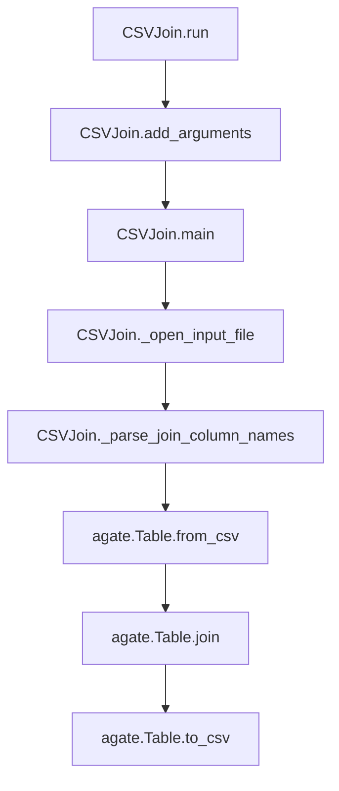

# `csvjoin.py`

## `csvkit.utilities.csvjoin.CSVJoin` · *class*

## Summary:
A command-line utility that executes SQL-like joins to merge multiple CSV files based on specified column(s).

## Description:
CSVJoin is a command-line utility that implements SQL-style JOIN operations on multiple CSV files. It extends CSVKitUtility to provide functionality for merging datasets by matching values in specified columns across files. The utility supports various join types including inner, left, right, and outer joins, and can process files from disk or stdin.

As a subclass of CSVKitUtility, CSVJoin leverages the base class's infrastructure for argument parsing, file handling, and CSV processing while implementing specific join logic for CSV data manipulation.

## State:
- input_files (list): List of opened file handles for input CSV files
- args (argparse.Namespace): Parsed command-line arguments containing join configuration
- output_file (file-like object): Output destination for merged results
- reader_kwargs (dict): Configuration parameters for CSV readers
- writer_kwargs (dict): Configuration parameters for CSV writers

## Lifecycle:
- Creation: Instantiated via CSVKitUtility framework, typically through command-line invocation
- Usage: Called via the run() method inherited from CSVKitUtility, which processes arguments and executes main()
- Destruction: Automatically closes input files during processing and manages output stream

## Method Map:


## Raises:
- SystemExit: Raised by argparser.error() when validation fails (invalid arguments, missing required parameters)
- ValueError: May be raised by underlying CSV processing when invalid parameters are encountered

## Example:
```bash
# Join two CSV files on a common column
csvjoin -c id file1.csv file2.csv > merged.csv

# Perform a left outer join on multiple files
csvjoin --left -c "id,name" file1.csv file2.csv file3.csv > left_joined.csv

# Join files without specifying columns (sequential join)
csvjoin file1.csv file2.csv > sequential.csv
```

### `csvkit.utilities.csvjoin.CSVJoin.add_arguments` · *method*

## Summary:
Configures command-line argument parser with options for CSV file joining operations.

## Description:
This method initializes the argument parser with all available command-line options for the CSV join utility. It defines arguments for specifying input files, join columns, join types (inner, outer, left, right), and CSV parsing configuration. This method is part of the CSVKit utility framework and is called during the initialization phase of the CSVJoin command-line tool to set up available command-line options.

## Args:
    None - this method does not accept parameters directly

## Returns:
    None

## Raises:
    None explicitly raised

## State Changes:
    Attributes READ: None
    Attributes WRITTEN: self.argparser (modifies the argument parser instance by adding multiple arguments)

## Constraints:
    Preconditions: 
    - self.argparser must be initialized and accessible
    - This method should only be called during object initialization/setup phase
    
    Postconditions:
    - The argument parser is configured with all required CSV join options
    - All command-line arguments are properly registered with their help text and defaults

## Side Effects:
    None - this method only configures the argument parser and doesn't perform I/O or external service calls

### `csvkit.utilities.csvjoin.CSVJoin.main` · *method*

*No documentation generated.*

### `csvkit.utilities.csvjoin.CSVJoin._parse_join_column_names` · *method*

## Summary:
Parses a comma-separated string of column names into a list of stripped column name strings.

## Description:
Converts a comma-delimited string of column identifiers into a list of individual column names with leading/trailing whitespace removed. This method is used to process the --columns argument when joining CSV files, allowing users to specify multiple join columns separated by commas.

## Args:
    join_string (str): A comma-separated string containing column names to be parsed.

## Returns:
    list[str]: A list of column name strings with whitespace stripped from each element.

## Raises:
    None

## State Changes:
    Attributes READ: None
    Attributes WRITTEN: None

## Constraints:
    Preconditions:
    - join_string must be a valid string
    - join_string may contain comma-separated column names with optional whitespace
    
    Postconditions:
    - Returns a list of strings with no empty elements (unless the input contains empty elements)
    - All returned strings have leading and trailing whitespace removed

## Side Effects:
    None

## `csvkit.utilities.csvjoin.launch_new_instance` · *function*

## Summary:
Launches a new instance of the CSVJoin command-line utility to execute SQL-like joins on multiple CSV files.

## Description:
This function serves as the entry point for launching the CSVJoin utility from command-line contexts. It creates a new instance of the CSVJoin class and invokes its run() method to process command-line arguments and execute the join operation. The function abstracts away the instantiation and execution details, providing a clean interface for utility initialization.

The function is typically called by the csvkit command-line framework when the csvjoin utility is invoked, allowing for proper setup of argument parsing, file handling, and CSV processing before executing the join logic.

## Args:
    None

## Returns:
    None

## Raises:
    None explicitly raised by this function, though underlying CSVJoin and CSVKitUtility methods may raise exceptions during execution.

## Constraints:
    Preconditions:
    - The csvkit command-line environment must be properly initialized
    - Standard input/output streams must be available for file operations
    - Required CSV files must be accessible if specified in command-line arguments
    
    Postconditions:
    - A CSVJoin instance is created and executed
    - Command-line arguments are parsed and processed
    - Join operation is performed on specified CSV files
    - Results are written to the configured output destination

## Side Effects:
    - Creates a new CSVJoin instance
    - Parses command-line arguments through CSVKitUtility infrastructure
    - Opens and reads input CSV files (if specified)
    - Writes output to stdout or specified output file
    - May read from stdin if no input files are provided
    - May raise exceptions if files are inaccessible or invalid

## Control Flow:
```mermaid
flowchart TD
    A[launch_new_instance called] --> B[Create CSVJoin instance]
    B --> C[Call utility.run()]
    C --> D[CSVJoin.run() parses args]
    D --> E[CSVJoin.main() executes join logic]
    E --> F[Output written to destination]
```

## Examples:
```python
# Typical usage in command-line context
# $ csvkit csvjoin file1.csv file2.csv -c 1,2

# Programmatic usage (as part of csvkit framework)
from csvkit.utilities.csvjoin import launch_new_instance
launch_new_instance()
```

