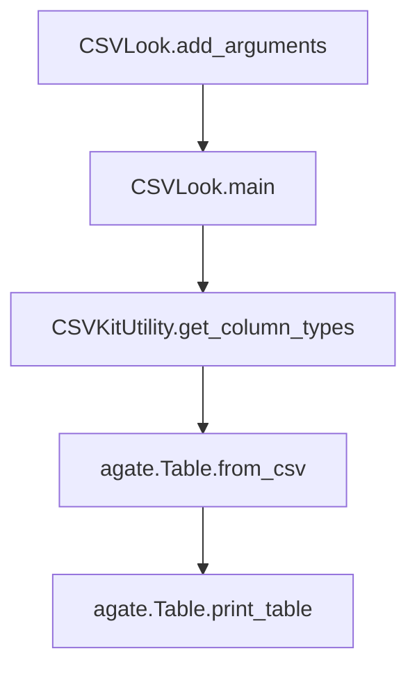

# `csvlook.py`

## `csvkit.utilities.csvlook.CSVLook` · *class*

## Summary:
Renders CSV files as Markdown-compatible, fixed-width tables in the console.

## Description:
The CSVLook class is a command-line utility that transforms CSV data into a formatted, readable table layout suitable for terminal display. It inherits from CSVKitUtility and provides specialized functionality for displaying CSV content in a structured, aligned format that's compatible with Markdown syntax. This utility is particularly useful for quickly inspecting CSV data in terminal environments without requiring a spreadsheet application.

The class is designed to be used through the csvkit command-line interface, where it processes CSV files according to various formatting options provided via command-line arguments.

## State:
- description (str): Set to 'Render a CSV file in the console as a Markdown-compatible, fixed-width table.'
- argparser (argparse.ArgumentParser): Inherited from CSVKitUtility, used for parsing command-line arguments
- args (argparse.Namespace): Parsed command-line arguments containing formatting options
- input_file (file-like object): Inherited from CSVKitUtility, represents the opened input CSV file
- output_file (file-like object): Inherited from CSVKitUtility, represents the output destination (default stdout)
- reader_kwargs (dict): Inherited from CSVKitUtility, contains CSV reader configuration parameters
- writer_kwargs (dict): Inherited from CSVKitUtility, contains CSV writer configuration parameters

## Lifecycle:
- Creation: Created by the csvkit command-line framework when the csvlook command is invoked
- Usage: The run() method is called by the framework, which orchestrates execution by calling the main() method to process the CSV
- Destruction: Managed by CSVKitUtility's lifecycle, including automatic file closure

## Method Map:


## Raises:
- SystemExit: Raised by self.argparser.error() when no input file or piped data is provided
- NotImplementedError: Inherited from CSVKitUtility, would occur if base methods aren't properly implemented (though this is handled by the class implementation)

## Example:
```bash
# Display CSV file with default formatting
csvlook data.csv

# Limit displayed rows and columns
csvlook --max-rows 10 --max-columns 5 data.csv

# Truncate long columns and limit decimal precision
csvlook --max-column-width 20 --max-precision 2 data.csv

# Disable type inference for raw data display
csvlook --no-inference data.csv
```

### `csvkit.utilities.csvlook.CSVLook.add_arguments` · *method*

## Summary:
Configures command-line arguments for CSV table rendering with display formatting controls.

## Description:
Adds command-line arguments to the argument parser for controlling how CSV data is displayed as a Markdown-compatible table. This method defines options for limiting display size (rows/columns), controlling column width, managing numeric precision, and configuring CSV parsing behavior.

The method is part of the standard CSVKitUtility framework where subclasses implement `add_arguments()` to define their command-line interface. It is called automatically during utility initialization before argument parsing occurs.

## Args:
    self: The CSVLook instance whose argparser will be modified

## Returns:
    None: This method modifies the instance's argparser in-place and returns nothing

## Raises:
    None: This method does not raise exceptions directly

## State Changes:
    Attributes READ: None
    Attributes WRITTEN: self.argparser (modified in-place by adding arguments)

## Constraints:
    Preconditions: 
    - The method must be called on a CSVLook instance that has an initialized argparser attribute
    - The argparser must be an argparse.ArgumentParser instance
    
    Postconditions:
    - The argparser will contain all defined command-line arguments for CSV display formatting
    - All arguments will be properly configured with appropriate types, defaults, and help text

## Side Effects:
    None: This method only modifies the internal argparser object and has no external I/O or side effects

## Arguments Added:
    --max-rows: Integer specifying maximum number of rows to display before truncating data
    --max-columns: Integer specifying maximum number of columns to display before truncating data  
    --max-column-width: Integer specifying maximum width for columns (truncated with ellipsis)
    --max-precision: Integer specifying maximum decimal places for numeric values (truncated with ellipsis)
    --no-number-ellipsis: Boolean flag to disable ellipsis when max-precision is exceeded
    -y/--snifflimit: Integer limiting CSV dialect sniffing to specified bytes (0 to disable, -1 to sniff entire file)
    -I/--no-inference: Boolean flag to disable type inference when parsing input

### `csvkit.utilities.csvlook.CSVLook.main` · *method*

## Summary:
Processes CSV input and displays it in a formatted table layout with configurable display options.

## Description:
The main method orchestrates the core functionality of the csvlook utility by validating input requirements, configuring display parameters, reading CSV data using the agate library, and rendering the formatted output. This method serves as the central execution point that coordinates all aspects of CSV table display functionality.

This method is separated from other logic to maintain clean separation of concerns, allowing the CSVKitUtility base class to handle argument parsing and file management while this method focuses specifically on the CSV processing and display workflow.

## Args:
    self: The CSVLook instance containing command-line arguments and state.

## Returns:
    None: This method performs I/O operations but does not return a value.

## Raises:
    SystemExit: Raised by self.argparser.error() when no input file or piped data is provided.

## State Changes:
    Attributes READ: 
        - self.args.max_precision: Maximum decimal precision for numeric values
        - self.args.no_number_ellipsis: Flag to disable number truncation ellipsis
        - self.args.sniff_limit: Limit for CSV dialect detection
        - self.args.skip_lines: Number of initial lines to skip
        - self.args.line_numbers: Flag to include line numbers in output
        - self.args.max_rows: Maximum number of rows to display
        - self.args.max_columns: Maximum number of columns to display
        - self.args.max_column_width: Maximum width for each column
        - self.args.input_path: Path to input file (via parent class)
        - self.args: All command-line arguments parsed by argparse
        
    Attributes WRITTEN: 
        - self.output_file: Output destination (inherited from parent class)
        - self.input_file: Input file handle (inherited from parent class)
        - agate.config: Configuration setting for number truncation (when no_number_ellipsis is set)

## Constraints:
    Preconditions:
        - Command-line arguments must be parsed before calling this method
        - Either an input file path must be provided or data must be piped to stdin
        - self.input_file must be properly opened and accessible
        - self.output_file must be properly initialized and writable
        
    Postconditions:
        - CSV data is read from input and displayed in formatted table
        - Display parameters are applied according to command-line options
        - Output is written to the configured output destination

## Side Effects:
    - Reads from stdin or input file handle (self.input_file)
    - Writes formatted table output to stdout or output file (self.output_file)
    - Modifies global agate configuration when no_number_ellipsis flag is set
    - May raise SystemExit if input validation fails

## `csvkit.utilities.csvlook.launch_new_instance` · *function*

## Summary:
Launches a new instance of the CSVLook command-line utility to render CSV files as Markdown-compatible, fixed-width tables in the console.

## Description:
This function serves as the primary entry point for executing the csvlook command-line utility. It creates a new instance of the CSVLook class and invokes its run method to process CSV data according to command-line arguments. This follows the standard pattern used by all csvkit utilities for launching command-line tools.

The function is typically called by the csvkit command-line framework when the csvlook utility is invoked, allowing for proper setup of argument parsing, file handling, and CSV processing before executing the display logic. This pattern enables clean separation between utility instantiation and execution, making the code more modular and testable.

## Args:
    None

## Returns:
    None (The function does not return any meaningful value. Execution continues through the CSVLook utility's run method which handles the actual CSV processing and console output.)

## Raises:
    SystemExit: Raised by the underlying CSVKitUtility.run() method when command-line arguments are invalid or when processing completes successfully
    IOError: Raised by file I/O operations when reading input files or writing output files fails
    csv.Error: Raised by CSV parsing when malformed CSV data is encountered
    MemoryError: Raised when insufficient memory is available for processing large CSV files

## Constraints:
    Preconditions:
    - Command-line arguments must be available in sys.argv for parsing
    - Input files must be readable and output directories must be writable
    - Environment must support file system operations
    
    Postconditions:
    - A CSVLook utility instance is created and executed
    - Command-line arguments are parsed and processed
    - CSV data is rendered as a formatted, readable table in the console
    - Results are written to the configured output destination (typically stdout)

## Side Effects:
    - Parses command-line arguments from sys.argv
    - Reads input CSV files from disk or stdin
    - Writes formatted table data to stdout or specified output file
    - May read from stdin if no input files are provided
    - May write to stderr when prompting for standard input or displaying error messages

## Control Flow:
```mermaid
flowchart TD
    A[launch_new_instance called] --> B[Create CSVLook instance]
    B --> C[Call utility.run()]
    C --> D{Argument parsing complete}
    D --> E{Input expected?}
    E -->|No| F[Display waiting message to stderr]
    E -->|Yes| G[Open input file or stdin]
    G --> H[Process CSV data with CSVLook logic]
    H --> I[Render CSV as Markdown-compatible table]
    I --> J[Write formatted output to destination]
    J --> K[End]
```

## Examples:
```bash
# Display CSV file with default formatting
csvlook data.csv

# Limit displayed rows and columns
csvlook --max-rows 10 --max-columns 5 data.csv

# Truncate long columns and limit decimal precision
csvlook --max-column-width 20 --max-precision 2 data.csv

# Disable type inference for raw data display
csvlook --no-inference data.csv

# Display column names only
csvlook -n data.csv
```

