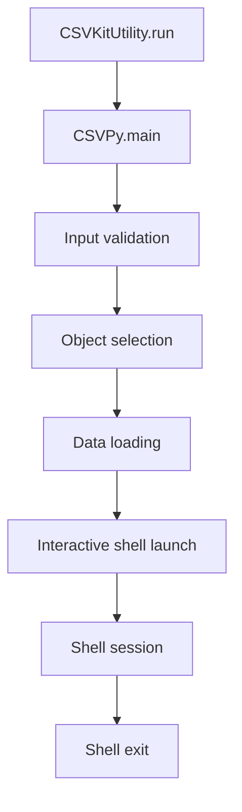

# `csvpy.py`

## `csvkit.utilities.csvpy.CSVPy` · *class*

## Summary:
CSVPy is a command-line utility that loads CSV data into Python objects and launches an interactive Python shell for exploration.

## Description:
CSVPy is designed to facilitate interactive exploration of CSV data by loading it into different Python data structures and providing an interactive shell environment. It serves as a debugging and analysis tool that allows users to inspect CSV data programmatically without writing separate scripts. The utility supports three loading modes: standard CSV reader, DictReader for dictionary-based access, and agate Table for advanced data analysis operations.

This class extends CSVKitUtility, inheriting standard CSV processing capabilities like argument parsing, file handling, and CSV configuration options. It's particularly useful for data scientists, analysts, and developers who want to quickly examine CSV datasets in an interactive environment.

## State:
- input_file (file-like object): The opened input file handle containing CSV data (inherited from CSVKitUtility)
- args (argparse.Namespace): Parsed command-line arguments (inherited from CSVKitUtility)
- reader_kwargs (dict): Configuration parameters for CSV readers (inherited from CSVKitUtility)
- output_file (file-like object): Output destination (inherited from CSVKitUtility)
- argparser (argparse.ArgumentParser): Argument parser instance (inherited from CSVKitUtility)
- description (str): Description text for the argument parser (defined in class)

## Lifecycle:
- Creation: Instantiated by the csvkit framework when invoked as a command-line utility, calling CSVKitUtility.__init__() which calls add_arguments()
- Usage: The framework calls CSVKitUtility.run() which executes the main() method
- Destruction: Automatically closes input file when CSVKitUtility.run() completes

## Method Map:


## Raises:
- SystemExit: Raised by argparser.error() when input is piped via STDIN
- ImportError: Raised when IPython is not available and falls back to code.interact()

## Example:
```bash
# Load CSV as standard reader
python csvpy.py data.csv

# Load CSV as DictReader
python csvpy.py data.csv --dict

# Load CSV as agate Table
python csvpy.py data.csv --agate
```

In the interactive shell, users can then explore the loaded data:
```python
# After launching with --dict
>>> reader.fieldnames
['name', 'age', 'city']
>>> next(reader)
{'name': 'John', 'age': '25', 'city': 'New York'}

# After launching with --agate
>>> table.column_names
['name', 'age', 'city']
>>> table.rows[0]
('John', '25', 'New York')
```

### `csvkit.utilities.csvpy.CSVPy.add_arguments` · *method*

*No documentation generated.*

### `csvkit.utilities.csvpy.CSVPy.main` · *method*

## Summary:
Launches an interactive Python shell with a CSV file loaded into a reader object for exploration and analysis.

## Description:
This method initializes a CSV file loading process and drops the user into an interactive Python environment where they can examine and manipulate the loaded CSV data. It supports three different loading modes: regular CSV reader, DictReader for dictionary-based access, or agate Table for advanced data analysis operations. The method provides a convenient way to interactively explore CSV datasets without writing separate scripts.

The method is called during the execution lifecycle of the csvpy utility, specifically after argument parsing and file initialization have completed. It serves as the core interface for the interactive CSV exploration feature.

## Args:
    self: The CSVPy instance containing configuration and file handles

## Returns:
    None: This method does not return a value but exits when the interactive session ends

## Raises:
    SystemExit: Raised by self.argparser.error() when input is provided via stdin (piped data)
    ImportError: Raised when IPython is not available and falls back to code.interact()

## State Changes:
    Attributes READ:
        - self.input_file: File handle for the input CSV file
        - self.args: Parsed command-line arguments
        - self.reader_kwargs: CSV reader configuration parameters
    Attributes WRITTEN: None

## Constraints:
    Preconditions:
        - self.input_file must be a valid file handle (not sys.stdin)
        - The CSV file must be readable
        - Command-line arguments must be parsed successfully
    Postconditions:
        - An interactive Python shell session is launched with the CSV data loaded
        - The appropriate CSV reader/table object is available in the shell namespace

## Side Effects:
    - Opens and reads the specified CSV file
    - Launches an interactive Python shell (IPython or Python's code.interact)
    - Prints a welcome message to stdout
    - May import IPython or Python's code module dynamically

## Usage Context:
This method is invoked as part of the CSVKit utility execution flow, specifically when the csvpy command is run with a CSV file as input. It's designed to provide an immediate interactive environment for data exploration, making it useful for quick data inspection and prototyping analysis workflows.

## Mode Details:
When using the --dict flag, the CSV data is loaded as an agate.csv.DictReader object named 'reader' which allows dictionary-style access to columns by name.
When using the --agate flag, the CSV data is loaded as an agate.Table object named 'table' which provides powerful data analysis capabilities.
Without any flags, the CSV data is loaded as a regular agate.csv.reader object named 'reader' which provides row-by-row iteration.

## `csvkit.utilities.csvpy.launch_new_instance` · *function*

## Summary:
Creates and executes a new instance of the CSVPy command-line utility for interactive CSV data exploration.

## Description:
This function serves as the primary entry point for launching the csvpy command-line utility. It instantiates a CSVPy class and invokes its run method to process CSV data interactively through a Python shell. The function follows the standard csvkit pattern of separating utility instantiation from execution, enabling clean command-line interface handling and proper resource management.

The CSVPy utility is specifically designed for interactive exploration of CSV data, allowing users to load CSV files into different Python data structures (standard reader, DictReader, or agate Table) and then interact with them in a Python shell environment. This makes it particularly valuable for data analysis, debugging, and quick exploratory data analysis tasks.

## Args:
    None

## Returns:
    None (The function does not return any meaningful value. Execution continues through the CSVPy utility's run method which handles the actual CSV processing and interactive shell session.)

## Raises:
    SystemExit: Raised by the underlying CSVKitUtility.run() method when command-line arguments are invalid or when processing completes successfully
    ImportError: Raised when IPython is not available and falls back to code.interact() for shell launching
    IOError: Raised by file I/O operations when reading input files fails
    csv.Error: Raised by CSV parsing when malformed CSV data is encountered

## Constraints:
    Preconditions:
    - Command-line arguments must be available in sys.argv for parsing
    - Input files must be readable and output directories must be writable
    - Environment must support file system operations and interactive shell sessions
    
    Postconditions:
    - A CSVPy utility instance is created and executed
    - Command-line arguments are parsed and processed
    - CSV data is loaded into the selected Python data structure
    - An interactive Python shell is launched for data exploration

## Side Effects:
    - Parses command-line arguments from sys.argv
    - Reads input CSV files from disk or stdin
    - Launches an interactive Python shell (either IPython or standard Python)
    - May read from stdin if no input files are provided
    - May write to stderr when prompting for standard input or displaying error messages

## Control Flow:
```mermaid
flowchart TD
    A[launch_new_instance called] --> B[Create CSVPy instance]
    B --> C[Call utility.run()]
    C --> D{Argument parsing complete}
    D --> E{Input expected?}
    E -->|No| F[Display waiting message to stderr]
    E -->|Yes| G[Open input file or stdin]
    G --> H[Load CSV data into selected structure]
    H --> I{Interactive shell mode?}
    I -->|Yes| J[Launch interactive Python shell]
    J --> K[Shell session active]
    K --> L[Shell exits]
    I -->|No| M[Process and exit normally]
    M --> N[End]
```

## Examples:
```bash
# Launch CSVPy with default settings (loads as standard reader)
python csvpy.py data.csv

# Launch CSVPy with DictReader mode
python csvpy.py data.csv --dict

# Launch CSVPy with agate Table mode
python csvpy.py data.csv --agate

# Launch CSVPy with piped input
echo "a,b,c\n1,2,3" | python csvpy.py

# Launch CSVPy with custom delimiter
python csvpy.py data.csv -d ';'
```

