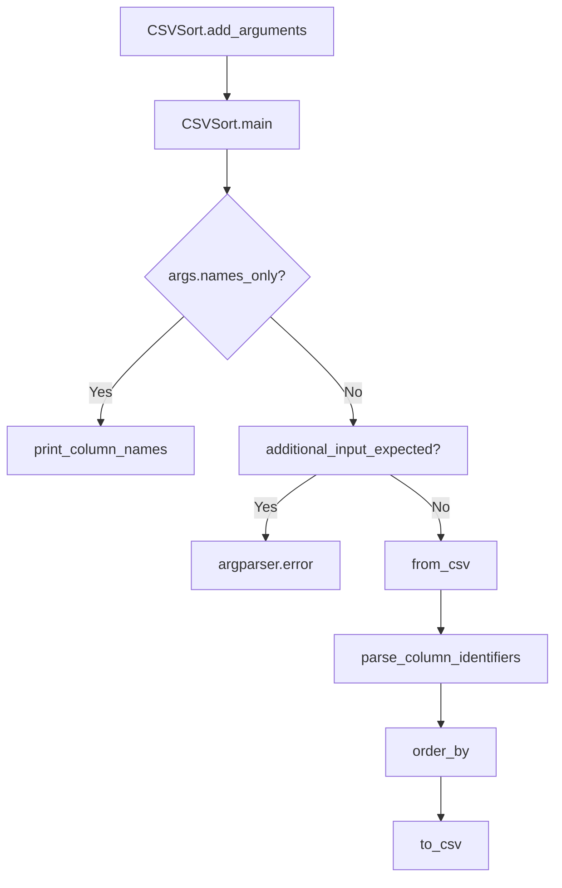

# `csvsort.py`

## `csvkit.utilities.csvsort.CSVSort` · *class*

## Summary:
A command-line utility for sorting CSV files by specified columns, implementing functionality similar to the Unix "sort" command but for tabular data.

## Description:
The CSVSort class provides a command-line interface for sorting CSV files based on one or more columns. It allows users to specify which columns to sort by, the sort order (ascending or descending), and various CSV parsing options. The utility supports sorting by column names, indices, or ranges, and can handle large files with configurable sniffing limits.

This class is part of the csvkit toolkit and inherits standard CSV processing capabilities from CSVKitUtility, including automatic file handling, argument parsing, and CSV reader/writer configuration.

## State:
- description (str): Set to 'Sort CSV files. Like the Unix "sort" command, but for tabular data.'
- argparser (argparse.ArgumentParser): Configured with command-line arguments for sorting options
- args (argparse.Namespace): Parsed command-line arguments containing sorting parameters
- input_file (file-like object): Input CSV file handle (inherited from CSVKitUtility)
- output_file (file-like object): Output destination (inherited from CSVKitUtility)
- reader_kwargs (dict): CSV reader configuration parameters (inherited from CSVKitUtility)
- writer_kwargs (dict): CSV writer configuration parameters (inherited from CSVKitUtility)

## Lifecycle:
- Creation: Instantiated as a CSVKitUtility subclass, typically by the command-line runner
- Usage: Called via the run() method which executes main() after setting up input/output streams
- Destruction: Automatically closes input file when run() completes (inherited from CSVKitUtility)

## Method Map:


## Raises:
- SystemExit: Raised by argparser.error() when no input file is provided and stdin is not connected to a pipe
- NotImplementedError: Inherited from CSVKitUtility base class if not properly implemented (though CSVSort overrides these)

## Example:
```bash
# Sort by first column (ascending)
csvsort input.csv > sorted_output.csv

# Sort by second column (descending)
csvsort -r -c 2 input.csv > sorted_output.csv

# Sort by multiple columns (first by name, then by age)
csvsort -c name,age input.csv > sorted_output.csv

# Display column names and indices
csvsort -n input.csv
```

### `csvkit.utilities.csvsort.CSVSort.add_arguments` · *method*

## Summary:
Configures command-line argument parser with sorting-specific options for CSV file sorting utility.

## Description:
Adds utility-specific command-line arguments to the argument parser for the CSV sorting functionality. This method extends the base CSVKitUtility argument parser with options that control how CSV files are sorted, including column selection, sort direction, and CSV parsing behavior.

The method is called during the initialization phase of CSVSort utility instances, after common CSV arguments have been set up but before argument parsing occurs. It defines the interface for controlling CSV sorting operations through command-line flags.

## Args:
    self: The CSVSort instance whose argument parser will be modified.

## Returns:
    None

## Raises:
    None

## State Changes:
    Attributes READ: 
        - self.argparser: The argument parser instance being modified
    Attributes WRITTEN:
        - self.argparser: Modified to include sorting-specific arguments

## Constraints:
    Preconditions:
        - The instance must have completed initialization of `self.argparser` (typically via `_init_common_parser()`)
        - The method should only be called during object initialization, not after argument parsing
    Postconditions:
        - The argument parser contains both common CSV arguments and sorting-specific arguments

## Side Effects:
    None

## Arguments Added:
- `-n, --names`: Display column names and indices from the input CSV and exit.
- `-c, --columns`: A comma-separated list of column indices, names or ranges to sort by (e.g., "1,id,3-5"). Defaults to all columns.
- `-r, --reverse`: Sort in descending order.
- `-y, --snifflimit`: Limit CSV dialect sniffing to the specified number of bytes. Specify "0" to disable sniffing entirely, or "-1" to sniff the entire file.
- `-I, --no-inference`: Disable type inference when parsing the input.

### `csvkit.utilities.csvsort.CSVSort.main` · *method*

## Summary:
Sorts CSV data by specified columns and outputs the result to a file or stdout.

## Description:
Processes CSV input data by sorting rows according to specified column identifiers, then writes the sorted data to the output destination. This method implements the core sorting functionality for the csvsort utility, supporting multi-column sorting with optional reverse ordering.

## Args:
    self: The CSVSort instance containing command-line arguments and file handles.

## Returns:
    None: This method performs I/O operations and does not return a value.

## Raises:
    SystemExit: Raised by self.argparser.error() when no input file or piped data is provided.

## State Changes:
    Attributes READ: 
        - self.args.names_only: Flag to display column names only
        - self.args.columns: Column identifier string for sorting
        - self.args.skip_lines: Number of initial lines to skip
        - self.args.sniff_limit: Limit for CSV dialect detection
        - self.args.reverse: Flag to sort in descending order
        - self.input_file: Input file handle
        - self.output_file: Output file handle
        - self.reader_kwargs: CSV reader configuration parameters
        - self.writer_kwargs: CSV writer configuration parameters
    Attributes WRITTEN: 
        - None: This method does not modify instance state directly

## Constraints:
    Preconditions:
        - self.args must contain all required attributes (columns, skip_lines, sniff_limit, reverse, names_only)
        - self.input_file must be opened and readable
        - self.output_file must be opened and writable
        - If not using --names-only, input data must be provided via file path or stdin
        
    Postconditions:
        - If --names-only is specified, column names are printed to output_file
        - If sorting is performed, output_file contains sorted CSV data
        - Input and output files remain open after execution

## Side Effects:
    - Reads from self.input_file (CSV input)
    - Writes to self.output_file (sorted CSV output)
    - May read from stdin if no input file is specified and input is not piped
    - Calls external libraries (agate) for CSV processing and sorting

## `csvkit.utilities.csvsort.launch_new_instance` · *function*

## Summary:
Creates and executes a new instance of the CSVSort command-line utility for sorting CSV files.

## Description:
This function serves as the primary entry point for launching the csvsort command-line utility. It instantiates a CSVSort class and invokes its run method to process CSV data according to command-line arguments. The function follows the standard csvkit pattern of separating utility instantiation from execution, enabling clean command-line interface handling and proper resource management.

This logic is extracted into its own function rather than being inlined because it provides a standardized way to launch CSV utilities, ensuring consistent initialization and execution patterns across all csvkit tools. It also makes testing easier by isolating the instantiation and execution concerns.

## Args:
    None

## Returns:
    None (The function does not return any meaningful value. Execution proceeds through the CSVSort utility's run method which calls main() to handle the actual CSV processing and sorting.)

## Raises:
    SystemExit: Raised by the underlying CSVKitUtility.run() method when command-line arguments are invalid or when processing completes successfully
    IOError: Raised by file I/O operations when reading input files or writing output files fails
    csv.Error: Raised by CSV parsing when malformed CSV data is encountered

## Constraints:
    Preconditions:
    - Command-line arguments must be available in sys.argv for parsing
    - Input files must be readable and output directories must be writable
    - Environment must support file system operations
    
    Postconditions:
    - A CSVSort utility instance is created and executed
    - Command-line arguments are parsed and processed
    - CSV data is sorted according to specified columns and order
    - Results are written to the configured output destination

## Side Effects:
    - Parses command-line arguments from sys.argv
    - Reads input CSV files from disk or stdin
    - Writes sorted CSV data to stdout or specified output file
    - May read from stdin if no input files are provided
    - May write to stderr when prompting for standard input or displaying error messages

## Control Flow:
```mermaid
flowchart TD
    A[launch_new_instance called] --> B[Create CSVSort instance]
    B --> C[Call utility.run()]
    C --> D{Argument parsing complete}
    D --> E{Input expected?}
    E -->|No| F[Display waiting message to stderr]
    E -->|Yes| G[Open input file or stdin]
    G --> H[Parse CSV data and sort columns]
    H --> I[Write sorted output to destination]
    I --> J[End]
```

## Examples:
```bash
# Sort CSV file by first column (ascending)
csvsort input.csv

# Sort CSV file by first column (descending)
csvsort -r input.csv

# Sort CSV file by second column
csvsort -c 2 input.csv

# Sort CSV file by multiple columns
csvsort -c 1,3 input.csv

# Sort CSV file with custom delimiter
csvsort -d ';' input.csv

# Sort CSV file and write to output file
csvsort input.csv > sorted_output.csv
```

