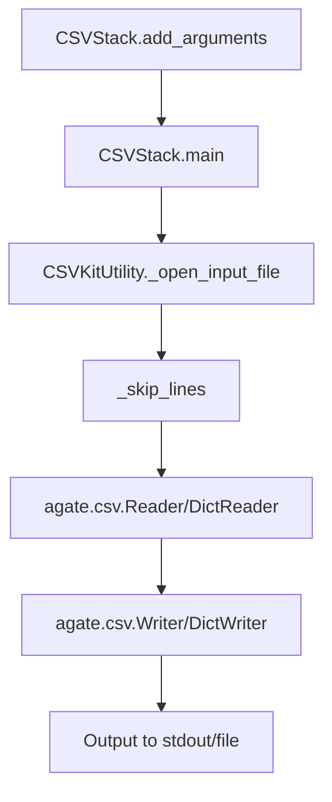

# `csvstack.py`

## `csvkit.utilities.csvstack._skip_lines` · *function*

## Summary:
Skips a specified number of lines from a file handle by reading and discarding them.

## Description:
The `_skip_lines` function reads and discards a specified number of lines from a file handle, typically used to skip header rows, comment lines, or other non-data content at the beginning of CSV files. This function is designed to be a reusable helper that abstracts away the low-level file reading logic for line skipping operations.

The function is extracted into its own utility to separate concerns and provide a clean interface for line-skipping operations without tightly coupling this logic to the main CSV processing flow. It ensures that only integer values are accepted for the number of lines to skip, providing type safety.

## Args:
    f (file-like object): A file handle from which lines will be read and discarded
    args (object): An object containing a `skip_lines` attribute that specifies how many lines to skip

## Returns:
    int: The number of lines that were successfully skipped (equal to args.skip_lines)

## Raises:
    ValueError: When args.skip_lines is not an integer type

## Constraints:
    Preconditions:
    - The `f` parameter must be a file-like object with a readline() method
    - The `args.skip_lines` attribute must be an integer value
    - The file handle must be readable from its current position

    Postconditions:
    - The file pointer of `f` will be advanced by exactly `args.skip_lines` lines
    - The function will have consumed and discarded all specified lines from the file

## Side Effects:
    - Reads from the file handle `f`, advancing the file pointer
    - May trigger file I/O operations depending on the underlying file implementation

## Control Flow:
```mermaid
flowchart TD
    A[Start _skip_lines] --> B{isinstance(args.skip_lines, int)?}
    B -->|No| C[Raise ValueError]
    B -->|Yes| D[Initialize skip_lines = args.skip_lines]
    D --> E[while skip_lines > 0]
    E --> F[f.readline()]
    F --> G[skip_lines -= 1]
    G --> H{skip_lines > 0?}
    H -->|Yes| E
    H -->|No| I[Return skip_lines]
```

## Examples:
    # Skip 3 lines from a file handle
    file_handle = open('data.csv', 'r')
    class Args:
        skip_lines = 3
    skipped = _skip_lines(file_handle, Args())
    # file_handle is now positioned at the start of the 4th line
    
    # Error case - non-integer skip_lines
    class Args:
        skip_lines = "5"
    try:
        _skip_lines(file_handle, Args())
    except ValueError as e:
        print(e)  # "skip_lines argument must be an int"
```

## `csvkit.utilities.csvstack.CSVStack` · *class*

## Summary:
CSVStack is a command-line utility that stacks rows from multiple CSV files into a single output, optionally adding grouping information to distinguish the source of each row.

## Description:
CSVStack provides functionality to vertically concatenate multiple CSV files by stacking their rows. It's particularly useful for combining datasets from similar sources while preserving their origin information. The utility supports both file-based input and piped stdin, and can optionally add a grouping column to identify which source file each row originated from.

This class extends CSVKitUtility, inheriting standard CSV processing capabilities like argument parsing, file handling, and CSV reader/writer configuration. It implements the specific logic for stacking CSV files while managing header consistency and optional grouping metadata.

## State:
- input_paths (list[str]): List of input file paths, with '-' representing stdin, defaults to ['-']
- groups (str or None): Comma-separated grouping values when using -g flag
- group_name (str or None): Name for the grouping column when using -g flag
- group_by_filenames (bool): Whether to use filenames as grouping values when using --filenames flag
- use_fieldnames (bool): Whether to use first row as headers (False when --no-header-row is specified)
- headers (list[str]): Combined header names from all input files
- stdin_fieldnames (list[str]): Fieldnames from stdin when applicable
- stdin_first_row (list[str]): First row data from stdin when applicable

## Lifecycle:
- Creation: Instantiated via command-line interface or programmatically with arguments
- Usage: Called via CSVKitUtility.run() which executes main() method
- Destruction: Automatic cleanup handled by parent class when run() completes

## Method Map:


## Raises:
- SystemExit: Raised by self.argparser.error() when grouping values don't match input files count
- ValueError: Raised by _skip_lines() when skip_lines argument is not an integer
- IOError: Raised by file operations when input files cannot be opened or read
- UnicodeDecodeError: Raised when files cannot be decoded with specified encoding

## Example:
```bash
# Stack two CSV files with custom grouping
python csvstack.py file1.csv file2.csv -g "source1,source2" -n "dataset"

# Stack files with grouping by filenames
python csvstack.py *.csv --filenames

# Stack from stdin
cat data.csv | python csvstack.py -g "stdin" -n "source"

# Stack without headers
python csvstack.py file1.csv file2.csv --no-header-row
```

### `csvkit.utilities.csvstack.CSVStack.add_arguments` · *method*

## Summary:
Configures command-line arguments for the CSV stacking utility, enabling specification of input files and grouping behavior.

## Description:
Adds command-line argument definitions to the argument parser for the csvstack utility. This method establishes the interface for specifying multiple CSV input files and configuring how rows from these files are grouped in the stacked output. The method follows the CSVKitUtility pattern of separating argument parsing from core processing logic.

The csvstack utility combines multiple CSV files by stacking their rows vertically. This method defines the command-line interface that allows users to specify:
- Input CSV files (or STDIN via '-' default)
- Grouping factors to add as a new column in the output
- Custom names for the grouping column
- Whether to use filenames as grouping values

This method is called during the initialization phase of the CSVStack utility to prepare the argument parser before execution.

## Args:
    self: The CSVStack instance whose argument parser will be configured

## Returns:
    None: This method modifies the instance's argument parser in-place

## Raises:
    None: This method does not raise exceptions directly

## State Changes:
    Attributes READ: None
    Attributes WRITTEN: self.argparser (modifies the argument parser instance)

## Constraints:
    Preconditions: 
    - The method must be called on a CSVStack instance that has an initialized argparser attribute
    - The argparser must be an argparse.ArgumentParser instance
    
    Postconditions:
    - The argparser will contain the defined arguments for input files and grouping options
    - All argument defaults and help text will be properly configured

## Side Effects:
    None: This method only modifies the argument parser instance and does not perform I/O or external service calls

### `csvkit.utilities.csvstack.CSVStack.main` · *method*

## Summary:
Stacks multiple CSV files into a single output file, optionally adding group identifiers to distinguish rows from different input files.

## Description:
The main method processes multiple CSV input files and combines them into a single output CSV file. It handles both regular CSV files and standard input, supports optional grouping of rows by source file, and manages header row handling appropriately. The method orchestrates the entire CSV stacking process from input file opening to output writing.

This logic is separated into its own method because it contains the core business logic for the CSV stacking operation, including:
- Input validation and error handling for grouping parameters
- Header row processing and field name collection
- File opening and reading with proper resource management
- Row-by-row output writing with optional grouping metadata
- Support for both header and no-header row modes

## Args:
    self: The CSVStack instance containing configuration and state

## Returns:
    None: This method performs I/O operations and does not return a value

## Raises:
    SystemExit: Raised via argparser.error() when grouping values don't match input file count
    IOError: Raised when file operations fail (opening, reading, writing)
    ValueError: Raised when skip_lines argument is not an integer (via _skip_lines helper function)

## State Changes:
    Attributes READ:
    - self.args.input_paths: List of input file paths or '-' for stdin
    - self.args.groups: Comma-separated group names or None
    - self.args.group_by_filenames: Boolean indicating if filenames should be used as groups
    - self.args.group_name: Name for group column or None (defaults to 'group')
    - self.args.no_header_row: Boolean indicating if input files lack headers
    - self.args.skip_lines: Number of lines to skip at start of files
    - self.output_file: Output file handle for writing results
    - self.reader_kwargs: Keyword arguments for CSV reader creation
    - self.writer_kwargs: Keyword arguments for CSV writer creation
    - self.argparser: Argument parser instance for error reporting

    Attributes WRITTEN:
    - None: This method doesn't modify instance state beyond using existing attributes

## Constraints:
    Preconditions:
    - self.args.input_paths must be a list of valid file paths or '-' for stdin
    - If self.args.groups is provided, it must contain exactly one value per input file
    - All input files must be readable
    - Output file must be writable

    Postconditions:
    - All input files are properly closed after reading
    - Output file contains properly formatted stacked CSV data
    - Group column (if enabled) is added as first column with appropriate values

## Side Effects:
    - Writes to stdout or specified output file
    - Reads from multiple input files or stdin
    - May write to stderr when waiting for stdin input
    - Opens and closes file handles for input files through inherited _open_input_file method
    - Processes input files by calling _skip_lines helper function to skip specified lines

## `csvkit.utilities.csvstack.launch_new_instance` · *function*

## Summary:
Creates and executes a CSVStack utility instance to vertically concatenate CSV files.

## Description:
This function serves as the primary entry point for launching the CSVStack command-line utility. It instantiates a CSVStack object and invokes its run() method to process CSV files according to the configured arguments. The function is designed to be called from command-line interfaces or programmatic entry points to execute the CSV stacking functionality.

The CSVStack utility vertically concatenates rows from multiple CSV files, optionally adding grouping information to identify the source of each row. This function encapsulates the instantiation and execution workflow, providing a clean interface for launching the utility.

## Args:
    None

## Returns:
    None

## Raises:
    None explicitly raised by this function. Exceptions may be raised by CSVStack.run() or underlying CSV processing methods.

## Constraints:
    Preconditions:
        - The function assumes that command-line arguments are properly configured in the environment
        - CSVStack class must be properly imported and available in the namespace
        - Standard CSVKit utility initialization requirements are met
        
    Postconditions:
        - A CSVStack instance is created and executed
        - The utility processes input CSV files and produces stacked output to stdout or specified output file

## Side Effects:
    - Reads input CSV files from disk or stdin
    - Writes concatenated CSV output to stdout or specified output file
    - May read command-line arguments from sys.argv
    - May perform I/O operations on files and standard streams

## Control Flow:
```mermaid
flowchart TD
    A[launch_new_instance() called] --> B[Create CSVStack() instance]
    B --> C[Call utility.run()]
    C --> D[CSVStack.run() executes]
    D --> E[CSVStack.main() processes files]
    E --> F[Output stacked CSV to stdout/file]
    F --> G[Function returns]
```

## Examples:
    # Typical usage from command line (via csvstack executable)
    $ csvstack file1.csv file2.csv > stacked_output.csv
    
    # Programmatic usage
    from csvkit.utilities.csvstack import launch_new_instance
    launch_new_instance()
    
    # With stdin input
    echo "a,b,c" | csvstack - > output.csv
```

