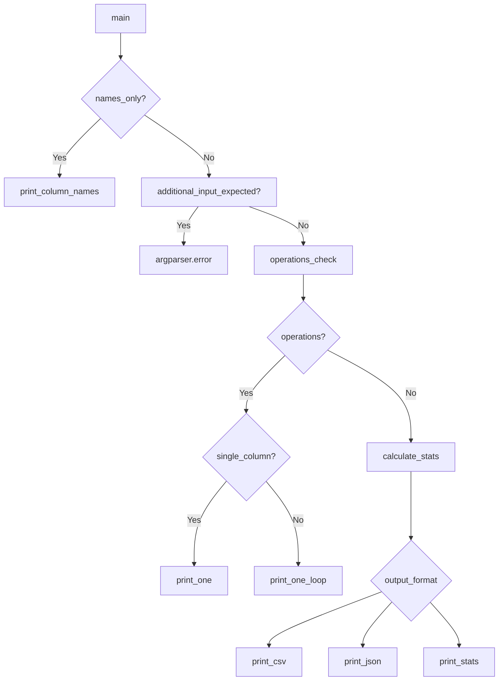

# `csvstat.py`

## `csvkit.utilities.csvstat.CSVStat` · *class*

## Summary:
CSVStat is a command-line utility class that computes and displays descriptive statistics for columns in CSV files.

## Description:
CSVStat processes CSV data to compute various statistical measures for each column, supporting multiple output formats (text, CSV, JSON) and selective statistic calculation. It serves as a tool for quickly analyzing CSV datasets by providing insights into data types, null values, unique counts, min/max values, sums, means, medians, standard deviations, and frequency distributions.

The class extends CSVKitUtility, inheriting command-line argument handling capabilities and integrating with the agate library for CSV processing and statistical computations. It provides a flexible interface for examining CSV data through various statistical lenses.

## State:
- `description`: Class attribute describing the utility's purpose
- Command-line arguments parsed by argparser (via CSVKitUtility inheritance):
  - `csv_output`: Boolean flag for CSV output format
  - `json_output`: Boolean flag for JSON output format  
  - `indent`: Integer for JSON indentation
  - `names_only`: Boolean flag to display column names only
  - `columns`: String specifying columns to analyze
  - `type_only`, `nulls_only`, `nonnulls_only`, etc.: Boolean flags for specific statistics
  - `freq_count`: Integer for limiting frequent value display
  - `decimal_format`: String for decimal number formatting
  - `no_grouping_separator`: Boolean flag to disable grouping separators
  - `sniff_limit`: Integer for CSV dialect sniffing limit
  - `no_inference`: Boolean flag to disable type inference

## Lifecycle:
Creation: Instantiated automatically by the CSVKit framework when invoked via command line. Requires proper initialization through CSVKitUtility parent class.

Usage: Called via the `main()` method which orchestrates the statistical analysis workflow:
1. Parse command-line arguments through `add_arguments()` 
2. Handle special modes (names-only, count-only)
3. Validate argument combinations
4. Load CSV data into agate Table using `agate.Table.from_csv()`
5. Parse column identifiers using `parse_column_identifiers()`
6. Compute requested statistics through various helper methods
7. Format and output results in selected format (text, CSV, or JSON)

Destruction: Managed by Python garbage collection; no explicit cleanup required.

## Method Map:


## Raises:
- `argparse.ArgumentError`: When conflicting command-line options are provided (e.g., --csv with --mean)
- `argparse.ArgumentTypeError`: When argument values are invalid (e.g., negative freq_count)
- Various exceptions from agate.Table.from_csv() when reading malformed CSV data
- `IOError`: When input/output files cannot be accessed
- `SystemExit`: Through argparser.error() when validation fails

## Example:
```bash
# Display basic statistics for all columns
csvstat data.csv

# Show only column names and indices
csvstat --names data.csv

# Calculate mean for specific column
csvstat --mean -c 1 data.csv

# Output as CSV
csvstat --csv data.csv

# Output as JSON with indentation
csvstat --json -i 2 data.csv

# Show only unique value counts
csvstat --unique data.csv
```

### `csvkit.utilities.csvstat.CSVStat.add_arguments` · *method*

## Summary:
Configures command-line arguments for the csvstat utility, enabling comprehensive CSV data analysis with flexible output formats and statistical options.

## Description:
This method extends the base argument parser with utility-specific command-line options that enable detailed statistical analysis of CSV data. It adds arguments for controlling output format (CSV, JSON, plain text), selecting specific columns for analysis, and choosing which statistical measures to compute (mean, median, standard deviation, min, max, etc.). The method is called during the initialization phase of CSVKitUtility subclasses to provide users with full control over how CSV statistics are computed and displayed.

## Args:
    self: The CSVStat instance whose argument parser will be modified.

## Returns:
    None

## Raises:
    None

## State Changes:
    Attributes READ: 
        - self.argparser: The argument parser instance being modified
    Attributes WRITTEN:
        - self.argparser: Modified to include csvstat-specific arguments

## Constraints:
    Preconditions:
        - The instance must have completed initialization of `self.argparser` (typically via `_init_common_parser()`)
        - The method should only be called during object initialization, not after argument parsing
    Postconditions:
        - The argument parser contains both common CSV arguments and csvstat-specific arguments

## Side Effects:
    None

### `csvkit.utilities.csvstat.CSVStat.main` · *method*

## Summary:
Processes CSV input and generates descriptive statistics or specific column analyses based on command-line arguments, serving as the primary entry point for the CSVStat utility.

## Description:
The main method orchestrates the analysis of CSV files according to user-specified command-line options. It implements a sophisticated flow control system that handles multiple operational modes including:
- Displaying column names only (--names)
- Counting rows (--count) 
- Performing specific statistical operations (--mean, --median, etc.)
- Generating comprehensive statistics in text (--default), CSV (--csv), or JSON (--json) formats

This method is called during the execution lifecycle of the CSVStat utility after argument parsing has completed. It validates command-line arguments, reads CSV data using agate.Table.from_csv(), parses column identifiers, and dispatches to appropriate analysis methods based on the selected operation mode.

The method is designed to be the central coordination point for all CSV statistical analysis operations, routing execution to specialized handlers like print_one(), calculate_stats(), print_stats(), print_csv(), or print_json() based on the command-line configuration.

## Args:
    self: The CSVStat instance containing command-line arguments and utility state

## Returns:
    None: This method performs I/O operations and does not return a value

## Raises:
    SystemExit: Raised by self.argparser.error() when validation fails for mutually exclusive arguments or missing input

## State Changes:
    Attributes READ:
    - self.args: Command-line arguments and configuration including names_only, count_only, csv_output, json_output, columns, freq_count, and operation flags
    - self.input_file: Input file handle for CSV reading
    - self.output_file: Output file handle for result writing
    - self.reader_kwargs: CSV reader configuration parameters
    - self.argparser: Argument parser instance for error reporting
    
    Attributes WRITTEN:
    - self.output_file: Written to during output generation

## Constraints:
    Preconditions:
    - self.args must be populated with parsed command-line arguments
    - self.input_file must be accessible for reading CSV data
    - self.output_file must be writable for result output
    - OPERATIONS constant must be defined in module scope
    - CSV input must be valid and readable
    
    Postconditions:
    - Appropriate statistical analysis is written to self.output_file
    - Method exits cleanly after completing its designated operation
    - All validation checks pass before proceeding to analysis

## Side Effects:
    - Reads from self.input_file (CSV data)
    - Writes to self.output_file (analysis results)
    - Calls agate.Table.from_csv() to parse CSV data
    - Calls various helper methods for specific operations (print_column_names, print_one, calculate_stats, print_stats, print_csv, print_json)
    - May call self.argparser.error() which terminates program execution with error code
    - Processes command-line arguments and validates their combinations

### `csvkit.utilities.csvstat.CSVStat.is_finite_decimal` · *method*

## Summary:
Checks if a value is a finite Decimal instance for proper formatting in statistical output.

## Description:
This method determines whether a given value is both an instance of the Decimal class and represents a finite decimal number (as opposed to infinity or NaN). It is used primarily in statistical calculations to distinguish between regular decimal values that should be formatted and special decimal cases (like infinity or NaN) that should be handled differently. The method is called in contexts where decimal formatting needs to be applied selectively.

Known callers:
- `_calculate_stat` method: Used to determine if a calculated statistic should be formatted with decimal formatting
- `print_stats` method: Used to format decimal values in output display

This logic is separated into its own method to avoid code duplication and to provide a clear, reusable check for decimal finiteness throughout the CSVStat class.

## Args:
    value (Any): The value to check, typically expected to be a numeric type such as Decimal.

## Returns:
    bool: True if the value is a finite Decimal instance, False otherwise.

## Raises:
    None: This method does not raise any exceptions.

## State Changes:
    Attributes READ: None
    Attributes WRITTEN: None

## Constraints:
    Preconditions: The value parameter can be of any type, though the method is designed to work with numeric types.
    Postconditions: The method returns a boolean indicating the finiteness of the Decimal value.

## Side Effects:
    None: This method performs only type checking and does not cause any I/O, external service calls, or mutations to objects outside its scope.

### `csvkit.utilities.csvstat.CSVStat._calculate_stat` · *method*

## Summary:
Calculates a statistical measure for a specified column in a CSV table using either a custom getter function or aggregation operations.

## Description:
This private method serves as the core calculation engine for statistical operations in the CSVStat utility. It dynamically selects between custom getter functions (like get_mean, get_median, etc.) and standard agate aggregation operations based on availability. The method handles special formatting for decimal numbers and suppresses agate warnings during calculation.

The method is called internally by `print_one` and `calculate_stats` methods to compute individual statistics for columns. It's designed to be a reusable component that abstracts away the complexity of choosing between different calculation approaches and handling edge cases like decimal formatting.

## Args:
    table (agate.Table): The CSV table containing the data to analyze
    column_id (int or str): The column identifier (index or name) to analyze
    op_name (str): Name of the operation to perform (e.g., 'mean', 'median', 'sum')
    op_data (dict): Dictionary containing operation metadata including 'aggregation' key
    **kwargs: Additional keyword arguments passed to getter functions

## Returns:
    Various: The calculated statistic value, which could be a number, string, or other data type depending on the operation performed. Returns None when an exception occurs during calculation.

## Raises:
    None explicitly raised - the method catches all exceptions and silently passes

## State Changes:
    Attributes READ: 
    - self.args (for json_output flag and decimal formatting options)
    - self.is_finite_decimal (method call)
    
    Attributes WRITTEN: None

## Constraints:
    Preconditions:
    - table must be a valid agate.Table instance
    - column_id must reference a valid column in the table
    - op_data must be a dictionary containing an 'aggregation' key
    - op_name must be a valid operation name that either corresponds to a getter function or maps to an available aggregation
    
    Postconditions:
    - Returns a calculated statistic value for the specified column
    - Decimal formatting is applied when appropriate
    - Agate warnings are suppressed during execution

## Side Effects:
    - Suppresses agate.NullCalculationWarning warnings during execution
    - May perform I/O operations through the table.aggregate() method
    - Uses locale-based formatting for decimal numbers when applicable

### `csvkit.utilities.csvstat.CSVStat.print_one` · *method*

## Summary:
Formats and outputs a single statistical measure for a specified column in a CSV table.

## Description:
This method computes and displays a single statistical operation result for a given column. It is primarily used internally by the CSVStat utility when processing specific operations (--mean, --median, etc.) on individual columns. The method handles special formatting for frequency distributions and provides labeled or unlabeled output formats.

The method is called from the main execution flow when a single operation is specified with a single column, or when iterating through multiple columns for a single operation. It serves as a building block for the larger statistical reporting functionality.

## Args:
    table (agate.Table): The CSV table containing the data to analyze
    column_id (int): The index of the column to calculate statistics for
    op_name (str): Name of the statistical operation to perform (e.g., 'mean', 'median', 'freq')
    label (bool): Whether to include column name and index prefix in output. Defaults to True
    **kwargs: Additional keyword arguments passed to the underlying calculation methods

## Returns:
    None: This method performs I/O operations and does not return a value

## Raises:
    None explicitly raised - the method relies on internal error handling in _calculate_stat

## State Changes:
    Attributes READ:
    - self.output_file: File handle for writing output
    - OPERATIONS: Global constant defining available operations and their metadata
    
    Attributes WRITTEN:
    - self.output_file: Written to with formatted statistical output

## Constraints:
    Preconditions:
    - table must be a valid agate.Table instance
    - column_id must be a valid index for the table's columns
    - op_name must be a valid operation name present in the OPERATIONS constant
    - OPERATIONS constant must be defined in the module scope
    
    Postconditions:
    - Output is written to self.output_file in a formatted manner
    - For 'freq' operations, output is formatted as a dictionary-like string
    - Column name and index are included in output when label=True

## Side Effects:
    - Writes formatted text to self.output_file
    - May perform I/O operations through the table.aggregate() method via _calculate_stat
    - Uses locale-based formatting for decimal numbers when applicable

### `csvkit.utilities.csvstat.CSVStat.calculate_stats` · *method*

## Summary:
Computes all available statistical measures for a specified column in a CSV table.

## Description:
Calculates a comprehensive set of descriptive statistics for a given column by invoking the underlying calculation methods for each supported operation. This method serves as the core statistics computation engine for the CSVStat utility when analyzing full column statistics rather than specific operations.

## Args:
    table (agate.Table): The table containing the data to analyze
    column_id (int): The index of the column to calculate statistics for
    **kwargs: Additional keyword arguments passed through to individual calculation methods

## Returns:
    dict: A dictionary mapping operation names to their calculated values for the specified column

## Raises:
    None explicitly raised - exceptions are caught internally in _calculate_stat

## State Changes:
    Attributes READ: None
    Attributes WRITTEN: None

## Constraints:
    Preconditions: 
    - table must be a valid agate.Table instance
    - column_id must be a valid index for the table's columns
    - OPERATIONS constant must be defined in the module scope
    
    Postconditions:
    - Returns a dictionary with keys matching operation names in OPERATIONS
    - Values are the computed statistics or None if calculation failed

## Side Effects:
    None

### `csvkit.utilities.csvstat.CSVStat.print_stats` · *method*

## Summary:
Formats and writes detailed statistical information for specified columns in a CSV table to the output file.

## Description:
This method generates human-readable statistical summaries for each specified column in a CSV table. It processes column statistics computed by other methods and formats them with proper alignment and labeling. The output includes descriptive statistics such as counts, minimum/maximum values, means, medians, standard deviations, and frequency distributions for each column.

The method is called as part of the normal CSV statistics workflow when the user requests full statistical output (not specific operations like --mean or --median). It organizes output with proper column numbering, labels, and formatting including decimal number localization and frequency distribution display.

## Args:
    table (agate.Table): The CSV table containing the data to analyze
    column_ids (list[int]): List of column indices to generate statistics for
    stats (dict): Dictionary mapping column indices to their computed statistics dictionaries

## Returns:
    None

## Raises:
    None explicitly raised - the method relies on underlying I/O operations that may raise exceptions

## State Changes:
    Attributes READ: 
    - self.output_file (writes formatted statistics to output)
    - self.args (accesses decimal_format and no_grouping_separator for formatting)
    - self.is_finite_decimal (method call for decimal validation)
    
    Attributes WRITTEN: None

## Constraints:
    Preconditions:
    - table must be a valid agate.Table instance
    - column_ids must contain valid indices for table.columns
    - stats must be a dictionary with column_id keys mapping to statistics dictionaries
    - OPERATIONS constant must be defined in module scope with appropriate structure
    
    Postconditions:
    - Statistics for all specified columns are written to self.output_file
    - Output follows a consistent format with proper alignment and labeling
    - Row count is appended at the end of the output

## Side Effects:
    - Writes formatted text output to self.output_file
    - Performs I/O operations through self.output_file.write()
    - Calls self.is_finite_decimal() method for decimal validation
    - Uses locale-based formatting through format_decimal() function

### `csvkit.utilities.csvstat.CSVStat.print_csv` · *method*

## Summary
Writes statistical summary data for CSV columns in CSV format to the output file.

## Description
This method formats and outputs statistical information for specified CSV columns in a structured CSV table format. It serves as the CSV output handler for the csvstat utility, converting calculated statistics into rows with standardized column headers. The method is called from the main execution flow when the --csv flag is specified.

The method processes frequency data specially by converting frequency lists into comma-separated string representations for CSV compatibility. It uses the _rows helper method to generate data rows and writes them using agate's DictWriter.

## Args
- table: agate.Table instance containing the CSV data
- column_ids: list of integer column indices to process  
- stats: dictionary mapping column IDs to their calculated statistics

## Returns
None

## Raises
- IOError: If writing to self.output_file fails
- agate.csv.Error: If there are issues with CSV writing operations

## State Changes
- Attributes READ: self.output_file, OPERATIONS (referenced but not defined in provided code)
- Attributes WRITTEN: None

## Constraints
- Preconditions: 
  - table must be a valid agate.Table instance
  - column_ids must be a list of valid column indices
  - stats must be a dictionary with proper structure matching column_ids
  - OPERATIONS must be defined in the module scope (contains statistical operations)
- Postconditions: 
  - CSV header row is written to self.output_file with columns: 'column_id', 'column_name', and all keys from OPERATIONS
  - One row per column is written to self.output_file with statistics for each operation

## Side Effects
- Writes formatted CSV data to self.output_file
- Processes frequency data by joining value/count pairs into comma-separated strings in the format "value1 (count1x), value2 (count2x), ..."

### `csvkit.utilities.csvstat.CSVStat.print_json` · *method*

## Summary:
Outputs statistical analysis data for CSV columns in JSON format to the configured output file.

## Description:
This method generates a JSON representation of statistical information for specified CSV columns and writes it to the output file. It is typically called during the CSV statistics analysis phase of the CSVStat utility workflow.

The method processes the provided table data, column identifiers, and statistical information through the internal `_rows` helper method to construct a data structure suitable for JSON serialization, then outputs it with proper formatting.

## Args:
    table: The CSV table data structure containing rows of data
    column_ids: Identifiers specifying which columns to include in the statistics
    stats: Statistical information computed for the specified columns

## Returns:
    None: This method performs I/O operations and does not return a value

## Raises:
    TypeError: If the data structure generated by `_rows` cannot be serialized to JSON
    IOError: If writing to `self.output_file` fails

## State Changes:
    Attributes READ: 
    - self.output_file: File handle for JSON output
    - self.args.indent: Indentation setting for JSON formatting
    
    Attributes WRITTEN: None

## Constraints:
    Preconditions:
    - `self.output_file` must be a writable file-like object
    - `self.args.indent` must be a valid integer or None for JSON formatting
    - The data structure returned by `self._rows()` must be JSON serializable
    
    Postconditions:
    - The statistical data is written to `self.output_file` in valid JSON format
    - The output follows the specified indentation settings

## Side Effects:
    - Writes formatted JSON data to the file handle stored in `self.output_file`
    - May raise I/O errors if the output file cannot be written to

### `csvkit.utilities.csvstat.CSVStat._rows` · *method*

*No documentation generated.*

## `csvkit.utilities.csvstat.format_decimal` · *function*

## Summary:
Formats a decimal number according to locale settings with customizable precision and grouping separators.

## Description:
This utility function provides localized formatting for decimal numbers, allowing for configurable precision and optional grouping separators. It leverages Python's locale module to ensure proper regional formatting conventions while cleaning up trailing zeros from the result. The function is designed to produce human-readable decimal representations suitable for display in various locales.

## Args:
    d (float or Decimal): The decimal number to format
    f (str, optional): Format string specifying precision. Defaults to '%.3f' (3 decimal places)
    no_grouping_separator (bool, optional): If True, disables thousands grouping separators. Defaults to False

## Returns:
    str: Formatted decimal string with trailing zeros removed and optional grouping separators applied. Returns empty string for zero values or when formatting fails.

## Raises:
    ValueError: When the format string is invalid for locale.format_string
    TypeError: When the input 'd' is not a numeric type compatible with locale.format_string

## Constraints:
    Preconditions:
    - The input 'd' must be a numeric type that can be processed by locale.format_string
    - The format string 'f' must be valid for locale.format_string
    
    Postconditions:
    - Returns a string representation of the number with appropriate localization
    - Trailing zeros after the decimal point are stripped
    - Grouping separators are applied based on the no_grouping_separator flag
    - Empty string is returned for special cases like NaN or infinity

## Side Effects:
    None - This function is pure and has no side effects

## Control Flow:
```mermaid
flowchart TD
    A[format_decimal called] --> B{no_grouping_separator}
    B -- True --> C[grouping=False]
    B -- False --> C[grouping=True]
    C --> D[locale.format_string with format f]
    D --> E{Result from locale.format_string}
    E --> F[Remove trailing zeros ('0')]
    F --> G[Remove trailing decimal point]
    G --> H[Return formatted string]
```

## Examples:
    >>> format_decimal(1234.5678)
    '1,234.568'
    
    >>> format_decimal(1234.5678, f='%.2f')
    '1,234.57'
    
    >>> format_decimal(1234.5678, no_grouping_separator=True)
    '1234.568'
    
    >>> format_decimal(1234.000)
    '1,234'
    
    >>> format_decimal(0)
    '0'
```

## `csvkit.utilities.csvstat.get_type` · *function*

## Summary:
Returns the class name of the data type for a specified column in a table.

## Description:
Extracts and returns the class name of the data type associated with a specific column in a table object. This function accesses the data_type attribute of a column and returns its class name as a string.

This function was extracted to provide a clean abstraction for accessing column data type information, separating the concern of type identification from other processing logic in the csvstat utility.

## Args:
    table: A table object that must have a columns attribute containing column objects with data_type attributes.
    column_id (int): Zero-based index of the column whose data type is to be retrieved.
    **kwargs: Additional keyword arguments (currently unused in implementation).

## Returns:
    str: The class name of the data type for the specified column, obtained by calling __class__.__name__ on the column's data_type attribute.

## Raises:
    IndexError: When column_id is outside the valid range of table columns.
    AttributeError: When table.columns or table.columns[column_id].data_type attributes are not accessible.

## Constraints:
    Preconditions:
    - table must be a valid object with a columns attribute
    - column_id must be a valid zero-based index for the table's columns
    - table.columns must be accessible
    - table.columns[column_id] must exist and have a data_type attribute
    
    Postconditions:
    - Returns a string representing the class name of the column's data type
    - The returned string is the result of calling __class__.__name__ on the column's data_type

## Side Effects:
    None

## Control Flow:
```mermaid
flowchart TD
    A[get_type called] --> B[table.columns[column_id] accessed]
    B --> C[data_type accessed]
    C --> D[data_type.__class__.__name__ accessed]
    D --> E[Return class name string]
```

## Examples:
    # Basic usage with a table that has columns with data_type attributes
    type_name = get_type(some_table, 0)
    # Returns the class name string of the first column's data type
    
    # Example showing the expected return value format
    type_name = get_type(another_table, 2)
    # Returns something like 'Integer', 'Text', 'Float', etc.

## `csvkit.utilities.csvstat.get_unique` · *function*

## Summary:
Returns the count of distinct values in a specified column of a CSV table.

## Description:
This function calculates the number of unique values present in a given column of a CSV table. It is used by the csvstat utility to provide statistical information about data uniqueness in CSV datasets. The function leverages the agate library's column analysis capabilities to efficiently compute distinct value counts.

This logic is extracted into its own function to provide a clean abstraction for counting unique values, separating the statistical computation from the broader CSV analysis logic in the csvstat utility.

## Args:
    table (agate.Table): The CSV table containing the data to analyze
    column_id (int or str): The column identifier (index or name) to analyze for unique values
    **kwargs: Additional keyword arguments (unused in current implementation)

## Returns:
    int: The count of distinct values in the specified column

## Raises:
    KeyError: When column_id does not exist in the table
    IndexError: When column_id is out of bounds for the table's columns

## Constraints:
    Preconditions:
    - table must be a valid agate.Table instance
    - column_id must reference a valid column in the table
    - column_id must be either an integer index or a string column name that exists in the table
    
    Postconditions:
    - Returns a non-negative integer representing the count of unique values
    - Does not modify the original table or its columns

## Side Effects:
    None

## Control Flow:
```mermaid
flowchart TD
    A[get_unique called] --> B[table.columns[column_id] accessed]
    B --> C[values_distinct() called]
    C --> D[len() applied to result]
    D --> E[Integer count returned]
```

## Examples:
    # Basic usage with column index
    unique_count = get_unique(my_table, 0)  # Count unique values in first column
    
    # Usage with column name
    unique_count = get_unique(my_table, 'email')  # Count unique email addresses
    
    # Error handling example
    try:
        unique_count = get_unique(my_table, 999)  # Invalid column index
    except IndexError:
        print("Column index out of range")
```

## `csvkit.utilities.csvstat.get_freq` · *function*

## Summary:
Extracts and returns the most frequently occurring values from a specified column in a table.

## Description:
This function retrieves the frequency distribution of values in a given column of a table, returning the top N most common values. It's designed to provide quick statistical insights into data distributions within CSV files.

## Args:
    table: An agate table object containing the data
    column_id: Identifier for the column to analyze (can be index or name)
    freq_count (int): Maximum number of top frequent values to return. Defaults to 5.
    **kwargs: Additional keyword arguments (currently unused in implementation)

## Returns:
    list[dict]: A list of dictionaries, each containing 'value' and 'count' keys representing the most frequent values and their occurrence counts, sorted by frequency in descending order.

## Raises:
    None explicitly raised by this function

## Constraints:
    Preconditions:
    - The table parameter must be a valid agate table object
    - The column_id must reference a valid column in the table
    - The freq_count parameter should be a non-negative integer
    
    Postconditions:
    - Returns a list of dictionaries with 'value' and 'count' keys
    - The returned list is sorted by count in descending order
    - The length of the returned list is at most freq_count elements

## Side Effects:
    None

## Control Flow:
```mermaid
flowchart TD
    A[get_freq called] --> B{table.columns[column_id] exists?}
    B -- Yes --> C[Extract column values]
    C --> D[Count values with Counter]
    D --> E[Get most_common(freq_count)]
    E --> F[Return list of dicts]
    B -- No --> G[Raises AttributeError]
```

## Examples:
    # Basic usage
    freq_data = get_freq(my_table, 0)  # Get top 5 most frequent values from first column
    
    # Custom frequency count
    freq_data = get_freq(my_table, 'category', freq_count=10)  # Get top 10 values

## `csvkit.utilities.csvstat.launch_new_instance` · *function*

## Summary:
Creates and executes a new instance of the CSVStat command-line utility for computing descriptive statistics on CSV files.

## Description:
This function serves as the primary entry point for launching the csvstat command-line utility. It instantiates a CSVStat class and invokes its run method to process CSV data according to command-line arguments. The function follows the standard csvkit pattern of separating utility instantiation from execution, enabling clean command-line interface handling and proper resource management.

The CSVStat utility computes and displays descriptive statistics for columns in CSV files, supporting multiple output formats (text, CSV, JSON) and selective statistic calculation. It provides a flexible interface for quickly analyzing CSV datasets by offering insights into data types, null values, unique counts, min/max values, sums, means, medians, standard deviations, and frequency distributions.

## Args:
    None

## Returns:
    None (The function does not return any meaningful value. Execution continues through the CSVStat utility's run method which handles the actual CSV processing and statistical analysis.)

## Raises:
    SystemExit: Raised by the underlying CSVKitUtility.run() method when command-line arguments are invalid or when processing completes successfully
    IOError: Raised by file I/O operations when reading input files fails
    csv.Error: Raised by CSV parsing when malformed CSV data is encountered
    MemoryError: Raised when insufficient memory is available for processing large CSV files

## Constraints:
    Preconditions:
    - Command-line arguments must be available in sys.argv for parsing
    - Input files must be readable and output directories must be writable
    - Environment must support file system operations
    
    Postconditions:
    - A CSVStat instance is created and executed
    - Command-line arguments are parsed and processed
    - CSV data is analyzed and statistical results are generated
    - Results are written to the configured output destination

## Side Effects:
    - Parses command-line arguments from sys.argv
    - Reads input CSV files from disk or stdin
    - Writes statistical analysis results to stdout or specified output file
    - May read from stdin if no input files are provided
    - May write to stderr when prompting for standard input or displaying error messages

## Control Flow:
```mermaid
flowchart TD
    A[launch_new_instance called] --> B[Create CSVStat instance]
    B --> C[Call utility.run()]
    C --> D{Argument parsing complete}
    D --> E{Input expected?}
    E -->|No| F[Display waiting message to stderr]
    E -->|Yes| G[Open input file or stdin]
    G --> H[Parse CSV data using agate.Table.from_csv()]
    H --> I[Process command-line arguments and compute statistics]
    I --> J{Output format requested?}
    J -->|Text| K[Print statistics to output]
    J -->|CSV| L[Print CSV formatted statistics]
    J -->|JSON| M[Print JSON formatted statistics]
    K --> N[End]
    L --> N
    M --> N
```

## Examples:
```bash
# Display basic statistics for all columns
csvstat data.csv

# Show only column names and indices
csvstat --names data.csv

# Calculate mean for specific column
csvstat --mean -c 1 data.csv

# Output as CSV
csvstat --csv data.csv

# Output as JSON with indentation
csvstat --json -i 2 data.csv

# Show only unique value counts
csvstat --unique data.csv
```

