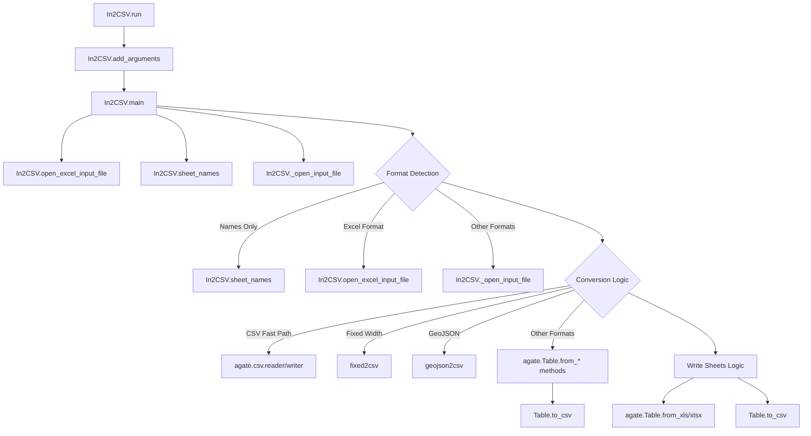

# `in2csv.py`

## `csvkit.utilities.in2csv.In2CSV` · *class*

## Summary:
Converts common but less-awesome tabular data formats to CSV format.

## Description:
The In2CSV class is a command-line utility that transforms various structured data formats into CSV (Comma-Separated Values) format. It supports multiple input formats including Excel spreadsheets (XLS, XLSX), CSV files, fixed-width files, JSON documents, and database files (DBF). The utility can process both file inputs and piped data from standard input, making it flexible for different workflow scenarios.

This class is designed as a distinct abstraction to encapsulate all the logic for detecting input formats, handling different file types appropriately, and performing the actual conversion to CSV. It leverages the agate library for robust data handling and provides extensive command-line options for controlling the conversion process.

## State:
- input_file (file-like object): Handle to the opened input file, set during execution
- output_file (file-like object): Handle to the output destination (inherited from CSVKitUtility)
- args (argparse.Namespace): Parsed command-line arguments (inherited from CSVKitUtility)
- reader_kwargs (dict): Configuration for CSV readers (inherited from CSVKitUtility)
- writer_kwargs (dict): Configuration for CSV writers (inherited from CSVKitUtility)

## Lifecycle:
- Creation: Instantiated by the command-line interface with optional arguments
- Usage: Called via the run() method inherited from CSVKitUtility, which internally calls main()
- Destruction: Automatically closes input and schema files when execution completes

## Method Map:


## Raises:
- ValueError: Raised when schema is required for fixed-width files but not provided, or when DBF files are attempted to be read from stdin
- SystemExit: Raised by argparser.error() when invalid arguments or missing required parameters are detected
- NotImplementedError: Inherited from parent class when not properly implemented (though this shouldn't occur in this class)

## Example:
```python
# Command line usage:
# Convert Excel file to CSV
python in2csv.py data.xlsx > output.csv

# Convert JSON to CSV with specific key
python in2csv.py -k "records" data.json > output.csv

# Convert fixed-width file with schema
python in2csv.py -f fixed -s schema.csv data.txt > output.csv

# Display sheet names from Excel file
python in2csv.py -n data.xlsx

# Write individual sheets to separate files
python in2csv.py --write-sheets "Sheet1,Sheet2" data.xlsx
```

### `csvkit.utilities.in2csv.In2CSV.add_arguments` · *method*

## Summary:
Configures command-line argument parser with options for converting various tabular data formats to CSV.

## Description:
Sets up all command-line arguments for the in2csv utility, enabling conversion of multiple input formats (CSV, Excel, fixed-width, JSON, database files) to CSV format. This method defines the complete CLI interface for the utility, allowing users to specify input files, conversion parameters, and processing options through command-line arguments.

## Args:
    self: The In2CSV instance containing the argument parser to be configured.

## Returns:
    None: Modifies the instance's argument parser in-place by adding multiple command-line arguments.

## Raises:
    None explicitly raised by this method.

## State Changes:
    Attributes READ: None
    Attributes WRITTEN: self.argparser (populated with command-line argument definitions)

## Constraints:
    Preconditions: The In2CSV instance must have an argparser attribute properly initialized.
    Postconditions: The argparser contains all standard and format-specific command-line arguments.

## Side Effects:
    None: This method only configures the argument parser without performing I/O or modifying external state.

## Command-Line Arguments Added:
- FILE (positional): Input file path; if omitted, accepts piped data via STDIN
- -f/--format: Input file format specification (choices limited by SUPPORTED_FORMATS); format inferred if not specified
- -s/--schema: Schema file for fixed-width conversions (CSV-formatted)
- -k/--key: JSON key for extracting object lists when processing JSON files
- -n/--names: Display sheet names from Excel files only
- --sheet: Specific Excel sheet name to process
- --write-sheets: Write specified Excel sheets to separate CSV files (use "-" for all sheets)
- --use-sheet-names: Use sheet names as output file names when using --write-sheets
- --encoding-xls: Specify encoding for XLS files
- -y/--snifflimit: Limit CSV dialect sniffing to specified byte count (0 to disable, -1 for full file)
- -I/--no-inference: Disable type inference and related CSV parsing options

### `csvkit.utilities.in2csv.In2CSV.open_excel_input_file` · *method*

## Summary:
Opens an Excel input file for processing, handling both standard input and regular file paths.

## Description:
This method provides a standardized way to open Excel input files (.xls and .xlsx) for processing within the In2CSV utility. It handles the special case of reading from standard input when the path is '-' or None/empty, returning a BytesIO object containing the stdin data. For regular file paths, it opens the file in binary read mode and returns the file handle.

The method is used internally by the In2CSV class when processing Excel files, particularly in the `sheet_names` method and the main processing loop in `main`.

## Args:
    path (str, optional): Path to the Excel file. If None, empty string, or '-', reads from standard input.

## Returns:
    BytesIO or file-like object: For stdin input, returns a BytesIO object containing stdin data. For file input, returns an open binary file handle.

## Raises:
    IOError: When unable to open the specified file path for reading.

## State Changes:
    Attributes READ: None
    Attributes WRITTEN: None

## Constraints:
    Preconditions:
        - When path is '-' or None/empty, the method assumes stdin data is available
        - When path is a valid file path, the file must be readable
        - The caller is responsible for closing the returned file handle

    Postconditions:
        - Returns a file-like object ready for binary reading operations
        - For stdin, the returned BytesIO object contains all available stdin data
        - For files, the returned file handle is positioned at the beginning of the file

## Side Effects:
    - Reads from standard input when path is '-' or None/empty
    - Opens files for binary reading when path is a valid file path
    - May cause blocking if reading from stdin without available data

### `csvkit.utilities.in2csv.In2CSV.sheet_names` · *method*

## Summary:
Retrieves the names of all sheets from an Excel file (.xls or .xlsx) for processing.

## Description:
This method extracts and returns a list of sheet names from Excel spreadsheet files. It handles both legacy .xls files (using xlrd) and modern .xlsx files (using openpyxl). The method is primarily used when users want to see available sheet names (--names flag) or when writing multiple sheets to separate CSV files (--write-sheets flag).

The method leverages the `open_excel_input_file` helper to properly handle both file paths and standard input scenarios, then uses appropriate Excel libraries to parse the workbook structure and extract sheet names.

## Args:
    path (str, optional): Path to the Excel file. If None, empty string, or '-', reads from standard input.
    filetype (str): The type of Excel file, either 'xls' or 'xlsx'.

## Returns:
    list[str]: A list of sheet names contained in the Excel workbook, in the order they appear in the file.

## Raises:
    IOError: When unable to open or read the specified Excel file.
    xlrd.XLRDError: When there's an issue reading the .xls file format.
    openpyxl.utils.exceptions.InvalidFileException: When there's an issue reading the .xlsx file format.

## State Changes:
    Attributes READ: None
    Attributes WRITTEN: None

## Constraints:
    Preconditions:
        - The filetype parameter must be either 'xls' or 'xlsx'
        - The path parameter must be a valid file path or stdin indicator ('-' or None/empty)
        - The Excel file must be readable and valid

    Postconditions:
        - Returns a list of sheet names in order they appear in the workbook
        - The input file handle is properly closed after reading

## Side Effects:
    - Opens and reads from an Excel file or standard input
    - May cause blocking if reading from stdin without available data
    - Uses external libraries xlrd or openpyxl for Excel file parsing

### `csvkit.utilities.in2csv.In2CSV.main` · *method*

## Summary:
Converts input files from various formats (CSV, Excel, JSON, etc.) to CSV format, supporting schema conversion, sheet listing, and multi-sheet processing.

## Description:
This method serves as the primary entry point for the in2csv utility, determining the input file format and performing the appropriate conversion to CSV. It handles various input file types including CSV, Excel (XLS/XLSX), JSON, GeoJSON, fixed-width files, and DBF formats. The method also supports special operations such as listing sheet names (--names-only) and writing multiple sheets to separate CSV files (--write-sheets).

## Args:
    self: The In2CSV instance containing command-line arguments and configuration

## Returns:
    None: This method performs file I/O operations and does not return a value

## Raises:
    ValueError: When schema is required for fixed-format files or when DBF files are read from stdin
    SystemExit: When command-line argument validation fails (via argparser.error)

## State Changes:
    Attributes READ: 
        - self.args.input_path: Path to input file
        - self.args.filetype: Explicitly specified file format
        - self.args.schema: Schema file path for fixed-width conversions
        - self.args.key: JSON key for nested JSON data
        - self.args.names_only: Flag to list sheet names only
        - self.args.sniff_limit: Limit for CSV sniffing
        - self.args.no_header_row: Flag to indicate no header row in input
        - self.args.skip_lines: Number of lines to skip at start of file
        - self.args.no_inference: Flag to disable data type inference
        - self.args.write_sheets: Flag to write all sheets to separate files
        - self.args.use_sheet_names: Flag to use sheet names in output filenames
        - self.args.sheet: Specific sheet to process
        - self.args.encoding_xls: Encoding override for XLS files
        - self.reader_kwargs: Keyword arguments for CSV reader
        - self.writer_kwargs: Keyword arguments for CSV writer
        
    Attributes WRITTEN:
        - self.input_file: Set to opened input file handle
        - self.output_file: Used for writing CSV output

## Constraints:
    Preconditions:
        - Input file path must be specified when not reading from stdin
        - Schema file must be provided when converting fixed-width files
        - DBF files cannot be converted from stdin (must be a filename)
        - When reading from stdin, a file format must be explicitly specified
        
    Postconditions:
        - Input file is properly closed after processing
        - Output CSV file contains properly formatted data
        - When --write-sheets is used, multiple CSV files are created for each Excel sheet

## Side Effects:
    - Reads from input file(s) based on detected or specified format
    - Writes to output file(s) in CSV format
    - May create additional CSV files when --write-sheets option is used
    - Opens and closes file handles as needed
    - Calls external libraries (agate, agatedbf, agateexcel) for format-specific processing

## `csvkit.utilities.in2csv.launch_new_instance` · *function*

## Summary:
Creates and executes a new instance of the In2CSV command-line utility for converting various tabular data formats to CSV format.

## Description:
The `launch_new_instance` function serves as the primary entry point for launching the in2csv command-line utility. It instantiates an In2CSV class and invokes its run method to process various structured data formats (Excel, CSV, fixed-width, JSON, DBF) and convert them to CSV format. This function follows the standard csvkit pattern of separating utility instantiation from execution, enabling clean command-line interface handling and proper resource management.

This logic is extracted into its own function rather than being inlined because it provides a standardized way to launch CSV utilities, ensuring consistent initialization and execution patterns across all csvkit tools. It also makes testing easier by isolating the instantiation and execution concerns.

## Args:
    None

## Returns:
    None (The function does not return any meaningful value. Execution continues through the In2CSV utility's run method which handles the actual conversion process.)

## Raises:
    SystemExit: Raised by the underlying CSVKitUtility.run() method when command-line arguments are invalid or when processing completes successfully
    IOError: Raised by file I/O operations when reading input files fails
    csv.Error: Raised by CSV parsing when malformed CSV data is encountered
    ImportError: Raised when required third-party libraries (like xlrd, openpyxl) are not available for specific file formats

## Constraints:
    Preconditions:
    - Command-line arguments must be available in sys.argv for parsing
    - Input files must be readable and output directories must be writable
    - Environment must support file system operations
    
    Postconditions:
    - An In2CSV utility instance is created and executed
    - Command-line arguments are parsed and processed
    - Input data is converted to CSV format according to specified options
    - Results are written to the configured output destination

## Side Effects:
    - Parses command-line arguments from sys.argv
    - Reads input files from disk or stdin (supports various formats including Excel, CSV, fixed-width, JSON, DBF)
    - Writes converted CSV data to stdout or specified output file
    - May read from stdin if no input files are provided
    - May write to stderr when prompting for standard input or displaying error messages

## Control Flow:
```mermaid
flowchart TD
    A[launch_new_instance called] --> B[Create In2CSV instance]
    B --> C[Call utility.run()]
    C --> D{Argument parsing complete}
    D --> E{Input expected?}
    E -->|No| F[Display waiting message to stderr]
    E -->|Yes| G[Open input file or stdin]
    G --> H{Format detection}
    H -->|Excel Format| I[Open Excel file with xlrd/openpyxl]
    H -->|Fixed Width| J[Use fixed2csv converter]
    H -->|GeoJSON| K[Use geojson2csv converter]
    H -->|Other Formats| L[Use agate.Table.from_* methods]
    L --> M[Convert to CSV using agate.Table.to_csv]
    I --> N[Convert sheets to CSV using agate.Table.to_csv]
    N --> O[Write sheets to output]
    M --> O
    J --> O
    K --> O
    O --> P[End]
```

## Examples:
```bash
# Convert Excel file to CSV
in2csv data.xlsx > output.csv

# Convert CSV file with custom delimiter to CSV
in2csv -d ';' data.csv > output.csv

# Convert fixed-width file to CSV
in2csv --fixed-width data.txt > output.csv

# Convert JSON file to CSV
in2csv data.json > output.csv

# Convert DBF file to CSV
in2csv data.dbf > output.csv

# Convert Excel file with specific sheet
in2csv -s Sheet1 data.xlsx > output.csv

# Convert piped input to CSV
echo "a,b,c\n1,2,3" | in2csv > output.csv
```

