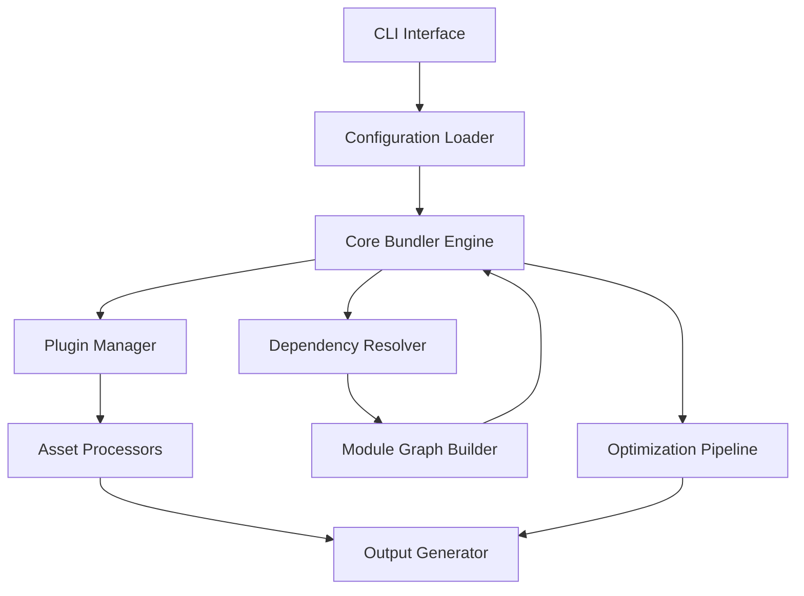

# `exodus-bundler`

## Repository Overview

### Tree Structure
```
exodus-bundler/
└── src/
    ├── cli/
    │   ├── index.js
    │   └── commands/
    ├── config/
    │   ├── loader.js
    │   └── schema.js
    ├── core/
    │   ├── bundler.js
    │   ├── resolver.js
    │   ├── graph.js
    │   └── optimizer.js
    ├── plugins/
    │   ├── index.js
    │   └── base.js
    ├── assets/
    │   ├── processor.js
    │   └── handlers/
    └── utils/
        ├── logger.js
        └── helpers.js
```

### Purpose
The exodus-bundler is a modern JavaScript module bundler that transforms complex application codebases into optimized, production-ready bundles. It solves the problem of managing large dependency trees, optimizing bundle sizes, and enabling advanced build-time features like code splitting and tree shaking.

Target users include frontend developers building web applications, build engineers automating deployment workflows, and tooling authors creating custom build solutions. The tool excels in scenarios requiring fast builds, efficient code optimization, and flexible plugin architectures.

In the broader ecosystem, exodus-bundler operates as a standalone build tool that integrates seamlessly with existing development workflows. It can be used directly via CLI, programmatically through its API, or extended through its plugin system to support custom transformations and optimizations.

### Architecture


Key architectural patterns include:
- Plugin architecture for extensibility
- Dependency graph resolution for module management
- Pipeline-based processing for asset transformation
- Configuration-driven behavior
- Separation of concerns between CLI, core logic, and utilities

### Entry Points
1. **CLI Command**: `exodus-bundle` - Provides command-line interface for building projects
   - Required arguments: input entry point, output directory
   - Target audience: developers building applications

2. **Importable API**: `import { bundle } from 'exodus-bundler'` - Programmatic bundling interface
   - Required arguments: configuration object, input/output paths
   - Target audience: build tool authors, integration developers

3. **Plugin API**: `import { createPlugin } from 'exodus-bundler/plugins'` - Extensibility interface
   - Required arguments: plugin specification object
   - Target audience: plugin developers, customization authors

### Core Features
1. **Module Resolution** - Resolves ES6 modules and CommonJS dependencies
   - Implemented in: `core/resolver.js`

2. **Code Splitting** - Automatically splits bundles based on dynamic imports
   - Implemented in: `core/splitter.js`

3. **Tree Shaking** - Eliminates unused code from bundles
   - Implemented in: `core/tree-shaker.js`

4. **Plugin System** - Extensible architecture for custom transformations
   - Implemented in: `plugins/index.js`

5. **Asset Processing** - Handles CSS, images, and other file types
   - Implemented in: `assets/processor.js`

6. **Development Server** - Hot reloading and live updates during development
   - Implemented in: `cli/server.js`

### Dependencies
- **esbuild** - Fast JavaScript bundling engine (v0.19+)
- **rollup-pluginutils** - Utility functions for plugin development (v5.0+)
- **yargs** - Command-line argument parsing (v17.7+)
- **chokidar** - File system watching (v3.5+)
- **webpack-sources** - Source code manipulation utilities (v3.2+)

### Configuration
Configuration is handled through:
- `exodus.config.js` - Project-specific configuration file
- Environment variables for runtime settings
- CLI flags for temporary overrides

### Extension Points
1. **Plugins** - Custom processing steps via plugin registration
2. **Resolvers** - Custom module resolution strategies
3. **Transformers** - Pre/post-processing of source code
4. **Output Formats** - Different bundle formats (ESM, CJS, UMD)
5. **Hooks** - Lifecycle events for custom behavior injection

---

## Modules

- [`src`](src.md)

