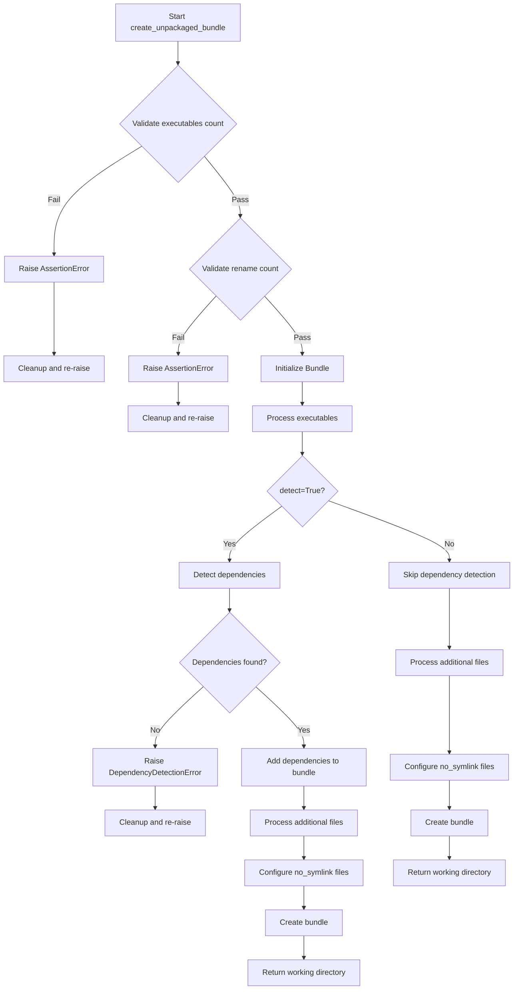
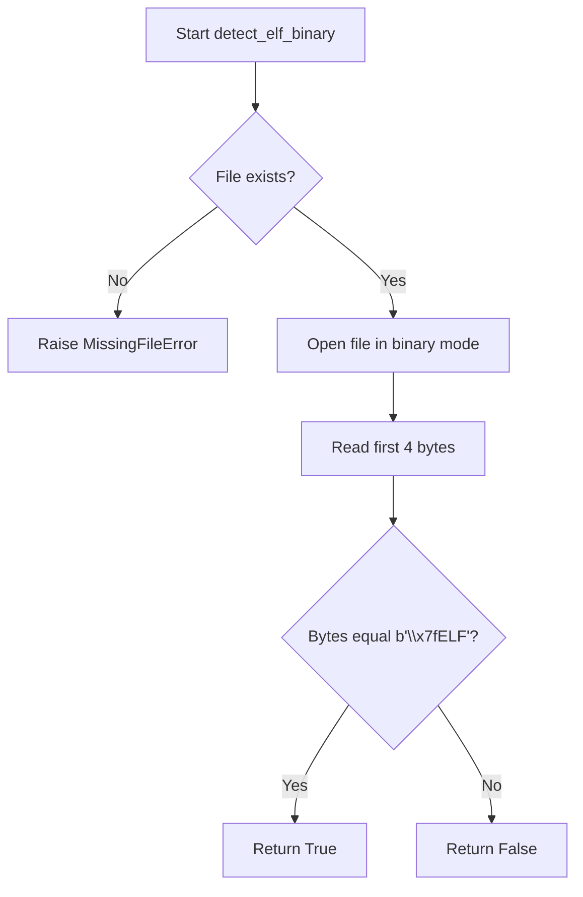
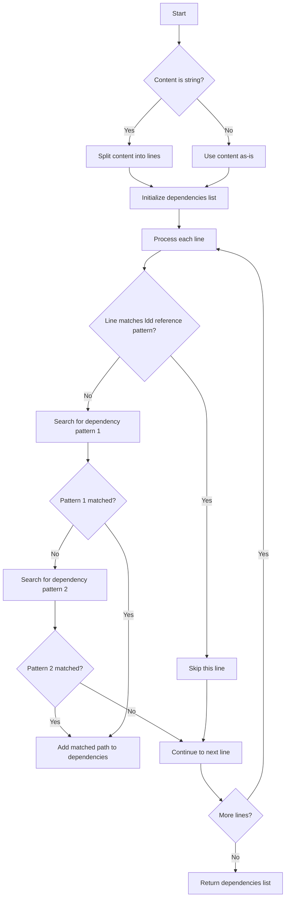
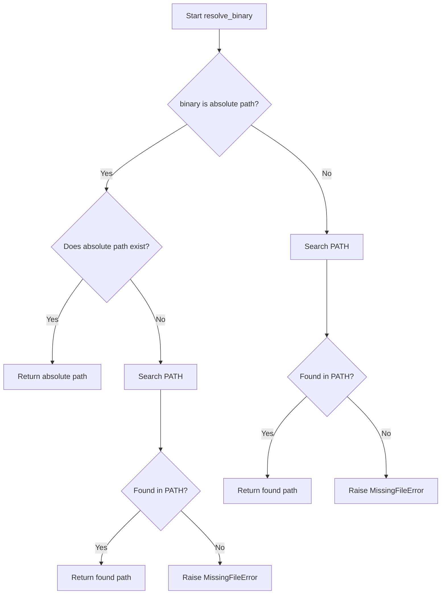
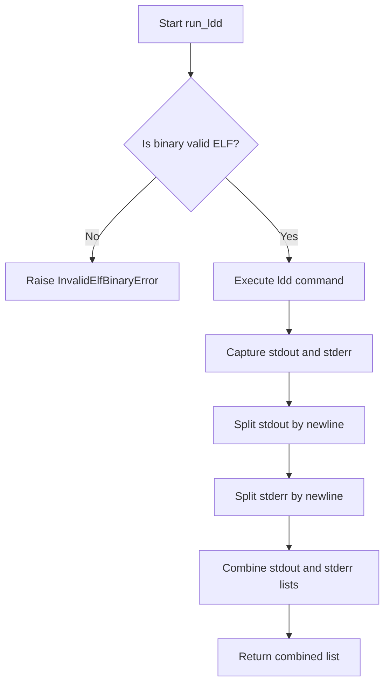
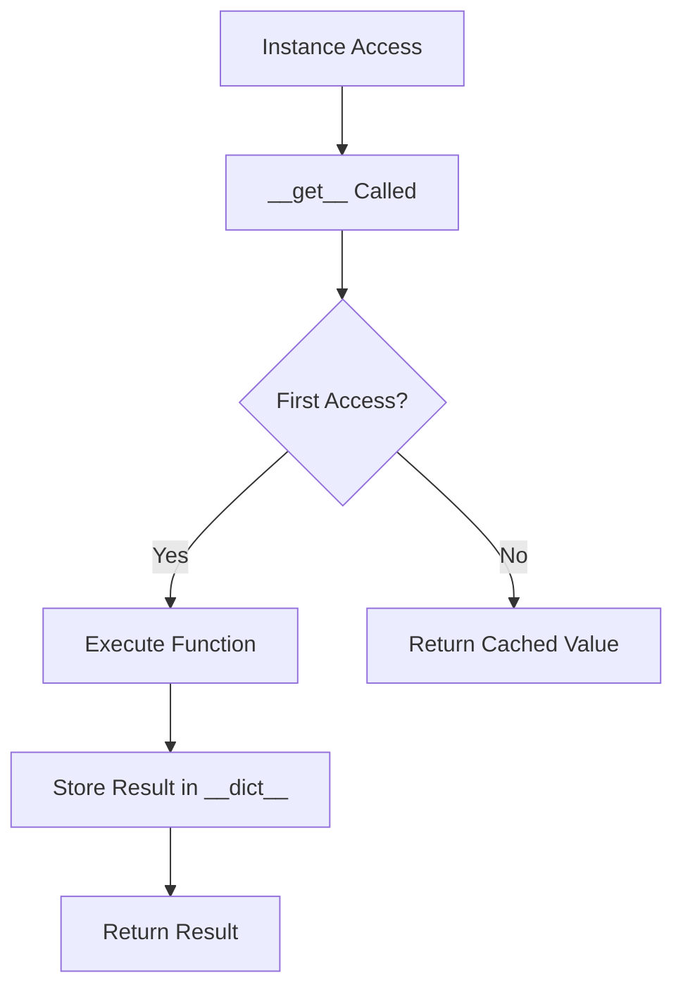
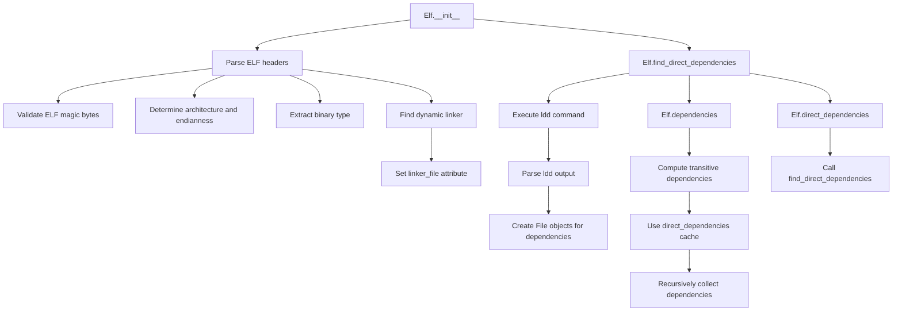
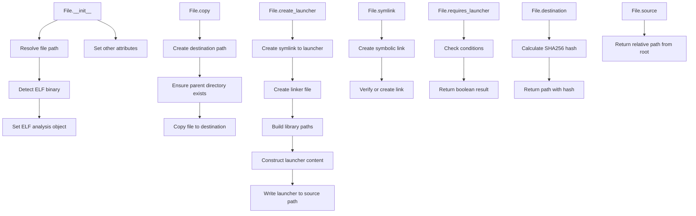

# `bundling.py`

## `src.exodus_bundler.bundling.bytes_to_int` · *function*

## Summary:
Converts a sequence of bytes into an integer with configurable byte order.

## Description:
This function transforms a byte sequence into its corresponding integer representation, supporting both big-endian and little-endian byte ordering. It is commonly used in binary data processing and low-level operations where byte order matters, such as parsing binary files or handling network protocols.

## Args:
    bytes (bytes): A sequence of bytes to convert to an integer.
    byteorder (str): Byte order for conversion. Must be either 'big' or 'little'. Defaults to 'big'.

## Returns:
    int: The integer value represented by the byte sequence.

## Raises:
    KeyError: If byteorder is not 'big' or 'little'.
    struct.error: If there's an issue unpacking the bytes with struct.unpack.

## Constraints:
    Preconditions:
        - The bytes parameter must be a valid bytes object
        - The byteorder parameter must be either 'big' or 'little'
    Postconditions:
        - Returns an integer representing the byte sequence in the specified byte order
        - The returned integer will be positive or zero

## Side Effects:
    None

## Control Flow:
```mermaid
flowchart TD
    A[bytes_to_int called] --> B{byteorder}
    B -->|big| C[Set endian='>']
    B -->|little| D[Set endian='<']
    C --> E[struct.unpack endian+'B'*len(bytes)]
    D --> E
    E --> F{byteorder}
    F -->|big| G[Reverse chars array]
    F -->|little| H[Keep chars as-is]
    G --> I[Calculate sum]
    H --> I
    I --> J[Return result]
```

## Examples:
    # Convert big-endian bytes to integer
    result = bytes_to_int(b'\x01\x02\x03', 'big')  # Returns 66051
    
    # Convert little-endian bytes to integer  
    result = bytes_to_int(b'\x01\x02\x03', 'little')  # Returns 197121

## `src.exodus_bundler.bundling.create_bundle` · *function*

## Summary:
Creates a bundled executable package containing specified executables and their dependencies, either as a self-extracting shell script or a compressed tarball.

## Description:
The create_bundle function takes a list of executables and creates a distributable bundle that can be run on systems without the original dependencies. It orchestrates the creation of a temporary unpackaged bundle, packages it into either a self-extracting shell script or a compressed tarball, and handles proper cleanup of temporary resources.

This function is extracted from inline logic to provide a clean interface for bundle creation while encapsulating the complexity of temporary file management, packaging, and output generation. It serves as the primary entry point for creating packaged bundles in the Exodus bundler system.

## Args:
    executables (list[str]): List of absolute or relative paths to executable files to include in the bundle.
    output (str): Template string for the output filename, or '-' for stdout. Supports template variables {executables} and {extension}.
    tarball (bool): If True, creates a compressed tarball (.tgz) instead of a self-extracting shell script. Defaults to False.
    rename (list[str], optional): List of names to use as entry points for the executables. Defaults to [].
    chroot (str, optional): Path to a chroot environment to use for file resolution. Defaults to None.
    add (list[str], optional): List of additional file paths to include in the bundle beyond the executables. Defaults to [].
    no_symlink (list[str], optional): List of file paths that should not use symbolic links in the bundle. Defaults to [].
    shell_launchers (bool): Whether to use shell-based launchers instead of binary launchers. Defaults to False.
    detect (bool): Whether to automatically detect and include dependencies for executables. Defaults to False.

## Returns:
    bool: True if bundle creation was successful.

## Raises:
    Exception: Any exception that occurs during bundle creation, which results in cleanup and re-raised.

## Constraints:
    Preconditions:
        - At least one executable must be specified
        - The number of rename entries cannot exceed the number of executables
        - All specified file paths must exist and be accessible
        - The working directory must be writable
        - Output directory must be writable if output is not '-' or '/dev/null'
    
    Postconditions:
        - A bundle file is created at the specified output location
        - Temporary working directory is cleaned up
        - If creating a shell script bundle, the output file is made executable

## Side Effects:
    - Creates temporary directories for bundle construction
    - Writes output file to disk or stdout
    - Makes output file executable if it's a shell script
    - Removes temporary directories on completion or error

## Control Flow:
```mermaid
flowchart TD
    A[Start create_bundle] --> B[Create unpackaged bundle]
    B --> C{Output filename = "-"}
    C -- Yes --> D[Use stdout buffer]
    C -- No --> E[Open output file for writing]
    D --> F{tarball=False}
    E --> F
    F -- No --> G{Output filename = "-"}
    G -- Yes --> H[Base64 encode tarball]
    H --> I[Render non-interactive install script]
    I --> J[Write script to output]
    G -- No --> K[Render interactive install script]
    K --> L[Write script to output]
    L --> M[Append tarball data]
    F -- Yes --> N[Write tarball data directly]
    N --> O[Close output file]
    J --> O
    M --> O
    O --> P[Set executable permissions]
    P --> Q[Return True]
```

## Examples:
    # Create a self-extracting bundle with default settings
    success = create_bundle(['/usr/bin/python3'], 'myapp.sh')
    
    # Create a tarball bundle
    success = create_bundle(['/usr/bin/python3'], 'myapp.tgz', tarball=True)
    
    # Create bundle with renamed executables
    success = create_bundle(
        ['/usr/bin/python3', '/usr/bin/gcc'],
        'myapp.sh',
        rename=['python3', 'gcc']
    )
    
    # Create bundle with dependency detection
    success = create_bundle(
        ['/usr/bin/python3'],
        'myapp.sh',
        detect=True
    )
    
    # Create bundle with additional files
    success = create_bundle(
        ['/usr/bin/python3'],
        'myapp.sh',
        add=['/etc/passwd', '/etc/group']
    )
```

## `src.exodus_bundler.bundling.create_unpackaged_bundle` · *function*

## Summary:
Creates an unpackaged bundle containing specified executables and their dependencies, with optional configuration for symlinks and launchers.

## Description:
The create_unpackaged_bundle function orchestrates the creation of a self-contained bundle directory that includes executables and their required dependencies. It provides flexible configuration options for handling entry points, dependency detection, additional file inclusion, and symlink behavior. The function manages the entire bundling lifecycle, from file addition to bundle creation, and ensures proper cleanup on errors.

This function is extracted from inline logic to provide a clean interface for bundle creation while encapsulating the complexity of file management, dependency resolution, and bundle construction. It serves as the primary entry point for creating unpackaged bundles in the Exodus bundler system.

## Args:
    executables (list[str]): List of absolute or relative paths to executable files to include in the bundle.
    rename (list[str], optional): List of names to use as entry points for the executables. Defaults to [].
    chroot (str, optional): Path to a chroot environment to use for file resolution. Defaults to None.
    add (list[str], optional): List of additional file paths to include in the bundle beyond the executables. Defaults to [].
    no_symlink (list[str], optional): List of file paths that should not use symbolic links in the bundle. Defaults to [].
    shell_launchers (bool): Whether to use shell-based launchers instead of binary launchers. Defaults to False.
    detect (bool): Whether to automatically detect and include dependencies for executables. Defaults to False.

## Returns:
    str: The absolute path to the working directory containing the created bundle.

## Raises:
    AssertionError: When no executables are specified or when more rename entries are provided than executables.
    DependencyDetectionError: When automatic dependency detection fails for an executable.
    Exception: Any other exception that occurs during bundle creation, which results in cleanup.

## Constraints:
    Preconditions:
        - At least one executable must be specified
        - The number of rename entries cannot exceed the number of executables
        - All specified file paths must exist and be accessible
        - The working directory must be writable
    
    Postconditions:
        - A working directory is created containing the bundle structure
        - All specified executables and dependencies are included in the bundle
        - The returned path points to a valid working directory

## Side Effects:
    - Creates temporary directories for bundle construction
    - Copies files to the working directory
    - Creates symbolic links and launcher scripts
    - May execute external commands (like ldd for dependency detection)
    - Deletes the working directory on failure

## Control Flow:


## Examples:
    # Basic usage with a single executable
    bundle_dir = create_unpackaged_bundle(['/usr/bin/python3'])
    
    # Usage with renamed entry points
    bundle_dir = create_unpackaged_bundle(
        ['/usr/bin/python3', '/usr/bin/gcc'],
        rename=['python3', 'gcc']
    )
    
    # Usage with dependency detection
    bundle_dir = create_unpackaged_bundle(
        ['/usr/bin/python3'],
        detect=True
    )
    
    # Usage with additional files and no symlinks
    bundle_dir = create_unpackaged_bundle(
        ['/usr/bin/python3'],
        add=['/etc/passwd', '/etc/group'],
        no_symlink=['/etc/passwd']
    )

## `src.exodus_bundler.bundling.detect_elf_binary` · *function*

## Summary:
Determines whether a given file is an ELF (Executable and Linkable Format) binary executable.

## Description:
Checks if a file conforms to the ELF binary format by examining its magic number in the first four bytes. This function is used to identify executable binaries that can be processed by the bundling system.

## Args:
    filename (str): Path to the file to check for ELF binary format

## Returns:
    bool: True if the file is an ELF binary (starts with magic bytes \x7fELF), False otherwise

## Raises:
    MissingFileError: When the specified file does not exist on the filesystem

## Constraints:
    Preconditions:
        - The filename parameter must be a valid string path
        - The file must exist at the specified location
    Postconditions:
        - The function performs no modifications to the file system
        - The function returns immediately after reading the first 4 bytes

## Side Effects:
    - Reads the first 4 bytes of the specified file from disk
    - No modifications to file system or external state

## Control Flow:


## Examples:
    # Check if a binary file is an ELF binary
    is_elf = detect_elf_binary('/usr/bin/python3')
    # Returns True if python3 is an ELF binary
    
    # Handle missing file case
    try:
        is_elf = detect_elf_binary('/nonexistent/file')
    except MissingFileError:
        print("File not found")
```

## `src.exodus_bundler.bundling.parse_dependencies_from_ldd_output` · *function*

## Summary
Parses ldd command output to extract shared library dependencies from ELF binaries.

## Description
Extracts absolute paths to shared libraries from the output of the ldd command, which is commonly used to determine runtime dependencies of ELF binaries. This function processes ldd output lines and identifies library paths that are linked to the binary being analyzed.

The function is designed to handle various formats of ldd output and filter out irrelevant entries. It specifically skips lines that reference ldd itself as a dependency, which can appear in certain ldd output formats.

This logic is extracted into its own function to provide a clean abstraction for parsing ldd output, separating the concerns of executing ldd commands from processing their results. This makes the dependency detection process more modular and testable.

## Args
    content (str or list): Either a string containing ldd output (with newlines) or a list of lines from ldd output. When a string is provided, it's split into lines automatically.

## Returns
    list[str]: A list of absolute paths to shared library dependencies found in the ldd output. Empty list is returned if no dependencies are detected or if the input is empty.

## Raises
    None explicitly raised

## Constraints
    Preconditions:
    - Input content should represent valid ldd output format
    - Content should contain lines with library dependency information in the format: "library_path => /path/to/library (0x...)" or similar
    
    Postconditions:
    - Returns a list of strings representing absolute paths to dependencies
    - All returned paths are stripped of surrounding whitespace
    - No filtering is applied to remove duplicates (caller should handle deduplication if needed)

## Side Effects
    None

## Control Flow


## Examples
    # Example 1: Basic usage with string input
    ldd_output = '''
    linux-vdso.so.1 (0x...)
    libpthread.so.0 => /lib/x86_64-linux-gnu/libpthread.so.0 (0x...)
    libc.so.6 => /lib/x86_64-linux-gnu/libc.so.6 (0x...)
    /lib64/ld-linux-x86-64.so.2 (0x...)
    '''
    deps = parse_dependencies_from_ldd_output(ldd_output)
    # Returns: ['/lib/x86_64-linux-gnu/libpthread.so.0', '/lib/x86_64-linux-gnu/libc.so.6']

    # Example 2: Usage with list input
    ldd_lines = [
        'libm.so.6 => /lib/x86_64-linux-gnu/libm.so.6 (0x...)',
        'libdl.so.2 => /lib/x86_64-linux-gnu/libdl.so.2 (0x...)'
    ]
    deps = parse_dependencies_from_ldd_output(ldd_lines)
    # Returns: ['/lib/x86_64-linux-gnu/libm.so.6', '/lib/x86_64-linux-gnu/libdl.so.2']

## `src.exodus_bundler.bundling.resolve_binary` · *function*

## Summary:
Resolves a binary path by checking if it exists as an absolute path, or searching for it in the system PATH.

## Description:
This function attempts to resolve a binary path by first checking if the provided path refers to an existing file. If not, it searches for the binary in directories listed in the system PATH environment variable. This is useful for locating executables that may be referenced by name rather than absolute path during the bundling process.

## Args:
    binary (str): The name or path of the binary to resolve. Can be either an absolute path or a binary name to search for in PATH.

## Returns:
    str: The absolute path to the resolved binary.

## Raises:
    MissingFileError: When the specified binary cannot be found either as an absolute path or in any directory listed in the PATH environment variable.

## Constraints:
    Preconditions:
        - The binary parameter must be a string
        - The system PATH environment variable must be accessible
    
    Postconditions:
        - Returns an absolute path to an existing file
        - The returned path is normalized using os.path.normpath

## Side Effects:
    None

## Control Flow:


## `src.exodus_bundler.bundling.resolve_file_path` · *function*

## Summary:
Resolves a file path to an absolute normalized path, optionally searching the system PATH for binaries.

## Description:
Validates that a given path points to an existing file (not a directory) and returns its absolute normalized form. When the `search_environment_path` flag is enabled, it first resolves the path as a binary name against the system PATH before performing validation.

## Args:
    path (str): The file path to resolve. Can be relative, absolute, or a binary name if search_environment_path is True.
    search_environment_path (bool): If True, treats the path as a binary name and searches the system PATH for it. Defaults to False.

## Returns:
    str: The absolute normalized path to the file.

## Raises:
    MissingFileError: When the specified file does not exist at the given path.
    UnexpectedDirectoryError: When the specified path points to a directory rather than a file.

## Constraints:
    Preconditions:
        - The path parameter must be a string
        - The file system must be accessible
        - When search_environment_path=True, the system PATH environment variable must be accessible
    
    Postconditions:
        - Returns an absolute path string
        - The returned path is normalized using os.path.normpath
        - The path points to an existing file (not a directory)

## Side Effects:
    None

## Control Flow:
```mermaid
flowchart TD
    A[Start resolve_file_path] --> B{search_environment_path=True?}
    B -- Yes --> C[Call resolve_binary(path)]
    B -- No --> D[path]
    C --> E{File exists?}
    D --> E
    E -- No --> F[Raise MissingFileError]
    E -- Yes --> G{Is directory?}
    G -- Yes --> H[Raise UnexpectedDirectoryError]
    G -- No --> I[Return normpath(abspath(path))]
```

## Examples:
    # Basic usage with existing file
    resolved_path = resolve_file_path('/home/user/script.sh')
    
    # Usage with binary search
    resolved_path = resolve_file_path('gcc', search_environment_path=True)
    
    # Error handling
    try:
        resolve_file_path('/nonexistent/file.txt')
    except MissingFileError:
        print("File not found")
        
    try:
        resolve_file_path('/some/directory')
    except UnexpectedDirectoryError:
        print("Path points to directory")
```

## `src.exodus_bundler.bundling.run_ldd` · *function*

## Summary:
Executes the ldd command on a binary file to retrieve its shared library dependencies and returns the combined output.

## Description:
This function runs the ldd (list dynamic dependencies) command on a specified binary to discover all shared libraries it depends on. It first validates that the binary is a proper ELF executable before running ldd, then captures and processes the command's output. This is a crucial step in the bundling process for identifying runtime dependencies that need to be included with the application.

## Args:
    ldd (str): Path to the ldd command executable (e.g., '/usr/bin/ldd')
    binary (str): Path to the binary file to analyze for dependencies. Can be either an absolute path or a binary name to search in PATH

## Returns:
    list[str]: A list of strings representing lines from both stdout and stderr of the ldd command execution. Empty list if no output.

## Raises:
    InvalidElfBinaryError: When the specified binary is not a valid ELF binary file

## Constraints:
    Preconditions:
        - The ldd parameter must point to a valid executable ldd command
        - The binary parameter must refer to an existing file that can be resolved to an absolute path
        - The binary must be a valid ELF executable file
        
    Postconditions:
        - The function does not modify any files or system state
        - The returned list contains all lines from both stdout and stderr of the ldd command

## Side Effects:
    - Executes an external command (ldd) which may involve file system access
    - May cause temporary I/O operations during command execution
    - No modifications to the file system or external state beyond command execution

## Control Flow:


## Examples:
    # Basic usage to get dependencies of a binary
    dependencies = run_ldd('/usr/bin/ldd', '/usr/bin/python3')
    # Returns list of dependency lines from ldd output
    
    # Usage with binary name (will be resolved via PATH)
    dependencies = run_ldd('/usr/bin/ldd', 'python3')
    # Resolves python3 to full path and gets its dependencies

## `src.exodus_bundler.bundling.stored_property` · *class*

## Summary:
A descriptor class that caches the result of a function call on the first access and returns the cached value on subsequent accesses.

## Description:
The `stored_property` class implements a descriptor protocol that transforms a method into a cached property. When accessed on an instance, it executes the wrapped function once and stores the result in the instance's dictionary under the function's name. Subsequent accesses return the cached value without re-executing the function.

This is commonly used to implement expensive computed properties that should only be calculated once per instance lifetime.

## State:
- `function`: The wrapped function whose result is to be cached
  - Type: callable
  - Valid range: Any callable object that accepts a single argument (the instance)
  - Invariant: Must be set during initialization and remain immutable

## Lifecycle:
- Creation: Instantiate with a function that takes an instance as its sole argument
- Usage: Access the property on an instance to trigger computation and caching
- Destruction: No special cleanup required; relies on normal Python garbage collection

## Method Map:


## Raises:
- None explicitly raised by `__init__` or `__get__`
- The wrapped function may raise exceptions during execution, which propagate normally

## Example:
```python
class MyClass:
    @stored_property
    def expensive_computation(self):
        # Simulate expensive operation
        return sum(range(1000))

# Usage:
obj = MyClass()
result1 = obj.expensive_computation  # Computes and caches result
result2 = obj.expensive_computation  # Returns cached result
assert result1 is result2  # Same object reference
```

### `src.exodus_bundler.bundling.stored_property.__init__` · *method*

## Summary:
Initializes a stored_property descriptor with the given function, copying its docstring for documentation purposes.

## Description:
Constructs a stored_property descriptor that will cache the result of executing the provided function on the first access. The function's docstring is copied to the descriptor's `__doc__` attribute to preserve documentation for introspection and help systems.

This method is called during the creation of a stored_property instance, typically when the descriptor is used as a decorator on a method.

## Args:
    function (callable): The function to be wrapped by this descriptor. Must accept a single argument representing the instance on which it will be called.

## Returns:
    None: This method initializes the instance state and returns nothing.

## Raises:
    None: This method does not explicitly raise exceptions.

## State Changes:
    Attributes READ: None
    Attributes WRITTEN: 
    - self.__doc__: Set to the docstring of the provided function
    - self.function: Set to the provided function object

## Constraints:
    Preconditions:
    - The `function` parameter must be callable
    - The `function` parameter should accept exactly one argument (the instance)
    
    Postconditions:
    - The instance's `__doc__` attribute will contain the docstring of the provided function
    - The instance's `function` attribute will reference the provided function

## Side Effects:
    None: This method performs only local attribute assignments and has no external side effects.

### `src.exodus_bundler.bundling.stored_property.__get__` · *method*

## Summary:
Computes and caches the result of a function call on the first access, returning the cached value on subsequent accesses.

## Description:
This method implements the descriptor protocol's `__get__` method for the `stored_property` class. It serves as a lazy evaluation mechanism that computes the value of a property only when first accessed, then stores it in the instance's `__dict__` for future accesses. This prevents redundant computations while maintaining the appearance of a regular property access.

## Args:
    self: The stored_property instance acting as the descriptor
    instance: The object instance that owns the property being accessed, or None when accessed from the class
    type: The class that owns the descriptor (used internally by Python's descriptor protocol)

## Returns:
    The computed result of `self.function(instance)`, cached in the instance's `__dict__` for subsequent accesses

## Raises:
    AttributeError: When `instance` is None and the descriptor is accessed from the class rather than an instance

## State Changes:
    Attributes READ: self.function, self.function.__name__
    Attributes WRITTEN: instance.__dict__[self.function.__name__]

## Constraints:
    Preconditions: 
    - `instance` must be an object that has a `__dict__` attribute
    - `self.function` must be callable and accept `instance` as its sole argument
    - The property name (derived from `self.function.__name__`) must be a valid key for `instance.__dict__`
    
    Postconditions:
    - The result of `self.function(instance)` is stored in `instance.__dict__[self.function.__name__]`
    - The same cached value is returned on all subsequent accesses to this property

## Side Effects:
    None - This method does not perform I/O operations or mutate external state beyond storing the computed value in the instance's dictionary

## `src.exodus_bundler.bundling.Elf` · *class*

## Summary:
Represents an ELF (Executable and Linkable Format) binary file and provides methods for analyzing its structure and dependencies.

## Description:
The Elf class is responsible for parsing ELF binary files to extract metadata such as architecture, binary type, and dynamic linker information. It serves as a foundational component for dependency analysis in the Exodus bundler system. The class can identify direct and transitive dependencies of ELF binaries by leveraging the `ldd` command and parsing its output.

This class is typically instantiated by the `File` class when analyzing binary files, particularly when determining whether a file requires a launcher or can be bundled directly. The class encapsulates the low-level ELF parsing logic and provides higher-level abstractions for dependency resolution.

## State:
- path (str): Absolute path to the ELF binary file. Required parameter during instantiation.
- chroot (str, optional): Root directory path used for resolving file paths when operating in a chroot environment. Default is None.
- bits (int): Architecture bits of the ELF binary (either 32 or 64). Determined during initialization.
- type (str): Type of the ELF binary (one of 'relocatable', 'executable', 'shared', 'core'). Determined during initialization.
- linker_file (File, optional): File object representing the dynamic linker used by this binary. Set during initialization.

## Lifecycle:
- Creation: Instantiate with `Elf(path, chroot=None, file_factory=None)` where path is required. The constructor validates that the file exists and is a valid ELF binary.
- Usage: Access the `direct_dependencies` property to get immediate dependencies or the `dependencies` property for transitive dependencies. Both properties are cached for performance.
- Destruction: No explicit cleanup required; relies on Python's garbage collection.

## Method Map:


## Raises:
- MissingFileError: Raised when the specified file path does not exist.
- InvalidElfBinaryError: Raised when the file is not a valid ELF binary (doesn't start with '\x7fELF').
- UnsupportedArchitectureError: Raised when the ELF binary is neither 32-bit nor 64-bit, or when it's big-endian (which is not supported).

## Example:
```python
# Create an Elf instance for a binary
elf = Elf('/usr/bin/python3')

# Get direct dependencies
direct_deps = elf.direct_dependencies

# Get all transitive dependencies
all_deps = elf.dependencies

# Access basic information
print(f"Architecture: {elf.bits} bits")
print(f"Binary type: {elf.type}")
print(f"Linker: {elf.linker_file.path if elf.linker_file else 'None'}")
```

### `src.exodus_bundler.bundling.Elf.__init__` · *method*

## Summary:
Initializes an ELF binary analyzer object by parsing ELF file headers to extract architecture, binary type, and dynamic linker information.

## Description:
Constructs an Elf object by reading and validating the ELF binary structure from the specified file path. This method performs comprehensive ELF parsing to determine the binary's architecture, type, and required dynamic linker. It validates that the file exists, is a valid ELF binary, and supports only little-endian 32 or 64-bit architectures. The method also identifies the dynamic linker path embedded in the ELF program headers, which is essential for creating proper launchers when bundling applications.

This logic is encapsulated in its own method because ELF parsing involves complex binary structure interpretation with specific offsets and field positions that vary between 32-bit and 64-bit formats. Separating this parsing logic ensures clean code organization and makes the Elf class reusable for different binary analysis tasks.

## Args:
    path (str): Absolute or relative path to the ELF binary file to analyze.
    chroot (str, optional): Root directory path used for resolving file paths in chroot environments. Defaults to None.
    file_factory (class, optional): Factory class used to create File objects for the dynamic linker. Defaults to File class.

## Returns:
    None: This is a constructor method that initializes instance attributes rather than returning a value.

## Raises:
    MissingFileError: When the specified file path does not exist on the filesystem.
    InvalidElfBinaryError: When the file does not start with the ELF magic bytes ('\x7fELF').
    UnsupportedArchitectureError: When the ELF binary is neither 32-bit nor 64-bit, or when it's big-endian (which is not supported).

## State Changes:
    Attributes READ: 
        - self.path (if accessed during validation)
    Attributes WRITTEN:
        - self.path: Stores the absolute path to the ELF binary
        - self.chroot: Stores the chroot environment path
        - self.file_factory: Stores the factory class for creating File objects
        - self.bits: Stores the architecture bits (32 or 64)
        - self.type: Stores the binary type ('relocatable', 'executable', 'shared', or 'core')
        - self.linker_file: Stores the File object representing the dynamic linker

## Constraints:
    Preconditions:
        - The path parameter must point to an existing file
        - The file must be a valid ELF binary starting with '\x7fELF'
        - The binary must be either 32-bit or 64-bit little-endian architecture
    Postconditions:
        - All instance attributes are properly initialized
        - The linker_file attribute is set to None or a valid File object representing the dynamic linker
        - The bits attribute is either 32 or 64
        - The type attribute is one of 'relocatable', 'executable', 'shared', or 'core'

## Side Effects:
    None: This method performs no I/O operations beyond reading the specified file and does not mutate external state.

### `src.exodus_bundler.bundling.Elf.__eq__` · *method*

## Summary:
Compares two Elf objects for equality based on their file paths.

## Description:
This method implements Python's equality protocol to determine if two Elf objects represent the same file. It is called during equality comparisons (== operator) between Elf instances.

## Args:
    other (object): Another object to compare with this Elf instance.

## Returns:
    bool: True if the other object is an Elf instance and both objects refer to the same file path; False otherwise.

## Raises:
    None

## State Changes:
    Attributes READ: self.path
    Attributes WRITTEN: None

## Constraints:
    Preconditions: The other object must be comparable (typically another Elf instance)
    Postconditions: Returns a boolean indicating equality based on file path comparison

## Side Effects:
    None

### `src.exodus_bundler.bundling.Elf.__hash__` · *method*

## Summary:
Returns the hash value of the ELF binary file path for use in hash-based data structures.

## Description:
Implements Python's magic `__hash__` method to enable Elf objects to be used as dictionary keys or members of sets. This method returns the hash of the file path stored in `self.path`, ensuring consistency with the `__eq__` method which also compares based on file paths.

## Args:
    None

## Returns:
    int: The hash value of `self.path` as computed by Python's built-in `hash()` function.

## Raises:
    None

## State Changes:
    Attributes READ: self.path
    Attributes WRITTEN: None

## Constraints:
    Preconditions: The Elf instance must have been properly initialized with a valid file path
    Postconditions: The returned hash value remains consistent for the lifetime of the object

## Side Effects:
    None

### `src.exodus_bundler.bundling.Elf.__repr__` · *method*

## Summary:
Returns a string representation of the Elf object showing its file path.

## Description:
This method provides a human-readable string representation of an Elf object, primarily used for debugging and logging purposes. It follows Python conventions for `__repr__` methods by returning a string that ideally could recreate the object.

## Args:
    None

## Returns:
    str: A formatted string in the form '<Elf(path="path_to_file")>' where path_to_file is the absolute path stored in self.path.

## Raises:
    None

## State Changes:
    Attributes READ: self.path
    Attributes WRITTEN: None

## Constraints:
    Preconditions: The Elf instance must have a valid path attribute set.
    Postconditions: The returned string format is consistent and follows the pattern '<Elf(path="...")>'.

## Side Effects:
    None

### `src.exodus_bundler.bundling.Elf.find_direct_dependencies` · *method*

## Summary
Finds and returns the set of direct shared library dependencies for this ELF binary by executing the `ldd` command and parsing its output.

## Description
This method executes the `ldd` command on the ELF binary to determine its runtime shared library dependencies. It handles special cases for chroot environments by adjusting library paths and uses appropriate flags to ensure reliable dependency detection. The method parses the `ldd` output to extract library paths and converts them into File objects using the configured file factory.

The method is separated from inline logic to provide a clean abstraction for dependency detection, making the process modular and testable. It's typically called during the dependency resolution phase of the bundling process when building a complete dependency graph for an ELF binary.

## Args
    linker_file (File, optional): Override the default linker file to use for the ldd execution. If None, uses self.linker_file. Defaults to None.

## Returns
    set[File]: A set of File objects representing the direct shared library dependencies of this ELF binary, including the binary's own linker file. Returns an empty set if no linker file is available.

## Raises
    None explicitly raised

## State Changes
    Attributes READ: self.path, self.chroot, self.linker_file, self.file_factory
    Attributes WRITTEN: None

## Constraints
    Preconditions:
    - The ELF binary must exist at self.path
    - The binary must be a valid ELF file
    - If chroot is specified, it must be a valid directory path
    - The system must have the `ldd` command available

    Postconditions:
    - Returns a set of File objects with library=True flag set
    - The returned set includes the binary's own linker file as a dependency
    - All File objects are created with the same chroot context as the current ELF instance

## Side Effects
    - Executes the `ldd` system command
    - May modify environment variables for the subprocess execution
    - Reads files from the filesystem via the ldd command
    - May access external library paths in chroot environments

### `src.exodus_bundler.bundling.Elf.dependencies` · *method*

## Summary:
Recursively collects all direct and transitive dependencies of this ELF binary.

## Description:
This method computes the complete set of dependencies for the ELF binary by performing a breadth-first traversal starting from the direct dependencies. It leverages the `find_direct_dependencies` method to discover immediate dependencies and continues recursively until all transitive dependencies are collected.

The method is designed as a cached property to avoid recomputing dependencies multiple times during the bundling process. It's typically called during the dependency analysis phase of the bundling workflow.

## Args:
    None

## Returns:
    set[File]: A set of File objects representing all direct and transitive dependencies of this ELF binary.

## Raises:
    None explicitly raised

## State Changes:
    Attributes READ: 
        - self.direct_dependencies: Used to initialize the traversal
        - self.linker_file: Passed to find_direct_dependencies to locate dependencies
    Attributes WRITTEN: 
        - None (this is a property that doesn't modify state)

## Constraints:
    Preconditions:
        - The ELF binary must be valid (checked during initialization)
        - The `self.direct_dependencies` property must be accessible
        - The `self.linker_file` attribute must be initialized (set during ELF initialization)
    Postconditions:
        - Returns a set containing all unique dependencies (no duplicates)
        - All dependencies are File objects with proper ELF metadata

## Side Effects:
    - May invoke external `ldd` command to analyze dependencies
    - Uses system environment variables (LD_TRACE_LOADED_OBJECTS, LD_LIBRARY_PATH)
    - May access filesystem to read ELF binary and execute ldd command

### `src.exodus_bundler.bundling.Elf.direct_dependencies` · *method*

## Summary:
Returns the set of direct dynamic library dependencies for this ELF binary.

## Description:
This property provides access to the direct dependencies of the ELF binary by delegating to the `find_direct_dependencies` method. It serves as a cached property that avoids recomputing the dependency set multiple times during the bundling process.

The method is typically accessed during the dependency analysis phase of the bundling workflow when determining which libraries need to be included in the final bundle.

## Args:
    None

## Returns:
    set[File]: A set of File objects representing the direct dynamic library dependencies of this ELF binary. Returns an empty set if no dependencies are found or if the binary has no linker file.

## Raises:
    None explicitly raised by this property

## State Changes:
    Attributes READ: 
        - self.find_direct_dependencies: Called to compute the dependency set
    Attributes WRITTEN: 
        - None (this is a property that doesn't modify state)

## Constraints:
    Preconditions:
        - The ELF binary must be valid (checked during initialization)
        - The `self.linker_file` attribute must be initialized (set during ELF initialization)
    Postconditions:
        - Returns a set containing all unique direct dependencies (no duplicates)
        - All dependencies are File objects with proper ELF metadata

## Side Effects:
    - Invokes external `ldd` command to analyze dependencies
    - Uses system environment variables (LD_TRACE_LOADED_OBJECTS, LD_LIBRARY_PATH)
    - May access filesystem to read ELF binary and execute ldd command

## `src.exodus_bundler.bundling.File` · *class*

## Summary:
Represents a file to be bundled by the Exodus bundler, handling ELF binary analysis, dependency detection, and packaging operations.

## Description:
The File class encapsulates the logic for processing individual files during the bundling process. It handles ELF binary analysis, dependency detection, and various file operations like copying, creating launchers, and managing symbolic links. The class is designed to work with the Exodus bundler system to create self-contained bundles of applications and their dependencies.

This class is typically instantiated by the bundling system when processing files for inclusion in a bundle. It provides methods for copying files to a working directory, creating launchers for executables that require runtime linking, and managing symbolic links for entry points.

## State:
- path (str): Absolute path to the file being processed
- entry_point (str, optional): Name of the entry point symlink to create for this file
- chroot (str, optional): Root directory path used for resolving file paths in chroot environments
- file_factory (class): Factory class used to create new File instances (defaults to File itself)
- library (bool): Flag indicating whether this file is a library (default False)
- elf (Elf object or None): ELF binary analysis object, or None if file is not an ELF binary
- no_symlink (bool): Flag indicating whether symbolic links should be avoided for this file

## Lifecycle:
- Creation: Instantiate with `File(path, entry_point=None, chroot=None, library=False, file_factory=None)`
  - Required argument: `path` (str) - Path to the file to be processed
  - Optional arguments: `entry_point` (str or bool), `chroot` (str), `library` (bool), `file_factory` (class)
- Usage: Call methods like `copy()` to copy files, `create_launcher()` to create wrapper launchers for executables, or `symlink()` to create symbolic links
- Destruction: No explicit cleanup required; relies on Python's garbage collection

## Method Map:


## Raises:
- InvalidElfBinaryError: Raised when the file is not a valid ELF binary during ELF analysis
- MissingFileError: Raised when the specified file path does not exist during path resolution
- UnexpectedDirectoryError: Raised when the specified path points to a directory rather than a file during path resolution
- AssertionError: Raised in create_launcher() when existing linker files have differing contents

## Example:
```python
# Create a File instance for an executable
file_obj = File('/usr/bin/python3', entry_point='python')

# Copy the file to a working directory
destination = file_obj.copy('/tmp/workdir')

# Create a launcher for the file (if needed)
launcher_path = file_obj.create_launcher(
    working_directory='/tmp/workdir',
    bundle_root='/tmp/bundle',
    linker_basename='ld-linux.so.2',
    symlink_basename='python-link'
)

# Create an entry point symlink
file_obj.create_entry_point('/tmp/workdir', '/tmp/bundle')
```

### `src.exodus_bundler.bundling.File.__init__` · *method*

## Summary:
Initializes a File object by resolving its path, analyzing its ELF structure, and setting up internal attributes for bundling operations.

## Description:
The constructor processes the input file path, performs ELF binary analysis when applicable, and configures internal state variables that control how the file will be handled during the bundling process. This method centralizes the setup logic for File objects, ensuring proper initialization before other bundling operations are performed.

The method handles several key responsibilities:
- Resolving the input path to an absolute normalized path
- Detecting and analyzing ELF binaries to identify dependencies
- Setting up entry point configuration
- Configuring bundling behavior flags like symlink avoidance

## Args:
    path (str): Absolute or relative path to the file to be processed. May be a binary name if search_environment_path is True.
    entry_point (str or bool, optional): Name for the entry point symlink to create for this file. If True, uses basename of path. Defaults to None.
    chroot (str, optional): Root directory path for chroot environment operations. Defaults to None.
    library (bool): Flag indicating whether this file is a library. Defaults to False.
    file_factory (class, optional): Factory class for creating new File instances. Defaults to File class.

## Returns:
    None: This method initializes the object's state and does not return a value.

## Raises:
    MissingFileError: When the specified file path does not exist or points to a directory.
    InvalidElfBinaryError: When the file is not a valid ELF binary during ELF analysis.
    UnexpectedDirectoryError: When the specified path points to a directory rather than a file during path resolution.

## State Changes:
    Attributes READ: 
    - self.requires_launcher (property accessed indirectly via `not self.requires_launcher`)

    Attributes WRITTEN:
    - self.path: Set to the resolved absolute path of the file
    - self.entry_point: Set based on entry_point parameter or derived from path basename
    - self.elf: Set to an Elf object if file is valid ELF binary, or None if invalid
    - self.chroot: Set to the provided chroot parameter
    - self.file_factory: Set to the provided file_factory or defaults to File class
    - self.library: Set to the provided library parameter
    - self.no_symlink: Set based on entry_point and requires_launcher properties

## Constraints:
    Preconditions:
    - The path parameter must be a string pointing to an existing file
    - When entry_point is True, the path must be a valid file path
    - The file system must be accessible for path resolution and ELF analysis

    Postconditions:
    - self.path contains an absolute normalized path to the file
    - self.elf is either an Elf object or None
    - All other attributes are properly initialized with provided or default values
    - self.no_symlink is set appropriately based on entry_point and launcher requirements

## Side Effects:
    - File system access for path resolution and ELF binary validation
    - Potential subprocess execution during ELF analysis (via ldd command)
    - May raise MissingFileError or InvalidElfBinaryError during initialization

### `src.exodus_bundler.bundling.File.__eq__` · *method*

## Summary:
Compares two File objects for equality based on their path and entry_point attributes.

## Description:
This method implements the equality operator for File objects, determining whether two File instances are considered equal. It is used primarily for deduplication and set operations involving File objects. The method should be called implicitly during comparisons like `file1 == file2`.

## Args:
    other (object): Another object to compare with this File instance.

## Returns:
    bool: True if the other object is a File instance and both path and entry_point attributes are equal to themselves (always True due to implementation bug); False otherwise.

## Raises:
    None

## State Changes:
    Attributes READ: 
    - self.path
    - self.entry_point

## Constraints:
    Preconditions:
    - The other object must be an instance of File class for the comparison to return True
    - Both path and entry_point attributes must be comparable (typically strings)

    Postconditions:
    - The method returns a boolean value indicating equality status
    - No modifications are made to either object's state

## Side Effects:
    None

## Note:
    The current implementation contains a logical error where it compares self.path == self.path and self.entry_point == self.entry_point instead of comparing with other.path and other.entry_point. This causes the method to always return True for any File object compared to itself, regardless of actual content differences.

### `src.exodus_bundler.bundling.File.__hash__` · *method*

## Summary:
Computes and returns a hash value based on the file's path and entry point for use in hash-based data structures.

## Description:
This method implements the standard Python `__hash__` protocol for File objects, generating a hash value from a tuple of the file's path and entry_point attributes. This enables File objects to be used as dictionary keys or set elements. The hash computation follows Python's standard practices for immutable objects.

## Args:
    None

## Returns:
    int: An integer hash value derived from the tuple (self.path, self.entry_point).

## Raises:
    None

## State Changes:
    Attributes READ: 
    - self.path
    - self.entry_point

## Constraints:
    Preconditions:
    - Both self.path and self.entry_point must be hashable (typically strings)
    - The hash value should remain consistent throughout the object's lifetime
    - Hash should be consistent with the object's equality semantics (though the current `__eq__` implementation contains a bug)

    Postconditions:
    - The returned hash value is deterministic for identical path and entry_point combinations
    - No modifications are made to the object's state

## Side Effects:
    None

### `src.exodus_bundler.bundling.File.__repr__` · *method*

## Summary:
Returns a string representation of a File object showing its file path for debugging purposes.

## Description:
This method provides a human-readable string representation of a File instance, primarily intended for debugging and development purposes. It formats the object's path attribute into a recognizable string pattern that helps identify the file during development and troubleshooting.

## Args:
    None

## Returns:
    str: A string in the format '&lt;File(path="&lt;path&gt;")&gt;' where &lt;path&gt; is the absolute path of the file.

## Raises:
    None

## State Changes:
    Attributes READ: self.path
    Attributes WRITTEN: None

## Constraints:
    Preconditions: The File object must have a path attribute that is a string.
    Postconditions: The returned string follows a consistent format for all File instances.

## Side Effects:
    None

### `src.exodus_bundler.bundling.File.copy` · *method*

## Summary:
Copies the file from its source path to a destination within the working directory, creating parent directories as needed.

## Description:
This method copies a file from its source location (`self.path`) to a destination path constructed by joining the provided `working_directory` with `self.destination`. It ensures the parent directory of the destination exists before copying, and returns the absolute path to the copied file.

## Args:
    working_directory (str): The root directory where the file should be copied to.

## Returns:
    str: The absolute path to the copied file in the working directory.

## Raises:
    None explicitly raised in this method.

## State Changes:
    Attributes READ: self.path, self.destination
    Attributes WRITTEN: None

## Constraints:
    Preconditions:
        - `working_directory` must be a valid directory path
        - `self.path` must be a valid file path that exists
        - `self.destination` must be a valid relative path
    Postconditions:
        - The file at `self.path` is copied to the destination
        - Parent directories of the destination are created if they don't exist
        - The returned path is normalized and absolute

## Side Effects:
    - Creates directories in the filesystem if they don't exist
    - Performs file I/O operations (copying a file)

### `src.exodus_bundler.bundling.File.create_entry_point` · *method*

## Summary:
Creates a symbolic link entry point that allows execution of a bundled file from the bin directory.

## Description:
This method establishes a symbolic link in the working directory's bin folder that points to the source file in the bundle root. It's used to make bundled executables accessible via entry points while maintaining proper relative path resolution.

The method is typically called during the bundling process when setting up executable entry points for bundled applications. It ensures that files with entry points can be executed from the bundled environment's bin directory.

## Args:
    working_directory (str): The root directory where the bundle is being constructed, containing a 'bin' subdirectory
    bundle_root (str): The root path where bundled files are stored, used to resolve relative source paths

## Returns:
    None: This method performs I/O operations but does not return a value

## Raises:
    OSError: When the symbolic link creation fails due to permission issues or invalid paths

## State Changes:
    Attributes READ: self.source, self.entry_point
    Attributes WRITTEN: None

## Constraints:
    Preconditions:
    - working_directory must be a valid path where the bin directory can be created
    - bundle_root must be a valid path containing the source file
    - self.source must be a valid relative path from the bundle root
    - self.entry_point must be a valid filename for the symbolic link
    
    Postconditions:
    - A 'bin' directory exists in working_directory
    - A symbolic link is created at working_directory/bin/self.entry_point
    - The symbolic link points to the correct relative path of the source file

## Side Effects:
    - Creates directories if they don't exist (bin directory in working_directory)
    - Creates symbolic links in the filesystem
    - May modify the filesystem state by creating new directories and symlinks

### `src.exodus_bundler.bundling.File.create_launcher` · *method*

## Summary:
Creates a launcher file that wraps an ELF binary with proper library paths and execution environment.

## Description:
This method generates a launcher script or binary that allows execution of an ELF binary with appropriate library paths and runtime environment. It creates necessary symlinks, copies linker files, and constructs either a compiled binary launcher or a bash fallback launcher. The launcher ensures the binary can find its required libraries when executed in a bundled environment.

The method is called during the bundling process when a file requires a launcher (typically executables or shared libraries that need proper runtime linking). It's separated from inline logic to handle the complex setup of symlinks, library paths, and launcher generation with fallback mechanisms.

## Args:
    working_directory (str): The root directory where the bundle will be created
    bundle_root (str): The root path within the bundle where files are stored
    linker_basename (str): Name of the linker file to be created/copied
    symlink_basename (str): Name of the symlink to be created pointing to the destination
    shell_launcher (bool): If True, forces creation of a bash launcher instead of trying binary compilation

## Returns:
    str: Absolute path to the created launcher file

## Raises:
    AssertionError: When existing linker file has different contents than expected
    CompilerNotFoundError: When neither musl nor diet C compilers are available for binary launcher creation

## State Changes:
    Attributes READ: self.destination, self.source, self.path, self.elf, self.chroot
    Attributes WRITTEN: None

## Constraints:
    Preconditions: 
    - self.elf must be a valid Elf object with linker_file attribute
    - self.path must point to a valid file
    - working_directory and bundle_root must be valid paths
    - linker_basename and symlink_basename must be valid filenames
    
    Postconditions:
    - A launcher file is created at the expected location
    - Symlinks are properly set up in the bundle structure
    - Required linker files are copied to the bundle
    - Library paths are correctly configured for the launcher

## Side Effects:
    - Creates directories in the filesystem
    - Creates symbolic links in the bundle structure
    - Copies files (linker binaries) to the bundle
    - Writes launcher content to disk (either binary or text)
    - Copies file permissions from the original binary to the launcher

### `src.exodus_bundler.bundling.File.symlink` · *method*

## Summary:
Creates or verifies a symbolic link from a destination path to a source path within the bundling structure.

## Description:
This method establishes a symbolic link between a destination file in the working directory and a source file in the bundle root. It ensures the parent directory of the source path exists, calculates the relative path from the source parent to the destination, and either verifies an existing symbolic link or creates a new one. This method is used during the bundling process to maintain proper file references within the bundled application structure.

The method is typically called during the bundling process when setting up file references that need to maintain relative path relationships. It's separated from inline logic to handle the complex setup of symbolic link creation with proper path resolution.

## Args:
    working_directory (str): The root directory where the bundle is being constructed
    bundle_root (str): The root path where bundled files are stored, used to resolve relative source paths

## Returns:
    str: The absolute path to the symbolic link file that was created or verified

## Raises:
    AssertionError: When an existing file at the source path is not a symbolic link, or when the existing symbolic link doesn't point to the expected destination

## State Changes:
    Attributes READ: self.destination, self.source
    Attributes WRITTEN: None

## Constraints:
    Preconditions:
    - working_directory must be a valid path where the destination file can be created
    - bundle_root must be a valid path containing the source file
    - self.destination must be a valid relative path
    - self.source must be a valid relative path from the bundle root
    
    Postconditions:
    - The parent directory of the source path is created if it doesn't exist
    - A symbolic link is created or verified at the source path
    - The symbolic link points to the correct relative path of the destination file
    - The returned path is normalized and absolute

## Side Effects:
    - Creates directories in the filesystem if they don't exist
    - Creates symbolic links in the bundle structure
    - May modify the filesystem state by creating new directories and symlinks

### `src.exodus_bundler.bundling.File.destination` · *method*

## Summary:
Returns the relative destination path where this file should be placed within a bundle structure, based on its content hash.

## Description:
This method computes and returns the standardized relative path where this file should be stored within a bundle. The path follows the pattern `./data/<file_hash>`, where `<file_hash>` is the SHA256 hash of the file's content. This ensures that files with identical content are stored only once, preventing duplication in bundles.

The method is implemented as a `@stored_property`, meaning it's computed once and cached on the first access. This is important because the computation involves reading the entire file to calculate its hash, which would be inefficient if done repeatedly.

This method is called during various stages of the bundling process:
- In `File.copy()` to determine where to place a file in the working directory
- In `File.create_launcher()` to determine the location of launcher files
- In `File.symlink()` to determine the target path for symbolic links

The separation of this logic into its own method promotes code reuse and keeps the path construction logic centralized, making it easier to modify the bundle structure layout in the future.

## Returns:
    str: A relative path in the format `./data/<sha256_hash>` where `<sha256_hash>` is the hexadecimal representation of the file's SHA256 hash.

## State Changes:
    Attributes READ: self.hash
    Attributes WRITTEN: None

## Constraints:
    Preconditions:
        - The File instance must have a valid `path` attribute pointing to an existing file
        - The `hash` property must be accessible (which requires the file to exist and be readable)
    Postconditions:
        - The returned path is always in the format `./data/<hash>`
        - The hash portion is always a 64-character hexadecimal string
        - The method is idempotent and returns the same value on subsequent calls

## Side Effects:
    - None

### `src.exodus_bundler.bundling.File.executable` · *method*

## Summary:
Determines whether the file represented by this instance has execute permissions.

## Description:
This property checks if the file at `self.path` has execute permissions for the current user. It uses `os.access()` with the `os.X_OK` flag to perform the check. This property is crucial for determining whether a file requires a launcher during the bundling process, particularly in the `requires_launcher` method.

The method is implemented as a `@stored_property`, meaning it's computed once and cached after the first access for performance. This is important because checking file permissions is a relatively lightweight operation, but it's accessed frequently during bundling decisions.

This property is called during the bundling lifecycle when deciding whether to create launchers for executables or when determining the appropriate handling of files in the bundle structure. It's part of the core logic that distinguishes between regular files, executables, and shared libraries that require special treatment.

## Args:
    None

## Returns:
    bool: True if the file at `self.path` has execute permissions, False otherwise.

## Raises:
    None

## State Changes:
    Attributes READ: self.path
    Attributes WRITTEN: None

## Constraints:
    Preconditions:
        - The File instance must have a valid `path` attribute pointing to an existing file
        - The file at `self.path` must be accessible to the current process
    Postconditions:
        - The method returns immediately after checking file permissions
        - The result is cached after first access for performance

## Side Effects:
    - Performs a single file system access check using `os.access()`
    - No modifications to file system or external state

### `src.exodus_bundler.bundling.File.elf` · *method*

## Summary:
Returns a boolean indicating whether the file is an ELF (Executable and Linkable Format) binary.

## Description:
This method determines if the file represented by this File instance conforms to the ELF binary format by checking its magic number. It's used to identify executable binaries that can be processed by the bundling system. The method is implemented as a stored property, so the result is cached after the first access for performance.

This method exists separately from the `elf` attribute (which stores an Elf object) to provide a simple boolean check without the overhead of creating an Elf instance. It's primarily used in conditional logic throughout the bundling process to determine if a file requires special handling.

## Args:
    None

## Returns:
    bool: True if the file is an ELF binary (starts with magic bytes \x7fELF), False otherwise

## Raises:
    MissingFileError: When the file specified by self.path does not exist on the filesystem

## State Changes:
    Attributes READ: self.path
    Attributes WRITTEN: None

## Constraints:
    Preconditions:
        - The File instance must have a valid path set in self.path
        - The file at self.path must exist on the filesystem
    Postconditions:
        - The method performs no modifications to the file system
        - The method returns immediately after reading the first 4 bytes of the file

## Side Effects:
    - Reads the first 4 bytes of the file specified by self.path from disk
    - No modifications to file system or external state

### `src.exodus_bundler.bundling.File.hash` · *method*

*No documentation generated.*

### `src.exodus_bundler.bundling.File.requires_launcher` · *method*

## Summary:
Determines whether a file requires a launcher script based on its type, executable properties, and filesystem location.

## Description:
This method evaluates multiple criteria to decide if a file needs a launcher script during the bundling process. It's designed to handle different file types appropriately - executables, libraries, and shared objects - ensuring proper execution environments are created. The decision logic considers file characteristics such as whether it's a library, executable status, ELF type, entry point presence, and filesystem location.

## Args:
    None - This is a method that operates on self

## Returns:
    bool: True if the file requires a launcher script, False otherwise

## Raises:
    None explicitly raised

## State Changes:
    Attributes READ: 
    - self.library: Indicates if the file is a library
    - self.elf: ELF binary metadata object
    - self.elf.linker_file: Path to the linker file for ELF binaries
    - self.executable: Boolean indicating if the file is executable
    - self.elf.type: Type of ELF binary (e.g., 'executable')
    - self.entry_point: Entry point information for the binary
    - self.path: Filesystem path of the file

## Constraints:
    Preconditions:
    - self must be an instance of a File class with the required attributes
    - All referenced attributes must be accessible and properly initialized
    
    Postconditions:
    - Returns a boolean value indicating launcher requirement
    - Does not modify any object state
    - Method is idempotent - repeated calls return the same result

## Side Effects:
    None - This method performs only local computations and pattern matching using regular expressions

## Logic Flow:
1. Early return False if file is a library OR ELF is None OR linker_file is None OR not executable
2. Return True if ELF type is 'executable' 
3. Return True if entry_point is defined
4. Directory-based logic:
   - If in bin directory but not lib directory: return True
   - If in lib directory but not bin directory: return False
5. Fallback: Check if path ends with '.so' extension using regex pattern r'\.so(?:\.|$)'

### `src.exodus_bundler.bundling.File.source` · *method*

## Summary:
Returns the relative path of the file from the root directory, used for constructing bundle file paths and symbolic links.

## Description:
This method computes and returns the relative path of the file represented by `self.path` with respect to the root directory ('/'). It's primarily used within the bundling process to establish proper file path relationships when creating symbolic links and managing file destinations within the bundle structure.

The method is called by several key methods in the File class:
- `create_entry_point()` to determine the relative path for creating entry point symlinks
- `create_launcher()` to locate source files within the bundle structure  
- `symlink()` to compute relative paths for bundle symlinks

This logic is encapsulated in its own method rather than being inlined because it's reused across multiple bundling operations and provides a clean abstraction for path management within the bundle context.

## Args:
    None

## Returns:
    str: A relative path string representing the file's location from the root directory

## Raises:
    None

## State Changes:
    Attributes READ: self.path
    Attributes WRITTEN: None

## Constraints:
    Preconditions:
    - `self.path` must be a valid absolute file path
    - The path must be resolvable from the root directory
    
    Postconditions:
    - Returns a properly formatted relative path string
    - The returned path is suitable for use in os.path.relpath() calculations

## Side Effects:
    None

## `src.exodus_bundler.bundling.Bundle` · *class*

*No documentation generated.*

### `src.exodus_bundler.bundling.Bundle.__init__` · *method*

## Summary:
Initializes a Bundle instance with optional working directory and chroot settings.

## Description:
This constructor sets up the bundle's working environment by configuring the working directory and chroot paths, while initializing empty collections for tracking files and linker files. When working_directory=True, it automatically creates a temporary directory with appropriate permissions.

## Args:
    working_directory (str or bool, optional): Path to working directory or True to create temporary directory. Defaults to None.
    chroot (str, optional): Path to chroot environment. Defaults to None.

## Returns:
    None: This method initializes instance attributes and does not return a value.

## Raises:
    None explicitly raised.

## State Changes:
    Attributes READ: None
    Attributes WRITTEN: 
        - self.working_directory: Set to provided value or temporary directory path
        - self.chroot: Set to provided value
        - self.files: Initialized as empty set
        - self.linker_files: Initialized as empty set

## Constraints:
    Preconditions:
        - working_directory parameter must be either a string path, boolean True, or None
        - chroot parameter must be either a string path or None
    Postconditions:
        - self.files is initialized as an empty set
        - self.linker_files is initialized as an empty set
        - self.working_directory is set to provided value or temporary directory path
        - self.chroot is set to provided value or None

## Side Effects:
    - Creates temporary directory when working_directory=True (via tempfile.mkdtemp)
    - Modifies umask and file permissions when creating temporary directory
    - May modify filesystem permissions of created temporary directory

### `src.exodus_bundler.bundling.Bundle.add_file` · *method*

## Summary:
Adds a file or directory to the bundle, handling recursive directory traversal and ELF binary dependency resolution.

## Description:
This method is responsible for incorporating files into the bundle. When a file path is provided, it creates a file object using the bundle's factory method. If the path refers to a directory, it recursively processes all files within that directory. For ELF binaries, it manages linker files and their dependencies to ensure proper bundling. The method handles special cases like unexpected directories by performing recursive processing.

## Args:
    path (str): Path to the file or directory to be added to the bundle.
    entry_point (str, optional): Entry point for executable files. Must be None when adding directories. Defaults to None.

## Returns:
    File: The file object that was created and added to the bundle.

## Raises:
    UnexpectedDirectoryError: When a directory is encountered without an entry point, triggering recursive processing.
    Other exceptions: May raise exceptions from the file_factory method such as MissingFileError, DependencyDetectionError, etc.

## State Changes:
    Attributes READ: self.file_factory, self.chroot, self.files, self.linker_files
    Attributes WRITTEN: self.files (added via add), self.linker_files (potentially added)

## Constraints:
    Preconditions: The path must be valid and accessible. If path refers to a directory, entry_point must be None.
    Postconditions: The file or files are added to the bundle's collection, and ELF dependencies are properly tracked.

## Side Effects:
    I/O operations when walking directories and creating file objects.
    Potential logging warnings when ELF binaries lack suitable linker candidates.

### `src.exodus_bundler.bundling.Bundle.create_bundle` · *method*

## Summary:
Creates a bundled file structure by processing all tracked files, handling entry points, symlinks, and launchers according to file properties.

## Description:
This method orchestrates the creation of a complete bundle structure by iterating through all files tracked in the bundle and applying appropriate file operations based on each file's properties. It handles different file types differently: entry point files get symbolic links created, files marked with no_symlink get directly copied, and files requiring launchers get special handling with linker files and launcher scripts. The method ensures proper file organization and resolves potential path conflicts by using iterative naming schemes.

The method is typically called during the final phase of bundle creation, after all files have been added to the bundle and their dependencies resolved. It's separated from inline logic to provide a clean, organized approach to bundle construction that handles complex file relationships and execution requirements.

## Args:
    shell_launchers (bool): If True, forces creation of bash launcher scripts instead of attempting to compile binary launchers. Defaults to False.

## Returns:
    None: This method performs file system operations but does not return a value.

## Raises:
    None explicitly raised by this method.

## State Changes:
    Attributes READ: 
    - self.files: Collection of File objects to process
    - self.bundle_root: Root directory path for the bundle
    - self.working_directory: Working directory for bundle construction
    Attributes WRITTEN: 
    - None: This method only performs I/O operations, not state modifications

## Constraints:
    Preconditions:
    - self.files must contain valid File objects with proper initialization
    - self.bundle_root must be a valid path (via the property getter)
    - self.working_directory must be a valid path
    - All File objects in self.files must have properly initialized attributes
    
    Postconditions:
    - All files in self.files are processed and placed in the bundle structure
    - Entry point symlinks are created where appropriate
    - Symbolic links are established for standard files
    - Launcher files and linker files are created for files requiring them
    - File path conflicts are resolved through iterative naming

## Side Effects:
    - Creates directories in the filesystem for bundle structure
    - Creates symbolic links in the bundle structure
    - Copies files from source locations to bundle destinations
    - Writes launcher scripts to the filesystem
    - May create temporary directories during bundle creation

### `src.exodus_bundler.bundling.Bundle.delete_working_directory` · *method*

## Summary:
Deletes the temporary working directory and clears the reference to it.

## Description:
Removes the temporary directory used during bundle creation and resets the internal reference to None. This method is typically called as part of the bundle cleanup process to free up temporary filesystem resources.

## Args:
    None

## Returns:
    None

## Raises:
    FileNotFoundError: If the working directory does not exist when attempting to remove it.
    PermissionError: If the process lacks permissions to delete the directory or its contents.

## State Changes:
    Attributes READ: self.working_directory
    Attributes WRITTEN: self.working_directory

## Constraints:
    Preconditions: The self.working_directory attribute must be a valid path to an existing directory.
    Postconditions: The self.working_directory attribute is set to None, and the directory is removed from the filesystem.

## Side Effects:
    I/O operations: Deletes files and directories from the filesystem using shutil.rmtree.

### `src.exodus_bundler.bundling.Bundle.file_factory` · *method*

## Summary:
Creates or retrieves a File object for a given path, implementing a caching mechanism to prevent duplicates.

## Description:
The file_factory method serves as a factory for File objects within a Bundle, ensuring that only one File instance exists per unique file path. When a file path is requested, it first checks if a File object with that path already exists in the bundle's collection. If so, it updates the existing file's properties (entry_point, chroot, library) and returns it. Otherwise, it creates a new File instance with the specified parameters.

This method is primarily called by the Bundle.add_file method during the bundle creation process to manage file objects consistently.

## Args:
    path (str): Absolute or relative path to the file to be processed.
    entry_point (str, optional): Name of the entry point symlink to create for this file. Defaults to None.
    chroot (str, optional): Root directory path used for resolving file paths in chroot environments. Defaults to None.
    library (bool): Flag indicating whether this file is a library. Defaults to False.
    file_factory (class, optional): Factory class used to create new File instances. Defaults to None.

## Returns:
    File: Either an existing File object for the given path or a newly created File instance.

## Raises:
    AssertionError: When entry_point or chroot conflicts with existing file properties, or when a file is both an entry point and a library.
    MissingFileError: When the specified file path does not exist (propagated from resolve_file_path).
    UnexpectedDirectoryError: When the specified path points to a directory rather than a file (propagated from resolve_file_path).

## State Changes:
    Attributes READ: self.files
    Attributes WRITTEN: None (modifies existing File object properties, doesn't change self.files collection)

## Constraints:
    Preconditions:
        - The path parameter must be a valid file path
        - entry_point and chroot must be consistent with existing file properties if file already exists
        - A file cannot be both an entry point and a library
        
    Postconditions:
        - Returns a File object with consistent properties
        - Existing File objects maintain their properties when reused
        - New File objects are created with provided parameters

## Side Effects:
    None (does not perform I/O or external service calls)

### `src.exodus_bundler.bundling.Bundle.bundle_root` · *method*

## Summary:
Returns the absolute path to the bundle's root directory where bundled files are stored.

## Description:
This property constructs and returns the absolute filesystem path where the bundle's files are organized. It creates a directory structure under the working directory in a 'bundles' subdirectory, using the bundle's unique hash identifier to ensure isolation between different bundles.

The method is called during bundle creation to determine where files should be placed and referenced. It's used by various methods in the Bundle class to manage file paths consistently.

## Args:
    None

## Returns:
    str: Absolute filesystem path to the bundle root directory

## Raises:
    None

## State Changes:
    Attributes READ: self.working_directory, self.hash
    Attributes WRITTEN: None

## Constraints:
    Preconditions: 
    - self.working_directory must be set (not None)
    - self.hash must be a valid string
    Postconditions:
    - Returns a normalized absolute path string
    - The returned path is guaranteed to be absolute and normalized

## Side Effects:
    None

### `src.exodus_bundler.bundling.Bundle.hash` · *method*

## Summary:
Computes a SHA256 hash representing the unique content of all files in the bundle.

## Description:
Returns a cryptographic hash that uniquely identifies the bundle based on the content of all files it contains. This hash is computed by collecting the SHA256 hashes of each individual file in the bundle, sorting them alphabetically, joining them with newline characters, and then computing the SHA256 hash of the combined string.

The method is primarily used to generate unique identifiers for bundles, particularly in the `bundle_root` property to create isolated directory structures for different bundle configurations.

## Args:
    None

## Returns:
    str: A 64-character hexadecimal string representing the SHA256 hash of the bundle's contents

## Raises:
    None

## State Changes:
    Attributes READ: self.files
    Attributes WRITTEN: None

## Constraints:
    Preconditions:
    - self.files must be a collection of objects with a `hash` property
    - Each file's hash property must return a string
    Postconditions:
    - Returns a deterministic hash value for identical file contents
    - The hash is computed consistently regardless of file insertion order

## Side Effects:
    None

