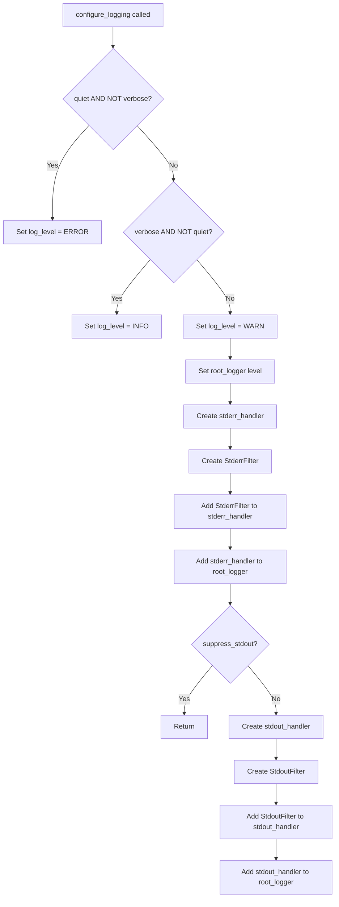

# `cli.py`

## `src.exodus_bundler.cli.parse_args` · *function*

## Summary:
Parses command-line arguments for the Exodus bundler tool and returns them as a dictionary.

## Description:
This function configures and executes an argument parser to process command-line inputs for the Exodus ELF bundling utility. It defines various options for specifying executables to bundle, additional dependencies, output settings, and behavioral flags. The function serves as the primary interface for translating user-provided command-line arguments into a structured data format that can be processed by the bundling logic.

The function is extracted into its own component to separate the concerns of argument parsing from the core bundling logic, making the code more modular and testable. This design allows the bundling functionality to be invoked programmatically without requiring command-line interaction.

## Args:
    args (list[str], optional): Command-line arguments to parse. If None, sys.argv[1:] is used. Defaults to None.
    namespace (argparse.Namespace, optional): An object to store parsed arguments. If None, a new namespace is created. Defaults to None.

## Returns:
    dict[str, Any]: A dictionary mapping argument names to their parsed values. Keys include:
        - 'executables': List of ELF executable paths (required positional argument)
        - 'chroot': Path to chroot directory (optional)
        - 'add': List of additional dependency files/directories (optional)
        - 'detect': Boolean flag for auto-detection of dependencies (optional)
        - 'no_symlink': List of files that should not be symlinked (optional)
        - 'output': Output file path (optional)
        - 'quiet': Boolean flag to suppress warnings (optional)
        - 'rename': List of new names for executables (optional)
        - 'shell_launchers': Boolean flag to force shell launchers (optional)
        - 'tarball': Boolean flag to create tarball instead of installation script (optional)
        - 'verbose': Boolean flag for verbose output (optional)

## Raises:
    SystemExit: When invalid arguments are provided or help is requested, argparse will cause the program to exit.

## Constraints:
    Preconditions:
        - The function must be called with valid argument types
        - If 'rename' is specified, the number of rename arguments must match the number of executables
        - If 'chroot' is specified, the path must exist and be a valid directory
        
    Postconditions:
        - Returns a dictionary with all defined arguments populated
        - All arguments are properly validated by argparse
        - The returned dictionary contains only keys defined in the argument parser

## Side Effects:
    - May print help text to stdout if --help is specified
    - May print error messages to stderr if invalid arguments are provided
    - May cause program termination via SystemExit if parsing fails

## Control Flow:
```mermaid
flowchart TD
    A[Start parse_args] --> B{args provided?}
    B -->|No| C[Use sys.argv[1:]]
    B -->|Yes| C
    C --> D[Create ArgumentParser]
    D --> E[Add executables argument]
    E --> F[Add chroot argument]
    F --> G[Add add argument]
    G --> H[Add detect argument]
    H --> I[Add no_symlink argument]
    I --> J[Add output argument]
    J --> K[Add quiet argument]
    K --> L[Add rename argument]
    L --> M[Add shell_launchers argument]
    M --> N[Add tarball argument]
    N --> O[Add verbose argument]
    O --> P[Parse arguments]
    P --> Q[Convert to dict with vars()]
    Q --> R[Return parsed arguments]
```

## Examples:
```python
# Basic usage with default arguments
parsed_args = parse_args(['myapp'])

# Usage with multiple executables and options
parsed_args = parse_args([
    'app1', 'app2', 
    '-c', '/path/to/chroot',
    '-a', '/lib/custom.so',
    '-o', 'bundle.tgz',
    '--tarball'
])

# Usage with renaming
parsed_args = parse_args([
    'old_name1', 'old_name2',
    '-r', 'new_name1',
    '-r', 'new_name2'
])
```

## `src.exodus_bundler.cli.configure_logging` · *function*

## Summary:
Configures the application's logging system with appropriate levels and output handlers based on command-line flags.

## Description:
Sets up logging configuration for the Exodus bundler CLI application, managing log levels and directing output to stdout and stderr based on verbosity settings. This function separates logging configuration concerns from the main application logic to provide a clean, reusable logging setup.

The function is typically called early in the CLI execution flow when command-line arguments have been parsed but before any significant processing begins. It establishes the appropriate logging level (WARN, ERROR, or INFO) and configures handlers to send different log levels to appropriate streams (stderr for warnings and errors, stdout for debug and info messages).

## Args:
    quiet (bool): When True, sets logging level to ERROR to suppress warnings and info messages.
    verbose (bool): When True, sets logging level to INFO to enable verbose output.
    suppress_stdout (bool): When True, disables stdout logging output. Defaults to False.

## Returns:
    None: This function configures global logging state and returns no value.

## Raises:
    None explicitly raised by this function.

## Constraints:
    Preconditions:
    - The root_logger must be properly initialized in the exodus_bundler module
    - quiet and verbose parameters should not both be True (though the function handles this gracefully)
    
    Postconditions:
    - The root_logger's level is set appropriately based on quiet/verbose flags
    - stderr handler is configured with WARN and ERROR messages
    - stdout handler is configured with DEBUG and INFO messages (unless suppressed)

## Side Effects:
    - Modifies the global root_logger configuration
    - Adds stderr and stdout handlers to the root_logger
    - May modify stdout/stderr stream behavior through handler configuration

## Control Flow:


## Examples:
    # Configure for normal operation (default WARN level)
    configure_logging(False, False)
    
    # Configure for quiet operation (ERROR level only)
    configure_logging(True, False)
    
    # Configure for verbose operation (INFO level)
    configure_logging(False, True)
    
    # Configure for verbose operation with suppressed stdout
    configure_logging(False, True, suppress_stdout=True)
```

## `src.exodus_bundler.cli.StderrFilter` · *class*

## Summary:
A logging filter that returns True for WARNING and ERROR level log records.

## Description:
The StderrFilter class implements a logging filter that evaluates log records and returns True only for records with WARNING or ERROR severity levels. This is a standard implementation of the logging.Filter interface.

## State:
- The class inherits from logging.Filter
- The filter method receives a logging.LogRecord object and returns a boolean value

## Lifecycle:
- Creation: Instantiated as a logging.Filter subclass
- Usage: Called automatically by the logging system when processing log records
- Destruction: Managed by Python's garbage collection

## Method Map:
```mermaid
graph TD
    A[Log Record] --> B[StderrFilter.filter()]
    B --> C{levelno in (WARN, ERROR)?}
    C -->|Yes| D[Return True]
    C -->|No| E[Return False]
```

## Raises:
- No exceptions are raised by the constructor
- The filter method accesses record.levelno which is part of the standard LogRecord interface

## Example:
```python
import logging
from exodus_bundler.cli import StderrFilter

# Create logger and handler
logger = logging.getLogger('test')
handler = logging.StreamHandler(sys.stderr)

# Add filter to handler
handler.addFilter(StderrFilter())

# Configure handler
handler.setLevel(logging.DEBUG)
logger.addHandler(handler)
logger.setLevel(logging.DEBUG)

# Only WARNING and ERROR messages will appear on stderr
logger.info("This won't appear")  # Filtered out
logger.warning("This will appear")  # Will appear
logger.error("This will also appear")  # Will appear
```

### `src.exodus_bundler.cli.StderrFilter.filter` · *method*

## Summary:
Filters log records to only allow WARNING and ERROR level messages to pass through to stderr.

## Description:
This method implements a logging filter that selectively permits log records with WARNING or ERROR severity levels while blocking all other log levels. It is designed to be used with Python's logging system to route only critical messages to standard error output. This filter is typically used in command-line interfaces to separate important diagnostic messages from informational or debug output.

## Args:
    record (logging.LogRecord): A logging record object containing information about the log event

## Returns:
    bool: True if the record level is either WARNING (30) or ERROR (40), False otherwise

## Raises:
    None explicitly raised

## State Changes:
    Attributes READ: None - this method only reads the record parameter
    Attributes WRITTEN: None - this method does not modify any instance attributes

## Constraints:
    Preconditions: The record parameter must be a valid logging.LogRecord object with a levelno attribute
    Postconditions: The method always returns a boolean value indicating whether the record should be processed

## Side Effects:
    None - this method performs no I/O operations or external service calls

## `src.exodus_bundler.cli.StdoutFilter` · *class*

## Summary:
A logging filter that permits only DEBUG and INFO level messages to pass through.

## Description:
The StdoutFilter class is designed to control log output by filtering out log records that are not at DEBUG or INFO severity levels. This filter is typically used to restrict console output to only the most important informational messages, suppressing WARNING, ERROR, and CRITICAL level logs from appearing in standard output.

This class serves as a specialized logging filter that helps manage verbosity in command-line interfaces by ensuring that only relevant informational messages are displayed to users while keeping diagnostic and error messages available for debugging purposes.

## State:
- The class has no instance attributes beyond those inherited from logging.Filter
- The filter method receives a log record object and returns a boolean value
- No initialization parameters are required as it's a stateless filter

## Lifecycle:
- Creation: Instantiated as a standard logging.Filter subclass with no constructor arguments
- Usage: Applied to logging handlers via addFilter() method or through logging configuration
- Destruction: Managed automatically by Python's garbage collection when no longer referenced

## Method Map:
```mermaid
graph TD
    A[StdoutFilter] --> B[filter(record)]
    B --> C{record.levelno in (DEBUG, INFO)}
    C -->|True| D[Return True]
    C -->|False| E[Return False]
```

## Raises:
- No exceptions are raised by the filter method under normal operation
- The filter method may raise AttributeError if the record parameter doesn't have a levelno attribute, though this would be unusual in standard logging usage

## Example:
```python
import logging
from exodus_bundler.cli import StdoutFilter

# Create logger and handler
logger = logging.getLogger('myapp')
handler = logging.StreamHandler()

# Apply the filter to only show DEBUG and INFO messages
handler.addFilter(StdoutFilter())

# Configure logger
logger.addHandler(handler)
logger.setLevel(logging.DEBUG)

# These will appear in output
logger.info("Application started")
logger.debug("Debug information")

# These will be filtered out
logger.warning("This warning won't appear")
logger.error("This error won't appear")
```

### `src.exodus_bundler.cli.StdoutFilter.filter` · *method*

## Summary:
Filters log records to only allow DEBUG and INFO level messages to pass through.

## Description:
This method implements a logging filter that restricts log output to only include records with DEBUG or INFO severity levels. It is designed to control verbosity of console output by suppressing WARNING, ERROR, and CRITICAL level messages.

## Args:
    record (logging.LogRecord): The log record to be filtered

## Returns:
    bool: True if the record level is either DEBUG (10) or INFO (20), False otherwise

## Raises:
    None

## State Changes:
    Attributes READ: None
    Attributes WRITTEN: None

## Constraints:
    Preconditions: The record parameter must be a valid logging.LogRecord instance
    Postconditions: The method always returns a boolean value indicating whether the record should be processed

## Side Effects:
    None

## `src.exodus_bundler.cli.main` · *function*

## Summary:
Entry point for the Exodus bundler CLI tool that processes command-line arguments, configures logging, and orchestrates the bundle creation process.

## Description:
The main function serves as the central coordination point for the Exodus bundler command-line interface. It parses command-line arguments, handles default output path resolution, configures logging based on verbosity flags, processes stdin input for additional dependencies, and delegates the actual bundling operation to the create_bundle function. This function encapsulates the complete CLI workflow while maintaining separation of concerns through its dependency on specialized parsing and logging functions.

The function is extracted into its own component to provide a clean entry point for the CLI application, separating the orchestration logic from the core bundling implementation. This design enables better testability and modularity, allowing the bundling functionality to be reused programmatically without command-line interaction.

## Args:
    args (list[str], optional): Command-line arguments to parse. If None, sys.argv[1:] is used. Defaults to None.
    namespace (argparse.Namespace, optional): An object to store parsed arguments. If None, a new namespace is created. Defaults to None.

## Returns:
    None: This function does not return a value but may exit the program with a status code.

## Raises:
    SystemExit: Raised when fatal errors occur during bundle creation, causing the program to terminate with exit code 1.

## Constraints:
    Preconditions:
        - Command-line arguments must be valid according to the argument parser specification
        - If 'rename' is specified, the number of rename arguments must match the number of executables
        - If 'chroot' is specified, the path must exist and be a valid directory
        - The output directory path must be writable if output is not '-' (stdout)
        
    Postconditions:
        - Logging is properly configured based on quiet/verbose flags
        - Input from stdin is processed and added to the 'add' argument list if applicable
        - Bundle creation is attempted with all parsed arguments
        - Program exits with code 1 if a FatalError occurs

## Side Effects:
    - Reads command-line arguments from sys.argv or provided args parameter
    - Configures global logging state through configure_logging function
    - May read from stdin if not connected to a terminal
    - May write to stdout/stderr based on logging configuration and output settings
    - May create output files at the specified output path
    - Terminates program execution with sys.exit(1) on fatal errors

## Control Flow:
```mermaid
flowchart TD
    A[main() called] --> B[parse_args(args, namespace)]
    B --> C{output is None?}
    C -->|Yes| D{sys.stdout.isatty()?}
    D -->|Yes| E[Set output to default template]
    D -->|No| F[Set output to '-']
    C -->|No| G[Skip output defaulting]
    G --> H[Pop quiet, verbose from args]
    H --> I[Calculate suppress_stdout]
    I --> J[configure_logging()]
    J --> K{stdin is not a TTY?}
    K -->|Yes| L[extract_paths from stdin]
    L --> M[Add extracted paths to args['add']]
    M --> N[create_bundle(**args)]
    N --> O{FatalError raised?}
    O -->|Yes| P[Log error message]
    P --> Q[Log error details if verbose]
    Q --> R[sys.exit(1)]
    O -->|No| S[Normal completion]
```

## Examples:
    # Basic usage with executable arguments
    main(['myapp'])
    
    # Usage with output specification
    main(['myapp', '-o', 'bundle.tgz'])
    
    # Usage with verbose output
    main(['myapp', '--verbose'])
    
    # Usage with stdin input for dependencies
    echo "/lib/libcustom.so" | main(['myapp'])
    
    # Usage with chroot environment
    main(['myapp', '-c', '/path/to/chroot'])
```

