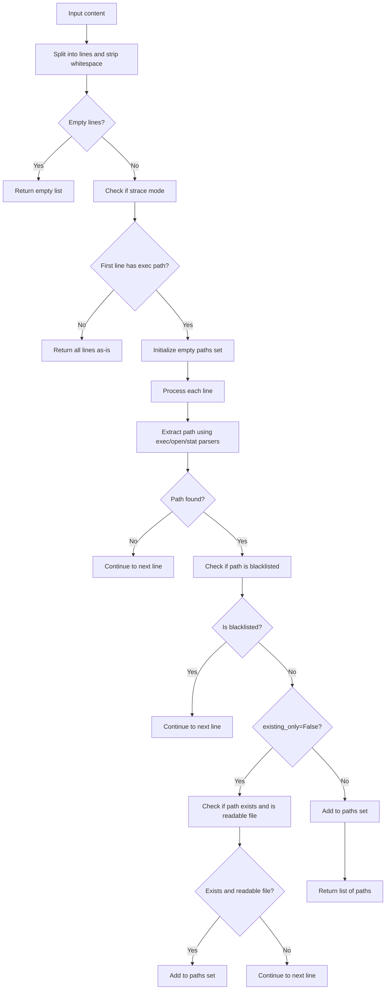

# `input_parsing.py`

## `src.exodus_bundler.input_parsing.extract_exec_path` · *function*

*No documentation generated.*

## `src.exodus_bundler.input_parsing.extract_open_path` · *function*

*No documentation generated.*

## `src.exodus_bundler.input_parsing.extract_stat_path` · *function*

*No documentation generated.*

## `src.exodus_bundler.input_parsing.extract_paths` · *function*

## Summary:
Extracts unique file paths from log content by parsing different trace formats and filtering based on existence and blacklisted directories.

## Description:
Processes log content containing system call traces (like strace output) to extract file paths from various trace formats. The function identifies different trace patterns and extracts paths accordingly, applying filters to exclude blacklisted directories and optionally require that extracted paths exist on the filesystem. When the content appears to be in strace format (first line contains exec path), it parses each line for different trace patterns. Otherwise, it returns all non-empty lines as-is.

## Args:
    content (str): Raw log content containing system call traces, typically from strace output
    existing_only (bool): When True, only returns paths that exist on the filesystem and are readable files (not directories). When False, returns all extracted paths regardless of existence. Defaults to True.

## Returns:
    list[str]: A list of unique file paths extracted from the content. Returns an empty list if no valid paths are found or if content is empty.

## Raises:
    None: This function does not explicitly raise exceptions, though underlying OS operations may raise exceptions.

## Constraints:
    Preconditions:
        - Content must be a string
        - The content should contain system call traces in supported formats
    Postconditions:
        - Returns a list of unique paths (no duplicates)
        - All returned paths are either existing files or all paths when existing_only=False
        - All returned paths are not in blacklisted directories
        - If content doesn't appear to be strace format, returns all non-empty lines as-is

## Side Effects:
    - Performs file system operations (os.path.exists, os.access) when existing_only=True
    - May perform I/O operations for file system checks

## Control Flow:


## Examples:
    >>> extract_paths('execve("/bin/ls", [...], [...])\\nopen("/etc/passwd", O_RDONLY)', existing_only=True)
    ['/bin/ls', '/etc/passwd']
    >>> extract_paths('execve("/nonexistent", [...], [...])\\nopen("/tmp/file", O_RDONLY)', existing_only=True)
    ['/tmp/file']  # Only returns existing files
    >>> extract_paths('execve("/bin/ls", [...], [...])\\nopen("/etc/passwd", O_RDONLY)', existing_only=False)
    ['/bin/ls', '/etc/passwd']  # Returns all paths regardless of existence
    >>> extract_paths('Regular log line\\nAnother line')
    ['Regular log line', 'Another line']  # Non-strace format returns all lines

## `src.exodus_bundler.input_parsing.strip_pid_prefix` · *function*

## Summary:
Removes process ID prefix from log lines that start with "[pid XXX] " format.

## Description:
Extracts and strips process ID prefixes from log lines, commonly found in debugging output where each line is prefixed with "[pid XXX] " where XXX represents the process identifier. This function enables clean processing of log data by removing these metadata prefixes.

## Args:
    line (str): Input log line that may contain a process ID prefix in the format "[pid XXX] " where XXX is a numeric process identifier.

## Returns:
    str: The input line with process ID prefix removed if present, otherwise returns the original line unchanged.

## Raises:
    None: This function does not raise any exceptions.

## Constraints:
    Preconditions:
        - Input must be a string
    Postconditions:
        - Output is always a string
        - If process ID prefix is present, it is completely stripped from the beginning of the line
        - If no process ID prefix is present, the original line is returned unchanged

## Side Effects:
    None: This function performs no I/O operations or external state mutations.

## Control Flow:
```mermaid
flowchart TD
    A[Input line] --> B{Matches pattern \\[pid\\s+\\d+\\]\\s*}
    B -- Yes --> C[Return line without prefix]
    B -- No --> D[Return original line]
    C --> E[Output]
    D --> E
```

## Examples:
    >>> strip_pid_prefix("[pid 1234] Hello world")
    'Hello world'
    >>> strip_pid_prefix("[pid 5678]   Multiple spaces")
    'Multiple spaces'
    >>> strip_pid_prefix("No prefix here")
    'No prefix here'
    >>> strip_pid_prefix("[pid 9999] ")
    ''
```

