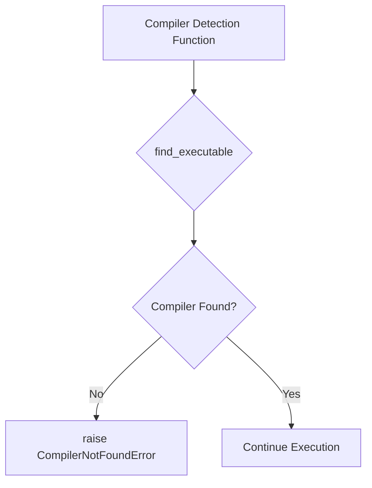
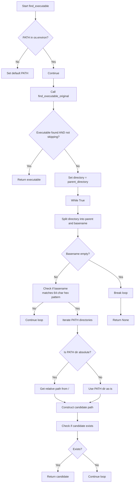
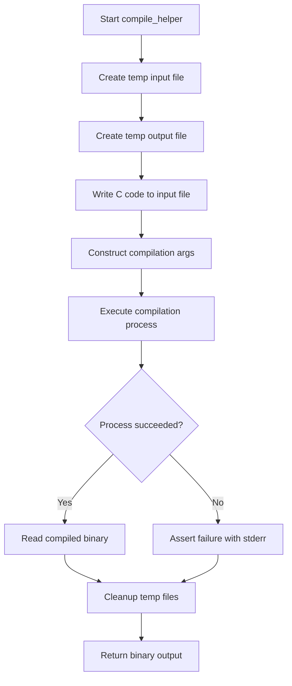
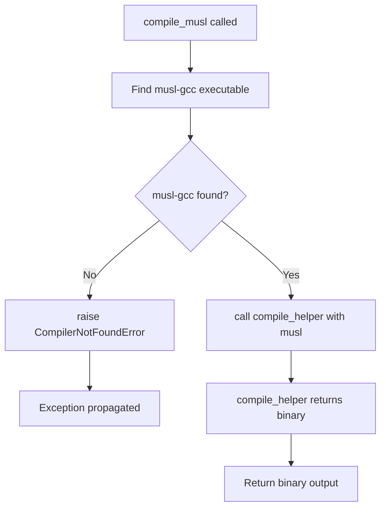
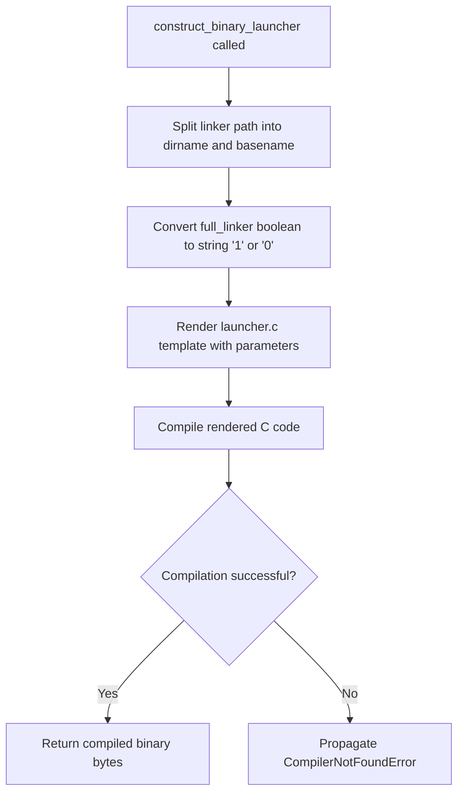

# `launchers.py`

## `src.exodus_bundler.launchers.CompilerNotFoundError` · *class*

## Summary:
Custom exception raised when a required compiler cannot be located in the system environment.

## Description:
This exception is designed to signal that a compilation process failed due to the absence of a required compiler tool. It extends the standard Exception class and serves as a specific error indicator for compiler discovery failures within the Exodus bundler's launcher functionality.

## State:
- Inherits from Exception class with no additional attributes
- No constructor parameters required as it's a basic exception class

## Lifecycle:
- Creation: Instantiated when compiler detection fails, typically during build setup or execution phases
- Usage: Raised by functions that search for compilers using system tools like find_executable
- Destruction: Standard exception cleanup when caught or allowed to propagate

## Method Map:


## Raises:
- CompilerNotFoundError: Raised when a required compiler cannot be located via system PATH searches

## Example:
```python
try:
    # Attempt to find a compiler
    compiler_path = find_executable('gcc')
    if not compiler_path:
        raise CompilerNotFoundError("GCC compiler not found in system PATH")
except CompilerNotFoundError as e:
    print(f"Compilation error: {e}")
    # Handle missing compiler scenario
```

## `src.exodus_bundler.launchers.find_executable` · *function*

## Summary:
Finds an executable binary by searching standard paths and alternative directory structures containing 64-character hexadecimal identifiers.

## Description:
This function attempts to locate an executable binary by first checking standard system paths using distutils.spawn.find_executable, then falling back to a custom search mechanism that traverses parent directories looking for 64-character hexadecimal directory names and searches for the executable within those directory structures. The implementation appears to reference undefined functions/variables and may require additional setup to work correctly.

## Args:
    binary_name (str): Name of the executable to find
    skip_original_for_testing (bool): When True, bypasses the initial distutils.spawn.find_executable check and directly uses the custom search mechanism. Defaults to False.

## Returns:
    str or None: Full path to the executable if found, None otherwise

## Raises:
    None explicitly raised

## Constraints:
    Preconditions:
    - binary_name must be a non-empty string
    - PATH environment variable should be accessible
    - The function depends on undefined variables/functions: `find_executable_original` and `parent_directory`
    
    Postconditions:
    - Returns either a valid absolute path to an executable or None
    - Does not modify system state beyond environment variable access

## Side Effects:
    - Accesses environment variables (os.environ)
    - Reads filesystem to check for executable existence
    - May modify PATH environment variable if not present

## Control Flow:


## Examples:
    # Find python executable using standard search
    exe_path = find_executable('python')
    
    # Find executable with testing bypass
    exe_path = find_executable('myapp', skip_original_for_testing=True)

## `src.exodus_bundler.launchers.compile` · *function*

*No documentation generated.*

## `src.exodus_bundler.launchers.compile_diet` · *function*

## Summary:
Compiles C source code using the diet compiler with GCC backend.

## Description:
This function serves as a specialized compiler launcher that specifically searches for and uses the diet compiler in combination with GCC to compile C source code. It validates the presence of both required tools before proceeding with compilation, raising a custom exception if either tool is missing. The function acts as a bridge between the higher-level templating system and the actual compilation process.

Known callers within the codebase:
- Called by templating functions that generate C code requiring compilation
- Triggered during build processes when diet-based compilation is requested

This logic is extracted into its own function rather than being inlined because it encapsulates the specific compiler toolchain requirements for diet compilation, providing a clear boundary between tool discovery and compilation execution while maintaining consistency with other compiler launchers in the system.

## Args:
    code (str): The C source code to compile as a string

## Returns:
    The return value is determined by the compile_helper function, which compiles the provided C code using diet and gcc compilers and returns the resulting binary output.

## Raises:
    CompilerNotFoundError: When either the 'diet' compiler or 'gcc' cannot be found in the system PATH

## Constraints:
    Preconditions:
        - The system must have both 'diet' and 'gcc' compilers installed and accessible via PATH
        - The code parameter must contain valid C source code
        - The diet compiler must support the GCC backend interface
        
    Postconditions:
        - Either compilation succeeds and returns binary output, or an exception is raised
        - No temporary files are left behind (handled by compile_helper)

## Side Effects:
    - No direct I/O operations
    - No external state mutations
    - No external service calls
    - Relies on subprocess execution for compilation

## Control Flow:
```mermaid
flowchart TD
    A[Start compile_diet] --> B[Find diet compiler]
    B --> C[Find gcc compiler]
    C --> D{Both compilers found?}
    D -->|No| E[Raise CompilerNotFoundError]
    D -->|Yes| F[Call compile_helper with [diet, gcc]]
    E --> G[Exit with exception]
    F --> H[Return compile_helper result]
    G --> I[End]
    H --> I
```

## Examples:
```python
# Basic usage with valid C code
c_code = '''
#include <stdio.h>
int main() {
    printf("Hello World\\n");
    return 0;
}
'''

try:
    # This will compile using diet + gcc
    binary = compile_diet(c_code)
    # Use the compiled binary...
except CompilerNotFoundError as e:
    print(f"Missing compiler: {e}")
    # Handle missing compiler scenario
```

## `src.exodus_bundler.launchers.compile_helper` · *function*

## Summary:
Compiles C source code into a static binary executable using system compiler tools.

## Description:
This function serves as a helper for compiling C code into executable binaries. It creates temporary files for input and output, writes the provided C code to a temporary .c file, executes a compilation process with specified arguments plus optimization and static linking flags, and returns the resulting binary output. The function ensures proper cleanup of temporary files regardless of success or failure.

## Args:
    code (str): The C source code to compile as a string
    initial_args (list[str]): Command-line arguments to pass to the compiler (excluding internal flags)

## Returns:
    bytes: The compiled binary output as raw bytes

## Raises:
    AssertionError: When the compilation process returns a non-zero exit code, indicating compilation failure

## Constraints:
    Preconditions:
        - The system must have a working C compiler installed (e.g., gcc, clang)
        - The initial_args must contain valid compiler command-line arguments
        - The code parameter must contain valid C source code
    
    Postconditions:
        - Temporary files are cleaned up after execution
        - The returned bytes represent a valid compiled binary

## Side Effects:
    - Creates temporary files in the system's temporary directory
    - Removes temporary files after processing
    - Executes external compiler process via subprocess

## Control Flow:


## Examples:
```python
# Basic usage
c_code = '''
#include <stdio.h>
int main() {
    printf("Hello World\\n");
    return 0;
}
'''

# Assuming gcc is available
args = ['gcc']
binary = compile_helper(c_code, args)
```

## `src.exodus_bundler.launchers.compile_musl` · *function*

## Summary:
Compiles C source code using the musl-gcc compiler toolchain to produce a statically-linked binary executable.

## Description:
This function serves as a specialized compiler launcher that specifically targets the musl libc compiler suite. It searches for the 'musl-gcc' executable in the system PATH and validates its presence before proceeding with compilation. The function acts as a wrapper that ensures the musl compiler is available before delegating to the general compilation helper.

The function is extracted into its own component to enforce a clear responsibility boundary for musl-specific compilation workflows, separating compiler discovery logic from the actual compilation process handled by compile_helper.

## Args:
    code (str): The C source code to compile as a string

## Returns:
    bytes: The compiled binary output as raw bytes, produced by the underlying compile_helper function

## Raises:
    CompilerNotFoundError: Raised when the 'musl-gcc' compiler executable cannot be found in the system PATH

## Constraints:
    Preconditions:
        - The system must have 'musl-gcc' installed and available in PATH
        - The code parameter must contain valid C source code
    
    Postconditions:
        - The function returns the compiled binary output from compile_helper
        - No temporary files are created or managed by this function directly

## Side Effects:
    - None directly observable from this function
    - Relies on compile_helper for temporary file management and subprocess execution

## Control Flow:


## Examples:
```python
# Basic usage with valid C code
c_code = '''
#include <stdio.h>
int main() {
    printf("Hello World\\n");
    return 0;
}
'''

try:
    binary = compile_musl(c_code)
    # Use the compiled binary
except CompilerNotFoundError as e:
    print(f"Musl compiler not found: {e}")
    # Handle missing compiler scenario
```

## `src.exodus_bundler.launchers.construct_bash_launcher` · *function*

*No documentation generated.*

## `src.exodus_bundler.launchers.construct_binary_launcher` · *function*

## Summary:
Constructs a binary launcher by rendering a C template and compiling it into an executable binary.

## Description:
Creates a binary launcher executable by templating a C source file, compiling the resulting code, and returning the compiled binary. This function orchestrates the process of generating a launcher program that can execute a target binary with specified linking requirements.

The function extracts the directory and basename of the linker path, converts the boolean flag to a string representation, renders a C template with the provided parameters, and compiles the result into a binary executable. This logic is separated into its own function to encapsulate the launcher construction workflow and provide a clean interface for creating binary launchers.

## Args:
    linker (str): Path to the linker executable, used to extract directory and basename for template rendering
    library_path (str): Path to the library to be linked with the executable
    executable (str): Path to the target executable to be launched
    full_linker (bool): Flag indicating whether to use full linker features. Defaults to True

## Returns:
    bytes: The compiled binary executable as raw bytes, representing the launcher program

## Raises:
    CompilerNotFoundError: When no suitable C compiler (musl-gcc or diet-gcc) is found in the system PATH

## Constraints:
    Preconditions:
        - The linker path must be a valid filesystem path
        - The library_path must be a valid path to a library file
        - The executable must be a valid path to an executable file
        - At least one suitable C compiler (musl-gcc or diet-gcc) must be available in the system PATH
    
    Postconditions:
        - The returned bytes represent a valid compiled binary executable
        - All input parameters are properly processed and passed to the compilation pipeline

## Side Effects:
    - Invokes subprocess calls to compile C code using available compilers
    - Uses temporary files during the compilation process (handled internally by compile functions)
    - No direct file system modifications beyond temporary file creation/deletion

## Control Flow:


