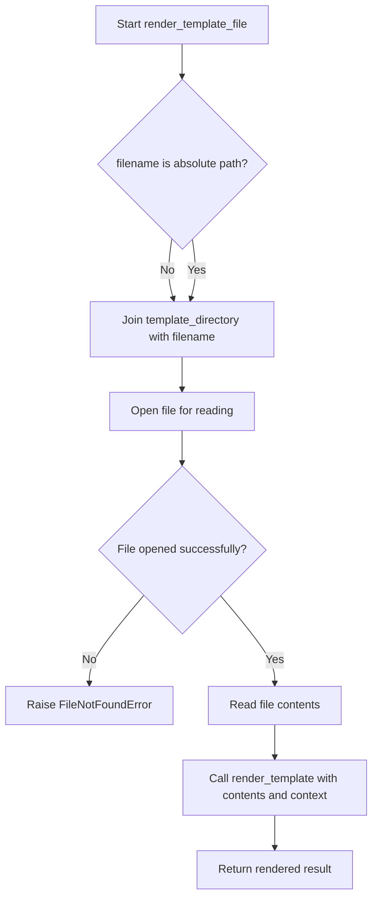

# `templating.py`

## `src.exodus_bundler.templating.render_template` · *function*

## Summary:
Replaces template placeholders in a string with provided context values.

## Description:
Processes a string by replacing all occurrences of placeholders in the format `{{key}}` with their corresponding values from the provided context dictionary. This function enables basic template rendering functionality for string substitution.

## Args:
    string (str): The template string containing placeholders in the format `{{key}}`
    **context (dict): Keyword arguments where keys are placeholder names and values are replacement strings

## Returns:
    str: The input string with all placeholders replaced by their corresponding context values

## Raises:
    None explicitly raised

## Constraints:
    Preconditions:
    - The input string must be a valid string object
    - All placeholder keys in the string must be present in the context dictionary for meaningful replacements
    
    Postconditions:
    - The returned string will have all matching placeholders replaced
    - If a placeholder key is not found in context, it will remain unchanged in the output

## Side Effects:
    None

## Control Flow:
```mermaid
flowchart TD
    A[Start render_template] --> B{string contains placeholders?}
    B -- Yes --> C[Iterate through context items]
    C --> D[Replace {{key}} with value]
    D --> E[Update string]
    E --> F{More context items?}
    F -- Yes --> C
    F -- No --> G[Return processed string]
    B -- No --> G
```

## Examples:
    >>> render_template("Hello {{name}}!", name="World")
    "Hello World!"
    
    >>> render_template("{{greeting}} {{name}}", greeting="Hi", name="Alice")
    "Hi Alice"
    
    >>> render_template("No placeholders here")
    "No placeholders here"
```

## `src.exodus_bundler.templating.render_template_file` · *function*

## Summary:
Reads a template file and renders it with provided context variables.

## Description:
Loads a template file from disk, reads its contents, and processes it using the render_template function with the provided context variables. This function serves as a bridge between file-based template loading and template rendering logic, allowing templates to be loaded from either absolute paths or relative paths within the template_directory.

## Args:
    filename (str): Path to the template file. Can be relative to template_directory or absolute.
    **context (dict): Keyword arguments containing variable names and their replacement values for template rendering.

## Returns:
    str: The rendered template content with all placeholders replaced by their corresponding context values.

## Raises:
    FileNotFoundError: When the specified template file cannot be found at the given path.

## Constraints:
    Preconditions:
    - The filename parameter must be a valid string
    - The template file must exist at the specified location
    - The template_directory variable must be defined in the module scope
    
    Postconditions:
    - Returns a string with all template placeholders replaced
    - The function does not modify the original template file

## Side Effects:
    - Reads from the filesystem to load the template file
    - May raise IOError if the file cannot be opened or read

## Control Flow:


## Examples:
    >>> render_template_file('welcome.txt', name='Alice', greeting='Hello')
    "Hello Alice, welcome to our site!"

    >>> render_template_file('/absolute/path/template.html', title='Home', content='Welcome')
    "<html><head><title>Home</title></head><body>Welcome</body></html>"

