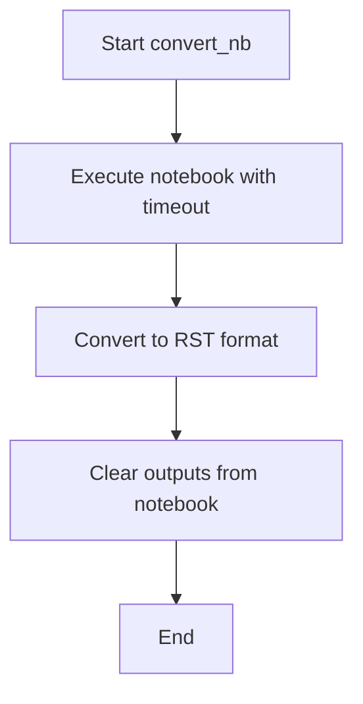

# `nb_to_doc.py`

## `docs.tutorials.tools.nb_to_doc.convert_nb` · *function*

## Summary:
Executes a Jupyter notebook, converts it to RST format, and clears outputs from the notebook file.

## Description:
Performs a three-stage processing pipeline on a Jupyter notebook file. First, executes the notebook with a 60-second timeout and saves changes in-place. Second, generates an RST (reStructuredText) version of the notebook. Third, clears all cell outputs from the original notebook file while preserving its structure. This function automates the complete processing workflow for tutorial notebooks.

## Args:
    nbname (str): The base name of the notebook file (without .ipynb extension) to process.

## Returns:
    None: This function does not return any value.

## Raises:
    subprocess.CalledProcessError: If any of the nbconvert shell commands fail during execution.

## Constraints:
    Preconditions:
    - The notebook file must exist with the name {nbname}.ipynb
    - Jupyter nbconvert must be installed and available in the system PATH
    - The user must have appropriate permissions to execute the notebook and modify files
    
    Postconditions:
    - The original notebook file will be modified in-place during execution and output clearing steps
    - An RST version of the notebook will be created alongside the original
    - All cell outputs will be cleared from the final notebook version

## Side Effects:
    - Modifies the original notebook file in-place during execution and output clearing steps
    - Creates a new RST file with the same base name as the notebook
    - Executes shell commands through the sh() function (assumed to be a subprocess wrapper)

## Control Flow:


## Examples:
```python
# Process a notebook named "tutorial_example"
convert_nb("tutorial_example")

# This will:
# 1. Execute tutorial_example.ipynb with 60 second timeout
# 2. Create tutorial_example.rst from the executed notebook
# 3. Clear outputs from tutorial_example.ipynb
```

