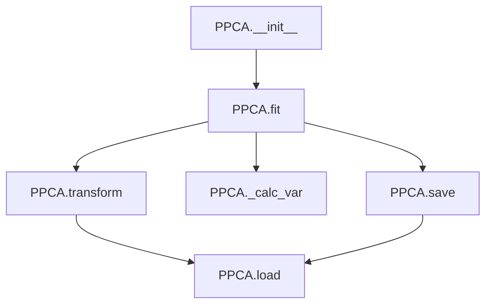

# `ppca.py`

## `hypertools._externals.ppca.PPCA` · *class*

## Summary:
Probabilistic Principal Component Analysis (PPCA) implementation for dimensionality reduction with missing data handling.

## Description:
The PPCA class implements a probabilistic approach to principal component analysis that can handle datasets with missing values. It fits a probabilistic model to the data and performs dimensionality reduction by projecting data onto the principal components. This class is particularly useful for analyzing datasets where some observations may be missing or corrupted.

## State:
- raw: Original data array (numpy.ndarray), or None if not fitted
- data: Standardized data used for fitting (numpy.ndarray), or None if not fitted  
- C: Projection matrix containing principal components (numpy.ndarray), or None if not fitted
- means: Mean values for each feature in the dataset (numpy.ndarray), or None if not fitted
- stds: Standard deviation values for each feature in the dataset (numpy.ndarray), or None if not fitted

## Lifecycle:
- Creation: Instantiate with PPCA() constructor
- Fitting: Call fit(data, d=None, tol=1e-4, min_obs=10, verbose=False) to train the model on data
- Transformation: Call transform(data=None) to project data onto principal components
- Persistence: Use save(fpath) to serialize the model and load(fpath) to deserialize it
- The model must be fitted before transformation or variance calculation can occur

## Method Map:


## Raises:
- RuntimeError: When attempting to standardize or transform before fitting (means/stds not set)
- RuntimeError: When attempting to calculate variance or transform before fitting (data/C not set)
- AssertionError: When loading from a file that doesn't exist

## Example:
```python
import numpy as np
from hypertools._externals.ppca import PPCA

# Create sample data with missing values
data = np.array([[1, 2, np.nan], [4, 5, 6], [7, np.nan, 9], [10, 11, 12]])

# Create and fit the PPCA model
ppca = PPCA()
ppca.fit(data, d=2, verbose=True)

# Transform the original data
transformed_data = ppca.transform()

# Transform new data using the same model
new_data = np.array([[2, 3, np.nan], [8, 9, 10]])
new_transformed = ppca.transform(new_data)

# Save the fitted model
ppca.save('ppca_model.npy')

# Load and use the saved model
loaded_ppca = PPCA()
loaded_ppca.load('ppca_model.npy')
```

### `hypertools._externals.ppca.PPCA.__init__` · *method*

## Summary:
Initializes the PPCA object with default attribute values set to None.

## Description:
This constructor method initializes the PPCA class instance with all internal state attributes set to None. These attributes will be populated during the fitting process when the `fit()` method is called. The initialization ensures that the object starts in a clean state with no fitted data or model parameters.

## Args:
    None

## Returns:
    None

## Raises:
    None

## State Changes:
    Attributes READ: None
    Attributes WRITTEN: 
    - self.raw: Set to None
    - self.data: Set to None  
    - self.C: Set to None
    - self.means: Set to None
    - self.stds: Set to None

## Constraints:
    Preconditions: None
    Postconditions: All internal attributes are initialized to None, indicating the object is in an unfitted state

## Side Effects:
    None

### `hypertools._externals.ppca.PPCA.fit` · *method*

## Summary:
Performs probabilistic principal component analysis on input data, estimating the principal components and associated variance.

## Description:
This method implements the probabilistic principal component analysis (PPCA) algorithm to find the underlying low-dimensional structure in the input data. It handles missing values and infinities in the data, performs iterative optimization to estimate the model parameters, and stores the results as instance attributes.

The method is typically called during the initialization or training phase of a PPCA model, where it processes raw data to extract principal components that capture the most significant variance in the dataset.

## Args:
    data (array-like): Input data matrix of shape (N, D) where N is the number of observations and D is the number of variables.
    d (int, optional): Number of principal components to compute. Defaults to None, which uses all variables.
    tol (float, optional): Convergence tolerance for the iterative algorithm. Defaults to 1e-4.
    min_obs (int, optional): Minimum number of valid observations required for a variable to be included. Defaults to 10.
    verbose (bool, optional): If True, prints convergence information during iterations. Defaults to False.

## Returns:
    None: This method modifies the object's state in-place and does not return a value.

## Raises:
    None explicitly raised: Based on the implementation, no explicit exceptions are raised by this method.

## State Changes:
    Attributes READ: 
        - self.C (if not None, used to initialize C)
        - self.raw (used to store input data)
    Attributes WRITTEN:
        - self.raw: Stores the input data with infinities replaced
        - self.means: Stores mean values for each variable
        - self.stds: Stores standard deviation values for each variable
        - self.C: Stores the estimated principal component matrix
        - self.data: Stores the standardized data
        - self.eig_vals: Stores eigenvalues of the principal components

## Constraints:
    Preconditions:
        - Input data should be numeric
        - Data should have at least one finite value
        - If d is specified, it should be less than or equal to the number of variables in the data
    Postconditions:
        - The object's attributes self.C, self.data, self.eig_vals are set
        - The principal components are orthogonal (via the orth() function)
        - All computed eigenvalues are sorted in descending order

## Side Effects:
    - Modifies the object's internal state attributes
    - May print to stdout if verbose=True
    - Uses numpy and scipy operations for mathematical computations

### `hypertools._externals.ppca.PPCA.transform` · *method*

## Summary:
Projects input data onto the principal components learned during model fitting.

## Description:
Transforms data using the probabilistic PCA model's projection matrix. This method reduces the dimensionality of input data by projecting it onto the learned principal components. When no data is provided, it transforms the original training data that was used to fit the model.

## Args:
    data (array-like, optional): New data to transform. If None, transforms the original training data. Defaults to None.

## Returns:
    ndarray: Transformed data with reduced dimensions, where each row represents the projection of the corresponding input sample onto the principal components.

## Raises:
    RuntimeError: If the model has not been fitted yet (i.e., self.C is None).

## State Changes:
    Attributes READ: self.C, self.data
    Attributes WRITTEN: None

## Constraints:
    Preconditions: 
    - The PPCA model must be fitted before calling this method (self.C must not be None)
    - Input data must be compatible with the model's dimensions
    
    Postconditions:
    - Output shape will be (n_samples, n_components) where n_components is the number of principal components
    - The transformation preserves the probabilistic nature of the PCA model

## Side Effects:
    None

### `hypertools._externals.ppca.PPCA._calc_var` · *method*

## Summary:
Calculates the cumulative variance explained ratio based on eigenvalues and data variance.

## Description:
This method computes the proportion of total variance explained by the principal components. It's called internally by the fit method to store variance explanation statistics. The method requires that data has been fitted first, as it depends on `self.data` and `self.eig_vals` being populated.

## Args:
    None

## Returns:
    None

## Raises:
    RuntimeError: When `self.data` is None, indicating the model hasn't been fitted yet.

## State Changes:
    Attributes READ: self.data, self.eig_vals
    Attributes WRITTEN: self.var_exp

## Constraints:
    Preconditions: 
    - `self.data` must not be None (model must be fitted)
    - `self.eig_vals` must be computed (from fit method)
    
    Postconditions:
    - `self.var_exp` is set to cumulative sum of eigenvalues normalized by total variance

## Side Effects:
    None

### `hypertools._externals.ppca.PPCA.save` · *method*

## Summary:
Saves the principal components matrix to a NumPy binary file.

## Description:
This method serializes the principal components matrix (`self.C`) computed during the fitting process to a binary file using NumPy's save format. It enables persistence of fitted model parameters for later reuse without re-computing the PCA transformation.

## Args:
    fpath (str): The file path where the principal components matrix will be saved. Must be a valid writable path.

## Returns:
    None: This method does not return any value.

## Raises:
    None: This method does not explicitly raise exceptions, though underlying file I/O operations may raise IOError or OSError.

## State Changes:
    Attributes READ: self.C
    Attributes WRITTEN: None

## Constraints:
    Preconditions: 
    - The PPCA model must have been fitted (i.e., `self.C` must not be None)
    - The `fpath` argument must be a valid string path that can be written to
    - The parent directory of `fpath` must exist and be writable
    
    Postconditions:
    - The principal components matrix is saved to the specified file path in NumPy binary format (.npy)
    - No changes are made to the PPCA object's internal state

## Side Effects:
    I/O operation: Writes binary data to the filesystem at the specified file path

### `hypertools._externals.ppca.PPCA.load` · *method*

## Summary:
Loads a pre-computed principal component matrix from a numpy file and assigns it to the object's internal storage.

## Description:
This method reads a numpy array file containing pre-computed principal component coefficients and loads it into the object's `C` attribute. It is typically used to restore a previously fitted PPCA model from disk storage. The method is designed to work with files saved using the companion `save` method of the same class.

## Args:
    fpath (str): Absolute or relative path to the numpy file containing the saved principal component matrix.

## Returns:
    None: This method does not return a value but modifies the object's internal state.

## Raises:
    AssertionError: If the specified file path does not correspond to an existing file.

## State Changes:
    Attributes READ: None
    Attributes WRITTEN: self.C

## Constraints:
    Preconditions: The file at `fpath` must exist and contain a valid numpy array that can be loaded with `np.load()`.
    Postconditions: The `self.C` attribute will be updated to contain the loaded numpy array.

## Side Effects:
    I/O: Reads from the filesystem at the specified file path.

