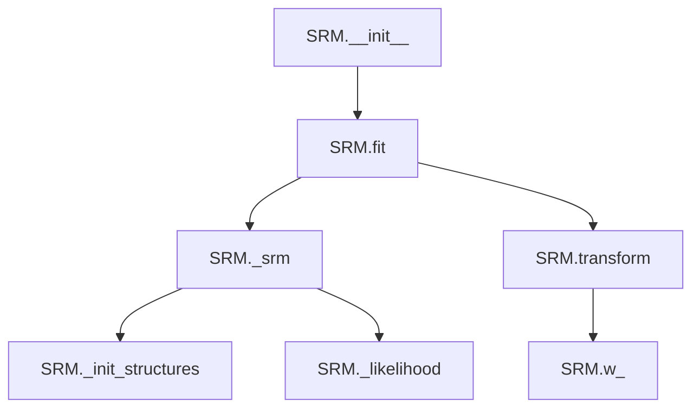
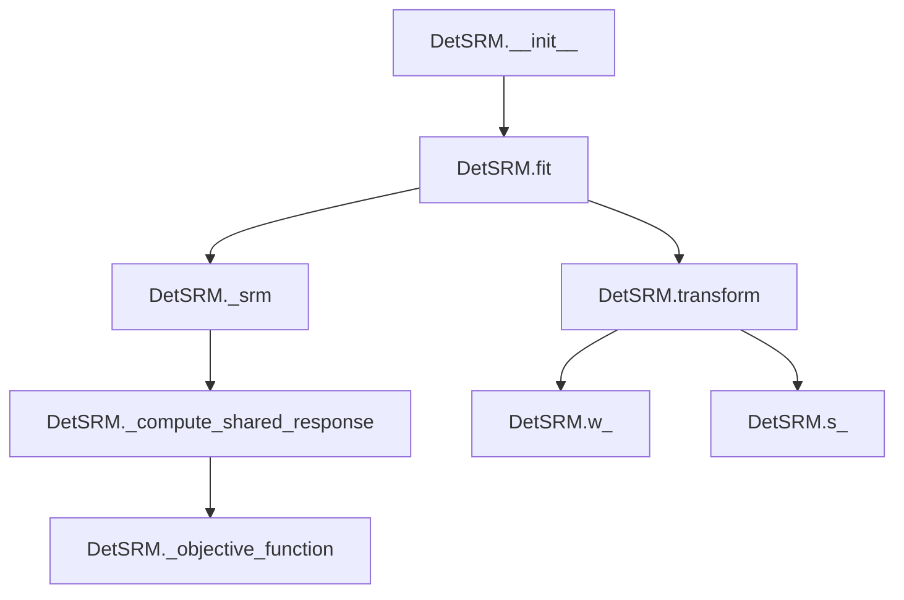

# `srm.py`

## `hypertools._externals.srm._init_w_transforms` · *function*

## Summary:
Initializes weight transformation matrices for subjects using QR decomposition of random matrices.

## Description:
This function prepares initialization weights for a Shared Response Model (SRM) by generating random matrices for each subject and applying QR decomposition to create orthogonal weight matrices. The function extracts this initialization logic to separate concerns and ensure consistent weight matrix generation across different stages of the SRM algorithm.

## Args:
    data (array-like): Collection of subject data arrays, where each array represents neuroimaging data for a subject. Each subject's data should be a 2D array where rows represent voxels and columns represent features.
    features (int): Number of features to initialize for the weight matrices. Must be a positive integer.

## Returns:
    tuple: A tuple containing:
        - w (list): List of orthogonal weight matrices (each of shape (voxels, features)) for each subject.
        - voxels (numpy.ndarray): Array containing the number of voxels for each subject.

## Raises:
    None explicitly raised in the function body.

## Constraints:
    - Precondition: data must be iterable with subject data arrays
    - Precondition: features must be a positive integer
    - Postcondition: w contains orthogonal matrices for each subject
    - Postcondition: voxels array matches the length of data

## Side Effects:
    - Generates random numbers using numpy.random.random()
    - Creates numpy arrays internally

## Control Flow:
```mermaid
flowchart TD
    A[Start _init_w_transforms] --> B{data is iterable?}
    B -->|Yes| C[Initialize w=[], subjects=len(data)]
    C --> D[Initialize voxels=numpy.empty(subjects, dtype=int)]
    D --> E[For each subject in range(subjects)]
    E --> F[voxels[subject] = data[subject].shape[0]]
    F --> G[rnd_matrix = numpy.random.random((voxels[subject], features))]
    G --> H[numpy.linalg.qr(rnd_matrix) -> q, r]
    H --> I[w.append(q)]
    I --> J[Return w, voxels]
    B -->|No| K[Exception or undefined behavior]
```

## Examples:
    # Initialize weight transforms for 3 subjects with 100 features
    data = [subject1_data, subject2_data, subject3_data]
    w, voxels = _init_w_transforms(data, 100)
    # w contains 3 orthogonal weight matrices
    # voxels contains [num_voxels_subject1, num_voxels_subject2, num_voxels_subject3]
```

## `hypertools._externals.srm.SRM` · *class*

## Summary:
Probabilistic Shared Response Model (SRM) for aligning multi-subject neuroimaging data by finding a common shared response space.

## Description:
The SRM class implements a probabilistic shared response model that aligns neuroimaging data from multiple subjects into a common shared response space. It is designed to find a set of shared components that capture common neural activity patterns across subjects while accounting for individual differences. This class follows scikit-learn's transformer interface, making it compatible with standard machine learning workflows.

The model is particularly useful in neuroimaging analysis where researchers want to identify common brain activation patterns across multiple participants. It operates by iteratively estimating shared responses and subject-specific weight matrices that project individual data into the shared space.

## State:
- n_iter: int, default=10
  - Number of iterations for the Expectation-Maximization algorithm
  - Valid range: positive integers
  - Invariant: must be >= 1 for meaningful execution

- features: int, default=50
  - Number of shared features/components to extract
  - Valid range: positive integers
  - Invariant: must be <= number of samples per subject for training

- rand_seed: int, default=0
  - Random seed for reproducible results
  - Valid range: any integer
  - Invariant: affects initialization randomness

- sigma_s_: numpy.ndarray
  - Shared covariance matrix estimated during fitting
  - Type: 2D array of shape (features, features)

- w_: list of numpy.ndarray
  - Subject-specific weight matrices estimated during fitting
  - Each element is a 2D array of shape (voxels, features) for corresponding subject

- mu_: list of numpy.ndarray
  - Subject-specific mean vectors estimated during fitting
  - Each element is a 1D array of shape (voxels,) for corresponding subject

- rho2_: numpy.ndarray
  - Subject-specific noise variances estimated during fitting
  - Type: 1D array of shape (subjects,)

- s_: numpy.ndarray
  - Shared response matrix estimated during fitting
  - Type: 2D array of shape (features, samples)

## Lifecycle:
1. Creation: Instantiate with hyperparameters (n_iter, features, rand_seed)
2. Usage: Call fit() with list of subject data arrays, then transform() with new data
3. Destruction: No explicit cleanup required; uses standard Python garbage collection

## Method Map:


## Raises:
- ValueError: Raised in fit() when:
  - There are fewer than 2 subjects in the input data
  - Number of samples per subject is less than requested features
  - Subjects have inconsistent number of samples
- NotFittedError: Raised in transform() when fit() has not been called yet
- ValueError: Raised in transform() when number of subjects doesn't match fitted model

## Example:
```python
# Create SRM instance with custom parameters
srm = SRM(n_iter=20, features=100, rand_seed=42)

# Fit on multi-subject neuroimaging data
# data is a list of 2D arrays, each representing one subject's data
# Shape: [subject1_data, subject2_data, ...] where each has shape (voxels, samples)
srm.fit(data)

# Transform new data into shared response space
shared_responses = srm.transform(new_data)

# Access learned parameters
shared_covariance = srm.sigma_s_
weight_matrices = srm.w_
```

### `hypertools._externals.srm.SRM.__init__` · *method*

## Summary:
Initializes the Probabilistic Shared Response Model with configurable hyperparameters for iterative alignment of neuroimaging data.

## Description:
Configures the SRM instance with iteration count, feature dimensionality, and random seed parameters. This constructor establishes the foundational configuration for the probabilistic shared response model that will align multi-subject neuroimaging data into a common shared response space.

The method serves as the entry point for creating SRM instances with customizable training parameters. It stores the hyperparameters that control the Expectation-Maximization algorithm's convergence behavior and the dimensionality of the shared response space.

## Args:
    n_iter (int, optional): Number of iterations for the EM algorithm. Defaults to 10.
    features (int, optional): Number of shared features/components to extract. Defaults to 50.
    rand_seed (int, optional): Random seed for reproducible initialization. Defaults to 0.

## Returns:
    None: This method initializes instance attributes and does not return a value.

## Raises:
    None: This method does not raise exceptions directly.

## State Changes:
    Attributes READ: No attributes are read from the instance.
    Attributes WRITTEN: 
    - self.n_iter: Stores the maximum number of EM iterations
    - self.features: Stores the desired number of shared features
    - self.rand_seed: Stores the random seed for reproducibility

## Constraints:
    Preconditions: 
    - n_iter must be a positive integer (>= 1) for meaningful execution
    - features must be a positive integer (>= 1) for valid model construction
    - rand_seed can be any integer value
    
    Postconditions:
    - All instance attributes are properly initialized with provided or default values
    - Instance is ready for subsequent fit() operations

## Side Effects:
    None: This method performs no I/O operations or external service calls.

### `hypertools._externals.srm.SRM.fit` · *method*

## Summary:
Trains the probabilistic Shared Response Model on multi-subject neuroimaging data by computing shared response patterns and subject-specific transformation matrices.

## Description:
 Fits the SRM model to multi-subject neuroimaging data by finding a common shared response space across subjects. This method validates input data integrity, performs iterative optimization to estimate subject-specific weight matrices and shared response patterns, and stores the resulting model parameters for subsequent transformation operations. The method is typically called during the model training phase before applying the fitted model to new data via the transform method.

## Args:
    X (list): List of subject data matrices, where each matrix represents neuroimaging data from a different subject. Each subject's data should be a 2D array with voxels as rows and features as columns.
    y (None): Optional target variable, ignored in this implementation.

## Returns:
    SRM: Returns self to enable method chaining for fluent API usage.

## Raises:
    ValueError: Raised when there are insufficient subjects (≤ 1) or when there are not enough samples to train the model with the specified number of features.
    ValueError: Raised when subjects have inconsistent numbers of samples.

## State Changes:
    Attributes READ: self.features, self.n_iter, self.rand_seed
    Attributes WRITTEN: self.sigma_s_, self.w_, self.mu_, self.rho2_, self.s_

## Constraints:
    Preconditions:
        - X must be a list of at least 2 subject data matrices
        - Each subject's data matrix must have at least self.features columns (samples)
        - All subject data matrices must have the same number of columns (samples)
        - Input data matrices must contain finite numeric values
    Postconditions:
        - Model parameters (sigma_s_, w_, mu_, rho2_, s_) are computed and stored
        - The fitted model is ready for transformation of new data via transform method
        - Random seed is set for reproducible results

## Side Effects:
    - Sets random seed using numpy.random.seed() for reproducible results
    - Logs progress information during model fitting using logger
    - Performs multiple matrix operations including SVD, Cholesky decomposition, and linear algebra operations

### `hypertools._externals.srm.SRM.transform` · *method*

## Summary:
Transforms input data using fitted shared response model weights to compute shared representations across subjects.

## Description:
Applies the previously fitted weight matrices to new input data to compute shared responses for each subject. This method is typically called after fitting the SRM model with the fit() method. The transformation projects each subject's data into the shared response space using the learned weight matrices.

## Args:
    X (list): List of subject data arrays, where each array represents neuroimaging data for a subject. Each subject's data should be a 2D array where rows represent voxels and columns represent features.
    y (None): Placeholder parameter for scikit-learn compatibility, not used in this implementation.

## Returns:
    list: List of transformed shared response arrays, one for each subject. Each array has shape (features, number_of_features_in_subject_data).

## Raises:
    sklearn.utils.validation.NotFittedError: When the model has not been fitted yet (i.e., w_ attribute does not exist).
    ValueError: When the number of subjects in input data X does not match the number of subjects in the fitted model.

## State Changes:
    Attributes READ: self.w_
    Attributes WRITTEN: None

## Constraints:
    Preconditions:
        - Model must be fitted (w_ attribute must exist)
        - Number of subjects in X must match number of subjects in fitted model
        - Each subject's data in X must be compatible with corresponding weight matrix dimensions
    Postconditions:
        - Returns list of transformed arrays with shared response representations
        - Each transformed array has shape (features, number_of_features_in_subject_data)

## Side Effects:
    None

### `hypertools._externals.srm.SRM._init_structures` · *method*

## Summary:
Initializes data structures for Shared Response Model computation by centering data and computing statistical moments for each subject.

## Description:
This method prepares the initial data structures required for the Shared Response Model (SRM) algorithm. It processes input data from multiple subjects by computing means, centering the data, and calculating trace statistics needed for subsequent SRM iterations. The method is called during the initialization phase of the SRM fitting process to set up the necessary computational structures.

## Args:
    data (list[np.ndarray]): List of subject data matrices, where each matrix has shape (voxels, samples)
    subjects (int): Number of subjects in the dataset

## Returns:
    tuple: Four-element tuple containing:
        - x (list[np.ndarray]): Centered data matrices for each subject
        - mu (list[np.ndarray]): Mean vectors for each subject
        - rho2 (np.ndarray): Regularization parameters for each subject (initialized to 1)
        - trace_xtx (np.ndarray): Trace of squared centered data matrices for each subject

## Raises:
    None explicitly raised

## State Changes:
    - Attributes READ: None
    - Attributes WRITTEN: None

## Constraints:
    - Preconditions: 
        * data must be a list of numpy arrays with consistent number of samples across subjects
        * subjects must be a positive integer representing the number of elements in data
    - Postconditions:
        * All returned arrays are properly initialized with correct shapes
        * x contains centered data matrices (data minus subject means)
        * mu contains mean vectors for each subject
        * rho2 is initialized to ones with length equal to subjects
        * trace_xtx contains trace values for each subject's centered data

## Side Effects:
    None

### `hypertools._externals.srm.SRM._likelihood` · *method*

## Summary:
Computes the log-likelihood value for the Shared Response Model optimization process.

## Description:
This private method calculates the log-likelihood of the probabilistic Shared Response Model given the current parameter estimates. It is used internally during the model training process to monitor convergence by evaluating the objective function at each iteration. The method implements the mathematical formulation of the negative log-likelihood for the SRM model.

## Args:
    chol_sigma_s_rhos (numpy.ndarray): Cholesky decomposition of the precision matrix (sigma_s + rho0 * I)
    log_det_psi (float): Log determinant of the noise covariance matrix
    chol_sigma_s (numpy.ndarray): Cholesky decomposition of the shared response covariance matrix
    trace_xt_invsigma2_x (float): Trace term involving data matrices and inverse covariance
    inv_sigma_s_rhos (numpy.ndarray): Inverse of the precision matrix (sigma_s + rho0 * I)
    wt_invpsi_x (numpy.ndarray): Weighted sum of transformed data matrices
    samples (int): Number of samples in the dataset

## Returns:
    float: Computed log-likelihood value representing the model's fit quality

## Raises:
    None explicitly raised - depends on underlying numpy/scipy operations

## State Changes:
    Attributes READ: None
    Attributes WRITTEN: None

## Constraints:
    Preconditions:
    - All input arrays must be properly shaped and computed from previous optimization steps
    - chol_sigma_s_rhos must be a valid Cholesky decomposition
    - chol_sigma_s must be a valid Cholesky decomposition
    - samples must be a positive integer
    - All input matrices must contain finite numerical values
    
    Postconditions:
    - Returns a finite floating-point number representing the log-likelihood
    - The returned value is typically negative for valid probability distributions

## Side Effects:
    None - This method is purely computational and does not modify any object state or perform I/O operations

### `hypertools._externals.srm.SRM._srm` · *method*

## Summary:
Implements the core iterative optimization algorithm for Shared Response Model (SRM) to compute shared neural responses across multiple subjects.

## Description:
This private method executes the main SRM algorithm that finds a common shared response space across multiple subjects' neuroimaging data. It performs alternating optimization between estimating subject-specific weight matrices and the global shared response. The method initializes parameters and iteratively refines them until convergence or maximum iterations are reached.

The method is called during the fitting process of the SRM estimator and serves as the computational backbone for learning the shared response model. It encapsulates the complex mathematical operations required for joint dimensionality reduction across subjects.

## Args:
    data (list): List of subject data arrays, where each array represents neuroimaging data for a subject. Each subject's data should be a 2D array where rows represent voxels and columns represent features.

## Returns:
    tuple: A tuple containing:
        - sigma_s (numpy.ndarray): Estimated covariance matrix of the shared response (shape: (features, features))
        - w (list): List of optimized weight matrices for each subject (each of shape (voxels, features))
        - mu (numpy.ndarray): Estimated mean of the shared response (shape: (features,))
        - rho2 (numpy.ndarray): Estimated noise variance for each subject (shape: (subjects,))
        - shared_response (numpy.ndarray): Computed shared response matrix (shape: (features, samples))

## Raises:
    None explicitly raised in the method body.

## State Changes:
    - Attributes READ: self.rand_seed, self.features, self.n_iter, logger
    - Attributes WRITTEN: None (modifies local variables only)

## Constraints:
    - Precondition: data must be a list of 2D arrays with compatible dimensions
    - Precondition: self.features must be a positive integer
    - Precondition: self.n_iter must be a non-negative integer
    - Postcondition: All returned matrices have appropriate shapes for SRM computation
    - Postcondition: The optimization converges after n_iter iterations

## Side Effects:
    - Sets random seed using numpy.random.seed() 
    - Performs multiple matrix operations including SVD, Cholesky decomposition, and linear algebra operations
    - Logs iteration progress and objective function values when logging is enabled
    - Uses scipy.linalg functions for numerical stability in matrix computations

## `hypertools._externals.srm.DetSRM` · *class*

## Summary:
Deterministic Shared Response Model (SRM) transformer that aligns neuroimaging data across multiple subjects by finding a shared representation space.

## Description:
The DetSRM class implements a deterministic version of the Shared Response Model, which is a dimensionality reduction technique for fMRI data alignment. It finds a common shared response space across multiple subjects by iteratively optimizing weight matrices that project each subject's data into this shared space. This class follows scikit-learn's BaseEstimator and TransformerMixin interfaces, making it compatible with scikit-learn pipelines and workflows.

The class is designed to work with multi-subject neuroimaging data where each subject's data is represented as a 2D matrix with voxels as rows and timepoints/features as columns. It's particularly useful for comparing brain activity patterns across subjects in neuroimaging studies.

## State:
- n_iter: int, default=10
  - Number of iterations for the alternating optimization algorithm
  - Valid range: positive integers
  - Invariant: Must be a positive integer >= 1

- features: int, default=50
  - Number of features (dimensions) in the shared response space
  - Valid range: positive integers
  - Invariant: Must be a positive integer <= minimum number of samples across subjects

- rand_seed: int, default=0
  - Random seed for reproducible initialization of weight matrices
  - Valid range: any integer
  - Invariant: Used to initialize numpy random seed for consistent results

- w_: list of numpy.ndarray, optional
  - Weight matrices for each subject (set after calling fit)
  - Shape: Each element is (voxels, features) where voxels is the number of voxels for that subject
  - Constant after fitting: Set once during fitting, remains unchanged during transform operations

- s_: numpy.ndarray, optional
  - Shared response matrix (set after calling fit)
  - Shape: (features, timepoints)
  - Constant after fitting: Set once during fitting, remains unchanged during transform operations

## Lifecycle:
- Creation: Instantiate with parameters n_iter, features, and rand_seed
- Usage: Call fit() with list of subject data arrays, then transform() with same or new subject data
- Destruction: No explicit cleanup required; relies on Python garbage collection

## Method Map:


## Raises:
- ValueError: Raised in fit() when:
  - There are fewer than 2 subjects in the input data
  - There are insufficient samples (timepoints) to support the requested number of features
  - Subjects have inconsistent number of timepoints
- NotFittedError: Raised in transform() when fit() has not been called yet
- ValueError: Raised in transform() when the number of subjects doesn't match the fitted model

## Example:
```python
# Create DetSRM instance
srm = DetSRM(n_iter=20, features=100, rand_seed=42)

# Fit on multi-subject data (list of 2D arrays)
subject_data = [subject1_data, subject2_data, subject3_data]  # Each is (voxels, timepoints)
srm.fit(subject_data)

# Transform new data using the learned shared space
transformed_data = srm.transform(subject_data)
```

### `hypertools._externals.srm.DetSRM.__init__` · *method*

## Summary:
Initializes a Deterministic Shared Response Model (SRM) transformer with configurable algorithm parameters.

## Description:
Configures the SRM transformer with settings that control the iterative optimization process for finding shared neural response patterns across multiple subjects. This constructor sets up the fundamental hyperparameters that govern the convergence behavior, dimensionality, and reproducibility of the shared response model.

## Args:
    n_iter (int, optional): Number of iterations for the alternating optimization algorithm. Defaults to 10. Must be a positive integer.
    features (int, optional): Number of features (dimensions) in the shared response space. Defaults to 50. Must be a positive integer.
    rand_seed (int, optional): Random seed for reproducible initialization of weight matrices. Defaults to 0. Any integer value is acceptable.

## Returns:
    None: This method initializes instance attributes and does not return a value.

## Raises:
    None: This method does not raise exceptions directly.

## State Changes:
    Attributes READ: None
    Attributes WRITTEN: 
    - self.n_iter: Stores the maximum number of optimization iterations
    - self.features: Stores the desired dimensionality of the shared response space
    - self.rand_seed: Stores the random seed for reproducible results

## Constraints:
    Preconditions:
        - n_iter must be a positive integer (>= 1)
        - features must be a positive integer (>= 1)
        - rand_seed can be any integer value
    Postconditions:
        - All three parameters are stored as instance attributes
        - Parameters remain unchanged until explicitly modified by user code

## Side Effects:
    None: This method performs no I/O operations or external service calls.

### `hypertools._externals.srm.DetSRM.fit` · *method*

*No documentation generated.*

### `hypertools._externals.srm.DetSRM.transform` · *method*

## Summary:
Transforms input data using previously learned shared response model weights.

## Description:
Applies the previously fitted Shared Response Model (SRM) transformation to new data. This method projects input data from each subject onto the shared response space using the learned weight matrices. The transformation is applied independently to each subject's data using their corresponding weight matrix.

## Args:
    X (list): List of subject data arrays, where each array represents neuroimaging data for a subject. Each subject's data should be a 2D array where rows represent voxels and columns represent features.
    y (None): Placeholder parameter for sklearn compatibility, not used in this implementation.

## Returns:
    list: List of transformed data arrays, one for each subject. Each transformed array has the same number of rows as the corresponding input subject's data and the same number of columns as the number of features in the fitted model.

## Raises:
    sklearn.utils.validation.NotFittedError: If the model has not been fitted yet (i.e., w_ attribute is missing).
    ValueError: If the number of subjects in X does not match the number of subjects in the fitted model.

## State Changes:
    Attributes READ: self.w_
    Attributes WRITTEN: None

## Constraints:
    Preconditions:
        - The model must have been fitted using the fit() method before calling transform()
        - X must be a list with the same number of subjects as were used during fitting
        - Each subject's data in X must be a 2D numpy array
    Postconditions:
        - Returns a list of transformed arrays with dimensions compatible with the shared response space
        - The transformation preserves the number of features in the shared response space

## Side Effects:
    None

### `hypertools._externals.srm.DetSRM._objective_function` · *method*

## Summary:
Computes the objective function value for the Shared Response Model optimization.

## Description:
This private method calculates the objective function used in the Deterministic SRM algorithm. It measures the reconstruction error between original multi-subject data and the reconstructed data using subject-specific weight matrices and a shared signal matrix. The method is called during the SRM training process to monitor convergence and evaluate model performance.

## Args:
    data (list of ndarray): List of subject data matrices, where each matrix has shape (voxels, time_points)
    w (list of ndarray): List of subject-specific weight matrices, where each matrix has shape (voxels, features)
    s (ndarray): Shared signal matrix with shape (features, time_points)

## Returns:
    float: Normalized objective function value representing the reconstruction error across all subjects

## Raises:
    None explicitly raised

## State Changes:
    Attributes READ: None
    Attributes WRITTEN: None

## Constraints:
    Preconditions:
    - data must be a list of numpy arrays with consistent time dimensions
    - w must be a list of matrices with compatible dimensions to data
    - s must have appropriate dimensions for matrix multiplication with w elements
    - All input matrices must contain finite numerical values
    
    Postconditions:
    - Returns a scalar value representing the total reconstruction error
    - The returned value is normalized by the number of time points

## Side Effects:
    None

### `hypertools._externals.srm.DetSRM._compute_shared_response` · *method*

## Summary:
Computes the shared response across multiple subjects by aggregating weighted dot products of transformation matrices with data matrices.

## Description:
This method implements a core mathematical operation in the Shared Response Model (SRM) algorithm. It aggregates the contribution of each subject's transformation matrix applied to their respective data matrix to compute a shared response representation. The method is called during both initialization and iterative optimization phases of the SRM training process to update the shared response estimate.

The computation follows the formula: s = (1/M) * Σ(w_m^T * data_m) for m = 1 to M, where M is the number of subjects.

## Args:
    data (list of array-like): List of data matrices, one per subject, where each matrix has shape (voxels, time_points)
    w (list of array-like): List of transformation matrices, one per subject, where each matrix has shape (voxels, features)

## Returns:
    numpy.ndarray: Shared response matrix with shape (features, time_points), representing the common response across all subjects

## Raises:
    None explicitly raised, but may raise exceptions from underlying numpy operations if inputs are invalid

## State Changes:
    Attributes READ: None
    Attributes WRITTEN: None

## Constraints:
    Preconditions:
    - Both `data` and `w` must be lists of equal length (number of subjects)
    - Each element in `w` must have compatible dimensions with corresponding elements in `data`
    - Each matrix in `data` must have the same number of time points
    - Each matrix in `w` must have the same number of features
    
    Postconditions:
    - Returns a matrix with dimensions (features, time_points) where features matches the second dimension of w[0] and time_points matches the second dimension of data[0]

## Side Effects:
    None

### `hypertools._externals.srm.DetSRM._srm` · *method*

## Summary:
Computes shared response model transformations for multi-subject neuroimaging data through iterative optimization.

## Description:
Implements the core SRM algorithm that finds shared response patterns across multiple subjects by iteratively optimizing subject-specific transformation matrices and a shared response space. This method serves as the main computational engine for the DetSRM class, performing alternating optimization between subject transforms and shared response representation.

## Args:
    data (list): List of subject data matrices, where each matrix represents neuroimaging data from a different subject.

## Returns:
    tuple: A tuple containing (w, shared_response) where:
        - w (list): Subject-specific transformation matrices computed during optimization
        - shared_response (array-like): The shared response space representing common neural patterns across subjects

## Raises:
    None explicitly raised in this method.

## State Changes:
    Attributes READ: self.rand_seed, self.features, self.n_iter
    Attributes WRITTEN: None (modifies only local variables and returns results)

## Constraints:
    Preconditions:
        - Input data must be a list of numeric arrays with compatible dimensions
        - Each subject's data should have the same number of features
        - self.features must be properly initialized
        - self.n_iter must be a positive integer
    Postconditions:
        - Returns optimized subject transformation matrices and shared response space
        - Transformation matrices are orthogonal (due to SVD-based updates)
        - Shared response space captures common neural patterns across subjects

## Side Effects:
    - Sets random seed using self.rand_seed for reproducible results
    - Logs iteration progress and objective function values when INFO level logging is enabled
    - Uses NumPy linear algebra operations for SVD computations

