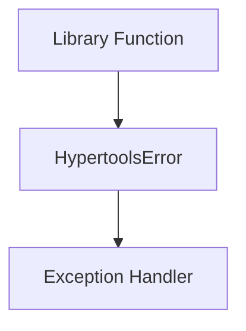
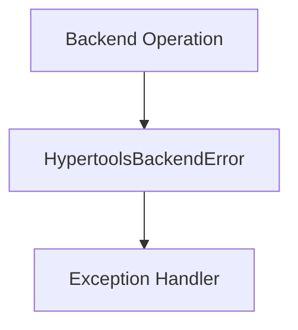
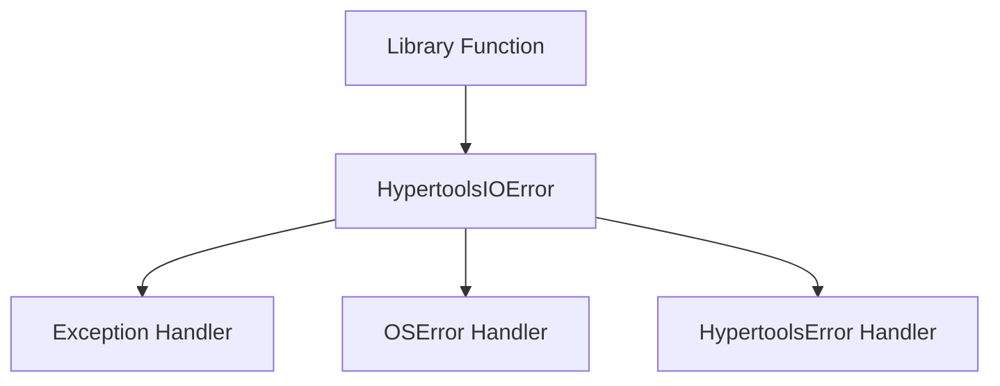

# `exceptions.py`

## `hypertools._shared.exceptions.HypertoolsError` · *class*

## Summary:
Base exception class for the hypertools library that provides a common error type for library-specific exceptions.

## Description:
HypertoolsError serves as the root exception class for all custom exceptions within the hypertools library. It provides a distinct exception type that allows users and code to differentiate between library-specific errors and standard Python exceptions. This enables more precise error handling and debugging within the hypertools ecosystem.

The class is designed to be inherited by more specific exception types within the library, providing a consistent hierarchy of exceptions that can be caught and handled appropriately by client code.

## State:
- No instance attributes: This is a base exception class with no additional state beyond what is inherited from Exception
- No __init__ parameters: Inherits the standard Exception constructor behavior
- Invariants: None specific to this class, as it's a simple base class

## Lifecycle:
- Creation: Instantiated like any standard Python exception using `raise HypertoolsError("message")` or `raise HypertoolsError()` 
- Usage: Typically raised within library functions when encountering conditions that warrant a custom exception
- Destruction: Handled automatically by Python's exception mechanism when the exception propagates out of scope

## Method Map:


## Raises:
- None directly raised by the class itself, as it's a base exception class
- Exceptions of this type are raised by library functions when specific error conditions occur

## Example:
```python
# Raising the exception
raise HypertoolsError("A general hypertools error occurred")

# Catching the exception
try:
    # Some hypertools operation
    process_data()
except HypertoolsError as e:
    print(f"Hypertools error: {e}")
```

## `hypertools._shared.exceptions.HypertoolsBackendError` · *class*

## Summary:
Custom exception class for backend-related errors in the hypertools library.

## Description:
HypertoolsBackendError is a specialized exception type designed to represent errors that occur within the backend systems of the hypertools library. This exception inherits from HypertoolsError and provides a distinct error type that allows client code to specifically catch and handle backend-related failures.

This exception is typically raised when operations fail due to issues in underlying backend services, data processing pipelines, or system integrations within the hypertools framework. By using this specific exception type, developers can implement targeted error handling for backend failures while maintaining a clear distinction from other types of hypertools errors.

## State:
- message (str): The error message describing the backend failure. This is stored as an instance attribute and matches the parameter passed to __init__.
- The class maintains no other instance attributes beyond what is inherited from Exception.

## Lifecycle:
- Creation: Instantiated by calling `HypertoolsBackendError(message)` where message is a descriptive string explaining the backend error.
- Usage: Raised within library functions when backend operations fail, typically caught by exception handlers in calling code.
- Destruction: Automatically managed by Python's exception handling mechanism when the exception propagates out of scope.

## Method Map:


## Raises:
- None directly raised by the class constructor
- Exceptions of this type are raised by library functions when backend failures occur

## Example:
```python
# Raising the exception
raise HypertoolsBackendError("Failed to connect to database backend")

# Catching the exception
try:
    # Some backend operation
    process_with_backend()
except HypertoolsBackendError as e:
    print(f"Backend error occurred: {e}")
    # Handle backend-specific error
```

### `hypertools._shared.exceptions.HypertoolsBackendError.__init__` · *method*

## Summary:
Initializes a HypertoolsBackendError instance with a descriptive error message.

## Description:
Constructs a new HypertoolsBackendError exception object, setting up the error message that describes the backend failure. This method properly initializes the parent Exception class and stores the provided message as an instance attribute for later retrieval.

## Args:
    message (str): A descriptive error message explaining the backend failure that occurred.

## Returns:
    None: This method does not return a value.

## Raises:
    None: This method does not raise any exceptions.

## State Changes:
    Attributes READ: None
    Attributes WRITTEN: 
        - self.message: Stores the provided error message as an instance attribute

## Constraints:
    Preconditions: 
        - The message parameter must be a string
    Postconditions: 
        - The exception instance is properly initialized with the provided message
        - The message is accessible via the self.message attribute

## Side Effects:
    None: This method performs no I/O operations or external service calls.

## `hypertools._shared.exceptions.HypertoolsIOError` · *class*

## Summary:
Custom exception class for I/O related errors within the hypertools library, inheriting from both HypertoolsError and OSError.

## Description:
HypertoolsIOError is a specialized exception type designed to represent input/output related errors that occur within the hypertools library. This exception inherits from both HypertoolsError (the library's base exception class) and OSError (Python's standard I/O exception), allowing it to be caught by handlers for either the library-specific base exception or Python's standard I/O exception.

This exception is raised when I/O operations fail within hypertools functions, providing a clear indication that the error originated from an I/O operation while maintaining compatibility with standard Python exception handling patterns. As a subclass of HypertoolsError, it fits into the library's exception hierarchy and can be caught by handlers expecting library-specific exceptions.

## State:
- message (str): The error message describing the I/O failure. Valid values are any string describing the I/O error condition. This attribute is set during initialization and maintains the same value as the constructor parameter.

## Lifecycle:
- Creation: Instantiate using `HypertoolsIOError(message)` where message is a descriptive string explaining the I/O error
- Usage: Raised by hypertools functions when I/O operations fail, can be caught by handlers expecting either HypertoolsError or OSError
- Destruction: Automatically managed by Python's exception handling mechanism

## Method Map:


## Raises:
- None directly raised by the class constructor
- The exception is raised by library functions when I/O operations fail

## Example:
```python
# Raising the exception
raise HypertoolsIOError("Failed to read configuration file: config.json")

# Catching the exception
try:
    load_data_from_file("data.csv")
except HypertoolsIOError as e:
    print(f"I/O error in hypertools: {e}")

# Can also be caught as OSError
try:
    load_data_from_file("data.csv")
except OSError as e:
    print(f"OS error: {e}")

# Can also be caught as HypertoolsError due to inheritance
try:
    load_data_from_file("data.csv")
except HypertoolsError as e:
    print(f"Hypertools error: {e}")
```

### `hypertools._shared.exceptions.HypertoolsIOError.__init__` · *method*

## Summary:
Initializes a HypertoolsIOError instance with a descriptive error message.

## Description:
Constructs a new HypertoolsIOError instance by calling the parent class constructor and storing the provided error message as an instance attribute. This method serves as the primary entry point for creating instances of this custom exception class.

## Args:
    message (str): A descriptive error message explaining the I/O operation failure. Must be a valid string describing the specific I/O error condition.

## Returns:
    None: This method initializes the object state but does not return a value.

## Raises:
    None: This method does not raise any exceptions itself.

## State Changes:
    Attributes READ: None
    Attributes WRITTEN: 
        - self.message: Stores the provided error message string

## Constraints:
    Preconditions: 
        - The message parameter must be a string
        - The message should provide meaningful context about the I/O error
    Postconditions: 
        - The instance is properly initialized with the provided message
        - The instance inherits all behaviors from its parent classes (HypertoolsError and OSError)

## Side Effects:
    None: This method performs no I/O operations or external service calls. It only initializes object state.

