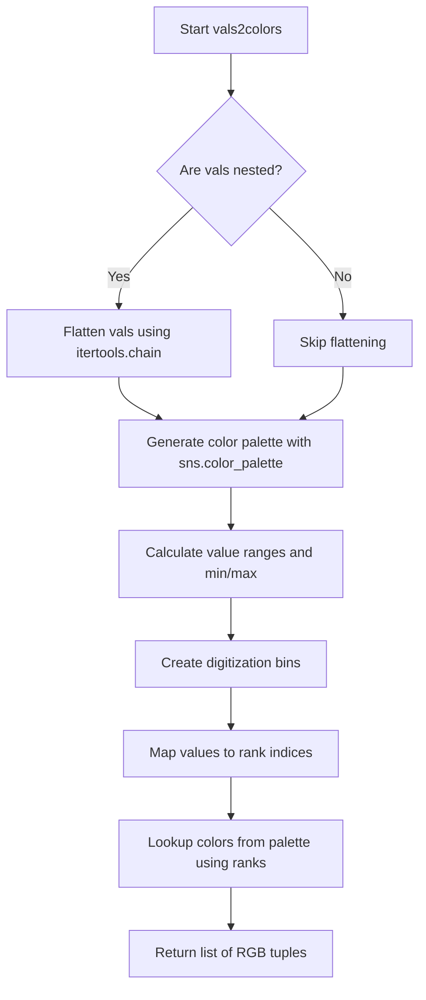
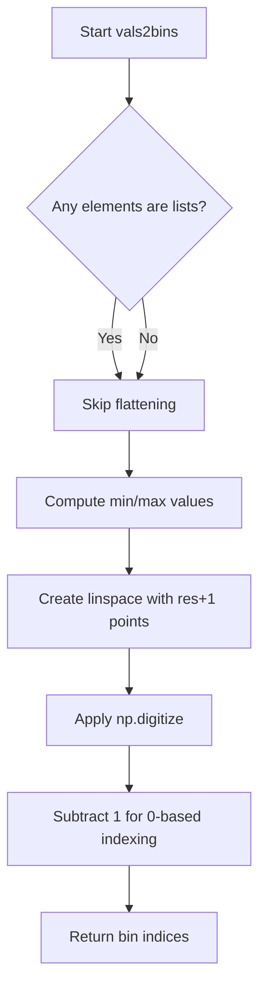
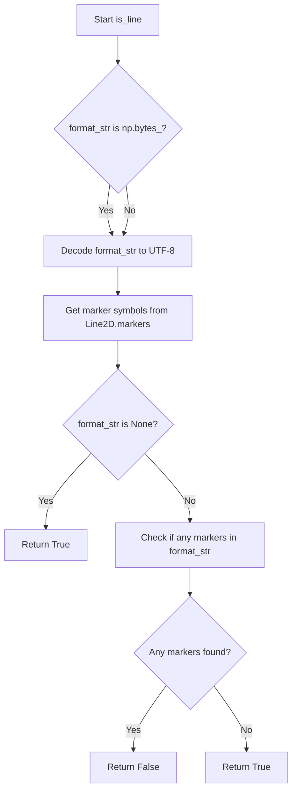
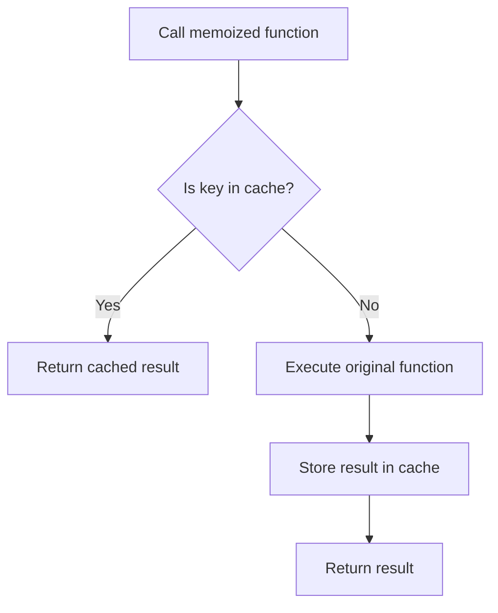

# `helpers.py`

## `hypertools._shared.helpers.center` · *function*

## Summary:
Centers a list of arrays by subtracting the overall mean from each array.

## Description:
This function takes a list of arrays and performs mean-centering across all arrays. It stacks the input arrays vertically, computes the mean of all elements across all arrays, and then subtracts this global mean from each individual array. This is commonly used in data preprocessing to remove overall bias or shift data to have zero mean.

## Args:
    x (list): A list of arrays/sequences that will be centered. All arrays must have the same number of columns.

## Returns:
    list: A list of arrays with the same shape as the input arrays, where each array has been centered by subtracting the global mean.

## Raises:
    AssertionError: If the input x is not a list.

## Constraints:
    Preconditions:
        - Input x must be a list
        - All arrays in the list must have the same number of columns
    Postconditions:
        - Output list contains arrays of the same shape as input arrays
        - Each output array has been mean-centered

## Side Effects:
    None

## Control Flow:
```mermaid
flowchart TD
    A[Start center(x)] --> B{Is x a list?}
    B -- No --> C[Assertion Error]
    B -- Yes --> D[Stack arrays with np.vstack]
    D --> E[Compute mean across all arrays]
    E --> F[Subtract mean from each array]
    F --> G[Return centered arrays]
```

## Examples:
```python
# Basic usage with 3x3 arrays
data = [[1, 2, 3], [4, 5, 6], [7, 8, 9]]
centered = center(data)
# Result: [[-3, -3, -3], [0, 0, 0], [3, 3, 3]]
# The global mean is [4, 5, 6], so each array is shifted by this amount

# With 2x2 arrays
data = [[10, 20], [30, 40]]
centered = center(data)
# Result: [[-10, -10], [10, 10]]
# The global mean is [20, 30], so each array is shifted accordingly
```

## `hypertools._shared.helpers.scale` · *function*

## Summary:
Scales input data to a standardized range of [-1, 1] using min-max normalization.

## Description:
This function performs min-max normalization on a list of arrays or lists, transforming the data so that all values fall within the range [-1, 1]. The transformation maps the global minimum value to -1 and global maximum value to 1, with all other values scaled proportionally. This is useful for data preprocessing in machine learning and visualization applications.

## Args:
    x (list): A list of arrays or lists containing numerical data to be scaled. All elements must be compatible with numpy operations and should be able to be vertically stacked using np.vstack.

## Returns:
    list: A list of scaled arrays or lists, where each array contains values in the range [-1, 1]. The output maintains the same structure as the input.

## Raises:
    AssertionError: If the input x is not of type list.
    ZeroDivisionError: If all values in the input data are identical, causing division by zero during scaling.

## Constraints:
    Preconditions:
        - Input x must be a list
        - All elements in x must be compatible with numpy operations (arrays, lists, or scalars)
        - Elements in x should be numeric data
        - All elements must be stackable by numpy's vstack function
    
    Postconditions:
        - Output list contains the same number of elements as input list
        - All values in output are within the range [-1, 1]
        - Relative relationships between values are preserved
        - The global minimum value in input maps to -1, global maximum to 1

## Side Effects:
    None

## Control Flow:
```mermaid
flowchart TD
    A[Start scale(x)] --> B{Input type is list?}
    B -- No --> C[Assertion Error]
    B -- Yes --> D[Stack input with np.vstack]
    D --> E[Calculate m1 = min(stacked_data)]
    E --> F[Calculate m2 = max(stacked_data - m1)]
    F --> G{Is m2 == 0?}
    G -- Yes --> H[ZeroDivisionError]
    G -- No --> I[Define scaling function f(x) = 2*(x-m1)/m2 - 1]
    I --> J[Apply f to each element in x]
    J --> K[Return scaled list]
```

## Examples:
    # Basic usage with lists
    data = [[1, 2, 3], [4, 5, 6]]
    scaled_data = scale(data)
    # Result: [array([-1., -0.5, 0.]), array([0.5, 1., 1.])]
    
    # Usage with arrays
    import numpy as np
    data = [np.array([10, 20, 30]), np.array([40, 50, 60])]
    scaled_data = scale(data)
    # Result: scaled arrays with values in [-1, 1]
    
    # Edge case: all identical values (will raise ZeroDivisionError)
    # data = [[5, 5, 5], [5, 5, 5]]
    # scale(data)  # Raises ZeroDivisionError

## `hypertools._shared.helpers.group_by_category` · *function*

## Summary:
Converts categorical values into numerical indices based on sorted unique values.

## Description:
Transforms a list of categorical values into a corresponding list of numerical indices. Each unique value is assigned an index based on its position in the sorted set of unique values. This function handles nested lists by flattening them before processing.

## Args:
    vals (list): A list of categorical values that may include nested lists. Values can be of any hashable type.

## Returns:
    list[int]: A list of integers representing the category indices for each input value. Each integer corresponds to the position of the value in the sorted set of unique values.

## Raises:
    None explicitly raised, but may raise exceptions from underlying operations like `set()` or `sorted()` if input contains unhashable types.

## Constraints:
    Precondition: All elements in `vals` must be hashable (since they are passed to `set()`).
    Postcondition: The returned list has the same length as the input list, with each element being a valid index in the range [0, n) where n is the number of unique values.

## Side Effects:
    None

## Control Flow:
```mermaid
flowchart TD
    A[Start group_by_category] --> B{Any element is list?}
    B -- Yes --> C[Flatten nested lists]
    B -- No --> D[Skip flattening]
    C --> D
    D --> E[Get unique values with set()]
    E --> F[Sort unique values]
    F --> G[Map each value to its index in sorted list]
    G --> H[Return index list]
```

## Examples:
```python
# Basic usage with string categories
>>> group_by_category(['a', 'b', 'c', 'a'])
[0, 1, 2, 0]

# With nested lists
>>> group_by_category([['a', 'b'], ['c', 'a']])
[0, 1, 2, 0]

# With mixed types
>>> group_by_category([1, 2, 3, 1])
[0, 1, 2, 0]

# With duplicates and sorting
>>> group_by_category(['z', 'a', 'z', 'b'])
[2, 0, 2, 1]
```

## `hypertools._shared.helpers.vals2colors` · *function*

## Summary:
Maps numerical values to RGB color tuples using a specified colormap and resolution.

## Description:
Converts a collection of numerical values into corresponding RGB color tuples by mapping each value to a position within a continuous color gradient. This function is useful for visualizing data where numerical values need to be represented as colors, such as in heatmaps, scatter plots, or data visualization applications.

The function handles both flat and nested list inputs by flattening nested structures before processing. It uses seaborn's color palette generation capabilities to create smooth color transitions across the value range.

## Args:
    vals (array-like): Numerical values to convert to colors. Can be a flat list or nested list structure.
    cmap (str, optional): Colormap name to use for color generation. Defaults to 'GnBu' (Green-Blue colormap).
    res (int, optional): Resolution of the color palette. Higher values create smoother color transitions. Defaults to 100.

## Returns:
    list[tuple[int, int, int]]: List of RGB color tuples corresponding to input values. Each tuple contains three integers (r, g, b) representing red, green, and blue components in the range [0, 255].

## Raises:
    None explicitly raised in the function body.

## Constraints:
    Preconditions:
    - Input vals must be convertible to numerical values
    - cmap must be a valid seaborn colormap name
    - res must be a positive integer
    
    Postconditions:
    - Output list length equals input value count
    - Each returned tuple contains exactly three integers in range [0, 255]

## Side Effects:
    None.

## Control Flow:


## Examples:
    # Basic usage with simple values
    >>> vals2colors([1, 2, 3, 4, 5])
    [(10, 100, 100), (20, 120, 120), (30, 140, 140), (40, 160, 160), (50, 180, 180)]
    
    # Usage with nested lists
    >>> vals2colors([[1, 2], [3, 4], [5]])
    [(10, 100, 100), (20, 120, 120), (30, 140, 140), (40, 160, 160), (50, 180, 180)]
    
    # Usage with custom colormap
    >>> vals2colors([0, 0.5, 1.0], cmap='viridis')
    [(68, 1, 84), (171, 217, 233), (253, 231, 37)]
```

## `hypertools._shared.helpers.vals2bins` · *function*

## Summary:
Converts a list of numerical values into discrete bin indices based on linearly spaced bin boundaries.

## Description:
This function takes a collection of numerical values and maps them into discrete bins. It handles both flat lists and nested lists by flattening them first. The bin boundaries are computed as linearly spaced intervals from the minimum to maximum value in the input, with the specified resolution determining the number of bins.

## Args:
    vals (list): A list of numerical values or nested lists containing numerical values to be binned.
    res (int): Number of bins to create. Defaults to 100.

## Returns:
    list[int]: A list of bin indices (0-based) corresponding to each input value. Values outside the range will be assigned to the nearest bin boundary.

## Raises:
    None explicitly raised, but may raise exceptions from underlying numpy operations if input is invalid.

## Constraints:
    Preconditions:
    - Input vals should contain numerical values that can be processed by numpy.min, numpy.max, and numpy.linspace
    - res should be a positive integer
    
    Postconditions:
    - Returned list has the same length as the flattened input vals
    - All returned indices are integers in the range [0, res-1]

## Side Effects:
    None

## Control Flow:


## Examples:
    >>> vals2bins([1, 2, 3, 4, 5], res=3)
    [0, 0, 1, 1, 2]
    
    >>> vals2bins([[1, 2], [3, 4]], res=2)
    [0, 0, 1, 1]
```

## `hypertools._shared.helpers.interp_array` · *function*

## Summary:
Performs piecewise cubic Hermite interpolation on an array to increase its resolution using PCHIP method.

## Description:
Interpolates the input array using PCHIP (Piecewise Cubic Hermite Interpolating Polynomial) to generate a higher-resolution version. This function is commonly used to smooth data or increase the number of data points for visualization purposes while preserving the shape and trends of the original data.

## Args:
    arr (array-like): Input array to be interpolated
    interp_val (int, optional): Interpolation factor determining the density of interpolated points. Defaults to 10.

## Returns:
    numpy.ndarray: Interpolated array with increased resolution. The length of the returned array is approximately (len(arr) - 1) * interp_val.

## Raises:
    None explicitly raised by this function.

## Constraints:
    Preconditions:
    - Input `arr` must be array-like and convertible to numpy array
    - `interp_val` must be a positive integer
    
    Postconditions:
    - Output array has increased resolution compared to input
    - Interpolation preserves the general shape and trends of the original data
    - Result maintains monotonicity properties of the original data

## Side Effects:
    None

## Control Flow:
```mermaid
flowchart TD
    A[Start interp_array] --> B[Convert arr to numpy array]
    B --> C[x = arange(0, len(arr), 1)]
    C --> D[xx = arange(0, len(arr)-1, 1/interp_val)]
    D --> E[q = pchip(x, arr)]
    E --> F[q(xx)]
    F --> G[Return interpolated array]
```

## Examples:
    >>> import numpy as np
    >>> data = [1, 2, 3, 4, 5]
    >>> result = interp_array(data, interp_val=5)
    >>> print(len(result))
    20
    >>> result = interp_array([0, 1, 4, 9], interp_val=2)
    >>> print(result[:3])
    [0.   0.25 1.   ]
```

## `hypertools._shared.helpers.interp_array_list` · *function*

## Summary:
Applies piecewise cubic Hermite interpolation to each array in a list to increase their resolution uniformly.

## Description:
Processes a list of arrays by applying PCHIP (Piecewise Cubic Hermite Interpolating Polynomial) interpolation to each array individually. This function is used to uniformly increase the resolution of multiple data arrays, commonly for smoothing or visualization purposes where consistent data density is required across multiple datasets.

## Args:
    arr_list (list[array-like]): List of array-like objects to be interpolated
    interp_val (int, optional): Interpolation factor determining the density of interpolated points for each array. Defaults to 10.

## Returns:
    list[numpy.ndarray]: List of interpolated arrays, each with increased resolution compared to the corresponding input array. The length of each returned array is approximately (len(original_array) - 1) * interp_val.

## Raises:
    None explicitly raised by this function.

## Constraints:
    Preconditions:
    - Input `arr_list` must be a non-empty list of array-like objects
    - All arrays in `arr_list` should have compatible shapes for interpolation
    - `interp_val` must be a positive integer
    
    Postconditions:
    - Output list contains interpolated arrays with the same length as input list
    - Each interpolated array has increased resolution compared to its original counterpart

## Side Effects:
    None

## Control Flow:
```mermaid
flowchart TD
    A[Start interp_array_list] --> B[Initialize smoothed list with zeros]
    B --> C{Loop through arr_list}
    C --> D[idx = index, arr = array_item]
    D --> E[Call interp_array(arr, interp_val)]
    E --> F[Assign interpolated result to smoothed[idx]]
    F --> G{More arrays?}
    G -->|Yes| C
    G -->|No| H[Return smoothed list]
```

## Examples:
    >>> import numpy as np
    >>> data1 = [1, 2, 3, 4, 5]
    >>> data2 = [0, 1, 4, 9]
    >>> result = interp_array_list([data1, data2], interp_val=5)
    >>> print(len(result))
    2
    >>> print(len(result[0]))
    20
    >>> print(len(result[1]))
    15
```

## `hypertools._shared.helpers.parse_args` · *function*

## Summary:
Maps a sequence of items to corresponding argument tuples by either repeating fixed arguments or selecting indexed elements from argument lists.

## Description:
Processes a sequence of items and a collection of argument specifications to generate a list of argument tuples. For each item in the input sequence, creates a tuple containing the appropriate arguments. Arguments can be either fixed values (used for all items) or indexed elements from argument lists that match the length of the input sequence.

## Args:
    x (iterable): A sequence of items that will each receive a set of arguments
    args (list): A list of argument specifications, where each specification can be either:
        - A fixed value (any type) that will be used for all items in x
        - A list or tuple of the same length as x, where element at index i corresponds to item at index i in x

## Returns:
    list[tuple]: A list of tuples, where each tuple contains the arguments for the corresponding item in x

## Raises:
    SystemExit: When an argument list/tuple is provided but doesn't match the length of x

## Constraints:
    Preconditions:
        - x must be iterable
        - args must be a list
        - If any argument in args is a tuple or list, it must have the same length as x
    
    Postconditions:
        - The returned list has the same length as x
        - Each element in the returned list is a tuple
        - All arguments that are not lists/tuples are preserved as-is

## Side Effects:
    None

## Control Flow:
```mermaid
flowchart TD
    A[Start parse_args(x, args)] --> B{Iterate through items in x}
    B --> C{For each arg in args?}
    C --> D{Is arg a list/tuple?}
    D -->|Yes| E{len(arg) == len(x)?}
    E -->|Yes| F[Append arg[i] to tmp]
    E -->|No| G[Print error and exit]
    D -->|No| H[Append arg to tmp]
    C --> I[Append tmp tuple to args_list]
    B --> J[Return args_list]
```

## Examples:
    # Basic usage with fixed arguments
    result = parse_args(['a', 'b', 'c'], [1, 2, 3])
    # Returns: [(1, 2, 3), (1, 2, 3), (1, 2, 3)]

    # Usage with variable arguments
    result = parse_args(['a', 'b', 'c'], [['x', 'y', 'z'], 2, ['p', 'q', 'r']])
    # Returns: [('x', 2, 'p'), ('y', 2, 'q'), ('z', 2, 'r')]

    # Usage with mixed arguments
    result = parse_args([1, 2], [[10, 20], 'fixed'])
    # Returns: [(10, 'fixed'), (20, 'fixed')]
```

## `hypertools._shared.helpers.parse_kwargs` · *function*

## Summary:
Creates a list of keyword argument dictionaries by distributing iterable values across multiple items while preserving scalar values.

## Description:
Processes a collection of items and a dictionary of keyword arguments, returning a list of dictionaries where each dictionary contains the same keys as the input kwargs but with values appropriately distributed. When a kwargs value is a list or tuple, it is indexed by position to match each item in x. Scalar values are replicated for all items.

## Args:
    x (iterable): Collection of items to process, determining the length of the returned list
    kwargs (dict): Dictionary mapping parameter names to values, which can be scalars or sequences

## Returns:
    list[dict]: A list of dictionaries, one for each item in x, where each dictionary contains the same keys as kwargs but with values distributed according to the rules described above

## Raises:
    None explicitly raised

## Constraints:
    Preconditions:
    - x must be iterable
    - kwargs must be a dictionary
    - If any kwargs value is a sequence (list/tuple), its length must equal the length of x to avoid None values
    
    Postconditions:
    - The returned list has the same length as x
    - Each dictionary in the returned list has the same keys as kwargs
    - Values in returned dictionaries are either scalar copies or indexed elements from sequence values

## Side Effects:
    None

## Control Flow:
```mermaid
flowchart TD
    A[Start parse_kwargs] --> B{x is iterable?}
    B -->|Yes| C{kwargs is dict?}
    C -->|Yes| D[Initialize kwargs_list]
    D --> E[Iterate over x with enumerate]
    E --> F{kwarg in kwargs?}
    F -->|Yes| G{isinstance(kwargs[kwarg], (tuple,list))?}
    G -->|Yes| H{len(kwargs[kwarg]) == len(x)?}
    H -->|Yes| I[tmp[kwarg] = kwargs[kwarg][i]]
    H -->|No| J[tmp[kwarg] = None]
    G -->|No| K[tmp[kwarg] = kwargs[kwarg]]
    F -->|No| L[Continue]
    I --> M[Append tmp to kwargs_list]
    J --> M
    K --> M
    M --> N[Return kwargs_list]
```

## Examples:
    # Basic usage with scalar kwargs
    result = parse_kwargs([1, 2, 3], {'color': 'red', 'size': 10})
    # Returns [{'color': 'red', 'size': 10}, {'color': 'red', 'size': 10}, {'color': 'red', 'size': 10}]
    
    # Usage with list kwargs
    result = parse_kwargs(['a', 'b'], {'color': ['red', 'blue'], 'size': 5})
    # Returns [{'color': 'red', 'size': 5}, {'color': 'blue', 'size': 5}]
    
    # Usage with mismatched list length (results in None)
    result = parse_kwargs([1, 2, 3], {'color': ['red', 'blue'], 'size': 5})
    # Returns [{'color': 'red', 'size': 5}, {'color': 'blue', 'size': 5}, {'color': None, 'size': 5}]

## `hypertools._shared.helpers.reshape_data` · *function*

## Summary:
Reshapes input data by grouping observations according to categorical labels while preserving their structure.

## Description:
Groups input data points into separate arrays based on their corresponding categorical labels. This function is commonly used in visualization and analysis workflows where data needs to be segmented by categories for processing or display purposes. The function processes data points and their associated labels, organizing them into category-specific groups.

## Args:
    x (array-like): Input data points to be reshaped, typically a list or array of arrays/vectors
    hue (array-like): Categorical labels corresponding to each data point in x, determining group assignments
    labels (array-like, optional): Optional labels associated with each data point, defaults to None

## Returns:
    tuple: A tuple containing two elements:
        - List of numpy arrays: Each array contains data points belonging to a specific category
        - List of lists: Each inner list contains labels corresponding to data points in the respective category

## Raises:
    None explicitly raised in the function body

## Constraints:
    Preconditions:
        - All inputs should be compatible in length (x, hue, and labels should have the same number of elements)
        - hue should contain valid hashable objects that can be used as dictionary keys
        - x should contain elements that can be vertically stacked with numpy.vstack
    
    Postconditions:
        - Output data arrays maintain the original dimensionality of input data points
        - Categories are ordered according to their first appearance in hue
        - Each returned data array contains only data points from its corresponding category

## Side Effects:
    None

## Control Flow:
```mermaid
flowchart TD
    A[Start reshape_data] --> B{labels is None?}
    B -- Yes --> C[Create labels=[None]*len(hue)]
    B -- No --> C
    C --> D[Get unique categories from hue (order preserved)]
    D --> E[Stack x with numpy.vstack]
    E --> F[Initialize empty lists for each category]
    F --> G[Iterate through hue and labels using zip()]
    G --> H{Get category index in categories}
    H --> I[Append x_stacked[idx] to x_reshaped[category_index]]
    I --> J[Append labels[idx] to labels_reshaped[category_index]]
    J --> K[End iteration]
    K --> L[Return [numpy.vstack(i) for i in x_reshaped], labels_reshaped]
```

## Examples:
    # Basic usage with data and categories
    x = [[1, 2], [3, 4], [5, 6], [7, 8]]
    hue = ['A', 'B', 'A', 'B']
    labels = ['label1', 'label2', 'label3', 'label4']
    result_x, result_labels = reshape_data(x, hue, labels)
    # Returns: ([array([[1, 2], [5, 6]]), array([[3, 4], [7, 8]])], [['label1', 'label3'], ['label2', 'label4']])
    
    # Usage with None labels
    x = [[1, 2], [3, 4], [5, 6], [7, 8]]
    hue = ['A', 'B', 'A', 'B']
    result_x, result_labels = reshape_data(x, hue, None)
    # Returns: ([array([[1, 2], [5, 6]]), array([[3, 4], [7, 8]])], [[None, None], [None, None]])
```

## `hypertools._shared.helpers.patch_lines` · *function*

## Summary:
Merges consecutive arrays by appending the first row of each subsequent array to the preceding array in a sequence.

## Description:
This function processes a sequence of arrays (typically representing line segments or data points) by vertically stacking the first row of each array with its predecessor. This operation is commonly used in visualization contexts to ensure continuity between adjacent line segments or data series. The modification is performed in-place on the input sequence.

## Args:
    x (list-like): A sequence of arrays or matrices where each element represents a line segment or data point set. Each element should support numpy's vstack operation and be array-like.

## Returns:
    list-like: The modified sequence where each array (except the last) has been extended with the first row of the next array in the sequence. The modification is performed in-place on the input sequence.

## Raises:
    IndexError: When the input sequence contains fewer than two elements, causing the loop to attempt accessing invalid indices.

## Constraints:
    Preconditions:
    - Input `x` must be a sequence (list, tuple, or array-like) with at least one element
    - Each element in `x` must support numpy's vstack operation with arrays of compatible shape
    - Elements should be numpy arrays or array-like objects
    
    Postconditions:
    - The returned object maintains the same length as the input
    - All but the last element in the sequence have been modified to include additional rows
    - The modification is performed in-place on the input sequence

## Side Effects:
    None

## Control Flow:
```mermaid
flowchart TD
    A[Start patch_lines] --> B{len(x) >= 2?}
    B -- No --> C[Return x]
    B -- Yes --> D[For idx in range(len(x)-1)]
    D --> E[x[idx] = np.vstack([x[idx], x[idx+1][0,:]])]
    E --> F[Next iteration]
    F --> G{idx < len(x)-2?}
    G -- Yes --> D
    G -- No --> H[Return x]
```

## Examples:
    # Basic usage with numpy arrays
    import numpy as np
    lines = [np.array([[1, 2], [3, 4]]), np.array([[5, 6], [7, 8]])]
    result = patch_lines(lines)
    # Before: [array([[1, 2], [3, 4]]), array([[5, 6], [7, 8]])]
    # After:  [array([[1, 2], [3, 4], [5, 6]]), array([[5, 6], [7, 8]])]
    
    # With more than two elements
    lines = [np.array([[1, 2]]), np.array([[3, 4]]), np.array([[5, 6]])]
    result = patch_lines(lines)
    # Before: [array([[1, 2]]), array([[3, 4]]), array([[5, 6]])]
    # After:  [array([[1, 2], [3, 4]]), array([[3, 4], [5, 6]]), array([[5, 6]])]

## `hypertools._shared.helpers.is_line` · *function*

## Summary:
Determines whether a matplotlib format string represents a line style rather than a marker style.

## Description:
This function evaluates a matplotlib format string to determine if it describes a line plot (as opposed to a marker/point plot). It checks if the format string contains any marker symbols from matplotlib's Line2D.markers collection. If no markers are present, it's considered a line format.

## Args:
    format_str (str or bytes or None): A matplotlib format string or bytes object representing line/marker style, or None. When bytes, it will be decoded to UTF-8.

## Returns:
    bool: True if format_str is None or contains no marker symbols, False if any marker symbol is present in the format string.

## Raises:
    None explicitly raised.

## Constraints:
    Preconditions:
    - format_str can be None, str, or np.bytes_ type
    - If format_str is np.bytes_, it must be valid UTF-8 encoded
    
    Postconditions:
    - Always returns a boolean value
    - Returns True for None input or line-style formats
    - Returns False for marker-style formats

## Side Effects:
    None.

## Control Flow:


## Examples:
    >>> is_line(None)
    True
    >>> is_line("-")
    True
    >>> is_line("--")
    True
    >>> is_line(".")
    False
    >>> is_line("o")
    False
    >>> is_line("x")
    False
```

## `hypertools._shared.helpers.memoize` · *function*

## Summary:
Implements a function memoization decorator that caches results of function calls based on arguments.

## Description:
A decorator that wraps a function to cache its return values based on the combination of positional and keyword arguments. When the same arguments are passed again, the cached result is returned instead of re-executing the function.

## Args:
    obj (callable): The function to be memoized.

## Returns:
    callable: A wrapped version of the input function with memoization capabilities.

## Raises:
    None explicitly raised by this function.

## Constraints:
    Preconditions:
    - The input `obj` must be a callable (function)
    - Arguments passed to the decorated function must be serializable to strings (since keys are created via `str(args) + str(kwargs)`)

    Postconditions:
    - The decorated function maintains the same interface as the original
    - Cached results are stored in `obj.cache` attribute
    - Subsequent calls with identical arguments return cached values

## Side Effects:
    - Modifies the input object by adding a `cache` attribute
    - Stores function results in memory for reuse
    - May increase memory usage over time due to caching

## Control Flow:


## Examples:
```python
@memoize
def expensive_calculation(x, y):
    # Simulate expensive computation
    return x * y + x ** 2

# First call - executes function
result1 = expensive_calculation(2, 3)  # Computes 2*3 + 2**2 = 10

# Second call with same args - returns cached result
result2 = expensive_calculation(2, 3)  # Returns 10 without recomputation
```

## `hypertools._shared.helpers.get_type` · *function*

## Summary:
Determines and returns the standardized type identifier for input data.

## Description:
Classifies input data into predefined type categories and returns corresponding string identifiers. This function extracts type determination logic to provide a consistent interface for identifying data types throughout the hypertools library, enabling downstream processing based on data type classification.

## Args:
    data (any): Input data of any supported type to be classified.

## Returns:
    str: Type identifier string representing the data type. Possible return values include:
        - 'list_str': List containing strings or bytes
        - 'list_num': List containing numbers (int or float)
        - 'list_arr': List containing numpy arrays
        - 'arr_str': Numpy array containing strings or bytes
        - 'arr_num': Numpy array containing numbers
        - 'df': Pandas DataFrame
        - 'str': String or bytes object
        - 'geo': DataGeometry object

## Raises:
    TypeError: When input data is not one of the supported types (Numpy Array, Pandas DataFrame, String, List of strings, List of numbers).

## Constraints:
    Preconditions:
        - Input data must be one of the supported types
        - For lists, the first element must be of a supported type for classification
        - For numpy arrays, the first element must be of a supported type for classification
    
    Postconditions:
        - Function always returns one of the predefined type identifier strings
        - Function raises TypeError for unsupported data types

## Side Effects:
    None

## Control Flow:
```mermaid
flowchart TD
    A[get_type(data)] --> B{isinstance(data, list)?}
    B -- Yes --> C{isinstance(data[0], (str,bytes))?}
    C -- Yes --> D[return 'list_str']
    C -- No --> E{isinstance(data[0], (int,float))?}
    E -- Yes --> F[return 'list_num']
    E -- No --> G{isinstance(data[0], np.ndarray)?}
    G -- Yes --> H[return 'list_arr']
    G -- No --> I[raise TypeError]
    B -- No --> J{isinstance(data, np.ndarray)?}
    J -- Yes --> K{isinstance(data[0][0], (str,bytes))?}
    K -- Yes --> L[return 'arr_str']
    K -- No --> M[return 'arr_num']
    J -- No --> N{isinstance(data, pd.DataFrame)?}
    N -- Yes --> O[return 'df']
    N -- No --> P{isinstance(data, (str,bytes))?}
    P -- Yes --> Q[return 'str']
    P -- No --> R{isinstance(data, DataGeometry)?}
    R -- Yes --> S[return 'geo']
    R -- No --> T[raise TypeError]
```

## Examples:
```python
# Basic usage with different data types
result = get_type([1, 2, 3])  # Returns 'list_num'
result = get_type(['a', 'b', 'c'])  # Returns 'list_str'
result = get_type(numpy.array([[1, 2], [3, 4]]))  # Returns 'arr_num'
result = get_type(pandas.DataFrame({'A': [1, 2]}))  # Returns 'df'
result = get_type("hello")  # Returns 'str'
result = get_type(DataGeometry())  # Returns 'geo'

# Error case
try:
    get_type({"key": "value"})  # Raises TypeError
except TypeError as e:
    print(e)  # Prints error message about unsupported data type
```

## `hypertools._shared.helpers.convert_text` · *function*

## Summary:
Converts text-based data structures into a standardized numpy array format with column vector shape.

## Description:
Normalizes input data that contains text elements (strings or lists of strings) into a consistent numpy array representation suitable for downstream processing. This function ensures that text data is properly formatted as a column vector array, which is often required for compatibility with various machine learning and visualization tools in the hypertools ecosystem.

## Args:
    data (any): Input data that may be a string, list of strings, or other data types. Must be one of the supported types recognized by the `get_type` function.

## Returns:
    numpy.ndarray or original data type: Returns a numpy array with shape (-1, 1) when input is of type 'list_str' or 'str'. For all other data types, returns the input data unchanged.

## Raises:
    None explicitly documented. May propagate TypeError from underlying `get_type` function when passed unsupported data types.

## Constraints:
    Preconditions:
        - Input data must be one of the supported types recognized by `get_type` function
        - For list inputs, the first element must be of a supported type for classification
        
    Postconditions:
        - If input is 'list_str' or 'str', output is guaranteed to be a numpy array with shape (-1, 1)
        - For all other input types, output matches input type exactly

## Side Effects:
    None

## Control Flow:
```mermaid
flowchart TD
    A[convert_text(data)] --> B[get_type(data)]
    B --> C{dtype in ['list_str', 'str']?}
    C -- Yes --> D[np.array(data).reshape(-1, 1)]
    C -- No --> E[return data]
    D --> F[Return reshaped array]
    E --> F
```

## Examples:
```python
import numpy as np

# Convert list of strings to column vector array
result = convert_text(['hello', 'world'])
# Returns: array([['hello'], ['world']])

# Convert single string to column vector array  
result = convert_text('hello')
# Returns: array([['hello']])

# Non-text data types returned unchanged
result = convert_text([1, 2, 3])
# Returns: [1, 2, 3] (unchanged)

result = convert_text(np.array([[1, 2], [3, 4]]))
# Returns: array([[1, 2], [3, 4]]) (unchanged)
```

## `hypertools._shared.helpers.check_geo` · *function*

## Summary:
Processes a DataGeometry object to normalize data types by decoding bytes and standardizing list/array elements.

## Description:
This utility function ensures consistent data types within a DataGeometry object by converting bytes to strings and normalizing list/array elements in the kwargs dictionary. It creates a shallow copy of the input object to prevent modification of the original, then systematically processes the reduce attribute and kwargs dictionary to handle bytes decoding and list/array standardization.

## Args:
    geo (DataGeometry): A DataGeometry object that may contain bytes-encoded data in its reduce attribute or kwargs dictionary values.

## Returns:
    DataGeometry: A new DataGeometry object with bytes decoded to strings and list/array elements standardized, while preserving the original object unchanged.

## Raises:
    AttributeError: If the geo parameter lacks required attributes (reduce or kwargs).
    UnicodeDecodeError: If bytes in the reduce attribute or kwargs cannot be decoded using UTF-8 encoding.

## Constraints:
    Preconditions:
    - The geo parameter must be a DataGeometry object with reduce and kwargs attributes
    - The reduce attribute may be bytes or other types
    - The kwargs attribute must be a dictionary-like object with potentially bytes or array-like values
    
    Postconditions:
    - The returned DataGeometry object maintains the same structure as the input
    - All bytes in geo.reduce are converted to strings via UTF-8 decoding
    - List/array elements in geo.kwargs are processed to convert bytes to strings
    - Original geo object remains unmodified due to shallow copying

## Side Effects:
    None

## Control Flow:
```mermaid
flowchart TD
    A[Start check_geo] --> B[Create shallow copy of geo]
    B --> C{geo.reduce is bytes?}
    C -- Yes --> D[geo.reduce = geo.reduce.decode()]
    C -- No --> E[Skip decode]
    D --> F[Process geo.kwargs keys]
    E --> F
    F --> G{key in geo.kwargs is not None?}
    G -- No --> H[Next key]
    G -- Yes --> I{geo.kwargs[key] is list/array?}
    I -- Yes --> J[geo.kwargs[key] = fix_list(geo.kwargs[key])]
    I -- No --> K{geo.kwargs[key] is bytes?}
    K -- Yes --> L[geo.kwargs[key] = fix_item(geo.kwargs[key])]
    K -- No --> M[Skip processing]
    J --> N[Continue processing]
    L --> N
    M --> N
    H --> F
    N --> O[Return processed geo]
```

## Examples:
```python
# Process a DataGeometry object with bytes in reduce attribute
processed_geo = check_geo(geo_object_with_bytes_reduce)

# Process a DataGeometry object with bytes in kwargs
processed_geo = check_geo(geo_object_with_bytes_in_kwargs)

# The original geo object remains unchanged
original_id = id(geo_object)
processed_id = id(check_geo(geo_object))
assert original_id != processed_id  # Different objects
```

## `hypertools._shared.helpers.get_dtype` · *function*

## Summary:
Determines and returns the standardized string identifier for the data type of the provided input.

## Description:
This function serves as a type dispatcher that examines the input data and returns a consistent string label representing its underlying data type. It is designed to handle common data structures used in scientific computing and data analysis workflows, enabling downstream code to make type-specific decisions without direct isinstance checks.

## Args:
    data (Any): The input data object whose type needs to be identified. Can be any Python object.

## Returns:
    str: A standardized string identifier representing the data type:
        - 'list' for Python lists
        - 'arr' for NumPy arrays
        - 'df' for Pandas DataFrames
        - 'str' for strings or bytes objects
        - 'geo' for DataGeometry objects

## Raises:
    TypeError: When the input data type is not one of the supported types. The error message specifies the supported types: Numpy Array, Pandas DataFrame, String, List of strings, List of numbers.

## Constraints:
    Preconditions:
        - The input parameter `data` can be any Python object
    Postconditions:
        - Always returns one of the predefined string identifiers ('list', 'arr', 'df', 'str', 'geo')
        - Raises TypeError for unsupported types

## Side Effects:
    None

## Control Flow:
```mermaid
flowchart TD
    A[get_dtype(data)] --> B{isinstance(data, list)?}
    B -- Yes --> C[return 'list']
    B -- No --> D{isinstance(data, numpy.ndarray)?}
    D -- Yes --> E[return 'arr']
    D -- No --> F{isinstance(data, pandas.DataFrame)?}
    F -- Yes --> G[return 'df']
    F -- No --> H{isinstance(data, (str, bytes))?}
    H -- Yes --> I[return 'str']
    H -- No --> J{isinstance(data, DataGeometry)?}
    J -- Yes --> K[return 'geo']
    J -- No --> L[raise TypeError]
```

## Examples:
```python
# Basic usage with different data types
result = get_dtype([1, 2, 3])           # Returns 'list'
result = get_dtype(numpy.array([1, 2, 3]))  # Returns 'arr'
result = get_dtype(pandas.DataFrame({'a': [1, 2]}))  # Returns 'df'
result = get_dtype("hello")             # Returns 'str'
result = get_dtype(b"binary")           # Returns 'str'

# Error case
try:
    get_dtype(42)
except TypeError as e:
    print(e)  # Prints error message about supported types
```

