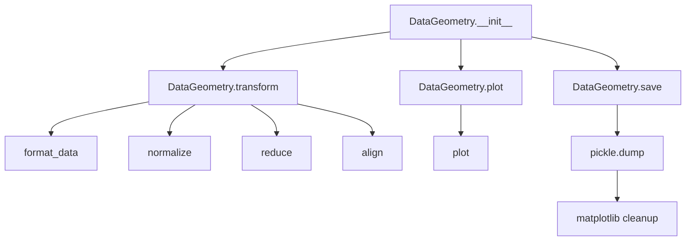

# `datageometry.py`

## `hypertools.datageometry.DataGeometry` · *class*

## Summary:
DataGeometry is a container class that manages data transformations, plotting configurations, and visualization capabilities for multidimensional data analysis.

## Description:
The DataGeometry class serves as a central hub for managing data transformations, plotting configurations, and visualization workflows in the hypertools library. It stores both raw data and transformed data, maintains configuration parameters for various data processing steps (reduction, alignment, normalization), and provides methods for plotting and saving data geometries.

This class is typically instantiated by higher-level functions in the hypertools ecosystem that process data through various transformations before visualization. It encapsulates the entire pipeline from raw data input to transformed data ready for plotting.

## State:
- fig: matplotlib.figure.Figure or None - Stores the matplotlib figure associated with the visualization
- ax: matplotlib.axes.Axes or None - Stores the matplotlib axes associated with the visualization  
- line_ani: Any - Stores line animation data for dynamic visualizations
- data: Any - Raw data input, potentially converted to standardized format using convert_text for lists of strings
- dtype: str - Standardized data type identifier determined by get_dtype function ('list', 'arr', 'df', 'str', 'geo')
- xform_data: Any - Transformed data that has undergone preprocessing pipeline
- reduce: dict or str or None - Configuration for dimensionality reduction algorithm and parameters
- align: dict or str or None - Configuration for data alignment algorithm and parameters  
- normalize: str or None - Normalization method specification ('across', 'within', 'row', False, None)
- semantic: str or None - Semantic modeling approach for text data processing
- vectorizer: str or None - Text vectorization method for converting text to numerical representations
- corpus: str or None - Corpus specification for semantic modeling
- kwargs: dict or None - Additional keyword arguments for plotting configuration
- version: str - Version identifier of the hypertools library

## Lifecycle:
Creation: Instantiate with optional parameters including data, transformation configurations, and plotting parameters. Data can be provided as raw input or as pre-transformed data. The constructor processes list data through convert_text and determines data type using get_dtype.
Usage: Call methods like transform() to apply data processing pipelines, plot() to generate visualizations, or save() to persist the object. The typical workflow involves creating the object, optionally transforming data, then plotting.
Destruction: The save() method handles cleanup of matplotlib objects before serialization. The class implements proper resource management through temporary nullification of matplotlib references during pickling.

## Method Map:


## Raises:
- TypeError: Raised by get_dtype() when data type is not supported, or by convert_text() when text conversion fails
- ValueError: Raised by various transformation functions when invalid parameters are provided (e.g., invalid reduce or align configurations)
- KeyError: Raised when accessing dictionary keys in transformation parameters that don't exist
- IOError: Raised by save() method when file operations fail

## Example:
```python
# Create a DataGeometry object with sample data
import hypertools as hp
data = ["This is sample text", "Another piece of text"]
dg = hp.DataGeometry(data=data)

# Transform the data
transformed = dg.transform()

# Plot the data
fig, ax = dg.plot()

# Save the object
dg.save('my_data.geo')
```

### `hypertools.datageometry.DataGeometry.__init__` · *method*

## Summary:
Initializes a DataGeometry object with plotting configuration, data, and transformation parameters.

## Description:
The `__init__` method constructs a DataGeometry instance by setting instance attributes from provided parameters. It handles special processing for list-type data by converting text elements and determines the standardized data type. This method serves as the entry point for creating DataGeometry objects that manage data transformations and visualizations.

## Args:
    fig (matplotlib.figure.Figure or None, optional): Matplotlib figure object for visualization. Defaults to None.
    ax (matplotlib.axes.Axes or None, optional): Matplotlib axes object for visualization. Defaults to None.
    line_ani (Any, optional): Line animation data for dynamic visualizations. Defaults to None.
    data (Any, optional): Raw data input that may be processed. Defaults to None.
    xform_data (Any, optional): Pre-transformed data. Defaults to None.
    reduce (dict or str or None, optional): Configuration for dimensionality reduction. Defaults to None.
    align (dict or str or None, optional): Configuration for data alignment. Defaults to None.
    normalize (str or None, optional): Normalization method specification. Defaults to None.
    semantic (str or None, optional): Semantic modeling approach for text data. Defaults to None.
    vectorizer (str or None, optional): Text vectorization method. Defaults to None.
    corpus (str or None, optional): Corpus specification for semantic modeling. Defaults to None.
    kwargs (dict or None, optional): Additional keyword arguments for plotting. Defaults to None.
    version (str, optional): Version identifier of the hypertools library. Defaults to __version__.
    dtype (str or None, optional): Explicit data type specification. Defaults to None.

## Returns:
    None: This method initializes instance attributes and does not return a value.

## Raises:
    TypeError: When `get_dtype()` encounters unsupported data types, or when `convert_text()` fails during text conversion.
    ValueError: When invalid parameters are provided to transformation functions.

## State Changes:
    Attributes READ: None
    Attributes WRITTEN: 
        - self.fig
        - self.ax  
        - self.line_ani
        - self.data
        - self.dtype
        - self.xform_data
        - self.reduce
        - self.align
        - self.normalize
        - self.semantic
        - self.vectorizer
        - self.corpus
        - self.kwargs
        - self.version

## Constraints:
    Preconditions:
        - All parameters are optional and can be None
        - If data is provided as a list, it must contain elements compatible with `convert_text()`
        - The `get_dtype()` function must support the provided data type
    Postconditions:
        - All provided parameters are stored as instance attributes
        - If data is a list, it is processed through `convert_text()` before storage
        - `self.dtype` is set to a standardized string identifier via `get_dtype()`

## Side Effects:
    None

### `hypertools.datageometry.DataGeometry.get_data` · *method*

## Summary:
Returns a shallow copy of the internal data storage to prevent external modification of the object's data.

## Description:
This method provides controlled access to the internal `data` attribute by returning a shallow copy. This prevents external code from accidentally modifying the original data stored within the DataGeometry object. The method is typically called during data processing pipelines or when inspecting the stored data without altering the object's state.

## Args:
    None

## Returns:
    The return type depends on the type of data stored in `self.data`:
    - If `self.data` is a list, returns a list
    - If `self.data` is a pandas DataFrame, returns a DataFrame
    - If `self.data` is None, returns None
    - If `self.data` is another type, returns a copy of that type

## Raises:
    None

## State Changes:
    Attributes READ: self.data
    Attributes WRITTEN: None

## Constraints:
    Preconditions: The DataGeometry object must be initialized with a valid data attribute
    Postconditions: The returned data is independent of the internal `self.data` attribute

## Side Effects:
    None

### `hypertools.datageometry.DataGeometry.get_formatted_data` · *method*

## Summary:
Returns formatted data by applying the standard formatting pipeline to the internal data attribute.

## Description:
This method applies the `format_data` transformation to the internal `self.data` attribute, converting various input data types into a standardized numerical representation suitable for downstream analysis and visualization. The method serves as a convenient interface to access the formatted version of the data without modifying the original data stored in `self.data`.

## Args:
    None

## Returns:
    list: A list of formatted data arrays that have been processed through the standard formatting pipeline. The exact structure depends on the input data type but typically contains numerical arrays ready for machine learning or visualization operations.

## Raises:
    None explicitly raised

## State Changes:
    Attributes READ: self.data
    Attributes WRITTEN: None

## Constraints:
    Preconditions: The `self.data` attribute must be initialized (not None) and contain valid data that can be processed by the `format_data` function.
    Postconditions: The returned data maintains the same number of samples as the original data but in a standardized numerical format.

## Side Effects:
    None

### `hypertools.datageometry.DataGeometry.transform` · *method*

## Summary:
Transforms input data through a standardized pipeline of formatting, normalization, dimensionality reduction, and alignment operations, returning the transformed result.

## Description:
This method applies a standardized transformation pipeline to input data, which includes formatting, normalization, dimensionality reduction, and alignment. When no data is provided (data=None), it returns previously transformed data stored in self.xform_data. This method serves as the primary interface for applying the full data transformation workflow to new datasets while maintaining consistency with the object's configuration parameters.

## Args:
    data (array-like, optional): Input data to transform. If None, returns cached transformed data from self.xform_data.

## Returns:
    array-like: Transformed data after processing through the full pipeline. When data is None, returns self.xform_data directly. When data is provided, returns the result of the full transformation pipeline (formatted → normalized → reduced → aligned).

## Raises:
    None explicitly raised by this method.

## State Changes:
    Attributes READ: self.xform_data, self.semantic, self.vectorizer, self.corpus, self.normalize, self.reduce, self.align
    Attributes WRITTEN: None

## Constraints:
    Preconditions: 
    - self.reduce must contain a 'params' dictionary with 'n_components' key when data is provided
    - All required parameters for format_data, normalize, reduce, and align must be properly initialized in the instance
    
    Postconditions:
    - When data is None, returns self.xform_data unchanged
    - When data is provided, returns the result of the full transformation pipeline with proper chaining of operations

## Side Effects:
    None directly observable from this method. However, the underlying transformation functions may perform:
    - Data formatting operations
    - Memory allocation for intermediate results
    - Potential warnings about data dimensions or missing values
    - Calls to external libraries for machine learning operations

### `hypertools.datageometry.DataGeometry.plot` · *method*

## Summary:
Creates visualizations using stored or provided data with configured transformations and plotting parameters.

## Description:
This method serves as a wrapper for the underlying plotting functionality, preparing data and configuration parameters before invoking the actual plotting function. It allows for flexible data input while maintaining consistency with the object's configured transformations and settings.

## Args:
    data (Any, optional): Alternative data to plot instead of the object's stored data. Defaults to None.
    **kwargs: Additional keyword arguments that override object configuration for the plot.

## Returns:
    The return value depends on the underlying plot function from hypertools.plot.plot, which typically returns matplotlib figure and axes objects.

## Raises:
    None explicitly raised by this method, though the underlying plot function may raise exceptions.

## State Changes:
    Attributes READ: self.data, self.xform_data, self.kwargs, self.reduce, self.align, self.normalize, self.semantic, self.vectorizer, self.corpus
    Attributes WRITTEN: None

## Constraints:
    Preconditions: The object must have been initialized with appropriate data and configuration.
    Postconditions: The method returns the result of the underlying plotting function with the specified data and parameters.

## Side Effects:
    I/O operations when the underlying plot function creates visualization files.
    Potential matplotlib figure/axes creation and manipulation.

### `hypertools.datageometry.DataGeometry.save` · *method*

## Summary:
Saves the DataGeometry object to a file using pickle serialization with automatic .geo extension.

## Description:
Serializes the current DataGeometry object state to disk, temporarily clearing visualization-related attributes for proper serialization. This method ensures that the object can be reconstructed later while maintaining all data and configuration information.

## Args:
    fname (str): Path to the output file. If no .geo extension is provided, it will be automatically appended.
    compression (None): Deprecated parameter. Compression is no longer supported and will be removed in future versions.

## Returns:
    None: This method does not return any value.

## Raises:
    None explicitly raised: However, standard pickle and file I/O exceptions may occur during serialization.

## State Changes:
    Attributes READ: self.fig, self.ax, self.line_ani, self.data
    Attributes WRITTEN: self.fig, self.ax, self.line_ani, self.data (temporarily set to None, then restored)

## Constraints:
    Preconditions: The DataGeometry object must be properly initialized with all required attributes.
    Postconditions: The object state is preserved in the file, and all attributes are restored to their original values after serialization.

## Side Effects:
    I/O: Writes binary data to the specified file path using pickle serialization.
    Temporary state modification: Visualization-related attributes are temporarily set to None during serialization.

