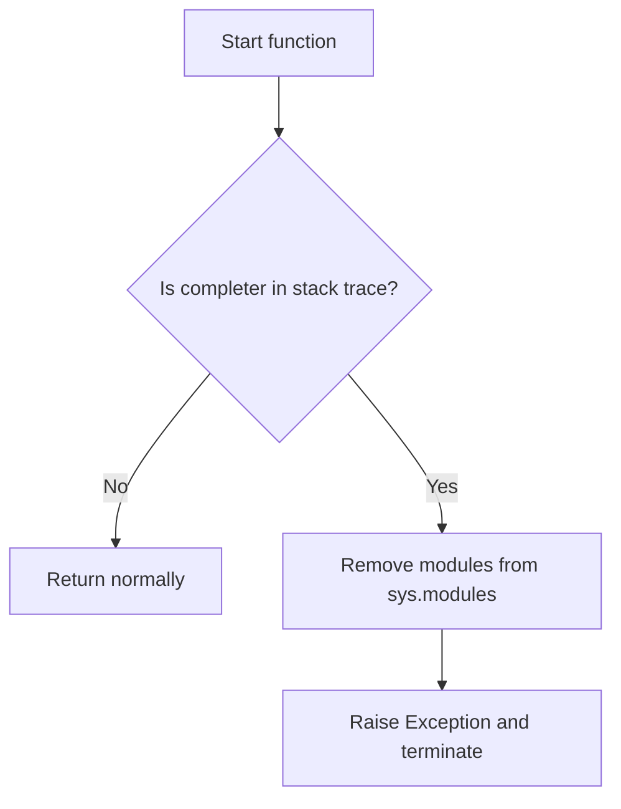
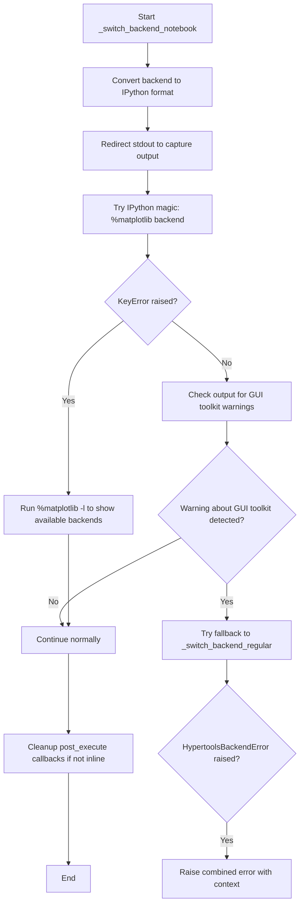
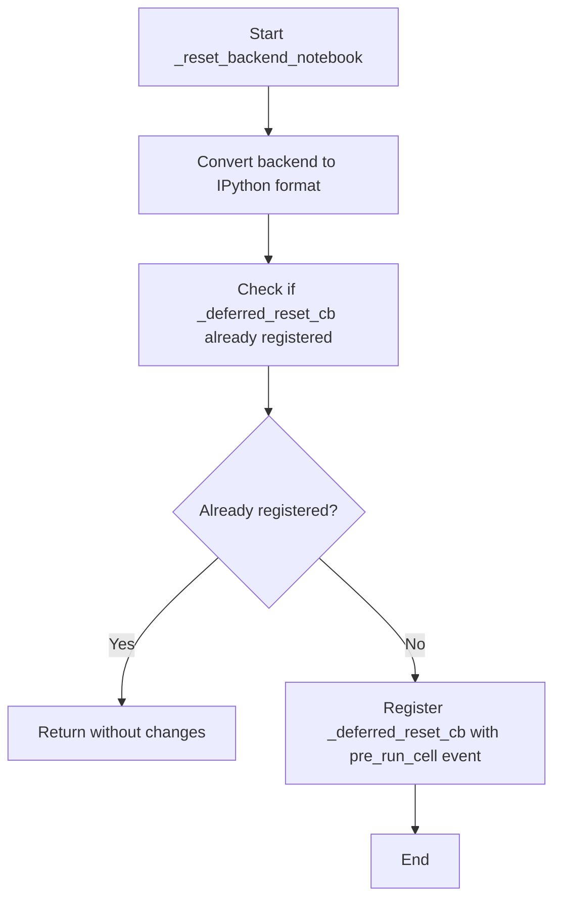
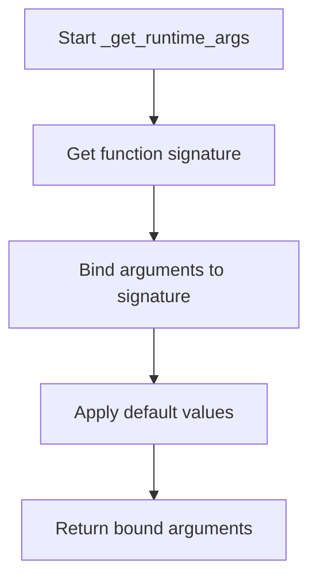
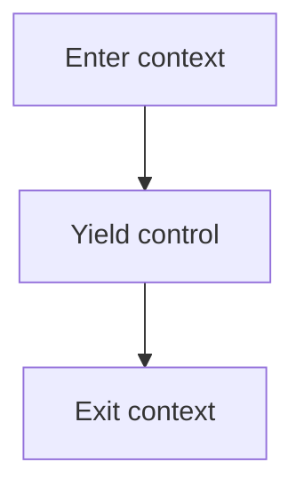

# `backend.py`

## `hypertools.plot.backend.ParrotDict` · *class*

## Summary:
A dictionary subclass that automatically wraps all keys and values with HypertoolsBackend for consistent matplotlib backend management.

## Description:
ParrotDict is a specialized dictionary implementation designed to work with matplotlib backend specifications. It automatically converts all keys and values to HypertoolsBackend instances during dictionary operations, ensuring consistent backend type handling throughout the plotting system. This abstraction helps maintain type safety and proper backend management when working with different matplotlib backends across various execution environments.

## State:
- Inherits all standard dict attributes and behaviors
- Keys and values are automatically wrapped with HypertoolsBackend during set operations
- All dictionary operations maintain HypertoolsBackend type consistency for keys and values
- The underlying storage uses standard Python dict behavior

## Lifecycle:
- Creation: Instantiate with any arguments valid for dict() constructor (e.g., existing dict, key-value pairs)
- Usage: Standard dictionary operations (__getitem__, __setitem__, __contains__, etc.) automatically handle HypertoolsBackend conversion
- Destruction: Inherits standard dict destruction behavior

## Method Map:
```mermaid
graph TD
    A[ParrotDict.__init__] --> B[dict.__init__]
    A --> C[Superclass initialization]
    B --> D[Storage setup]
    
    E[ParrotDict.__contains__] --> F[HypertoolsBackend(key)]
    F --> G[super().__contains__]
    
    H[ParrotDict.__getitem__] --> I[HypertoolsBackend(key)]
    I --> J[super().__getitem__]
    
    K[ParrotDict.__missing__] --> L[HypertoolsBackend(key)]
    L --> M[Return new HypertoolsBackend]
    
    N[ParrotDict.__setitem__] --> O[HypertoolsBackend(key)]
    O --> P[HypertoolsBackend(value)]
    P --> Q[super().__setitem__]
```

## Raises:
- HypertoolsBackendError: May be raised during HypertoolsBackend construction if invalid backend identifiers are encountered
- KeyError: Raised by standard dict operations when accessing missing keys
- TypeError: Raised by standard dict operations when inappropriate types are used

## Example:
```python
# Create a ParrotDict
parrot_dict = ParrotDict()

# Set items - keys and values are automatically wrapped
parrot_dict["Agg"] = "TkAgg"

# Get items - keys are automatically converted
backend = parrot_dict["Agg"]  # Returns HypertoolsBackend instance

# Check containment - keys are automatically converted
exists = "Agg" in parrot_dict  # Returns True

# Missing keys create new HypertoolsBackend instances
missing_backend = parrot_dict["NonExistent"]  # Returns new HypertoolsBackend("NonExistent")
```

### `hypertools.plot.backend.ParrotDict.__init__` · *method*

## Summary:
Initializes a ParrotDict instance by delegating to the parent dict constructor with provided arguments.

## Description:
This method serves as the constructor for the ParrotDict class, which is a specialized dictionary subclass designed to automatically wrap all keys and values with HypertoolsBackend instances. The method simply forwards all initialization arguments to the parent dict class constructor, enabling standard dictionary creation patterns while maintaining the specialized behavior of ParrotDict for backend management.

## Args:
    *args: Variable length argument list passed to the parent dict constructor
    **kwargs: Arbitrary keyword arguments passed to the parent dict constructor

## Returns:
    None: This method initializes the object in-place and returns None

## Raises:
    TypeError: May be raised by dict.__init__ if invalid arguments are provided
    HypertoolsBackendError: May be raised during HypertoolsBackend construction if invalid backend identifiers are encountered during dictionary initialization

## State Changes:
    Attributes READ: None
    Attributes WRITTEN: Initializes all standard dict attributes and behavior

## Constraints:
    Preconditions: Arguments must be valid for dict constructor (e.g., existing dict, key-value pairs, etc.)
    Postconditions: The instance is initialized as a standard dictionary with enhanced backend handling capabilities

## Side Effects:
    None: This method performs no I/O operations or external service calls

### `hypertools.plot.backend.ParrotDict.__contains__` · *method*

## Summary:
Checks if a given key exists in the dictionary by converting it to a HypertoolsBackend instance and searching among the stored keys.

## Description:
Implements the `in` operator for the ParrotDict class, allowing users to test membership using `key in parrot_dict`. This method converts the input key to a HypertoolsBackend instance and checks if that instance exists among the dictionary's keys. The conversion ensures consistent backend handling regardless of input format.

This logic is implemented as a separate method because it needs to maintain type consistency with the rest of the ParrotDict operations, ensuring that all key comparisons happen using HypertoolsBackend instances rather than raw strings.

## Args:
    key (str): A string representing a matplotlib backend specification to check for existence

## Returns:
    bool: True if the HypertoolsBackend(key) exists in the dictionary keys, False otherwise

## Raises:
    None explicitly raised

## State Changes:
    Attributes READ: self.keys()
    Attributes WRITTEN: None

## Constraints:
    Preconditions: The key parameter must be a string that can be converted to a HypertoolsBackend instance
    Postconditions: The method returns a boolean value indicating membership status without modifying the dictionary

## Side Effects:
    None

### `hypertools.plot.backend.ParrotDict.__getitem__` · *method*

## Summary:
Retrieves a value from the dictionary using a backend-aware key conversion.

## Description:
Converts the provided key to a HypertoolsBackend instance and retrieves the corresponding value from the underlying dictionary. This method ensures that all dictionary lookups use the proper backend-aware key type for consistent behavior across different execution environments.

## Args:
    key (str): The string key to look up in the dictionary.

## Returns:
    Any: The value associated with the converted key in the dictionary.

## Raises:
    KeyError: When the converted key is not found in the dictionary.
    HypertoolsBackendError: When the key cannot be converted to a valid HypertoolsBackend instance.

## State Changes:
    Attributes READ: None
    Attributes WRITTEN: None

## Constraints:
    Preconditions: The key must be a valid string that can be converted to a HypertoolsBackend instance
    Postconditions: The returned value maintains its original type and value

## Side Effects:
    None

### `hypertools.plot.backend.ParrotDict.__missing__` · *method*

## Summary:
Returns a new HypertoolsBackend instance when a key is not found in the dictionary.

## Description:
This special method is invoked by Python's dict implementation when a key lookup fails. The ParrotDict class overrides the standard dictionary behavior to automatically create and return a HypertoolsBackend instance for any requested key that doesn't exist in the dictionary. This enables lazy initialization of backend configurations while maintaining type consistency.

The method is called during dictionary access operations like `dict[key]` when `key` is not present in the dictionary, and it's part of the standard Python dictionary protocol for handling missing keys.

## Args:
    key (Any): The key that was not found in the dictionary

## Returns:
    HypertoolsBackend: A new HypertoolsBackend instance initialized with the missing key value

## Raises:
    None: This method does not raise exceptions directly

## State Changes:
    Attributes READ: None - this method only uses the input parameter
    Attributes WRITTEN: None - this method does not modify any instance attributes

## Constraints:
    Preconditions: 
    - The method expects a key parameter that can be passed to HypertoolsBackend constructor
    - The key should be a valid argument for creating a HypertoolsBackend instance
    
    Postconditions:
    - Returns a new HypertoolsBackend instance with the provided key
    - Does not modify the dictionary state

## Side Effects:
    None: This method performs no I/O operations or external service calls

### `hypertools.plot.backend.ParrotDict.__setitem__` · *method*

## Summary:
Sets a key-value pair in the ParrotDict after converting both to HypertoolsBackend objects.

## Description:
This method implements the `__setitem__` protocol for the ParrotDict class, enabling assignment operations like `dict[key] = value`. It converts both the key and value to `HypertoolsBackend` objects before storing them in the underlying dictionary structure via the parent class's `__setitem__` method.

## Args:
    key: The key to set, which will be converted to a HypertoolsBackend object
    value: The value to associate with the key, which will be converted to a HypertoolsBackend object

## Returns:
    None: This method doesn't return a meaningful value, but delegates to the parent class's __setitem__ method

## Raises:
    Any exceptions raised by the parent class's __setitem__ method or HypertoolsBackend constructor

## State Changes:
    Attributes READ: None
    Attributes WRITTEN: The underlying dictionary storage managed by the parent class

## Constraints:
    Preconditions: The key and value must be compatible with the HypertoolsBackend constructor
    Postconditions: The key-value pair will be stored in the dictionary with both key and value converted to HypertoolsBackend objects

## Side Effects:
    None: This method doesn't have observable side effects beyond modifying the dictionary contents

## `hypertools.plot.backend.BackendMapping` · *class*

## Summary:
A mapping utility class that manages bidirectional backend equivalencies between Python and IPython matplotlib backends.

## Description:
BackendMapping serves as a centralized registry for managing matplotlib backend mappings between Python and IPython environments. It facilitates seamless backend switching and equivalence resolution by maintaining three key dictionaries: py_to_ipy (Python to IPython mappings), ipy_to_py (IPython to Python mappings), and equivalents (equivalence relationships between different backend names). This abstraction enables consistent backend management across different execution contexts while supporting flexible key specifications that can include lists of equivalent backend names.

## State:
- py_to_ipy (ParrotDict): Maps Python backend names to their IPython equivalents
- ipy_to_py (ParrotDict): Maps IPython backend names to their Python equivalents
- equivalents (ParrotDict): Maintains equivalence relationships between different backend name variants
- All attributes are initialized during object construction and populated based on the input dictionary

## Lifecycle:
- Creation: Instantiate with a dictionary mapping Python backend names to IPython backend names
- Usage: Access the three mapping dictionaries for backend resolution operations
- Destruction: Inherits standard object destruction behavior

## Method Map:
```mermaid
graph TD
    A[BackendMapping.__init__] --> B[_store_equivalents(py_key)]
    A --> C[_store_equivalents(ipy_key)]
    A --> D[py_to_ipy[py_key_default] = ipy_key_default]
    A --> E[ipy_to_py[ipy_key_default] = py_key_default]
    
    B --> F[Check if keylist is iterable]
    F --> G{Is iterable?}
    G -->|Yes| H[default_key = keylist[0]]
    G -->|No| I[default_key = keylist]
    
    H --> J[Store equivalences in equivalents dict]
    I --> J
    
    J --> K[Return default_key]
```

## Raises:
- HypertoolsBackendError: May be raised during ParrotDict operations if invalid backend identifiers are encountered
- TypeError: Raised if the input `_dict` is not a dictionary-like object
- KeyError: May be raised during dictionary operations if invalid keys are accessed

## Example:
```python
# Create a backend mapping
mapping = BackendMapping({
    "Agg": "TkAgg",
    ["Qt5Agg", "PyQt5Agg"]: "QtAgg",
    "MacOSX": "TkAgg"
})

# Access mappings
python_backend = mapping.py_to_ipy["Agg"]  # Returns corresponding IPython backend
ipython_backend = mapping.ipy_to_py["TkAgg"]  # Returns corresponding Python backend
equivalent = mapping.equivalents["Qt5Agg"]  # Returns the default backend name

# The mapping supports equivalent backend names
# Multiple backend names can map to the same default
```

### `hypertools.plot.backend.BackendMapping.__init__` · *method*

## Summary:
Initializes backend mapping dictionaries for converting between Python and IPython matplotlib backends.

## Description:
Configures the backend mapping infrastructure by creating three ParrotDict instances and populating them with bidirectional mappings between Python and IPython backend names. This method establishes the foundation for backend conversion throughout the plotting system.

## Args:
    _dict (dict): Dictionary mapping Python backend names to IPython backend names. Keys and values can be either string names or iterable collections of equivalent backend names.

## Returns:
    None: This method does not return a value.

## Raises:
    None: This method does not explicitly raise exceptions based on the provided code.

## State Changes:
    Attributes READ: None
    Attributes WRITTEN: 
        - self.py_to_ipy: Populated with bidirectional mappings from Python to IPython backends
        - self.ipy_to_py: Populated with bidirectional mappings from IPython to Python backends  
        - self.equivalents: Populated with equivalent backend name mappings

## Constraints:
    Preconditions:
        - _dict parameter must be a dictionary-like object with iterable items
        - Keys and values in _dict can be either strings or iterable collections of backend names
    Postconditions:
        - Three ParrotDict instances (py_to_ipy, ipy_to_py, equivalents) are initialized and populated
        - Bidirectional mappings exist between Python and IPython backend names
        - Equivalent backend names are stored for consistent lookup

## Side Effects:
    None: This method performs no I/O operations or external service calls. It only initializes internal data structures.

### `hypertools.plot.backend.BackendMapping._store_equivalents` · *method*

## Summary:
Maps equivalent keys to a default key for backend compatibility in the plotting system.

## Description:
Manages equivalent key mappings between Python and IPython backends by storing key equivalencies in the internal equivalents dictionary. This method is called during class initialization to establish key relationships between different backend representations.

## Args:
    keylist: Either a string key or an iterable of keys representing equivalent identifiers. When an iterable is provided, the first element becomes the default key to which all subsequent elements are mapped.

## Returns:
    The default key that represents the canonical form of the provided keylist.

## Raises:
    None explicitly raised, but may raise exceptions from underlying operations like indexing into iterables.

## State Changes:
    Attributes READ: None
    Attributes WRITTEN: self.equivalents - stores key equivalency mappings

## Constraints:
    Preconditions: keylist must be either a string or an iterable object
    Postconditions: If keylist is iterable, self.equivalents contains mappings for all elements except the first one

## Side Effects:
    None

## `hypertools.plot.backend.HypertoolsBackend` · *class*

## Summary:
A string subclass that provides backend-aware string operations for matplotlib backend management in hypertools plotting.

## Description:
The HypertoolsBackend class extends Python's built-in str type to provide specialized behavior for handling matplotlib backend specifications. It ensures that string operations maintain the HypertoolsBackend type and provides methods to convert between IPython and Python backend representations. This abstraction is crucial for managing plotting backends consistently across different execution environments (notebook vs regular Python scripts).

## State:
- Inherits all string attributes from str class
- Maintains case-insensitive equality comparison via __eq__ override
- Implements custom hash function based on case-folded string representation via __hash__ override
- Depends on global constants: BACKEND_MAPPING (mapping between backend representations) and IS_NOTEBOOK (boolean flag indicating execution environment)
- All string operations return HypertoolsBackend instances when appropriate to maintain type consistency

## Lifecycle:
- Creation: Instantiate with a string backend identifier (e.g., "Agg", "TkAgg") - the constructor accepts a single string parameter
- Usage: Methods can be called in any order, but typically normalize() is used to get appropriate backend for current environment
- Destruction: Inherits standard str destruction behavior

## Method Map:
```mermaid
graph TD
    A[HypertoolsBackend] --> B[as_ipython()]
    A --> C[as_python()]
    A --> D[normalize()]
    B --> E[HypertoolsBackend]
    C --> E
    D --> E
    E --> F[Standard str operations]
    F --> E
```

## Raises:
- HypertoolsBackendError: Potentially raised by backend mapping operations if invalid backend identifiers are encountered

## Example:
```python
# Create backend instance
backend = HypertoolsBackend("Agg")

# Convert to IPython backend
ipython_backend = backend.as_ipython()

# Convert to Python backend  
python_backend = backend.as_python()

# Normalize for current environment
normalized = backend.normalize()

# String operations maintain type
upper_case = backend.upper()  # Returns HypertoolsBackend
split_result = backend.split(",")  # Returns tuple of HypertoolsBackend objects
```

### `hypertools.plot.backend.HypertoolsBackend.__new__` · *method*

## Summary:
Creates a new HypertoolsBackend instance by delegating to the parent str class constructor.

## Description:
This method overrides the standard object creation process to ensure that HypertoolsBackend instances are properly constructed as string objects. It serves as a factory method that delegates to the parent str class's constructor while maintaining the custom behavior of the HypertoolsBackend class.

## Args:
    cls: The class being instantiated (HypertoolsBackend)
    x: The value to initialize the string with, typically a backend identifier string

## Returns:
    HypertoolsBackend: A new instance of the HypertoolsBackend class initialized with the provided value

## Raises:
    TypeError: If the provided argument cannot be converted to a string

## State Changes:
    Attributes READ: None
    Attributes WRITTEN: None

## Constraints:
    Preconditions: 
    - cls must be the HypertoolsBackend class or a subclass
    - x must be convertible to a string
    
    Postconditions:
    - Returns a new HypertoolsBackend instance
    - The returned instance behaves like a string but with custom methods

## Side Effects:
    None

### `hypertools.plot.backend.HypertoolsBackend.__eq__` · *method*

## Summary:
Implements case-insensitive equality comparison between HypertoolsBackend instances.

## Description:
This special method enables comparing HypertoolsBackend objects using case-insensitive string comparison. It is invoked when using the '==' operator between two HypertoolsBackend instances or between a HypertoolsBackend and any other object that can be converted to a string.

## Args:
    other (Any): Another object to compare against this HypertoolsBackend instance.

## Returns:
    bool: True if the string representations of both objects are equal (case-insensitively), False otherwise.

## State Changes:
    - Attributes READ: None (reads no instance attributes directly)
    - Attributes WRITTEN: None (modifies no instance attributes)

## Constraints:
    - Preconditions: The object being compared must be convertible to a string via str().
    - Postconditions: Always returns a boolean value indicating equality.

## Side Effects:
    - None (no I/O, external service calls, or mutations to objects outside self)

## Usage Context:
This method is automatically called during equality comparisons (==) involving HypertoolsBackend instances. It ensures that backend identifiers like 'matplotlib' and 'MATPLOTLIB' are treated as equivalent, which is useful for configuration and backend selection systems where case variations should not affect functionality.

### `hypertools.plot.backend.HypertoolsBackend.__getattribute__` · *method*

## Summary:
Intercepts attribute access to wrap string method results in HypertoolsBackend instances.

## Description:
This method overrides the default attribute access behavior to intercept calls to string methods inherited from the built-in `str` class. When a string method is accessed, it wraps the returned value in a `HypertoolsBackend` instance when the result is a string, list, tuple, or set. This allows for method chaining and maintains the custom behavior of the `HypertoolsBackend` class throughout string operations.

## Args:
    name (str): The name of the attribute being accessed.

## Returns:
    Various: Either a wrapped method that processes string method results, or the result from the parent class's attribute access.

## Raises:
    AttributeError: When the requested attribute doesn't exist and isn't a string method.

## State Changes:
    Attributes READ: None - this method only reads the attribute name parameter
    Attributes WRITTEN: None - this method doesn't modify any instance attributes

## Constraints:
    Preconditions: The class must inherit from `str` and the attribute name must be a valid identifier
    Postconditions: String method results are wrapped in `HypertoolsBackend` instances when appropriate

## Side Effects:
    None - This method doesn't perform I/O, external service calls, or mutate objects outside the instance

### `hypertools.plot.backend.HypertoolsBackend.__hash__` · *method*

## Summary:
Computes a hash value for the HypertoolsBackend instance using its lowercase string representation.

## Description:
This special method implements a case-insensitive hash function for HypertoolsBackend instances. It ensures that objects with the same string content (regardless of case) produce identical hash values, maintaining consistency with the case-insensitive equality comparison implemented in `__eq__`. This method is automatically invoked when the object is used as a dictionary key or stored in a set.

## Args:
    None (special method taking only self)

## Returns:
    int: An integer hash value computed from the lowercase string representation of the object.

## Raises:
    None (no exceptions raised by this method)

## State Changes:
    - Attributes READ: None (reads no instance attributes directly)
    - Attributes WRITTEN: None (modifies no instance attributes)

## Constraints:
    - Preconditions: The object must be convertible to a string via str().
    - Postconditions: Returns an integer hash value that remains consistent for equivalent objects.

## Side Effects:
    - None (no I/O, external service calls, or mutations to objects outside self)

## Usage Context:
This method is automatically called during hash-based operations such as dictionary key lookup, set membership testing, and when the object is used as a dictionary key. It's particularly important for maintaining consistency in collections where case-insensitive equality is desired.

### `hypertools.plot.backend.HypertoolsBackend.as_ipython` · *method*

## Summary:
Converts the current backend representation to its IPython-compatible equivalent.

## Description:
This method transforms the current HypertoolsBackend instance into its corresponding IPython backend representation. It serves as part of the backend conversion system that allows tools to work consistently across different execution environments (notebook vs regular Python).

## Args:
    self: HypertoolsBackend instance representing the current backend configuration

## Returns:
    HypertoolsBackend: A new instance representing the IPython-compatible version of the current backend

## Raises:
    KeyError: If the current backend is not found in BACKEND_MAPPING.equivalents or if the IPython equivalent is not found in BACKEND_MAPPING.py_to_ipy

## State Changes:
    Attributes READ: self (the current backend instance), BACKEND_MAPPING.equivalents, BACKEND_MAPPING.py_to_ipy
    Attributes WRITTEN: None (returns new instance rather than modifying self)

## Constraints:
    Preconditions: 
    - BACKEND_MAPPING must be initialized and contain the necessary mapping dictionaries
    - The current backend instance must exist in BACKEND_MAPPING.equivalents
    - The IPython equivalent must exist in BACKEND_MAPPING.py_to_ipy
    
    Postconditions:
    - Returns a new HypertoolsBackend instance with IPython-compatible backend string
    - Original self instance remains unchanged

## Side Effects:
    None - This method is pure and doesn't cause any I/O operations or external service calls

### `hypertools.plot.backend.HypertoolsBackend.as_python` · *method*

## Summary:
Converts the current backend representation from IPython/Jupyter environment to standard Python environment.

## Description:
This method transforms the current HypertoolsBackend instance from its IPython/Jupyter-compatible representation to its standard Python equivalent. It serves as part of the backend conversion system that allows tools to work consistently across different execution environments (notebook vs regular Python). The method looks up the current backend in the global BACKEND_MAPPING to find its canonical representation, then maps it to the Python-compatible version.

## Args:
    self: HypertoolsBackend instance representing the current backend configuration in IPython/Jupyter environment

## Returns:
    HypertoolsBackend: A new instance representing the Python-compatible version of the current backend

## Raises:
    KeyError: If the current backend is not found in BACKEND_MAPPING.equivalents or if the Python equivalent is not found in BACKEND_MAPPING.ipy_to_py

## State Changes:
    Attributes READ: self (the current backend instance), BACKEND_MAPPING.equivalents, BACKEND_MAPPING.ipy_to_py
    Attributes WRITTEN: None (returns new instance rather than modifying self)

## Constraints:
    Preconditions: 
    - BACKEND_MAPPING must be initialized and contain the necessary mapping dictionaries
    - The current backend instance must exist in BACKEND_MAPPING.equivalents
    - The Python equivalent must exist in BACKEND_MAPPING.ipy_to_py
    
    Postconditions:
    - Returns a new HypertoolsBackend instance with Python-compatible backend string
    - Original self instance remains unchanged

## Side Effects:
    None - This method is pure and doesn't cause any I/O operations or external service calls

### `hypertools.plot.backend.HypertoolsBackend.normalize` · *method*

## Summary:
Normalizes the backend representation to match the current execution environment (Jupyter notebook or standard Python).

## Description:
This method ensures that the backend representation is converted to the appropriate format based on whether the code is executing in a Jupyter notebook environment. When running in a notebook, it converts the backend to its IPython-compatible form; otherwise, it converts it to the standard Python form. This method acts as a bridge between different execution contexts to maintain consistent backend behavior.

## Args:
    self: HypertoolsBackend instance representing the current backend configuration

## Returns:
    HypertoolsBackend: A new instance with the backend representation normalized for the current execution environment

## Raises:
    KeyError: If the current backend is not found in BACKEND_MAPPING.equivalents or if the equivalent backend is not found in the appropriate mapping dictionary (py_to_ipy or ipy_to_py)

## State Changes:
    Attributes READ: self (the current backend instance), IS_NOTEBOOK flag
    Attributes WRITTEN: None (returns new instance rather than modifying self)

## Constraints:
    Preconditions: 
    - BACKEND_MAPPING must be initialized and contain the necessary mapping dictionaries
    - IS_NOTEBOOK must be a boolean flag indicating the execution environment
    - The current backend instance must exist in BACKEND_MAPPING.equivalents
    
    Postconditions:
    - Returns a new HypertoolsBackend instance with environment-appropriate backend string
    - Original self instance remains unchanged

## Side Effects:
    None - This method is pure and doesn't cause any I/O operations or external service calls

## `hypertools.plot.backend._init_backend` · *function*

## Summary:
Initializes the matplotlib backend for hypertools plotting with environment-aware fallback strategies.

## Description:
The `_init_backend` function establishes the appropriate matplotlib backend for hypertools plotting operations by detecting the execution environment (notebook vs regular Python) and selecting from available backends with proper fallback mechanisms. It handles environment variable overrides, manages global state variables, and sets up appropriate callback functions for backend switching in different contexts.

This function is extracted from inline logic to centralize backend initialization and provide a clean separation of concerns between environment detection, backend selection, and state management. It ensures consistent plotting behavior across different execution environments while gracefully handling backend availability issues.

## Args:
    None: This function takes no parameters.

## Returns:
    None: This function does not return any value.

## Raises:
    None explicitly raised by this function, though underlying operations may raise exceptions during backend switching.

## Constraints:
    Preconditions:
    - Matplotlib must be properly installed and importable
    - The function must be called in an environment where matplotlib can be configured
    - Global variables like `mpl` (matplotlib) and `get_ipython` must be available
    - The `BACKEND_KEYS` constant must be defined in the module scope
    
    Postconditions:
    - Global variables `BACKEND_MAPPING`, `BACKEND_WARNING`, `HYPERTOOLS_BACKEND`, `IPYTHON_INSTANCE`, `IS_NOTEBOOK`, `reset_backend`, and `switch_backend` are properly initialized
    - The matplotlib backend is set to an appropriate working value
    - Environment-specific callback functions are registered for backend management

## Side Effects:
    - Modifies global matplotlib backend state through `mpl.use()`
    - Sets global variables including `BACKEND_MAPPING`, `BACKEND_WARNING`, `HYPERTOOLS_BACKEND`, `IPYTHON_INSTANCE`, `IS_NOTEBOOK`, `reset_backend`, and `switch_backend`
    - May register IPython event callbacks in notebook environments
    - Calls `_block_greedy_completer_execution()` which modifies `sys.modules` in certain conditions
    - Temporarily changes matplotlib backend during initialization process

## Control Flow:
```mermaid
flowchart TD
    A[Start _init_backend] --> B{Can get IPython instance?}
    B -->|No| C[Set IS_NOTEBOOK = False]
    B -->|Yes| D[Set IS_NOTEBOOK = True]
    C --> E[Select backends list with platform-specific defaults]
    E --> F{Environment variable HYPERTOOLS_BACKEND set?}
    F -->|Yes| G[Reorder backends with env var first]
    G --> H[Iterate through backends]
    H --> I{Try mpl.use(b)}
    I -->|Success| J[Set working_backend = b]
    I -->|Failure| K[Continue to next backend]
    K --> L{All backends exhausted?}
    L -->|Yes| M[Set fallback to 'Agg']
    M --> N[Set warning message]
    N --> O[Set switch_backend/reset_backend to _switch_backend_regular]
    D --> P[Attempt mpl.use('nbAgg')]
    P --> Q{Success?}
    Q -->|Yes| R[Set working_backend = 'nbAgg']
    Q -->|No| S[Set fallback to 'inline']
    S --> T[Set warning message]
    T --> U[Set switch_backend to _switch_backend_notebook]
    U --> V[Set reset_backend to _reset_backend_notebook]
    O --> W[Restore original backend]
    R --> W
    V --> W
    W --> X[Initialize BACKEND_MAPPING with BACKEND_KEYS]
    X --> Y[Initialize HYPERTOOLS_BACKEND with normalized working_backend]
```

## Examples:
```python
# This function is typically called internally by the plotting system
# and would not normally be called directly by users

# In a regular Python script environment:
# - Function detects non-notebook environment
# - Tries backends in order: TkAgg, QtAgg, Qt5Agg, etc.
# - Falls back to 'Agg' if none work
# - Sets up regular backend switching callbacks

# In a Jupyter notebook environment:
# - Function detects notebook environment
# - Attempts 'nbAgg' backend first
# - Falls back to 'inline' if 'nbAgg' fails
# - Sets up notebook-specific backend switching callbacks

# With environment variable override:
# - If HYPERTOOLS_BACKEND is set to 'QtAgg', it tries that first
# - Falls back to other backends if unavailable
```

## `hypertools.plot.backend._block_greedy_completer_execution` · *function*

## Summary:
Interrupts execution when IPython's greedy completer is active by removing conflicting modules and raising an exception.

## Description:
This function serves as a defensive mechanism to prevent conflicts between IPython's greedy completer and hypertools plotting operations. When IPython's autocompletion system is actively running, it can interfere with module loading and execution. This function detects such situations by examining the call stack for IPython's completer module and, upon detection, removes specific modules from sys.modules to prevent conflicts, then raises a generic Exception to interrupt the current execution.

## Args:
    None

## Returns:
    None

## Raises:
    Exception: Raised when IPython's greedy completer is detected in the call stack to interrupt execution and prevent module conflicts.

## Constraints:
    Preconditions:
    - Must be executed in an environment with access to traceback module
    - IPython's completer module must be present in the call stack for the function to take action
    
    Postconditions:
    - If completer is detected, specified modules ('hypertools.plot', 'hypertools.plot.backend', 'numpy') are removed from sys.modules
    - Execution is interrupted by raising an exception

## Side Effects:
    - Modifies sys.modules by removing entries for 'hypertools.plot', 'hypertools.plot.backend', and 'numpy'
    - Raises an exception that terminates the current execution flow
    - May cause subsequent imports of removed modules to behave unexpectedly

## Control Flow:


## Examples:
```python
# This function is typically called internally by plotting functions
# and would not normally be called directly by users

# Example scenario:
# 1. User types in IPython console
# 2. IPython's greedy completer activates during code completion
# 3. Hypertools plotting function is invoked
# 4. This function detects the completer presence
# 5. Conflicting modules are removed from sys.modules
# 6. Exception is raised to prevent execution conflicts
```

## `hypertools.plot.backend._switch_backend_regular` · *function*

## Summary:
Switches the matplotlib plotting backend to the specified backend with enhanced error handling.

## Description:
This function provides a standardized way to switch matplotlib plotting backends while offering detailed error messages for common failure scenarios. It extracts the Python representation of a backend object and attempts to switch matplotlib's backend, catching and re-raising specific exceptions as HypertoolsBackendError with informative messages.

The function is typically called during plotting setup or configuration when a specific matplotlib backend needs to be activated for rendering plots.

## Args:
    backend: A backend object that implements an `as_python()` method returning a string representation of the backend name.

## Returns:
    None: This function does not return any value.

## Raises:
    HypertoolsBackendError: Raised when backend switching fails due to missing dependencies or other issues. The error message differentiates between import-related failures (missing dependencies) and other unexpected errors.

## Constraints:
    Preconditions:
    - The backend parameter must have an `as_python()` method that returns a valid matplotlib backend string
    - The matplotlib library must be properly installed
    - The specified backend must be available in the current environment
    
    Postconditions:
    - If successful, the matplotlib backend has been switched to the requested backend
    - If failed, a HypertoolsBackendError is raised with a descriptive message

## Side Effects:
    - Modifies the global matplotlib backend state
    - May trigger matplotlib backend initialization which could involve loading libraries
    - May cause existing plot objects to become invalid

## Control Flow:
```mermaid
flowchart TD
    A[Start _switch_backend_regular] --> B{backend.as_python()}
    B --> C[plt.switch_backend(backend)]
    C --> D{Exception raised?}
    D -->|Yes| E{Is ImportError/ModuleNotFoundError?}
    E -->|Yes| F[Create specific error message]
    E -->|No| G[Create generic error message]
    F --> H[Raise HypertoolsBackendError]
    G --> H
    D -->|No| I[Return successfully]
```

## Examples:
```python
# Switching to a valid backend
try:
    _switch_backend_regular(my_backend_object)
except HypertoolsBackendError as e:
    print(f"Backend switching failed: {e}")

# This would raise HypertoolsBackendError with specific message
# if the backend is not available or dependencies are missing
```

## `hypertools.plot.backend._switch_backend_notebook` · *function*

## Summary:
Switches the matplotlib plotting backend in a Jupyter notebook environment, handling validation, error recovery, and cleanup of figure callbacks.

## Description:
This function provides a robust mechanism for switching matplotlib plotting backends within Jupyter notebook environments. It attempts to set the specified backend using IPython magic commands, handles invalid backend errors by showing available options, and implements fallback logic to regular backend switching when GUI toolkit conflicts occur. The function also manages cleanup of IPython event callbacks to prevent conflicts with figure rendering.

The function is typically called during plotting initialization or configuration when a specific matplotlib backend needs to be activated for rendering plots in Jupyter notebooks.

## Args:
    backend: A backend object that implements an `as_ipython()` method returning a string representation of the backend name suitable for IPython magic commands.

## Returns:
    None: This function does not return any value.

## Raises:
    ValueError: Raised when the specified backend is not a valid IPython plotting backend, with detailed information about available backends.
    HypertoolsBackendError: Raised when backend switching fails via both IPython magic and regular matplotlib methods, providing detailed error context.

## Constraints:
    Preconditions:
    - The backend parameter must have an `as_ipython()` method that returns a valid IPython matplotlib backend string
    - IPYTHON_INSTANCE must be available in the global namespace (typically provided by Jupyter environment)
    - The matplotlib library must be properly installed
    - The specified backend must be available in the current Jupyter environment
    
    Postconditions:
    - If successful, the matplotlib backend has been switched to the requested backend in the Jupyter environment
    - If failed, appropriate exceptions are raised with descriptive messages

## Side Effects:
    - Modifies the global matplotlib backend state through IPython magic commands
    - May unregister IPython event callbacks related to figure flushing
    - May trigger matplotlib backend initialization which could involve loading libraries
    - May cause existing plot objects to become invalid

## Control Flow:


## Examples:
```python
# Switching to a valid backend
try:
    _switch_backend_notebook(my_backend_object)
except ValueError as e:
    print(f"Invalid backend specified: {e}")
except HypertoolsBackendError as e:
    print(f"Backend switching failed: {e}")

# This would raise ValueError with available backends if backend is invalid
# or HypertoolsBackendError if both IPython and regular switching fail
```

## `hypertools.plot.backend._reset_backend_notebook` · *function*

## Summary:
Registers a deferred callback to reset the matplotlib backend in a Jupyter notebook environment before each cell execution.

## Description:
This function sets up a callback mechanism that ensures the matplotlib backend is properly reset before each notebook cell runs. It registers a `_deferred_reset_cb` function with IPython's event system to execute when a cell is about to run, ensuring consistent backend state across notebook cells. The function prevents duplicate registrations by checking if the callback is already registered.

The function is typically called during plotting setup or configuration when maintaining a consistent matplotlib backend state across notebook cells is important. It's designed to work within Jupyter notebook environments where IPython's event system can be used to hook into cell execution lifecycle.

## Args:
    backend: A backend object that implements an `as_ipython()` method returning a string representation of the backend name suitable for IPython magic commands.

## Returns:
    None: This function does not return any value.

## Raises:
    None explicitly raised by this function, though underlying operations may raise exceptions.

## Constraints:
    Preconditions:
    - The backend parameter must have an `as_ipython()` method that returns a valid IPython matplotlib backend string
    - IPYTHON_INSTANCE must be available in the global namespace (typically provided by Jupyter environment)
    - The matplotlib library must be properly installed
    - The specified backend must be available in the current Jupyter environment
    
    Postconditions:
    - If not already registered, a callback is registered with IPython's pre_run_cell event
    - The callback will execute `_switch_backend_notebook(backend)` before each cell execution
    - The callback is unregistered after execution to prevent accumulation

## Side Effects:
    - Registers a callback function with IPython's event system
    - Modifies the global IPython event callback registry
    - Triggers the `_switch_backend_notebook` function during cell execution
    - May cause existing plot objects to become invalid if backend changes

## Control Flow:


## Examples:
```python
# Typical usage in a Jupyter notebook environment
from hypertools.plot.backend import _reset_backend_notebook

# Reset backend to 'inline' for consistent plotting
backend_obj = SomeBackendObject()  # Must have as_ipython() method
_reset_backend_notebook(backend_obj)

# The callback will automatically execute before each cell run
# to ensure the backend is reset to the specified value
```

## `hypertools.plot.backend._get_runtime_args` · *function*

## Summary:
Returns a dictionary of all arguments with their values for a given function, including default values for unspecified parameters.

## Description:
This utility function processes a function and its arguments to create a complete mapping of all parameter names to their corresponding values. It leverages Python's introspection capabilities to bind arguments to function parameters and automatically apply default values for any missing arguments.

## Args:
    func (callable): The function whose signature and arguments are being processed
    *func_args (tuple): Positional arguments to be bound to the function parameters
    **func_kwargs (dict): Keyword arguments to be bound to the function parameters

## Returns:
    dict: A dictionary mapping parameter names to their bound values, including default values for unspecified parameters

## Raises:
    TypeError: When the provided arguments cannot be bound to the function signature (e.g., wrong number of arguments, invalid keyword arguments)

## Constraints:
    Preconditions:
        - The `func` parameter must be a callable object (function, method, etc.)
        - All provided arguments must be compatible with the function signature
    Postconditions:
        - The returned dictionary will contain all parameters defined in the function signature
        - Default values are properly applied for any missing arguments

## Side Effects:
    None

## Control Flow:


## Examples:
```python
def sample_func(a, b=10, c=20):
    return a + b + c

# Basic usage
args = _get_runtime_args(sample_func, 5)
# Returns: {'a': 5, 'b': 10, 'c': 20}

# With keyword arguments
args = _get_runtime_args(sample_func, 5, c=30)
# Returns: {'a': 5, 'b': 10, 'c': 30}
```

## `hypertools.plot.backend.set_interactive_backend` · *class*

*No documentation generated.*

### `hypertools.plot.backend.set_interactive_backend.__init__` · *method*

## Summary:
Initializes an interactive backend manager that handles switching between different plotting backends while preserving previous settings.

## Description:
This constructor sets up the state for managing matplotlib plotting backends in an interactive environment. It stores the current backend configuration and prepares for potential backend switching operations. The method is designed to be part of a class that manages backend state globally, allowing for controlled switching between different matplotlib backends while maintaining backward compatibility.

## Args:
    backend (str): The name of the matplotlib backend to switch to. This is typically a string like 'inline', 'notebook', 'tkagg', etc.

## Returns:
    None: This method initializes instance attributes but does not return a value.

## Raises:
    HypertoolsBackendError: If the provided backend name is invalid or cannot be normalized by the HypertoolsBackend class.

## State Changes:
    Attributes READ:
        - HYPERTOOLS_BACKEND: Global variable representing the current backend configuration
        - BACKEND_WARNING: Global variable storing backend-related warnings
    
    Attributes WRITTEN:
        - self.old_interactive_backend: Stores the normalized version of the current backend
        - self.old_backend_warning: Stores the current backend warning state
        - self.new_interactive_backend: Stores the normalized version of the requested backend
        - self.new_is_different: Boolean flag indicating if the new backend differs from the old one
        - self.backend_switched: Boolean flag initialized to False, likely used later in the switching process

## Constraints:
    Preconditions:
        - The global variable HYPERTOOLS_BACKEND must be initialized before this method is called
        - The global variable BACKEND_WARNING must be initialized before this method is called
        - The backend parameter must be a valid backend identifier that can be processed by HypertoolsBackend
        
    Postconditions:
        - Instance attributes are properly initialized with current and requested backend states
        - The backend_switched attribute is initialized to False
        - If backends differ, global variables are updated appropriately

## Side Effects:
    - Modifies global variables HYPERTOOLS_BACKEND and BACKEND_WARNING when backends are different
    - May trigger backend switching logic in subsequent operations (though not directly in this method)

### `hypertools.plot.backend.set_interactive_backend.__enter__` · *method*

## Summary:
Sets up an interactive matplotlib backend context by configuring the current backend and tracking whether a switch occurred.

## Description:
This method is the entry point of a context manager that temporarily switches matplotlib to an interactive backend. It records the current backend state and determines if a backend switch is necessary, setting up the appropriate tracking flags for the context's lifecycle.

## Args:
    None - This is a method of the set_interactive_backend class and doesn't accept additional arguments beyond `self`.

## Returns:
    None - This method doesn't return any value.

## Raises:
    None explicitly raised - The method itself doesn't raise exceptions, though underlying operations may raise them.

## State Changes:
    Attributes READ:
        - self.new_interactive_backend: The target interactive backend being switched to
    Attributes WRITTEN:
        - self.curr_backend: Stores the current matplotlib backend before any potential switch
        - self.backend_switched: Boolean flag indicating whether a backend switch was performed

## Constraints:
    Preconditions:
        - The class instance must be properly initialized with a valid backend specification
        - The matplotlib library must be available and properly configured
        - Global variable `IN_SET_CONTEXT` must be accessible for modification
    
    Postconditions:
        - The global `IN_SET_CONTEXT` flag is set to True
        - The current backend is stored in `self.curr_backend`
        - If a backend switch is needed, `self.backend_switched` is set to True

## Side Effects:
    - Modifies global state by setting `IN_SET_CONTEXT` to True
    - May modify matplotlib's backend configuration if a switch is required
    - Accesses matplotlib's get_backend() function to determine current backend

### `hypertools.plot.backend.set_interactive_backend.__exit__` · *method*

## Summary:
Restores the previous matplotlib backend configuration when exiting a context manager block.

## Description:
This method serves as the context manager's exit handler, responsible for cleaning up and restoring the original matplotlib backend state. It ensures proper cleanup of backend settings when leaving a `with` block that uses the `set_interactive_backend` context manager. The method handles restoration of both global backend state and matplotlib backend itself when appropriate.

## Args:
    self: The set_interactive_backend instance
    exc_type: Exception type if an exception occurred in the context block (or None)
    exc_value: Exception value if an exception occurred in the context block (or None)  
    traceback: Traceback object if an exception occurred in the context block (or None)

## Returns:
    None

## Raises:
    None explicitly raised

## State Changes:
    Attributes READ: self.new_is_different, self.old_interactive_backend, self.old_backend_warning, self.backend_switched, self.curr_backend
    Attributes WRITTEN: IN_SET_CONTEXT (global), HYPERTOOLS_BACKEND (global), BACKEND_WARNING (global)

## Constraints:
    Preconditions:
    - The context manager must have been entered via __enter__ method
    - Global variables BACKEND_WARNING, HYPERTOOLS_BACKEND, and IN_SET_CONTEXT must be initialized
    - Instance attributes new_is_different, old_interactive_backend, old_backend_warning, backend_switched, and curr_backend must be properly set
    
    Postconditions:
    - The global IN_SET_CONTEXT flag is set to False
    - If the backend was changed during the context, it's restored to the original state
    - If a backend switch occurred, the original backend is restored via reset_backend call

## Side Effects:
    - Modifies global state variables IN_SET_CONTEXT, HYPERTOOLS_BACKEND, and BACKEND_WARNING
    - Calls reset_backend function which likely performs matplotlib backend restoration
    - May perform matplotlib backend switching operations through reset_backend

## `hypertools.plot.backend._null_backend_context` · *function*

## Summary:
A minimal no-operation context manager that yields control without performing any backend operations.

## Description:
This function implements a basic context manager that does nothing except yield control back to the caller. It serves as a null backend context that can be used when no real backend operations are required or when a fallback context manager is needed. The function maintains interface compatibility with other backend context managers while providing no-op behavior.

## Args:
    dummy_backend (any): Parameter accepting any value, typically used to maintain consistent function signatures across different backend implementations. This parameter is unused in the implementation.

## Returns:
    Generator: A context manager generator that yields control back to the caller.

## Raises:
    None: This function does not raise any exceptions.

## Constraints:
    Preconditions: None - the function can be called with any argument.
    Postconditions: The context manager successfully yields control back to the caller.

## Side Effects:
    None: This function performs no I/O operations, external state mutations, or service calls.

## Control Flow:


## Examples:
```python
# Usage as a context manager
with _null_backend_context("dummy_backend"):
    # No backend operations performed
    pass

# As a fallback in backend selection
backend_context = _null_backend_context(None)
```

## `hypertools.plot.backend.manage_backend` · *function*

*No documentation generated.*

