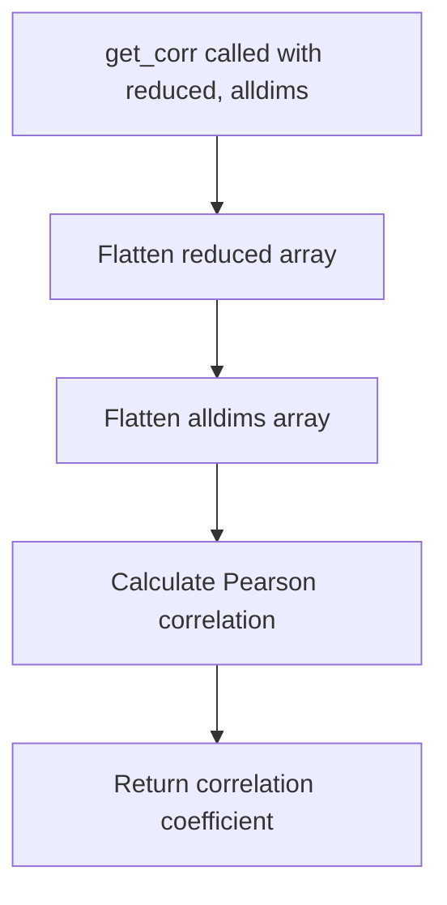

# `describe.py`

## `hypertools.tools.describe.describe` · *function*

## Summary:
Analyzes dimensionality reduction performance by computing correlations between original and reduced-dimensional data across varying numbers of components.

## Description:
The `describe` function evaluates how well different dimensionality reduction techniques preserve the structural relationships in data as the number of components increases. It computes correlation coefficients between the original high-dimensional distance matrix and reduced-dimensional distance matrices for various component counts, providing insights into optimal dimensionality reduction choices.

This function is extracted into its own component to separate the analysis logic from the core dimensionality reduction operations, enabling reuse in different contexts while maintaining clean responsibility boundaries. It provides diagnostic information to help users choose appropriate numbers of components for their dimensionality reduction tasks.

## Args:
    x (array-like): Input data to analyze. Can be a single dataset or list of datasets.
    reduce (str, optional): Dimensionality reduction technique to use. Defaults to 'IncrementalPCA'. 
    max_dims (int, optional): Maximum number of dimensions to test. If None, automatically determined based on data shape.
    show (bool, optional): Whether to display a plot of the correlation results. Defaults to True.
    format_data (bool, optional): Whether to preprocess input data. Defaults to True.

## Returns:
    dict: A dictionary containing:
        - 'average': List of correlation values averaged across all datasets
        - 'individual': List of correlation values for each individual dataset

## Raises:
    None explicitly raised by this function, though underlying functions may raise exceptions.

## Constraints:
    Preconditions:
    - Input data must be numeric and convertible to numpy arrays
    - Data dimensions must be finite numbers (no NaN or infinity values)
    - If max_dims is specified, it must be a positive integer
    
    Postconditions:
    - Returns a dictionary with 'average' and 'individual' keys
    - Correlation values are between -1 and 1
    - Plot is displayed if show=True

## Side Effects:
    - Issues a deprecation warning about potential long computation time for large datasets
    - Displays matplotlib plot if show=True
    - May modify input data if format_data=True
    - Calls various utility functions from the hypertools toolkit

## Control Flow:
```mermaid
flowchart TD
    A[describe called with x, reduce, max_dims, show, format_data] --> B{format_data=True?}
    B -->|Yes| C[Apply format_data to x]
    B -->|No| D[Skip formatting]
    D --> E[Initialize result dict]
    E --> F[Call summary(x, max_dims) for average]
    F --> G[Call summary(x_i, max_dims) for each x_i in x]
    G --> H{max_dims=None?}
    H -->|Yes| I[Set max_dims=len(result['average'])]
    H -->|No| J[Skip setting max_dims]
    J --> K{show=True?}
    K -->|Yes| L[Create plot with sns.tsplot]
    K -->|No| M[Skip plotting]
    L --> N[Return result]
    M --> N
```

## Examples:
```python
# Basic usage with single dataset
import numpy as np
data = np.random.rand(100, 10)
result = describe(data)

# With custom reduction method
result = describe(data, reduce='PCA')

# Without showing plot
result = describe(data, show=False)

# With maximum dimensions specified
result = describe(data, max_dims=5)

# With list of datasets
datasets = [np.random.rand(50, 5), np.random.rand(50, 5)]
result = describe(datasets)
```

## `hypertools.tools.describe.get_corr` · *function*

## Summary:
Calculates the Pearson correlation coefficient between flattened reduced data and original dimensions.

## Description:
This function computes the linear correlation between two datasets by flattening both input arrays and applying Pearson correlation analysis. It's typically used in dimensionality reduction analysis to measure how well the reduced representation preserves the original data structure.

## Args:
    reduced (array-like): The reduced-dimensional data, typically output from a dimensionality reduction technique.
    alldims (array-like): The original high-dimensional data, usually containing all available dimensions.

## Returns:
    float: The Pearson correlation coefficient between the flattened reduced data and original dimensions, ranging from -1 to 1.

## Raises:
    None explicitly raised by this function.

## Constraints:
    Preconditions:
    - Both `reduced` and `alldims` must be array-like objects that support `.ravel()` method
    - Both arrays must have compatible shapes for correlation calculation
    
    Postconditions:
    - Returns a float value representing correlation strength (-1 to 1)
    - Function execution is deterministic for identical inputs

## Side Effects:
    None.

## Control Flow:


## Examples:
```python
# Basic usage
import numpy as np
from scipy.stats import pearsonr

# Sample data
reduced_data = np.array([[1, 2], [3, 4]])
original_dims = np.array([[2, 3], [4, 5]])

# Calculate correlation
corr_value = get_corr(reduced_data, original_dims)
print(f"Correlation: {corr_value}")
```

## `hypertools.tools.describe.get_cdist` · *function*

## Summary:
Computes pairwise Euclidean distances between all rows of input data.

## Description:
This function calculates the pairwise Euclidean distances between all rows in the input matrix using scipy's cdist function. It serves as a convenience wrapper that eliminates the need to specify identical matrices for both arguments in the scipy cdist call.

## Args:
    x (array-like): Input data matrix where rows represent samples and columns represent features. Must be convertible to a numpy array.

## Returns:
    ndarray: A symmetric square matrix of shape (n_samples, n_samples) where element (i,j) represents the Euclidean distance between row i and row j of the input matrix.

## Raises:
    None explicitly raised by this function, though scipy.cdist may raise ValueError for invalid inputs.

## Constraints:
    Preconditions:
    - Input x must be a valid numeric array-like structure
    - All elements in x must be finite numbers (no NaN or infinity values)
    
    Postconditions:
    - Output matrix is symmetric (distance(i,j) = distance(j,i))
    - Diagonal elements are zero (distance(i,i) = 0)
    - Output shape is (n_rows, n_rows) where n_rows is the number of rows in input x

## Side Effects:
    None

## Control Flow:
```mermaid
flowchart TD
    A[get_cdist called with x] --> B{Input validation}
    B --> C[Call scipy.spatial.distance.cdist(x, x)]
    C --> D[Return distance matrix]
```

## Examples:
```python
# Basic usage
import numpy as np
data = np.array([[1, 2], [3, 4], [5, 6]])
distances = get_cdist(data)
print(distances)
# Output: [[0.         2.82842712 5.65685425]
#          [2.82842712 0.         2.82842712]
#          [5.65685425 2.82842712 0.        ]]

# With different data types
from sklearn.datasets import make_blobs
X, _ = make_blobs(n_samples=5, centers=2, random_state=42)
distances = get_cdist(X)
print(f"Distance matrix shape: {distances.shape}")
# Output: Distance matrix shape: (5, 5)
```

