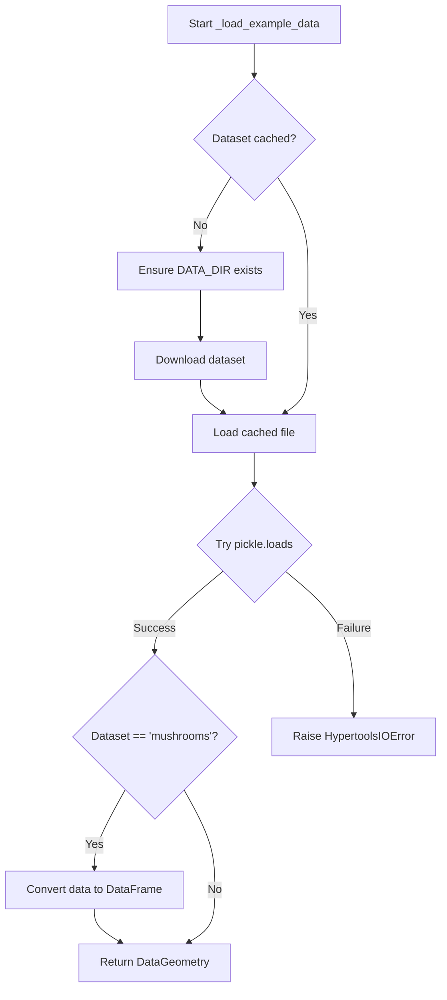

# `load.py`

## `hypertools.tools.load.load` · *function*

## Summary:
Loads data from either built-in example datasets or serialized files, with optional data transformation and visualization capabilities.

## Description:
The load function provides a unified interface for loading data in the hypertools library. It supports loading from predefined example datasets or from serialized DataGeometry files (.geo). When loading from files, it handles both modern pickle formats and legacy deepdish formats. The function can also optionally apply data transformations (normalization, dimensionality reduction, alignment) and generate visualizations.

This function extracts the complex logic of data loading, format detection, and optional post-processing into a single, reusable component that can be called from various parts of the hypertools ecosystem. It centralizes error handling for file operations and data format issues.

## Args:
    dataset (str): Path to a .geo file or name of a built-in example dataset. When a dataset name matches keys in EXAMPLE_DATA, it loads the example dataset.
    reduce (str or dict or None, optional): Dimensionality reduction method to apply. Defaults to None.
    ndims (int or None, optional): Target number of dimensions for reduction. Required when reduce is specified. Defaults to None.
    align (str or bool or dict, optional): Alignment method to apply. Defaults to None.
    normalize (str or bool or None, optional): Normalization method to apply. Defaults to None.
    legacy (bool, optional): Flag to enable loading of legacy-format datasets. Defaults to False.

## Returns:
    DataGeometry or tuple: When no transformations are applied, returns a DataGeometry object. When transformations are applied (any of reduce, ndims, align, normalize are specified), returns the result of plot() function call, which is typically a tuple containing matplotlib figure and axes objects.

## Raises:
    HypertoolsIOError: When dataset files cannot be found, loaded, or when data format issues occur. Specifically raised when:
    - Dataset path doesn't exist
    - Pickle deserialization fails
    - Legacy format loading requires deepdish module but it's not installed
    - Invalid parameters are passed to underlying functions

## Constraints:
    Preconditions:
        - When using reduction with ndims, both parameters must be specified
        - When using align or normalize, valid parameter values must be provided
        - For legacy loading, the deepdish module must be installed
    Postconditions:
        - If transformations are applied, returns matplotlib figure/axes from plotting
        - If no transformations are applied, returns a properly initialized DataGeometry object
        - Data is properly formatted (pandas DataFrame for dict data)

## Side Effects:
    - File system I/O operations when loading from disk
    - Network I/O when downloading example datasets (if not cached)
    - Directory creation when setting up cache directories for example datasets
    - Potential matplotlib figure/axes creation when transformations are applied

## Control Flow:
```mermaid
flowchart TD
    A[Start load function] --> B{Dataset in EXAMPLE_DATA?}
    B -->|Yes| C[_load_example_data(dataset)]
    C --> D{Dataset ends with _model?}
    D -->|Yes| E[Return geo_data]
    D -->|No| F[Continue processing]
    B -->|No| G[Resolve dataset path]
    G --> H{Path exists?}
    H -->|No| I[Raise HypertoolsIOError]
    H -->|Yes| J{legacy=True?}
    J -->|Yes| K[_load_legacy(dataset_path)]
    J -->|No| L[Try pickle.loads]
    L --> M{pickle.UnpicklingError?}
    M -->|Yes| N[Raise HypertoolsIOError]
    M -->|No| O[Process data if needed]
    O --> P{Any transformations requested?}
    P -->|Yes| Q[Import plot function]
    Q --> R[Set default reduce method]
    R --> S[Call analyze()]
    S --> T[Call plot()]
    P -->|No| U[Return geo_data]
```

## Examples:
```python
# Load an example dataset
dg = hp.load('spiral')

# Load a file and apply dimensionality reduction
fig, ax = hp.load('my_data.geo', reduce='IncrementalPCA', ndims=10)

# Load legacy format data
dg = hp.load('legacy_data.h5', legacy=True)

# Load with full transformations
fig, ax = hp.load('data.geo', reduce='PCA', ndims=5, align='hyper', normalize='across')
```

## `hypertools.tools.load._load_legacy` · *function*

*No documentation generated.*

## `hypertools.tools.load._load_example_data` · *function*

## Summary:
Loads example datasets by checking for cached files or downloading them if needed, then deserializing the data into DataGeometry objects.

## Description:
This internal function handles loading example datasets for the hypertools library. It first checks if a cached version of the requested dataset exists at a predetermined location (DATA_DIR joined with the dataset name). If the cached file doesn't exist, it ensures the data directory exists and downloads the dataset. The function then attempts to deserialize the cached data using pickle, raising a HypertoolsIOError if deserialization fails. For the 'mushrooms' dataset specifically, it converts the underlying data to a pandas DataFrame.

The function abstracts away the complexity of checking for cached files, downloading datasets, and handling deserialization errors, providing a clean interface for accessing example datasets.

## Args:
    dataset (str): Name of the example dataset to load. This is used as part of a file path construction to locate the cached dataset.

## Returns:
    DataGeometry: A DataGeometry object containing the loaded dataset. For the 'mushrooms' dataset, the underlying data is converted to a pandas DataFrame.

## Raises:
    HypertoolsIOError: When the dataset cannot be loaded due to file corruption, download failures, or other I/O errors. The error message suggests clearing the cached file and reloading.

## Constraints:
    Preconditions:
        - The dataset parameter must be a valid string that can be used in file path construction
        - The DATA_DIR global variable must be defined and accessible
        - The _download_example_data function must be available and functional
    Postconditions:
        - If successful, returns a properly initialized DataGeometry object
        - If the dataset is 'mushrooms', the returned object's data attribute will be a pandas DataFrame

## Side Effects:
    - Creates directory structure if it doesn't exist (DATA_DIR)
    - May download files from external servers when cached versions don't exist
    - Reads from and writes to the local filesystem
    - May delete partially downloaded files on download failure

## Control Flow:


## `hypertools.tools.load._download_example_data` · *function*

## Summary:
Downloads example datasets from Google Drive by resolving dataset names to file IDs and streaming the download to a local file path.

## Description:
This internal utility function handles the downloading of example datasets from Google Drive. It resolves dataset names to corresponding file IDs using a predefined mapping, then performs a streaming download with proper handling of Google Drive's confirmation cookies that appear during large file downloads.

## Args:
    dataset_path (pathlib.Path): The local file path where the downloaded dataset should be saved. The function uses the name attribute of this path to look up the corresponding file ID in EXAMPLE_DATA.

## Returns:
    None: This function does not return any value. It saves the downloaded data directly to the specified file path.

## Raises:
    HypertoolsIOError: Raised when the download fails for any reason, including network issues, invalid file IDs, or problems writing to disk. The error message includes the dataset name that failed to download.

## Constraints:
    Preconditions:
        - The dataset_path.name must exist as a key in the global EXAMPLE_DATA dictionary
        - The BASE_URL constant must be defined globally
        - Network connectivity must be available to reach the download server
    Postconditions:
        - If successful, the file at dataset_path will contain the downloaded dataset
        - If unsuccessful, the file at dataset_path will be deleted (if it existed)

## Side Effects:
    - Makes HTTP requests to external Google Drive servers
    - Writes data to the local filesystem at the specified dataset_path
    - May delete partially downloaded files on failure

## Control Flow:
```mermaid
flowchart TD
    A[Start download] --> B{Lookup file_id in EXAMPLE_DATA}
    B --> C{Create requests.Session()}
    C --> D{Make GET request to BASE_URL}
    D --> E{Check response cookies}
    E --> F{Cookie starts with 'download_warning'?}
    F -- Yes --> G{Add confirm param and retry}
    G --> H{Write chunks to file}
    F -- No --> H
    H --> I{Download complete?}
    I -- Yes --> J[Return]
    I -- No --> H
    J --> K{Exception occurred?}
    K -- Yes --> L{Delete file if exists}
    L --> M{Re-raise HypertoolsIOError}
    K -- No --> N[Success]
```

## Examples:
```python
# Download a sample dataset
from pathlib import Path
dataset_path = Path.home() / "datasets" / "sample_data.h5"
_download_example_data(dataset_path)
```

