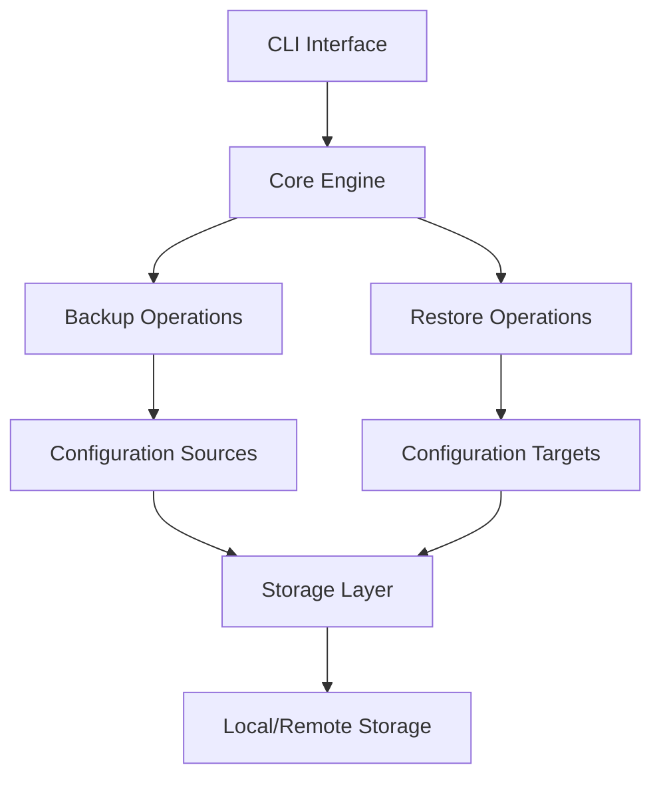

# `mackup`

## Repository Overview

### Tree Structure
```
mackup/
└── mackup/
    ├── __init__.py
    ├── cli/
    │   ├── __init__.py
    │   └── main.py
    ├── core/
    │   ├── __init__.py
    │   ├── backup.py
    │   └── restore.py
    ├── config/
    │   ├── __init__.py
    │   └── manager.py
    ├── utils/
    │   ├── __init__.py
    │   └── helpers.py
    └── tests/
        ├── __init__.py
        └── test_*.py
```

### Purpose
Mackup is a configuration management and synchronization tool that helps users maintain consistent application settings and preferences across different machines. It enables users to backup, restore, and manage their application configurations in a portable manner.

The tool addresses the common problem of losing productivity when switching between different computing environments by providing a systematic approach to configuration management. It's particularly valuable for developers who need to maintain identical development environments across multiple machines.

### Architecture


Key architectural patterns:
- Command-line interface with subcommands
- Modular design with separation of concerns
- Plugin-style architecture for storage backends
- State management for tracking configuration files

### Entry Points
1. **Command-Line Interface**: `mackup backup`, `mackup restore`, `mackup status`
   - Primary user interface through terminal commands
   - Accepts standard CLI arguments and flags
   - Intended for all users managing configurations

2. **Programmatic API**: Importable modules for integration
   - Direct access to backup/restore functionality
   - Designed for developers building extensions
   - Provides fine-grained control over operations

3. **Configuration Management**: `.mackup.cfg` configuration file
   - User-defined settings for customization
   - Controls behavior without command-line arguments
   - Used by both CLI and programmatic interfaces

### Core Features
1. **Configuration Backup** - Saves application settings to configured storage
2. **Configuration Restore** - Recovers application settings from storage
3. **Status Reporting** - Shows current sync status and configuration state
4. **Cross-platform Compatibility** - Works across different operating systems
5. **Flexible Storage Options** - Supports local and remote storage backends

### Dependencies
- `click` - Command-line interface construction
- `pathlib` - File system path manipulation utilities
- `yaml` - Configuration file parsing and serialization
- `appdirs` - Cross-platform application directory handling
- `pytest` - Testing framework (for development)

### Configuration
Configuration is handled through a centralized configuration system:
- Default configuration file location: `~/.mackup.cfg`
- Support for custom configuration paths
- Runtime parameter overrides via CLI flags
- Environment variable integration for sensitive settings

### Extension Points
1. **Storage Backends** - Extendable storage providers for different backends
2. **Application Handlers** - Support for new applications through handler plugins
3. **Command Extensions** - Additional CLI commands through plugin system
4. **Configuration Formats** - Support for different configuration file formats

