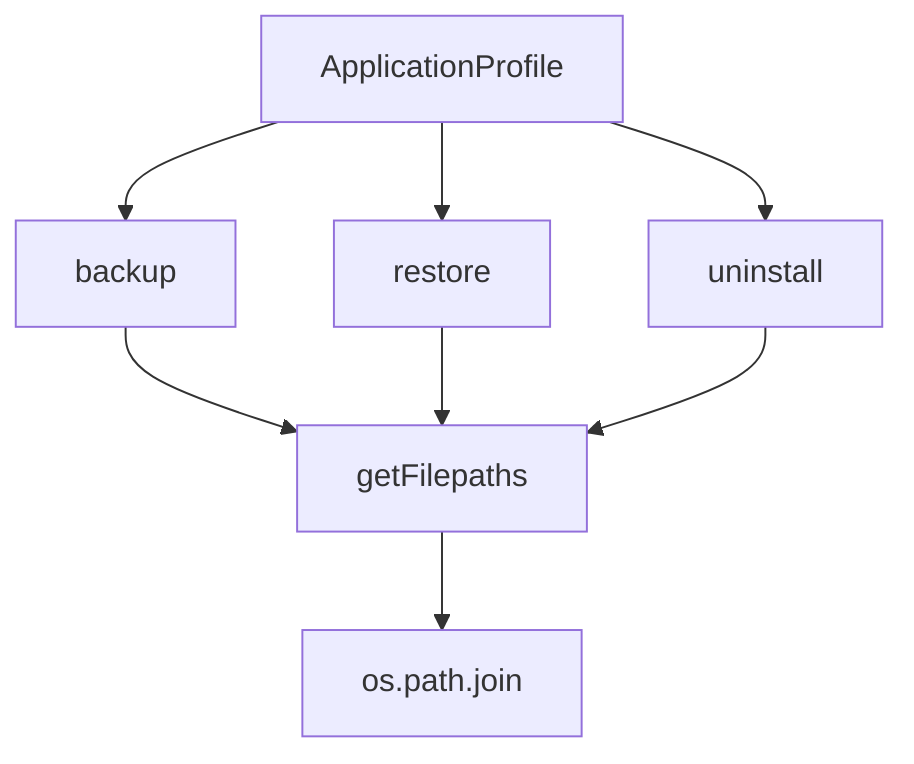

# `application.py`

## `mackup.application.ApplicationProfile` · *class*

## Summary:
Manages file synchronization operations between user home directory and Mackup backup storage for application configuration files.

## Description:
The ApplicationProfile class coordinates file management operations for application-specific configuration files. It handles three primary operations: backing up files from the user's home directory to the Mackup backup storage, restoring files by creating symbolic links, and uninstalling by reverting files to their pre-backup state.

This class acts as an intermediary between the main Mackup system and individual application profiles, managing the file operations while handling various edge cases such as existing files, symbolic links, and platform-specific file support. It ensures that files are properly synchronized between the user's home directory and the backup storage.

## State:
- mackup (Mackup): Reference to the main Mackup instance containing backup folder information
- files (list): List of filenames to operate on (converted from the input set)
- dry_run (bool): Flag indicating whether to simulate operations without making changes
- verbose (bool): Flag indicating whether to display detailed operation information

## Lifecycle:
- Creation: Instantiate with a Mackup object, set of filenames, and boolean flags for dry_run and verbose
- Usage: Call one of the three main methods (backup, restore, uninstall) to synchronize files between home directory and backup storage
- Destruction: No explicit cleanup required; class is lightweight and stateless beyond its initialization parameters

## Method Map:


## Raises:
- AssertionError: When mackup parameter is not an instance of Mackup class
- AssertionError: When files parameter is not a set
- ValueError: When encountering unsupported file types during backup operations

## Example:
```python
# Create an ApplicationProfile for a specific application
profile = ApplicationProfile(mackup_instance, {"config.txt", ".bashrc"}, False, True)

# Perform backup operation
profile.backup()

# Perform restore operation  
profile.restore()

# Perform uninstall operation
profile.uninstall()
```

### `mackup.application.ApplicationProfile.__init__` · *method*

## Summary:
Initializes an application profile with configuration settings and file collections for backup/restore operations.

## Description:
This constructor method sets up the application profile instance with essential configuration parameters and file collections. It validates input types and prepares the instance for subsequent backup or restore operations by storing references to the Mackup configuration, file lists, and operational flags.

## Args:
    mackup (Mackup): An instance of the Mackup configuration class that provides storage and environment management capabilities.
    files (set): A set of file paths that belong to this application profile, which will be converted to a list for internal storage.
    dry_run (bool): Flag indicating whether operations should be performed in simulation mode without actual file changes.
    verbose (bool): Flag indicating whether detailed logging output should be enabled during operations.

## Returns:
    None: This method initializes instance attributes and does not return a value.

## Raises:
    AssertionError: When mackup parameter is not an instance of Mackup class or when files parameter is not a set.

## State Changes:
    Attributes READ: None
    Attributes WRITTEN: self.mackup, self.files, self.dry_run, self.verbose

## Constraints:
    Preconditions: 
    - mackup must be an instance of Mackup class
    - files must be a set type
    - Both parameters must be provided and not None
    
    Postconditions:
    - self.mackup is assigned the provided Mackup instance
    - self.files is assigned as a list conversion of the provided files set
    - self.dry_run is assigned the provided boolean flag
    - self.verbose is assigned the provided boolean flag

## Side Effects:
    None: This method performs no I/O operations or external service calls. It only assigns parameters to instance attributes.

### `mackup.application.ApplicationProfile.getFilepaths` · *method*

## Summary:
Returns a tuple of file paths for a given filename, one in the user's home directory and another in the Mackup backup directory.

## Description:
This method constructs and returns two absolute file paths for a specified filename: one pointing to the location in the user's home directory and another pointing to the corresponding location within the Mackup backup folder. This allows the application to work with both the original file location and its backup location simultaneously.

The method is designed to be a utility for retrieving standardized file paths used throughout the application's backup and restore operations.

## Args:
    filename (str): The name of the file for which to construct paths

## Returns:
    tuple[str, str]: A tuple containing two absolute file paths:
        - First path: absolute path in the user's home directory
        - Second path: absolute path in the Mackup backup directory

## Raises:
    None explicitly raised by this method

## State Changes:
    Attributes READ: self.mackup.mackup_folder
    Attributes WRITTEN: None

## Constraints:
    Preconditions:
        - The HOME environment variable must be set (required by os.environ["HOME"])
        - self.mackup must be initialized with a valid mackup_folder attribute
    Postconditions:
        - Both returned paths are absolute file paths
        - The first path is within the user's home directory
        - The second path is within the Mackup backup directory

## Side Effects:
    None

### `mackup.application.ApplicationProfile.backup` · *method*

## Summary:
Backs up application configuration files from the user's home directory to the Mackup backup storage, creating symbolic links in their original locations to maintain seamless access.

## Description:
This method implements the core backup functionality for application configuration files. It iterates through all tracked application files and moves them from the user's home directory to the Mackup backup storage, replacing them with symbolic links. This approach ensures that applications continue to function normally while preserving the original files in a safe backup location. The method handles various file types including regular files, directories, and symbolic links, and provides user interaction for conflict resolution.

## Args:
    None

## Returns:
    None

## Raises:
    ValueError: When encountering unsupported file types during backup operations (specifically when a backup file is neither a file, directory, nor symlink)

## State Changes:
    Attributes READ: self.files, self.verbose, self.dry_run, self.mackup (through getFilepaths call)
    Attributes WRITTEN: None (method does not modify instance attributes directly)

## Constraints:
    Preconditions: 
    - ApplicationProfile instance must be properly initialized with files to backup
    - Mackup storage directory must be accessible
    - User must have appropriate permissions for file operations
    
    Postconditions:
    - Files in home directory are either backed up to Mackup storage or left unchanged
    - Symbolic links are created in original locations pointing to backed-up files
    - Conflicting backups are handled with user confirmation

## Side Effects:
    - File I/O operations on the filesystem (copying, deleting, linking)
    - Potential user interaction through console prompts for confirmation
    - May modify the user's home directory files by replacing them with symbolic links
    - May create directories in the Mackup storage area

