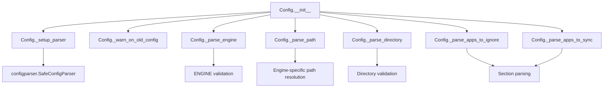
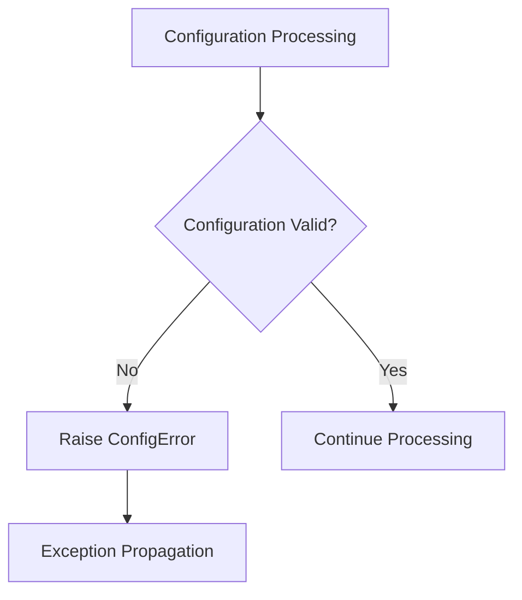

# `config.py`

## `mackup.config.Config` · *class*

## Summary:
Configuration class for managing Mackup backup settings and parsing user preferences from configuration files.

## Description:
The Config class is responsible for reading, validating, and providing access to Mackup backup configuration settings. It parses configuration files to determine storage engine, backup paths, and application selection criteria. This class acts as a central configuration manager that abstracts away the complexity of configuration file parsing and provides a clean interface for accessing configuration values throughout the Mackup system.

## State:
- `_parser`: configparser object containing parsed configuration data
- `_engine`: string representing the chosen storage engine (one of ENGINE_DROPBOX, ENGINE_GDRIVE, ENGINE_COPY, ENGINE_ICLOUD, ENGINE_FS)
- `_path`: string representing the base path for storage location
- `_directory`: string representing the backup directory name
- `_apps_to_ignore`: set of application names to exclude from backup
- `_apps_to_sync`: set of application names to include in backup
- `filename`: optional string parameter specifying custom config file location

## Lifecycle:
Creation: Instantiate with optional filename parameter to specify a custom configuration file location. If no filename is provided, defaults to MACKUP_CONFIG_FILE in the home directory.
Usage: Access properties like engine, path, directory, fullpath, apps_to_ignore, and apps_to_sync to retrieve configuration values.
Destruction: No explicit cleanup required; relies on Python's garbage collection.

## Method Map:


## Raises:
- ConfigError: Raised when encountering unknown storage engines, invalid directory names, or missing required path configuration for file_system engine
- AssertionError: Raised during initialization if filename parameter is not a string or None

## Example:
```python
# Create config instance with default settings
config = Config()

# Access configuration values
print(config.engine)           # e.g., "dropbox"
print(config.path)             # e.g., "/home/user/Dropbox"
print(config.directory)        # e.g., ".mackup"
print(config.fullpath)         # e.g., "/home/user/Dropbox/.mackup"

# Check applications to ignore/sync
ignored_apps = config.apps_to_ignore
synced_apps = config.apps_to_sync
```

### `mackup.config.Config.__init__` · *method*

## Summary:
Initializes a Config object by parsing configuration settings from a file and setting up internal state variables.

## Description:
The `__init__` method serves as the primary constructor for the Config class, responsible for initializing all configuration-related attributes by parsing the configuration file. It orchestrates the complete configuration loading process by calling specialized parsing methods that handle different aspects of the configuration. This method ensures that all configuration values are properly validated and stored in the object's internal state.

## Args:
    filename (str, optional): Path to the configuration file. If None, defaults to the standard configuration file location defined by MACKUP_CONFIG_FILE constant.

## Returns:
    None: This method initializes the object's state and does not return a value.

## Raises:
    AssertionError: When the filename parameter is neither a string nor None.
    ConfigError: Raised by various parsing helper methods when encountering invalid configuration values or missing required settings.
    SystemExit: Raised by `_warn_on_old_config` when deprecated configuration sections are detected.

## State Changes:
    Attributes READ: None
    Attributes WRITTEN: 
    - self._parser: Set to the result of `_setup_parser(filename)`
    - self._engine: Set to the result of `_parse_engine()`
    - self._path: Set to the result of `_parse_path()`
    - self._directory: Set to the result of `_parse_directory()`
    - self._apps_to_ignore: Set to the result of `_parse_apps_to_ignore()`
    - self._apps_to_sync: Set to the result of `_parse_apps_to_sync()`

## Constraints:
    Preconditions:
    - filename must be either a string or None
    - The configuration file (if specified or default) must be readable if it exists
    - The HOME environment variable must be accessible for default file location resolution
    
    Postconditions:
    - All internal configuration attributes are properly initialized
    - The configuration parser is set up and ready for use
    - All configuration values are validated and conform to expected formats

## Side Effects:
    - Reads from the filesystem to load the configuration file
    - May call sys.exit() if deprecated configuration sections are detected
    - No external service calls beyond file system access

### `mackup.config.Config.engine` · *method*

## Summary
Returns the configured storage engine type as a string.

## Description
Provides access to the storage engine configuration that determines where Mackup backups are stored. This property is read-only and returns the engine type as a string value.

The engine is parsed from the configuration file during object initialization and can be one of several supported storage backends:
- Dropbox (`ENGINE_DROPBOX`)
- Google Drive (`ENGINE_GDRIVE`) 
- Copy (`ENGINE_COPY`)
- iCloud (`ENGINE_ICLOUD`)
- File System (`ENGINE_FS`)

This property is used throughout the application to determine which storage backend to use for backup operations.

## Args
None

## Returns
str: The storage engine type as a string. Possible values are:
- "dropbox" (ENGINE_DROPBOX)
- "google_drive" (ENGINE_GDRIVE)
- "copy" (ENGINE_COPY)
- "icloud" (ENGINE_ICLOUD)
- "file_system" (ENGINE_FS)

## Raises
None

## State Changes
Attributes READ: self._engine
Attributes WRITTEN: None

## Constraints
Preconditions: The Config object must be properly initialized with a valid configuration file.
Postconditions: The returned value is always a string representation of the engine type.

## Side Effects
None

### `mackup.config.Config.path` · *method*

## Summary:
Returns the string representation of the configured backup storage path.

## Description:
Provides access to the configured backup storage path, which is determined during object initialization based on the selected storage engine. This property serves as a convenient accessor for the internal `_path` attribute that was computed by the `_parse_path()` method during the Config object's construction.

## Args:
    None

## Returns:
    str: The absolute path to the backup storage location as a string.

## Raises:
    None

## State Changes:
    Attributes READ: self._path
    Attributes WRITTEN: None

## Constraints:
    Preconditions:
    - The Config object must have been properly initialized
    - The `_path` attribute must have been set during initialization (via `_parse_path()` method)
    
    Postconditions:
    - Returns a valid string path representing the backup storage location
    - The returned path is normalized to a string type

## Side Effects:
    None

### `mackup.config.Config.directory` · *method*

## Summary:
Returns the configured backup directory path as a string for storing application configurations.

## Description:
Provides access to the backup directory path configured in the Mackup configuration file. This property ensures that the directory path is always returned as a string representation, making it safe for string operations and path manipulations. The directory path determines where Mackup will store backed-up application configurations.

This property is commonly used in conjunction with the `path` property to construct the full backup path via the `fullpath` property. It's particularly important for determining where application-specific configuration files will be stored during the backup process.

## Args:
    None

## Returns:
    str: The configured backup directory path. This is typically the value specified in the 'directory' option of the 'storage' section in the configuration file, or the default MACKUP_BACKUP_PATH ('Mackup') if not specified.

## Raises:
    None

## State Changes:
    Attributes READ: self._directory
    Attributes WRITTEN: None

## Constraints:
    Preconditions: The Config object must be properly initialized with a valid configuration parser containing the storage section.
    Postconditions: The returned value is always a string representation of the directory path, ensuring consistency for path operations.

## Side Effects:
    None

### `mackup.config.Config.fullpath` · *method*

## Summary:
Returns the complete filesystem path where Mackup backups are stored by joining the storage path with the backup directory.

## Description:
This property provides the absolute path to the Mackup backup location by combining the configured storage path (determined by the selected storage engine) with the backup directory name. It serves as a convenient way to access the complete backup destination without manually constructing the path each time.

The property accesses two internal attributes:
- self.path: The base storage directory path determined by the configured storage engine
- self.directory: The subdirectory name where backups are stored

## Args:
    None

## Returns:
    str: The complete filesystem path to the Mackup backup directory, constructed by joining self.path and self.directory.

## Raises:
    None

## State Changes:
    Attributes READ: self.path, self.directory
    Attributes WRITTEN: None

## Constraints:
    Preconditions: The Config instance must be properly initialized with valid path and directory properties.
    Postconditions: The returned string represents a valid filesystem path that can be used for backup operations.

## Side Effects:
    None

### `mackup.config.Config.apps_to_sync` · *method*

*No documentation generated.*

### `mackup.config.Config._setup_parser` · *method*

## Summary:
Initializes and configures a SafeConfigParser instance for reading Mackup application configuration files.

## Description:
This method creates and configures a SafeConfigParser instance to parse Mackup configuration files. It handles the setup of the parser with appropriate options for handling comments and values, then reads the configuration from the specified file path in the user's home directory. This method is designed to be called during object initialization to prepare the configuration parser.

## Args:
    filename (str, optional): Path to the configuration file. If None, defaults to MACKUP_CONFIG_FILE constant.

## Returns:
    configparser.SafeConfigParser: A configured parser instance ready to read the specified configuration file.

## Raises:
    None explicitly raised, but parser.read() may raise IOError if the file doesn't exist or can't be read.

## State Changes:
    Attributes READ: None
    Attributes WRITTEN: None

## Constraints:
    Preconditions: 
    - filename must be either a string or None
    - HOME environment variable must be set and accessible
    - Configuration file must be readable if it exists
    
    Postconditions:
    - Returns a valid SafeConfigParser instance
    - Parser is configured with allow_no_value=True and comment prefixes (";", "#")

## Side Effects:
    - Reads from the filesystem (the configuration file in the user's home directory)
    - May raise IOError if the configuration file cannot be accessed

### `mackup.config.Config._warn_on_old_config` · *method*

## Summary:
Checks for deprecated configuration sections and aborts execution if found.

## Description:
This method validates that the configuration file does not contain obsolete sections from previous versions of Mackup. It specifically looks for "Allowed Applications" and "Ignored Applications" sections which were replaced with newer configuration formats. This validation occurs during the Config class initialization to prevent operation with outdated configuration files that could cause unexpected behavior.

## Args:
    None

## Returns:
    None

## Raises:
    SystemExit: When deprecated configuration sections are detected, causing the program to terminate with an error message.

## State Changes:
    Attributes READ: self._parser
    Attributes WRITTEN: None

## Constraints:
    Preconditions: The Config instance must have been initialized with a valid parser setup (self._parser must be a valid configparser instance)
    Postconditions: If deprecated sections exist, the program terminates; otherwise, no state changes occur

## Side Effects:
    I/O: Calls sys.exit() which terminates the program
    External service calls: None
    Mutations to objects outside self: None

### `mackup.config.Config._parse_engine` · *method*

## Summary:
Parses and validates the storage engine configuration option from the configuration file.

## Description:
This method reads the storage engine setting from the configuration parser, providing a default value if none is specified. It ensures the specified engine is one of the supported storage backends and raises an appropriate error for unsupported engines.

## Args:
    None

## Returns:
    str: The validated storage engine name as a string, one of: 'dropbox', 'google_drive', 'copy', 'icloud', or 'file_system'

## Raises:
    ConfigError: When an unknown or unsupported storage engine is specified in the configuration

## State Changes:
    Attributes READ: self._parser
    Attributes WRITTEN: None

## Constraints:
    Preconditions: 
    - self._parser must be initialized as a configparser object
    - The parser must have a "storage" section with an "engine" option or be able to handle missing options gracefully
    
    Postconditions:
    - Returns a string that is one of the predefined engine constants
    - The returned string is guaranteed to be one of: ENGINE_DROPBOX, ENGINE_GDRIVE, ENGINE_COPY, ENGINE_ICLOUD, ENGINE_FS

## Side Effects:
    None

### `mackup.config.Config._parse_path` · *method*

## Summary:
Determines and returns the appropriate backup storage path based on the configured storage engine.

## Description:
This method encapsulates the logic for selecting the correct backup storage path according to the configured storage engine. It is called during the initialization of the Config class to set the `_path` attribute. The method handles five different storage engines: Dropbox, Google Drive, Copy, iCloud, and File System, each requiring different path resolution approaches.

## Args:
    None

## Returns:
    str: The absolute path to the backup storage location as a string.

## Raises:
    ConfigError: When the 'file_system' engine is used but the required 'path' option is missing from the configuration file under the 'storage' section.

## State Changes:
    Attributes READ: self.engine, self._parser
    Attributes WRITTEN: None

## Constraints:
    Preconditions: 
    - The Config object must have been initialized with a valid configuration parser
    - The self.engine property must be set to one of the recognized engine constants
    - For ENGINE_FS, the configuration parser must contain the 'storage' section with a 'path' option
    
    Postconditions:
    - Returns a valid string path representing the backup storage location
    - The returned path is normalized to a string type

## Side Effects:
    None

### `mackup.config.Config._parse_directory` · *method*

## Summary:
Parses and validates the storage directory configuration, returning either a configured directory or a default backup path.

## Description:
This method retrieves the storage directory setting from the configuration parser, validates it against prohibited directories, and provides a fallback default path when none is configured. It serves as a centralized point for handling directory configuration logic to ensure proper validation and defaulting behavior.

The method is called during configuration parsing to determine where backup files should be stored, ensuring that users cannot specify the custom applications directory as their storage location.

## Args:
    None

## Returns:
    str: The storage directory path, either from configuration or the default MACKUP_BACKUP_PATH

## Raises:
    ConfigError: When the configured directory equals CUSTOM_APPS_DIR, which is not allowed as a storage location

## State Changes:
    Attributes READ: self._parser
    Attributes WRITTEN: None

## Constraints:
    Preconditions: 
    - self._parser must be initialized and contain a valid ConfigParser object
    - The parser must have a "storage" section if a directory is to be configured
    
    Postconditions:
    - Returns a string representation of the directory path
    - The returned directory will never be equal to CUSTOM_APPS_DIR

## Side Effects:
    None

### `mackup.config.Config._parse_apps_to_ignore` · *method*

## Summary:
Parses the configuration file to extract a set of application names that should be excluded from backup and sync operations.

## Description:
This method reads the "applications_to_ignore" section from the configuration parser and returns a set of application names to exclude from backup operations. It is called during the initialization of the Config class to populate the internal `_apps_to_ignore` attribute. The method follows the same pattern as `_parse_apps_to_sync` for consistency in configuration parsing.

This logic is encapsulated in its own method rather than being inlined to promote code organization, readability, and reuse. It separates concerns by isolating the parsing logic for ignored applications from other configuration parsing responsibilities.

## Args:
    None

## Returns:
    set[str]: A set of application names (as strings) that should be ignored during backup and sync operations. Returns an empty set if the "applications_to_ignore" section is not present in the configuration.

## Raises:
    None explicitly raised, though underlying configparser operations may raise exceptions if the configuration is malformed.

## State Changes:
    Attributes READ: self._parser
    Attributes WRITTEN: None (this method is called during initialization to set self._apps_to_ignore)

## Constraints:
    Preconditions: The Config instance must have a properly initialized `_parser` attribute containing configuration data.
    Postconditions: The returned set contains only string values representing application names to ignore.

## Side Effects:
    None - This method performs no I/O operations or external service calls. It only reads from the internal configuration parser.

### `mackup.config.Config._parse_apps_to_sync` · *method*

## Summary:
Parses and returns the set of application names configured to be synchronized.

## Description:
Retrieves the list of applications designated for synchronization from the configuration file's 'applications_to_sync' section. This method provides a clean interface for accessing the configured applications to sync, handling the parsing logic internally.

## Args:
    None

## Returns:
    set[str]: A set containing the names of applications configured to be synchronized. Returns an empty set if the 'applications_to_sync' section is not present in the configuration.

## Raises:
    None

## State Changes:
    Attributes READ: self._parser
    Attributes WRITTEN: None

## Constraints:
    Preconditions: The instance must have a properly initialized _parser attribute that supports the has_section() and options() methods.
    Postconditions: The returned set contains only unique application names from the configuration section.

## Side Effects:
    None

## `mackup.config.ConfigError` · *class*

## Summary:
Custom exception class for configuration-related errors in the Mackup system.

## Description:
The ConfigError class is a minimal exception type that extends Python's built-in Exception class. It is used within the Mackup configuration management system to represent errors that occur during configuration processing or validation.

As a custom exception, it allows code to specifically catch and handle configuration-related failures, separating them from other types of runtime exceptions that might occur in the system.

## State:
The class has no instance attributes beyond those inherited from Exception. It is a zero-argument exception class with no additional state or initialization requirements.

## Lifecycle:
Creation: Instances of ConfigError are created by raising the exception directly in code where configuration issues are detected.

Usage: The exception is raised when configuration validation fails or when invalid configuration data is encountered during processing.

Destruction: As a standard Python exception, no special cleanup is required. The exception propagates naturally through the call stack until caught by an appropriate handler.

## Method Map:


## Raises:
- ConfigError: Raised when configuration-related issues are encountered during processing.

## Example:
```python
# Raising the exception
raise ConfigError("Configuration file is missing required sections")

# Catching the exception
try:
    load_user_configuration()
except ConfigError as e:
    print(f"Configuration error occurred: {e}")
    # Handle configuration issue appropriately
```

